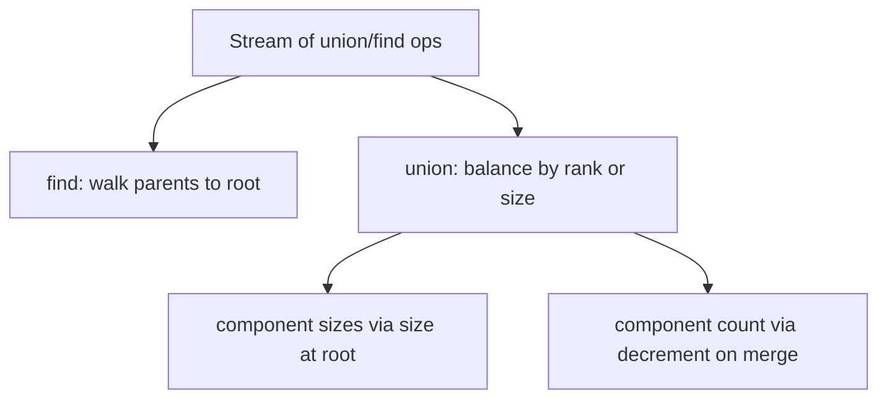

# Union by Rank — Junior Level

> **One-line summary:** Union by rank (and its twin, union by size) is the *merge-side* optimization of a Disjoint Set Union: when you join two trees, you always attach the **shorter / smaller** tree under the **taller / larger** one, which keeps trees flat and pushes every operation toward `O(log n)` on its own — and toward effectively constant time `O(α(n))` once you combine it with path compression.

---

## Table of Contents

1. [Introduction](#introduction)
2. [Prerequisites](#prerequisites)
3. [Glossary](#glossary)
4. [Core Concepts](#core-concepts)
5. [Big-O Summary](#big-o-summary)
6. [Real-World Analogies](#real-world-analogies)
7. [Pros & Cons](#pros--cons)
8. [Step-by-Step Walkthrough](#step-by-step-walkthrough)
9. [Code Examples](#code-examples)
10. [Coding Patterns](#coding-patterns)
11. [Error Handling](#error-handling)
12. [Performance Tips](#performance-tips)
13. [Best Practices](#best-practices)
14. [Edge Cases & Pitfalls](#edge-cases--pitfalls)
15. [Common Mistakes](#common-mistakes)
16. [Cheat Sheet](#cheat-sheet)
17. [Visual Animation](#visual-animation)
18. [Summary](#summary)
19. [Further Reading](#further-reading)

---

## Introduction

A **Disjoint Set Union** (DSU, also called **Union-Find**) keeps a collection of elements partitioned into non-overlapping groups. It answers two questions blazingly fast:

- **`find(x)`** — which group is `x` in? (returns a representative "root")
- **`union(x, y)`** — merge the groups that contain `x` and `y`.

The basic version stores each element's **parent** in an array; the root of a group is its representative. The problem is the `union` step. If you join trees *carelessly* — always making `x`'s root the child of `y`'s root, say — you can build a long thin chain:

```
1 → 2 → 3 → 4 → 5 → … → n
```

Now `find(1)` has to walk the whole chain: `O(n)`. Every operation degrades to linear time, and the whole point of DSU is lost.

**Union by rank** fixes this on the *merge side*. The idea is one sentence: **always hang the shorter tree under the taller one.** A short tree gains a new root above it without getting any taller; a tall tree absorbs a short one without growing. Trees stay bushy and shallow.

Its twin, **union by size**, uses the same idea with a different yardstick: **hang the smaller tree (fewer nodes) under the larger one.** Both keep height at `O(log n)`. Union by size has a bonus — it tracks the number of elements in each group, which you often want anyway (component sizes, percolation, weighted graphs).

This is one of two classic DSU optimizations. The other is **path compression** (a *find-side* trick covered in the sibling topic). Used together they give the famous result: amortized **`O(α(n))`** per operation, where `α` is the inverse Ackermann function — a number so slow-growing it is **≤ 4** for any input you could physically store.

---

## Prerequisites

Before reading this file you should be comfortable with:

- **Arrays and indexing** — DSU is built on a `parent[]` array plus a `rank[]` or `size[]` array.
- **The basic Union-Find idea** — `find` walks up parent pointers to a root; `union` links two roots. (See the sibling `01-union-find` topic.)
- **Trees and "height"** — height = the longest root-to-leaf path measured in edges.
- **Recursion or loops** — `find` is naturally a loop or a short recursion.
- **Big-O notation** — `O(1)`, `O(log n)`, and the idea of *amortized* cost.

Helpful but not required:

- A first look at **path compression** (the sibling `02-path-compression` topic), since the headline result needs both optimizations together.

---

## Glossary

| Term | Meaning |
|------|---------|
| **DSU / Union-Find** | A structure maintaining a partition of elements into disjoint sets with `find` and `union`. |
| **Representative / root** | The element that stands for a whole set; `find(x)` returns it. |
| **`parent[x]`** | The element directly above `x`. A root is its own parent: `parent[r] == r`. |
| **Naive union** | Linking one root under the other arbitrarily, with no balancing. Can build `O(n)`-tall chains. |
| **Rank** | A small integer per root that is an **upper bound on the tree's height**. Used to decide which root becomes the child. |
| **Size** | The number of elements in a set, stored at the root. Used by union-by-size to decide linking. |
| **Union by rank** | Attach the lower-rank root under the higher-rank one; bump rank only on a tie. |
| **Union by size** | Attach the smaller-size root under the larger one; always add the sizes. |
| **Path compression** | A find-side optimization (sibling topic) that re-points nodes directly to the root. |
| **α(n) (inverse Ackermann)** | An extremely slow-growing function; `α(n) ≤ 4` for all practical `n`. The amortized cost per op with rank + compression. |
| **Tie-break** | When two roots have equal rank, you must pick one as the new root *and* increment its rank by 1. |

---

## Core Concepts

### 1. The naive-union problem

A DSU starts with each element in its own set, so `parent[x] = x` for all `x`. A naive `union(a, b)` does:

```
ra = find(a); rb = find(b)
parent[ra] = rb            # always hang ra under rb — arbitrary!
```

Repeating `union(0,1), union(1,2), union(2,3), …` builds a chain of height `n−1`. Now `find` is `O(n)`. We need a *rule* for which root becomes the child.

### 2. Union by rank

Keep an integer **`rank[r]`** for every root, initialized to `0`. Rank is an **upper bound on the height** of the tree rooted at `r`. The merge rule:

```
union(a, b):
    ra = find(a); rb = find(b)
    if ra == rb: return                # already together
    if rank[ra] < rank[rb]:
        parent[ra] = rb                # shorter ra goes under rb
    else if rank[ra] > rank[rb]:
        parent[rb] = ra                # shorter rb goes under ra
    else:                              # equal ranks — tie
        parent[rb] = ra
        rank[ra] += 1                  # the survivor grows by exactly 1
```

Why does rank only increase on a **tie**? If one root is strictly taller, the shorter tree slides *underneath* it without poking above the existing top, so the height does not change — and neither should the rank. Only when both are the same height does adding one under the other create a tree that is exactly one level taller.

### 3. Union by size

Keep **`size[r]`** = number of elements in the set rooted at `r`, initialized to `1`. The merge rule attaches the **smaller** tree under the **larger**:

```
union(a, b):
    ra = find(a); rb = find(b)
    if ra == rb: return
    if size[ra] < size[rb]:
        ra, rb = rb, ra                # ensure ra is the larger
    parent[rb] = ra
    size[ra] += size[rb]               # the survivor absorbs the other
```

Union by size never needs a tie-break increment — you simply add the sizes, which is always correct. And you get **component sizes for free**: `size[find(x)]` is the number of elements in `x`'s group.

### 4. Rank vs size — both keep height `O(log n)`

Either rule guarantees a tree of `k` nodes has height `O(log k)`. The intuition (proved formally in [`professional.md`](./professional.md)): a node only gains depth when its tree is merged under a tree that is **at least as big / as tall**, so the total size at least *doubles* each time a node sinks one level. After `d` sinkings the tree has `≥ 2^d` nodes, hence `d ≤ log₂ n`.

### 5. The headline: rank + path compression ⇒ O(α(n))

Balanced merging alone gives `O(log n)`. **Path compression** alone also gives near-log behavior. **Combined**, they give amortized **`O(α(n))`** per operation — the celebrated Tarjan–van Leeuwen bound. `α(n)` (the inverse Ackermann function) grows so slowly that `α(n) ≤ 4` for every `n` up to roughly `2^65536`, i.e. for any input that fits in this universe. So in practice, each `find`/`union` is **effectively constant time**.

One subtlety worth meeting early: **with path compression, rank is only an *upper bound* on height, not the exact height.** Compression flattens trees (lowering real heights), but we never *decrease* ranks. That is fine — rank is still a valid upper bound, the merge rule still keeps trees balanced, and fixing ranks would cost more than it saves. We just let ranks drift slightly above the true height.

---

## Big-O Summary

`n` = number of elements; bounds are amortized where noted.

| Variant | `find` | `union` | Tree height | Notes |
|---------|--------|---------|-------------|-------|
| Naive union, no compression | `O(n)` | `O(n)` | up to `n−1` | Degenerate chains. |
| **Union by rank** alone | `O(log n)` | `O(log n)` | `O(log n)` | Balanced merges. |
| **Union by size** alone | `O(log n)` | `O(log n)` | `O(log n)` | Same bound; gives sizes for free. |
| Path compression alone | `O(log n)` am. | `O(log n)` am. | varies | Find-side only (sibling topic). |
| **Rank/size + path compression** | **`O(α(n))`** am. | **`O(α(n))`** am. | tiny | The standard production DSU. |
| Space | — | — | — | `O(n)`: `parent[]` + `rank[]` *or* `size[]`. |

---

## Real-World Analogies

| Concept | Analogy |
|---------|---------|
| Union by rank | Two company org charts merge. You put the org with the **shorter** management ladder under the org with the **taller** one — that way the combined chain of command never gets deeper than it already was. |
| Tie-break rank bump | If both companies have ladders of the same depth, merging adds exactly one new layer at the top, so the depth grows by one. |
| Union by size | Two clubs merge their member lists. The **smaller** club's members all get a new president (the bigger club's). Counting heads is easy — just add the two membership totals. |
| Rank is an *upper bound* | A "max ceiling height" sticker on a building. Renovations (path compression) may lower the actual ceilings, but the sticker still tells you a safe upper limit. |
| α(n) ≤ 4 | A speed limit so high that no car ever built — and none that ever will be built — can reach it. For any real input, you are always "under the limit." |

Where the analogy breaks: real org charts care *who* is on top; in DSU any root works equally well, so we pick purely to keep the tree shallow.

---

## Pros & Cons

| Pros | Cons |
|------|------|
| Keeps tree height `O(log n)` with one extra array. | You must store an extra `rank[]` or `size[]` array. |
| Combined with path compression gives near-constant `O(α(n))`. | You must remember the **tie-break** (rank +1) or balancing silently degrades. |
| Union by size gives **component sizes for free**. | Mixing rank and size semantics in one codebase is a classic bug. |
| Tiny code — about 20 lines for a full optimized DSU. | Not a sorted structure; you cannot list a set's members without scanning. |
| Excellent cache behavior (flat integer arrays). | Plain DSU does not support efficient **un-union** (deletion). |

**When to use:** connectivity queries, Kruskal's MST, cycle detection in undirected graphs, counting connected components, percolation, grouping/equivalence problems, "accounts merge," image labeling.

**When NOT to use:** when you need to *delete* edges over time (use link-cut trees or offline tricks), or when you need ordered iteration of a set's members.

---

## Step-by-Step Walkthrough

Start with 6 singletons `{0},{1},{2},{3},{4},{5}`. We trace **union by rank** (ranks all start at `0`).

```
init:  parent = [0,1,2,3,4,5]   rank = [0,0,0,0,0,0]

union(0,1):  ranks equal (0,0) → parent[1]=0, rank[0]=1
             parent = [0,0,2,3,4,5]   rank = [1,0,0,0,0,0]

union(2,3):  ranks equal (0,0) → parent[3]=2, rank[2]=1
             parent = [0,0,2,2,4,5]   rank = [1,0,1,0,0,0]

union(0,2):  rank[0]=1 == rank[2]=1 → parent[2]=0, rank[0]=2
             parent = [0,0,0,2,4,5]   rank = [2,0,1,0,0,0]
             (tree under 0:  0 → {1, 2 → 3}, height 2)

union(4,0):  rank[4]=0 < rank[0]=2 → parent[4]=0  (no rank change)
             parent = [0,0,0,2,0,5]   rank = [2,0,1,0,0,0]
```

Notice `union(4,0)` did **not** bump any rank: the small tree slid under the tall one without making it taller. Now the same sequence with **union by size** (sizes start at `1`):

```
init:  parent = [0,1,2,3,4,5]   size = [1,1,1,1,1,1]

union(0,1):  size 1 vs 1 → parent[1]=0, size[0]=2
union(2,3):  size 1 vs 1 → parent[3]=2, size[2]=2
union(0,2):  size[0]=2 vs size[2]=2 → parent[2]=0, size[0]=4
union(4,0):  size[4]=1 < size[0]=4 → parent[4]=0, size[0]=5

final: parent = [0,0,0,2,0,5]   size = [5,1,4,1,1,1]
```

Both end with the **same shape**, but union by size also tells you the component containing `0` has **5 elements** (`size[find(0)] = size[0] = 5`).

---

## Code Examples

### Example A: Union by Rank

#### Go

```go
package main

import "fmt"

type DSU struct {
    parent []int
    rank   []int // upper bound on tree height
}

func NewDSU(n int) *DSU {
    d := &DSU{parent: make([]int, n), rank: make([]int, n)}
    for i := range d.parent {
        d.parent[i] = i // each element is its own root
    }
    return d
}

func (d *DSU) Find(x int) int {
    for d.parent[x] != x { // walk to the root
        x = d.parent[x]
    }
    return x
}

func (d *DSU) Union(a, b int) {
    ra, rb := d.Find(a), d.Find(b)
    if ra == rb {
        return
    }
    switch {
    case d.rank[ra] < d.rank[rb]:
        d.parent[ra] = rb // shorter under taller
    case d.rank[ra] > d.rank[rb]:
        d.parent[rb] = ra
    default: // equal ranks: tie-break
        d.parent[rb] = ra
        d.rank[ra]++
    }
}

func main() {
    d := NewDSU(6)
    d.Union(0, 1)
    d.Union(2, 3)
    d.Union(0, 2)
    d.Union(4, 0)
    fmt.Println(d.Find(3) == d.Find(4)) // true — 3 and 4 share a root
    fmt.Println(d.Find(5) == d.Find(0)) // false — 5 is alone
}
```

#### Java

```java
public class DSURank {
    private final int[] parent;
    private final int[] rank; // upper bound on tree height

    public DSURank(int n) {
        parent = new int[n];
        rank = new int[n];
        for (int i = 0; i < n; i++) parent[i] = i;
    }

    public int find(int x) {
        while (parent[x] != x) x = parent[x];
        return x;
    }

    public void union(int a, int b) {
        int ra = find(a), rb = find(b);
        if (ra == rb) return;
        if (rank[ra] < rank[rb]) {
            parent[ra] = rb;
        } else if (rank[ra] > rank[rb]) {
            parent[rb] = ra;
        } else {
            parent[rb] = ra;
            rank[ra]++;
        }
    }

    public static void main(String[] args) {
        DSURank d = new DSURank(6);
        d.union(0, 1);
        d.union(2, 3);
        d.union(0, 2);
        d.union(4, 0);
        System.out.println(d.find(3) == d.find(4)); // true
        System.out.println(d.find(5) == d.find(0)); // false
    }
}
```

#### Python

```python
class DSURank:
    def __init__(self, n: int):
        self.parent = list(range(n))
        self.rank = [0] * n  # upper bound on tree height

    def find(self, x: int) -> int:
        while self.parent[x] != x:
            x = self.parent[x]
        return x

    def union(self, a: int, b: int) -> None:
        ra, rb = self.find(a), self.find(b)
        if ra == rb:
            return
        if self.rank[ra] < self.rank[rb]:
            self.parent[ra] = rb
        elif self.rank[ra] > self.rank[rb]:
            self.parent[rb] = ra
        else:
            self.parent[rb] = ra
            self.rank[ra] += 1


if __name__ == "__main__":
    d = DSURank(6)
    d.union(0, 1)
    d.union(2, 3)
    d.union(0, 2)
    d.union(4, 0)
    print(d.find(3) == d.find(4))  # True
    print(d.find(5) == d.find(0))  # False
```

### Example B: Union by Size (with free component sizes)

#### Go

```go
package main

import "fmt"

type DSUSize struct {
    parent []int
    size   []int // number of elements; meaningful only at a root
}

func NewDSUSize(n int) *DSUSize {
    d := &DSUSize{parent: make([]int, n), size: make([]int, n)}
    for i := range d.parent {
        d.parent[i] = i
        d.size[i] = 1
    }
    return d
}

func (d *DSUSize) Find(x int) int {
    for d.parent[x] != x {
        x = d.parent[x]
    }
    return x
}

func (d *DSUSize) Union(a, b int) {
    ra, rb := d.Find(a), d.Find(b)
    if ra == rb {
        return
    }
    if d.size[ra] < d.size[rb] {
        ra, rb = rb, ra // ra is now the larger
    }
    d.parent[rb] = ra
    d.size[ra] += d.size[rb] // absorb the smaller
}

func (d *DSUSize) ComponentSize(x int) int {
    return d.size[d.Find(x)]
}

func main() {
    d := NewDSUSize(6)
    d.Union(0, 1)
    d.Union(2, 3)
    d.Union(0, 2)
    d.Union(4, 0)
    fmt.Println(d.ComponentSize(3)) // 5
    fmt.Println(d.ComponentSize(5)) // 1
}
```

#### Java

```java
public class DSUSize {
    private final int[] parent;
    private final int[] size;

    public DSUSize(int n) {
        parent = new int[n];
        size = new int[n];
        for (int i = 0; i < n; i++) {
            parent[i] = i;
            size[i] = 1;
        }
    }

    public int find(int x) {
        while (parent[x] != x) x = parent[x];
        return x;
    }

    public void union(int a, int b) {
        int ra = find(a), rb = find(b);
        if (ra == rb) return;
        if (size[ra] < size[rb]) { int t = ra; ra = rb; rb = t; }
        parent[rb] = ra;
        size[ra] += size[rb];
    }

    public int componentSize(int x) {
        return size[find(x)];
    }

    public static void main(String[] args) {
        DSUSize d = new DSUSize(6);
        d.union(0, 1);
        d.union(2, 3);
        d.union(0, 2);
        d.union(4, 0);
        System.out.println(d.componentSize(3)); // 5
        System.out.println(d.componentSize(5)); // 1
    }
}
```

#### Python

```python
class DSUSize:
    def __init__(self, n: int):
        self.parent = list(range(n))
        self.size = [1] * n  # meaningful only at a root

    def find(self, x: int) -> int:
        while self.parent[x] != x:
            x = self.parent[x]
        return x

    def union(self, a: int, b: int) -> None:
        ra, rb = self.find(a), self.find(b)
        if ra == rb:
            return
        if self.size[ra] < self.size[rb]:
            ra, rb = rb, ra  # ra is the larger
        self.parent[rb] = ra
        self.size[ra] += self.size[rb]

    def component_size(self, x: int) -> int:
        return self.size[self.find(x)]


if __name__ == "__main__":
    d = DSUSize(6)
    d.union(0, 1)
    d.union(2, 3)
    d.union(0, 2)
    d.union(4, 0)
    print(d.component_size(3))  # 5
    print(d.component_size(5))  # 1
```

**What they do:** both build the partition `{0,1,2,3,4}` and `{5}`. Union by size additionally reports the size of any element's component in `O(find)` time.
**Run:** `go run main.go` | `javac DSURank.java && java DSURank` | `python dsu.py`

---

## Coding Patterns

### Pattern 1: Count connected components

Start a counter at `n` and decrement it whenever a `union` actually merges two distinct sets.

```python
class CountingDSU(DSUSize):
    def __init__(self, n):
        super().__init__(n)
        self.components = n

    def union(self, a, b):
        ra, rb = self.find(a), self.find(b)
        if ra == rb:
            return
        # ... (balanced merge as before) ...
        if self.size[ra] < self.size[rb]:
            ra, rb = rb, ra
        self.parent[rb] = ra
        self.size[ra] += self.size[rb]
        self.components -= 1   # one fewer group
```

### Pattern 2: Cycle detection in an undirected graph

For each edge `(u, v)`: if `find(u) == find(v)` *before* the union, the edge closes a cycle.

```python
def has_cycle(n, edges):
    dsu = DSURank(n)
    for u, v in edges:
        if dsu.find(u) == dsu.find(v):
            return True
        dsu.union(u, v)
    return False
```

### Pattern 3: Largest component so far

With union by size, track a running maximum after each union: `best = max(best, size[ra])`.



---

## Error Handling

| Error | Cause | Fix |
|-------|-------|-----|
| `IndexOutOfRange` in `find` | An element id `≥ n` or `< 0`. | Validate ids against `[0, n)` at the API boundary. |
| Trees grow tall despite "balancing" | Forgot the **tie-break** rank bump, or compared the wrong roots. | On equal rank, set one parent *and* `rank[survivor]++`. Always balance the **roots**, never the input nodes. |
| `size[x]` returns a wrong count | Read `size[x]` instead of `size[find(x)]`. | `size` is only valid at a root; always go through `find`. |
| Rank and size both used inconsistently | Half the code balances by rank, half by size. | Pick one scheme per DSU and name the array accordingly. |
| Integer overflow in `size[ra] += size[rb]` | Huge `n` near 32-bit limits. | Use 64-bit for the size array if `n` can exceed ~2×10⁹. |

---

## Performance Tips

- **Always pair balancing with path compression** for production code — that is what unlocks `O(α(n))`.
- **Prefer union by size** when you need component counts anyway — you avoid a separate bookkeeping pass.
- **Use flat integer arrays**, not node objects. DSU is one of the most cache-friendly structures when stored as `int[]`.
- **Initialize once.** `parent[i] = i` and `rank[i] = 0` / `size[i] = 1` are `O(n)` and happen a single time.
- **Inline `find`** in hot loops; the loop body is a few instructions.

---

## Best Practices

- Write a brute-force "relabel all members" DSU first, then test your balanced version against it on random union sequences.
- After a batch of unions, assert in tests that every tree's height is `≤ log₂ n` (cheap sanity check that balancing works).
- Document at the top whether the DSU balances by **rank** or **size**, and never mix the two arrays.
- Keep `rank` as a small type (`byte`/`uint8` is enough — max rank is ~`log₂ n ≤ 64`) when memory matters; keep `size` as a wide integer.
- Treat `find` as read-only conceptually, even though path compression mutates internally.

---

## Edge Cases & Pitfalls

- **`union(x, x)`** — same element; `find` returns equal roots, the early `return` handles it.
- **Already-joined elements** — `find(a) == find(b)`; do nothing, do **not** bump any rank or size.
- **Singletons** — rank `0`, size `1`; perfectly valid, nothing special needed.
- **Self-loops / duplicate edges** in graph problems — harmless; they just hit the early `return`.
- **Reading `rank` as exact height** — wrong once path compression is added; rank is only an *upper bound*.
- **Huge `n`** — watch 32-bit overflow on `size` sums; rank never overflows a small int.

---

## Common Mistakes

1. **Forgetting the tie-break.** On equal rank you must increment the survivor's rank. Skip it and trees slowly grow tall.
2. **Balancing the input nodes instead of the roots.** Compare `rank[find(a)]` vs `rank[find(b)]`, never `rank[a]` vs `rank[b]`.
3. **Bumping rank on every union.** Rank increases *only* on a tie; bumping always makes ranks meaningless and inflated.
4. **Mixing rank and size logic.** Adding sizes but comparing ranks (or vice versa) corrupts the balancing.
5. **Reading `size[x]` without `find`.** Only the root holds the correct size.
6. **Trying to "fix" rank after path compression.** Unnecessary and costly; an upper bound is all you need.

---

## Cheat Sheet

| Decision | Union by **rank** | Union by **size** |
|----------|-------------------|-------------------|
| Extra array | `rank[]` (init `0`) | `size[]` (init `1`) |
| Who becomes child? | lower rank under higher | smaller size under larger |
| On a tie | pick one, `rank[survivor]++` | just add sizes (no special case) |
| Bonus | smallest array (`byte` ok) | component sizes for free |
| Height bound (alone) | `O(log n)` | `O(log n)` |
| With path compression | `O(α(n))` amortized | `O(α(n))` amortized |

Merge rule in one line:

```
balance: attach the SHORTER/SMALLER root under the TALLER/LARGER root
rank tie ⇒ winner's rank += 1     |     size ⇒ winner's size += loser's size
```

α(n) reminder: **≤ 4 for any n in the physical universe** — treat it as a constant.

---

## Visual Animation

> See [`animation.html`](./animation.html) for an interactive visual animation of union-by-rank and union-by-size merges.
>
> The animation demonstrates:
> - Two DSU trees merging, with the chosen child root highlighted
> - Live `rank[]` / `size[]` labels updating on each union
> - A toggle between **"by rank"** and **"by size"** modes
> - Side-by-side `parent[]` and `rank[]`/`size[]` array views
> - Step narration and a Reset button

---

## Summary

Union by rank and union by size are the *merge-side* discipline of DSU: always hang the shorter/smaller tree under the taller/larger one. Either rule alone bounds tree height at `O(log n)`. Union by size has the practical edge of handing you component sizes for free. Combine balancing with path compression and you reach the legendary `O(α(n))` amortized cost — effectively constant for any real input. Remember the two rules that beginners trip on: **balance the roots, and bump rank only on a tie.**

---

## Further Reading

- *Introduction to Algorithms* (CLRS), Chapter 21 — "Data Structures for Disjoint Sets."
- Tarjan, R. E. & van Leeuwen, J. (1984) — "Worst-case Analysis of Set Union Algorithms."
- The sibling topics `01-union-find` (basics) and `02-path-compression` (the find-side optimization).
- cp-algorithms.com — "Disjoint Set Union" — clear walkthroughs of rank and size variants.
- *The Art of Computer Programming, Vol. 1* (Knuth) — early treatment of equivalence algorithms.
