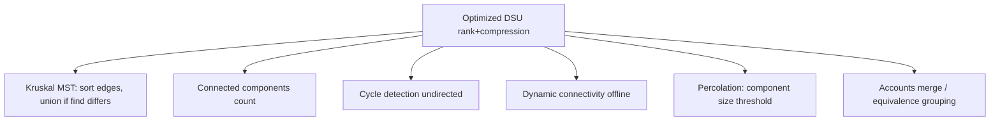

# Union by Rank — Middle Level

> **Focus:** Why rank bounds height by `log n`, what happens to rank once path compression enters the picture, how rank and size compare, and how the fully optimized DSU plugs into Kruskal, dynamic connectivity, and weighted/parity variants.

---

## Table of Contents

1. [Introduction](#introduction)
2. [Deeper Concepts](#deeper-concepts)
3. [Comparison with Alternatives](#comparison-with-alternatives)
4. [Advanced Patterns](#advanced-patterns)
5. [Graph and Tree Applications](#graph-and-tree-applications)
6. [Algorithmic Integration](#algorithmic-integration)
7. [Code Examples](#code-examples)
8. [Error Handling](#error-handling)
9. [Performance Analysis](#performance-analysis)
10. [Best Practices](#best-practices)
11. [Visual Animation](#visual-animation)
12. [Summary](#summary)

---

## Introduction

At junior level union by rank is "hang the shorter tree under the taller one." At middle level the *engineering* questions appear:

- *Why* exactly does rank bound the tree height by `log₂ n`?
- What does rank **mean** after path compression flattens trees — and why don't we repair it?
- When do you reach for rank, and when for size?
- How does the fully optimized DSU drop into Kruskal's MST and into dynamic-connectivity loops?
- How do you extend the same balancing idea to **weighted DSU** (DSU with parity / offsets)?

These distinctions are what separate "I memorized the snippet" from "I can adapt it under pressure."

---

## Deeper Concepts

### Why rank bounds height by `log n`

The key lemma: **a root of rank `r` is the root of a tree containing at least `2^r` nodes** (when balancing alone is used, before any compression).

*Sketch.* Rank starts at `0`, where the tree has `2^0 = 1` node. A rank only increases from `r` to `r+1` during a **tie**, i.e. when two trees *both* of rank `r` merge. By induction each had `≥ 2^r` nodes, so the merged tree has `≥ 2·2^r = 2^{r+1}` nodes — and that is exactly when the rank becomes `r+1`. Hence the invariant holds.

Consequently, if the whole structure has `n` nodes, no rank can exceed `log₂ n` (a rank `r` would force `2^r ≤ n`). Since rank is an upper bound on height, **every tree has height `≤ log₂ n`**, so `find` is `O(log n)`. Union by size gives the same bound by the symmetric "the tree at least doubles whenever a node sinks a level" argument.

### Rank under path compression

Path compression rewires the nodes along a `find` path to point straight at the root. This **lowers actual heights** but we deliberately do **not** decrement ranks. Three facts make this fine:

1. **Rank stays a valid upper bound.** Compression only ever moves nodes *closer* to the root, so the true height can only shrink relative to the rank. The inequality `height ≤ rank` is preserved.
2. **The merge rule still works.** Union by rank only ever *reads* ranks to decide direction and only *writes* a rank on a tie. Neither depends on rank equaling the exact height — only on rank being a consistent, monotone "weight."
3. **Repairing ranks would be expensive.** To keep rank exact you would have to recompute subtree heights after every compression — an `O(n)`-ish operation that destroys the whole speedup. The amortized analysis (see [`professional.md`](./professional.md)) is specifically designed around ranks that *over*-estimate height, so leaving them alone is not just acceptable, it is the basis of the proof.

So: **with compression, treat rank as a monotone potential, not as a height.** That mental model removes a lot of confusion.

### Rank vs size — what actually differs

Both bound height by `log n` and both reach `O(α(n))` with compression. The differences are practical:

- **Tie handling.** Rank needs an explicit `+1` on equal rank; size never has a special case (you always add).
- **What you get for free.** Size hands you `size[find(x)]` = component cardinality. Rank gives you nothing extra — rank is *not* a count.
- **Memory.** Rank fits in a byte (max ~64). Size needs a full integer (up to `n`).
- **After compression.** Rank drifts above the true height (harmless). Size stays **exactly correct** because compression never moves a node out of its set, so cardinality is unchanged.

A useful rule of thumb: **default to union by size** unless you are squeezing memory, because "component size" is the most commonly needed extra fact. Use rank when you want the smallest possible auxiliary array.

### A subtlety: rank is not even an upper bound on *count*

Beginners sometimes assume `2^rank ≈ size`. With compression that is wrong in both directions: rank can exceed `log₂(size)` (because compression shrank the tree but not the rank), and a tree can have far more than `2^rank` nodes is impossible — that inequality `size ≥ 2^rank` holds only *without* compression. Once compression runs, only the safe direction survives: rank remains an upper bound on **height**, nothing more.

---

## Comparison with Alternatives

| Attribute | Naive union | Union by rank | Union by size | + Path compression |
|-----------|-------------|---------------|---------------|--------------------|
| `find` worst case | `O(n)` | `O(log n)` | `O(log n)` | `O(α(n))` amortized |
| `union` worst case | `O(n)` | `O(log n)` | `O(log n)` | `O(α(n))` amortized |
| Extra array | none | `rank[]` (byte) | `size[]` (int) | one of the two |
| Tie-break needed | n/a | **yes** (`rank+1`) | no | inherits chosen scheme |
| Component size for free | no | no | **yes** | yes (if size) |
| Rank/size after compression | n/a | upper bound on height | exact cardinality | as above |
| Typical use | never (teaching) | memory-tight DSU | default DSU | production DSU |

**Choose union by rank when:** memory is tight and you do not need component counts.
**Choose union by size when:** you want component cardinalities, "largest component," percolation thresholds, or weighted-merge heuristics — i.e. most of the time.
**Always add path compression** unless you specifically need ranks to stay exact (rare; e.g. some offline analyses).

---

## Advanced Patterns

### Pattern: Full optimized DSU (rank + compression)

The canonical production structure. `find` compresses; `union` balances by rank.

(See [Code Examples](#code-examples) for the three-language version.)

### Pattern: Weighted DSU / DSU with parity (offsets)

Sometimes each edge carries a *relation*, not just "same set." Classic cases:

- **Parity DSU:** elements are colored, edges say "u and v are different colors." Detect contradictions (odd cycles → not bipartite).
- **Weighted DSU:** edges say "value(u) − value(v) = w." Answer "what is value(u) − value(v)?" if they are connected.

The trick: store a `rel[x]` alongside `parent[x]` meaning "relation of `x` to its parent." During `find` with compression, **accumulate** the relation along the path; during `union`, set the new edge's relation so the constraint holds. Balancing by rank/size still keeps the path short. Parity is just weighted DSU mod 2.

```python
class ParityDSU:
    def __init__(self, n):
        self.parent = list(range(n))
        self.rank = [0] * n
        self.rel = [0] * n   # parity of x relative to its parent (0 or 1)

    def find(self, x):
        if self.parent[x] == x:
            return x, 0
        root, p = self.find(self.parent[x])
        self.rel[x] ^= p          # accumulate parity, then compress
        self.parent[x] = root
        return root, self.rel[x]

    def union(self, a, b, diff):  # assert color(a) xor color(b) == diff
        ra, pa = self.find(a)
        rb, pb = self.find(b)
        if ra == rb:
            return (pa ^ pb) == diff   # consistent?
        # balance by rank, set rel so the constraint holds
        if self.rank[ra] < self.rank[rb]:
            ra, rb, pa, pb = rb, ra, pb, pa
        self.parent[rb] = ra
        self.rel[rb] = pa ^ pb ^ diff
        if self.rank[ra] == self.rank[rb]:
            self.rank[ra] += 1
        return True
```

The balancing logic is *identical* to plain union by rank — only the relation bookkeeping is new.

### Pattern: DSU with rollback (no compression)

If you need to *undo* unions (e.g. offline dynamic connectivity, segment-tree-on-time), you keep **union by rank/size WITHOUT path compression** and push each change onto a stack. Compression is incompatible with cheap rollback because it touches `O(path)` nodes; balanced union touches `O(1)` nodes, so each union is trivially reversible. The height stays `O(log n)` thanks to balancing — this is the rare case where you *keep* rank exact and *drop* compression on purpose.

---

## Graph and Tree Applications



### Kruskal's MST

Kruskal sorts edges by weight and adds an edge iff it connects two different components. The DSU is exactly the "different components?" oracle, and union-by-size lets you stop early once one component holds all `n` vertices.

### Dynamic connectivity

For a stream of "connect(u,v)" and "connected(u,v)?" queries (no deletions), a balanced + compressed DSU answers everything in near-constant amortized time. With deletions you need the **rollback** variant plus offline divide-and-conquer over the timeline.

---

## Algorithmic Integration

DSU appears as a subroutine wherever an algorithm groups items under an equivalence relation:

- **Kruskal's MST** — the merge oracle.
- **Image connected-component labeling** — union adjacent same-color pixels.
- **Number of provinces / friend circles** — union friends, count roots.
- **Redundant connection** — the first edge whose endpoints already share a root.
- **Smallest equivalent string** — union characters declared equivalent, then map each to the smallest member of its set.
- **Percolation** — union open neighbors; the system percolates when top and bottom virtual nodes share a root; union-by-size tracks the largest cluster.

In every case the balancing rule is the same — the only thing that changes is what you attach to the root (size, parity, offset, min-member).

---

## Code Examples

### Full optimized DSU — union by rank + path compression

#### Go

```go
package main

import "fmt"

type DSU struct {
    parent     []int
    rank       []int // upper bound on height (NOT exact after compression)
    components int
}

func NewDSU(n int) *DSU {
    d := &DSU{parent: make([]int, n), rank: make([]int, n), components: n}
    for i := range d.parent {
        d.parent[i] = i
    }
    return d
}

// Find with path compression (iterative two-pass).
func (d *DSU) Find(x int) int {
    root := x
    for d.parent[root] != root {
        root = d.parent[root]
    }
    for d.parent[x] != root { // second pass: point everything at root
        d.parent[x], x = root, d.parent[x]
    }
    return root
}

func (d *DSU) Union(a, b int) bool {
    ra, rb := d.Find(a), d.Find(b)
    if ra == rb {
        return false
    }
    if d.rank[ra] < d.rank[rb] {
        ra, rb = rb, ra
    }
    d.parent[rb] = ra // rb (rank <= ra) goes under ra
    if d.rank[ra] == d.rank[rb] {
        d.rank[ra]++ // tie-break
    }
    d.components--
    return true
}

func (d *DSU) Connected(a, b int) bool { return d.Find(a) == d.Find(b) }

func main() {
    d := NewDSU(7)
    edges := [][2]int{{0, 1}, {1, 2}, {3, 4}, {5, 6}, {0, 2}}
    for _, e := range edges {
        d.Union(e[0], e[1])
    }
    fmt.Println(d.components)        // 3: {0,1,2} {3,4} {5,6}
    fmt.Println(d.Connected(0, 2))   // true
    fmt.Println(d.Connected(0, 4))   // false
}
```

#### Java

```java
public class DSU {
    private final int[] parent;
    private final int[] rank; // upper bound on height, not exact after compression
    private int components;

    public DSU(int n) {
        parent = new int[n];
        rank = new int[n];
        components = n;
        for (int i = 0; i < n; i++) parent[i] = i;
    }

    public int find(int x) {
        int root = x;
        while (parent[root] != root) root = parent[root];
        while (parent[x] != root) { // path compression
            int next = parent[x];
            parent[x] = root;
            x = next;
        }
        return root;
    }

    public boolean union(int a, int b) {
        int ra = find(a), rb = find(b);
        if (ra == rb) return false;
        if (rank[ra] < rank[rb]) { int t = ra; ra = rb; rb = t; }
        parent[rb] = ra;
        if (rank[ra] == rank[rb]) rank[ra]++;
        components--;
        return true;
    }

    public boolean connected(int a, int b) { return find(a) == find(b); }
    public int components() { return components; }

    public static void main(String[] args) {
        DSU d = new DSU(7);
        int[][] edges = {{0, 1}, {1, 2}, {3, 4}, {5, 6}, {0, 2}};
        for (int[] e : edges) d.union(e[0], e[1]);
        System.out.println(d.components());   // 3
        System.out.println(d.connected(0, 2)); // true
        System.out.println(d.connected(0, 4)); // false
    }
}
```

#### Python

```python
import sys


class DSU:
    def __init__(self, n: int):
        self.parent = list(range(n))
        self.rank = [0] * n   # upper bound on height, not exact after compression
        self.components = n

    def find(self, x: int) -> int:
        root = x
        while self.parent[root] != root:
            root = self.parent[root]
        while self.parent[x] != root:          # path compression
            self.parent[x], x = root, self.parent[x]
        return root

    def union(self, a: int, b: int) -> bool:
        ra, rb = self.find(a), self.find(b)
        if ra == rb:
            return False
        if self.rank[ra] < self.rank[rb]:
            ra, rb = rb, ra
        self.parent[rb] = ra
        if self.rank[ra] == self.rank[rb]:
            self.rank[ra] += 1                 # tie-break
        self.components -= 1
        return True

    def connected(self, a: int, b: int) -> bool:
        return self.find(a) == self.find(b)


if __name__ == "__main__":
    sys.setrecursionlimit(1 << 25)
    d = DSU(7)
    for a, b in [(0, 1), (1, 2), (3, 4), (5, 6), (0, 2)]:
        d.union(a, b)
    print(d.components)          # 3
    print(d.connected(0, 2))     # True
    print(d.connected(0, 4))     # False
```

These use **iterative** path compression so there is no recursion-depth risk on adversarial chains.

---

## Error Handling

| Scenario | What goes wrong | Correct approach |
|----------|-----------------|------------------|
| Rank bumped on every union | Ranks inflate, balancing becomes meaningless. | Bump rank **only** when both roots' ranks are equal. |
| Compression with recursion on a deep chain | Stack overflow on `n ~ 10⁶` adversarial input. | Use the iterative two-pass `find` (shown above). |
| Component count drifts | Decremented on a no-op union. | Decrement **only** when `ra != rb`. |
| `size`/`rel` read at a non-root | Stale value; only roots carry the truth. | Always index by `find(x)`, and for weighted DSU accumulate `rel` during `find`. |
| Mixing rollback with compression | Rollback can't cheaply undo compressed paths. | For rollback, drop compression and keep union by rank/size only. |

---

## Performance Analysis

| Optimization set | `find` amortized | Practical feel at `n=10⁶`, `m=10⁶` |
|------------------|------------------|-------------------------------------|
| Naive | `O(n)` | seconds to minutes — unusable |
| Rank or size alone | `O(log n)` | tens of ms |
| Compression alone | `O(log n)` am. | tens of ms |
| **Rank/size + compression** | **`O(α(n))`** | a few ms — effectively linear in total ops |

Empirically, on `10⁶` unions and `10⁶` finds, the fully optimized DSU performs roughly **2–4 pointer reads per operation** on average — the `α(n)` factor is invisible. Rank-only and size-only versions cost a few extra reads because trees are `log n` tall instead of nearly flat.

A quick benchmark skeleton (Python):

```python
import random, time

def bench(n, m, seed=42):
    r = random.Random(seed)
    d = DSU(n)
    t = time.perf_counter()
    for _ in range(m):
        d.union(r.randrange(n), r.randrange(n))
    for _ in range(m):
        d.connected(r.randrange(n), r.randrange(n))
    return (time.perf_counter() - t) * 1000

print(f"{bench(1_000_000, 1_000_000):.1f} ms")
```

You should see the fully optimized DSU finish a 2-million-operation mix in well under a second of pure DSU work.

---

## Best Practices

- **Default to union by size + path compression**; switch to rank only to save the wider array.
- **Use iterative `find`** with two-pass compression to avoid recursion limits.
- **Track `components` inline** — it is free and answers "how many groups?" in `O(1)`.
- **Keep one balancing scheme per DSU**; name the array `rank` or `size` so reviewers can't confuse them.
- **For relations (parity/offset), reuse the exact same balancing code** and only add the `rel[]` accumulation.
- **For deletions/rollback, drop compression** and keep balanced union with an undo stack.

---

## Visual Animation

> See [`animation.html`](./animation.html) for an interactive view.
>
> The middle-level animation lets you:
> - Toggle **by rank** vs **by size** and watch the chosen child differ
> - See ranks bump only on ties, and sizes always add
> - Inspect the `parent[]` and `rank[]`/`size[]` arrays after each merge
> - Step through a Kruskal-style sequence of unions

---

## Summary

Rank bounds tree height by `log₂ n` because a rank-`r` root commands `≥ 2^r` nodes (pre-compression). Once path compression runs, rank stops equaling the height and becomes a monotone *upper bound* — and that is intentional: the `O(α(n))` analysis depends on ranks that never shrink. Union by size gives the same height bound plus free component counts, which is why it is the usual default. The same balancing skeleton extends cleanly to weighted/parity DSU and to rollback DSU. Combine balancing with compression and DSU becomes the near-constant-time backbone of Kruskal, connectivity, percolation, and a dozen equivalence-grouping problems.
