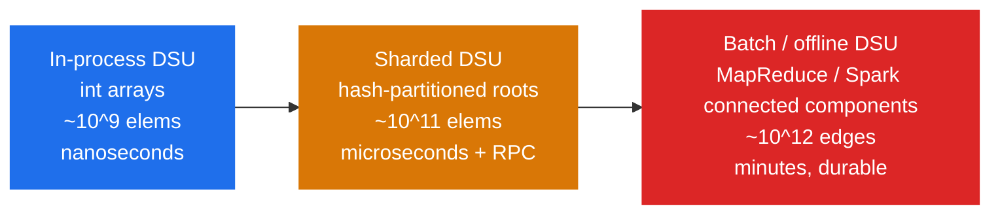

# Union by Rank — Senior Level

> A balanced, compressed DSU is the fastest connectivity oracle on a single node — but the moment you shard the partition across machines, every property you took for granted (a single global root, monotone ranks, cheap union) becomes a distributed-systems problem: which shard owns the root, how do you merge size metadata, and how do two threads link roots without corrupting the forest?

## Table of Contents
1. [Introduction](#1-introduction)
2. [System Design with Optimized DSU](#2-system-design-with-optimized-dsu)
3. [Distributed / Sharded Components](#3-distributed--sharded-components)
4. [Concurrent and Lock-Based Variants](#4-concurrent-and-lock-based-variants)
5. [Comparison at Scale](#5-comparison-at-scale)
6. [Architecture Patterns](#6-architecture-patterns)
7. [Code Examples](#7-code-examples)
8. [Observability](#8-observability)
9. [Failure Modes](#9-failure-modes)
10. [Capacity Planning](#10-capacity-planning)
11. [Summary](#11-summary)

---

## 1. Introduction

At senior level the question is no longer "should I bump rank on a tie" but "where does this partition live, who owns the roots, and what breaks when two of them try to merge concurrently or across a network?"

A balanced + compressed DSU has three properties that make it *wonderful* in-process and *awkward* at scale:

1. **It mutates on read.** `find` rewrites parent pointers (compression). Read paths are not pure — a problem for replication, snapshots, and concurrency.
2. **It has a single global root per component.** Sharding a component across machines means the root lives on exactly one shard; everyone else holds a cross-shard pointer.
3. **Union is `O(α(n))` but not associative across shards.** Locally you balance by rank/size; globally you must agree which root survives and merge the size metadata.

The senior decisions are therefore architectural: in-process vs sharded, how to merge size metadata, how to make union thread-safe without a global lock, and how to observe a structure whose whole job is to be invisible.

---

## 2. System Design with Optimized DSU

### 2.1 When a single node is enough

A balanced + compressed DSU on `n` elements needs two `int` arrays: `parent[n]` and `size[n]` (or `parent[n]` + a `byte` `rank[n]`). At `n = 10⁹` that is ~8 GB for two `int32` arrays — large but feasible on one big box. Because operations are `O(α(n))`, a single node sustains **tens of millions of union/find per second**. Reach for distribution only when:

- The element universe exceeds single-node memory.
- The partition must survive restarts (durability).
- Multiple services must query/mutate the same partition.

### 2.2 The three deployment tiers



The most expensive mistake is jumping to a distributed DSU when an in-process one behind a clean RPC façade would have served for years.

---

## 3. Distributed / Sharded Components

### 3.1 The core challenge: cross-shard roots

Partition elements across `S` shards by `shard = hash(id) % S`. Each shard stores `parent[]` and `size[]` for its own ids. A component can span shards, so `parent[x]` may point to an id owned by a **different** shard. `find` becomes a sequence of RPC hops following parent pointers across shards until it reaches a self-parent root.

This is slow and chatty. Two mitigations:

- **Root caching:** cache `(id → root, epoch)` so repeated `find` skips the hop chain. Invalidate on `union` via an epoch/version bump.
- **Path compression across shards:** after a multi-hop `find`, asynchronously re-point intermediate nodes at the discovered root (best-effort; correctness must not depend on it).

### 3.2 Merging size metadata

This is where **union by size shines over union by rank** in the distributed setting. When two roots `ra` (size `Sa`) and `rb` (size `Sb`) merge:

- The survivor is the **larger** root (fewer cross-shard re-pointings, since the smaller component's nodes are the ones whose effective root changes).
- The new size is simply `Sa + Sb` — an associative, commutative reduce. Size metadata merges cleanly under a **CRDT-style monotone counter** if you need eventual consistency.

Rank does *not* merge as cleanly: its tie-break is order-sensitive and its value carries no aggregate meaning, so distributed systems almost always pick **union by size** (a.k.a. "union by weight"). Size doubles as both the balancing key and a useful business metric (cluster cardinality).

### 3.3 Consistency model

Union is a write that touches two roots, possibly on two shards — a distributed transaction. Options:

- **Strong:** two-phase commit / a lock on the two root ids (ordered by id to avoid deadlock). Correct, slower.
- **Eventual:** log unions to a durable stream; a single reducer applies them in order to a canonical structure; shards converge. Good for analytics, not for read-your-writes connectivity.

For an authoritative "are u and v connected right now?" you need the strong path or a linearizable log.

---

## 4. Concurrent and Lock-Based Variants

### 4.1 Why naive locking hurts

Wrapping the whole DSU in one mutex serializes every `find` and `union`. Because `find` *mutates* (compression), even reads contend. Throughput caps at `1 / op` on one core.

### 4.2 Concurrent union by rank with CAS

The well-known wait-free / lock-free DSU (Anderson & Woll; Jayanti & Tarjan) keeps `find` mutating-but-safe and links roots with **compare-and-swap**:

- `find` walks parents; compression is done with CAS so a concurrent writer never loses a link.
- `union` finds both roots, decides direction by rank/size, and **CASes** the loser's parent from "self" to the winner. If the CAS fails (someone changed the root), retry from `find`.
- The rank/size update on the winner must also be done atomically (CAS or a lock on the winning root only).

This gives near-linear scaling because contention is only on the two roots involved, not the whole structure.

### 4.3 Randomized linking (union by random)

Maintaining rank/size atomically under contention adds CAS traffic. An elegant alternative for concurrent settings is **union by random index**: assign each element a random priority once; on union, the root with the **higher priority wins**, deterministically and without any mutable rank/size to update.

- No `rank[]`/`size[]` writes during union → fewer CAS conflicts.
- Expected tree height is still `O(log n)` (the random priorities behave like a treap's), so `find` stays near-log even before compression.
- Trade-off: you lose free component sizes, and the bound is *expected*, not worst-case.

This is why several lock-free DSUs use random or fixed priorities instead of rank.

### 4.4 Linearizability caveat

Concurrent DSUs are typically linearizable for `union`/`connected` *individually*, but a `connected(u,v)` that returns `false` can become `true` an instant later — connectivity is monotone (edges are only added), so a `false` is a point-in-time fact, a `true` is permanent. Designs exploit this monotonicity heavily.

---

## 5. Comparison at Scale

| Approach | union | connected | Concurrency | Size metadata | When |
|----------|-------|-----------|-------------|---------------|------|
| In-proc rank + compression | `O(α(n))` | `O(α(n))` | single mutex | optional | Default, single node. |
| In-proc size + compression | `O(α(n))` | `O(α(n))` | single mutex | **free** | Default when you need counts. |
| Lock-free CAS (rank/size) | `O(α(n))` exp. | `O(α(n))` | scales well | atomic updates | Many cores, hot partition. |
| Lock-free union-by-random | `O(log n)` exp. | `O(log n)` exp. | scales best | none | Concurrency over exact counts. |
| Sharded DSU (by size) | RPC + `O(α)` | multi-hop RPC | cross-shard txn | merges cleanly | Universe exceeds one node. |
| Offline batch (Spark/MapReduce) | n/a | n/a | massively parallel | aggregated | Trillion-edge static graphs. |

At scale, **union by size dominates** because its balancing key is also a mergeable aggregate; union by rank is preferred only in single-node, memory-tight code.

---

## 6. Architecture Patterns

### 6.1 DSU behind a connectivity service

```
   connect(u,v) / connected(u,v)?
            |
   +--------v---------+        +------------------+
   |  DSU service     |  --->  |  durable union   |
   |  (size+compress) |        |  log (Kafka/WAL) |
   +--------+---------+        +------------------+
            |
       periodic snapshot of parent[] + size[]
```

The union log is the source of truth; the in-memory forest is a materialized view rebuilt by replaying the log. Because edges are only added, replay is deterministic and order-independent for the final partition (the *shape* may differ, the partition does not).

### 6.2 Offline connected components (incremental + recompute)

For analytics over huge static graphs, don't maintain a live DSU — run a batch connected-components job (label propagation or distributed union-find, e.g. the "two-phase" / "alternating" algorithms) and store the resulting `id → component` map. Union by size guides which labels win, minimizing relabeling.

### 6.3 Time-travel / rollback

For "what components existed at time T?" keep union by rank/size **without compression** plus an undo stack, and use offline divide-and-conquer over the time axis. Compression is dropped because it makes unions non-trivially reversible.

---

## 7. Code Examples

### 7.1 Go — thread-safe DSU with a single mutex (baseline)

```go
package dsu

import "sync"

type DSU struct {
    mu     sync.Mutex
    parent []int
    size   []int // union by size; doubles as component cardinality
}

func New(n int) *DSU {
    d := &DSU{parent: make([]int, n), size: make([]int, n)}
    for i := range d.parent {
        d.parent[i] = i
        d.size[i] = 1
    }
    return d
}

// findLocked assumes the mutex is held; compresses paths.
func (d *DSU) findLocked(x int) int {
    root := x
    for d.parent[root] != root {
        root = d.parent[root]
    }
    for d.parent[x] != root {
        d.parent[x], x = root, d.parent[x]
    }
    return root
}

func (d *DSU) Union(a, b int) bool {
    d.mu.Lock()
    defer d.mu.Unlock()
    ra, rb := d.findLocked(a), d.findLocked(b)
    if ra == rb {
        return false
    }
    if d.size[ra] < d.size[rb] {
        ra, rb = rb, ra
    }
    d.parent[rb] = ra
    d.size[ra] += d.size[rb]
    return true
}

func (d *DSU) Connected(a, b int) bool {
    d.mu.Lock()
    defer d.mu.Unlock()
    return d.findLocked(a) == d.findLocked(b)
}

func (d *DSU) ComponentSize(x int) int {
    d.mu.Lock()
    defer d.mu.Unlock()
    return d.size[d.findLocked(x)]
}
```

### 7.2 Java — lock-free union by random priority (no mutable rank/size)

```java
import java.util.concurrent.atomic.AtomicIntegerArray;
import java.util.SplittableRandom;

/** Lock-free DSU using random priorities; root with higher priority wins. */
public final class LockFreeDSU {
    private final AtomicIntegerArray parent;
    private final int[] prio; // fixed random priority, set once, never mutated

    public LockFreeDSU(int n) {
        parent = new AtomicIntegerArray(n);
        prio = new int[n];
        SplittableRandom rng = new SplittableRandom();
        for (int i = 0; i < n; i++) {
            parent.set(i, i);
            prio[i] = rng.nextInt();
        }
    }

    public int find(int x) {
        while (true) {
            int p = parent.get(x);
            if (p == x) return x;
            int pp = parent.get(p);
            // path halving via CAS (best-effort)
            parent.compareAndSet(x, p, pp);
            x = pp;
        }
    }

    public boolean union(int a, int b) {
        while (true) {
            int ra = find(a), rb = find(b);
            if (ra == rb) return false;
            // deterministic winner: higher priority (ties broken by id)
            if (prio[ra] < prio[rb] || (prio[ra] == prio[rb] && ra < rb)) {
                int t = ra; ra = rb; rb = t;
            }
            // attach rb under ra; only succeeds if rb is still its own root
            if (parent.compareAndSet(rb, rb, ra)) return true;
            // CAS failed: someone moved rb; retry
        }
    }

    public boolean connected(int a, int b) { return find(a) == find(b); }
}
```

No `rank[]`/`size[]` to update means far less CAS contention; the trade-off is no free component counts and an *expected* `O(log n)` height.

### 7.3 Python — DSU with rollback (union by size, no compression)

```python
class RollbackDSU:
    """Union by size WITHOUT path compression so unions are reversible."""

    def __init__(self, n: int):
        self.parent = list(range(n))
        self.size = [1] * n
        self.history = []   # stack of (child_root, parent_root, old_size_of_parent)

    def find(self, x: int) -> int:
        while self.parent[x] != x:   # no compression: keep it reversible
            x = self.parent[x]
        return x

    def union(self, a: int, b: int) -> bool:
        ra, rb = self.find(a), self.find(b)
        if ra == rb:
            self.history.append(None)   # mark a no-op for symmetric rollback
            return False
        if self.size[ra] < self.size[rb]:
            ra, rb = rb, ra
        self.history.append((rb, ra, self.size[ra]))
        self.parent[rb] = ra
        self.size[ra] += self.size[rb]
        return True

    def rollback(self) -> None:
        rec = self.history.pop()
        if rec is None:
            return
        child, par, old_size = rec
        self.parent[child] = child
        self.size[par] = old_size


if __name__ == "__main__":
    d = RollbackDSU(5)
    d.union(0, 1)
    d.union(2, 3)
    d.union(0, 2)
    print(d.find(3) == d.find(1))  # True
    d.rollback()                   # undo union(0,2)
    print(d.find(3) == d.find(1))  # False
```

Rollback is `O(1)` precisely because balanced union touches only `O(1)` nodes — which is why we **must drop compression** here.

---

## 8. Observability

A DSU is invisible until it gives a wrong "connected" answer or a unite costs too much. Instrument:

| Metric | Type | Why |
| --- | --- | --- |
| `dsu_components` | gauge | Live count of distinct sets; sudden drops signal mass merges. |
| `dsu_largest_component` | gauge | `max size[root]`; percolation / dominance signal. |
| `dsu_find_path_len` | histogram | Average parent hops per `find`; should sit near 1–2 with compression. |
| `dsu_union_total` / `dsu_noop_union_total` | counters | Real merges vs already-connected unions. |
| `dsu_cross_shard_hops` | histogram | (sharded) RPC hops per `find`; the dominant cost. |
| `dsu_cas_retries_total` | counter | (lock-free) contention level on hot roots. |
| `dsu_max_rank` | gauge | (rank variant) should stay `≤ ~log₂ n`; runaway value means a balancing bug. |

`dsu_find_path_len` is the single best health signal: if it creeps above a few hops, compression or balancing is broken.

---

## 9. Failure Modes

### 9.1 Balancing silently disabled
A refactor drops the tie-break or compares `rank[a]` instead of `rank[find(a)]`. Trees grow to `O(n)`; `find` latency climbs. Catch it with `dsu_max_rank` and `dsu_find_path_len` alarms.

### 9.2 Size counter overflow
On `n > 2³¹` with `int32` sizes, `size[ra] += size[rb]` overflows, corrupting both the balance decision and the reported cardinality. Use 64-bit sizes for very large universes.

### 9.3 Concurrent corruption without atomicity
Two threads both link the same root under different parents → a cycle in the forest → `find` loops forever. Only happens if union isn't CAS-guarded or mutex-protected. The lock-free version retries on CAS failure precisely to prevent this.

### 9.4 Compression vs replication
Because `find` mutates, a read replica that lazily compresses diverges in *shape* from the primary. The partition is identical, but byte-level snapshot diffing breaks. Snapshot the *partition* (component labels), not the raw `parent[]`.

### 9.5 Cross-shard root unavailable
A `find` hop targets a shard that is down → the query stalls. Mitigate with root caching and a fallback that returns "unknown / retry" rather than blocking.

### 9.6 Non-deterministic shape across replays
Replaying the union log in a different order yields a different forest shape (though the same partition). Anything that hashes the raw structure (cache keys, equality checks) must hash the canonical partition instead.

---

## 10. Capacity Planning

### 10.1 Memory
The structure is two arrays:

- `parent[]`: `n` ints. `int32` covers `n ≤ 2.1×10⁹`.
- Balancing array: **`rank[]`** as `uint8` (max rank ~64) costs `n` bytes; **`size[]`** as `int32`/`int64` costs `4n`/`8n` bytes.

So union by rank's footprint is `4n + n = 5n` bytes; union by size is `4n + 4n = 8n` bytes (or `12n` with 64-bit sizes). For `n = 10⁹`: ~5 GB (rank) vs ~8–12 GB (size). **This is the main reason to prefer rank when memory is the binding constraint** — you trade away free component counts to save ~3n bytes.

### 10.2 Throughput
- In-process, single mutex: 5–30M ops/sec on one core (lock-bound, not algorithm-bound).
- Lock-free, 16 cores: 100M+ ops/sec until root contention dominates.
- Sharded: bounded by RPC — tens of thousands of cross-shard finds/sec per shard; keep components shard-local where possible.

### 10.3 Sizing example
A fraud graph with `5×10⁸` accounts and `2×10⁹` "same-person" edges, processed offline once daily:
- `parent[int32]` + `size[int32]` = `2 × 4 × 5×10⁸ = 4 GB`. Fits on one 32 GB box.
- `2×10⁹` unions at ~20M/sec ≈ 100 s of pure DSU work. The bottleneck is reading the edge list, not the DSU.
- Conclusion: **stay single-node**; distribution would add RPC latency for no benefit.

### 10.4 When to leave the single node
Distribute only when `parent[] + size[]` exceeds RAM, or when the partition must be queried live by many services with durability. Until then, an in-process size+compression DSU behind a clean interface wins.

---

## 11. Summary

- A balanced + compressed DSU is near-constant per op and trivially fast on one node up to ~`10⁹` elements.
- **`find` mutates** (compression), which complicates concurrency, replication, and snapshots — design around it.
- **Union by size is the scale default**: its balancing key is a mergeable aggregate (cardinality), it merges cleanly across shards (associative `+`), and it gives free component counts. Union by rank wins only on single-node memory footprint (~5n vs ~8n bytes).
- For concurrency, use CAS-guarded linking; **union by random priority** removes mutable rank/size updates and cuts contention at the cost of *expected* (not worst-case) bounds and no free sizes.
- For deletions / time-travel, drop compression and use rollback — balanced union touches `O(1)` nodes, so it is reversible.
- Instrument `find_path_len`, `max_rank`, and `largest_component`; guard against size overflow, concurrent forest cycles, and non-deterministic replay shape.
- Distribute only when memory or durability forces it; otherwise the single-node structure is the right answer.
