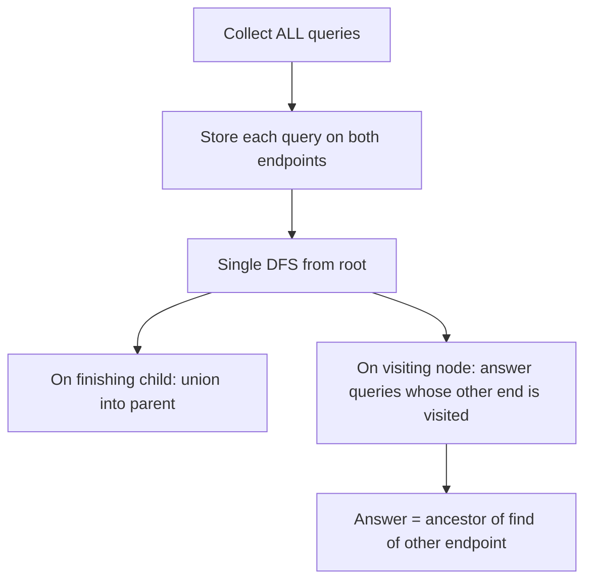

# Offline LCA (Tarjan's Algorithm) — Junior Level

> **One-line summary:** Tarjan's offline LCA algorithm answers a whole *batch* of "what is the Lowest Common Ancestor of `u` and `v`?" questions in one DFS over the tree, using a Disjoint Set Union (DSU) to track, for every visited node, the nearest ancestor that is still "open" — and it runs in near-linear `O((N + Q) · α(N))` time.

---

## Table of Contents

1. [Introduction](#introduction)
2. [Prerequisites](#prerequisites)
3. [Glossary](#glossary)
4. [Core Concepts](#core-concepts)
5. [Big-O Summary](#big-o-summary)
6. [Real-World Analogies](#real-world-analogies)
7. [Pros & Cons](#pros--cons)
8. [Step-by-Step Walkthrough](#step-by-step-walkthrough)
9. [Code Examples](#code-examples)
10. [Coding Patterns](#coding-patterns)
11. [Error Handling](#error-handling)
12. [Performance Tips](#performance-tips)
13. [Best Practices](#best-practices)
14. [Edge Cases & Pitfalls](#edge-cases--pitfalls)
15. [Common Mistakes](#common-mistakes)
16. [Cheat Sheet](#cheat-sheet)
17. [Visual Animation](#visual-animation)
18. [Summary](#summary)
19. [Further Reading](#further-reading)

---

## Introduction

Imagine you have a family tree, and someone hands you a long list of questions: "Who is the closest shared ancestor of Alice and Bob? Of Carol and Dan? Of Eve and Frank?" — a hundred such pairs, all written down in advance. You *could* answer each one independently, walking up the tree twice per question. But because you have *all* the questions up front, you can be cleverer: do a single careful walk of the family tree and answer every question along the way.

That "all questions known up front" setting is called **offline**, and the clever single-walk algorithm is **Tarjan's offline LCA algorithm**, published by Robert Tarjan in 1979. It is one of the most elegant *applications* of the Union-Find (Disjoint Set Union) data structure you already learned in siblings 01–03 of this section.

The **Lowest Common Ancestor (LCA)** of two nodes `u` and `v` in a rooted tree is the deepest node that is an ancestor of *both*. In the family-tree picture, it is the closest shared grandparent (or parent, or the nodes themselves). LCA shows up everywhere: distance between two nodes in a tree, range-minimum queries, expression trees, compiler dominator analysis, and routing in hierarchical networks.

There are several ways to compute LCA. Some are **online** — they preprocess the tree once and then answer each query as it arrives, even if queries come one at a time over the life of a program (binary lifting, Euler tour + sparse table). Tarjan's algorithm is **offline**: it needs the entire list of queries before it starts, and it answers them as a side-effect of a single DFS. In exchange, it is simple, near-linear, and very light on memory.

The whole trick rests on one beautiful idea: **as the DFS finishes a node, we "union" that node into its parent's set.** At any moment during the DFS, the DSU representative of an already-visited node tells you the *lowest ancestor of the current subtree* that the visited node hangs off of. When both endpoints of a query have been visited, that representative is exactly their LCA. We will build up to that idea slowly.

---

## Prerequisites

Before reading this file you should be comfortable with:

- **Rooted trees** — parent, child, ancestor, descendant, subtree, depth.
- **Depth-First Search (DFS)** — both the recursive shape and the idea that a node is "finished" only after *all* its children are finished.
- **Adjacency lists** — how a tree or graph is stored as `adj[u] = [children…]`.
- **Disjoint Set Union (DSU / Union-Find)** — `find(x)` and `union(a, b)`, ideally with **path compression** (sibling `02`) and **union by rank/size** (sibling `03`). This file *assumes* you have those.
- **Big-O notation** — and the inverse Ackermann function `α(N)`, which for all practical `N` is `≤ 4`. Treat it as "basically constant."

Optional but helpful:

- Having seen at least one *other* LCA method (binary lifting or Euler tour) so you can appreciate the contrast.
- Arrays/maps keyed by node id for `visited`, `ancestor`, and query bookkeeping.

---

## Glossary

| Term | Meaning |
|------|---------|
| **LCA(u, v)** | Lowest (deepest) node that is an ancestor of both `u` and `v` in a rooted tree. A node is its own ancestor, so `LCA(u, u) = u` and `LCA(u, ancestor-of-u) = the ancestor`. |
| **Offline** | All queries are known *before* the algorithm runs; answers may be produced in any order and matched back to queries afterward. |
| **Online** | Queries arrive one at a time during execution; each must be answered before the next is seen. Requires a prebuilt structure. |
| **DSU / Union-Find** | Disjoint Set Union: maintains a partition of elements into sets with `find` (representative) and `union` (merge) in near-constant amortized time. |
| **`ancestor[r]`** | Auxiliary array Tarjan keeps: for the *representative* `r` of a DSU set, `ancestor[r]` is the lowest tree node that "owns" that whole set right now. |
| **Finished / black node** | A node whose DFS subtree is fully explored; it has been unioned into its parent. |
| **In-progress / gray node** | A node currently on the DFS recursion stack (its subtree is still being explored). |
| **Unvisited / white node** | A node the DFS has not yet reached. |
| **α(N)** | Inverse Ackermann function. Grows so slowly that `α(N) ≤ 4` for any `N` you will ever store. Effectively constant. |
| **Euler tour** | The sequence of nodes visited (entering and leaving) during a DFS — used by a *different*, online LCA method. |

---

## Core Concepts

### 1. What LCA means (and the easy slow way)

For nodes `u` and `v`, walk up from each to collect the set of ancestors. The LCA is the deepest node appearing in both ancestor sets. The naive per-query approach: bring both nodes to the same depth, then walk both up in lockstep until they meet. That is `O(depth)` per query — up to `O(N)` per query, `O(N·Q)` total. Fine for a handful of queries, too slow when `Q` is large. Tarjan replaces the `O(N)` per query with amortized near-constant.

### 2. Offline vs online

- **Online** methods (binary lifting, Euler + sparse table) pay a one-time preprocessing cost (`O(N log N)`), then answer each query fast (`O(log N)` or `O(1)`) *whenever it arrives*.
- **Offline** Tarjan refuses to start until it has *all* `Q` queries. It then runs one DFS and emits all answers. You cannot use it if queries depend on previous answers or arrive over time.

If you have the batch, offline Tarjan is the simplest near-linear option.

### 3. The ancestor-union idea (the heart of it)

Run a DFS from the root. Attach a DSU where every node starts in its own singleton set. We process a node `u` like this:

```
dfs(u):
    make u its own DSU set
    ancestor[find(u)] = u          # u owns its own set for now
    for each child c of u:
        dfs(c)                     # fully explore c's subtree
        union(u, c)                # merge c's whole subtree into u's set
        ancestor[find(u)] = u      # the merged set is still "owned" by u
    visited[u] = true
    for each query (u, w):         # queries that mention u
        if visited[w]:             # the OTHER endpoint already finished
            answer(u, w) = ancestor[find(w)]   # <-- this is the LCA
```

**Why does `ancestor[find(w)]` equal `LCA(u, w)`?**

When we are *inside* `dfs(u)` and we reach the line that processes a query `(u, w)`, two things are true:

1. `u` is **gray** — it is on the recursion stack, so we are currently somewhere inside `u`'s subtree.
2. `w` is **black** (`visited[w] == true`) — its subtree finished earlier in this same DFS.

Because of how we `union` a child into its parent *only after the child finishes*, every black node `w` has been merged upward exactly into the set owned by the **lowest gray ancestor whose subtree we have not yet finished**. That lowest still-open ancestor of `w` which is also an ancestor of `u` (because we are currently inside it) is — by definition — `LCA(u, w)`. So `ancestor[find(w)]` returns it. We will trace this concretely below.

### 4. Each query is stored on *both* endpoints

A query `(u, v)` might get resolved when the DFS finishes one endpoint while the other is still open. We do not know in advance which endpoint finishes first, so we store the query under *both* `u` and `v`. When we process node `x`'s query list and find the other endpoint already visited, we answer. The check `if visited[other]` guarantees we only answer once (the second endpoint to be processed triggers it).

### 5. The DSU does the heavy lifting

Every `union` and `find` is amortized `O(α(N))`. There are `N − 1` unions (one per non-root node) and `O(N + Q)` finds. That is why the whole thing is near-linear.

---

## Big-O Summary

| Aspect | Cost | Notes |
|--------|------|-------|
| Total time | **O((N + Q) · α(N))** | One DFS; `N−1` unions; `O(N+Q)` finds. Near-linear. |
| DFS skeleton | O(N) | Visit each node and edge once. |
| Unions | O(N · α(N)) | Exactly `N − 1` of them, one per non-root node. |
| Query resolution | O(Q · α(N)) | Two finds per query (one per endpoint), answered once. |
| Extra space | O(N + Q) | DSU arrays `parent`, `rank`, `ancestor`, `visited`, plus per-node query lists. |
| Preprocessing for "online" use | **not supported** | Tarjan is inherently offline; it cannot answer a query that arrives later. |

Contrast with the two common **online** methods:

| Method | Build | Per query | Online? |
|--------|-------|-----------|---------|
| **Tarjan (offline)** | — | amortized `α(N)` | No (needs all queries) |
| Binary lifting | `O(N log N)` | `O(log N)` | Yes |
| Euler tour + sparse table | `O(N log N)` | `O(1)` | Yes |

---

## Real-World Analogies

| Concept | Analogy |
|---------|---------|
| LCA | In a **family tree**, the closest shared ancestor of two cousins — the grandparent they both descend from. |
| Offline batch | You are handed a stack of "who's the nearest common boss?" questions for pairs of employees in an **org chart**, all at once, before you start reading the chart. |
| DFS finishing a node | A manager who has finished reviewing every report in their subtree closes that branch and reports "done" up to their own boss. |
| Union into parent | When a whole department finishes, it is folded into its parent department's bucket; the parent now "speaks for" everyone below. |
| `ancestor[find(w)]` | Pointing at any already-closed employee `w` and asking "which still-open manager currently owns your whole closed branch?" — that owner is the LCA with whoever we are visiting now. |

Where the analogy breaks: a real org chart can have someone reporting to two bosses (a DAG). LCA-by-Tarjan as described needs a *tree* — exactly one parent per node (other than the root).

---

## Pros & Cons

| Pros | Cons |
|------|------|
| Near-linear `O((N+Q)·α(N))` — among the fastest possible for a batch. | **Offline only** — useless if queries arrive over time or depend on earlier answers. |
| Tiny, elegant code — one DFS plus the DSU you already have. | Must collect *all* queries before producing *any* answer. |
| Very low memory: a handful of arrays. | Recursive DFS can blow the stack on deep/degenerate trees (chain of `N` nodes). |
| No `O(N log N)` table to build or store. | Answers come out in DFS-resolution order; you must map them back to original query indices. |
| Reuses Union-Find — great teaching example of a DSU application. | Slightly trickier to reason about than binary lifting for first-timers. |

**When to use:** you have the *whole batch* of LCA queries up front (offline judging, one-shot tree analytics, distance queries on a static tree), memory is tight, and you want simple near-linear code.

**When NOT to use:** queries arrive interactively, the tree changes between queries, or one query's answer determines the next query — use an **online** method (binary lifting, Euler + sparse table) instead.

---

## Step-by-Step Walkthrough

Tree (rooted at `1`):

```
            1
          /   \
         2     3
        / \     \
       4   5     6
```

Adjacency (children): `1→{2,3}`, `2→{4,5}`, `3→{6}`.

Queries (offline batch): `Q1 = (4, 5)`, `Q2 = (4, 6)`, `Q3 = (5, 3)`.

Store each query on both endpoints:

```
queries[4] = [(5, Q1), (6, Q2)]
queries[5] = [(4, Q1), (3, Q3)]
queries[6] = [(4, Q2)]
queries[3] = [(5, Q3)]
```

DFS order (children left-to-right): `1, 2, 4, 5, 3, 6`. Watch the DSU and `visited` set evolve. `find(x)` returns the representative; `ancestor[rep]` is shown.

```
enter 1: ancestor[1]=1
  enter 2: ancestor[2]=2
    enter 4: ancestor[4]=4
      visited[4]=true
      check queries of 4:
        (5,Q1): visited[5]? NO  -> skip (5 not finished yet)
        (6,Q2): visited[6]? NO  -> skip
    leave 4: union(2,4); ancestor[find(2)] = 2     # set {2,4} owned by 2
    enter 5: ancestor[5]=5
      visited[5]=true
      check queries of 5:
        (4,Q1): visited[4]? YES -> answer Q1 = ancestor[find(4)]
                find(4) -> rep of {2,4} -> ancestor = 2   ==> LCA(4,5)=2  ✓
        (3,Q3): visited[3]? NO  -> skip
    leave 5: union(2,5); ancestor[find(2)] = 2     # set {2,4,5} owned by 2
  leave 2: union(1,2); ancestor[find(1)] = 1       # set {1,2,4,5} owned by 1
  enter 3: ancestor[3]=3
    visited[3]=true
    check queries of 3:
      (5,Q3): visited[5]? YES -> answer Q3 = ancestor[find(5)]
              find(5) -> rep of {1,2,4,5} -> ancestor = 1  ==> LCA(5,3)=1  ✓
    enter 6: ancestor[6]=6
      visited[6]=true
      check queries of 6:
        (4,Q2): visited[4]? YES -> answer Q2 = ancestor[find(4)]
                find(4) -> rep of {1,2,4,5} -> ancestor = 1 ==> LCA(4,6)=1 ✓
    leave 6: union(3,6); ancestor[find(3)] = 3
  leave 3: union(1,3); ancestor[find(1)] = 1
leave 1: done
```

All three answers came out correct: `LCA(4,5)=2`, `LCA(4,6)=1`, `LCA(5,3)=1`. Notice each query was answered exactly once — at the moment the *second* of its two endpoints was visited.

---

## Code Examples

Full Tarjan offline LCA. The DSU uses path compression + union by rank (assumed from siblings 02/03). Input: tree as adjacency list rooted at `root`, and a list of queries; output: an answer per query (indexed by query order).

### Go

```go
package main

import "fmt"

type DSU struct {
	parent, rank, ancestor []int
}

func NewDSU(n int) *DSU {
	d := &DSU{
		parent:   make([]int, n),
		rank:     make([]int, n),
		ancestor: make([]int, n),
	}
	for i := range d.parent {
		d.parent[i] = i
		d.ancestor[i] = i
	}
	return d
}

func (d *DSU) Find(x int) int {
	for d.parent[x] != x {
		d.parent[x] = d.parent[d.parent[x]] // path compression
		x = d.parent[x]
	}
	return x
}

// Union merges child's set into the set rooted under parent p,
// and keeps ancestor[representative] pointing at p (the lower tree node).
func (d *DSU) Union(p, child int) {
	rp, rc := d.Find(p), d.Find(child)
	if rp == rc {
		return
	}
	if d.rank[rp] < d.rank[rc] {
		rp, rc = rc, rp
	}
	d.parent[rc] = rp
	if d.rank[rp] == d.rank[rc] {
		d.rank[rp]++
	}
	d.ancestor[d.Find(rp)] = p // the owning tree node is the parent p
}

type Query struct {
	other int // the other endpoint
	id    int // index of this query in the answer array
}

func tarjanLCA(adj [][]int, root int, qByNode [][]Query, qCount int) []int {
	n := len(adj)
	dsu := NewDSU(n)
	visited := make([]bool, n)
	ans := make([]int, qCount)
	for i := range ans {
		ans[i] = -1
	}

	var dfs func(u int)
	dfs = func(u int) {
		dsu.ancestor[dsu.Find(u)] = u
		for _, c := range adj[u] {
			dfs(c)
			dsu.Union(u, c)
		}
		visited[u] = true
		for _, q := range qByNode[u] {
			if visited[q.other] {
				ans[q.id] = dsu.ancestor[dsu.Find(q.other)]
			}
		}
	}
	dfs(root)
	return ans
}

func main() {
	// Tree: 1-2, 1-3, 2-4, 2-5, 3-6  (0-indexed: shift by -1)
	adj := [][]int{
		{1, 2}, // 0 -> children 1,2   (node 1's children 2,3)
		{3, 4}, // 1 -> 3,4            (node 2's children 4,5)
		{5},    // 2 -> 5              (node 3's child 6)
		{}, {}, {},
	}
	queries := [][2]int{{3, 4}, {3, 5}, {4, 2}} // (4,5),(4,6),(5,3) 0-indexed
	qByNode := make([][]Query, len(adj))
	for id, q := range queries {
		a, b := q[0], q[1]
		qByNode[a] = append(qByNode[a], Query{b, id})
		qByNode[b] = append(qByNode[b], Query{a, id})
	}
	ans := tarjanLCA(adj, 0, qByNode, len(queries))
	for id, v := range ans {
		fmt.Printf("LCA query %d -> node %d\n", id, v+1) // +1 back to 1-indexed
	}
	// LCA(4,5)=2  LCA(4,6)=1  LCA(5,3)=1
}
```

### Java

```java
import java.util.*;

public class TarjanLCA {
    int[] parent, rank, ancestor;
    boolean[] visited;
    List<int[]>[] qByNode; // each entry: {otherEndpoint, queryId}
    List<List<Integer>> adj;
    int[] ans;

    int find(int x) {
        while (parent[x] != x) {
            parent[x] = parent[parent[x]]; // path compression
            x = parent[x];
        }
        return x;
    }

    void union(int p, int child) {
        int rp = find(p), rc = find(child);
        if (rp == rc) return;
        if (rank[rp] < rank[rc]) { int t = rp; rp = rc; rc = t; }
        parent[rc] = rp;
        if (rank[rp] == rank[rc]) rank[rp]++;
        ancestor[find(rp)] = p; // owning tree node is the parent
    }

    void dfs(int u) {
        ancestor[find(u)] = u;
        for (int c : adj.get(u)) {
            dfs(c);
            union(u, c);
        }
        visited[u] = true;
        for (int[] q : qByNode[u]) {
            if (visited[q[0]]) ans[q[1]] = ancestor[find(q[0])];
        }
    }

    @SuppressWarnings("unchecked")
    int[] solve(List<List<Integer>> adj, int root, int[][] queries) {
        int n = adj.size();
        this.adj = adj;
        parent = new int[n];
        rank = new int[n];
        ancestor = new int[n];
        visited = new boolean[n];
        for (int i = 0; i < n; i++) { parent[i] = i; ancestor[i] = i; }
        qByNode = new List[n];
        for (int i = 0; i < n; i++) qByNode[i] = new ArrayList<>();
        ans = new int[queries.length];
        Arrays.fill(ans, -1);
        for (int id = 0; id < queries.length; id++) {
            int a = queries[id][0], b = queries[id][1];
            qByNode[a].add(new int[]{b, id});
            qByNode[b].add(new int[]{a, id});
        }
        dfs(root);
        return ans;
    }

    public static void main(String[] args) {
        // 0-indexed tree, node i+1 in human terms
        List<List<Integer>> adj = new ArrayList<>();
        for (int i = 0; i < 6; i++) adj.add(new ArrayList<>());
        adj.get(0).addAll(List.of(1, 2)); // 1 -> 2,3
        adj.get(1).addAll(List.of(3, 4)); // 2 -> 4,5
        adj.get(2).add(5);                // 3 -> 6
        int[][] queries = {{3, 4}, {3, 5}, {4, 2}}; // (4,5),(4,6),(5,3)
        int[] ans = new TarjanLCA().solve(adj, 0, queries);
        for (int i = 0; i < ans.length; i++)
            System.out.println("LCA query " + i + " -> node " + (ans[i] + 1));
        // LCA(4,5)=2  LCA(4,6)=1  LCA(5,3)=1
    }
}
```

### Python

```python
import sys
from collections import defaultdict


def tarjan_lca(adj, root, queries):
    """adj: dict node -> list of children. queries: list of (u, v).
    Returns a list of LCA answers in the same order as `queries`."""
    n = max(adj.keys(), default=-1) + 1
    parent = list(range(n))
    rank = [0] * n
    ancestor = list(range(n))
    visited = [False] * n
    ans = [-1] * len(queries)

    q_by_node = defaultdict(list)
    for qid, (u, v) in enumerate(queries):
        q_by_node[u].append((v, qid))
        q_by_node[v].append((u, qid))

    def find(x):
        while parent[x] != x:
            parent[x] = parent[parent[x]]  # path compression
            x = parent[x]
        return x

    def union(p, child):
        rp, rc = find(p), find(child)
        if rp == rc:
            return
        if rank[rp] < rank[rc]:
            rp, rc = rc, rp
        parent[rc] = rp
        if rank[rp] == rank[rc]:
            rank[rp] += 1
        ancestor[find(rp)] = p  # owning tree node is the parent

    def dfs(u):
        ancestor[find(u)] = u
        for c in adj.get(u, ()):
            dfs(c)
            union(u, c)
        visited[u] = True
        for other, qid in q_by_node[u]:
            if visited[other]:
                ans[qid] = ancestor[find(other)]

    sys.setrecursionlimit(max(10000, n * 2 + 100))
    dfs(root)
    return ans


if __name__ == "__main__":
    # 0-indexed; human node i shown as i+1
    adj = {0: [1, 2], 1: [3, 4], 2: [5], 3: [], 4: [], 5: []}
    queries = [(3, 4), (3, 5), (4, 2)]  # (4,5),(4,6),(5,3)
    for qid, lca in enumerate(tarjan_lca(adj, 0, queries)):
        print(f"LCA query {qid} -> node {lca + 1}")
    # LCA(4,5)=2  LCA(4,6)=1  LCA(5,3)=1
```

**What it does:** runs one DFS, unions each finished child into its parent, and answers every query the instant its second endpoint is visited.
**Run:** `go run main.go` | `javac TarjanLCA.java && java TarjanLCA` | `python tarjan_lca.py`

---

## Coding Patterns

### Pattern 1: Store the query on both endpoints

You do not know which endpoint the DFS will finish first, so register the query under both nodes and gate the answer with `if visited[other]`.

```python
q_by_node[u].append((v, qid))
q_by_node[v].append((u, qid))
```

### Pattern 2: Set `ancestor` at *entry* and after *each union*

On entering `u`, its set is `{u}` and it owns it. After merging a finished child `c`, the merged set must still report `u`. So write `ancestor[find(u)] = u` both at entry and after every union (the union may have changed the representative).

### Pattern 3: Distance via LCA

A very common downstream use: distance in an unweighted tree.

```
dist(u, v) = depth[u] + depth[v] - 2 * depth[ LCA(u, v) ]
```

Precompute `depth[]` during the same DFS, then read it off once you have each LCA.



---

## Error Handling

| Error | Cause | Fix |
|-------|-------|-----|
| Wrong LCA, always the root | Forgot `ancestor[find(u)] = u` after a union (rep changed). | Re-set `ancestor` of the current representative after **every** union, and at entry. |
| Each query answered twice / overwritten | Answered without the `visited[other]` guard. | Only answer when the other endpoint is already `visited`; that fires exactly once (on the second endpoint). |
| Some queries never answered | Stored the query under only one endpoint. | Register the query on **both** `u` and `v`. |
| `RecursionError` / stack overflow | Deep tree (e.g. a chain of `N` nodes) with recursive DFS. | Raise the recursion limit, or use an iterative (explicit-stack) DFS — see `middle.md`. |
| Self-query `LCA(u, u)` returns `u` but you expected an error | `u` is its own ancestor by definition. | This is correct LCA behavior; handle `u == v` by returning `u` immediately if your spec differs. |
| Crash on disconnected node / forest | DFS only ran from one root. | Run the DFS once per root component; ensure every node is reached. |

---

## Performance Tips

- **Use path compression + union by rank** in the DSU. Without them, `find` degrades to `O(N)` and the whole algorithm loses its near-linear guarantee.
- **Precompute query lists once**, not per DFS step — build `q_by_node` before the DFS starts.
- **Avoid recomputing depth**: compute `depth[u] = depth[parent] + 1` as you enter each node, in the same pass.
- **Prefer iterative DFS for large `N`** to avoid recursion overhead and stack limits; the algorithm is identical, only the traversal mechanism changes.
- **Map answers back by query id**, not by re-searching — store the original index alongside each query.

---

## Best Practices

- Write a brute-force "walk both nodes up to equal depth, then together" LCA and test Tarjan against it on random small trees.
- Keep the DSU generic and reuse the *same* well-tested DSU from siblings 01–03; do not reinvent it.
- Document clearly that the function is **offline**: callers must supply all queries up front.
- Index queries explicitly so the answer array lines up with the input order.
- For very deep trees, switch the DFS to an explicit stack from the start — do not wait for a production stack overflow.

---

## Edge Cases & Pitfalls

- **`u == v`** — the LCA is `u` itself. Either let the algorithm handle it naturally (it answers `ancestor[find(u)]` which is `u` when `u` is visited) or short-circuit.
- **One node is an ancestor of the other** — e.g. `LCA(child, grandparent) = grandparent`. The algorithm handles this correctly; no special case needed.
- **Single-node tree** — root only; any query `(root, root)` returns `root`.
- **Duplicate queries** — `(u, v)` listed twice; both copies get answered, each at its own index. Harmless but wasteful; dedupe if you like.
- **Deep/degenerate tree (a path)** — recursion can overflow; use iterative DFS.
- **Disconnected forest** — run the DFS per component; cross-component LCA is undefined (no common ancestor).

---

## Common Mistakes

1. **Not re-setting `ancestor` after a union.** The union may change the set representative; if you forget, `ancestor[find(...)]` reads a stale node and you get the root for everything.
2. **Storing the query on only one endpoint.** Then if the DFS finishes the *other* endpoint first, the query is never triggered.
3. **Answering before checking `visited[other]`.** You will read an `ancestor` for a node not yet finished and get garbage.
4. **Using a DSU without path compression.** It still produces correct answers but loses the near-linear time bound.
5. **Recursive DFS on a 10⁶-node chain.** Stack overflow. Go iterative.
6. **Treating it as online.** Trying to answer a query that was not in the original batch — Tarjan cannot do that; it only answers the queries it saw.

---

## Cheat Sheet

| Item | Value |
|------|-------|
| Setting | **Offline** (all queries up front) |
| Time | **O((N + Q) · α(N))** ≈ near-linear |
| Space | O(N + Q) |
| Core data structure | DSU (path compression + union by rank) |
| When to answer a query `(u,v)` | When the **second** endpoint is visited (`visited[other]` true) |
| Answer formula | `ancestor[ find(other_endpoint) ]` |
| Union timing | After a child's DFS **fully finishes**, union child → parent |
| `ancestor` reset | At node entry **and** after every union |
| Store query under | **both** endpoints |
| Distance use | `depth[u] + depth[v] − 2·depth[LCA(u,v)]` |

Pseudocode skeleton:

```
dfs(u):
    ancestor[find(u)] = u
    for child c of u:
        dfs(c)
        union(u, c)
        ancestor[find(u)] = u
    visited[u] = true
    for (other, qid) in queries[u]:
        if visited[other]:
            ans[qid] = ancestor[find(other)]
```

---

## Visual Animation

> See [`animation.html`](./animation.html) for an interactive visual animation of Tarjan's offline LCA.
>
> The animation demonstrates:
> - The DFS walking the tree with nodes colored by state (unvisited / in-progress / finished).
> - DSU sets merging as each node finishes (union into parent).
> - The pending query list, with each `LCA(u,v)` resolved the moment its second endpoint is reached.
> - Step-by-step narration and Reset / Step controls.

---

## Summary

Tarjan's offline LCA algorithm answers a whole batch of lowest-common-ancestor questions in a single DFS, using Union-Find to track which still-open ancestor "owns" each finished subtree. The key move is to **union a node into its parent only after the node's subtree finishes**, so that for any already-finished node `w`, `ancestor[find(w)]` is exactly the lowest open ancestor — and when we are visiting `u` and `w` is finished, that lowest open common ancestor *is* `LCA(u, w)`. The price is that you must know all queries up front (offline). The reward is near-linear `O((N+Q)·α(N))` time, tiny memory, and code that is mostly the DSU you already wrote.

---

## Further Reading

- R. E. Tarjan, "Applications of Path Compression on Balanced Trees," *Journal of the ACM*, 1979 — the original.
- *Introduction to Algorithms* (CLRS), Chapter 21 — Disjoint Sets — for the DSU foundation.
- cp-algorithms.com — "Lowest Common Ancestor — Tarjan's off-line algorithm."
- Siblings in this section: `01-union-find`, `02-path-compression`, `03-union-by-rank`.
- For online alternatives, study binary lifting and Euler-tour + sparse-table LCA.
