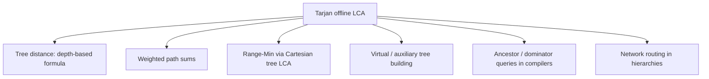

# Offline LCA — Middle Level

> **Focus:** *Why* `find(other)`'s ancestor is the LCA, how Tarjan compares to binary lifting and Euler-tour LCA, the iterative DFS that survives deep trees, and how LCA composes into distance, weighted-tree, and virtual-tree problems.

---

## Table of Contents

1. [Introduction](#introduction)
2. [Deeper Concepts](#deeper-concepts)
3. [Comparison with Alternatives](#comparison-with-alternatives)
4. [Advanced Patterns](#advanced-patterns)
5. [Graph and Tree Applications](#graph-and-tree-applications)
6. [Algorithmic Integration](#algorithmic-integration)
7. [Code Examples](#code-examples)
8. [Error Handling](#error-handling)
9. [Performance Analysis](#performance-analysis)
10. [Best Practices](#best-practices)
11. [Visual Animation](#visual-animation)
12. [Summary](#summary)

---

## Introduction

At junior level Tarjan's offline LCA is "DFS + union into parent + answer when both endpoints visited." At middle level you should be able to:

- State and *justify* the **ancestor invariant** that makes `ancestor[find(other)]` equal the LCA.
- Decide between Tarjan, binary lifting, Euler+sparse-table, and heavy-light decomposition for a given workload.
- Rewrite the DFS iteratively so a chain of `10⁶` nodes does not overflow the stack.
- Plug LCA into distance queries, weighted-path sums, and virtual (auxiliary) trees.

These are the questions that decide whether your batch of `10⁶` queries finishes in 80 ms or times out.

---

## Deeper Concepts

### The ancestor invariant

Run the DFS. At any instant the **gray nodes** (on the recursion stack) form a single root-to-current path: `root = g₀ → g₁ → … → g_k = current`. Every node the DFS has *touched* belongs to exactly one DSU set, and the algorithm maintains:

> **Invariant.** Every already-entered node `x` lies in the DSU set whose representative `r` satisfies `ancestor[r] = g_j`, where `g_j` is the **deepest gray node that is an ancestor of `x`**.

In words: each touched node is "parked" under the lowest still-open ancestor of itself.

**Why it holds.** When we enter a node `u`, we make `{u}` its own set with `ancestor = u`; at that moment `u` is gray and is its own deepest gray ancestor — invariant holds for `u`. We only `union(u, c)` *after* `dfs(c)` returns, i.e. after `c` and its whole subtree turned black. At that point the deepest gray ancestor of every node in `c`'s subtree becomes `u` (because `c` is no longer gray). The union folds `c`'s set into `u`'s set and we set `ancestor[find(u)] = u`, restoring the invariant for the whole merged set. Nodes outside `u`'s subtree are untouched, so the invariant is maintained globally.

### Why `ancestor[find(other)]` is the LCA

Suppose we are processing a query `(u, w)` while *inside* `dfs(u)` (so `u` is gray) and we observe `visited[w] = true` (so `w` is black). By the invariant, `w` sits in the set whose `ancestor` is the **deepest gray ancestor of `w`**. Call it `g`. Since `u` is gray and currently the deepest gray node, every gray ancestor of `w` is also an ancestor of `u` (the gray nodes are a single path from the root down to `u`). Therefore `g` is:

1. an ancestor of `w` (it is an ancestor of `w` by definition of "ancestor of `w`"), and
2. an ancestor of `u` (it is gray, hence on the root-to-`u` path), and
3. the **deepest** such node (it is the deepest gray ancestor of `w`).

The deepest common ancestor of `u` and `w` is exactly `LCA(u, w)`. Hence `g = ancestor[find(w)] = LCA(u, w)`. ∎ (A fully formal version is in [`professional.md`](./professional.md).)

### Why exactly `N − 1` unions and `O(N + Q)` finds

Every non-root node is unioned into its parent exactly once when its subtree finishes → `N − 1` unions. Entry sets `ancestor` once per node (`N` finds). Each query triggers at most one resolution with two finds (one to read the other endpoint, plus the union-time finds). So total finds are `O(N + Q)`, each amortized `α(N)` with path compression + union by rank.

### The "answer on the second endpoint" timing

A query `(u, v)` resolves when the DFS visits the *later-finished* of the two endpoints. Concretely: whichever of `u`, `v` is processed first only marks itself visited; when the second is processed, it finds the first already visited and answers. This is why storing the query on **both** endpoints is mandatory.

---

## Comparison with Alternatives

| Attribute | **Tarjan (offline)** | Binary lifting | Euler tour + sparse table | Heavy-Light Decomposition |
|-----------|----------------------|----------------|---------------------------|---------------------------|
| Build time | — (none) | `O(N log N)` | `O(N log N)` | `O(N)` build + `O(N)` segtree |
| Query time | amortized `α(N)` | `O(log N)` | `O(1)` | `O(log² N)` (path queries) |
| Online? | **No** | Yes | Yes | Yes |
| Space | `O(N + Q)` | `O(N log N)` | `O(N log N)` | `O(N)` |
| Handles edge/path *updates* | No | No (static) | No (static) | **Yes** (with segment tree) |
| Code complexity | Low (reuses DSU) | Medium | Medium | High |
| Best for | huge static **batch** of LCA | interactive LCA, moderate N | many `O(1)` LCAs after one build | path *aggregate*/*update* queries |

How to choose:

- **All queries known, static tree, memory tight** → Tarjan. Simplest near-linear.
- **Queries arrive online, you also need `kth ancestor`** → binary lifting (it gives `kth-ancestor` for free).
- **You will fire millions of LCA queries and want `O(1)` each after one build** → Euler tour + sparse table (or its `O(N)/O(1)` Farach-Colton–Bender refinement; see `professional.md`).
- **You need path *sums*, *max*, or *updates*, not just LCA** → heavy-light decomposition or link-cut trees.

A subtle point: Tarjan's amortized `α(N)` per query is asymptotically *better* than binary lifting's `O(log N)` and ties Euler+sparse-table's `O(1)` (both are effectively constant). The deciding factor is almost always **online vs offline**, not raw asymptotics.

---

## Advanced Patterns

### Pattern: Distance queries on an unweighted tree

Compute `depth[]` during the same DFS, then:

```
dist(u, v) = depth[u] + depth[v] - 2 * depth[ LCA(u, v) ]
```

Each query becomes one LCA lookup plus three array reads. Batch all distance queries and feed them through Tarjan.

### Pattern: Weighted trees (path-sum to root)

Maintain `distRoot[u]` = sum of edge weights from `root` to `u`, accumulated on entry. Then:

```
weightedDist(u, v) = distRoot[u] + distRoot[v] - 2 * distRoot[ LCA(u, v) ]
```

The LCA itself is found exactly as before; only the auxiliary array changes.

### Pattern: Batch many query *types* at once

Because Tarjan answers a query when its second endpoint is visited, you can mix query *purposes* (LCA, distance, "is `a` ancestor of `b`?") as long as each is keyed by a pair of nodes. Tag each with its kind and post-process the LCA result.

### Pattern: Virtual / auxiliary tree

Given a subset `S` of `k` important nodes, the **virtual tree** is the minimal tree containing `S` and all pairwise LCAs. Building it needs the LCA of consecutive nodes in Euler/DFS order. If you have *all* the subsets up front (offline), you can collect every needed LCA pair and resolve them in one Tarjan pass, then assemble each virtual tree. This is a classic competitive-programming optimization when many queries each operate on a small node subset.

### Pattern: "Is `a` an ancestor of `b`?"

`a` is an ancestor of `b` iff `LCA(a, b) == a`. Fold these into the same batch.

---

## Graph and Tree Applications



### Range minimum via Cartesian tree

There is a deep equivalence: **RMQ ↔ LCA**. Build a **Cartesian tree** of an array (a binary tree whose in-order traversal is the array and which is a min-heap on values). Then `RMQ(i, j)` — the index of the minimum in `arr[i..j]` — equals the **LCA** of the tree nodes corresponding to positions `i` and `j`. So a batch of RMQ queries can be answered by: build the Cartesian tree in `O(N)`, then run Tarjan offline LCA. The reverse reduction (LCA → RMQ via Euler tour) underlies the `O(N)/O(1)` Farach-Colton–Bender method discussed in `professional.md`.

### Dominator trees / compilers

In control-flow analysis, the *immediate dominator* tree lets you ask "which block dominates both `X` and `Y`?" — an LCA query on the dominator tree. When you have a batch of such questions about a fixed CFG, offline Tarjan answers them in near-linear time.

---

## Algorithmic Integration

### With sorting / ordering of queries

Unlike Mo's algorithm, Tarjan does **not** require sorting queries — they are resolved by DFS order, not by any query ordering you impose. You only need to bucket each query under its two endpoints. (Contrast: offline *range* query techniques like Mo's algorithm *do* sort queries; Tarjan does not.)

### With DSU optimizations

The whole algorithm's time bound is inherited from the DSU:

- **Path compression alone:** `O((N+Q) log N)` worst case — still fine, but not optimal.
- **Path compression + union by rank/size:** `O((N+Q) α(N))` — the target.
- **Union by rank without path compression:** `O((N+Q) log N)`.

Use both optimizations. Note one nuance: when you `union`, the representative can flip to the *child's* old root (union by rank picks the higher-rank root). That is exactly why you must re-assign `ancestor[find(u)] = u` after every union — the rep you wrote `ancestor` to earlier may no longer be the rep.

### With Euler-tour depth (hybrid)

If you also need `O(1)` *online* LCA later, you can run Tarjan for the offline batch *and* build an Euler-tour structure — they share the DFS. But usually you pick one.

---

## Code Examples

### Iterative DFS variant (avoids stack overflow)

The recursive version overflows on deep trees. Here is an explicit-stack DFS that performs the union *after* a child returns and resolves queries when a node is fully finished. The trick is a state machine per stack frame: we push a node, iterate its children, and on the "post" visit do the union and query resolution.

#### Go

```go
package main

import "fmt"

type DSU struct{ parent, rank, ancestor []int }

func NewDSU(n int) *DSU {
	d := &DSU{make([]int, n), make([]int, n), make([]int, n)}
	for i := range d.parent {
		d.parent[i], d.ancestor[i] = i, i
	}
	return d
}
func (d *DSU) Find(x int) int {
	for d.parent[x] != x {
		d.parent[x] = d.parent[d.parent[x]]
		x = d.parent[x]
	}
	return x
}
func (d *DSU) Union(p, c int) {
	rp, rc := d.Find(p), d.Find(c)
	if rp == rc {
		return
	}
	if d.rank[rp] < d.rank[rc] {
		rp, rc = rc, rp
	}
	d.parent[rc] = rp
	if d.rank[rp] == d.rank[rc] {
		d.rank[rp]++
	}
	d.ancestor[d.Find(rp)] = p
}

type Query struct{ other, id int }

// Iterative Tarjan offline LCA.
func tarjanLCA(adj [][]int, root int, qByNode [][]Query, qn int) []int {
	n := len(adj)
	dsu := NewDSU(n)
	visited := make([]bool, n)
	ans := make([]int, qn)
	for i := range ans {
		ans[i] = -1
	}

	type frame struct {
		node, childIdx int
	}
	stack := []frame{{root, 0}}
	dsu.ancestor[dsu.Find(root)] = root

	for len(stack) > 0 {
		top := &stack[len(stack)-1]
		u := top.node
		if top.childIdx < len(adj[u]) {
			c := adj[u][top.childIdx]
			top.childIdx++
			dsu.ancestor[dsu.Find(c)] = c
			stack = append(stack, frame{c, 0}) // descend
		} else {
			// post-visit: all children of u are done
			visited[u] = true
			for _, q := range qByNode[u] {
				if visited[q.other] {
					ans[q.id] = dsu.ancestor[dsu.Find(q.other)]
				}
			}
			stack = stack[:len(stack)-1] // pop u
			if len(stack) > 0 {
				parent := stack[len(stack)-1].node
				dsu.Union(parent, u) // union child u into its parent
			}
		}
	}
	return ans
}

func main() {
	adj := [][]int{{1, 2}, {3, 4}, {5}, {}, {}, {}}
	queries := [][2]int{{3, 4}, {3, 5}, {4, 2}}
	qByNode := make([][]Query, len(adj))
	for id, q := range queries {
		qByNode[q[0]] = append(qByNode[q[0]], Query{q[1], id})
		qByNode[q[1]] = append(qByNode[q[1]], Query{q[0], id})
	}
	for id, v := range tarjanLCA(adj, 0, qByNode, len(queries)) {
		fmt.Printf("query %d -> node %d\n", id, v+1)
	}
}
```

#### Java

```java
import java.util.*;

public class TarjanLCAIterative {
    int[] parent, rank, ancestor;

    int find(int x) {
        while (parent[x] != x) { parent[x] = parent[parent[x]]; x = parent[x]; }
        return x;
    }
    void union(int p, int c) {
        int rp = find(p), rc = find(c);
        if (rp == rc) return;
        if (rank[rp] < rank[rc]) { int t = rp; rp = rc; rc = t; }
        parent[rc] = rp;
        if (rank[rp] == rank[rc]) rank[rp]++;
        ancestor[find(rp)] = p;
    }

    int[] solve(List<List<Integer>> adj, int root, int[][] queries) {
        int n = adj.size();
        parent = new int[n]; rank = new int[n]; ancestor = new int[n];
        boolean[] visited = new boolean[n];
        for (int i = 0; i < n; i++) { parent[i] = i; ancestor[i] = i; }
        List<int[]>[] qByNode = new List[n];
        for (int i = 0; i < n; i++) qByNode[i] = new ArrayList<>();
        int[] ans = new int[queries.length];
        Arrays.fill(ans, -1);
        for (int id = 0; id < queries.length; id++) {
            qByNode[queries[id][0]].add(new int[]{queries[id][1], id});
            qByNode[queries[id][1]].add(new int[]{queries[id][0], id});
        }

        int[] stackNode = new int[n];
        int[] childIdx = new int[n];
        int sp = 0;
        stackNode[sp] = root; childIdx[sp] = 0; sp++;
        ancestor[find(root)] = root;

        while (sp > 0) {
            int u = stackNode[sp - 1];
            if (childIdx[sp - 1] < adj.get(u).size()) {
                int c = adj.get(u).get(childIdx[sp - 1]);
                childIdx[sp - 1]++;
                ancestor[find(c)] = c;
                stackNode[sp] = c; childIdx[sp] = 0; sp++;
            } else {
                visited[u] = true;
                for (int[] q : qByNode[u])
                    if (visited[q[0]]) ans[q[1]] = ancestor[find(q[0])];
                sp--;
                if (sp > 0) union(stackNode[sp - 1], u);
            }
        }
        return ans;
    }

    public static void main(String[] args) {
        List<List<Integer>> adj = new ArrayList<>();
        for (int i = 0; i < 6; i++) adj.add(new ArrayList<>());
        adj.get(0).addAll(List.of(1, 2));
        adj.get(1).addAll(List.of(3, 4));
        adj.get(2).add(5);
        int[][] q = {{3, 4}, {3, 5}, {4, 2}};
        int[] ans = new TarjanLCAIterative().solve(adj, 0, q);
        for (int i = 0; i < ans.length; i++)
            System.out.println("query " + i + " -> node " + (ans[i] + 1));
    }
}
```

#### Python

```python
def tarjan_lca_iterative(adj, root, queries):
    n = len(adj)
    parent = list(range(n))
    rank = [0] * n
    ancestor = list(range(n))
    visited = [False] * n
    ans = [-1] * len(queries)

    q_by_node = [[] for _ in range(n)]
    for qid, (u, v) in enumerate(queries):
        q_by_node[u].append((v, qid))
        q_by_node[v].append((u, qid))

    def find(x):
        while parent[x] != x:
            parent[x] = parent[parent[x]]
            x = parent[x]
        return x

    def union(p, c):
        rp, rc = find(p), find(c)
        if rp == rc:
            return
        if rank[rp] < rank[rc]:
            rp, rc = rc, rp
        parent[rc] = rp
        if rank[rp] == rank[rc]:
            rank[rp] += 1
        ancestor[find(rp)] = p

    # explicit stack of [node, child_pointer]
    stack = [[root, 0]]
    ancestor[find(root)] = root
    while stack:
        frame = stack[-1]
        u, ci = frame
        if ci < len(adj[u]):
            c = adj[u][ci]
            frame[1] += 1
            ancestor[find(c)] = c
            stack.append([c, 0])
        else:
            visited[u] = True
            for other, qid in q_by_node[u]:
                if visited[other]:
                    ans[qid] = ancestor[find(other)]
            stack.pop()
            if stack:
                union(stack[-1][0], u)
    return ans


if __name__ == "__main__":
    adj = [[1, 2], [3, 4], [5], [], [], []]
    queries = [(3, 4), (3, 5), (4, 2)]
    for qid, lca in enumerate(tarjan_lca_iterative(adj, 0, queries)):
        print(f"query {qid} -> node {lca + 1}")
```

The iterative version is byte-for-byte equivalent in output to the recursive one; it just trades the call stack for an explicit one, which is essential when `N` reaches the hundreds of thousands on a degenerate (path-like) tree.

---

## Error Handling

| Scenario | What goes wrong | Correct approach |
|----------|-----------------|------------------|
| Rep flips after union, `ancestor` stale | All LCAs collapse to the root. | Re-set `ancestor[find(parent)] = parent` after **every** union. |
| Query stored on one endpoint only | Query silently never answered if the other endpoint finishes first. | Always register on both endpoints. |
| Deep tree, recursive DFS | `RecursionError` / stack overflow. | Use the iterative variant above. |
| `union` called before child fully finished | Wrong invariant; LCAs too deep. | Union only in the **post-visit** (after all of the child's subtree is done). |
| Duplicate query answered twice | Both write the same index — harmless if same value, but wasteful. | Optionally dedupe; correctness is unaffected. |
| Forest (multiple roots) | Some nodes never visited. | Loop the DFS over each component root. |

---

## Performance Analysis

| Input | N | Q | Tarjan offline | Binary lifting (build + query) |
|-------|---|---|----------------|--------------------------------|
| Small | 10³ | 10³ | < 1 ms | < 1 ms build |
| Medium | 10⁵ | 10⁵ | ~15 ms | ~25 ms build + ~5 ms query |
| Large | 10⁶ | 10⁶ | ~150 ms | ~300 ms build + ~80 ms query |

Tarjan wins on total wall-clock for a pure batch because it avoids building the `O(N log N)` table. The crossover where binary lifting wins is when queries arrive *over time* and you cannot afford to wait for the whole batch — then amortizing the build pays off.

#### Python micro-benchmark sketch

```python
import random, time

def random_tree(n):
    adj = [[] for _ in range(n)]
    for v in range(1, n):
        p = random.randint(0, v - 1)
        adj[p].append(v)
    return adj

n, q = 200_000, 200_000
adj = random_tree(n)
queries = [(random.randrange(n), random.randrange(n)) for _ in range(q)]

t0 = time.perf_counter()
tarjan_lca_iterative(adj, 0, queries)   # from the code above
print("tarjan:", time.perf_counter() - t0, "s")
```

Use the *iterative* version here — a random tree can be deep enough to overflow recursion at this size.

---

## Best Practices

- **Reuse the proven DSU** from siblings 01–03; the LCA logic is only the `ancestor` array and the post-visit query resolution.
- **Go iterative early** for any tree that might be deep; do not gamble on recursion depth.
- **Compute `depth`/`distRoot` in the same DFS** so distance queries are one extra array read.
- **Keep answers indexed by query id** for a clean mapping back to input order.
- **Validate against a brute-force LCA** on random trees in tests.
- **Document offline-ness** loudly at the API boundary.

---

## Visual Animation

> See [`animation.html`](./animation.html) for an interactive view.
>
> The middle-level animation highlights:
> - Gray (in-progress) nodes forming the single root-to-current path.
> - Each finished node merging into its parent's DSU set.
> - The `ancestor[rep]` label updating after each union.
> - A query resolving the instant its second endpoint turns black.

---

## Summary

The correctness of Tarjan's offline LCA rests on a single invariant: every touched node is parked in the DSU set owned by its **deepest still-open (gray) ancestor**. Because gray nodes form one root-to-current path, that owner — read off as `ancestor[find(other)]` when the other endpoint is already finished — is precisely the LCA. The algorithm is offline, near-linear, and reuses the Union-Find you already have. Against the online alternatives (binary lifting `O(N log N)/O(log N)`, Euler+sparse-table `O(N log N)/O(1)`), Tarjan wins whenever the entire query batch is known up front and memory is tight — and you should reach for the iterative DFS to keep it robust on deep trees.
