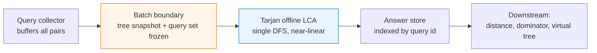

# Offline LCA — Senior Level

> Tarjan's offline LCA is almost never the *system* — it is a near-linear batch kernel that runs inside a larger tree-analytics pipeline. The senior questions are about where that kernel sits: how you feed it queries at scale, how you keep a `10⁸`-node tree DFS from blowing the stack or the page cache, when partitioning helps and when it is a trap, and how you tell, in production, that a batch job is healthy rather than silently wrong.

## Table of Contents
1. [Introduction](#1-introduction)
2. [System Design: Batch Tree-Query Services](#2-system-design-batch-tree-query-services)
3. [Distributed / Large-Tree Processing](#3-distributed--large-tree-processing)
4. [Concurrency](#4-concurrency)
5. [Comparison at Scale](#5-comparison-at-scale)
6. [Architecture Patterns](#6-architecture-patterns)
7. [Code Examples](#7-code-examples)
8. [Observability](#8-observability)
9. [Failure Modes](#9-failure-modes)
10. [Capacity Planning](#10-capacity-planning)
11. [Summary](#11-summary)

---

## 1. Introduction

At senior level the algorithm itself is settled — one DFS, `N−1` unions, `O((N+Q)α(N))`. The interesting decisions are architectural:

1. The algorithm is **offline**: it cannot answer a query that arrives after the batch starts. That single constraint dictates *where* it can live — never on the hot path of an interactive service, always behind a batch boundary.
2. It is **recursive by nature**: on a deep tree a naive DFS overflows the stack. At scale you must control traversal explicitly.
3. It is **memory-light but stack-heavy**: a few `O(N)` arrays plus per-node query buckets, but a recursion or explicit stack proportional to tree height.
4. It is **embarrassingly batchable across independent trees**, but a *single* tree's DFS is inherently sequential along the gray path.

This document treats those four facts as design constraints and walks through the systems they imply.

---

## 2. System Design: Batch Tree-Query Services

### 2.1 Where the kernel belongs



The non-negotiable architectural element is the **batch boundary**: a point in time where the tree and the full query set are frozen. Offline LCA is correct only relative to a consistent snapshot. If the tree mutates while the DFS runs, answers are undefined.

| Layer | Responsibility |
|-------|----------------|
| Collector | Accumulates `(u, v)` query pairs (and their kinds: LCA, distance, ancestor-test) into a buffer until the batch closes. |
| Snapshot | Freezes the tree topology and the query buffer. Versioned, so re-runs are reproducible. |
| Kernel | Tarjan DFS + DSU. Pure function of (tree, queries) → answers. |
| Answer store | Maps answer back to query id; persists for downstream consumers. |

### 2.2 When offline is the right shape

- **Nightly analytics** over a fixed org chart / file-system tree / category taxonomy.
- **One-shot enrichment**: given a batch of event pairs, compute their tree distances.
- **Compiler / static-analysis passes**: dominator-tree ancestor questions for a fixed CFG.
- **Bulk RMQ** via Cartesian tree (RMQ ↔ LCA reduction).

If any of these instead needed *interactive* per-query latency, you would switch to an online structure (binary lifting, Euler+sparse-table) and pay the `O(N log N)` build once.

### 2.3 What a batch buys you

A pure-function kernel is trivially **cacheable** and **idempotent**: same snapshot ⇒ same answers. That makes retries safe, enables result memoization keyed by snapshot hash, and lets you re-run with a fixed seed for debugging. These are properties an online interactive service cannot offer as cleanly.

---

## 3. Distributed / Large-Tree Processing

### 3.1 The single-tree DFS is sequential

Within one tree, the gray path is a single root-to-current chain and the union order is dictated by post-order. You cannot trivially parallelize the DFS of one tree without losing the invariant. So scaling strategies fall into two camps:

1. **Many independent trees / components** → embarrassingly parallel; one worker per tree.
2. **One huge tree** → must control memory and stack; partitioning is possible but delicate.

### 3.2 External-memory DFS on a huge tree

When the tree does not fit in RAM (billions of nodes), a recursive DFS is impossible and even an explicit stack of node ids may be large. Techniques:

- **Explicit stack with child-pointer state** (as in `middle.md`), stored in a memory-mapped array. The stack depth equals tree height — pre-size it.
- **Edge-list streaming**: store children contiguously in DFS-friendly order so the traversal reads sequentially, maximizing page-cache hits.
- **Block/cache-aware DSU**: the `parent`, `rank`, `ancestor` arrays are random-access; keep them resident and only stream the adjacency.
- **Euler-order relabeling**: relabel nodes by DFS-entry order so that subtree members are contiguous index ranges — improves locality for both the DSU and query buckets.

### 3.3 Partitioned trees

You *can* split a giant tree at a cut set into a top tree and several bottom subtrees:

- Resolve queries whose both endpoints lie inside the same bottom subtree locally (a sub-batch Tarjan per subtree).
- For cross-partition queries, you need the LCA which lies in the top tree; resolve those after stitching, using the cut nodes' depths.

This is real engineering work and only pays off when a single tree truly exceeds one machine. For the common case (`N ≤ 10⁸` fitting in tens of GB), a single-machine streaming DFS is simpler and faster than any distributed scheme.

### 3.4 Sharding the *query* set, not the tree

If the tree fits in memory but `Q` is enormous (billions of pairs), shard the **queries**: replicate the tree to `K` workers, split the query set into `K` chunks, run `K` independent Tarjan passes (each over the full tree but only its chunk of queries), and concatenate answers. The DFS is repeated `K` times — `O(K·N + Q)` total — which is fine when `Q ≫ K·N`.

---

## 4. Concurrency

### 4.1 Parallelizing independent subtrees — and its limit

The `dfs(child)` calls for *siblings* are independent: sibling subtrees never share a DSU set until their parent unions them. In principle you could fork a task per child subtree, run each on its own DSU, and merge at the parent.

The limit: **queries that straddle two sibling subtrees** cannot be answered until both have finished and been unioned under the common parent. So a parallel scheme must defer cross-subtree queries to the parent's post-visit, after a sequential merge of the child DSUs. The merge of two DSUs is not free — it is `O(size)` to relabel — so parallelism pays off only for large, balanced subtrees and a query mix dominated by *intra*-subtree pairs.

### 4.2 Why naive locking fails

A single mutex around the shared DSU serializes the entire DFS — you gain nothing. The DSU's hot structure (the gray path's representative chain) is touched by every union, so lock striping does not help, exactly as with a binary heap's hot root.

### 4.3 Practical stance

For almost all workloads, the right concurrency model is **task-level parallelism across independent batches/trees**, with each batch single-threaded. Reserve intra-tree parallelism for the rare giant-balanced-tree case, and benchmark it against a single fast sequential pass before committing — the sequential pass is often already memory-bandwidth bound, leaving little for extra cores to win.

---

## 5. Comparison at Scale

| Property | Tarjan offline | Binary lifting | Euler + sparse table | Heavy-Light + segtree |
|----------|----------------|----------------|----------------------|-----------------------|
| Preprocessing | none | `O(N log N)` time & space | `O(N log N)` | `O(N)` |
| Per-query | `α(N)` amortized | `O(log N)` | `O(1)` | `O(log² N)` |
| Online | No | Yes | Yes | Yes |
| Memory footprint | smallest (`O(N+Q)`) | largest (`O(N log N)`) | large | moderate |
| Supports path updates | No | No | No | **Yes** |
| Re-run cost on new query set | full pass | free (table reused) | free | free |
| Best at scale when | one frozen batch, RAM-tight | streaming queries, also need k-th ancestor | many `O(1)` lookups after one build | path aggregates with updates |

The decisive axis at scale is **how often the query set changes versus the tree**:

- Tree static, *one* query batch → Tarjan (no wasted build).
- Tree static, *many* query batches over time → build an online structure once and reuse.
- Tree changing → heavy-light / link-cut; Tarjan and the static online methods are both invalidated by mutation.

---

## 6. Architecture Patterns

### 6.1 Snapshot + pure kernel

Freeze `(tree_version, query_set)` → hash → run kernel → store answers under that hash. Retries and re-runs hit the cache. This is the cleanest way to make a batch job reproducible and idempotent.

### 6.2 Streaming explicit-stack DFS

```text
stack = [(root, child_ptr=0)]
ancestor[find(root)] = root
while stack:
    (u, p) = top(stack)
    if p < deg(u):
        c = child(u, p); top.child_ptr += 1
        ancestor[find(c)] = c
        push(c, 0)
    else:
        visited[u] = true
        for (other, qid) in queries[u]:
            if visited[other]: ans[qid] = ancestor[find(other)]
        pop()
        if stack: union(parent_of_u, u)
```

Pre-size the stack to tree height; stream adjacency from disk in DFS order.

### 6.3 Query sharding for huge Q

Replicate the (in-memory) tree to `K` workers; partition queries into `K` chunks; run `K` Tarjan passes; concatenate. `O(K·N + Q)`.

### 6.4 Hybrid with online fallback

Serve the known batch via Tarjan; if a *late* query arrives that was not in the batch, fall back to a cheap on-demand LCA (climb-with-depths, or a pre-built binary-lifting table). Keeps the batch fast and the tail correct.

---

## 7. Code Examples

### 7.1 Go — snapshot-keyed batch runner with explicit-stack DFS

```go
package lca

// Snapshot is a frozen (tree, queries) pair. The kernel is a pure function of it.
type Snapshot struct {
	Adj     [][]int   // children adjacency, DFS-friendly order
	Root    int
	Queries [][2]int  // pairs by node id
}

type dsu struct{ parent, rank, anc []int }

func newDSU(n int) *dsu {
	d := &dsu{make([]int, n), make([]int, n), make([]int, n)}
	for i := range d.parent {
		d.parent[i], d.anc[i] = i, i
	}
	return d
}
func (d *dsu) find(x int) int {
	for d.parent[x] != x {
		d.parent[x] = d.parent[d.parent[x]]
		x = d.parent[x]
	}
	return x
}
func (d *dsu) union(p, c int) {
	rp, rc := d.find(p), d.find(c)
	if rp == rc {
		return
	}
	if d.rank[rp] < d.rank[rc] {
		rp, rc = rc, rp
	}
	d.parent[rc] = rp
	if d.rank[rp] == d.rank[rc] {
		d.rank[rp]++
	}
	d.anc[d.find(rp)] = p
}

// Run is pure: same Snapshot always yields the same answers.
func Run(s Snapshot) []int {
	n := len(s.Adj)
	d := newDSU(n)
	visited := make([]bool, n)
	ans := make([]int, len(s.Queries))
	for i := range ans {
		ans[i] = -1
	}
	type q struct{ other, id int }
	qByNode := make([][]q, n)
	for id, pr := range s.Queries {
		qByNode[pr[0]] = append(qByNode[pr[0]], q{pr[1], id})
		qByNode[pr[1]] = append(qByNode[pr[1]], q{pr[0], id})
	}

	type frame struct{ node, ci int }
	stack := make([]frame, 0, n) // pre-sized; never grows past height in practice
	stack = append(stack, frame{s.Root, 0})
	d.anc[d.find(s.Root)] = s.Root

	for len(stack) > 0 {
		top := &stack[len(stack)-1]
		u := top.node
		if top.ci < len(s.Adj[u]) {
			c := s.Adj[u][top.ci]
			top.ci++
			d.anc[d.find(c)] = c
			stack = append(stack, frame{c, 0})
		} else {
			visited[u] = true
			for _, qq := range qByNode[u] {
				if visited[qq.other] {
					ans[qq.id] = d.anc[d.find(qq.other)]
				}
			}
			stack = stack[:len(stack)-1]
			if len(stack) > 0 {
				d.union(stack[len(stack)-1].node, u)
			}
		}
	}
	return ans
}
```

### 7.2 Java — query sharding across worker threads

```java
import java.util.*;
import java.util.concurrent.*;

public final class ShardedTarjan {
    // Replicate tree to K workers; each runs full DFS but only resolves its query chunk.
    public static int[] run(List<List<Integer>> adj, int root,
                            int[][] queries, int k) throws Exception {
        int total = queries.length;
        int[] answers = new int[total];
        ExecutorService pool = Executors.newFixedThreadPool(k);
        List<Future<?>> futures = new ArrayList<>();
        int chunk = (total + k - 1) / k;
        for (int s = 0; s < total; s += chunk) {
            final int lo = s, hi = Math.min(total, s + chunk);
            futures.add(pool.submit(() -> {
                int[][] sub = Arrays.copyOfRange(queries, lo, hi);
                int[] partial = new SingleTarjan().solve(adj, root, sub);
                System.arraycopy(partial, 0, answers, lo, partial.length);
            }));
        }
        for (Future<?> f : futures) f.get();
        pool.shutdown();
        return answers;
    }

    // SingleTarjan = the iterative kernel from middle.md (omitted here for brevity).
    static final class SingleTarjan {
        int[] solve(List<List<Integer>> adj, int root, int[][] q) {
            // ... iterative Tarjan offline LCA, returns answers for q ...
            return new int[q.length];
        }
    }
}
```

### 7.3 Python — reproducible run keyed by snapshot hash

```python
import hashlib
import json


def snapshot_hash(adj, root, queries) -> str:
    payload = json.dumps({"adj": adj, "root": root, "q": queries},
                         sort_keys=True).encode()
    return hashlib.sha256(payload).hexdigest()


_cache: dict[str, list[int]] = {}


def run_batch(adj, root, queries):
    """Idempotent, cached runner. Same snapshot -> same answers, no recompute."""
    key = snapshot_hash(adj, root, queries)
    if key in _cache:
        return _cache[key]
    ans = tarjan_lca_iterative(adj, root, queries)  # from middle.md
    _cache[key] = ans
    return ans
```

The snapshot hash makes the batch idempotent: a retried job recomputes nothing, and an auditor can verify reproducibility from the key alone.

---

## 8. Observability

A batch kernel is invisible until it produces wrong answers or runs long. Instrument it.

| Signal | Type | Why |
|--------|------|-----|
| `batch_nodes` / `batch_queries` | gauge | Sizing; detect runaway batches. |
| `dfs_max_stack_depth` | gauge | Equals tree height; warns before a stack-size overflow on deep trees. |
| `unions_total` | counter | Should equal `N − 1`; a mismatch signals a malformed tree or unreached nodes. |
| `unanswered_queries` | counter | Queries with answer `-1` after the run — should be 0 for a connected tree. Non-zero ⇒ disconnected node or bug. |
| `dfs_duration_seconds` | histogram | Latency; regressions hint at lost path compression. |
| `find_path_length_avg` | gauge | Average `find` walk; spikes mean DSU optimizations are not engaging. |
| `snapshot_version` | label | Ties answers to a frozen input for reproducibility. |

The single highest-value check is `unanswered_queries == 0`. For a connected tree every query whose endpoints both exist *must* resolve; a stray `-1` is the clearest sign of a malformed query, a disconnected forest, or a missing both-endpoints registration.

A correctness canary worth running in CI: pick a random sample of resolved queries and verify each against an independent climb-with-depths LCA. A divergence fails the batch loudly.

---

## 9. Failure Modes

### 9.1 Deep-tree recursion overflow
A path-shaped tree of `N` nodes recurses `N` deep. Mitigation: explicit-stack DFS (Section 6.2), stack pre-sized to height; raise OS thread-stack limits only as a fallback.

### 9.2 Malformed or out-of-range queries
A query referencing a non-existent node id, or `(u, v)` with `u` in a different component, never resolves (`-1`) or indexes out of bounds. Mitigation: validate node ids against `[0, N)` at the batch boundary; emit `unanswered_queries`; treat cross-component pairs as "no common ancestor."

### 9.3 Tree mutation mid-batch
The whole algorithm assumes a frozen snapshot. A concurrent edit corrupts both the DFS and the DSU. Mitigation: hard snapshot boundary; never run against a live, mutating tree.

### 9.4 Lost DSU optimizations
If `find` loses path compression or `union` loses ranking (e.g. a refactor), time degrades from `α(N)` to `O(log N)` or `O(N)` per op. Mitigation: assert/benchmark `find_path_length_avg`; property-test the DSU.

### 9.5 Stale `ancestor` after union
Forgetting to re-assign `ancestor[find(parent)] = parent` after a union collapses every LCA to the root. This is the single most common *correctness* bug. Mitigation: a unit test on the tiny canonical tree from `junior.md`; the canary in Section 8.

### 9.6 Memory blow-up from duplicate queries
A pathological input with `Q` duplicates of the same pair inflates per-node buckets. Mitigation: optional dedupe keyed by `(min(u,v), max(u,v))`, mapping duplicates to one canonical answer.

### 9.7 Wrong root / forest assumed as tree
Running from a single root when the input is a forest leaves whole components unvisited. Mitigation: loop the DFS over all roots; assert every node visited.

---

## 10. Capacity Planning

### 10.1 Memory model
Per node: `parent`, `rank`, `ancestor`, `visited` ≈ 4 ints (~32 bytes with overhead). Per query: stored on both endpoints ≈ 2 small records (~32 bytes). Adjacency: `N − 1` child entries.

- `N = 10⁸` nodes: DSU arrays ≈ `10⁸ × 32 B ≈ 3.2 GB`, adjacency another few GB — fits comfortably on a 32–64 GB box.
- `Q = 10⁸` queries: bucket storage ≈ `2 × 10⁸ × 32 B ≈ 6.4 GB`.

So the realistic single-node ceiling is governed by `N + Q` together; tens of millions of each is trivial, hundreds of millions needs a 64 GB+ machine.

### 10.2 Throughput
A single Tarjan pass is memory-bandwidth bound (random access into DSU arrays). Expect roughly `5–20 M (node+query) operations / second / core` depending on cache behavior and array layout. So `N + Q = 2×10⁶` finishes in well under a second; `2×10⁸` in tens of seconds.

### 10.3 Stack sizing
Explicit-stack depth = tree height. Balanced tree → `O(log N)` (tiny). Path-shaped tree → `N` (pre-size the stack array to `N` to be safe). Recursive DFS thread stack must cover the height; default 1 MB stacks overflow around `10⁴`–`10⁵` deep frames.

### 10.4 When to leave the single node
- `N + Q` exceeds available RAM (hundreds of millions, no 64 GB+ host) → stream adjacency from disk or partition the tree.
- `Q ≫ N` and you have spare cores → shard the query set across `K` workers (`O(K·N + Q)`).
- The tree changes between batches → abandon offline LCA for an online or dynamic structure.

Until one of those triggers, a single-machine streaming pass is the simplest correct answer.

---

## 11. Summary

- Tarjan offline LCA is a **batch kernel**, not a service: it requires a frozen `(tree, queries)` snapshot and cannot answer late or interactive queries.
- The single-tree DFS is sequential along the gray path; scale by **batching across independent trees** or **sharding the query set**, not by parallelizing one tree's DFS (whose only win, cross-sibling deferral, rarely pays).
- On giant trees, control traversal with an **explicit, pre-sized stack** and stream adjacency in DFS order for page-cache locality; relabel by entry order for DSU locality.
- The kernel is a **pure function** — snapshot-hash it for idempotent, reproducible, cacheable runs.
- Watch `unanswered_queries == 0`, `unions_total == N − 1`, and `dfs_max_stack_depth`; the most common correctness bug is a stale `ancestor` after a union, the most common scaling bug is a recursive DFS on a deep tree.
- Capacity is governed by `N + Q` memory and memory bandwidth; tens of millions are trivial on one box, hundreds of millions need 64 GB+ or partitioning.
- The architectural decision is almost always **offline-vs-online**, not asymptotics: choose Tarjan for one frozen batch on a static tree; choose binary lifting / Euler+sparse-table when queries stream; choose heavy-light / link-cut when the tree mutates.
