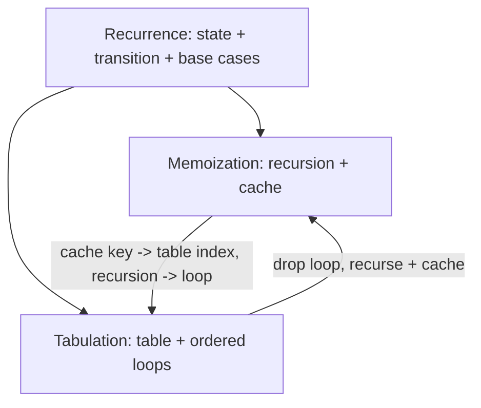

# Memoization vs Tabulation (The Two Core DP Styles) — Junior Level

> **One-line summary:** Dynamic programming solves a problem by reusing answers to smaller overlapping subproblems. **Memoization** is top-down — ordinary recursion plus a cache that remembers each answer. **Tabulation** is bottom-up — an iterative table you fill from the smallest subproblems to the biggest. Same recurrence, same answers, two ways to evaluate it.

---

## Table of Contents

1. [Introduction](#introduction)
2. [Prerequisites](#prerequisites)
3. [Glossary](#glossary)
4. [Core Concepts](#core-concepts)
5. [Big-O Summary](#big-o-summary)
6. [Real-World Analogies](#real-world-analogies)
7. [Pros & Cons](#pros--cons)
8. [Step-by-Step Walkthrough](#step-by-step-walkthrough)
9. [Code Examples](#code-examples)
10. [Coding Patterns](#coding-patterns)
11. [Error Handling](#error-handling)
12. [Performance Tips](#performance-tips)
13. [Best Practices](#best-practices)
14. [Edge Cases & Pitfalls](#edge-cases--pitfalls)
15. [Common Mistakes](#common-mistakes)
16. [Cheat Sheet](#cheat-sheet)
17. [Visual Animation](#visual-animation)
18. [Summary](#summary)
19. [Further Reading](#further-reading)

---

## Introduction

Imagine you are asked for the 50th Fibonacci number. The textbook definition is `fib(n) = fib(n-1) + fib(n-2)`, with `fib(0) = 0` and `fib(1) = 1`. You write the obvious recursion and run it — and your program hangs. The reason is that plain recursion recomputes the *same* subproblems over and over. Computing `fib(50)` calls `fib(49)` and `fib(48)`; `fib(49)` itself calls `fib(48)` again, and so the tree of calls explodes to roughly `2^n` nodes. `fib(48)` alone is recomputed billions of times.

**Dynamic programming (DP)** is the cure. The idea is almost embarrassingly simple: *compute each distinct subproblem only once, store the result, and reuse it.* That single discipline turns an exponential `O(2^n)` algorithm into a linear `O(n)` one.

There are exactly two standard ways to apply that discipline, and this entire topic is about the difference between them:

> **Memoization (top-down):** keep the natural recursion, but the first time you solve a subproblem you write the answer into a cache. Every later call for the same subproblem reads the cache instead of recomputing.
>
> **Tabulation (bottom-up):** throw away the recursion. Create a table (an array), fill the smallest subproblems first by hand, then fill each larger entry using entries you already filled, marching forward until you reach the answer.

Both compute the *exact same function* — they evaluate the same recurrence and produce identical numbers. They differ in *how* they walk through the subproblems: memoization is lazy and demand-driven (it only solves subproblems it actually needs, in whatever order recursion reaches them), while tabulation is eager and ordered (it solves every subproblem in a fixed, dependency-respecting order).

DP applies whenever a problem has two properties:

- **Optimal substructure** — the answer to the whole problem can be built from answers to smaller subproblems. (`fib(n)` is built from `fib(n-1)` and `fib(n-2)`.)
- **Overlapping subproblems** — the same smaller subproblems show up again and again across the recursion. (`fib(48)` is needed by many callers.)

If both hold, DP turns repeated work into a single lookup. Throughout this file we will use three small running examples — **Fibonacci**, **climbing stairs**, and a **grid-path counter** — and show each one written *both* ways, so you can see exactly how memoization and tabulation relate.

---

## Prerequisites

Before reading this file you should be comfortable with:

- **Recursion** — a function that calls itself, with base cases that stop the recursion.
- **Arrays / 1D and 2D** — DP tables are just arrays indexed by the subproblem.
- **Hash maps / dictionaries** — the simplest memoization cache is a map from "subproblem key" to "answer".
- **Big-O notation** — `O(n)`, `O(2^n)`, `O(n·m)`; we compare these constantly.
- **Loops and nested loops** — tabulation fills tables with `for` loops.

Optional but helpful:

- A glance at **the call stack** — memoization's depth equals the recursion depth, which matters later.
- Familiarity with **a single recurrence relation** (like Fibonacci) so the abstract idea has a concrete anchor.

You do **not** need any advanced math. DP at this level is bookkeeping: figure out the subproblems, store their answers, reuse them.

---

## Glossary

| Term | Meaning |
|------|---------|
| **Subproblem** | A smaller instance of the same problem (e.g. `fib(k)` for `k < n`). |
| **State** | The set of parameters that uniquely identify a subproblem. For Fibonacci the state is just `n`; for a grid it is `(row, col)`. |
| **Transition** | The recurrence rule that builds a state's answer from smaller states' answers. |
| **Optimal substructure** | The property that the whole answer is composed of subproblem answers. |
| **Overlapping subproblems** | The property that the same subproblem is reached many times. |
| **Memoization** | Top-down DP: recursion + a cache that stores each computed subproblem. |
| **Tabulation** | Bottom-up DP: an iterative table filled from base cases upward. |
| **DP table** | The array (1D, 2D, …) holding one slot per state. |
| **Base case** | A state whose answer is known directly, with no recursion (e.g. `fib(0)=0`). |
| **Memo / cache** | The store of already-computed answers (an array or hash map). |
| **Rolling array** | A space optimization that keeps only the last few rows/values instead of the whole table. |
| **Evaluation order** | The sequence in which states are solved; in tabulation it must respect dependencies. |

---

## Core Concepts

### 1. What dynamic programming is

DP = **recursion + reuse.** You identify the recurrence (how a big answer is built from smaller ones), then make sure each distinct subproblem is computed only once. That's it. The "dynamic programming" name is historical and a bit misleading; think of it as "careful, cached recursion."

Two ingredients must be present:

- **Optimal substructure:** `solve(big)` can be expressed using `solve(smaller)`.
- **Overlapping subproblems:** those `solve(smaller)` calls repeat.

If subproblems *don't* overlap (each appears once), caching buys nothing — that's plain divide-and-conquer (like merge sort), not DP.

### 2. Top-down memoization

Start from the original problem and recurse downward, but guard every call with a cache:

```
solve(state):
    if state is a base case:        return known answer
    if cache has state:             return cache[state]   # reuse!
    answer = combine(solve(smaller states...))            # the transition
    cache[state] = answer                                 # store before returning
    return answer
```

The first visit to a state computes it; every later visit is an `O(1)` lookup. The recursion naturally only touches the states it needs.

### 3. Bottom-up tabulation

Flip it around. Allocate a table, fill the base cases directly, then loop in an order where every state's dependencies are already filled:

```
table[base states] = known answers
for state in dependency order (smallest first):
    table[state] = combine(table[smaller states...])
return table[target]
```

No recursion, no cache lookups, no call stack — just array writes in a careful order.

### 4. State design and transition

The hardest part of DP is **deciding what the state is** and **writing the transition**. Ask:

- *What parameters fully describe a subproblem?* Those are the state. (Fibonacci: `n`. Grid: `(r, c)`.)
- *How is this state's answer built from smaller states?* That's the transition (the recurrence).
- *Which states are base cases?* Those need no transition.

Once you have state + transition + base cases, you can write *either* style mechanically. The recurrence is the same; only the evaluation strategy differs.

### 5. Converting a recurrence to either style

Given a recurrence like `f(n) = f(n-1) + f(n-2)`:

- **To memoize:** write the recursion that mirrors the recurrence, add a cache check at the top and a cache write before returning.
- **To tabulate:** make an array `dp[0..n]`, set base cases `dp[0]`, `dp[1]`, then loop `for i := 2..n: dp[i] = dp[i-1] + dp[i-2]`.

They are two encodings of one recurrence.

### 6. Space optimization (rolling arrays)

Often a state only depends on a *few* recent states. Fibonacci's `dp[i]` needs only `dp[i-1]` and `dp[i-2]`, so you can keep **two variables** instead of a whole array — dropping space from `O(n)` to `O(1)`. In a 2D grid where `dp[r][c]` depends only on the previous row, you keep **one row** instead of the full grid — `O(cols)` instead of `O(rows·cols)`. This is called a **rolling array** (or dimension reduction) and it works naturally in the tabulation style because you control the fill order.

---

## Big-O Summary

For a DP with `S` distinct states and a transition that costs `T` per state, **both** styles run in `O(S · T)` time. The difference is in constants and space.

| Approach | Time | Space | Notes |
|----------|------|-------|-------|
| Naive recursion (no cache) | **O(2^n)** for Fibonacci | O(n) stack | Recomputes overlapping subproblems — the thing DP fixes. |
| Memoization (top-down) | **O(S · T)** | O(S) cache + O(depth) stack | Solves only reachable states; recursion stack adds depth. |
| Tabulation (bottom-up) | **O(S · T)** | O(S) table | No call stack; iterative. |
| Tabulation + rolling array | O(S · T) | **O(reduced)** | e.g. O(1) for Fibonacci, O(cols) for a grid. |

For our three examples (`S` = number of states):

| Problem | States `S` | Transition `T` | Total time | Naive space → optimized |
|---------|-----------|----------------|------------|--------------------------|
| Fibonacci `fib(n)` | `n+1` | O(1) | **O(n)** | O(n) → **O(1)** |
| Climbing stairs `n` | `n+1` | O(1) | **O(n)** | O(n) → **O(1)** |
| Grid paths `R × C` | `R·C` | O(1) | **O(R·C)** | O(R·C) → **O(C)** |

The headline: DP collapses exponential blowup into `O(states × transition cost)`.

---

## Real-World Analogies

| Concept | Analogy |
|---------|---------|
| Overlapping subproblems | Three people independently look up the same fact. Without sharing, each does the full research; DP means the first person writes it on a whiteboard and the rest just read it. |
| Memoization (top-down) | A student doing homework problems out of order, jotting each answer in the margin. When a later problem reuses an earlier result, they glance at the margin instead of redoing it. |
| Tabulation (bottom-up) | A bricklayer building a wall row by row from the ground up. You can't lay the third row until rows one and two exist. The fill order is forced. |
| State | The "address" of a subproblem — like a seat number that uniquely identifies one spot. |
| Transition | The recipe that says "to make this dish, combine these already-prepared ingredients." |
| Rolling array | A chef who keeps only the two most recent prep bowls on the counter and washes the rest — saving space because old bowls are never needed again. |
| Base case | A fact you simply *know* (the multiplication table's `0 × anything = 0`), no work required. |

Where the analogies break: real whiteboards have limited space; our caches are sized exactly to the number of states. And unlike a bricklayer, memoization can skip rows it never needs.

---

## Pros & Cons

### Memoization (top-down)

| Pros | Cons |
|------|------|
| Code mirrors the recurrence — easy to write once you have the recursion. | Uses the call stack; deep recursion can overflow it. |
| Solves only the states actually reached (lazy) — can skip irrelevant ones. | Function-call and hash-lookup overhead (slower constant factor). |
| No need to figure out a global fill order. | Cache can be a hash map with hashing overhead if state isn't a simple integer. |
| Great when the reachable states are a small subset of all possible states. | Harder to apply rolling-array space optimization. |

### Tabulation (bottom-up)

| Pros | Cons |
|------|------|
| No recursion → no stack-overflow risk; pure loops. | Must work out a valid fill order up front. |
| Lower constant factor (array indexing, no call overhead). | Computes *every* state in range, even unreachable ones. |
| Rolling-array space optimization is natural. | Code reads less like the original recurrence. |
| Cache-friendly sequential memory access. | Off-by-one bugs in loop bounds are common. |

**When to prefer memoization:** the recurrence is complex/irregular, only a fraction of states are reachable, or you're prototyping and want code that matches the math.

**When to prefer tabulation:** recursion would be very deep (stack-overflow risk), you need the speed of tight loops, or you want rolling-array space savings.

---

## Step-by-Step Walkthrough

Let's compute **`fib(5)`** both ways and watch the difference.

The recurrence: `fib(0) = 0`, `fib(1) = 1`, `fib(n) = fib(n-1) + fib(n-2)`.

### Memoization (top-down), starting from `fib(5)`

The cache starts empty: `{}`. We call `fib(5)`.

```
fib(5) wants fib(4) + fib(3)
  fib(4) wants fib(3) + fib(2)
    fib(3) wants fib(2) + fib(1)
      fib(2) wants fib(1) + fib(0)
        fib(1) = 1   (base)        cache: {1:1}
        fib(0) = 0   (base)        cache: {0:0, 1:1}
      fib(2) = 1 + 0 = 1           cache: {0:0,1:1,2:1}
      fib(1) = 1   (cached read)
    fib(3) = 1 + 1 = 2             cache: {...,3:2}
    fib(2) = 1   (cached read! no recompute)
  fib(4) = 2 + 1 = 3               cache: {...,4:3}
  fib(3) = 2   (cached read!)
fib(5) = 3 + 2 = 5                 cache: {...,5:5}
```

Notice `fib(2)` and `fib(3)` were each computed **once**; the second time they were needed, the cache answered instantly. That's the whole win. Without the cache, `fib(2)` would be recomputed 3 times and the tree would be exponential.

### Tabulation (bottom-up), filling a table

We allocate `dp[0..5]` and fill left to right:

```
dp[0] = 0          (base)
dp[1] = 1          (base)
dp[2] = dp[1] + dp[0] = 1
dp[3] = dp[2] + dp[1] = 2
dp[4] = dp[3] + dp[2] = 3
dp[5] = dp[4] + dp[3] = 5
answer = dp[5] = 5
```

Same numbers, but no recursion and a guaranteed order: each `dp[i]` is computed *after* `dp[i-1]` and `dp[i-2]` already exist. No cache misses are possible because we never ask for an entry before filling it.

### Rolling-array version (O(1) space)

`dp[i]` only needs the previous two values, so keep two variables:

```
prev2 = 0    # fib(0)
prev1 = 1    # fib(1)
repeat (n-1) times:
    cur   = prev1 + prev2
    prev2 = prev1
    prev1 = cur
answer = prev1
```

For `fib(5)`: `(0,1)→(1,1)→(1,2)→(2,3)→(3,5)` → answer `5`. We never stored a full array.

---

## Code Examples

### Example 1: Fibonacci — both styles

#### Go

```go
package main

import "fmt"

// --- Top-down memoization ---
func fibMemo(n int, cache map[int]int) int {
	if n < 2 {
		return n // base cases fib(0)=0, fib(1)=1
	}
	if v, ok := cache[n]; ok {
		return v // reuse cached subproblem
	}
	res := fibMemo(n-1, cache) + fibMemo(n-2, cache)
	cache[n] = res // store before returning
	return res
}

// --- Bottom-up tabulation ---
func fibTab(n int) int {
	if n < 2 {
		return n
	}
	dp := make([]int, n+1)
	dp[0], dp[1] = 0, 1
	for i := 2; i <= n; i++ {
		dp[i] = dp[i-1] + dp[i-2]
	}
	return dp[n]
}

// --- Rolling array: O(1) space ---
func fibRolling(n int) int {
	if n < 2 {
		return n
	}
	prev2, prev1 := 0, 1
	for i := 2; i <= n; i++ {
		prev2, prev1 = prev1, prev1+prev2
	}
	return prev1
}

func main() {
	fmt.Println(fibMemo(10, map[int]int{})) // 55
	fmt.Println(fibTab(10))                 // 55
	fmt.Println(fibRolling(10))             // 55
}
```

#### Java

```java
import java.util.HashMap;
import java.util.Map;

public class Fib {
    // Top-down memoization
    static int fibMemo(int n, Map<Integer, Integer> cache) {
        if (n < 2) return n;
        Integer cached = cache.get(n);
        if (cached != null) return cached;
        int res = fibMemo(n - 1, cache) + fibMemo(n - 2, cache);
        cache.put(n, res);
        return res;
    }

    // Bottom-up tabulation
    static int fibTab(int n) {
        if (n < 2) return n;
        int[] dp = new int[n + 1];
        dp[0] = 0; dp[1] = 1;
        for (int i = 2; i <= n; i++) dp[i] = dp[i - 1] + dp[i - 2];
        return dp[n];
    }

    // Rolling array: O(1) space
    static int fibRolling(int n) {
        if (n < 2) return n;
        int prev2 = 0, prev1 = 1;
        for (int i = 2; i <= n; i++) {
            int cur = prev1 + prev2;
            prev2 = prev1;
            prev1 = cur;
        }
        return prev1;
    }

    public static void main(String[] args) {
        System.out.println(fibMemo(10, new HashMap<>())); // 55
        System.out.println(fibTab(10));                   // 55
        System.out.println(fibRolling(10));               // 55
    }
}
```

#### Python

```python
from functools import lru_cache


# Top-down memoization (manual cache)
def fib_memo(n, cache=None):
    if cache is None:
        cache = {}
    if n < 2:
        return n
    if n in cache:
        return cache[n]
    cache[n] = fib_memo(n - 1, cache) + fib_memo(n - 2, cache)
    return cache[n]


# Top-down memoization the Pythonic way: decorator handles the cache
@lru_cache(maxsize=None)
def fib_memo_decor(n):
    if n < 2:
        return n
    return fib_memo_decor(n - 1) + fib_memo_decor(n - 2)


# Bottom-up tabulation
def fib_tab(n):
    if n < 2:
        return n
    dp = [0] * (n + 1)
    dp[1] = 1
    for i in range(2, n + 1):
        dp[i] = dp[i - 1] + dp[i - 2]
    return dp[n]


# Rolling array: O(1) space
def fib_rolling(n):
    if n < 2:
        return n
    prev2, prev1 = 0, 1
    for _ in range(2, n + 1):
        prev2, prev1 = prev1, prev1 + prev2
    return prev1


if __name__ == "__main__":
    print(fib_memo(10))        # 55
    print(fib_memo_decor(10))  # 55
    print(fib_tab(10))         # 55
    print(fib_rolling(10))     # 55
```

**What it does:** computes `fib(10) = 55` four different ways, all agreeing.
**Run:** `go run fib.go` | `javac Fib.java && java Fib` | `python fib.py`

### Example 2: Climbing Stairs — both styles

Problem: you climb `n` stairs taking 1 or 2 steps at a time. How many distinct ways? The recurrence is identical to Fibonacci: `ways(n) = ways(n-1) + ways(n-2)`, with `ways(0) = 1` (one way: do nothing) and `ways(1) = 1`.

#### Go

```go
func climbMemo(n int, cache map[int]int) int {
	if n <= 1 {
		return 1
	}
	if v, ok := cache[n]; ok {
		return v
	}
	cache[n] = climbMemo(n-1, cache) + climbMemo(n-2, cache)
	return cache[n]
}

func climbTab(n int) int {
	if n <= 1 {
		return 1
	}
	a, b := 1, 1 // ways(0), ways(1) — rolling
	for i := 2; i <= n; i++ {
		a, b = b, a+b
	}
	return b
}
```

#### Java

```java
static int climbMemo(int n, Map<Integer,Integer> cache) {
    if (n <= 1) return 1;
    Integer c = cache.get(n);
    if (c != null) return c;
    int res = climbMemo(n-1, cache) + climbMemo(n-2, cache);
    cache.put(n, res);
    return res;
}

static int climbTab(int n) {
    if (n <= 1) return 1;
    int a = 1, b = 1;            // ways(0), ways(1)
    for (int i = 2; i <= n; i++) {
        int c = a + b;
        a = b; b = c;
    }
    return b;
}
```

#### Python

```python
def climb_memo(n, cache=None):
    if cache is None:
        cache = {}
    if n <= 1:
        return 1
    if n in cache:
        return cache[n]
    cache[n] = climb_memo(n - 1, cache) + climb_memo(n - 2, cache)
    return cache[n]


def climb_tab(n):
    if n <= 1:
        return 1
    a, b = 1, 1                  # ways(0), ways(1)
    for _ in range(2, n + 1):
        a, b = b, a + b
    return b
```

### Example 3: Grid Paths — a 2D example, both styles

Problem: in an `R × C` grid you start top-left `(0,0)` and may move only **right** or **down**. How many distinct paths reach the bottom-right `(R-1, C-1)`? State is `(r, c)`; transition `paths(r,c) = paths(r-1,c) + paths(r,c-1)`; base case `paths(0,0) = 1` and any cell off the grid contributes 0.

#### Go

```go
func gridMemo(r, c int, cache map[[2]int]int) int {
	if r < 0 || c < 0 {
		return 0
	}
	if r == 0 && c == 0 {
		return 1
	}
	key := [2]int{r, c}
	if v, ok := cache[key]; ok {
		return v
	}
	cache[key] = gridMemo(r-1, c, cache) + gridMemo(r, c-1, cache)
	return cache[key]
}

func gridTab(R, C int) int {
	dp := make([][]int, R)
	for r := range dp {
		dp[r] = make([]int, C)
	}
	for r := 0; r < R; r++ {
		for c := 0; c < C; c++ {
			if r == 0 && c == 0 {
				dp[r][c] = 1
				continue
			}
			up, left := 0, 0
			if r > 0 {
				up = dp[r-1][c]
			}
			if c > 0 {
				left = dp[r][c-1]
			}
			dp[r][c] = up + left
		}
	}
	return dp[R-1][C-1]
}

// Rolling: keep only one row -> O(C) space
func gridRolling(R, C int) int {
	row := make([]int, C)
	row[0] = 1
	for r := 0; r < R; r++ {
		for c := 1; c < C; c++ {
			row[c] += row[c-1] // row[c] holds "up", row[c-1] holds "left"
		}
	}
	return row[C-1]
}
```

#### Java

```java
static int gridTab(int R, int C) {
    int[][] dp = new int[R][C];
    for (int r = 0; r < R; r++)
        for (int c = 0; c < C; c++) {
            if (r == 0 && c == 0) { dp[r][c] = 1; continue; }
            int up = r > 0 ? dp[r-1][c] : 0;
            int left = c > 0 ? dp[r][c-1] : 0;
            dp[r][c] = up + left;
        }
    return dp[R-1][C-1];
}

static int gridRolling(int R, int C) {
    int[] row = new int[C];
    row[0] = 1;
    for (int r = 0; r < R; r++)
        for (int c = 1; c < C; c++)
            row[c] += row[c-1];     // += folds "up" (old row[c]) and "left"
    return row[C-1];
}
```

#### Python

```python
from functools import lru_cache


def grid_memo(R, C):
    @lru_cache(maxsize=None)
    def paths(r, c):
        if r < 0 or c < 0:
            return 0
        if r == 0 and c == 0:
            return 1
        return paths(r - 1, c) + paths(r, c - 1)
    return paths(R - 1, C - 1)


def grid_tab(R, C):
    dp = [[0] * C for _ in range(R)]
    for r in range(R):
        for c in range(C):
            if r == 0 and c == 0:
                dp[r][c] = 1
            else:
                up = dp[r - 1][c] if r > 0 else 0
                left = dp[r][c - 1] if c > 0 else 0
                dp[r][c] = up + left
    return dp[R - 1][C - 1]


def grid_rolling(R, C):
    row = [0] * C
    row[0] = 1
    for _ in range(R):
        for c in range(1, C):
            row[c] += row[c - 1]
    return row[C - 1]
```

For a `3 × 3` grid all three return `6`.

---

## Coding Patterns

### Pattern 1: Add a cache to existing recursion (memoize an existing function)

**Intent:** You already wrote a correct-but-slow recursion. Make it fast in three edits: (1) add a cache parameter, (2) check it at the top, (3) write to it before returning.

```python
def solve(state, cache):
    if base_case(state):
        return base_value(state)
    if state in cache:               # (2) reuse
        return cache[state]
    ans = combine(solve(sub, cache) for sub in subproblems(state))
    cache[state] = ans               # (3) store
    return ans
```

### Pattern 2: Tabulate by filling base cases then looping in order

**Intent:** Build the table iteratively. Decide the order so dependencies come first.

```python
dp = new_table()
for s in base_states:
    dp[s] = base_value(s)
for s in remaining_states_in_dependency_order:
    dp[s] = combine(dp[sub] for sub in subproblems(s))
return dp[target]
```

### Pattern 3: Derive tabulation from memoization (mechanical conversion)

**Intent:** Convert a working memoized solution to bottom-up by (1) taking the cache key shape as the table dimensions, (2) reversing the recursion direction into a forward loop, (3) ordering loops so each state's dependencies are filled first.



### Pattern 4: Collapse the table with a rolling array

**Intent:** If `dp[i]` depends only on the last `w` entries, keep a window of size `w` (variables or one row) instead of the full table.

---

## Error Handling

| Error | Cause | Fix |
|-------|-------|-----|
| Stack overflow / `RecursionError` | Memoized recursion too deep (large `n`). | Raise the recursion limit, or switch to tabulation. |
| Wrong answer, slow runtime | Forgot to read or write the cache → still exponential. | Check cache at top, write before every return. |
| `KeyError` / index out of range | Read a table entry before filling it (bad order). | Fill base cases first; loop in dependency order. |
| Off-by-one in table size | Allocated `dp[n]` but indexed `dp[n]`. | Size the table `n+1` when indices run `0..n`. |
| Mutable default cache bug (Python) | `def f(n, cache={})` shares one dict across calls. | Default to `None`, create a fresh dict inside. |
| Cache key collisions | Two different states map to the same key (e.g. forgot a parameter). | Include *every* state parameter in the key. |
| Integer overflow | Counts/sums exceed the integer type (large grids/`n`). | Use 64-bit types or take results mod `p` if the problem asks. |

---

## Performance Tips

- **Use an array, not a hash map, when the state is a small integer range.** Array indexing is far faster than hashing. Reserve hash maps for sparse or non-integer states.
- **Prefer tabulation in hot paths.** Tight loops beat recursive calls on constant factors and avoid stack frames.
- **Apply a rolling array** whenever a state depends only on a few recent states — turns `O(n)` space into `O(1)`, or `O(R·C)` into `O(C)`.
- **Iterate the inner loop over contiguous memory** (e.g. fill a 2D table row by row) for cache friendliness.
- **Size the table exactly** to the number of states; don't over-allocate a dense table when only a few states are reachable (then memoization is better).
- **In Python, `functools.lru_cache`** is a one-line, fast memoizer for pure functions with hashable arguments.

---

## Best Practices

- Write the **recurrence first** (state, transition, base cases) on paper before coding either style.
- Pick the **simplest state** that captures everything you need — extra parameters multiply the number of states.
- Verify memoization and tabulation **agree** on small inputs; they should produce identical numbers.
- Name your table and indices meaningfully (`dp[i] = ways to climb i stairs`), and write that meaning in a comment.
- Handle base cases explicitly and first; most DP bugs hide there.
- Only optimize space (rolling array) **after** a correct full-table version works.
- Decide up front whether the problem wants a **count**, a **min/max**, or a **boolean** — the transition's combine operation differs (`+`, `min/max`, `OR`).

---

## Edge Cases & Pitfalls

- **`n = 0` and `n = 1`** — these are base cases; handle them before the loop or recursion, or your table indexing breaks.
- **Empty grid (`R = 0` or `C = 0`)** — zero paths; guard before allocating.
- **Single cell grid (`1 × 1`)** — exactly one path (you're already there); make sure the base case returns 1.
- **Very large `n` with memoization** — recursion depth `≈ n` can overflow the stack; tabulation has no such limit.
- **Negative or out-of-bounds indices** — return the identity for the combine op (0 for sums, +∞ for min) so they don't corrupt the answer.
- **Shared mutable cache across runs** — a module-level cache keeps stale data between test cases; clear it or scope it per call.
- **Counting vs distinctness** — make sure your transition doesn't double-count or miss a path; verify against brute force on tiny inputs.

---

## Common Mistakes

1. **"Memoizing" without ever reading the cache** — you wrote `cache[n] = ...` but forgot the early-return on a hit, so it's still exponential.
2. **Wrong fill order in tabulation** — computing `dp[i]` before `dp[i-1]` exists yields garbage or an index error.
3. **Mutable default argument in Python** (`cache={}`) — the dict persists across calls and leaks state.
4. **Off-by-one table size** — `dp` of length `n` but indexing `dp[n]`.
5. **Forgetting base cases** — `fib(0)`/`fib(1)` (or `ways(0)`) not set, so the loop divides by nothing or recurses forever.
6. **Incomplete state key** — caching on `r` only when the state is `(r, c)` collides different subproblems.
7. **Optimizing space too early** — collapsing to a rolling array before the full version is correct hides bugs.
8. **Assuming the two styles must differ in answers** — they must not; if they disagree, one has a bug.

---

## Cheat Sheet

| Question | Memoization | Tabulation |
|----------|-------------|------------|
| Direction | Top-down (start at the goal) | Bottom-up (start at base cases) |
| Mechanism | Recursion + cache | Loop + table |
| Order | Whatever recursion reaches (lazy) | Fixed dependency order (eager) |
| Stack use | Yes — depth ≈ recursion depth | No |
| Solves unreachable states? | No | Yes (everything in range) |
| Rolling-array space opt | Awkward | Natural |
| Risk | Stack overflow on deep `n` | Wrong fill order / off-by-one |

Memoization skeleton:

```
def solve(s, cache):
    if base(s): return base_value(s)
    if s in cache: return cache[s]
    cache[s] = combine(solve(sub, cache) for sub in subs(s))
    return cache[s]
```

Tabulation skeleton:

```
dp = table(size = #states)
dp[base states] = base values
for s in dependency order:
    dp[s] = combine(dp[sub] for sub in subs(s))
return dp[target]
```

The three running recurrences:

```
fib(n)   = fib(n-1) + fib(n-2),         fib(0)=0,  fib(1)=1
climb(n) = climb(n-1) + climb(n-2),     climb(0)=1, climb(1)=1
grid(r,c)= grid(r-1,c) + grid(r,c-1),   grid(0,0)=1, off-grid=0
```

---

## Visual Animation

> See [`animation.html`](./animation.html) for an interactive visualization.
>
> The animation demonstrates:
> - The **subproblem DAG** for Fibonacci (each node `fib(k)` pointing to `fib(k-1)` and `fib(k-2)`).
> - **Memoization** filling the cache via recursion — nodes light up as the recursion descends, then turn "cached" on the way back up, and later visits are instant lookups.
> - **Tabulation** filling the table bottom-up — cells fill left to right in strict order.
> - **Play / Pause / Step / Reset** controls so you can watch each subproblem get solved exactly once.

---

## Summary

Dynamic programming is recursion with reuse: when a problem has **optimal substructure** (big answers built from small ones) and **overlapping subproblems** (small ones reused often), you compute each subproblem once and store it. **Memoization** keeps the natural recursion and adds a cache — top-down, lazy, mirrors the recurrence, but uses the call stack. **Tabulation** fills a table iteratively from base cases upward — bottom-up, eager, no stack, and friendly to rolling-array space savings. Both evaluate the *same recurrence* and return the *same answers*; choose based on recursion depth, speed, and whether you need space optimization. Master Fibonacci, climbing stairs, and grid paths in both styles, and you have the core mental model for every DP that follows.

---

## Further Reading

- *Introduction to Algorithms* (CLRS) — Chapter 15, "Dynamic Programming": optimal substructure and overlapping subproblems.
- *Algorithm Design* (Kleinberg & Tardos) — Chapter 6, the principle of building solutions from subproblems.
- Sibling topics in `13-dynamic-programming` — `02-1d-dp`, `03-2d-dp`, knapsack, LIS, and edit distance build directly on this foundation.
- cp-algorithms.com — "Dynamic Programming" introductory articles.
- Python docs — `functools.lru_cache` for effortless memoization.
- *The Algorithm Design Manual* (Skiena) — Chapter 10, practical DP recipes and war stories.
