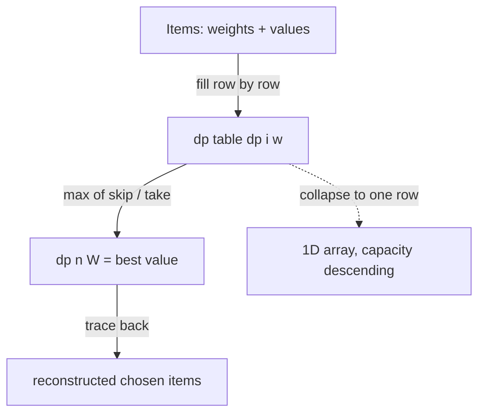

# Knapsack DP (0/1 Knapsack) — Junior Level

> **One-line summary:** You have a bag that holds at most `W` units of weight and a list of items, each with a weight and a value. The **0/1 knapsack** problem asks for the maximum total value of a subset of items whose total weight fits in the bag — where each item is either taken whole or left behind. The standard solution is a dynamic-programming table filled in `O(n·W)` time using the recurrence "for each item, take it or skip it, keep the better."

---

## Table of Contents

1. [Introduction](#introduction)
2. [Prerequisites](#prerequisites)
3. [Glossary](#glossary)
4. [Core Concepts](#core-concepts)
5. [Big-O Summary](#big-o-summary)
6. [Real-World Analogies](#real-world-analogies)
7. [Pros & Cons](#pros--cons)
8. [Step-by-Step Walkthrough](#step-by-step-walkthrough)
9. [Code Examples](#code-examples)
10. [Coding Patterns](#coding-patterns)
11. [Error Handling](#error-handling)
12. [Performance Tips](#performance-tips)
13. [Best Practices](#best-practices)
14. [Edge Cases & Pitfalls](#edge-cases--pitfalls)
15. [Common Mistakes](#common-mistakes)
16. [Cheat Sheet](#cheat-sheet)
17. [Visual Animation](#visual-animation)
18. [Summary](#summary)
19. [Further Reading](#further-reading)

---

## Introduction

Imagine you are packing for a trip with a backpack that can carry at most `W = 10` kilograms. In front of you sit several items, each with a **weight** and a **value** (how much you want it). A camera weighs 4 kg and is worth 30; a tent weighs 6 kg and is worth 40; a book weighs 3 kg and is worth 10. You cannot carry everything, so you must choose a subset that fits within 10 kg and maximizes the total value. This is the **0/1 knapsack** problem — "0/1" because each item is either fully in the bag (1) or fully out (0); you cannot take half a tent.

The brute-force answer is to try every possible subset of items. With `n` items there are `2^n` subsets, so for 60 items you would examine more than a quintillion combinations — hopeless. There is a far smarter approach. Notice that the problem has two properties that make **dynamic programming** (DP) apply:

- **Optimal substructure:** the best way to pack the first `i` items in capacity `w` is built from the best way to pack the first `i-1` items.
- **Overlapping subproblems:** the same "best value using the first `i` items within capacity `w`" question comes up again and again, so we compute it once and store it.

The classic solution builds a table `dp[i][w]` = the maximum value achievable using the first `i` items with a weight budget of `w`. We fill it row by row using one simple decision per cell:

> **For each item, either skip it (keep the value from the row above) or take it (add its value to the best solution for the remaining capacity). Pick whichever is larger.**

That single rule, applied across an `(n+1) × (W+1)` table, solves the whole problem in `O(n·W)` time. The answer sits in the bottom-right corner, `dp[n][W]`.

Knapsack is one of the most important DP problems you will ever learn because so many real problems are knapsack in disguise: budget allocation, subset-sum, the partition problem, cutting stock, and resource scheduling. It is also the gateway to understanding *pseudo-polynomial* time and *NP-hardness*, two ideas we will preview here and develop fully in [`professional.md`](./professional.md). And it has several flavors — **unbounded** (unlimited copies of each item), **bounded** (a fixed count per item), and **fractional** (you may take a fraction of an item, solved by a *greedy* algorithm instead of DP) — all covered in [`middle.md`](./middle.md).

The DP machinery itself — the idea of tabulating subproblems — comes from the parent topic `13-dynamic-programming`. Here we focus on the knapsack family specifically.

---

## Prerequisites

Before reading this file you should be comfortable with:

- **2D arrays / nested loops** — the table `dp[i][w]` is a grid you fill with two nested loops.
- **Basic dynamic programming** — the idea of solving a problem by storing answers to smaller subproblems. See parent topic `13-dynamic-programming`.
- **Recursion** — the recurrence is naturally recursive ("take or skip"); the table is the memoized/bottom-up version.
- **Big-O notation** — `O(n·W)`, `O(n)`, `O(2^n)`.
- **The `max` function** — every cell is a maximum of two candidates.

Optional but helpful:

- A glance at **subset-sum** (can a subset hit an exact target?) since it is knapsack with value = weight.
- Familiarity with **greedy algorithms** (see `14-greedy-algorithms`), because the *fractional* variant is solved greedily and contrasting it with DP is instructive.

---

## Glossary

| Term | Meaning |
|------|---------|
| **Item** | A thing you may pack, described by a **weight** `w[i]` and a **value** `v[i]`. |
| **Capacity `W`** | The maximum total weight the knapsack can hold. |
| **0/1 knapsack** | Each item is taken whole (1) or not at all (0). No splitting, no duplicates. |
| **Unbounded knapsack** | You may take each item any number of times (unlimited copies). |
| **Bounded knapsack** | Each item has a fixed available count `c[i]`; you may take `0..c[i]` copies. |
| **Fractional knapsack** | You may take a *fraction* of an item; solved by a **greedy** algorithm, not DP. |
| **`dp[i][w]`** | Maximum value using the first `i` items with a weight budget of exactly `w` or less. |
| **Recurrence** | The formula `dp[i][w] = max(dp[i-1][w], v[i] + dp[i-1][w - w[i]])`. |
| **Reconstruction** | Recovering *which* items were chosen by tracing back through the filled table. |
| **Pseudo-polynomial** | Running time polynomial in the numeric value `W`, not in the number of bits of `W`. |
| **Subset-sum** | Special knapsack: is there a subset whose weights sum to exactly `S`? (value = weight). |
| **Partition** | Can the items be split into two groups of equal sum? A subset-sum variant. |

---

## Core Concepts

### 1. The Decision: Take or Skip

The heart of knapsack is a single yes/no decision repeated for every item. Consider item `i` (with weight `w[i]` and value `v[i]`) and a current capacity `w`. You have exactly two choices:

- **Skip item `i`.** Your value is whatever you could achieve with the previous items and the same capacity: `dp[i-1][w]`.
- **Take item `i`** (only possible if `w[i] ≤ w`). You gain `v[i]`, but you use up `w[i]` of your capacity, leaving `w - w[i]` for the previous items: `v[i] + dp[i-1][w - w[i]]`.

The best you can do is the larger of the two:

```
dp[i][w] = max( dp[i-1][w] ,  v[i] + dp[i-1][w - w[i]] )   if w[i] ≤ w
dp[i][w] = dp[i-1][w]                                       if w[i] >  w
```

That is the entire algorithm. Everything else is bookkeeping.

### 2. The DP Table

We build a table with `n+1` rows (item 0 means "no items yet") and `W+1` columns (capacities `0` through `W`):

```
dp[i][w] = best value using the first i items, capacity budget w
```

- **Base row** `dp[0][w] = 0` for all `w`: with zero items you can achieve zero value.
- **Base column** `dp[i][0] = 0` for all `i`: with zero capacity you can pack nothing.
- **Answer**: `dp[n][W]`, the bottom-right cell.

Because `dp[i][·]` depends only on `dp[i-1][·]`, you can fill the table row by row, left to right.

### 3. Why It Is Correct

The recurrence captures *every* possibility. Any optimal packing of the first `i` items either includes item `i` or it does not. If it does not, the optimal packing of the first `i` items equals the optimal packing of the first `i-1` items (the `skip` branch). If it does, then removing item `i` leaves an optimal packing of the first `i-1` items in capacity `w - w[i]` (the `take` branch). Taking the max over both branches considers all cases, so `dp[i][w]` is correct by induction on `i`. The full proof lives in [`professional.md`](./professional.md).

### 4. Reconstructing the Chosen Items

The table gives you the best *value*, but often you also want to know *which items* were packed. Walk backward from `dp[n][W]`:

```
w = W
for i = n down to 1:
    if dp[i][w] != dp[i-1][w]:   # value changed → item i was taken
        mark item i as chosen
        w = w - weight[i]
```

If `dp[i][w]` equals `dp[i-1][w]`, item `i` was skipped (the value did not improve by considering it). Otherwise it was taken, so we subtract its weight and continue.

### 5. Space Optimization (Preview)

Notice the recurrence only ever looks at the *previous* row. You do not need the whole 2D table — a single 1D array of size `W+1` suffices if you iterate the capacity **from high to low**. This shrinks memory from `O(n·W)` to `O(W)`. The reverse iteration is subtle and is explained fully in [`middle.md`](./middle.md); for now, just know that it exists and why: each item may be used at most once, so we must avoid overwriting a value we still need.

### 6. Variants at a Glance

- **0/1** (this file): each item once. Iterate capacity descending in the 1D version.
- **Unbounded**: each item unlimited times. Iterate capacity *ascending* — that reuse is exactly what we want.
- **Bounded**: each item up to `c[i]` times. Solved by *binary splitting* of the count (see `middle.md`).
- **Fractional**: take fractions. Solved by a *greedy* algorithm (sort by value/weight ratio), **not** DP.

---

## Big-O Summary

| Operation | Time | Space | Notes |
|-----------|------|-------|-------|
| Brute force (all subsets) | **O(2ⁿ)** | O(n) | Only for tiny `n`. |
| 0/1 knapsack, 2D table | **O(n·W)** | O(n·W) | The classic table fill. |
| 0/1 knapsack, 1D array | **O(n·W)** | **O(W)** | Same time, far less memory. |
| Reconstruction from 2D table | O(n) | — | Trace back one row per item. |
| Unbounded knapsack | O(n·W) | O(W) | Iterate capacity ascending. |
| Fractional knapsack (greedy) | **O(n log n)** | O(n) | Sort by ratio; *not* DP. |
| Subset-sum / partition | O(n·S) | O(S) | Boolean DP variant. |

The headline number is **`O(n·W)`** — polynomial in the *number* of items and in the *capacity value*. That last part is the catch: `W` is a number, and a number with `b` bits can be as large as `2^b`. So `O(n·W)` is **pseudo-polynomial**, not truly polynomial. We preview that subtlety below and prove it in [`professional.md`](./professional.md).

---

## Real-World Analogies

| Concept | Analogy |
|---------|---------|
| 0/1 knapsack | Packing a single backpack for a flight with a strict weight limit, choosing whole items. |
| Capacity `W` | The airline's checked-bag weight allowance. |
| Value vs weight | A camera (light, high value) beats a brick (heavy, low value); the DP finds the best mix. |
| Take-or-skip decision | At each item you stand at the shelf and decide "in the bag or back on the shelf?" |
| Reconstruction | Reading the packing list off the final decision, item by item. |
| Unbounded knapsack | Making change with coins — you may use any coin as many times as you like. |
| Fractional knapsack | Filling a tanker with liquids/gold dust — you can pour in a partial amount. |
| Pseudo-polynomial cost | The table has one column per kilogram; a budget in milligrams blows the table up enormously even though the *bag* is the same size. |

Where the analogy breaks: a real backpack also has volume, shape, and fragility constraints; the classic problem tracks only a single scalar weight. Multi-constraint variants exist but multiply the table dimensions (see `senior.md`).

---

## Pros & Cons

| Pros | Cons |
|------|------|
| Simple, exact, and provably optimal in `O(n·W)`. | `O(n·W)` blows up when `W` is huge (pseudo-polynomial). |
| One small recurrence solves a whole family (0/1, unbounded, bounded, subset-sum). | Useless for large `W` *and* large values at once — must switch techniques. |
| 1D space optimization makes memory cheap (`O(W)`). | The 1D reverse-iteration is a subtle, error-prone detail. |
| Easy to reconstruct the chosen items. | Reconstruction needs the full 2D table (or extra bookkeeping). |
| Integer-only arithmetic; no floating-point error. | Real-valued weights break the table indexing entirely. |

**When to use:** integer weights, capacity `W` small enough that `n·W` fits in time and memory (say up to a few million cells), each item taken a whole number of times, exact optimal value required.

**When NOT to use:** capacity `W` astronomically large (use meet-in-the-middle or value-indexed DP, see `senior.md`), fractional items allowed (use greedy), or you only need an approximate answer for huge inputs (use an FPTAS).

---

## Step-by-Step Walkthrough

Take 3 items and capacity `W = 5`:

```
item:     1    2    3
weight:   2    3    4
value:    3    4    5
```

We fill `dp[i][w]` for `i = 0..3` and `w = 0..5`. Row 0 (no items) is all zeros.

**Row 1 (item 1: weight 2, value 3).** For `w < 2` we cannot take it, so `dp[1][w] = dp[0][w] = 0`. For `w ≥ 2`, `dp[1][w] = max(0, 3 + dp[0][w-2]) = 3`.

```
w:        0   1   2   3   4   5
dp[1]:    0   0   3   3   3   3
```

**Row 2 (item 2: weight 3, value 4).** Skip = `dp[1][w]`; take (if `w ≥ 3`) = `4 + dp[1][w-3]`.

```
w=0: 0
w=1: 0
w=2: 3                                 (cannot take item 2)
w=3: max(dp1[3]=3, 4+dp1[0]=4) = 4
w=4: max(dp1[4]=3, 4+dp1[1]=4) = 4
w=5: max(dp1[5]=3, 4+dp1[2]=4+3=7) = 7   ← items 1 and 2
dp[2]:    0   0   3   4   4   7
```

**Row 3 (item 3: weight 4, value 5).** Skip = `dp[2][w]`; take (if `w ≥ 4`) = `5 + dp[2][w-4]`.

```
w=0: 0
w=1: 0
w=2: 3
w=3: 4
w=4: max(dp2[4]=4, 5+dp2[0]=5) = 5
w=5: max(dp2[5]=7, 5+dp2[1]=5) = 7
dp[3]:    0   0   3   4   5   7
```

**Answer:** `dp[3][5] = 7`.

**Reconstruct.** Start at `dp[3][5] = 7`. Is `dp[3][5] == dp[2][5]`? Both are 7 → item 3 **skipped**. Move to `dp[2][5] = 7`. Is `dp[2][5] == dp[1][5]`? 7 vs 3 → differ → item 2 **taken**. Subtract weight 3: now `w = 2`. Move to `dp[1][2] = 3`. Is `dp[1][2] == dp[0][2]`? 3 vs 0 → differ → item 1 **taken**. Subtract weight 2: now `w = 0`. Done.

**Chosen items: 1 and 2** (weights 2+3 = 5, exactly fitting; values 3+4 = 7). The hand trace and the table agree.

---

## Code Examples

### Example: 0/1 Knapsack (2D Table) with Reconstruction

This builds the full table, returns the best value, and lists the chosen items.

#### Go

```go
package main

import "fmt"

// knapsack01 returns the best value and the list of chosen item indices (0-based).
func knapsack01(weight, value []int, W int) (int, []int) {
	n := len(weight)
	dp := make([][]int, n+1)
	for i := range dp {
		dp[i] = make([]int, W+1)
	}
	for i := 1; i <= n; i++ {
		wi, vi := weight[i-1], value[i-1]
		for w := 0; w <= W; w++ {
			dp[i][w] = dp[i-1][w] // skip
			if wi <= w {
				if take := vi + dp[i-1][w-wi]; take > dp[i][w] {
					dp[i][w] = take // take
				}
			}
		}
	}
	// reconstruct
	chosen := []int{}
	w := W
	for i := n; i >= 1; i-- {
		if dp[i][w] != dp[i-1][w] {
			chosen = append(chosen, i-1)
			w -= weight[i-1]
		}
	}
	return dp[n][W], chosen
}

func main() {
	weight := []int{2, 3, 4}
	value := []int{3, 4, 5}
	best, items := knapsack01(weight, value, 5)
	fmt.Println("best value:", best)  // 7
	fmt.Println("chosen items:", items) // [1 0]  (items 2 and 1)
}
```

#### Java

```java
import java.util.*;

public class Knapsack01 {
    static int[] dpResult; // best value stored at index 0 for convenience

    // returns best value; fills 'chosen' with selected 0-based item indices
    static int knapsack01(int[] weight, int[] value, int W, List<Integer> chosen) {
        int n = weight.length;
        int[][] dp = new int[n + 1][W + 1];
        for (int i = 1; i <= n; i++) {
            int wi = weight[i - 1], vi = value[i - 1];
            for (int w = 0; w <= W; w++) {
                dp[i][w] = dp[i - 1][w]; // skip
                if (wi <= w) {
                    int take = vi + dp[i - 1][w - wi];
                    if (take > dp[i][w]) dp[i][w] = take; // take
                }
            }
        }
        int w = W;
        for (int i = n; i >= 1; i--) {
            if (dp[i][w] != dp[i - 1][w]) {
                chosen.add(i - 1);
                w -= weight[i - 1];
            }
        }
        return dp[n][W];
    }

    public static void main(String[] args) {
        int[] weight = {2, 3, 4};
        int[] value = {3, 4, 5};
        List<Integer> chosen = new ArrayList<>();
        int best = knapsack01(weight, value, 5, chosen);
        System.out.println("best value: " + best);   // 7
        System.out.println("chosen items: " + chosen); // [1, 0]
    }
}
```

#### Python

```python
def knapsack01(weight, value, W):
    """Return (best_value, list_of_chosen_indices) for the 0/1 knapsack."""
    n = len(weight)
    dp = [[0] * (W + 1) for _ in range(n + 1)]
    for i in range(1, n + 1):
        wi, vi = weight[i - 1], value[i - 1]
        for w in range(W + 1):
            dp[i][w] = dp[i - 1][w]          # skip
            if wi <= w:
                take = vi + dp[i - 1][w - wi]
                if take > dp[i][w]:
                    dp[i][w] = take          # take
    # reconstruct
    chosen = []
    w = W
    for i in range(n, 0, -1):
        if dp[i][w] != dp[i - 1][w]:
            chosen.append(i - 1)
            w -= weight[i - 1]
    return dp[n][W], chosen


if __name__ == "__main__":
    weight = [2, 3, 4]
    value = [3, 4, 5]
    best, items = knapsack01(weight, value, 5)
    print("best value:", best)    # 7
    print("chosen items:", items) # [1, 0]
```

**What it does:** builds the 3-item example above, computes `dp[3][5] = 7`, and reconstructs items 2 and 1.
**Run:** `go run main.go` | `javac Knapsack01.java && java Knapsack01` | `python knapsack.py`

---

## Coding Patterns

### Pattern 1: Brute-Force Subset Enumeration (the oracle you test against)

**Intent:** Before trusting the DP, compute the answer the slow, obvious way and check they agree on small inputs.

```python
def knapsack_bruteforce(weight, value, W):
    n = len(weight)
    best = 0
    for mask in range(1 << n):          # every subset
        tw = tv = 0
        for i in range(n):
            if mask & (1 << i):
                tw += weight[i]
                tv += value[i]
        if tw <= W and tv > best:
            best = tv
    return best
```

This is `O(2^n · n)`. It is too slow for large `n` but perfect as a correctness oracle. The DP must give the same answer.

### Pattern 2: 1D Rolling Array (0/1, capacity descending)

**Intent:** Same answer, `O(W)` memory. Iterate `w` from `W` down to `w[i]` so each item is used at most once.

```python
def knapsack01_1d(weight, value, W):
    dp = [0] * (W + 1)
    for i in range(len(weight)):
        wi, vi = weight[i], value[i]
        for w in range(W, wi - 1, -1):   # DESCENDING
            dp[w] = max(dp[w], vi + dp[w - wi])
    return dp[W]
```

### Pattern 3: Subset-Sum as Knapsack

**Intent:** "Can a subset sum to exactly `S`?" is knapsack with `value = weight` and capacity `S`, using a Boolean table.

```python
def subset_sum(nums, S):
    dp = [False] * (S + 1)
    dp[0] = True                          # empty subset sums to 0
    for x in nums:
        for s in range(S, x - 1, -1):     # descending (0/1 style)
            if dp[s - x]:
                dp[s] = True
    return dp[S]
```



---

## Error Handling

| Error | Cause | Fix |
|-------|-------|-----|
| Wrong answer, too large | 1D array iterated *ascending* for 0/1 (item reused). | Iterate capacity **descending** for 0/1. |
| Index out of range | Accessed `dp[w - w[i]]` when `w < w[i]`. | Guard with `if w[i] <= w` (or loop down to `w[i]`). |
| Off-by-one in table size | Used `W` columns instead of `W+1`. | Table is `(n+1) × (W+1)`; capacity `0..W` inclusive. |
| Reconstruction picks wrong items | Compared values instead of `dp[i][w] != dp[i-1][w]`. | Use the row-difference test, subtract weight when taken. |
| Negative capacity crash | Negative `W` or negative weights. | Validate inputs; weights and `W` must be non-negative. |
| Overflow on value sums | Many large values summed in a fixed-width int. | Use 64-bit (`long`/`int64`) for the value accumulation. |

---

## Performance Tips

- **Use the 1D array** when you do not need reconstruction — it cuts memory from `O(n·W)` to `O(W)` and is more cache-friendly.
- **Skip impossible items early** — if `w[i] > W`, the item can never be packed; drop it before building the table.
- **Loop the inner range tightly** — for the 1D 0/1 version, loop `w` from `W` down to `w[i]` (not down to 0) to avoid useless iterations.
- **Prefer the smaller dimension** — if `n` is tiny but `W` is huge, brute force or meet-in-the-middle may beat the table (see `senior.md`).
- **Avoid recomputing `max`** — write the skip value first, then conditionally overwrite with the take value; one comparison per cell.

---

## Best Practices

- Always test the DP against the brute-force subset oracle (Pattern 1) on random small inputs before trusting it.
- Decide up front whether you need just the *value* (1D array) or the *chosen items* (2D table or extra bookkeeping).
- State capacity and weights as integers; if the problem has real-valued weights, scale to integers or rethink the approach.
- Name the recurrence's two branches `skip` and `take` in code comments — it makes the logic self-documenting.
- For the 1D version, write a comment "DESCENDING for 0/1" right above the inner loop; this is the single most copied-wrong detail.

---

## Edge Cases & Pitfalls

- **`W = 0`** — capacity zero; answer is 0 (pack nothing). The base column handles it.
- **No items** — answer is 0. The base row handles it.
- **An item heavier than `W`** — it can never be taken; the `if w[i] <= w` guard skips it.
- **Zero-weight items** — a zero-weight, positive-value item should always be taken; in the unbounded case it would loop forever, so guard against zero weights there.
- **All items fit** — answer is the sum of all values; the DP still works but a quick check can short-circuit.
- **Duplicate items** — perfectly fine in 0/1; each listed item is a separate take/skip decision.
- **Huge `W`** — the table has `W+1` columns; `W = 10^9` is infeasible. Switch to meet-in-the-middle or value-indexed DP (`senior.md`).

---

## Common Mistakes

1. **Iterating the 1D array ascending for 0/1** — this lets an item be picked multiple times, silently turning 0/1 into unbounded. Always go **descending** for 0/1.
2. **Forgetting the `+1` in table dimensions** — capacities run `0..W`, so you need `W+1` columns and `n+1` rows.
3. **Taking an item that does not fit** — accessing `dp[w - w[i]]` with `w < w[i]` is an out-of-bounds read; guard it.
4. **Reconstructing by comparing values** — the correct test is whether the value *changed* between rows (`dp[i][w] != dp[i-1][w]`), then subtract the weight.
5. **Confusing 0/1 with fractional** — knapsack DP solves the whole-item version; the fractional version is a *greedy* sort by value/weight ratio (see `middle.md`).
6. **Assuming `O(n·W)` is polynomial** — it is *pseudo*-polynomial; a large `W` makes it exponential in the input size (`professional.md`).
7. **Using floating-point weights** — the table is indexed by integer capacity; real weights break it. Scale to integers first.

---

## Cheat Sheet

| Question | Tool | Formula / note |
|----------|------|----------------|
| Best value, 0/1 | 2D or 1D DP | `dp[n][W]` |
| Recurrence | take-or-skip | `max(dp[i-1][w], v[i] + dp[i-1][w-w[i]])` |
| Save memory | 1D array | iterate `w` from `W` down to `w[i]` |
| Which items? | reconstruction | trace back: `dp[i][w] != dp[i-1][w]` → taken |
| Unlimited copies | unbounded | iterate `w` **ascending** (`middle.md`) |
| Exact-sum reachable? | subset-sum | Boolean DP, `value = weight` |
| Equal split? | partition | subset-sum to `total/2` |
| Fractional allowed | greedy | sort by `v/w`, take highest ratios |

Core algorithm (2D):

```
dp[0][*] = 0
for i in 1..n:
    for w in 0..W:
        dp[i][w] = dp[i-1][w]                        # skip
        if w[i] <= w:
            dp[i][w] = max(dp[i][w],
                           v[i] + dp[i-1][w - w[i]])  # take
answer = dp[n][W]                                     # O(n*W)
```

---

## Visual Animation

> See [`animation.html`](./animation.html) for an interactive visualization.
>
> The animation demonstrates:
> - The `dp[i][w]` table filling cell-by-cell, row by row
> - For each cell, the **skip** candidate (the cell directly above) and the **take** candidate (value + the cell up-and-left by the item's weight)
> - Highlighting which of the two won and why
> - The **reconstruction path** traced back from `dp[n][W]` to recover the chosen items
> - Step / Run / Reset controls to watch each decision unfold

---

## Summary

The 0/1 knapsack problem — pick a subset of weighted, valued items to maximize value within a capacity `W` — is solved exactly by a dynamic-programming table `dp[i][w]` filled with one rule per cell: **take the item or skip it, keep the better.** That recurrence, `dp[i][w] = max(dp[i-1][w], v[i] + dp[i-1][w-w[i]])`, runs in `O(n·W)` time and the answer is `dp[n][W]`. You can reconstruct which items were chosen by tracing back through the table, and you can shrink memory to `O(W)` with a 1D array iterated **descending** (the single most error-prone detail). The same recurrence, lightly modified, solves unbounded, bounded, subset-sum, and partition variants — while the fractional variant is a *greedy* problem, not DP. Keep in mind that `O(n·W)` is *pseudo*-polynomial: it explodes when `W` is huge, which is why knapsack is the textbook gateway to NP-hardness and the advanced techniques in `senior.md` and `professional.md`.

---

## Further Reading

- *Introduction to Algorithms* (CLRS) — dynamic programming chapter, 0/1 knapsack and rod cutting.
- Parent topic `13-dynamic-programming` — the general DP framework (optimal substructure, overlapping subproblems).
- Sibling topic `14-greedy-algorithms` — the fractional knapsack greedy and why it works.
- *Algorithm Design* (Kleinberg & Tardos) — knapsack, subset-sum, and the FPTAS approximation.
- cp-algorithms.com — "Knapsack problem" and "0-1 Knapsack".
- *Knapsack Problems* (Kellerer, Pferschy, Pisinger) — the definitive monograph on every variant.
