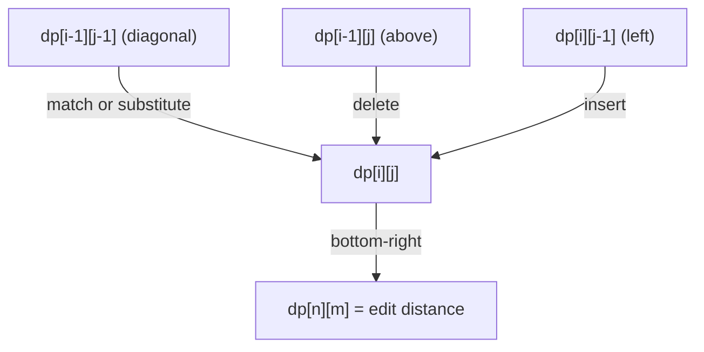

# Edit Distance (Levenshtein) and String Alignment — Junior Level

> **One-line summary:** The **edit distance** between two strings is the minimum number of single-character **insert**, **delete**, or **substitute** operations needed to turn one string into the other. You compute it with an `O(nm)` dynamic-programming table whose cell `dp[i][j]` is the edit distance between the first `i` characters of string `A` and the first `j` characters of string `B`.

---

## Table of Contents

1. [Introduction](#introduction)
2. [Prerequisites](#prerequisites)
3. [Glossary](#glossary)
4. [Core Concepts](#core-concepts)
5. [Big-O Summary](#big-o-summary)
6. [Real-World Analogies](#real-world-analogies)
7. [Pros & Cons](#pros--cons)
8. [Step-by-Step Walkthrough](#step-by-step-walkthrough)
9. [Code Examples](#code-examples)
10. [Coding Patterns](#coding-patterns)
11. [Error Handling](#error-handling)
12. [Performance Tips](#performance-tips)
13. [Best Practices](#best-practices)
14. [Edge Cases & Pitfalls](#edge-cases--pitfalls)
15. [Common Mistakes](#common-mistakes)
16. [Cheat Sheet](#cheat-sheet)
17. [Visual Animation](#visual-animation)
18. [Summary](#summary)
19. [Further Reading](#further-reading)

---

## Introduction

Imagine you type `kitten` into a search box but you meant `sitting`. How "far apart" are those two words? One natural way to measure the gap is to count the smallest number of single-character edits that transform one word into the other:

```
kitten → sitten   (substitute 'k' with 's')
sitten → sittin   (substitute 'e' with 'i')
sittin → sitting  (insert 'g' at the end)
```

That is three edits, and you cannot do it in fewer. So the **edit distance** between `kitten` and `sitting` is `3`. This particular flavor — where the allowed operations are **insert one character**, **delete one character**, and **substitute one character for another**, each costing `1` — is called the **Levenshtein distance**, after Vladimir Levenshtein who introduced it in 1965.

Edit distance is one of the most useful algorithms you will ever learn because it quietly powers things you use every day:

- **Spell checkers** suggest `sitting` when you type `sitten` because the edit distance is tiny.
- **`git diff`** and code-review tools show line-by-line changes by aligning the old and new files.
- **Search engines** offer "did you mean …?" by finding dictionary words within a small edit distance of your query.
- **DNA analysis** aligns genetic sequences to find how closely two organisms are related (the bioinformatics cousins are called **Needleman-Wunsch** and **Smith-Waterman**).
- **Fuzzy matching** in databases links `Jon Smith` to `John Smith` despite the typo.

The brute-force way to compute edit distance — try every possible sequence of edits — explodes exponentially and is hopeless even for short strings. The breakthrough is **dynamic programming (DP)**: we build a small grid (a table) where each cell answers a tiny sub-question, and bigger answers are assembled from smaller ones. The whole computation costs `O(n·m)` time for strings of length `n` and `m` — fast enough for words, sentences, and even modest documents.

This file teaches you the core `O(nm)` DP: the recurrence, the base cases, how to read off the answer, and how to walk back through the table to recover *which* edits were made (the **edit script**). Later files cover memory savings, weighted operations, transpositions (Damerau-Levenshtein), and the bioinformatics connection.

---

## Prerequisites

Before reading this file you should be comfortable with:

- **Strings and indexing** — characters `A[0], A[1], …`, lengths, substrings/prefixes.
- **2D arrays / grids** — declaring an `(n+1) × (m+1)` table and indexing `dp[i][j]`.
- **`min` of a few numbers** — every cell takes the minimum over a small set of options.
- **Basic recursion vs iteration** — we will see both the recursive idea and its iterative table form.
- **Big-O notation** — `O(nm)` time, `O(nm)` or `O(min(n,m))` space.

Optional but helpful:

- A first look at **dynamic programming** in general (optimal substructure + overlapping subproblems). Edit distance is a textbook example of both.
- Familiarity with the idea of a **prefix** — `A[0..i)` means the first `i` characters of `A`.

---

## Glossary

| Term | Meaning |
|------|---------|
| **Edit distance** | Minimum number of edit operations to transform string `A` into string `B`. |
| **Levenshtein distance** | Edit distance where insert, delete, and substitute each cost `1`. The default flavor. |
| **Insert** | Add one character. Turns `cat` into `cart` (insert `r`). |
| **Delete** | Remove one character. Turns `cart` into `cat` (delete `r`). |
| **Substitute** | Replace one character with another. Turns `cat` into `cot` (substitute `a→o`). |
| **Match** | The two current characters are equal, so no operation (cost `0`) is needed. |
| **Prefix `A[0..i)`** | The first `i` characters of `A` (an empty prefix when `i = 0`). |
| **DP table** | An `(n+1) × (m+1)` grid where `dp[i][j]` = edit distance of `A[0..i)` and `B[0..j)`. |
| **Base case** | The boundary rows/columns: comparing against an empty string. |
| **Recurrence** | The rule that computes `dp[i][j]` from already-computed neighbors. |
| **Traceback / edit script** | Walking backward through the table to recover the actual sequence of operations. |
| **Alignment** | A way of lining up the two strings, with gaps, that corresponds to an edit sequence. |

---

## Core Concepts

### 1. What the table cell means

Let `A` have length `n` and `B` have length `m`. We build a table `dp` of size `(n+1) × (m+1)`. The cell

```
dp[i][j] = edit distance between A[0..i) and B[0..j)
```

That is, the cost of transforming the **first `i` characters of `A`** into the **first `j` characters of `B`**. The extra `+1` in each dimension is so we can talk about *empty* prefixes (`i = 0` or `j = 0`). The final answer we want lives in the bottom-right corner: `dp[n][m]`.

### 2. The base cases (the boundary)

What if one string is empty?

- To turn an empty string into `B[0..j)`, you must **insert** all `j` characters. So `dp[0][j] = j`.
- To turn `A[0..i)` into an empty string, you must **delete** all `i` characters. So `dp[i][0] = i`.
- The corner `dp[0][0] = 0` (empty into empty needs no edits).

These boundary values fill the top row (`0, 1, 2, …, m`) and left column (`0, 1, 2, …, n`).

### 3. The recurrence (the heart of the algorithm)

Consider cell `dp[i][j]` with `i, j ≥ 1`. Look at the last characters: `A[i-1]` and `B[j-1]`. There are exactly four ways the optimal transformation could end:

1. **Match (free):** if `A[i-1] == B[j-1]`, the last characters already agree, so we pay nothing extra and the cost is whatever it took to align the shorter prefixes: `dp[i-1][j-1]`.
2. **Substitute (cost 1):** replace `A[i-1]` with `B[j-1]`, then align the rest: `dp[i-1][j-1] + 1`.
3. **Delete (cost 1):** drop `A[i-1]`, then align `A[0..i-1)` with `B[0..j)`: `dp[i-1][j] + 1`.
4. **Insert (cost 1):** insert `B[j-1]`, then align `A[0..i)` with `B[0..j-1)`: `dp[i][j-1] + 1`.

We take the cheapest:

```
if A[i-1] == B[j-1]:
    dp[i][j] = dp[i-1][j-1]                       # match, free
else:
    dp[i][j] = 1 + min(
        dp[i-1][j-1],   # substitute
        dp[i-1][j],     # delete from A
        dp[i][j-1]      # insert into A
    )
```

Each cell depends only on three already-computed neighbors: the one **diagonally up-left**, the one **directly above**, and the one **directly to the left**. That is why we can fill the table row by row, left to right.

### 4. Why this is correct (intuition)

The transformation of `A[0..i)` into `B[0..j)` must do *something* with the last characters. Whatever the optimal solution does, its final step is one of the four cases above, and the rest of it is an optimal transformation of *shorter* prefixes — which we have already computed. This "the best solution is built from best solutions to subproblems" property is called **optimal substructure**, and it is exactly what makes DP work. The full correctness proof lives in [`professional.md`](./professional.md).

### 5. Reading off the answer and the edits

After filling the table, `dp[n][m]` is the edit distance. But often we want the *actual edits* — the **edit script**. We recover it by **traceback**: start at `dp[n][m]` and repeatedly step to whichever neighbor we came from, recording the operation, until we reach `dp[0][0]`. A diagonal step with equal characters is a **match**; a diagonal step with a cost is a **substitute**; an up step is a **delete**; a left step is an **insert**. (Details in the walkthrough and in [`middle.md`](./middle.md).)

---

## Big-O Summary

| Operation | Time | Space | Notes |
|-----------|------|-------|-------|
| Fill the full DP table | **O(n·m)** | O(n·m) | Every cell is `O(1)` work. |
| Read the final distance | O(1) | — | It is `dp[n][m]`. |
| Traceback the edit script | O(n + m) | — | At most `n + m` steps from corner to corner. |
| Distance only, two-row trick | O(n·m) | **O(min(n, m))** | Keep only the previous row. See `middle.md`. |
| Banded / Ukkonen when distance ≤ d | **O(d·min(n,m))** | O(d) | Only compute a diagonal band. See `middle.md`. |
| Hirschberg full alignment | O(n·m) time | **O(min(n, m))** | Linear space *with* traceback. See `senior.md`. |

The headline number for the basic algorithm is **`O(nm)` time and `O(nm)` space**. For two 1000-character strings that is a million cells — instant. For very long strings the space (a million-plus integers) is the first thing you optimize, which is why the two-row and Hirschberg tricks exist.

---

## Real-World Analogies

| Concept | Analogy |
|---------|---------|
| Edit distance | The number of keystrokes to fix a typo: how many single-character changes to go from what you typed to what you meant. |
| Insert / delete / substitute | Editing a printed sentence by hand: squeeze in a letter, scratch one out, or write over one. |
| The DP table | A spreadsheet where each cell asks "how far apart are these two prefixes?" and copies cheaply from its neighbors. |
| Match (free move) | When the two letters already agree, you simply move your finger forward along both words — no work. |
| Traceback | Retracing your steps through a maze from the exit back to the entrance, writing down each turn you took. |
| Alignment with gaps | Stacking two sentences and lining up the matching words, leaving blanks where one has extra words. |

Where the analogy breaks: real editing has copy/paste and block moves; plain Levenshtein only allows single-character operations. Richer operations (like swapping two adjacent letters, or weighting an edit by how likely a typo it is) are covered in `middle.md`.

---

## Pros & Cons

| Pros | Cons |
|------|------|
| Simple, correct, and well-understood `O(nm)` algorithm. | `O(nm)` time is too slow for very long strings (e.g., whole genomes) without extra tricks. |
| Recovers not just the distance but the exact edit script (a real diff). | `O(nm)` memory blows up for long inputs unless you use the two-row or Hirschberg trick. |
| Generalizes cleanly: weighted costs, transpositions, sequence alignment. | A true *metric* only for the unit-cost (Levenshtein) version; custom costs can break the triangle inequality. |
| The same DP underlies spell-check, `diff`, fuzzy matching, and bioinformatics. | Naive use as a similarity score ignores word order, semantics, and length normalization. |
| Numerically clean — only integer additions and minimums. | Comparing one query against a huge dictionary is `O(dictionary × nm)` unless you add indexing (BK-trees, tries). |

**When to use:** measuring similarity of short-to-medium strings, spell suggestions, fuzzy search, `diff`-style change detection, and as the engine inside sequence alignment.

**When NOT to use:** when strings are enormous and the expected distance is large (consider specialized aligners), when you actually need semantic similarity (use embeddings), or when a cheaper screen (length difference, hashing) can reject obvious non-matches first.

---

## Step-by-Step Walkthrough

Let us compute the edit distance between `A = "horse"` (`n = 5`) and `B = "ros"` (`m = 3`) by hand.

We build a `6 × 4` table. Rows are indexed by prefixes of `horse`, columns by prefixes of `ros`.

**Fill the base row and column first.** Row 0 is `0,1,2,3` (insert each char of `ros`). Column 0 is `0,1,2,3,4,5` (delete each char of `horse`).

```
        ""  r   o   s
   ""    0   1   2   3
   h     1   .   .   .
   o     2   .   .   .
   r     3   .   .   .
   s     4   .   .   .
   e     5   .   .   .
```

**Now fill cell by cell**, row by row, using the recurrence.

`dp[1][1]` compares `h` vs `r` (different): `1 + min(dp[0][0]=0, dp[0][1]=1, dp[1][0]=1) = 1`.
`dp[1][2]` compares `h` vs `o` (different): `1 + min(dp[0][1]=1, dp[0][2]=2, dp[1][1]=1) = 2`.
`dp[1][3]` compares `h` vs `s` (different): `1 + min(2, 3, 2) = 3`.

Row for `o` (`i = 2`):
`dp[2][1]` `o` vs `r` (diff): `1 + min(dp[1][0]=1, dp[1][1]=1, dp[2][0]=2) = 2`.
`dp[2][2]` `o` vs `o` (**match!**): `dp[1][1] = 1`.
`dp[2][3]` `o` vs `s` (diff): `1 + min(dp[1][2]=2, dp[1][3]=3, dp[2][2]=1) = 2`.

Continuing for `r`, `s`, `e` gives the completed table:

```
        ""  r   o   s
   ""    0   1   2   3
   h     1   1   2   3
   o     2   2   1   2
   r     3   2   2   2
   s     4   3   3   2
   e     5   4   4   3
```

**The answer is `dp[5][3] = 3`.** It takes 3 edits to turn `horse` into `ros`.

**Traceback to recover the edits.** Start at `dp[5][3] = 3` and step backward to the neighbor we came from:

```
(5,3)=3  came from (4,3)=2  → delete 'e'              (step up)
(4,3)=2  s vs s match       → keep 's' (free)         (diagonal)
(3,2)=2  r vs o substitute  → substitute 'r'→'o'      (diagonal +1)
(2,1)=2  came from (1,1)=1  → delete 'o'              (step up)
(1,1)=1  h vs r substitute  → substitute 'h'→'r'      (diagonal +1)
(0,0)=0  done
```

Reading the recovered operations in forward order: substitute `h→r`, delete `o`, substitute `r→o`, keep `s`, delete `e`. That is indeed 3 paid edits, transforming `horse → ros`. One valid alignment:

```
h o r s e
r - o s -
```

(The `-` marks a gap: a deletion from `horse`.) There can be more than one optimal edit script; any path of minimum total cost is correct.

---

## Code Examples

### Example: Levenshtein distance with the full DP table

#### Go

```go
package main

import "fmt"

func min3(a, b, c int) int {
	m := a
	if b < m {
		m = b
	}
	if c < m {
		m = c
	}
	return m
}

func editDistance(a, b string) int {
	n, m := len(a), len(b)
	dp := make([][]int, n+1)
	for i := range dp {
		dp[i] = make([]int, m+1)
		dp[i][0] = i // delete all of a[0..i)
	}
	for j := 0; j <= m; j++ {
		dp[0][j] = j // insert all of b[0..j)
	}
	for i := 1; i <= n; i++ {
		for j := 1; j <= m; j++ {
			if a[i-1] == b[j-1] {
				dp[i][j] = dp[i-1][j-1] // match, free
			} else {
				dp[i][j] = 1 + min3(
					dp[i-1][j-1], // substitute
					dp[i-1][j],   // delete
					dp[i][j-1],   // insert
				)
			}
		}
	}
	return dp[n][m]
}

func main() {
	fmt.Println(editDistance("kitten", "sitting")) // 3
	fmt.Println(editDistance("horse", "ros"))      // 3
	fmt.Println(editDistance("", "abc"))           // 3
}
```

#### Java

```java
public class EditDistance {
    static int editDistance(String a, String b) {
        int n = a.length(), m = b.length();
        int[][] dp = new int[n + 1][m + 1];
        for (int i = 0; i <= n; i++) dp[i][0] = i; // delete all
        for (int j = 0; j <= m; j++) dp[0][j] = j; // insert all
        for (int i = 1; i <= n; i++) {
            for (int j = 1; j <= m; j++) {
                if (a.charAt(i - 1) == b.charAt(j - 1)) {
                    dp[i][j] = dp[i - 1][j - 1]; // match, free
                } else {
                    dp[i][j] = 1 + Math.min(
                        dp[i - 1][j - 1],                       // substitute
                        Math.min(dp[i - 1][j], dp[i][j - 1]));  // delete / insert
                }
            }
        }
        return dp[n][m];
    }

    public static void main(String[] args) {
        System.out.println(editDistance("kitten", "sitting")); // 3
        System.out.println(editDistance("horse", "ros"));      // 3
        System.out.println(editDistance("", "abc"));           // 3
    }
}
```

#### Python

```python
def edit_distance(a: str, b: str) -> int:
    n, m = len(a), len(b)
    dp = [[0] * (m + 1) for _ in range(n + 1)]
    for i in range(n + 1):
        dp[i][0] = i           # delete all of a[0..i)
    for j in range(m + 1):
        dp[0][j] = j           # insert all of b[0..j)
    for i in range(1, n + 1):
        for j in range(1, m + 1):
            if a[i - 1] == b[j - 1]:
                dp[i][j] = dp[i - 1][j - 1]            # match, free
            else:
                dp[i][j] = 1 + min(
                    dp[i - 1][j - 1],                  # substitute
                    dp[i - 1][j],                      # delete
                    dp[i][j - 1],                      # insert
                )
    return dp[n][m]


if __name__ == "__main__":
    print(edit_distance("kitten", "sitting"))  # 3
    print(edit_distance("horse", "ros"))       # 3
    print(edit_distance("", "abc"))            # 3
```

**What it does:** builds the full `(n+1) × (m+1)` table with the base row/column, fills it with the recurrence, and returns the bottom-right corner.
**Run:** `go run main.go` | `javac EditDistance.java && java EditDistance` | `python edit.py`

---

## Coding Patterns

### Pattern 1: Recursive definition (the idea behind the table)

**Intent:** Understand the recurrence before optimizing it. This is the same rule, expressed top-down.

```python
def rec(a, b, i, j):
    if i == 0:
        return j           # insert remaining of b
    if j == 0:
        return i           # delete remaining of a
    if a[i - 1] == b[j - 1]:
        return rec(a, b, i - 1, j - 1)
    return 1 + min(
        rec(a, b, i - 1, j - 1),   # substitute
        rec(a, b, i - 1, j),       # delete
        rec(a, b, i, j - 1),       # insert
    )
```

This is exponential without memoization because it recomputes the same `(i, j)` many times — the classic **overlapping subproblems** sign that DP applies. Add a cache (`@lru_cache`) and it becomes `O(nm)`.

### Pattern 2: Memoized recursion (top-down DP)

**Intent:** Keep the readable recursive form but compute each `(i, j)` only once.

```python
from functools import lru_cache

def edit_distance_memo(a, b):
    @lru_cache(maxsize=None)
    def rec(i, j):
        if i == 0:
            return j
        if j == 0:
            return i
        if a[i - 1] == b[j - 1]:
            return rec(i - 1, j - 1)
        return 1 + min(rec(i - 1, j - 1), rec(i - 1, j), rec(i, j - 1))
    return rec(len(a), len(b))
```

### Pattern 3: Bottom-up table (iterative DP)

**Intent:** The production form. Fill the table in order so every neighbor is ready when you need it (shown in the Code Examples above). This avoids recursion-depth limits and is cache-friendly.



---

## Error Handling

| Error | Cause | Fix |
|-------|-------|-----|
| `IndexError` / out of bounds | Indexing `A[i]` instead of `A[i-1]` for cell `dp[i][j]`. | The string index is always one less than the table index. |
| Wrong base values | Filled the boundary with zeros instead of `i` and `j`. | `dp[i][0] = i`, `dp[0][j] = j`, `dp[0][0] = 0`. |
| Off-by-one in table size | Allocated `n × m` instead of `(n+1) × (m+1)`. | Always add `+1` to each dimension for the empty prefix. |
| Treating unequal chars as a match | Forgot the `else` branch; never paid for a substitution. | Only the diagonal is free *when characters are equal*. |
| Comparing bytes vs runes | In Go, `len(s)` counts bytes, not Unicode code points. | Convert to `[]rune` for multi-byte characters. |
| Crash on empty strings | Special-cased the loop and skipped the base case. | The base cases already handle empty inputs; do not special-case. |

---

## Performance Tips

- **Iterate row by row, inner loop over columns.** This reads the previous row contiguously and is cache-friendly.
- **Use the two-row trick if you only need the distance.** Keep just the previous and current rows: `O(min(n,m))` space instead of `O(nm)` (see `middle.md`).
- **Make the shorter string the inner dimension** so the rolling row is as small as possible.
- **Early-exit on a distance threshold.** If you only care whether the distance is `≤ k`, the banded algorithm computes only a diagonal band of width `2k+1` and stops early (see `middle.md`).
- **Screen cheaply first.** If `|n − m| > k`, the distance already exceeds `k` (you need at least that many inserts/deletes), so reject without building the table.

---

## Best Practices

- Always allocate the table as `(n+1) × (m+1)` and fill the base row and column explicitly. Most bugs are off-by-one here.
- Keep `min3` (or the language's `min`) as a tiny helper; the recurrence should read like the four cases above.
- Decide up front whether you need just the **distance** (use the two-row trick) or also the **edit script** (keep the full table or use Hirschberg).
- For Unicode text, normalize first (e.g., NFC) and operate on code points (`[]rune` in Go, `str` is already code points in Python).
- Test against a brute-force recursive oracle on tiny strings before trusting the table on large inputs.
- Be explicit about **direction**: "distance from `A` to `B`" equals "distance from `B` to `A`" for Levenshtein (it is symmetric), but the *edit script* directions (insert vs delete) flip.

---

## Edge Cases & Pitfalls

- **Both strings empty** — distance is `0`; the corner `dp[0][0]` handles it.
- **One string empty** — distance equals the other string's length (all inserts or all deletes); the base row/column handles it.
- **Identical strings** — distance is `0`; the whole optimal path runs down the diagonal as matches.
- **Completely different strings of equal length** — distance is the length (all substitutions).
- **Strings of very different lengths** — distance is at least `|n − m|`; the table still works but a length pre-check can reject quickly.
- **Case sensitivity** — `Cat` vs `cat` is distance `1` unless you lowercase first; decide intentionally.
- **Multi-byte characters** — comparing raw bytes can over-count edits for accented or non-Latin text; compare code points.

---

## Common Mistakes

1. **Off-by-one between string index and table index** — cell `dp[i][j]` compares `A[i-1]` and `B[j-1]`, not `A[i]` and `B[j]`.
2. **Forgetting the base row/column** — leaving them as zeros makes everything wrong; they must be `i` and `j`.
3. **Charging for a match** — when characters are equal you take `dp[i-1][j-1]` with **no** `+1`.
4. **Adding `+1` outside the `min`** in the wrong place — it is `1 + min(sub, del, ins)` only in the *unequal* branch.
5. **Mixing up delete and insert** — `dp[i-1][j]` is a delete from `A`; `dp[i][j-1]` is an insert into `A`. Swapping them still gives the right *distance* (by symmetry) but a wrong *edit script*.
6. **Using `O(nm)` memory when you only need the number** — switch to the two-row trick.
7. **Assuming the answer is unique** — there can be several optimal edit scripts; any minimum-cost one is correct.

---

## Cheat Sheet

| Question | Tool | Formula |
|----------|------|---------|
| Edit distance of `A`, `B` | full DP table | `dp[n][m]` |
| Cost to build `B` from empty | base row | `dp[0][j] = j` |
| Cost to delete all of `A` | base column | `dp[i][0] = i` |
| Cell recurrence (equal chars) | match | `dp[i][j] = dp[i-1][j-1]` |
| Cell recurrence (unequal) | min of three | `1 + min(diag, up, left)` |
| Recover the edits | traceback | walk from `(n,m)` to `(0,0)` |
| Distance only, low memory | two-row trick | `O(min(n,m))` space |
| Distance ≤ k only | banded DP | `O(k·min(n,m))` time |

Core algorithm:

```
editDistance(A, B):
    dp[i][0] = i  for all i        # delete all
    dp[0][j] = j  for all j        # insert all
    for i in 1..n:
        for j in 1..m:
            if A[i-1] == B[j-1]:
                dp[i][j] = dp[i-1][j-1]
            else:
                dp[i][j] = 1 + min(dp[i-1][j-1], dp[i-1][j], dp[i][j-1])
    return dp[n][m]
# cost: O(n*m) time, O(n*m) space
```

---

## Visual Animation

> See [`animation.html`](./animation.html) for an interactive visualization.
>
> The animation demonstrates:
> - Filling the DP matrix cell by cell, showing the three neighbors each cell reads
> - Coloring matches (free diagonal) differently from substitutions, deletes, and inserts
> - The final distance in the bottom-right corner
> - The traceback path that reconstructs the edit script, with each operation highlighted
> - Step / Run / Reset controls so you can watch one cell at a time

---

## Summary

Edit distance measures how many single-character insertions, deletions, and substitutions separate two strings; with unit costs it is the **Levenshtein distance**. The brute force is exponential, but a tiny dynamic-programming insight makes it `O(nm)`: build a table where `dp[i][j]` is the distance between the first `i` characters of `A` and the first `j` characters of `B`. Fill the boundary (`dp[i][0] = i`, `dp[0][j] = j`), then fill each interior cell as a free diagonal step when the characters match, or `1 + min` of the diagonal (substitute), up (delete), and left (insert) neighbors otherwise. The answer sits in the bottom-right corner, and a backward **traceback** recovers the exact edit script. Master this one table and you have the engine behind spell-checkers, `diff`, fuzzy search, and DNA alignment.

---

## Further Reading

- *Introduction to Algorithms* (CLRS) — dynamic programming chapter; longest common subsequence (a close cousin).
- Levenshtein, V. (1965) — "Binary codes capable of correcting deletions, insertions, and reversals."
- Wagner & Fischer (1974) — "The string-to-string correction problem" (the canonical `O(nm)` algorithm).
- Sibling file [`middle.md`](./middle.md) — edit-script reconstruction, weighted costs, Damerau transpositions, two-row and banded DP.
- Sibling file [`senior.md`](./senior.md) — Hirschberg linear-space alignment, spell-check scaling, BK-trees.
- cp-algorithms.com — "Edit distance" and "Hirschberg's algorithm."
- Gusfield, *Algorithms on Strings, Trees, and Sequences* — the bioinformatics alignment connection.
