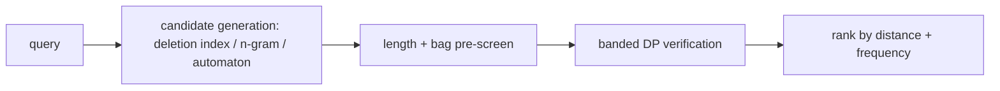

# Edit Distance (Levenshtein) and String Alignment — Senior Level

> Edit distance is rarely the bottleneck on two short strings — but the moment you run it against a million-entry dictionary, align megabase DNA, or expose it as a "did you mean?" service under latency budgets, every detail (memory model, banding, indexing, candidate generation, the metric properties your index assumes) becomes a correctness or performance incident.

## Table of Contents
1. [Introduction](#1-introduction)
2. [Hirschberg: Linear-Space Alignment](#2-hirschberg-linear-space-alignment)
3. [Banded and Ukkonen O(nd) at Scale](#3-banded-and-ukkonen-ond-at-scale)
4. [Scaling Spell-Check and Fuzzy Search](#4-scaling-spell-check-and-fuzzy-search)
5. [BK-Trees vs DP vs Tries vs Automata](#5-bk-trees-vs-dp-vs-tries-vs-automata)
6. [Needleman-Wunsch and Smith-Waterman in Production](#6-needleman-wunsch-and-smith-waterman-in-production)
7. [Code Examples](#7-code-examples)
8. [Observability and Testing](#8-observability-and-testing)
9. [Failure Modes](#9-failure-modes)
10. [Summary](#10-summary)

---

## 1. Introduction

At the senior level the question is no longer "how does the DP recurrence work" but "what system am I building, and what breaks when I scale it?" Edit distance shows up in production in four guises that share one engine:

1. **Pairwise alignment of long sequences** — diffing large files, aligning genomes. The full `O(nm)` table is `O(nm)` memory; that is the first thing that breaks. Solution: **Hirschberg** (linear space) or **banding** (when the distance is small).
2. **Nearest-neighbor search over a dictionary** — spell-check, autocomplete, deduplication. Running DP against every entry is `O(D · nm)` for a dictionary of `D` entries; that is the second thing that breaks. Solution: **indexing** (BK-trees, tries with shared DP rows, Levenshtein automata).
3. **Threshold queries** — "all entries within distance `k`." You never need the exact distance beyond `k`. Solution: **banded DP with early exit** plus length pre-screens.
4. **Streaming / incremental** — recomputing distance as a user types one more character. Solution: reuse the previous column/row instead of recomputing from scratch.

The senior decisions are: how to keep memory linear while still recovering an alignment; how to band aggressively without false negatives; how to index a dictionary so a query touches a tiny fraction of it; and how to verify all of this when the inputs are too large to eyeball.

---

## 2. Hirschberg: Linear-Space Alignment

The two-row trick (`middle.md`) gives the distance in `O(min(n,m))` space but **loses the traceback**. Hirschberg's algorithm (1975) recovers the *full alignment* in `O(nm)` time and **`O(min(n,m))` space** by divide-and-conquer.

### 2.1 The key fact

Let `f(j)` be the cost of the best alignment of `A[0..n/2)` against `B[0..j)` (a forward DP up to the middle row), and `g(j)` the cost of the best alignment of `A[n/2..n)` against `B[j..m)` (a backward DP from the bottom). Both are single-row computations. The optimal alignment crosses the middle row `n/2` at some column `j*` minimizing `f(j) + g(j)`. That split point partitions the problem into two independent halves of the *same* shape.

### 2.2 The recursion

```
hirschberg(A, B):
    if len(A) <= 1 or len(B) <= 1:
        return base-case alignment via the small full DP
    mid = len(A) / 2
    f  = forward_row(A[:mid], B)          # O(|B|) space
    g  = backward_row(A[mid:], B)         # O(|B|) space
    j* = argmin_j ( f[j] + g[j] )
    left  = hirschberg(A[:mid], B[:j*])
    right = hirschberg(A[mid:], B[j*:])
    return left ++ right
```

Each level does `O(nm)` total work, and the work halves the `A` dimension each time, so the geometric series sums to `O(2nm) = O(nm)` time. Space is `O(min(n,m))` for the two rows plus `O(log n)` recursion stack — the alignment itself is emitted at the leaves and concatenated. **This is the algorithm that makes whole-chromosome global alignment feasible on a laptop's RAM**, and the same idea (linear-space DP with a midpoint split) recurs throughout sequence bioinformatics.

### 2.3 When to use which

| Need | Algorithm | Time | Space |
|------|-----------|------|-------|
| Distance only | two-row DP | `O(nm)` | `O(min(n,m))` |
| Distance + script, memory OK | full table + traceback | `O(nm)` | `O(nm)` |
| Distance + script, memory tight | **Hirschberg** | `O(nm)` | `O(min(n,m))` |
| Distance ≤ k, k small | banded | `O(k·min(n,m))` | `O(k)` |

### 2.4 A Concrete Memory Comparison

Aligning two human chromosomes (~250 million bases each) with the full table would need `250M × 250M × 4 bytes ≈ 2.5 × 10^17` bytes — physically impossible. Hirschberg reduces the *working* set to two rows of ~250M integers (~1 GB) plus the `O(log n)` recursion stack and the emitted alignment. This is the difference between "needs a supercomputer's worth of RAM" and "runs on a workstation," and it is why every production global aligner uses linear-space DP (or banding when the sequences are similar). The time stays `O(nm)`, so for truly enormous inputs you *also* band or seed-and-extend; Hirschberg solves the memory wall, not the time wall.

### 2.5 The Recursion Stack Caveat

Hirschberg recurses to depth `O(log n)`, so the stack is tiny — but a naive implementation that slices strings (`A[:mid]`) at every level can allocate `O(nm)` total *copies* if not careful, silently reintroducing the quadratic memory it was meant to avoid. Production implementations pass index ranges `(lo, hi)` into a shared buffer rather than copying substrings, keeping true `O(min(n,m))` space. This is the most common Hirschberg implementation bug.

---

## 3. Banded and Ukkonen O(nd) at Scale

### 3.1 The band is a correctness contract, not just a speedup

A band of half-width `k` is only valid if the true distance is `≤ k`. Cells outside the band are treated as `+∞`. If the real distance exceeds `k`, the banded result is "no answer ≤ k" — *not* a wrong number. This is the contract: **banded DP answers a threshold question, not the open-ended distance.** To get the exact distance when you do not know it, run Ukkonen's doubling: try `k = 1, 2, 4, 8, …`, banding each time, until the band succeeds. The total cost telescopes to `O(n·d)` where `d` is the true distance, because each doubling dominates the previous.

### 3.2 Myers' O(nd) diff

`git diff` does not fill an `O(nm)` table. It uses **Myers' O(nd) algorithm** (1986), which is the LCS/edit-distance shortest-path explored along diagonals, expanding only as far as the actual number of differences `d` requires. For two nearly identical files (`d` small), this is dramatically faster than `O(nm)`. It is the same "alignment is a shortest path in a grid; explore by distance" idea as Ukkonen, specialized to insert/delete (no substitute), which is what line-diff wants. Knowing this connects "edit distance DP" to the tool you use every day.

### 3.3 Pre-screens that cost nothing

Before any DP:

- **Length filter:** `|n − m| > k` ⇒ distance `> k`. Reject.
- **Character-count filter (bag distance):** the multiset symmetric difference of characters is a lower bound on edit distance (each surplus character needs at least one insert/delete). Cheap to compute, prunes hard.
- **First/last character mismatch** is a weak signal but free.

In a fuzzy-search service these screens reject the overwhelming majority of candidates before the expensive banded DP runs.

### 3.4 Bag Distance as a Lower Bound — Worked

For `A = "listen"`, `B = "silent"`: both are anagrams, so the character multisets are identical, bag distance `0` — the screen does *not* reject (correctly, since they are close). For `A = "abc"`, `B = "xyz"`: the multiset symmetric difference is 6 characters, so bag distance `≥ 3` (each pair of one surplus and one deficit needs at least one substitution, or one delete + one insert), and with `k = 2` the pair is rejected without DP. Bag distance is `⌈(surplus + deficit)/2⌉` rounded appropriately and is a genuine lower bound on edit distance because every operation changes the character multiset by at most the amount one substitution/indel can. It is `O(n + m + |Σ|)` to compute and prunes aggressively on dissimilar strings.

### 3.5 Why git Uses Myers, Not Wagner-Fischer

A code change typically touches a few lines out of thousands, so `d ≪ n`. Myers' `O(nd)` explores only the diagonals reachable within `d` differences, terminating as soon as the sink is hit. For a 10,000-line file with a 5-line change, this is ~`10000 × 5 = 50,000` operations versus `10000² = 10^8` for the full table — a 2000× difference. Myers also produces a *minimal, readable* diff (fewest insert/delete lines) because it minimizes the LCS-model edit distance. This is why understanding edit distance gives you a precise mental model of what `git diff` is actually computing under the hood.

---

## 4. Scaling Spell-Check and Fuzzy Search

The naive spell-checker computes edit distance from the query to every dictionary word: `O(D · nm)`. For `D = 10⁶` words this is far too slow per keystroke. Production approaches:

### 4.1 Shared-prefix DP over a trie

Build the dictionary as a **trie**. Run the DP column-by-column as you descend the trie: the DP row for a node is computed from its parent's row, so the shared prefix's DP work is computed **once** for all words sharing that prefix. Prune a subtree the moment its entire row exceeds `k` (banding on the trie). This turns the dictionary scan into a bounded DFS that visits only nodes reachable within distance `k` — typically a tiny fraction of the trie. This is the standard high-performance "fuzzy trie search" and is what most spell-checkers actually use.

### 4.2 Levenshtein automata

For a fixed query and threshold `k`, you can compile a **Levenshtein automaton** that accepts exactly the strings within distance `k` of the query, in `O(k·n)` states. Intersect it with the dictionary (itself a DAWG/automaton) and you enumerate all matches in time proportional to the output, not the dictionary size. This is the approach behind Lucene's fuzzy queries. It is the most scalable option for repeated queries against a static dictionary.

### 4.3 Symmetric Delete (SymSpell)

For very high throughput with small `k` (typically `k ≤ 2`), **SymSpell** precomputes, for every dictionary word, all strings obtainable by up to `k` deletions, indexed in a hash map. A query also generates its deletion variants and looks them up — turning fuzzy lookup into `O(1)`-ish hash probes at the cost of significant precomputation memory. It is the fastest known approach for the small-`k` regime, trading RAM for latency.

### 4.4 Candidate generation vs verification

A robust pipeline separates **candidate generation** (cheap, recall-oriented: n-grams, deletion index, automaton) from **verification** (exact banded DP on the survivors). Generation narrows millions to dozens; verification confirms and ranks. Never run exact DP on the full dictionary; never trust candidate generation as the final answer.



### 4.5 Worked SymSpell Sizing

SymSpell with `k = 2` precomputes, for each dictionary word, all strings reachable by ≤ 2 deletions. A length-`L` word generates `C(L,0) + C(L,1) + C(L,2) = 1 + L + L(L−1)/2` deletion variants — for `L = 10` that is `1 + 10 + 45 = 56` keys per word. Over a 100k-word dictionary that is ~5.6M hash-map entries, tens of megabytes. The query also generates its ≤ 2-deletion variants (`O(L²)`) and probes the map; a hit means the dictionary word and the query share a common ≤ 2-deletion preimage, i.e. they are within edit distance 2 (with a verification pass to exclude the rare false positives that deletions-only matching admits). The trade is stark: tens of MB of precompute for near-`O(1)` lookup, which is why SymSpell dominates the very-small-`k`, high-QPS regime and is impractical for large `k` (the variant count explodes as `C(L,k)`).

### 4.6 Choosing the Method by Workload

| Workload | Best method | Why |
|----------|-------------|-----|
| Small dictionary, occasional query | linear scan + banded DP | no index to maintain |
| Prefix-heavy dictionary | fuzzy trie (shared-row DP) | reuse prefix work, prune subtrees |
| Static dictionary, repeated queries | Levenshtein automaton ∩ DAWG | output-sensitive, no per-query DP over the dict |
| Very small `k`, max QPS | SymSpell deletion index | `O(1)`-ish probes, RAM for speed |
| Metric distance, arbitrary `k` | BK-tree | triangle-inequality pruning |

---

## 5. BK-Trees vs DP vs Tries vs Automata

A **BK-tree** indexes a dictionary by exploiting the **triangle inequality** of a metric distance. Each node stores a word; children are bucketed by their *exact* distance to the parent. To query within distance `k` of `q`, compute `d(q, node)`, then only descend into children whose edge label is in `[d − k, d + k]` — the triangle inequality guarantees no match lives outside that range. This prunes large subtrees.

| Index | Requires metric? | Best for | Weakness |
|-------|------------------|----------|----------|
| Linear scan + banded DP | no | small dictionaries, one-off | `O(D)` per query |
| **BK-tree** | **yes** (triangle ineq.) | medium dictionaries, arbitrary `k` | degrades for large `k` or non-metric costs |
| Fuzzy trie (shared-row DP) | no | prefix-heavy dictionaries | memory of the trie |
| Levenshtein automaton | no | repeated queries, static dict | build cost per query/threshold |
| SymSpell (delete index) | no | very small `k`, max throughput | large precompute memory |

**The critical senior caveat:** a BK-tree's correctness *depends* on the distance being a true metric (non-negative, symmetric, identity of indiscernibles, triangle inequality). Plain Levenshtein qualifies (proof in `professional.md`). **Weighted edit distance with arbitrary costs may not** — if `cost_sub` is asymmetric or violates sub-additivity, the triangle inequality fails and the BK-tree silently returns wrong (incomplete) results. Before indexing with a BK-tree, verify your cost model is a metric, or use a method (trie/automaton DP) that does not assume one.

### 5.1 Worked BK-Tree Pruning

Suppose the root is `book` and a query `books` with `k = 1`. Compute `d(books, book) = 1`. A child reached by edge label `e` can only contain matches if `e ∈ [d−k, d+k] = [0, 2]`. So children at distance `3, 4, …` from `book` are *entirely* skipped — by the triangle inequality, any word `w` in such a subtree has `d(books, w) ≥ d(book, w) − d(books, book) ≥ 3 − 1 = 2 > k`. For a balanced BK-tree over a natural-language dictionary, this typically prunes the vast majority of subtrees, turning an `O(D)` scan into a few hundred distance computations. The pruning power *degrades* as `k` grows (the window `[d−k, d+k]` widens), which is why BK-trees shine for `k ≤ 2` and lose their edge for large thresholds.

### 5.2 When the Triangle Inequality Silently Fails

Concretely: set `w_del = 1`, `w_ins = 1`, but `w_sub('a','b') = 5`. Then `d("a","b") = 2` (delete-then-insert, since substitution at `5` is worse), `d("a","x") = 2`, `d("x","b") = 2` — these happen to satisfy the inequality. But mix in an asymmetry `w_ins = 1, w_del = 3`: now `d("a","") = 3` while `d("","a") = 1`, so `d` is not even symmetric, and a BK-tree built assuming `d(parent,child) = d(child,parent)` indexes edges inconsistently — a query computing `d(query, node)` compares against edge labels that were stored as `d(node, child)`, which differ. The tree returns *incomplete* results with no error. The only safe fix is to enforce the metric conditions (Theorem 10.1 in `professional.md`) before indexing.

---

## 6. Needleman-Wunsch and Smith-Waterman in Production

Bioinformatics reframes edit distance as **alignment scoring** (maximize similarity instead of minimize cost — same DP, sign flipped):

- **Needleman-Wunsch (1970)** — *global* alignment: align the entire two sequences end-to-end. This is exactly the edit-distance DP with a substitution matrix and gap penalties; the answer is the bottom-right cell.
- **Smith-Waterman (1981)** — *local* alignment: find the highest-scoring *substring* alignment. The twist is one extra rule: clamp any cell score that would go negative to `0`, and trace back from the **maximum** cell anywhere in the table (not the corner). This finds the best-matching region rather than forcing a full alignment.

Production realities:

- **Affine gap penalties** (open cost + smaller extend cost) require **Gotoh's** three-matrix DP, because a run of gaps should not cost linearly per character. Most real aligners use affine gaps.
- **Quadratic memory** is the wall; Hirschberg (Section 2) and banding (Section 3) are standard. Heuristic seed-and-extend aligners (BLAST, minimap2) avoid full DP entirely for huge databases, using exact-match seeds to localize where the expensive DP runs.
- The connection to study: **edit distance = (negated) global alignment score under unit costs**. Once you see Needleman-Wunsch is your `dp[i][j]` recurrence with a scoring matrix, the whole bioinformatics alignment literature becomes "edit distance with richer costs and the same optimizations."

### 6.1 Global vs Local in One Picture

| | Needleman-Wunsch (global) | Smith-Waterman (local) |
|--|---------------------------|------------------------|
| Goal | align entire sequences end-to-end | best-matching *substring* pair |
| Base row/col | cumulative gap penalties | all zeros |
| Cell clamp | none | `max(0, …)` |
| Answer cell | corner `(n,m)` | global maximum anywhere |
| Traceback ends | at `(0,0)` | at the first `0` |
| Edit-distance analogue | `−d(A,B)` under unit scoring | no direct unit-cost analogue |

The single algorithmic difference — clamp at zero and start traceback from the max — is what converts "transform all of A into all of B" into "find the region where A and B agree best." Misusing global where local is wanted (or vice versa) is a modeling error, not a bug; the DP runs fine but answers the wrong question. For read mapping you want local (the read matches a *region* of the genome); for diffing two versions of a document you want global.

### 6.2 Seed-and-Extend in One Sentence

Tools like BLAST first find short exact matches (seeds) by hashing k-mers, then run the expensive banded Smith-Waterman DP only in the neighborhood of each seed — so the `O(nm)` cost is paid on tiny windows, not the whole database, trading a small loss of sensitivity for orders-of-magnitude speedup. This is the same "cheap candidate generation + exact DP verification" pipeline as fuzzy spell-check (Section 4.4), applied to billions of bases.

---

## 7. Code Examples

### 7.1 Go — Hirschberg linear-space alignment

```go
package main

import "fmt"

// forwardRow returns the last DP row of edit distances aligning a against b.
func forwardRow(a, b string) []int {
	m := len(b)
	prev := make([]int, m+1)
	for j := 0; j <= m; j++ {
		prev[j] = j
	}
	for i := 1; i <= len(a); i++ {
		cur := make([]int, m+1)
		cur[0] = i
		for j := 1; j <= m; j++ {
			cost := 1
			if a[i-1] == b[j-1] {
				cost = 0
			}
			cur[j] = min3(prev[j]+1, cur[j-1]+1, prev[j-1]+cost)
		}
		prev = cur
	}
	return prev
}

func reverse(s string) string {
	r := []byte(s)
	for i, j := 0, len(r)-1; i < j; i, j = i+1, j-1 {
		r[i], r[j] = r[j], r[i]
	}
	return string(r)
}

func backwardRow(a, b string) []int {
	return forwardRow(reverse(a), reverse(b))
}

func min3(a, b, c int) int {
	m := a
	if b < m {
		m = b
	}
	if c < m {
		m = c
	}
	return m
}

// hirschberg returns aligned strings (with '-' for gaps).
func hirschberg(a, b string) (string, string) {
	if len(a) == 0 {
		return repeat('-', len(b)), b
	}
	if len(b) == 0 {
		return a, repeat('-', len(a))
	}
	if len(a) == 1 || len(b) == 1 {
		return smallAlign(a, b)
	}
	mid := len(a) / 2
	scoreL := forwardRow(a[:mid], b)
	scoreR := backwardRow(a[mid:], b)
	best, split := 1<<30, 0
	for j := 0; j <= len(b); j++ {
		if s := scoreL[j] + scoreR[len(b)-j]; s < best {
			best, split = s, j
		}
	}
	la, lb := hirschberg(a[:mid], b[:split])
	ra, rb := hirschberg(a[mid:], b[split:])
	return la + ra, lb + rb
}

func repeat(c byte, n int) string {
	r := make([]byte, n)
	for i := range r {
		r[i] = c
	}
	return string(r)
}

// smallAlign aligns when one side has length 1.
func smallAlign(a, b string) (string, string) {
	if len(a) == 1 {
		// place the single char of a opposite a matching char of b if one exists,
		// otherwise substitute it against b[0]; pad the rest of b with gaps.
		for k := 0; k < len(b); k++ {
			if a[0] == b[k] {
				return repeat('-', k) + a + repeat('-', len(b)-k-1), b
			}
		}
		// no match: substitute against the first char, gaps for the remainder
		return a + repeat('-', len(b)-1), b
	}
	ra, rb := smallAlign(b, a)
	return rb, ra
}

func max(a, b int) int { if a > b { return a }; return b }

func main() {
	x, y := hirschberg("AGTACGCA", "TATGC")
	fmt.Println(x)
	fmt.Println(y)
}
```

### 7.2 Java — fuzzy search over a dictionary with banded verification

```java
import java.util.*;

public class FuzzySearch {
    static final int INF = 1 << 29;

    // Banded: returns distance if <= k, else INF.
    static int bounded(String a, String b, int k) {
        int n = a.length(), m = b.length();
        if (Math.abs(n - m) > k) return INF;
        int[] prev = new int[m + 1];
        for (int j = 0; j <= m; j++) prev[j] = j <= k ? j : INF;
        for (int i = 1; i <= n; i++) {
            int[] cur = new int[m + 1];
            Arrays.fill(cur, INF);
            cur[0] = i <= k ? i : INF;
            int lo = Math.max(1, i - k), hi = Math.min(m, i + k);
            int rowMin = cur[0];
            for (int j = lo; j <= hi; j++) {
                int cost = a.charAt(i - 1) == b.charAt(j - 1) ? 0 : 1;
                int v = Math.min(prev[j] + 1, Math.min(cur[j - 1] + 1, prev[j - 1] + cost));
                cur[j] = v;
                rowMin = Math.min(rowMin, v);
            }
            if (rowMin > k) return INF;
            prev = cur;
        }
        return prev[m] <= k ? prev[m] : INF;
    }

    static List<String> search(List<String> dict, String q, int k) {
        List<String> hits = new ArrayList<>();
        for (String w : dict) {
            if (Math.abs(w.length() - q.length()) > k) continue; // pre-screen
            int d = bounded(q, w, k);
            if (d <= k) hits.add(w + " (d=" + d + ")");
        }
        return hits;
    }

    public static void main(String[] args) {
        List<String> dict = List.of("kitten", "sitting", "mitten", "kitchen", "bit");
        System.out.println(search(dict, "kittin", 2));
    }
}
```

### 7.3 Python — BK-tree index (metric distance)

```python
class BKTree:
    def __init__(self, distance):
        self.distance = distance        # must be a metric!
        self.root = None                # (word, {dist: child})

    def add(self, word):
        if self.root is None:
            self.root = (word, {})
            return
        node = self.root
        while True:
            w, children = node
            d = self.distance(word, w)
            if d == 0:
                return                  # duplicate
            if d in children:
                node = children[d]
            else:
                children[d] = (word, {})
                return

    def query(self, word, k):
        if self.root is None:
            return []
        results, stack = [], [self.root]
        while stack:
            w, children = stack.pop()
            d = self.distance(word, w)
            if d <= k:
                results.append((w, d))
            # triangle inequality: only children in [d-k, d+k] can match
            for edge, child in children.items():
                if d - k <= edge <= d + k:
                    stack.append(child)
        return results


def levenshtein(a, b):
    if len(a) < len(b):
        a, b = b, a
    prev = list(range(len(b) + 1))
    for i in range(1, len(a) + 1):
        cur = [i] + [0] * len(b)
        for j in range(1, len(b) + 1):
            cost = 0 if a[i - 1] == b[j - 1] else 1
            cur[j] = min(prev[j] + 1, cur[j - 1] + 1, prev[j - 1] + cost)
        prev = cur
    return prev[len(b)]


if __name__ == "__main__":
    tree = BKTree(levenshtein)
    for w in ["kitten", "sitting", "mitten", "kitchen", "bit", "fitting"]:
        tree.add(w)
    print(sorted(tree.query("kittin", 2)))
```

---

## 8. Observability and Testing

A distance result is opaque — one wrong cell looks like any other small integer. Build checks in from day one.

| Check | Why |
|-------|-----|
| Apply the recovered script to `A`, assert it yields `B` | Catches traceback bugs the distance alone hides. |
| Brute-force recursive oracle on tiny strings | Catches recurrence/base-case errors. |
| Symmetry: `d(A,B) == d(B,A)` (unit cost) | Levenshtein is symmetric; asymmetry signals a bug. |
| Triangle inequality on random triples | Required if a BK-tree indexes the distance. |
| Identity: `d(A,A) == 0`, `d(A,"") == len(A)` | Confirms base cases. |
| Banded vs full agreement when `d ≤ k` | Confirms the band is wide enough and the early-exit is correct. |
| Hirschberg vs full-table alignment cost equal | Confirms the linear-space split is correct. |

The single most valuable test is **applying the edit script and checking it reconstructs `B`** — it validates the recurrence, the traceback, and the operation labels in one shot. For fuzzy search, also test that **banded + index returns exactly the same hit set** as a brute linear scan with full DP on a small dictionary.

### 8.1 Property-test battery

```text
for random A, B (short), random k:
    assert d(A,B) == d(B,A)                       # symmetry (unit cost)
    assert d(A,A) == 0
    assert d(A,"") == len(A) and d("",B) == len(B)
    assert abs(len(A)-len(B)) <= d(A,B) <= max(len(A),len(B))
    assert apply_script(A, script(A,B)) == B       # script correctness
    assert bounded(A,B,k) in {d(A,B), None} and (d(A,B)<=k) == (bounded(A,B,k) is not None)
for random triples A,B,C:
    assert d(A,C) <= d(A,B) + d(B,C)               # triangle inequality
```

### 8.2 Production guardrails

For a fuzzy-search service: log the **candidate count** before and after pre-screening (a sudden drop in pruning ratio signals a screen bug or a pathological query); assert query and dictionary entries are normalized identically (Unicode NFC, case); cap `k` to bound worst-case latency; and emit the distance distribution of returned hits so an anomalous "everything matches at distance 0" misconfiguration stands out.

Additional guardrails worth wiring in:

- **Pruning-ratio alarm:** if the fraction of candidates rejected by the length/bag pre-screen drops below a baseline, either the screen regressed or queries got pathological (e.g., a single character matching everything) — page before latency does.
- **Index/scan parity canary:** periodically replay a sample of production queries through both the index path and a brute linear scan with full DP, and alert on any hit-set divergence. This catches band-too-narrow and non-metric-index bugs that never throw.
- **Tail-latency cap on `k`:** worst-case banded cost is `O(k·min(n,m))`; an unbounded `k` from a misbehaving client can blow the latency budget. Clamp `k` server-side and reject oversized queries.
- **Normalization assertion:** a single code path must NFC-normalize and case-fold both the query and dictionary entries; a mismatch produces spurious distances that look like relevance bugs, not crashes.

---

## 9. Failure Modes

### 9.1 Quadratic memory blowup
Filling the full `O(nm)` table for long sequences exhausts RAM (40 GB for two 100k strings). Mitigation: two-row DP if only the distance is needed; Hirschberg if the alignment is needed; banding if the distance is small.

### 9.2 Band too narrow (false negative)
Using a band of width `k` when the true distance exceeds `k` returns "no match" even though a larger distance exists. This is *correct* for a threshold query but a *bug* if you wanted the exact distance. Mitigation: Ukkonen doubling (`k = 1,2,4,…`) for the exact distance; document that banded results are threshold answers.

### 9.3 Non-metric costs break the BK-tree
Indexing a weighted distance whose costs are asymmetric or violate the triangle inequality makes the BK-tree prune valid matches, silently dropping results. Mitigation: verify the cost model is a metric (symmetric, sub-additive) before BK-tree indexing, or use trie/automaton search instead.

### 9.4 Unicode mismatch
Comparing UTF-8 bytes counts a single accented character as multiple edits; inconsistent normalization between query and dictionary causes spurious distances. Mitigation: normalize (NFC) and compare code points (runes), and apply the *same* normalization to both sides.

### 9.5 OSA transposition overcount
Optimal String Alignment forbids editing a substring twice, so it overestimates true Damerau-Levenshtein on adversarial inputs (`CA → ABC`). Mitigation: use true Damerau-Levenshtein where the distinction matters; for spell-check, OSA is fine — just document it.

### 9.6 Running exact DP over the whole dictionary
`O(D·nm)` per query melts under load. Mitigation: candidate generation (deletion index, n-grams, automaton) then banded verification on the survivors; never DP the full dictionary per keystroke.

### 9.7 Smith-Waterman traceback from the wrong cell
Local alignment must trace back from the global *maximum* cell, not the corner, and stop at the first zero. Tracing from the corner (as in global alignment) yields a wrong local result. Mitigation: track the max cell during the fill; stop traceback at score 0.

### 9.8 Ignoring affine gaps
Modeling a long gap as many independent single-character indels overcounts its cost when the application wants "open + extend." Mitigation: use Gotoh's three-matrix affine-gap DP.

### 9.9 Hirschberg substring-copy regression
A Hirschberg implementation that slices `A[:mid]` and `B[:j*]` into fresh string objects at every recursion level can allocate `O(nm)` total bytes across the recursion, silently reintroducing the quadratic memory it exists to avoid. Mitigation: pass index ranges into a shared buffer rather than copying substrings; assert peak working memory is `O(min(n,m))` in a test.

### 9.10 Confusing global and local alignment
Using Needleman-Wunsch (global) where the task wants the best-matching region, or Smith-Waterman (local) where an end-to-end alignment is required, produces a perfectly valid answer to the *wrong* question — no crash, just wrong semantics. Mitigation: pin down "align everything" vs "find the best region" before coding, and document which the function computes.

---

## 10. Summary

- **Memory is the first thing that breaks.** Two-row DP gives the distance in linear space; **Hirschberg** gives the *alignment* in linear space and `O(nm)` time via a midpoint divide-and-conquer — the standard tool for long-sequence global alignment.
- **Banding answers threshold questions.** A band of half-width `k` is a correctness contract: it returns the distance if `≤ k`, otherwise "no". **Ukkonen doubling** and **Myers' O(nd)** (the engine behind `git diff`) recover the exact distance in `O(nd)` when `d` is small.
- **Never DP the whole dictionary.** Scale fuzzy search with **shared-row trie DP**, **Levenshtein automata** (Lucene), or **SymSpell** deletion indexes, splitting cheap candidate generation from exact banded verification.
- **BK-trees need a true metric.** They prune via the triangle inequality, which plain Levenshtein satisfies but arbitrary weighted costs may not — verify before indexing.
- **Bioinformatics is the same DP.** Needleman-Wunsch is global edit-distance alignment with a scoring matrix; Smith-Waterman is its local variant (clamp at 0, trace from the max). Affine gaps need Gotoh's three matrices.
- **Test the script, not just the number.** Applying the recovered edit operations and checking they rebuild `B` validates recurrence, traceback, and labels at once; property-test symmetry, the triangle inequality, and banded/full agreement.

### Decision summary

- **Distance only, long strings** → two-row DP (`O(min(n,m))` space).
- **Alignment needed, memory tight** → Hirschberg (`O(nm)` time, `O(min(n,m))` space).
- **"Within k?" or small distance** → banded / Ukkonen `O(nd)` (Myers diff for line-level).
- **Query vs large dictionary** → trie/automaton/SymSpell candidate generation + banded verification.
- **Indexing a metric distance** → BK-tree (only if costs form a true metric).
- **Biological / weighted alignment** → Needleman-Wunsch / Smith-Waterman with Gotoh affine gaps.

References to study further: Hirschberg (1975) linear-space LCS; Ukkonen (1985) `O(nd)`; Myers (1986) `O(nd)` diff; Needleman-Wunsch (1970); Smith-Waterman (1981); Gotoh (1982) affine gaps; Schulz-Mihov Levenshtein automata; SymSpell; Burkhard-Keller (BK) trees; Gusfield, *Algorithms on Strings, Trees, and Sequences*; and sibling files [`professional.md`](./professional.md) (metric proof, correctness) and [`middle.md`](./middle.md) (edit scripts, weights, banding basics).
