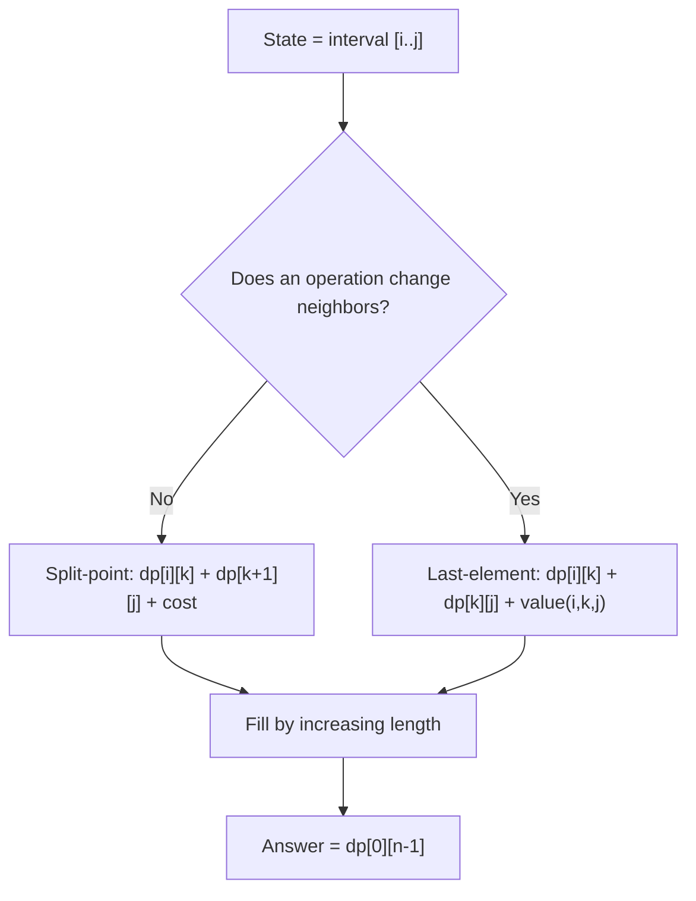

# Interval DP (DP over Ranges `[i..j]`) — Junior Level

> **One-line summary:** Interval DP solves a problem on a sequence by computing the best answer for every contiguous range `[i..j]`, building from the shortest ranges up to the whole sequence. The defining recurrence is `dp[i][j] = best over a split point k of dp[i][k] + dp[k+1][j] + cost(i, k, j)`, and you fill the table **in order of increasing interval length**.

---

## Table of Contents

1. [Introduction](#introduction)
2. [Prerequisites](#prerequisites)
3. [Glossary](#glossary)
4. [Core Concepts](#core-concepts)
5. [Big-O Summary](#big-o-summary)
6. [Real-World Analogies](#real-world-analogies)
7. [Pros & Cons](#pros--cons)
8. [Step-by-Step Walkthrough](#step-by-step-walkthrough)
9. [Code Examples](#code-examples)
10. [Coding Patterns](#coding-patterns)
11. [Error Handling](#error-handling)
12. [Performance Tips](#performance-tips)
13. [Best Practices](#best-practices)
14. [Edge Cases & Pitfalls](#edge-cases--pitfalls)
15. [Common Mistakes](#common-mistakes)
16. [Cheat Sheet](#cheat-sheet)
17. [Visual Animation](#visual-animation)
18. [Summary](#summary)
19. [Further Reading](#further-reading)

---

## Introduction

Imagine someone hands you a row of numbers and asks: *"In what order should you combine adjacent items to pay the least total cost?"* A classic version is **matrix chain multiplication**: you have a chain of matrices `M₁ · M₂ · ⋯ · Mₙ`, and although the final product is the same no matter how you parenthesize, the *number of scalar multiplications* depends drastically on the order. `(M₁ M₂) M₃` may cost a thousand operations while `M₁ (M₂ M₃)` costs a million. Which parenthesization is cheapest?

There are exponentially many ways to parenthesize, so brute force is hopeless for even a few dozen matrices. The breakthrough is a simple observation: **whatever the optimal parenthesization is, there is some outermost multiplication that splits the chain into a left part and a right part.** If we knew the best way to handle each part, we could try every possible split point and take the cheapest combination. That is the heart of **interval DP**.

The technique works on any problem where:

- the input is a **linear sequence** (numbers, characters, matrices, stones, balloons), and
- the answer for a range `[i..j]` is built from the answers of **smaller sub-ranges** inside it.

We define `dp[i][j]` = the best (minimum cost, maximum value, count, etc.) answer for the contiguous sub-sequence from index `i` to index `j`. The general recurrence picks a **split point** `k` inside the range:

> **`dp[i][j] = best over k of ( dp[i][k] + dp[k+1][j] + cost(i, k, j) )`**

We try every `k` between `i` and `j`, combine the two sub-answers plus the cost of joining them, and keep the best. To make sure the sub-ranges are already solved before we need them, we fill the table **by increasing interval length**: first all length-1 ranges (the base cases), then length-2, then length-3, and so on, up to the full range `[0..n-1]`.

Two running examples appear throughout this file:

- **Matrix chain multiplication** — split-point flavor: choose the outermost `×`.
- **Burst balloons** — last-operated-element flavor: choose which balloon is burst *last* inside the range.

Both are interval DP; they differ only in *what the split point means*. Mastering that one distinction unlocks the whole family: optimal binary search trees, stone merging, palindrome partitioning, and removing boxes, all covered in this topic's `middle.md` and beyond.

The baseline cost is `O(n³)`: there are `O(n²)` intervals, and each tries `O(n)` split points. For some problems that cubic factor can be cut to `O(n²)` using **Knuth's optimization** or the **divide-and-conquer optimization** — pointers to sibling topics `11` and `12` — but the `O(n³)` interval DP is the foundation you must understand first.

---

## Prerequisites

Before reading this file you should be comfortable with:

- **Basic dynamic programming** — the idea of storing sub-answers in a table and reusing them (overlapping subproblems, optimal substructure). See sibling `01-introduction-to-dp` and `02-memoization-vs-tabulation`.
- **2D arrays / nested loops** — every interval DP lives in a 2D table `dp[i][j]`.
- **Recursion and memoization** — the top-down version of interval DP is recursion + a cache.
- **Big-O notation** — `O(n²)` intervals, `O(n)` splits, `O(n³)` total.
- **Prefix sums** — many interval problems (stone merging) precompute range sums for `O(1)` cost lookups.

Optional but helpful:

- A glance at **matrix multiplication dimensions** — to follow the matrix chain example (an `a × b` matrix times a `b × c` matrix costs `a·b·c` scalar multiplications and yields an `a × c` matrix).
- Familiarity with **binary search trees** — to follow the optimal BST example in `middle.md`.

---

## Glossary

| Term | Meaning |
|------|---------|
| **Interval / range `[i..j]`** | A contiguous sub-sequence from index `i` to index `j`, inclusive. |
| **`dp[i][j]`** | The optimal answer (min cost / max value / count) for the sub-sequence `[i..j]`. |
| **Split point `k`** | An index inside `[i..j]` where the range is divided into two parts to combine. |
| **Last-operated element** | An alternative framing: the element inside `[i..j]` that is processed *last* (e.g., the balloon burst last). |
| **Interval length** | `j - i + 1`, the number of elements in the range. The fill order is by increasing length. |
| **Base case** | The answer for the smallest ranges, usually length-1 (a single element) where no work is needed (`dp[i][i] = 0` or similar). |
| **`cost(i, k, j)`** | The extra cost of combining the two sub-ranges at split `k` (e.g., the scalar multiplications for one matrix product). |
| **Optimal substructure** | The property that an optimal answer for `[i..j]` is built from optimal answers of its sub-ranges. |
| **Tabulation** | Bottom-up filling of the `dp` table; the natural style for interval DP (by increasing length). |
| **Memoization** | Top-down recursion that caches results for each `(i, j)` pair. |

---

## Core Concepts

### 1. The State Is an Interval

The single most important idea: in interval DP the **state is a contiguous range `[i..j]`**, and `dp[i][j]` holds the best answer for just that range. Because `i` and `j` are both indices into a length-`n` sequence with `i ≤ j`, there are about `n²/2` distinct states. We store them in a 2D table.

For matrix chain multiplication on matrices `M_i, …, M_j`, `dp[i][j]` is the minimum number of scalar multiplications to compute that sub-product. For burst balloons, `dp[i][j]` is the maximum coins obtainable by bursting all balloons strictly inside the open range `(i, j)`.

### 2. The Transition Chooses a Split (or a Last Element)

There are two equivalent ways to set up the recurrence, and recognizing which fits your problem is the key skill.

**Split-point framing (matrix chain).** The optimal answer has some outermost operation that divides `[i..j]` into `[i..k]` and `[k+1..j]`:

```
dp[i][j] = min over k in [i, j-1] of ( dp[i][k] + dp[k+1][j] + cost(i, k, j) )
```

You first compute both halves optimally, then pay the cost of joining them. For matrix chain, `cost(i, k, j)` is the cost of multiplying the result of the left part (an `r_i × r_{k+1}` matrix) by the result of the right part (an `r_{k+1} × r_{j+1}` matrix), which is `r_i · r_{k+1} · r_{j+1}` scalar multiplications.

**Last-element framing (burst balloons).** Sometimes it is cleaner to ask: *which element of `[i..j]` is operated on last?* If element `k` is burst last (after everything else in the range is gone), then when you burst it its neighbors are exactly the range boundaries:

```
dp[i][j] = max over k in (i, j) of ( dp[i][k] + dp[k][j] + value(i, k, j) )
```

The two halves `dp[i][k]` and `dp[k][j]` are solved first (everything except `k`), and `value(i, k, j)` accounts for the last operation on `k`. This "last element" trick fixes the tricky issue that bursting changes neighbors — by choosing the *last* one, its neighbors are stable.

### 3. Fill by Increasing Length

Both recurrences read sub-ranges that are **strictly smaller** than `[i..j]`. So when we fill `dp[i][j]`, every smaller range it depends on must already be computed. The clean way to guarantee this is to iterate by **interval length**:

```
for length = 1 to n:                 # or start at 2, depending on the problem
    for i = 0 to n - length:
        j = i + length - 1
        dp[i][j] = ... (uses dp of smaller ranges)
```

Length-1 ranges are the base cases. Then length-2, length-3, …, finishing with the single length-`n` range `[0..n-1]`, whose value is the final answer. This length-first ordering is the signature of interval DP — if you see it, you are almost certainly looking at interval DP.

### 4. Base Cases

The base case is the smallest range that needs no combining. For matrix chain, a single matrix needs zero multiplications: `dp[i][i] = 0`. For burst balloons with the open-range framing, an empty interior contributes nothing. Getting the base case right (and starting the length loop at the right value) is where most beginner bugs live.

### 5. The `cost` / `value` Function

The split recurrence is generic; what makes each problem specific is the `cost(i, k, j)` term. Examples you will meet:

- **Matrix chain:** `cost = r_i · r_{k+1} · r_{j+1}` (dimensions of the two factors).
- **Stone merging:** `cost = sum(stones[i..j])` (the merge cost is the total weight, independent of `k`).
- **Optimal BST:** `cost = sum of access frequencies in [i..j]` (every key gets one deeper level).
- **Burst balloons:** `value = nums[i] · nums[k] · nums[j]` (the coins from bursting `k` last between boundaries `i` and `j`).

### 6. Reconstructing the Answer (optional)

`dp[0][n-1]` gives the optimal *value*. If you also need the *choice* (which parenthesization, which BST shape), store the winning split `k` in a second table `split[i][j]` whenever you update `dp[i][j]`, then walk that table recursively afterward.

---

## Big-O Summary

| Quantity | Value | Notes |
|----------|-------|-------|
| Number of states (intervals) | **O(n²)** | All pairs `i ≤ j`. |
| Work per state (try every split) | O(n) | Loop `k` from `i` to `j`. |
| Total time (baseline) | **O(n³)** | `n²` states × `n` splits. |
| Space | O(n²) | The `dp` table (plus optional `split` table). |
| `cost(i, k, j)` lookup | O(1) | With prefix sums where needed. |
| With Knuth's optimization | O(n²) | Only when the quadrangle inequality holds (see `11`). |
| With divide-and-conquer optimization | O(n² log n) | Different monotonicity condition (see `12`). |

The headline baseline number is **`O(n³)`** — cubic in the sequence length. That is fine for `n` up to a few hundred (around `n ≤ 500` is comfortable). Beyond that, you look at the optimizations.

---

## Real-World Analogies

| Concept | Analogy |
|---------|---------|
| Interval `[i..j]` | A consecutive stretch of a railway line between station `i` and station `j`; you reason about each stretch independently. |
| Split point `k` | Deciding where to place a junction that joins a left segment and a right segment of track. |
| `dp[i][j]` | The cheapest way to build the whole stretch from `i` to `j`. |
| Cost of joining | The extra construction cost at the junction itself. |
| Fill by increasing length | Build all the short segments first, then medium, then the full line — you can't price a long segment until its pieces are priced. |
| Last-operated element (balloons) | Removing items from a row of dominoes: it's easiest to reason about which one you knock down *last*, because by then its neighbors are fixed. |
| Matrix chain | Choosing the order to merge a stack of reports: merging two small reports first is cheaper than merging a giant one with a tiny one repeatedly. |

Where the analogy breaks: real construction costs are additive in obvious ways; interval DP's power is that the *combination cost* can depend on the whole range, and trying every split is what discovers the non-obvious cheapest plan.

---

## Pros & Cons

| Pros | Cons |
|------|------|
| Turns an exponential "try every parenthesization" search into polynomial `O(n³)`. | Cubic time limits it to sequences of a few hundred elements without optimization. |
| One uniform template (state = interval, transition = split) covers a whole family of classic problems. | Requires the problem to decompose along a *contiguous* range; doesn't apply to arbitrary subsets. |
| The "last-operated element" trick elegantly handles problems where operations change neighbors (balloons, removing boxes). | Choosing split-point vs last-element framing is subtle; the wrong framing can make the DP incorrect. |
| `O(n²)` space is modest; easy to reconstruct the optimal choice with a parallel table. | Some variants (removing boxes) need a *third* state dimension, raising cost to `O(n⁴)`. |
| Sets up cleanly for Knuth / D&C optimizations when the cost function is well-behaved. | Off-by-one errors in the length loop and base cases are very common. |

**When to use:** the input is a linear sequence; the optimal answer for a range is built from optimal answers of contiguous sub-ranges; you must choose an order/grouping/split (parenthesization, merging, partitioning, last removal). Classic: matrix chain, optimal BST, burst balloons, stone merging, palindrome partitioning, removing boxes.

**When NOT to use:** the subproblems are over arbitrary subsets (use bitmask DP); the sequence is huge (`n` in the thousands+) and no optimization applies; the problem has no contiguous-range structure (e.g., it's a graph or tree problem in disguise — use a different DP).

---

## Step-by-Step Walkthrough

Let's do **matrix chain multiplication** by hand on a tiny chain. We have 4 matrices with dimensions given by `dims = [10, 30, 5, 60]`, meaning:

- `M₀` is `10 × 30`
- `M₁` is `30 × 5`
- `M₂` is `5 × 60`

So matrix `M_i` is `dims[i] × dims[i+1]`. We want the minimum scalar multiplications to compute `M₀ · M₁ · M₂`. Here `n = 3` matrices, indexed `0..2`.

**Base case (length 1).** A single matrix needs no multiplication:

```
dp[0][0] = 0,  dp[1][1] = 0,  dp[2][2] = 0
```

**Length 2.** Two ranges: `[0..1]` and `[1..2]`.

```
dp[0][1]: only split k = 0
  = dp[0][0] + dp[1][1] + dims[0]*dims[1]*dims[2]
  = 0 + 0 + 10*30*5 = 1500     // (M₀ M₁): a 10×30 times a 30×5

dp[1][2]: only split k = 1
  = dp[1][1] + dp[2][2] + dims[1]*dims[2]*dims[3]
  = 0 + 0 + 30*5*60 = 9000     // (M₁ M₂): a 30×5 times a 5×60
```

**Length 3.** The full range `[0..2]`. Two possible split points:

```
split k = 0:  (M₀)(M₁ M₂)
  = dp[0][0] + dp[1][2] + dims[0]*dims[1]*dims[3]
  = 0 + 9000 + 10*30*60 = 9000 + 18000 = 27000

split k = 1:  (M₀ M₁)(M₂)
  = dp[0][1] + dp[2][2] + dims[0]*dims[2]*dims[3]
  = 1500 + 0 + 10*5*60 = 1500 + 3000 = 4500
```

We take the minimum: `dp[0][2] = min(27000, 4500) = 4500`, achieved by split `k = 1`, i.e., the parenthesization `(M₀ M₁) M₂`. That is more than **6× cheaper** than the other order — exactly the kind of saving interval DP finds automatically.

**The filled table** (only the upper triangle is used since `i ≤ j`):

```
        j=0     j=1     j=2
i=0  [   0     1500    4500 ]
i=1  [   -       0     9000 ]
i=2  [   -       -       0  ]
```

The answer is the top-right corner `dp[0][2] = 4500`. Notice the fill order: diagonal (length 1) first, then the super-diagonal (length 2), then the corner (length 3). Each cell only used cells **below and to its left** (smaller ranges) — which is precisely why increasing-length order works.

---

## Code Examples

### Example: Matrix Chain Multiplication (split-point interval DP)

Given `dims` of length `n+1` (so there are `n` matrices), compute the minimum scalar multiplications.

#### Go

```go
package main

import "fmt"

func matrixChain(dims []int) int {
	n := len(dims) - 1 // number of matrices
	// dp[i][j] = min cost to multiply matrices i..j
	dp := make([][]int, n)
	for i := range dp {
		dp[i] = make([]int, n)
	}
	// length 1 => dp[i][i] = 0 (already zero-initialized)
	for length := 2; length <= n; length++ {
		for i := 0; i+length-1 < n; i++ {
			j := i + length - 1
			dp[i][j] = 1 << 62 // "infinity"
			for k := i; k < j; k++ {
				cost := dp[i][k] + dp[k+1][j] + dims[i]*dims[k+1]*dims[j+1]
				if cost < dp[i][j] {
					dp[i][j] = cost
				}
			}
		}
	}
	return dp[0][n-1]
}

func main() {
	dims := []int{10, 30, 5, 60}
	fmt.Println("min scalar multiplications:", matrixChain(dims)) // 4500
}
```

#### Java

```java
public class MatrixChain {
    static int matrixChain(int[] dims) {
        int n = dims.length - 1; // number of matrices
        int[][] dp = new int[n][n];
        // length 1 => dp[i][i] = 0
        for (int length = 2; length <= n; length++) {
            for (int i = 0; i + length - 1 < n; i++) {
                int j = i + length - 1;
                dp[i][j] = Integer.MAX_VALUE;
                for (int k = i; k < j; k++) {
                    int cost = dp[i][k] + dp[k + 1][j]
                             + dims[i] * dims[k + 1] * dims[j + 1];
                    if (cost < dp[i][j]) dp[i][j] = cost;
                }
            }
        }
        return dp[0][n - 1];
    }

    public static void main(String[] args) {
        int[] dims = {10, 30, 5, 60};
        System.out.println("min scalar multiplications: " + matrixChain(dims)); // 4500
    }
}
```

#### Python

```python
def matrix_chain(dims):
    n = len(dims) - 1                      # number of matrices
    dp = [[0] * n for _ in range(n)]       # dp[i][i] = 0 base case
    for length in range(2, n + 1):
        for i in range(0, n - length + 1):
            j = i + length - 1
            dp[i][j] = float("inf")
            for k in range(i, j):
                cost = (dp[i][k] + dp[k + 1][j]
                        + dims[i] * dims[k + 1] * dims[j + 1])
                if cost < dp[i][j]:
                    dp[i][j] = cost
    return dp[0][n - 1]


if __name__ == "__main__":
    dims = [10, 30, 5, 60]
    print("min scalar multiplications:", matrix_chain(dims))  # 4500
```

**What it does:** builds the `dp` table by increasing interval length and tries every split. Output is `4500`, matching the hand walkthrough.
**Run:** `go run main.go` | `javac MatrixChain.java && java MatrixChain` | `python matrix_chain.py`

### Example: Burst Balloons (last-element interval DP)

Each balloon has a value; bursting balloon `k` earns `nums[left] * nums[k] * nums[right]` where `left`/`right` are its current neighbors. Maximize total coins. We pad with `1` on both ends and let `dp[i][j]` cover the *open* range `(i, j)`.

#### Go

```go
package main

import "fmt"

func maxCoins(nums []int) int {
	// pad with 1 on both ends
	a := make([]int, len(nums)+2)
	a[0], a[len(a)-1] = 1, 1
	copy(a[1:], nums)
	n := len(a)
	dp := make([][]int, n)
	for i := range dp {
		dp[i] = make([]int, n)
	}
	// length = distance between boundaries i and j (exclusive interior)
	for length := 2; length < n; length++ {
		for i := 0; i+length < n; i++ {
			j := i + length
			for k := i + 1; k < j; k++ { // k is burst LAST in (i, j)
				coins := dp[i][k] + dp[k][j] + a[i]*a[k]*a[j]
				if coins > dp[i][j] {
					dp[i][j] = coins
				}
			}
		}
	}
	return dp[0][n-1]
}

func main() {
	fmt.Println("max coins:", maxCoins([]int{3, 1, 5, 8})) // 167
}
```

#### Java

```java
public class BurstBalloons {
    static int maxCoins(int[] nums) {
        int n = nums.length + 2;
        int[] a = new int[n];
        a[0] = 1; a[n - 1] = 1;
        for (int i = 0; i < nums.length; i++) a[i + 1] = nums[i];
        int[][] dp = new int[n][n];
        for (int length = 2; length < n; length++) {
            for (int i = 0; i + length < n; i++) {
                int j = i + length;
                for (int k = i + 1; k < j; k++) { // k burst last
                    int coins = dp[i][k] + dp[k][j] + a[i] * a[k] * a[j];
                    if (coins > dp[i][j]) dp[i][j] = coins;
                }
            }
        }
        return dp[0][n - 1];
    }

    public static void main(String[] args) {
        System.out.println("max coins: " + maxCoins(new int[]{3, 1, 5, 8})); // 167
    }
}
```

#### Python

```python
def max_coins(nums):
    a = [1] + nums + [1]                  # pad both ends
    n = len(a)
    dp = [[0] * n for _ in range(n)]
    for length in range(2, n):            # distance between boundaries
        for i in range(0, n - length):
            j = i + length
            for k in range(i + 1, j):     # k is burst LAST in (i, j)
                coins = dp[i][k] + dp[k][j] + a[i] * a[k] * a[j]
                if coins > dp[i][j]:
                    dp[i][j] = coins
    return dp[0][n - 1]


if __name__ == "__main__":
    print("max coins:", max_coins([3, 1, 5, 8]))  # 167
```

**What it does:** chooses, for each open range, which balloon to burst *last* so its neighbors are the stable boundaries. Output is `167`.
**Run:** `go run main.go` | `javac BurstBalloons.java && java BurstBalloons` | `python burst.py`

---

## Coding Patterns

### Pattern 1: Bottom-Up by Increasing Length (the canonical template)

**Intent:** Fill the `dp` table so every sub-range is ready before it's needed.

```python
def interval_dp(n, base, combine):
    dp = [[0] * n for _ in range(n)]
    for i in range(n):
        dp[i][i] = base(i)                      # length-1 base case
    for length in range(2, n + 1):
        for i in range(0, n - length + 1):
            j = i + length - 1
            dp[i][j] = combine(dp, i, j)        # tries all splits
    return dp[0][n - 1]
```

Every interval DP is a fill-in of this skeleton; only `base` and `combine` change.

### Pattern 2: Top-Down Memoization (recursion + cache)

**Intent:** Same recurrence, expressed as recursion that naturally only solves the ranges it needs.

```python
from functools import lru_cache

def matrix_chain_memo(dims):
    n = len(dims) - 1

    @lru_cache(maxsize=None)
    def solve(i, j):
        if i == j:
            return 0
        best = float("inf")
        for k in range(i, j):
            best = min(best, solve(i, k) + solve(k + 1, j)
                       + dims[i] * dims[k + 1] * dims[j + 1])
        return best

    return solve(0, n - 1)
```

Both styles are `O(n³)`; bottom-up has lower constant factors and no recursion limit, top-down is often easier to write first.

### Pattern 3: The Last-Operated-Element Trick

**Intent:** When an operation changes neighbors (bursting, removing), fix the *last* element so its neighbors are the stable boundaries `i` and `j`.



### Pattern 4: Prefix Sums for `O(1)` Range Cost

**Intent:** For stone merging / optimal BST, the join cost is a range sum. Precompute prefix sums so `sum(i..j)` is `O(1)` instead of `O(n)`.

```python
def range_sum_setup(w):
    prefix = [0]
    for x in w:
        prefix.append(prefix[-1] + x)
    return lambda i, j: prefix[j + 1] - prefix[i]  # sum of w[i..j]
```

---

## Error Handling

| Error | Cause | Fix |
|-------|-------|-----|
| Wrong answer, off by one interval | Length loop started at the wrong value or `j` computed wrong. | Use `j = i + length - 1` and start `length` at the correct base (1 or 2). |
| `dp[i][j]` reads an uncomputed cell | Filling row-by-row instead of by increasing length. | Always iterate by interval length so sub-ranges are ready. |
| Always returns 0 | Forgot to initialize `dp[i][j]` to infinity before a `min` loop. | Set `dp[i][j] = +∞` (min) or `-∞` (max) before trying splits. |
| Index out of range | `dims[j+1]` or `a[j]` past the array end, or padding forgotten. | Pad balloons with sentinels; check `dims` has length `n+1`. |
| Stack overflow (top-down) | Deep recursion on large `n` without memoization. | Add the cache; or switch to bottom-up. |
| Overflow on large costs | Matrix products or sums exceed 32-bit int. | Use 64-bit (`int64`/`long`); in Python it's automatic. |

---

## Performance Tips

- **Precompute range sums** with a prefix-sum array so `cost(i, k, j)` is `O(1)`; recomputing a sum inside the `k` loop turns `O(n³)` into `O(n⁴)`.
- **Iterate splits cache-friendly** — the inner `k` loop reads `dp[i][k]` (a row) and `dp[k+1][j]` (a column); a flat 1D array indexed `i*n + j` improves locality over arrays-of-arrays.
- **Use bottom-up over top-down** for large `n`: no recursion overhead, no function-call cost per state, and better cache behavior.
- **Store the split table only if you need reconstruction** — otherwise the `split[i][j]` array just wastes memory.
- **Consider Knuth / D&C optimization** when the cost is well-behaved: they drop `O(n³)` to `O(n²)` or `O(n² log n)`. See siblings `11` and `12`.

---

## Best Practices

- Decide **split-point vs last-element framing first** — write down what `dp[i][j]` means in one sentence before coding.
- Always fill **by increasing interval length**; it is the safest order and makes the dependency obvious.
- Initialize `dp[i][j]` to the correct extreme (`+∞` for min, `-∞` or `0` for max) before the split loop.
- Use **prefix sums** for any range-sum cost term.
- Write the **base cases explicitly** (length-1 ranges) even when they are zero — it documents intent.
- Test against a **brute-force oracle** (try all parenthesizations) on tiny inputs before trusting the DP on larger ones.
- Keep a parallel `split[i][j]` table if the problem asks *how* (the actual parenthesization), not just the optimal value.

---

## Edge Cases & Pitfalls

- **Empty or single-element input** — `dp[0][0]` is the base case; with one matrix the answer is `0`. Handle `n = 0` and `n = 1` explicitly.
- **Padding for burst balloons** — forgetting the two sentinel `1`s on the ends gives wrong neighbor products at the boundaries.
- **Length loop start value** — matrix chain starts at length 2 (length-1 is the base case `0`); other problems may differ.
- **Open vs closed interval** — burst balloons uses the *open* range `(i, j)` with `k` strictly between, while matrix chain uses the *closed* range `[i..j]` with `k` from `i` to `j-1`. Mixing them up is a classic bug.
- **Split range bounds** — for the split-point form, `k` runs `i .. j-1` (so both halves are non-empty); for last-element, `k` runs `i+1 .. j-1`.
- **Integer overflow** — products like `dims[i]*dims[k+1]*dims[j+1]` can exceed 32 bits; use 64-bit.
- **This is for contiguous ranges only** — if the subproblem is an arbitrary subset, interval DP does not apply; you likely need bitmask DP.

---

## Common Mistakes

1. **Filling the table in the wrong order** — iterating `i` then `j` row-by-row reads cells that aren't computed yet. Always iterate by increasing length.
2. **Forgetting to initialize `dp[i][j]` to infinity** — leaving it at `0` makes the `min` always pick `0`, giving wrong (too-small) answers.
3. **Off-by-one in the split loop** — `k` must leave both halves non-empty; `k in [i, j-1]` for splits, `k in (i, j)` for last-element.
4. **Recomputing range sums inside the inner loop** — turns `O(n³)` into `O(n⁴)`; use prefix sums.
5. **Confusing the two framings** — using a split-point recurrence for a problem (burst balloons) that needs the last-element trick gives a *wrong* answer, not just a slow one.
6. **Forgetting the balloon padding** — boundary products break without the sentinel `1`s.
7. **Using `int` where the cost overflows** — silent wraparound to a wrong (often negative) value.

---

## Cheat Sheet

| Question | Framing | Recurrence |
|----------|---------|------------|
| Cheapest parenthesization of a chain | split point | `dp[i][j] = min_k dp[i][k]+dp[k+1][j]+r_i r_{k+1} r_{j+1}` |
| Min merge cost (stones) | split point | `dp[i][j] = min_k dp[i][k]+dp[k+1][j]+sum(i..j)` |
| Optimal BST | split point (root = k) | `dp[i][j] = min_k dp[i][k-1]+dp[k+1][j]+freqSum(i..j)` |
| Max coins (burst balloons) | last element | `dp[i][j] = max_k dp[i][k]+dp[k][j]+a_i a_k a_j` |
| Min cuts (palindrome partition) | split / last element | varies; see `middle.md` |

Core template:

```
for length = 1..n:                  # base length-1, then up
    for i = 0..n-length:
        j = i + length - 1
        dp[i][j] = BEST_INIT        # +inf for min, -inf/0 for max
        for k in split_range(i, j):
            dp[i][j] = best(dp[i][j],
                            dp[i][k] + dp[k(+1)][j] + cost(i,k,j))
answer = dp[0][n-1]
# baseline cost: O(n^3) time, O(n^2) space
```

---

## Visual Animation

> See [`animation.html`](./animation.html) for an interactive visualization.
>
> The animation demonstrates:
> - The `dp[i][j]` table filled **by increasing interval length** (diagonal by diagonal).
> - For each cell, every candidate **split point `k`** is tried and the optimum highlighted.
> - The two halves `dp[i][k]` and `dp[k+1][j]` lighting up as they're combined with the join cost.
> - Step / Run / Reset controls to watch the table grow from the diagonal up to the final corner `dp[0][n-1]`.

---

## Summary

Interval DP solves sequence problems by computing the best answer for every contiguous range `[i..j]` and building from short ranges to the whole sequence. The state is an **interval**; the transition **chooses a split point** (matrix chain: the outermost multiplication) or **the last-operated element** (burst balloons: which balloon to burst last). The defining recurrence is `dp[i][j] = best over k of dp[i][k] + dp[k+1][j] + cost(i, k, j)`, and the table is filled **by increasing interval length** so sub-ranges are always ready. The baseline cost is `O(n³)` — `O(n²)` intervals times `O(n)` splits — with `O(n²)` space, comfortable up to a few hundred elements. The same template covers matrix chain, optimal BST, stone merging, palindrome partitioning, and removing boxes. When the cost function is well-behaved, Knuth's optimization (`11`) or the divide-and-conquer optimization (`12`) can cut the cubic factor down. Master the one template and the split-vs-last-element distinction, and a whole family of "what order should I combine things" problems becomes routine.

---

## Further Reading

- *Introduction to Algorithms* (CLRS) — Chapter 15, matrix-chain multiplication and optimal binary search trees (the canonical interval DP exposition).
- Sibling topic `01-introduction-to-dp` — optimal substructure and overlapping subproblems.
- Sibling topic `02-memoization-vs-tabulation` — top-down vs bottom-up styles.
- Sibling topic `11-knuth-optimization` — reducing interval DP from `O(n³)` to `O(n²)`.
- Sibling topic `12-divide-and-conquer-optimization` — another speedup for monotone optimal splits.
- cp-algorithms.com — "Dynamic Programming on intervals" and "Knuth's optimization".
- LeetCode classics: Matrix Chain (LC 1130 variant), Burst Balloons (LC 312), Palindrome Partitioning II (LC 132), Stone Game variants, Remove Boxes (LC 546).
