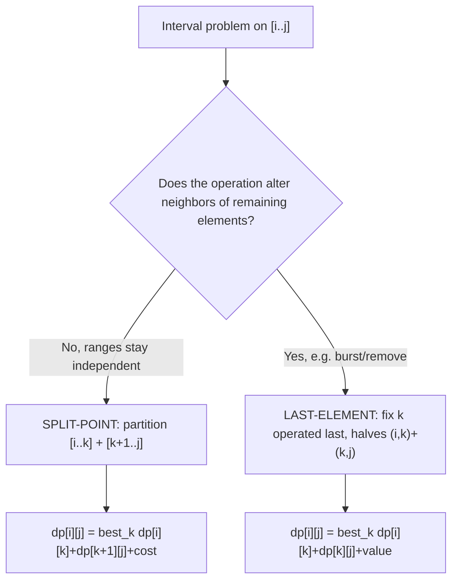

# Interval DP (DP over Ranges `[i..j]`) — Middle Level

> **Focus:** Why increasing-length iteration is the right fill order, the **split-point vs last-operated-element** framing that distinguishes the two halves of the interval-DP family, a tour of the classic problems (matrix chain, optimal BST, stone merging, palindrome partitioning, removing boxes), and concrete pointers to where Knuth's optimization (`11`) and the divide-and-conquer optimization (`12`) collapse the `O(n³)` baseline.

---

## Table of Contents

1. [Introduction](#introduction)
2. [Deeper Concepts](#deeper-concepts)
3. [Split-Point vs Last-Operated-Element](#split-point-vs-last-operated-element)
4. [The Classic Problems](#the-classic-problems)
5. [Comparison with Alternatives](#comparison-with-alternatives)
6. [Advanced Patterns](#advanced-patterns)
7. [Code Examples](#code-examples)
8. [Pointers to Knuth and D&C Optimization](#pointers-to-knuth-and-dc-optimization)
9. [Error Handling](#error-handling)
10. [Performance Analysis](#performance-analysis)
11. [Best Practices](#best-practices)
12. [Visual Animation](#visual-animation)
13. [Summary](#summary)

---

## Introduction

At junior level the message was a single template: `dp[i][j] = best over k of dp[i][k] + dp[k+1][j] + cost`, filled by increasing length. At middle level you start asking the questions that decide whether an interval DP is *correct*, *efficient*, and *the right model at all*:

- Why is increasing-length iteration valid, and what exactly does each cell depend on?
- When should the split point mean "the outermost operation" versus "the last element operated on"? They are not interchangeable.
- The classic problems look different (matrices, search trees, balloons, palindromes, boxes) — what is the shared skeleton, and where do they diverge?
- The baseline is `O(n³)`. When can I get `O(n²)`? What property must the cost function have?
- When is interval DP the *wrong* tool — when should I reach for linear DP, bitmask DP, or a greedy/heap approach instead?

These are the questions that separate "I can code matrix chain from memory" from "I can recognize an interval DP in a problem I've never seen and pick the right framing."

---

## Deeper Concepts

### The dependency structure, restated

Let `dp[i][j]` be the optimal answer for range `[i..j]`. Every interval-DP transition reads sub-ranges that are **strictly shorter**:

```
dp[i][j] depends on dp[i][k] and dp[k+1][j]   (or dp[i][k], dp[k][j])
where both have length < (j - i + 1).
```

This is a partial order on intervals: a longer interval depends only on shorter ones. Any topological order of that partial order is a valid fill order, and **increasing interval length** is the simplest such order — by the time we reach length `L`, all lengths `< L` are done. (Two other valid orders: iterate `i` from `n-1` down to `0` and `j` from `i` up to `n-1`; or memoized recursion, which respects the order automatically.)

### Why not iterate `i` then `j` directly?

A naive `for i: for j:` (both increasing) computes `dp[i][j]` while `dp[k+1][j]` for `k+1 > i` is **not yet computed** (it's in a later `i` iteration). That reads garbage. The fix is either increasing-length order or descending-`i` order. This single ordering subtlety is the most common correctness bug in interval DP.

### The cost term carries the problem's identity

The skeleton is generic; `cost(i, k, j)` is where each problem lives:

| Problem | `cost(i, k, j)` | depends on `k`? |
|---------|-----------------|-----------------|
| Matrix chain | `r_i · r_{k+1} · r_{j+1}` | yes (via the shared dimension) |
| Stone merging | `sum(stones[i..j])` | no (same for every split) |
| Optimal BST | `freqSum(i..j)` | no |
| Burst balloons | `a_i · a_k · a_j` | yes (the last balloon's value) |
| Palindrome partition | `0` if `s[i..j]` palindrome, else split | special |

When the cost does **not** depend on `k` (stone merging, optimal BST), the recurrence is `dp[i][j] = constant(i,j) + min_k (dp[i][k] + dp[k+1][j])` — and this *constant-plus-decomposable* shape is exactly the structure Knuth's optimization exploits.

### Optimal substructure for intervals

Interval DP is correct because of **optimal substructure**: an optimal solution to `[i..j]` contains optimal solutions to the sub-ranges it splits into. The proof is a cut-and-paste argument: if the left part `[i..k]` were solved sub-optimally, you could replace it with the optimal left solution and lower the total, contradicting optimality of the whole. The professional file proves this rigorously; the practical takeaway is that the recurrence is *valid* only when this cut-and-paste works — which it does for all the classic problems but can fail if the cost of joining depends on *how* a sub-range was solved internally (a sign you need an extra state dimension, as in removing boxes).

---

## Split-Point vs Last-Operated-Element

This is the central middle-level distinction. Both produce a 2D interval DP, but they differ in what the index `k` means and which sub-ranges you read.

### Split-point framing

*"The optimal solution has an outermost operation that divides `[i..j]` into `[i..k]` and `[k+1..j]`."*

```
dp[i][j] = best over k in [i, j-1] of ( dp[i][k] + dp[k+1][j] + cost(i, k, j) )
```

The two halves are **adjacent, non-overlapping, and partition the range**. Used when the operation that combines sub-ranges does not change the elements inside them — matrix chain (the outermost `×`), stone merging (the final merge of two piles), optimal BST (the root splits keys into left/right subtrees), palindrome partition (the last cut).

### Last-operated-element framing

*"Some element `k` inside `[i..j]` is operated on last; by the time we touch it, everything else in the range is gone, so its neighbors are the range boundaries."*

```
dp[i][j] = best over k in (i, j) of ( dp[i][k] + dp[k][j] + value(i, k, j) )
```

Here the two halves **share the boundary index `k`** and the range is treated as *open* `(i, j)`. Used when an operation changes the neighbors of remaining elements — **burst balloons** (bursting changes who is adjacent) and **removing boxes** (removing a box merges its neighbors). Fixing the *last* operation is the trick: the last balloon burst in `(i, j)` has neighbors exactly `i` and `j`, because everything strictly between has already been burst.

### Why you cannot swap them

If you try a naive split-point recurrence on burst balloons — "burst something first, then solve the two halves" — the two halves are **not independent**, because bursting in the left half changes the right half's neighbors. The last-element framing restores independence: once you commit `k` to be burst *last*, the left interior `(i, k)` and right interior `(k, j)` are burst entirely before `k`, never interacting across `k`. Choosing first vs last is not cosmetic; only one makes the subproblems independent.



---

## The Classic Problems

### 1. Matrix Chain Multiplication (split-point)

`dp[i][j]` = min scalar multiplications for `M_i … M_j`. Split at the outermost product:

```
dp[i][j] = min_{k=i}^{j-1} dp[i][k] + dp[k+1][j] + dims[i]·dims[k+1]·dims[j+1]
```

Base `dp[i][i] = 0`. Answer `dp[0][n-1]`. The textbook interval DP; satisfies the quadrangle inequality, so Knuth's optimization applies (`O(n²)`).

### 2. Optimal Binary Search Tree (split-point, root = k)

Given sorted keys with access frequencies `freq[i..j]`, build a BST minimizing expected search cost. Choosing key `k` as the root of the range:

```
dp[i][j] = min_{k=i}^{j} dp[i][k-1] + dp[k+1][j] + freqSum(i..j)
```

The `freqSum(i..j)` term appears because making `k` the root pushes every key in `[i..j]` one level deeper, adding one access-frequency unit per key. Base `dp[i][i-1] = 0` (empty). This is the canonical Knuth-optimization problem (Knuth's original 1971 result), `O(n²)`.

### 3. Stone Merging / Stone Game (split-point)

`n` piles in a row; merging two adjacent piles costs their combined weight; merge all into one minimizing total cost:

```
dp[i][j] = min_{k=i}^{j-1} dp[i][k] + dp[k+1][j] + sum(stones[i..j])
```

The merge cost `sum(i..j)` is the same for every split, so it factors out of the min — exactly the constant-cost structure Knuth exploits. (The adversarial two-player "stone game" variant uses a similar interval DP with max-of-min over the two players' choices.)

### 4. Palindrome Partitioning (min cuts)

Partition string `s` into palindromic substrings with the fewest cuts. One interval-DP formulation: `pal[i][j]` = whether `s[i..j]` is a palindrome (itself an interval DP filled by length), then a linear DP `cuts[j] = min over i of cuts[i-1] + 1` when `s[i..j]` is a palindrome. The palindrome table is the interval-DP core:

```
pal[i][j] = (s[i] == s[j]) and (j - i < 2 or pal[i+1][j-1])
```

### 5. Removing Boxes (interval DP with a third dimension)

Boxes in a row; remove a maximal contiguous block of `c` same-colored boxes for `c²` points; maximize score. A plain 2D interval DP fails because the value of removing a block depends on how many same-colored boxes were *attached* from outside. The fix is a **third state dimension** `dp[i][j][carry]` = best score for `[i..j]` with `carry` extra boxes of color `box[i]` glued to the left of `i`. This is `O(n⁴)` — a reminder that some interval problems need an augmented state.

```
dp[i][j][c] = max(
    dp[i+1][j][0] + (c+1)²,                          # remove box i with its carry now
    max over m in (i, j] with box[m]==box[i] of
        dp[i+1][m-1][0] + dp[m][j][c+1]              # save box i to merge with box m later
)
```

---

## Comparison with Alternatives

### Interval DP vs linear (1D) DP

| Aspect | Linear DP | Interval DP |
|--------|-----------|-------------|
| State | a single index / prefix | a contiguous range `[i..j]` |
| State count | `O(n)` | `O(n²)` |
| When | the answer for prefix `[0..j]` extends by one element | the answer for a range is built from sub-ranges that split it |
| Examples | longest increasing subsequence, coin change | matrix chain, optimal BST, burst balloons |

If your subproblem can be described by **one** endpoint (a prefix or suffix), use linear DP. If it genuinely needs **both** endpoints of a contiguous range, it's interval DP.

### Interval DP vs bitmask / subset DP

Interval DP requires the subproblems to be **contiguous ranges**. If the natural subproblem is an *arbitrary subset* of elements (e.g., traveling salesman over visited sets), no `O(n²)` interval table suffices — you need `O(2ⁿ)` subset states. Recognizing "is this contiguous or arbitrary-subset?" decides which DP family you're in.

### Interval DP vs greedy / heap

Some superficially similar problems are actually greedy. The classic trap: "merge `n` piles, cost = combined weight, minimize total" sounds like stone merging, but if you may merge **any two piles** (not just adjacent), it's the Huffman problem and a greedy heap solves it in `O(n log n)`. The adjacency constraint is what forces interval DP. Always check: must the merged pieces be *adjacent*? If yes → interval DP; if any-two → greedy/Huffman.

| Problem | Constraint | Right tool | Cost |
|---------|-----------|-----------|------|
| Merge adjacent piles, min cost | adjacency required | interval DP | `O(n³)` / `O(n²)` Knuth |
| Merge any two piles, min cost | no adjacency | Huffman greedy (heap) | `O(n log n)` |
| Optimal BST | sorted-order required | interval DP (Knuth) | `O(n²)` |

---

## Advanced Patterns

### Pattern: Reconstructing the optimal choice

Store the winning split in a parallel table, then walk it.

```python
def matrix_chain_with_parens(dims):
    n = len(dims) - 1
    dp = [[0] * n for _ in range(n)]
    split = [[0] * n for _ in range(n)]
    for length in range(2, n + 1):
        for i in range(n - length + 1):
            j = i + length - 1
            dp[i][j] = float("inf")
            for k in range(i, j):
                c = dp[i][k] + dp[k + 1][j] + dims[i] * dims[k + 1] * dims[j + 1]
                if c < dp[i][j]:
                    dp[i][j] = c
                    split[i][j] = k

    def build(i, j):
        if i == j:
            return f"M{i}"
        k = split[i][j]
        return f"({build(i, k)} {build(k + 1, j)})"

    return dp[0][n - 1], build(0, n - 1)
```

### Pattern: Open-range vs closed-range bookkeeping

For last-element problems, padding sentinels and using the *open* interval `(i, j)` keeps the boundary arithmetic clean (burst balloons pads with `1`s). For split-point problems, the closed interval `[i..j]` with `k ∈ [i, j-1]` is natural. Pick one convention per problem and write it in a comment.

### Pattern: Range-cost via prefix sums

Any `sum(i..j)` cost should be `O(1)`:

```go
// prefix[t] = sum of first t elements; sum(i..j) = prefix[j+1]-prefix[i]
func buildPrefix(w []int) []int {
    p := make([]int, len(w)+1)
    for i, x := range w {
        p[i+1] = p[i] + x
    }
    return p
}
```

---

## Code Examples

### Stone merging (min cost to merge adjacent piles), all three languages

#### Go

```go
package main

import "fmt"

func mergeStones(stones []int) int {
	n := len(stones)
	if n <= 1 {
		return 0
	}
	prefix := make([]int, n+1)
	for i, x := range stones {
		prefix[i+1] = prefix[i] + x
	}
	rangeSum := func(i, j int) int { return prefix[j+1] - prefix[i] }
	dp := make([][]int, n)
	for i := range dp {
		dp[i] = make([]int, n)
	}
	for length := 2; length <= n; length++ {
		for i := 0; i+length-1 < n; i++ {
			j := i + length - 1
			dp[i][j] = 1 << 62
			for k := i; k < j; k++ {
				c := dp[i][k] + dp[k+1][j] + rangeSum(i, j)
				if c < dp[i][j] {
					dp[i][j] = c
				}
			}
		}
	}
	return dp[0][n-1]
}

func main() {
	fmt.Println("min merge cost:", mergeStones([]int{4, 1, 1, 4})) // 18
}
```

#### Java

```java
public class MergeStones {
    static int mergeStones(int[] stones) {
        int n = stones.length;
        if (n <= 1) return 0;
        int[] prefix = new int[n + 1];
        for (int i = 0; i < n; i++) prefix[i + 1] = prefix[i] + stones[i];
        int[][] dp = new int[n][n];
        for (int length = 2; length <= n; length++) {
            for (int i = 0; i + length - 1 < n; i++) {
                int j = i + length - 1;
                dp[i][j] = Integer.MAX_VALUE;
                int rs = prefix[j + 1] - prefix[i];
                for (int k = i; k < j; k++) {
                    int c = dp[i][k] + dp[k + 1][j] + rs;
                    if (c < dp[i][j]) dp[i][j] = c;
                }
            }
        }
        return dp[0][n - 1];
    }

    public static void main(String[] args) {
        System.out.println("min merge cost: " + mergeStones(new int[]{4, 1, 1, 4})); // 18
    }
}
```

#### Python

```python
def merge_stones(stones):
    n = len(stones)
    if n <= 1:
        return 0
    prefix = [0]
    for x in stones:
        prefix.append(prefix[-1] + x)
    rng = lambda i, j: prefix[j + 1] - prefix[i]
    dp = [[0] * n for _ in range(n)]
    for length in range(2, n + 1):
        for i in range(n - length + 1):
            j = i + length - 1
            dp[i][j] = float("inf")
            rs = rng(i, j)
            for k in range(i, j):
                c = dp[i][k] + dp[k + 1][j] + rs
                if c < dp[i][j]:
                    dp[i][j] = c
    return dp[0][n - 1]


if __name__ == "__main__":
    print("min merge cost:", merge_stones([4, 1, 1, 4]))  # 18
```

### Optimal BST (split-point with root = k), Python (concise reference)

```python
def optimal_bst(freq):
    n = len(freq)
    prefix = [0]
    for f in freq:
        prefix.append(prefix[-1] + f)
    fsum = lambda i, j: prefix[j + 1] - prefix[i]
    # dp[i][j] = min expected cost for keys i..j; use 1-indexed-ish bounds
    INF = float("inf")
    dp = [[0] * (n + 1) for _ in range(n + 1)]
    for length in range(1, n + 1):
        for i in range(0, n - length + 1):
            j = i + length - 1
            dp[i][j] = INF
            base = fsum(i, j)
            for k in range(i, j + 1):
                left = dp[i][k - 1] if k > i else 0
                right = dp[k + 1][j] if k < j else 0
                cost = left + right + base
                if cost < dp[i][j]:
                    dp[i][j] = cost
    return dp[0][n - 1]


if __name__ == "__main__":
    print(optimal_bst([34, 8, 50]))  # classic CLRS-style example
```

---

## Pointers to Knuth and D&C Optimization

The `O(n³)` interval DP can sometimes be reduced. Two siblings cover this in depth; here is what triggers each.

### Knuth's optimization → `O(n²)` (sibling `11-knuth-optimization`)

Applies to split-point DPs of the form `dp[i][j] = min_k (dp[i][k] + dp[k+1][j]) + cost(i, j)` where `cost(i, j)` depends only on the endpoints (not on `k`) and satisfies the **quadrangle inequality (QI)**:

```
cost(a, c) + cost(b, d) ≤ cost(a, d) + cost(b, c)   for a ≤ b ≤ c ≤ d
```

When QI holds, the optimal split `opt[i][j]` is **monotone**: `opt[i][j-1] ≤ opt[i][j] ≤ opt[i+1][j]`. Restricting the `k` loop to that narrow window makes the *total* work telescope to `O(n²)`. **Matrix chain, optimal BST, and stone merging all satisfy QI** — they are the standard Knuth-optimization examples. The professional file states and motivates QI precisely.

### Divide-and-conquer optimization → `O(n² log n)` (sibling `12-divide-and-conquer-optimization`)

Applies when the DP has the *layered* form `dp[t][j] = min_i (dp[t-1][i] + cost(i, j))` (a fixed number of layers/partitions) and the optimal `i` is monotone in `j` (`opt(j) ≤ opt(j+1)`). It solves each layer by recursively bounding the search range, giving `O(n log n)` per layer. This is a sibling of interval DP rather than interval DP itself — it shines on "partition into exactly `m` groups" problems — but the monotone-optimal-split insight is the same family of idea.

**The key shared insight:** both optimizations exploit **monotonicity of the optimal split point**. The baseline tries all `O(n)` splits per cell; if you can prove the best split only moves rightward as the interval grows, you can skip most of them. Whether you get `O(n²)` (Knuth) or `O(n² log n)` (D&C) depends on the exact DP shape and which monotonicity you can establish.

---

## Error Handling

| Scenario | What goes wrong | Correct approach |
|----------|-----------------|------------------|
| Filled by `i,j` row order | Reads uncomputed `dp[k+1][j]` | Iterate by increasing length (or descending `i`). |
| Split-point on a burst/remove problem | Wrong answer (subproblems not independent) | Use last-element framing. |
| `cost(i,j)` recomputed in `k` loop | `O(n⁴)` instead of `O(n³)` | Hoist range-sum out of the `k` loop; use prefix sums. |
| Knuth window applied without QI | Wrong (skips the true optimum) | Verify QI / monotonicity before restricting the `k` range. |
| Removing boxes with 2D state | Wrong (ignores attached same-color boxes) | Add the `carry` third dimension. |
| Min loop without `+∞` init | Always returns 0 | Initialize `dp[i][j]` to the correct extreme. |

---

## Performance Analysis

| `n` | States `O(n²)` | Baseline ops `O(n³)` | Knuth `O(n²)` |
|-----|---------------|----------------------|----------------|
| 50 | 2 500 | 125 000 | 2 500 |
| 100 | 10 000 | 1 000 000 | 10 000 |
| 300 | 90 000 | 27 000 000 | 90 000 |
| 500 | 250 000 | 125 000 000 | 250 000 |
| 1000 | 1 000 000 | 1 000 000 000 | 1 000 000 |

The baseline `O(n³)` is comfortable to `n ≈ 500`, marginal near `n ≈ 1000`. When QI holds, Knuth's optimization makes `n` in the low thousands trivial. The dominant baseline cost is the inner `k` loop; the single biggest *constant-factor* win is hoisting the range-sum cost out of that loop (prefix sums) and using a flat array for cache locality. The `O(n⁴)` removing-boxes variant is only feasible for `n ≈ 100`.

```python
import time

def bench(n):
    dims = [10] * (n + 1)
    start = time.perf_counter()
    # ... run matrix_chain(dims) ...
    return time.perf_counter() - start
# Typical: n=300 baseline runs in well under a second in CPython; n=1000 is seconds.
```

---

## Best Practices

- **State your `dp[i][j]` meaning in one sentence** before coding; it forces the split-vs-last-element decision.
- **Always fill by increasing length** (the safe topological order).
- **Hoist range-sum costs** out of the inner loop with prefix sums.
- **Use the open-interval `(i, j)` convention with sentinel padding** for last-element problems; closed `[i..j]` for split problems.
- **Prove the monotonicity / QI condition** before applying Knuth or D&C — never assume it.
- **Keep a brute-force oracle** (all parenthesizations) for `n ≤ 8` and diff against the DP.
- **Add a `split[i][j]` table only when reconstruction is required.**
- **Watch for the greedy trap** — if merges need not be adjacent, it's Huffman, not interval DP.

---

## Worked Comparison: Two Framings on the Same Skeleton

To cement split-point vs last-element, here is the *same* `dp` table mechanics applied to both, side by side.

**Matrix chain (split-point), `dims=[10,30,5,60]`:**

```
dp[0][1] = 10·30·5 = 1500          (split k=0)
dp[1][2] = 30·5·60 = 9000          (split k=1)
dp[0][2] = min( dp[0][0]+dp[1][2]+10·30·60,    # k=0 -> 27000
                dp[0][1]+dp[2][2]+10·5·60 )    # k=1 -> 4500
         = 4500
```

**Burst balloons (last-element), `nums=[3,1,5,8]`, padded `a=[1,3,1,5,8,1]`:**

```
dp[i][i+1] = 0                      (no interior)
dp[0][2] = a[0]·a[1]·a[2] = 1·3·1 = 3      (k=1 last)
dp[1][3] = a[1]·a[2]·a[3] = 3·1·5 = 15     (k=2 last)
...
dp[0][5] = max over last-burst k of dp[0][k]+dp[k][5]+a[0]·a[k]·a[5]
         = 167
```

Notice the structural echo: both fill by increasing length, both take an extremum over `k`, both read two sub-cells plus a cost. The only differences are (a) split reads `dp[i][k]` and `dp[k+1][j]` (disjoint halves) while last-element reads `dp[i][k]` and `dp[k][j]` (sharing `k`), and (b) the cost term's meaning. Internalize this parallel and you can switch framings fluidly.

## Recognizing Interval DP in the Wild

A middle-level skill is spotting that an unfamiliar problem is interval DP. Tell-tale signals:

- The input is a **linear sequence** (array, string, row of items).
- The answer asks for an **optimal order / grouping / partition** of contiguous pieces.
- You can describe the answer for a range in terms of **smaller contiguous ranges**.
- A greedy choice provably fails (try a small counterexample), but trying all splits works.

Quick triage questions:

| Ask | If yes → |
|-----|----------|
| "Does the operation combine *adjacent* pieces?" | interval DP (else maybe greedy/Huffman) |
| "Does an operation change neighbors of survivors?" | last-element framing |
| "Is the subproblem a prefix (one endpoint)?" | linear DP, not interval |
| "Is the subproblem an arbitrary subset?" | bitmask DP, not interval |
| "Does the join cost need info from outside `[i..j]`?" | add a state dimension |

### A worked recognition example

*"Given a row of numbers, repeatedly replace two adjacent numbers `a, b` with `a+b` at a cost of `a·b`, until one number remains; minimize total cost."* Recognition: adjacent combination (interval DP), the cost of the final combine depends on the two sub-sums (not on `k` alone, but computable from prefix sums), and the answer for a range builds from sub-ranges. Set `dp[i][j] = min_k dp[i][k] + dp[k+1][j] + sum(i..k)·sum(k+1..j)`. This is interval DP with a product-of-halves cost — a small twist on stone merging, found by the triage above.

## Counting Variants and Non-Optimization Objectives

Interval DP is not only for min/max. The same `[i..j]` state with split transitions counts structures:

- **Number of BSTs** on `n` keys: `count[i][j] = Σ_k count[i][k-1]·count[k+1][j]` — the Catalan recurrence, an interval DP with `+`/`×` instead of min.
- **Number of triangulations** of a polygon: identical Catalan shape.
- **Number of ways to parenthesize** to reach a target (boolean parenthesization): `dp[i][j]` carries counts of true/false outcomes, split over the operator at `k`.

The skeleton (state = interval, transition = split, fill by length) is unchanged; only the combine operator differs (sum-of-products for counting vs min/max for optimization). Recognizing this lets you reuse the template for "how many ways" questions, not just "what is the best."

## Visual Animation

> See [`animation.html`](./animation.html) for an interactive view.
>
> The middle-level animation highlights:
> - The `dp` table filling **diagonal by diagonal** (increasing interval length).
> - For the current cell, each candidate split `k` flashing, with the two halves `dp[i][k]` and `dp[k+1][j]` lit, and the chosen optimum boxed.
> - A graph/sequence view connecting the abstract table cell back to the concrete matrices or balloons being combined.

---

## Summary

Interval DP fills a 2D table `dp[i][j]` over contiguous ranges, and the only valid fill order is one that respects "longer depends on shorter" — **increasing interval length** being the canonical choice. The family splits into two framings: **split-point** (matrix chain, optimal BST, stone merging, palindrome partition), where an outermost operation partitions the range into `[i..k]` and `[k+1..j]`; and **last-operated-element** (burst balloons, removing boxes), where fixing the *last* element keeps its neighbors at the stable boundaries and restores subproblem independence. Choosing the right framing is a correctness issue, not a style choice. The baseline is `O(n³)` — `O(n²)` intervals times `O(n)` splits — reducible to `O(n²)` via Knuth's optimization when the cost satisfies the quadrangle inequality (sibling `11`), or to `O(n² log n)` via the divide-and-conquer optimization for layered partition DPs (sibling `12`), both powered by monotonicity of the optimal split. Know the template, the two framings, the classic problems, and the conditions that unlock the optimizations, and you can model and solve essentially any "what order to combine a sequence" problem.
