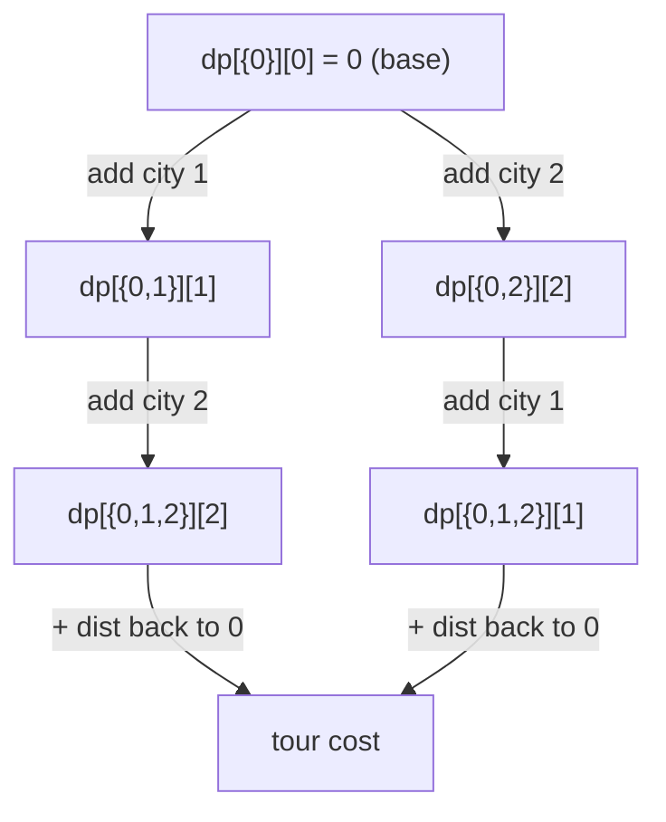

# Bitmask DP (DP over Subsets) — Junior Level

> **One-line summary:** Represent a *subset* of `n` items as the bits of an integer (`0` to `2^n − 1`), and let `dp[mask]` be the best answer for the set of items in `mask`. Many "visit every item once / cover every requirement" problems then become a clean dynamic program. The headline example is **Held-Karp** for the Travelling Salesman Problem: `dp[mask][last]` = cheapest way to visit exactly the cities in `mask`, ending at city `last`, solved in `O(2^n · n^2)`.

---

## Table of Contents

1. [Introduction](#introduction)
2. [Prerequisites](#prerequisites)
3. [Glossary](#glossary)
4. [Core Concepts](#core-concepts)
5. [Big-O Summary](#big-o-summary)
6. [Real-World Analogies](#real-world-analogies)
7. [Pros & Cons](#pros--cons)
8. [Step-by-Step Walkthrough](#step-by-step-walkthrough)
9. [Code Examples](#code-examples)
10. [Coding Patterns](#coding-patterns)
11. [Error Handling](#error-handling)
12. [Performance Tips](#performance-tips)
13. [Best Practices](#best-practices)
14. [Edge Cases & Pitfalls](#edge-cases--pitfalls)
15. [Common Mistakes](#common-mistakes)
16. [Cheat Sheet](#cheat-sheet)
17. [Visual Animation](#visual-animation)
18. [Summary](#summary)
19. [Further Reading](#further-reading)

---

## Introduction

Suppose a salesperson must start in city `0`, visit *every* one of `n` cities exactly once, and return home — at minimum total travel cost. This is the famous **Travelling Salesman Problem (TSP)**. The brute-force answer is to try every ordering of the cities: there are `(n−1)!` tours, which explodes past any hope of computation by `n ≈ 13`.

There is a much better way for small `n`, and it rests on one beautiful idea:

> **A subset of `n` items can be stored as a single integer, using one bit per item.**

If bit `i` of an integer `mask` is `1`, item `i` is "in the set"; if it is `0`, item `i` is "out". With `n` items there are exactly `2^n` possible subsets, indexed by the integers `0, 1, …, 2^n − 1`. This compact encoding lets us use a subset as an **array index**, and that unlocks dynamic programming over subsets — usually called **bitmask DP**.

For TSP the state becomes `dp[mask][last]`: the minimum cost of a path that starts at city `0`, has visited *exactly* the set of cities in `mask`, and currently sits at city `last` (which must be inside `mask`). We build these answers up from small subsets to large ones. The final answer adds the cost of returning home from the last city of the full set. This is the **Held-Karp algorithm**, and it runs in `O(2^n · n^2)` time — slow-looking, but a colossal improvement over `(n−1)!`. For `n = 15` it is the difference between ~`10^11` and ~`7 million` basic operations.

The same "subset as integer" technique solves a whole family of problems: assignment of jobs to workers, counting Hamiltonian paths, partitioning items into balanced groups, set-cover style optimisation, and more. They all share the move "from the answer for a smaller subset, extend by one item to a larger subset." Throughout this junior file the **running example is Held-Karp TSP**, and the related problems are introduced at the middle and interview levels.

One promise to make at the very start: bitmask DP is only feasible when `n` is small — typically `n ≤ 20` or so — because the table has `2^n` entries. At `n = 20` that is about a million masks; at `n = 30` it is a *billion*, which no longer fits in memory. Knowing this `2^n` wall is half of using the technique well.

---

## Prerequisites

Before reading this file you should be comfortable with:

- **Binary representation of integers** — how `13` is `1101` in binary, and that bit `i` has place value `2^i`.
- **Bitwise operators** — AND (`&`), OR (`|`), XOR (`^`), NOT (`~`), left shift (`<<`), right shift (`>>`).
- **Arrays / 2D arrays** — `dp` will be a 1D or 2D table indexed by an integer mask.
- **Basic dynamic programming** — the idea of an "optimal substructure": the best answer for a big case is built from best answers of smaller cases.
- **Big-O notation** — especially `O(2^n)`, `O(2^n · n)`, `O(2^n · n^2)`.

Optional but helpful:

- A glance at **factorial growth** vs **exponential growth**, so you can feel why `2^n · n^2` beats `n!`.
- Familiarity with **adjacency / distance matrices** (`dist[i][j]` = cost from city `i` to city `j`).

---

## Glossary

| Term | Meaning |
|------|---------|
| **Bitmask** | An integer whose bits each flag one item as present (`1`) or absent (`0`). |
| **Subset / mask** | The set of items whose bits are `1` in a given bitmask. We use "mask" and "subset" interchangeably. |
| **`dp[mask]` / `dp[mask][last]`** | The DP table indexed by a subset (and possibly a second coordinate like the last-visited item). |
| **Set bit** | A bit equal to `1`. The number of set bits is the **popcount** (population count). |
| **`popcount(mask)`** | How many `1` bits `mask` has — i.e. how many items are in the subset. |
| **`lowbit(mask)`** | The lowest set bit, isolated: `mask & (-mask)`. Useful to peel off one element. |
| **Full mask** | `(1 << n) − 1`, the integer with all `n` low bits set — the subset containing every item. |
| **Submask** | A subset of the items already in `mask` (its bits are a subset of `mask`'s bits). |
| **Held-Karp** | The `O(2^n · n^2)` bitmask DP for TSP / shortest Hamiltonian path. |
| **Hamiltonian path** | A path visiting every vertex exactly once. |
| **Assignment problem** | Match `n` workers to `n` jobs one-to-one at minimum total cost. |

---

## Core Concepts

### 1. A Subset Is Just an Integer

With `n` items, label them `0, 1, …, n−1`. The subset `{0, 2, 3}` becomes the binary number with bits `0`, `2`, and `3` set:

```
bit index:  3 2 1 0
value:      1 1 0 1   = 8 + 4 + 0 + 1 = 13
```

So `{0, 2, 3}` is the integer `13`. Every subset of `n` items corresponds to exactly one integer in `[0, 2^n)`, and vice versa. That bijection is the whole foundation: we can use a subset as an array index.

### 2. The Essential Bit Operations

These are the verbs of bitmask DP. Memorise them:

```
is item i in mask?        (mask >> i) & 1 == 1          or   mask & (1 << i)
add item i to mask         mask | (1 << i)
remove item i from mask    mask & ~(1 << i)
toggle item i              mask ^ (1 << i)
full set of n items        (1 << n) - 1
empty set                  0
lowest set bit (isolated)  mask & (-mask)
count set bits             popcount(mask)
```

A single `1 << i` builds a mask with only bit `i` set; combining it with `|`, `&`, `^` lets you add, test, or flip individual items in constant time.

### 3. `dp[mask]` — DP Indexed by Subset

The core move of bitmask DP is to let the state be a subset. For TSP we need a little more than the subset alone: we also need to know *where we currently are*, because the cost of the next step depends on the current city. So the state is two-dimensional:

```
dp[mask][last] = minimum cost of a path that
                 starts at city 0,
                 visits exactly the cities in `mask`,
                 and ends at city `last`     (with bit `last` set in `mask`).
```

### 4. The Held-Karp Recurrence

To reach `dp[mask][last]`, the path must have arrived at `last` from some previous city `prev` that was already visited. Removing `last` from the mask gives the earlier state:

```
dp[mask][last] = min over prev in (mask without last) of
                   dp[mask without last][prev] + dist[prev][last]
```

We process masks in increasing numeric order. Because removing a bit always yields a *smaller* integer, every state we need on the right-hand side is computed before the state on the left — the dependencies always point "downward." That ordering correctness is what makes the simple `for mask := 0; mask < (1<<n); mask++` loop valid.

### 5. Base Case and Final Answer

**Base case:** the path starts at city `0`, so the only visited city is `0` itself:

```
dp[1 << 0][0] = 0        // mask = {0}, ending at 0, cost 0
all other dp = +infinity
```

**Final answer (a full tour):** after visiting *all* cities (`mask = (1<<n) − 1`), add the cost of returning to city `0`:

```
answer = min over last of  dp[fullMask][last] + dist[last][0]
```

If instead you want just the shortest Hamiltonian *path* (no return), the answer is `min over last of dp[fullMask][last]` — no return edge added.

### 6. Why `O(2^n · n^2)`

There are `2^n` masks. For each mask we consider each possible `last` (up to `n` choices), and for each `last` we look at each possible `prev` (up to `n` choices). That is `2^n · n · n = 2^n · n^2` work. Memory is `O(2^n · n)` for the table. This is exponential, but it tames the `(n−1)!` brute force into something usable up to `n ≈ 18–20`.

---

## Big-O Summary

| Operation / problem | Time | Space | Notes |
|---------------------|------|-------|-------|
| Test / set / clear one bit | **O(1)** | — | Single bitwise op. |
| `popcount(mask)` | O(1) | — | Hardware instruction or library call. |
| Iterate all subsets of `n` items | O(2^n) | — | `for mask in 0..2^n−1`. |
| Held-Karp TSP (this file) | **O(2^n · n^2)** | O(2^n · n) | The running example. |
| Shortest Hamiltonian path | O(2^n · n^2) | O(2^n · n) | Same DP, drop the return edge. |
| Count Hamiltonian paths | O(2^n · n^2) | O(2^n · n) | Sum instead of min. |
| Assignment / min-cost matching | O(2^n · n) | O(2^n) | `dp[mask]`, one dimension. |
| Iterate all submasks of every mask | O(3^n) | — | The submask trick (see middle). |
| Brute-force TSP (for contrast) | O(n!) | O(n) | Hopeless past `n ≈ 12`. |

The headline number is **`O(2^n · n^2)`** for Held-Karp — exponential, but the practical ceiling is roughly `n ≤ 20` because of the `2^n` factor in both time and memory.

---

## Real-World Analogies

| Concept | Analogy |
|---------|---------|
| Bitmask | A row of `n` light switches; the on/off pattern *is* the integer. |
| `mask & (1 << i)` | Checking whether switch `i` is currently on. |
| `mask | (1 << i)` | Flipping switch `i` on. |
| `dp[mask][last]` | A logbook: "given exactly these cities visited and standing here, what's the cheapest route so far?" |
| Building masks in order | Filling the logbook from short trips to long trips; a long trip's cost reuses a shorter trip's recorded cost. |
| The full mask | Every switch on / every city visited — the finished tour. |
| `2^n` memory wall | You can label `2^20 ≈ 10^6` logbook pages, but `2^30 ≈ 10^9` pages won't fit on any desk. |

Where the analogy breaks: light switches are independent, but TSP states are linked by transitions (the `dist` costs), which is exactly what the DP recurrence captures.

---

## Pros & Cons

| Pros | Cons |
|------|------|
| Turns `O(n!)` brute force into `O(2^n · n^2)` — feasible for `n ≤ ~20`. | Still exponential; the `2^n` factor caps `n` hard (memory and time). |
| The subset-as-integer encoding is compact and cache-friendly. | Bit manipulation bugs (off-by-one in shifts, wrong operator) are easy to make and subtle. |
| One framework solves many problems: TSP, assignment, counting paths, partitioning, set cover. | Designing the right state can be tricky; a too-large state blows up `2^n`. |
| Iteration order is trivially correct (masks increase, dependencies decrease). | Memory `O(2^n · n)` becomes the bottleneck before time does. |
| Constant-time set operations (membership, union, intersection via `&`, `|`). | Not applicable to large `n`; for big instances you need heuristics or approximation. |

**When to use:** small `n` (up to ~20), a problem that asks about *which subset* of items is chosen/visited/covered, especially "visit each exactly once" (Hamiltonian) or "assign one-to-one" or "partition into groups."

**When NOT to use:** large `n` (the `2^n` kills you), problems where order matters in a way that needs more than a subset + a small extra coordinate, or where a polynomial algorithm already exists (e.g. min-cost matching on large `n` uses the Hungarian algorithm instead).

---

## Step-by-Step Walkthrough

Take a tiny TSP on `n = 3` cities with this symmetric distance matrix:

```
        to: 0    1    2
from 0 [    0   10   15 ]
from 1 [   10    0   20 ]
from 2 [   15   20    0 ]
```

We start and end at city `0`. There are only `(3−1)! = 2` tours: `0→1→2→0` (cost `10+20+15 = 45`) and `0→2→1→0` (cost `15+20+10 = 45`). Both cost `45`. Let us watch Held-Karp arrive at the same answer.

**Base case.** Only city `0` visited, sitting at `0`:

```
dp[ {0} ][0] = dp[001][0] = 0
```

All other entries start at `+infinity` (∞).

**Masks with 2 cities.** Extend from `{0}` by adding one more city.

```
dp[{0,1}][1] = dp[{0}][0] + dist[0][1] = 0 + 10 = 10    // mask 011, last 1
dp[{0,2}][2] = dp[{0}][0] + dist[0][2] = 0 + 15 = 15    // mask 101, last 2
```

**Masks with all 3 cities** (`mask = {0,1,2} = 111`). We can end at `1` or `2`.

```
End at 1, came from 2:
  dp[{0,1,2}][1] = dp[{0,2}][2] + dist[2][1] = 15 + 20 = 35

End at 2, came from 1:
  dp[{0,1,2}][2] = dp[{0,1}][1] + dist[1][2] = 10 + 20 = 30
```

**Close the tour** by returning to `0`:

```
via last=1:  dp[111][1] + dist[1][0] = 35 + 10 = 45
via last=2:  dp[111][2] + dist[2][0] = 30 + 15 = 45
answer = min(45, 45) = 45    ✓
```

Held-Karp reproduces the brute-force answer `45`, but it reused `dp[{0,2}][2]` and `dp[{0,1}][1]` instead of re-expanding whole tours. On larger inputs that reuse is what turns `(n−1)!` into `2^n · n^2`.

---

## Code Examples

### Example: Held-Karp TSP (minimum tour cost)

This fills `dp[mask][last]` for all masks in increasing order, then closes the tour.

#### Go

```go
package main

import "fmt"

const INF = 1 << 30

// tsp returns the minimum cost of a tour that starts and ends at city 0,
// visiting every city exactly once. dist is an n x n cost matrix.
func tsp(dist [][]int) int {
	n := len(dist)
	full := (1 << n) - 1
	// dp[mask][last] = min cost path starting at 0, visiting `mask`, ending at `last`.
	dp := make([][]int, 1<<n)
	for m := range dp {
		dp[m] = make([]int, n)
		for j := range dp[m] {
			dp[m][j] = INF
		}
	}
	dp[1<<0][0] = 0 // base case: only city 0 visited, sitting at 0

	for mask := 0; mask <= full; mask++ {
		for last := 0; last < n; last++ {
			if dp[mask][last] == INF {
				continue // unreachable state
			}
			if mask&(1<<last) == 0 {
				continue // `last` must be inside `mask`
			}
			for next := 0; next < n; next++ {
				if mask&(1<<next) != 0 {
					continue // `next` already visited
				}
				nm := mask | (1 << next)
				cost := dp[mask][last] + dist[last][next]
				if cost < dp[nm][next] {
					dp[nm][next] = cost
				}
			}
		}
	}

	best := INF
	for last := 1; last < n; last++ {
		if dp[full][last] != INF {
			if c := dp[full][last] + dist[last][0]; c < best {
				best = c
			}
		}
	}
	if n == 1 {
		return 0
	}
	return best
}

func main() {
	dist := [][]int{
		{0, 10, 15},
		{10, 0, 20},
		{15, 20, 0},
	}
	fmt.Println("min tour cost =", tsp(dist)) // 45
}
```

#### Java

```java
public class HeldKarp {
    static final int INF = 1 << 30;

    static int tsp(int[][] dist) {
        int n = dist.length;
        if (n == 1) return 0;
        int full = (1 << n) - 1;
        int[][] dp = new int[1 << n][n];
        for (int[] row : dp) java.util.Arrays.fill(row, INF);
        dp[1][0] = 0; // mask {0}, ending at 0

        for (int mask = 0; mask <= full; mask++) {
            for (int last = 0; last < n; last++) {
                if (dp[mask][last] == INF) continue;
                if ((mask & (1 << last)) == 0) continue;
                for (int next = 0; next < n; next++) {
                    if ((mask & (1 << next)) != 0) continue;
                    int nm = mask | (1 << next);
                    int cost = dp[mask][last] + dist[last][next];
                    if (cost < dp[nm][next]) dp[nm][next] = cost;
                }
            }
        }

        int best = INF;
        for (int last = 1; last < n; last++) {
            if (dp[full][last] != INF) {
                best = Math.min(best, dp[full][last] + dist[last][0]);
            }
        }
        return best;
    }

    public static void main(String[] args) {
        int[][] dist = {
            {0, 10, 15},
            {10, 0, 20},
            {15, 20, 0},
        };
        System.out.println("min tour cost = " + tsp(dist)); // 45
    }
}
```

#### Python

```python
INF = float("inf")


def tsp(dist):
    n = len(dist)
    if n == 1:
        return 0
    full = (1 << n) - 1
    # dp[mask][last]
    dp = [[INF] * n for _ in range(1 << n)]
    dp[1 << 0][0] = 0  # only city 0 visited, sitting at 0

    for mask in range(full + 1):
        for last in range(n):
            cur = dp[mask][last]
            if cur == INF or not (mask & (1 << last)):
                continue
            for nxt in range(n):
                if mask & (1 << nxt):
                    continue  # already visited
                nm = mask | (1 << nxt)
                cost = cur + dist[last][nxt]
                if cost < dp[nm][nxt]:
                    dp[nm][nxt] = cost

    return min(dp[full][last] + dist[last][0] for last in range(1, n))


if __name__ == "__main__":
    dist = [
        [0, 10, 15],
        [10, 0, 20],
        [15, 20, 0],
    ]
    print("min tour cost =", tsp(dist))  # 45
```

**What it does:** builds the 3-city example above, fills the `dp` table from small masks to the full mask, and closes the tour back to city `0`.
**Run:** `go run main.go` | `javac HeldKarp.java && java HeldKarp` | `python tsp.py`

---

## Coding Patterns

### Pattern 1: Brute-Force Tour Enumerator (the oracle you test against)

**Intent:** Before trusting the bitmask DP, compute TSP the slow, obvious way (try every permutation) and check the two agree on small inputs.

```python
from itertools import permutations


def tsp_bruteforce(dist):
    n = len(dist)
    best = float("inf")
    others = list(range(1, n))
    for perm in permutations(others):
        tour = [0] + list(perm) + [0]
        cost = sum(dist[tour[i]][tour[i + 1]] for i in range(len(tour) - 1))
        best = min(best, cost)
    return best
```

This is `O(n!)`, too slow for `n > 11`, but a perfect correctness oracle. Held-Karp must match it for small `n`.

### Pattern 2: Iterate Every Subset, Then Every Member

**Intent:** Many bitmask DPs loop over all masks and, inside, over the set bits of the mask.

```python
for mask in range(1 << n):
    for i in range(n):
        if mask & (1 << i):      # item i is in the subset
            ...                  # do something with member i
```

### Pattern 3: Add One Item to Extend a State

**Intent:** "Push" style transition — from `dp[mask]` go to `dp[mask | (1<<next)]` by adding the unvisited item `next`.

```python
for next in range(n):
    if not (mask & (1 << next)):           # next is unvisited
        nm = mask | (1 << next)
        dp[nm][next] = min(dp[nm][next], dp[mask][last] + dist[last][next])
```



---

## Error Handling

| Error | Cause | Fix |
|-------|-------|-----|
| Wrong / huge answer | Forgot to initialise `dp` to `+infinity`. | Fill everything with `INF`, then set only the base case to `0`. |
| `IndexError` / out of bounds | `dp` sized `2^n` but `n` read wrong, or shift overflow. | Use `1 << n` for the count; in Java/Go ensure `n` fits the shift type. |
| Counts/costs overflow | Adding `INF + dist` then comparing. | Skip states where `dp[mask][last] == INF` before extending. |
| Answer is `INF` | No valid tour reached the full mask (disconnected graph). | Treat `INF` as "no tour"; report accordingly. |
| Off-by-one in the bit test | Used `mask & i` instead of `mask & (1 << i)`. | Always shift: membership is `mask & (1 << i)`. |
| `n = 1` edge case | Loop over `last` from `1` finds nothing. | Handle `n == 1` separately (cost `0`). |

---

## Performance Tips

- **Skip unreachable states** with `if dp[mask][last] == INF: continue` — avoids wasted inner loops and accidental `INF + cost` arithmetic.
- **Only consider `last` that is actually in `mask`** (`mask & (1 << last)`); other entries are unreachable by construction.
- **Use a flat 1D array** of size `(1<<n) * n` indexed `mask*n + last` instead of a 2D array; it is more cache-friendly and reduces allocation.
- **Precompute the full mask** `full = (1 << n) - 1` once instead of recomputing in the loop.
- **Use the hardware popcount** (`bits.OnesCount`, `Integer.bitCount`, `bin(x).count("1")` or `int.bit_count()`) rather than a manual bit-counting loop.
- **Pin the start city to `0`** to remove the rotational symmetry of the tour — it cuts a factor of `n` of redundant work.

---

## Best Practices

- Always test the bitmask DP against the brute-force permutation oracle (Pattern 1) on random small inputs before trusting it.
- Define `INF` once as a named constant large enough that `INF + maxEdge` never overflows your integer type, yet small enough not to wrap.
- Write the bit operations through tiny helper expressions (or comment them) so the next reader knows `mask & (1<<i)` is a membership test.
- Decide up front: TSP *tour* (return to start) vs Hamiltonian *path* (no return) — they differ only in the final-answer step.
- Keep the state as small as possible. Each extra dimension multiplies the `2^n` table; only add coordinates you truly need (for TSP, just `last`).
- Comment the iteration-order argument: masks increase, dependency masks are smaller, so a single ascending loop is correct.

---

## Edge Cases & Pitfalls

- **`n = 1`** — a single city; the tour cost is `0`. Handle it explicitly so the "min over last ≥ 1" step doesn't return `INF`.
- **Disconnected / missing edges** — if some `dist[i][j]` is "no edge," set it to `INF` and skip transitions through it; the answer may legitimately be `INF` (no tour).
- **Asymmetric distances** — Held-Karp works for directed costs too; `dist[i][j]` need not equal `dist[j][i]`.
- **Shift overflow** — `1 << n` must fit your integer type; for `n` near 31 in Java/Go use the right width (`1 << n` is fine up to ~30, beyond that you're out of memory anyway).
- **Forgetting the return edge** — a *tour* adds `dist[last][0]`; a *path* does not. Mixing these is a classic silent bug.
- **Initialising `dp` to `0` instead of `INF`** — every state would look free; always start at `INF` except the base case.
- **`2^n` memory** — at `n = 20`, `dp` has `2^20 · 20 ≈ 21M` entries; at `n = 24` it is `~400M` and likely too big. Know your ceiling.

---

## Common Mistakes

1. **Using `mask & i` instead of `mask & (1 << i)`** for membership — tests the wrong thing entirely.
2. **Not initialising `dp` to infinity** — leaves zeros that masquerade as free paths.
3. **Forgetting to require `last ∈ mask`** — processes impossible states and corrupts results.
4. **Adding the return edge for a path problem (or omitting it for a tour)** — off-by-one in the final answer.
5. **Letting the start city float** — not fixing the start to `0` multiplies the work by `n` and can double-count.
6. **Overflowing `INF`** — `INF + dist` exceeding the integer max wraps to a small "best" value; skip `INF` states first.
7. **Trying it for large `n`** — `2^n` memory makes `n ≥ 24` infeasible; recognise the wall before coding.

---

## Cheat Sheet

| Question | Tool | Formula |
|----------|------|---------|
| Is item `i` in `mask`? | bit test | `mask & (1 << i)` |
| Add item `i` | bit set | `mask | (1 << i)` |
| Remove item `i` | bit clear | `mask & ~(1 << i)` |
| Full set of `n` items | all-ones | `(1 << n) - 1` |
| Number of items in `mask` | popcount | `popcount(mask)` |
| TSP tour cost | Held-Karp | `min_last dp[full][last] + dist[last][0]` |
| Hamiltonian path cost | Held-Karp (no return) | `min_last dp[full][last]` |

Core algorithm (Held-Karp):

```
dp[1<<0][0] = 0; everything else = INF
for mask in 0 .. (1<<n)-1:
    for last in 0 .. n-1 with (mask & (1<<last)) and dp[mask][last] < INF:
        for next not in mask:
            nm = mask | (1<<next)
            dp[nm][next] = min(dp[nm][next], dp[mask][last] + dist[last][next])
answer = min over last of dp[full][last] + dist[last][0]
# cost: O(2^n · n^2) time, O(2^n · n) space
```

---

## Visual Animation

> See [`animation.html`](./animation.html) for an interactive visualization.
>
> The animation demonstrates:
> - The `dp[mask][last]` table being filled as masks grow in **popcount** (1-bit masks, then 2-bit, then 3-bit, …).
> - Each mask drawn as its row of bits so you can see which cities are visited.
> - A transition adding one new city: `dp[mask][last] → dp[mask | (1<<next)][next]`.
> - Play / Pause / Step controls to watch the table fill and the final tour close back to city `0`.

---

## Summary

A subset of `n` items is just an integer with one bit per item, so a DP table can be indexed by a subset. That is **bitmask DP**. The running example, **Held-Karp TSP**, uses `dp[mask][last]` = cheapest path that starts at city `0`, visits exactly the cities in `mask`, and ends at `last`. The recurrence extends a state by adding one unvisited city; masks are processed in increasing order so dependencies (smaller masks) are always ready. The full tour closes by returning to city `0`. The cost is `O(2^n · n^2)` time and `O(2^n · n)` space — exponential, but a massive win over `(n−1)!`, feasible up to about `n = 20`. Master the handful of bit operations, always test against a brute-force oracle, and respect the `2^n` memory wall, and you can solve TSP, assignment, Hamiltonian-path counting, and partitioning for small `n`.

---

## Further Reading

- *Introduction to Algorithms* (CLRS) — dynamic programming and the TSP.
- Held & Karp (1962), *A Dynamic Programming Approach to Sequencing Problems* — the original Held-Karp paper.
- cp-algorithms.com — "Submask enumeration" and "Bitmask DP."
- Competitive Programmer's Handbook (Laaksonen) — chapter on bit manipulation and bitmask DP.
- Sibling topic `13-dynamic-programming` siblings — other DP formulations (interval, tree, digit DP).
- See [`middle.md`](./middle.md) for submask enumeration `O(3^n)`, the assignment problem, counting paths, and bit tricks.
