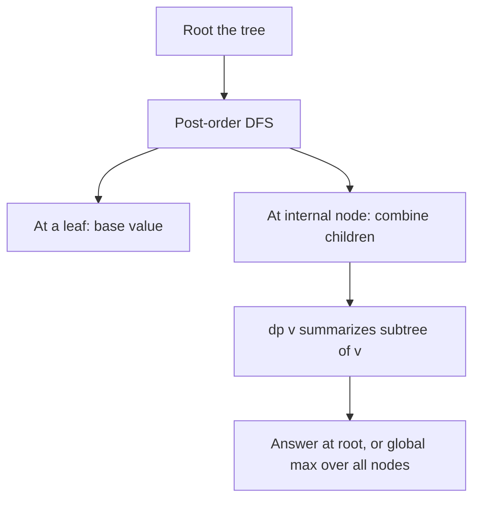

# Tree DP (Dynamic Programming on Trees) — Junior Level

> **One-line summary:** Root the tree, run a **post-order DFS**, and at every node combine the already-computed answers of its children into the node's own answer. Because a tree has no cycles, each subtree is solved exactly once — the whole thing runs in `O(n)`. The recurring slogan is: **define a small dp state per node that summarizes that node's subtree.**

---

## Table of Contents

1. [Introduction](#introduction)
2. [Prerequisites](#prerequisites)
3. [Glossary](#glossary)
4. [Core Concepts](#core-concepts)
5. [Big-O Summary](#big-o-summary)
6. [Real-World Analogies](#real-world-analogies)
7. [Pros & Cons](#pros--cons)
8. [Step-by-Step Walkthrough](#step-by-step-walkthrough)
9. [Code Examples](#code-examples)
10. [Coding Patterns](#coding-patterns)
11. [Error Handling](#error-handling)
12. [Performance Tips](#performance-tips)
13. [Best Practices](#best-practices)
14. [Edge Cases & Pitfalls](#edge-cases--pitfalls)
15. [Common Mistakes](#common-mistakes)
16. [Cheat Sheet](#cheat-sheet)
17. [Visual Animation](#visual-animation)
18. [Summary](#summary)
19. [Further Reading](#further-reading)

---

## Introduction

Imagine someone hands you a company's org chart — a CEO at the top, managers under her, individual contributors under them — and asks: *"If you must invite people to a party but you may never invite an employee together with their direct boss, what is the largest party you can throw?"* This is the famous **maximum independent set on a tree** problem (and on LeetCode it is dressed up as *House Robber III*, where each node holds money and you cannot rob a node and its parent together).

You cannot solve this greedily ("invite everyone with even depth") because the right choice at a node depends on what you decided for its children. But here is the key realization: **the answer for a node depends only on the answers for its children's subtrees.** Once you know the best party you can throw inside each child's subtree — both when the child is invited and when it is not — you can compute the best party inside the current node's subtree with a one-line rule.

That is the entire philosophy of **Tree DP**: pick a root, walk the tree **bottom-up** (children before parents, which is exactly what a **post-order DFS** gives you), and at each node fold the children's results into a small **dp state** that describes the current node's subtree. Because a tree on `n` nodes has exactly `n - 1` edges and no cycles, every subtree is computed exactly once, so the total work is **`O(n)`**.

This file teaches the foundations using two running examples:

1. **Maximum independent set on a tree** (a.k.a. House Robber III): the canonical *include / exclude* two-state DP.
2. **Tree diameter**: the longest path between any two nodes, computed in one DFS by tracking, at each node, the longest downward chain.

These two problems demonstrate the two most common shapes of tree dp state: a small fixed tuple per node (`{included, excluded}`), and a "best path through this node" value combined from the two best child chains. Master them and you have the template for counting problems, subtree sums, tree knapsack, and (at middle level) the rerooting technique.

The mental model to carry from minute one: **a tree dp is just a recurrence whose subproblems are rooted subtrees.** The hard part is never the recursion — it is choosing the state so that a parent can be computed from its children without looking anywhere else.

---

## Prerequisites

Before reading this file you should be comfortable with:

- **Trees** — connected acyclic graphs; `n` nodes, `n - 1` edges, a unique path between any two nodes. See sibling section `11-graphs` and `08-trees`.
- **Rooted trees** — picking one node as the root induces parent/child relationships and a notion of "subtree of a node".
- **DFS (depth-first search)** — and specifically **post-order** (process a node *after* all its children).
- **Recursion** — and the idea that a recursive call returns a value the caller folds in.
- **Adjacency lists** — the standard `O(n)` representation of a tree.
- **Big-O notation** — `O(n)`, `O(n²)` (what we are avoiding).

Optional but helpful:

- A glance at **1-D dynamic programming** (e.g. house robber on a *line*), because tree dp is its generalization from a path to a tree.
- Familiarity with **the call stack**, since deep trees can overflow it (covered in `senior.md`).

---

## Glossary

| Term | Meaning |
|------|---------|
| **Tree** | A connected, acyclic, undirected graph: `n` nodes and exactly `n - 1` edges. |
| **Rooted tree** | A tree with one node designated the **root**; every other node has a unique **parent**. |
| **Subtree of `v`** | The node `v` together with all of its descendants (everything reachable going *away* from the root through `v`). |
| **Post-order DFS** | A traversal that visits a node only **after** visiting all of its children — the natural order for bottom-up dp. |
| **dp state** | A small piece of data stored per node that **summarizes that node's subtree** (e.g. `{best with v, best without v}`). |
| **Independent set** | A set of nodes with **no two adjacent** (no parent–child pair both chosen). |
| **Maximum independent set (MIS)** | The largest-weight (or largest-count) independent set. On trees it is solvable in `O(n)`. |
| **Diameter** | The number of edges (or total weight) on the **longest path** between any two nodes of the tree. |
| **Down-height / down-length** | The length of the longest downward chain from a node to a leaf in its subtree. |
| **Leaf** | A node with no children (in a rooted tree). The base case of most tree dps. |
| **Combine step** | The rule that merges children's dp values into the parent's dp value. |

---

## Core Concepts

### 1. Root the tree, then think in subtrees

A bare tree has no parents or children — every node is symmetric. The first move in almost every tree dp is to **pick a root** (often node `0` or node `1`). Rooting does three things:

- It defines, for each node `v`, a **subtree** — `v` plus everything below it.
- It gives a direction to recursion: process children, then the node.
- It turns the problem "answer for the whole tree" into "answer for the subtree of the root".

Once rooted, the dp subproblem is always *"solve the subtree of node `v`"*, and the answer for `v` is built from the answers for `v`'s children.

### 2. Post-order DFS is bottom-up evaluation

A **post-order DFS** processes a node *after* all of its children. That is exactly the order you need: by the time you compute `dp[v]`, every `dp[child]` is already known. In code this is almost always a recursion that **returns the child's dp** to the parent:

```
dfs(v, parent):
    initialize dp[v] to the leaf/base value
    for each neighbor c of v with c != parent:
        childResult = dfs(c, v)         # recurse first (children before parent)
        fold childResult into dp[v]      # the combine step
    return dp[v]
```

The `c != parent` check is how you avoid walking back up the edge you came from (a tree edge is undirected in the adjacency list).

### 3. Example A — Maximum independent set / House Robber III (include / exclude)

For each node `v` keep **two** numbers:

- `dp[v][1]` = best total **if `v` is included** (chosen / robbed).
- `dp[v][0]` = best total **if `v` is excluded** (not chosen).

The recurrence, where `w[v]` is `v`'s weight (use `1` for "count of nodes"):

```
dp[v][1] = w[v] + Σ over children c of  dp[c][0]      # v in ⇒ no child may be in
dp[v][0] =        Σ over children c of  max(dp[c][0], dp[c][1])   # v out ⇒ child free
```

- If `v` is **included**, none of its children may be included (they are adjacent), so each child must contribute its *excluded* value.
- If `v` is **excluded**, each child is free to take whichever of its two states is larger.

The final answer for the whole tree is `max(dp[root][0], dp[root][1])`. **Leaf base case:** a leaf has `dp[leaf][1] = w[leaf]` and `dp[leaf][0] = 0`, which falls out of the formulas with an empty child sum.

### 4. Example B — Tree diameter via DP

The **diameter** is the longest path in the tree. The DP trick: every path has a single **highest node** (its topmost vertex). At that top node, the path goes **down into (at most) two different children's subtrees**. So at each node `v` compute:

- `down[v]` = length of the longest downward chain from `v` to a leaf in its subtree = `1 + max over children c of down[c]` (or `0` if `v` is a leaf, counting edges).
- The best path **passing through `v` as its top** = the **two largest** `down[c] + 1` values among `v`'s children added together.

Track a global `best` = the maximum over all nodes of that "two-largest-chains" sum. After one DFS, `best` is the diameter (in edges). This is the same shape as MIS — combine children into a per-node value — but here we keep a **running global maximum** in addition to the returned value.

### 5. The dp state must summarize the subtree

The single most important design rule: **`dp[v]` must capture everything about `v`'s subtree that the parent needs — and nothing more.** For MIS, the parent needs to know "best with `v`" and "best without `v`": two numbers suffice. For diameter, the parent needs "longest chain hanging below `v`": one number. If you find yourself wanting to re-examine grandchildren from the parent, your state is too thin — push that information into the state.

### 6. Combining children: the order does not matter

Most combine steps (`+`, `max`, taking the two largest) are **associative and commutative**, so you process children in any order. This is why a single linear DFS works. (Tree *knapsack*, covered at middle level, is the notable exception where combining is itself a small DP per node.)

---

## Big-O Summary

| Operation | Time | Space | Notes |
|-----------|------|-------|-------|
| Build adjacency list from `n-1` edges | **O(n)** | O(n) | One pass over the edge list. |
| Single post-order DFS (MIS, diameter, sizes, sums) | **O(n)** | O(n) | Each node and edge visited once. |
| Combine step at a node with `d` children | O(d) | O(1) extra | `Σ d = n - 1` total over the tree. |
| Recursion stack depth | O(h) | O(h) | `h` = tree height; up to `O(n)` for a path-like tree. |
| Tree knapsack (capacity `W`) | O(n · W) | O(n · W) | See `middle.md`. |
| Rerooting (answer for every root) | O(n) | O(n) | Two DFS passes; see `middle.md`. |
| Naive "rerun from every root" | O(n²) | O(n) | What rerooting avoids. |

The headline number is **`O(n)`** for one-pass tree dps: linear in the number of nodes, because the acyclic structure guarantees each subtree is solved exactly once.

---

## Real-World Analogies

| Concept | Analogy |
|---------|---------|
| Rooting the tree | Declaring the CEO the top of an org chart; everyone else gets a manager. |
| Subtree of `v` | A manager `v` plus their entire reporting chain — the whole department under `v`. |
| Post-order DFS | Each manager waits for **all** direct reports to file their summaries, then writes their own combining those summaries. Reports finish before bosses. |
| MIS include/exclude | "If I attend the party, none of my direct reports may; if I skip, each report decides for themselves." |
| Tree diameter | The longest chain of friendships in a family tree — it bends through one "top" person and goes down two different branches. |
| dp state | A one-page department summary a manager hands upward — small enough to fold in, complete enough that the boss never asks for raw data. |

Where the analogy breaks: real org charts allow dotted-line reports (a node with two bosses) — that creates a cycle and it is **no longer a tree**, so plain tree dp does not apply. Tree dp relies on the unique-path, no-cycle structure.

---

## Pros & Cons

| Pros | Cons |
|------|------|
| **Linear `O(n)`** for one-pass problems — optimal, you must read the tree anyway. | Requires the input to be an actual **tree** (acyclic); general graphs need different techniques. |
| Clean recursive code that mirrors the recurrence directly. | Deep / path-like trees can **overflow the recursion stack** (see `senior.md`). |
| One template (post-order + combine) solves a huge family of problems. | Designing the **right state** is the hard, error-prone part — too thin a state gives wrong answers. |
| State is tiny (often 1–2 numbers per node), so memory is `O(n)`. | "Answer for every root" naively costs `O(n²)` until you learn rerooting. |
| Combine steps are usually associative, so child order is irrelevant. | Tree knapsack and counting variants can blow memory if the per-node state is large. |

**When to use:** the input is a tree (or forest); you want an optimum / count / sum defined over subtrees; the answer at a node depends only on its children; you can summarize a subtree in a small state.

**When NOT to use:** the graph has cycles (use general graph algorithms); the state needed at a node depends on far-away nodes in a non-summarizable way; the tree is enormous and recursion depth would overflow (convert to iterative DFS first).

---

## Step-by-Step Walkthrough

Take this small rooted tree (root = `0`), with node weights shown in brackets. We solve **maximum-weight independent set** (House Robber III).

```
            0 [3]
           /     \
        1 [2]    2 [1]
        /  \        \
     3 [1] 4 [3]    5 [1]
```

Adjacency (undirected): `0-1, 0-2, 1-3, 1-4, 2-5`. Root at `0`.

**Post-order visits leaves first.** Recall:
`dp[v][1] = w[v] + Σ dp[c][0]` and `dp[v][0] = Σ max(dp[c][0], dp[c][1])`.

**Leaves** (no children, empty sums):

```
node 3:  dp[3] = (excl=0, incl=1)
node 4:  dp[4] = (excl=0, incl=3)
node 5:  dp[5] = (excl=0, incl=1)
```

**Node 1** (children 3 and 4):

```
dp[1][1] = w[1] + dp[3][0] + dp[4][0] = 2 + 0 + 0 = 2     # include 1 ⇒ children excluded
dp[1][0] = max(dp[3][0],dp[3][1]) + max(dp[4][0],dp[4][1])
         = max(0,1) + max(0,3) = 1 + 3 = 4                # exclude 1 ⇒ take best of each child
dp[1] = (excl=4, incl=2)
```

Note: excluding node 1 lets us take nodes 3 and 4 (worth `1 + 3 = 4`), which beats including node 1 (worth `2`). The dp keeps **both** options because the parent might prefer either.

**Node 2** (child 5):

```
dp[2][1] = w[2] + dp[5][0] = 1 + 0 = 1
dp[2][0] = max(dp[5][0], dp[5][1]) = max(0,1) = 1
dp[2] = (excl=1, incl=1)
```

**Node 0 (root)** (children 1 and 2):

```
dp[0][1] = w[0] + dp[1][0] + dp[2][0] = 3 + 4 + 1 = 8     # include 0
dp[0][0] = max(dp[1][0],dp[1][1]) + max(dp[2][0],dp[2][1])
         = max(4,2) + max(1,1) = 4 + 1 = 5                # exclude 0
dp[0] = (excl=5, incl=8)
```

**Answer** = `max(dp[0][0], dp[0][1]) = max(5, 8) = 8`. The optimal set is `{0, 3, 4}` (weights `3 + 1 + 3 = 7`)? Let us double-check: including 0 forbids 1 and 2; below them we may still take 3, 4 (children of the excluded 1) and 5 (child of excluded 2). So `{0, 3, 4, 5}` = `3 + 1 + 3 + 1 = 8`. Correct — the dp found it without us enumerating subsets.

Each node was computed once, from its children, in a single bottom-up pass — that is the whole algorithm.

---

## Code Examples

### Example: Maximum-weight independent set on a tree (House Robber III shape)

Returns a pair `(excl, incl)` from each DFS call and the parent folds them in.

#### Go

```go
package main

import "fmt"

var (
	adj [][]int
	w   []int64
)

// dfs returns (best with v excluded, best with v included).
func dfs(v, parent int) (int64, int64) {
	excl := int64(0)
	incl := w[v]
	for _, c := range adj[v] {
		if c == parent {
			continue // do not walk back up the edge we came from
		}
		cExcl, cIncl := dfs(c, v)
		excl += max64(cExcl, cIncl) // child free to pick its better state
		incl += cExcl               // v included ⇒ child must be excluded
	}
	return excl, incl
}

func max64(a, b int64) int64 {
	if a > b {
		return a
	}
	return b
}

func main() {
	n := 6
	adj = make([][]int, n)
	w = []int64{3, 2, 1, 1, 3, 1}
	edges := [][2]int{{0, 1}, {0, 2}, {1, 3}, {1, 4}, {2, 5}}
	for _, e := range edges {
		adj[e[0]] = append(adj[e[0]], e[1])
		adj[e[1]] = append(adj[e[1]], e[0])
	}
	excl, incl := dfs(0, -1)
	fmt.Println("max independent set weight =", max64(excl, incl)) // 8
}
```

#### Java

```java
import java.util.*;

public class TreeMIS {
    static List<Integer>[] adj;
    static long[] w;

    // returns [bestExcluded, bestIncluded] for the subtree of v
    static long[] dfs(int v, int parent) {
        long excl = 0, incl = w[v];
        for (int c : adj[v]) {
            if (c == parent) continue;
            long[] ch = dfs(c, v);
            excl += Math.max(ch[0], ch[1]);
            incl += ch[0];
        }
        return new long[]{excl, incl};
    }

    @SuppressWarnings("unchecked")
    public static void main(String[] args) {
        int n = 6;
        adj = new List[n];
        for (int i = 0; i < n; i++) adj[i] = new ArrayList<>();
        w = new long[]{3, 2, 1, 1, 3, 1};
        int[][] edges = {{0, 1}, {0, 2}, {1, 3}, {1, 4}, {2, 5}};
        for (int[] e : edges) {
            adj[e[0]].add(e[1]);
            adj[e[1]].add(e[0]);
        }
        long[] r = dfs(0, -1);
        System.out.println("max independent set weight = " + Math.max(r[0], r[1])); // 8
    }
}
```

#### Python

```python
import sys
sys.setrecursionlimit(1 << 25)  # trees can be deep; raise the limit


def dfs(v, parent, adj, w):
    excl, incl = 0, w[v]
    for c in adj[v]:
        if c == parent:
            continue
        c_excl, c_incl = dfs(c, v, adj, w)
        excl += max(c_excl, c_incl)  # child free to pick its better state
        incl += c_excl               # v included => child excluded
    return excl, incl


if __name__ == "__main__":
    n = 6
    w = [3, 2, 1, 1, 3, 1]
    edges = [(0, 1), (0, 2), (1, 3), (1, 4), (2, 5)]
    adj = [[] for _ in range(n)]
    for a, b in edges:
        adj[a].append(b)
        adj[b].append(a)
    e, i = dfs(0, -1, adj, w)
    print("max independent set weight =", max(e, i))  # 8
```

**What it does:** builds the 6-node tree above, runs one post-order DFS, and prints the maximum-weight independent set (`8`, the set `{0, 3, 4, 5}`).
**Run:** `go run main.go` | `javac TreeMIS.java && java TreeMIS` | `python tree_mis.py`

### Example: Tree diameter (longest path, in edges)

#### Go

```go
package main

import "fmt"

var (
	g    [][]int
	best int
)

// returns down[v]: longest downward chain from v to a leaf, in edges.
func down(v, parent int) int {
	best1, best2 := 0, 0 // two longest child chains (each is down[c]+1)
	for _, c := range g[v] {
		if c == parent {
			continue
		}
		d := down(c, v) + 1
		if d > best1 {
			best2 = best1
			best1 = d
		} else if d > best2 {
			best2 = d
		}
	}
	if best1+best2 > best { // path through v as its top
		best = best1 + best2
	}
	return best1
}

func main() {
	n := 6
	g = make([][]int, n)
	edges := [][2]int{{0, 1}, {0, 2}, {1, 3}, {1, 4}, {2, 5}}
	for _, e := range edges {
		g[e[0]] = append(g[e[0]], e[1])
		g[e[1]] = append(g[e[1]], e[0])
	}
	down(0, -1)
	fmt.Println("diameter (edges) =", best) // 4  (path 3-1-0-2-5)
}
```

#### Java

```java
import java.util.*;

public class TreeDiameter {
    static List<Integer>[] g;
    static int best = 0;

    // returns longest downward chain (in edges) from v
    static int down(int v, int parent) {
        int b1 = 0, b2 = 0;
        for (int c : g[v]) {
            if (c == parent) continue;
            int d = down(c, v) + 1;
            if (d > b1) { b2 = b1; b1 = d; }
            else if (d > b2) { b2 = d; }
        }
        best = Math.max(best, b1 + b2);
        return b1;
    }

    @SuppressWarnings("unchecked")
    public static void main(String[] args) {
        int n = 6;
        g = new List[n];
        for (int i = 0; i < n; i++) g[i] = new ArrayList<>();
        int[][] edges = {{0, 1}, {0, 2}, {1, 3}, {1, 4}, {2, 5}};
        for (int[] e : edges) { g[e[0]].add(e[1]); g[e[1]].add(e[0]); }
        down(0, -1);
        System.out.println("diameter (edges) = " + best);
    }
}
```

#### Python

```python
import sys
sys.setrecursionlimit(1 << 25)

best = 0


def down(v, parent, g):
    global best
    b1 = b2 = 0  # two longest child chains
    for c in g[v]:
        if c == parent:
            continue
        d = down(c, v, g) + 1
        if d > b1:
            b1, b2 = d, b1
        elif d > b2:
            b2 = d
    best = max(best, b1 + b2)
    return b1


if __name__ == "__main__":
    n = 6
    edges = [(0, 1), (0, 2), (1, 3), (1, 4), (2, 5)]
    g = [[] for _ in range(n)]
    for a, b in edges:
        g[a].append(b)
        g[b].append(a)
    down(0, -1, g)
    print("diameter (edges) =", best)
```

**What it does:** in one DFS, `down(v)` returns the longest chain hanging below `v`, and the global `best` records the largest sum of the two longest child chains at any node. For this tree the diameter is the path `3 → 1 → 0 → 2 → 5`, which has **4 edges**, so `best = 4`.
**Run:** `go run main.go` | `javac TreeDiameter.java && java TreeDiameter` | `python tree_diameter.py`

---

## Coding Patterns

### Pattern 1: Return the dp from the DFS (functional style)

**Intent:** the cleanest tree dp returns the child's state and the parent folds it in — no global arrays for the state itself.

```python
def dfs(v, p):
    state = base_value(v)
    for c in adj[v]:
        if c != p:
            state = combine(state, dfs(c, v))
    return state
```

This is what both examples above do. It keeps state local and makes the recurrence obvious.

### Pattern 2: Global accumulator for "best over all nodes"

**Intent:** when the answer is a maximum/minimum taken across *every* node (like the diameter, which can top out at any node), keep a global and update it inside the DFS while still returning the per-node summary.

```python
best = float("-inf")
def dfs(v, p):
    global best
    ...
    best = max(best, value_at(v))   # answer can occur anywhere
    return summary_to_pass_up(v)    # what the parent needs is different!
```

The subtle point: **what you return up (`down[v]`) differs from what you record globally (`best1 + best2`).** Confusing the two is the #1 diameter bug.

### Pattern 3: Subtree size / subtree sum

**Intent:** the simplest tree dp; foundation for many others (and for rerooting).

```python
def size(v, p):
    s = 1
    for c in adj[v]:
        if c != p:
            s += size(c, v)
    sz[v] = s
    return s
```



---

## Error Handling

| Error | Cause | Fix |
|-------|-------|-----|
| Infinite recursion / revisits | Forgot the `c != parent` guard; walked back up an undirected edge. | Always pass and skip the parent (or keep a `visited[]`). |
| `StackOverflow` / `RecursionError` | Deep, path-like tree exceeds the call stack. | Raise the recursion limit, or use **iterative DFS** (see `middle.md`). |
| Wrong diameter | Returned the "two-chains sum" up instead of the single longest chain. | Return `best1` (one chain); record `best1 + best2` only in the global. |
| Off-by-one in length | Counting **nodes** vs **edges** in a path/chain. | Decide once: diameter here is in edges; a single node has `down = 0`. |
| Overflow on sums/counts | Weights or counts exceed 32-bit. | Use 64-bit (`int64` / `long`), or take counts mod `p`. |
| Wrong root assumption | Assumed root is `0` but input is 1-indexed. | Normalize indices when reading input. |
| Forest, not a tree | Input has several components. | Loop over all unvisited nodes and DFS each component. |

---

## Performance Tips

- **Build the adjacency list once**, in `O(n)`; never search the edge list inside the DFS.
- **Avoid allocating per node** in the hot path — in MIS, return a small tuple/array rather than building dictionaries.
- **Iterative DFS for huge depth** — a chain of `10^6` nodes will blow the default stack in Go/Java/Python; convert to an explicit stack (see `middle.md`).
- **Reuse the two-largest trick** for diameter-style problems instead of sorting all children (`O(d)` not `O(d log d)`).
- **Combine in place** — accumulate `excl`/`incl` with `+=`; do not collect all child results into a list first.
- **Single pass** — if you need both subtree size *and* a dp value, compute them in the same DFS, not two separate traversals.

---

## Best Practices

- State the **dp state meaning** in a comment above the DFS: *"returns (best excluding v, best including v) for the subtree of v"*. Half of tree-dp bugs are state-meaning confusion.
- Decide and document **edges vs nodes** for any length/depth quantity.
- Pick the root explicitly and pass `parent = -1` at the top call.
- Keep the **combine step associative** so child order never matters; if it is not (knapsack), say so loudly.
- Test against a **brute force** (try all subsets / all node pairs) on tiny random trees before trusting the dp.
- Handle the **single-node tree** and the **empty tree** as explicit base cases.

---

## Edge Cases & Pitfalls

- **Single node** — MIS answer is `w[root]`; diameter is `0` (no edges). Make sure empty child sums give these.
- **Two nodes** — MIS picks the larger weight; diameter is `1` edge.
- **Path (line) tree** — recursion depth equals `n`; this is where stack overflow strikes first.
- **Star tree** (one center, many leaves) — wide combine step (`O(n)` children) but shallow depth; fine.
- **Walking back to parent** — without the `c != parent` guard you recurse forever; this is the single most common beginner bug.
- **Returning the wrong thing for diameter** — the value passed *up* (one chain) is not the value you compare globally (two chains).
- **Negative weights** in MIS — `incl` could be worse than not taking `v`; the `max(excl, incl)` at the root still handles it, but make sure `excl` truly allows skipping.
- **Disconnected input (forest)** — must DFS each component and combine results appropriately.

---

## Common Mistakes

1. **No parent guard** — recursing back into the parent causes infinite recursion or double counting. Always skip `parent`.
2. **Confusing returned value with global answer** in diameter — return the longest single chain; the diameter is the best two-chain sum recorded globally.
3. **Too-thin state** — using one number where you need two (MIS needs both include and exclude); the parent then cannot make the right choice.
4. **Counting nodes instead of edges** (or vice versa) for depth/diameter — pick one convention and stick to it.
5. **Stack overflow on deep trees** — forgetting that recursion depth can reach `n`; raise limits or go iterative.
6. **Greedy instead of dp** — "take all even depths" is wrong for weighted MIS; you must keep both states per node.
7. **Recomputing subtree info from the parent** — if the parent re-traverses grandchildren, the algorithm becomes `O(n²)`; push that info into the child's returned state instead.
8. **Forgetting overflow** — counts and weighted sums on big trees overflow 32-bit; use 64-bit.

---

## Cheat Sheet

| Problem | dp state per node | Combine rule | Answer |
|---------|-------------------|--------------|--------|
| Max independent set (House Robber III) | `(excl, incl)` | `excl += max(c)`, `incl += c.excl` | `max(excl, incl)` at root |
| Tree diameter (edges) | `down[v]` = longest chain | track two largest `down[c]+1` | global `max(b1 + b2)` |
| Subtree size | `size[v]` | `size[v] = 1 + Σ size[c]` | `size[root] = n` |
| Subtree sum | `sum[v]` | `sum[v] = val[v] + Σ sum[c]` | per node |
| Count leaves in subtree | `leaves[v]` | `Σ leaves[c]`, or `1` if leaf | per node |

Core template:

```
dfs(v, parent):
    state = base(v)                      # leaf / initial value
    for c in adj[v]:
        if c == parent: continue         # don't go back up
        state = combine(state, dfs(c, v))# children before parent (post-order)
    # optionally: best = max(best, value_at(v))   # global answer
    return state                         # what the PARENT needs
# cost: O(n); depth O(h) — watch the stack on deep trees
```

---

## Visual Animation

> See [`animation.html`](./animation.html) for an interactive visualization.
>
> The animation demonstrates:
> - A **post-order DFS** over a small tree, lighting up the current node and the children it is folding in
> - The `(excl, incl)` dp pair filling in **bottom-up**, leaves first
> - The combine step `incl = w + Σ child.excl` and `excl = Σ max(child.excl, child.incl)` shown per node
> - Step / Run / Reset controls to watch each subtree get solved exactly once, ending with the root's answer

---

## Summary

Tree DP turns "optimize / count over a tree" into "solve each rooted subtree once and fold children into parents." Root the tree, run a **post-order DFS** so children finish before parents, and store a **small dp state per node that summarizes its subtree**. The two foundational shapes are *include/exclude* (maximum independent set / House Robber III, two numbers per node) and *best path through a node* (diameter, the two longest child chains plus a global maximum). Because a tree has no cycles, every subtree is computed exactly once and the whole thing runs in **`O(n)`**. The recurring skills: choose a state rich enough that a parent never needs to look past its children, guard against walking back to the parent, and keep clear which value you **return up** versus which you **record globally**. Get those right and the same template scales to counting, subtree sums, tree knapsack, and the rerooting technique you will meet at middle level.

---

## Further Reading

- *Competitive Programmer's Handbook* (Antti Laaksonen) — "Tree algorithms" and "Tree queries" chapters.
- *Introduction to Algorithms* (CLRS) — DFS, tree traversal, and dynamic programming foundations.
- LeetCode 337 *House Robber III* — the canonical tree MIS interview problem.
- cp-algorithms.com — "Diameter of a tree" and "Dynamic programming on trees".
- Sibling file [`middle.md`](./middle.md) — rerooting, tree knapsack, in/out DP, iterative DFS.
- Sibling file [`professional.md`](./professional.md) — optimal-substructure proofs and the `O(n)` tree-knapsack argument.
- Sibling section `08-trees` — tree representations and traversals.
