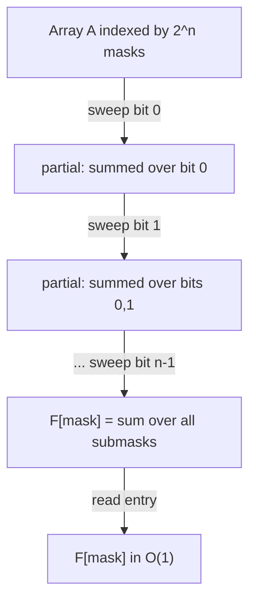

# Sum over Subsets DP (SOS DP) — Junior Level

> **One-line summary:** Given an array `A` indexed by bitmasks of `n` bits, the **Sum over Subsets** transform computes `F[mask] = Σ A[sub]` over every submask `sub ⊆ mask`. The naive way is `O(3^n)`; the SOS DP does it in `O(n · 2^n)` by relaxing one bit (one dimension) at a time.

---

## Table of Contents

1. [Introduction](#introduction)
2. [Prerequisites](#prerequisites)
3. [Glossary](#glossary)
4. [Core Concepts](#core-concepts)
5. [Big-O Summary](#big-o-summary)
6. [Real-World Analogies](#real-world-analogies)
7. [Pros & Cons](#pros--cons)
8. [Step-by-Step Walkthrough](#step-by-step-walkthrough)
9. [Code Examples](#code-examples)
10. [Coding Patterns](#coding-patterns)
11. [Error Handling](#error-handling)
12. [Performance Tips](#performance-tips)
13. [Best Practices](#best-practices)
14. [Edge Cases & Pitfalls](#edge-cases--pitfalls)
15. [Common Mistakes](#common-mistakes)
16. [Cheat Sheet](#cheat-sheet)
17. [Visual Animation](#visual-animation)
18. [Summary](#summary)
19. [Further Reading](#further-reading)

---

## Introduction

Suppose you have a value attached to every subset of `n` items. With `n` items there are `2^n` subsets, and we encode each subset as an integer **bitmask**: bit `i` of the integer is `1` if item `i` is in the subset. So `A` is an array of length `2^n`, and `A[mask]` is the value of that particular subset.

Now someone asks a question that comes up constantly in combinatorics, counting, and probability:

> For each subset `mask`, what is the **total** of `A[sub]` over **all subsets `sub` that are contained in `mask`**?

A subset `sub` is "contained in" `mask` when every bit set in `sub` is also set in `mask` — written `sub ⊆ mask`, or equivalently `(sub & mask) == sub`. We call such a `sub` a **submask** of `mask`. The quantity we want is:

```
F[mask] = Σ over all sub with (sub & mask) == sub of A[sub]
```

This `F` is called the **Sum over Subsets** of `A`, and computing it is the **SOS transform** (also known as the **zeta transform on the subset lattice**). It is the discrete analogue of a cumulative sum, but instead of summing over a range `[0, mask]` of integers, we sum over the *downward-closed set of submasks*.

The brute-force way is to loop over every `mask` and, for each, loop over every submask. That is the famous **`O(3^n)` submask enumeration**: each of the `n` bits is independently *out of the mask*, *in the mask but not the submask*, or *in both*, giving `3^n` (mask, submask) pairs. For `n = 20` that is about `3.5 × 10^9` — slow.

The **SOS DP** computes the exact same `F` in only **`O(n · 2^n)`** by being clever: instead of treating each mask in isolation, it processes one **bit (one dimension)** at a time, and for each bit `i` it lets every mask that has bit `i` set absorb the value already accumulated in the mask *without* that bit. After sweeping all `n` bits, every mask has summed over all of its submasks. For `n = 20`, `n · 2^n ≈ 2 × 10^7` — a couple hundred times faster than `3^n`.

This single idea unlocks a whole toolkit: the **superset** variant (sum over all supersets), the **Möbius inverse** (recover `A` from `F`), the **inclusion-exclusion** connection, and the **OR-convolution** of two functions over subsets. We build all of that on top of the one tiny loop introduced here.

---

## Prerequisites

Before reading this file you should be comfortable with:

- **Bitmasks** — representing a subset of `n` items as an `n`-bit integer; testing bit `i` with `mask & (1 << i)`; clearing bit `i` with `mask ^ (1 << i)` (when it is set).
- **Subsets and submasks** — `sub ⊆ mask` means `(sub & mask) == sub`; there are `2^popcount(mask)` submasks of a given `mask`.
- **Arrays indexed by integers** — `A` has length `2^n`, indexed `0 … 2^n - 1`.
- **Big-O notation** — `O(2^n)`, `O(3^n)`, `O(n · 2^n)`.
- **Nested loops and in-place array updates** — SOS DP mutates the array as it goes.

Optional but helpful:

- A glance at **prefix sums** (the 1-D cumulative sum), because SOS is its multidimensional bit-lattice cousin.
- Familiarity with **inclusion-exclusion**, which is exactly the inverse (Möbius) transform.

---

## Glossary

| Term | Meaning |
|------|---------|
| **Bitmask** | An integer whose bits encode a subset of `n` items. Bit `i` set ⇔ item `i` present. |
| **Submask `sub ⊆ mask`** | A mask whose set bits are a subset of `mask`'s set bits, i.e. `(sub & mask) == sub`. |
| **Superset of `mask`** | A mask that *contains* `mask`: `(sup & mask) == mask`. |
| **`popcount(mask)`** | The number of set bits in `mask`. A mask has `2^popcount(mask)` submasks. |
| **SOS transform / zeta transform** | Computing `F[mask] = Σ_{sub ⊆ mask} A[sub]`. |
| **Superset-sum transform** | The dual: `G[mask] = Σ_{sup ⊇ mask} A[sup]`. |
| **Möbius transform (inverse)** | The inverse of the zeta transform: recovers `A` from `F`. |
| **Subset lattice** | The partial order on `2^n` masks under `⊆`; SOS is a prefix-sum on it. |
| **Dimension / bit relaxation** | Processing one bit at a time, the heart of the `O(n · 2^n)` algorithm. |
| **Yates' algorithm** | The general "dimension-by-dimension" transform of which SOS is an instance. |
| **OR-convolution** | `(A ⊛ B)[mask] = Σ_{i | j = mask} A[i]·B[j]`, computed via SOS. |

---

## Core Concepts

### 1. The Problem: Sum over Submasks

We have `A[0 … 2^n - 1]`. We want, for every `mask`:

```
F[mask] = Σ over all sub with (sub & mask) == sub of A[sub]
```

In words: `F[mask]` aggregates every subset that fits inside `mask`. Note `mask` is always a submask of itself, so `A[mask]` is always one of the terms. The empty mask `0` is a submask of *every* mask, so `A[0]` is in every `F[mask]`.

Tiny example, `n = 2` (masks `00, 01, 10, 11`):

```
A = [A0, A1, A2, A3]   (indices in binary: 00, 01, 10, 11)

F[00] = A0
F[01] = A0 + A1                  (submasks of 01: 00, 01)
F[10] = A0 + A2                  (submasks of 10: 00, 10)
F[11] = A0 + A1 + A2 + A3        (submasks of 11: 00, 01, 10, 11)
```

### 2. The Naive `O(3^n)` Submask Enumeration

The most direct method loops over every mask and enumerates its submasks. There is a famous bit trick to walk submasks of a fixed `mask` in decreasing order:

```
sub = mask
while true:
    F[mask] += A[sub]
    if sub == 0: break
    sub = (sub - 1) & mask        # next smaller submask
```

The line `sub = (sub - 1) & mask` is the standard submask-enumeration idiom: subtracting 1 borrows through the low zero bits, and `& mask` snaps the result back to only `mask`'s bits, producing the next-smaller submask. Why is the total cost `3^n`? A (mask, submask) pair corresponds to assigning each bit one of three states — *not in mask*, *in mask but not submask*, *in both* — so there are `3^n` such pairs across all masks. That is the entire work of the double loop.

### 3. The Key Insight: Sum One Bit at a Time

The naive method recomputes overlapping sums repeatedly. SOS DP shares that work. Think of `F[mask]` as a **prefix sum over `n` independent axes**, one per bit. For a single axis (bit `i`), "summing over that axis" means: a mask that has bit `i` *set* should add to itself the value of the mask with bit `i` *cleared* (its lower neighbor along axis `i`).

If you do this relaxation for **all** masks for bit `0`, then again for bit `1`, …, up to bit `n-1`, then after the last sweep every mask has accumulated all of its submasks. Each bit is "summed over" exactly once, and the partial sums from earlier bits propagate forward. This is exactly how an `n`-dimensional prefix sum works: do a 1-D prefix sum along each axis in turn.

### 4. The Classic SOS Loop

Here is the canonical code — memorize it:

```
F = copy of A
for i in 0 .. n-1:                 # for each bit (dimension)
    for mask in 0 .. 2^n - 1:      # for each mask
        if mask & (1 << i):        # if bit i is set in mask
            F[mask] += F[mask ^ (1 << i)]
```

`mask ^ (1 << i)` is `mask` with bit `i` removed (we only reach this branch when the bit is set, so XOR clears it). After the `i`-th outer iteration, `F[mask]` equals the sum over all submasks of `mask` that *differ from `mask` only within bits `0 … i`*. After `i = n-1`, that restriction is gone and `F[mask]` is the full sum over submasks.

### 5. Why It Is `O(n · 2^n)`

The outer loop runs `n` times (once per bit); the inner loop runs `2^n` times (once per mask). Each inner step is `O(1)` (one test, one addition). So the total is `n · 2^n` operations. For `n = 20` that is ~20 million, versus ~3.5 billion for `3^n`.

### 6. In-Place Is Correct

A subtle but crucial fact: the update `F[mask] += F[mask ^ (1<<i)]` can be done **in place**, overwriting `F` as we go, and it is still correct. When we process bit `i`, the value `F[mask ^ (1<<i)]` we read has *already* been updated for bits `0 … i-1` but *not yet* for bit `i` (because masks with bit `i` cleared are not modified in this `i`-iteration). That is exactly the partial sum we need. (The professional file proves this formally by induction over bits.)

### 7. The Prefix-Sum Picture (intuition)

The cleanest way to *remember* SOS is: it is a prefix sum on a hypercube. Imagine the `2^n` masks as the corners of an `n`-dimensional cube. A normal 1-D prefix sum sweeps left to right adding each element to the running total. SOS does the same thing along each of the `n` axes (bits) in turn: pass `i` "adds along axis `i`". After sweeping all `n` axes, every corner holds the sum of all corners "below and behind" it — exactly the submask sum. So if you already know how to do a 2-D prefix sum (sum rows, then sum columns), SOS is the same idea in `n` dimensions where every dimension has length 2. There is nothing more to it than "prefix sum, once per bit."

---

## Big-O Summary

| Operation | Time | Space | Notes |
|-----------|------|-------|-------|
| Naive submask sum (per mask) | sum of `2^popcount` | — | total over all masks is `3^n` |
| **Naive submask sum (all masks)** | **O(3^n)** | O(2^n) | the famous submask-enumeration cost |
| **SOS DP (zeta transform)** | **O(n · 2^n)** | O(2^n) | the standard method |
| Superset-sum DP | O(n · 2^n) | O(2^n) | same shape, read from `mask | (1<<i)` direction |
| Möbius inverse (recover `A`) | O(n · 2^n) | O(2^n) | SOS with subtraction |
| OR-convolution of two arrays | O(n · 2^n) | O(2^n) | SOS each, multiply pointwise, inverse |
| Read one `F[mask]` | O(1) | — | after the transform |

The headline is **`O(n · 2^n)`** — linear in the number of bits times the number of masks. That is the gap between feasible and infeasible at `n ≈ 20–22`.

---

## Real-World Analogies

| Concept | Analogy |
|---------|---------|
| Subset lattice | A filing cabinet of folders where folder `mask` contains a copy of every smaller folder `sub ⊆ mask`. |
| `F[mask]` | "Give me the grand total of everything filed in `mask` or in any sub-folder of it." |
| Naive `3^n` | For each folder, re-open and re-add every sub-folder from scratch — lots of repeated counting. |
| SOS DP (bit by bit) | Organize the cabinet by one drawer (bit) at a time; each pass merges the totals along that one axis, reusing the previous pass's work. |
| Bit relaxation `F[mask] += F[mask ^ (1<<i)]` | "Folder `mask` absorbs the running total of its neighbor that is identical except item `i` is absent." |
| Superset variant | "Give me the total of everything filed in `mask` or in any *larger* folder containing it." |
| Möbius inverse | Undo the merging: given all the grand totals, reconstruct each folder's own original value. |

Where the analogy breaks: the cabinet has `2^n` folders, which is astronomically large for big `n`; SOS only stays feasible while `n` is small (roughly `≤ 22`).

---

## Pros & Cons

| Pros | Cons |
|------|------|
| Turns an `O(3^n)` submask sum into `O(n · 2^n)` — a huge constant-and-asymptotic win. | Still exponential: needs `O(2^n)` memory, so `n` must be small (`≤ ~22`). |
| Tiny code — a double loop with one `if` and one `+=`. | The in-place correctness is subtle; easy to get the loop order or direction wrong. |
| One skeleton solves subset-sum, superset-sum, and (with subtraction) the Möbius inverse. | Only sums over the *subset/superset* relation; arbitrary aggregations need a different transform. |
| Backbone of OR/AND convolutions and many counting DPs. | Overflow: subset sums grow fast; needs a modulus or 64-bit care. |
| Cache-friendly: pure sequential array sweeps. | Choosing subset vs superset direction (and the inverse signs) is a common bug. |

**When to use:** you have an array indexed by all `2^n` masks (`n` up to ~20–22), and you need, for every mask, an aggregate over all its submasks (or supersets); OR/AND convolutions; counting problems where you sum a function over containment.

**When NOT to use:** `n` is large (memory `2^n` explodes); you need sums over a relation other than subset/superset; you only need one mask's submask sum (then the `O(2^popcount)` per-mask loop is fine).

---

## Step-by-Step Walkthrough

Take `n = 3`, so masks are `000 … 111` (indices `0 … 7`). Let:

```
A = [A0, A1, A2, A3, A4, A5, A6, A7]
index in binary: 0=000 1=001 2=010 3=011 4=100 5=101 6=110 7=111
```

Start `F = A`. We sweep bit `0`, then bit `1`, then bit `2`.

**Pass i = 0 (bit 0, value `1`).** For every `mask` with bit 0 set, add `F[mask ^ 1]`:

```
mask=001 (1): F[1] += F[0]   →  A1 + A0
mask=011 (3): F[3] += F[2]   →  A3 + A2
mask=101 (5): F[5] += F[4]   →  A5 + A4
mask=111 (7): F[7] += F[6]   →  A7 + A6
(masks 000,010,100,110 unchanged this pass)
```

After pass 0, `F[mask]` sums over submasks differing only in bit 0. E.g. `F[3] = A3 + A2` (submasks `011` and `010` — those that agree on bits 1,2 and vary in bit 0).

**Pass i = 1 (bit 1, value `2`).** For every `mask` with bit 1 set, add `F[mask ^ 2]`:

```
mask=010 (2): F[2] += F[0]   →  A2 + A0
mask=011 (3): F[3] += F[1]   →  (A3+A2) + (A1+A0)  = A0+A1+A2+A3
mask=110 (6): F[6] += F[4]   →  A6 + A4
mask=111 (7): F[7] += F[5]   →  (A7+A6) + (A5+A4)  = A4+A5+A6+A7
```

Now `F[3] = A0+A1+A2+A3` — all four submasks of `011`. Notice it pulled the *already-bit-0-summed* value `F[1] = A1+A0`, which is why the partial sums chain correctly.

**Pass i = 2 (bit 2, value `4`).** For every `mask` with bit 2 set, add `F[mask ^ 4]`:

```
mask=100 (4): F[4] += F[0]   →  A4 + A0
mask=101 (5): F[5] += F[1]   →  (A5+A4) + (A1+A0)
mask=110 (6): F[6] += F[2]   →  (A6+A4) + (A2+A0)
mask=111 (7): F[7] += F[3]   →  (A4+A5+A6+A7) + (A0+A1+A2+A3) = A0+...+A7
```

Final `F[7] = A0+A1+A2+A3+A4+A5+A6+A7` — the sum over all 8 submasks of `111`, exactly as required. Each entry is now a full subset sum. **Verify** `F[5]`: submasks of `101` are `000, 001, 100, 101` → `A0 + A1 + A4 + A5`, which matches `(A5+A4)+(A1+A0)`. The DP and the definition agree.

---

## Code Examples

### Example: Sum over Subsets (zeta transform)

Builds `F[mask] = Σ_{sub ⊆ mask} A[sub]` in `O(n · 2^n)`.

#### Go

```go
package main

import "fmt"

// sosSubsetSum computes F[mask] = sum of A[sub] over all sub subset of mask.
// n is the number of bits; A has length 1<<n. The transform is done in place.
func sosSubsetSum(A []int64, n int) []int64 {
	size := 1 << n
	F := make([]int64, size)
	copy(F, A)
	for i := 0; i < n; i++ { // for each bit / dimension
		bit := 1 << i
		for mask := 0; mask < size; mask++ {
			if mask&bit != 0 { // bit i is set in mask
				F[mask] += F[mask^bit] // pull the mask-without-bit-i value
			}
		}
	}
	return F
}

func main() {
	n := 3
	A := []int64{1, 2, 3, 4, 5, 6, 7, 8} // A[0..7]
	F := sosSubsetSum(A, n)
	fmt.Println("F:", F)            // F[7] = 1+2+...+8 = 36
	fmt.Println("F[7] =", F[7])     // 36
	fmt.Println("F[5] =", F[5])     // submasks of 101: A0+A1+A4+A5 = 1+2+5+6 = 14
}
```

#### Java

```java
public class SosSubsetSum {
    // F[mask] = sum of A[sub] over all sub subset of mask, in O(n * 2^n).
    static long[] sosSubsetSum(long[] A, int n) {
        int size = 1 << n;
        long[] F = A.clone();
        for (int i = 0; i < n; i++) {          // each bit
            int bit = 1 << i;
            for (int mask = 0; mask < size; mask++) {
                if ((mask & bit) != 0) {       // bit i set
                    F[mask] += F[mask ^ bit];  // add mask without bit i
                }
            }
        }
        return F;
    }

    public static void main(String[] args) {
        int n = 3;
        long[] A = {1, 2, 3, 4, 5, 6, 7, 8};
        long[] F = sosSubsetSum(A, n);
        System.out.println("F[7] = " + F[7]); // 36
        System.out.println("F[5] = " + F[5]); // 14
    }
}
```

#### Python

```python
def sos_subset_sum(A, n):
    """F[mask] = sum of A[sub] over all sub subset of mask, in O(n * 2^n)."""
    size = 1 << n
    F = A[:]  # copy
    for i in range(n):                 # each bit / dimension
        bit = 1 << i
        for mask in range(size):
            if mask & bit:             # bit i is set in mask
                F[mask] += F[mask ^ bit]  # pull mask-without-bit-i
    return F


if __name__ == "__main__":
    n = 3
    A = [1, 2, 3, 4, 5, 6, 7, 8]  # A[0..7]
    F = sos_subset_sum(A, n)
    print("F:", F)
    print("F[7] =", F[7])  # 36
    print("F[5] =", F[5])  # A0+A1+A4+A5 = 1+2+5+6 = 14
```

**What it does:** copies `A` into `F`, then sweeps each of the `n` bits; for masks with that bit set, it absorbs the value of the mask without the bit. After all bits, `F[mask]` is the full submask sum.
**Run:** `go run main.go` | `javac SosSubsetSum.java && java SosSubsetSum` | `python sos.py`

---

## Coding Patterns

### Pattern 1: Brute-Force Submask Sum (the oracle you test against)

**Intent:** Before trusting the SOS DP, compute the submask sums the slow, obvious way and check they agree on small inputs.

```python
def brute_subset_sum(A, n):
    size = 1 << n
    F = [0] * size
    for mask in range(size):
        sub = mask
        while True:                # enumerate submasks of mask
            F[mask] += A[sub]
            if sub == 0:
                break
            sub = (sub - 1) & mask  # next smaller submask
    return F
```

This is `O(3^n)`. It is too slow for large `n` but perfect as a correctness oracle: the SOS DP must produce the identical `F`.

### Pattern 2: Sum over Supersets

**Intent:** `G[mask] = Σ_{sup ⊇ mask} A[sup]` — the dual transform. Same loop, but masks with bit `i` *clear* absorb from the mask with bit `i` *set*:

```python
def sos_superset_sum(A, n):
    G = A[:]
    for i in range(n):
        bit = 1 << i
        for mask in range(1 << n):
            if not (mask & bit):       # bit i is CLEAR
                G[mask] += G[mask | bit]
    return G
```

### Pattern 3: Subset Counting

**Intent:** If `A[mask] = 1` whenever some set `S` equals exactly that mask (an indicator), then `F[mask]` counts how many elements of `S` are subsets of `mask` — a common "how many of my items fit in this capacity-mask" query.

```python
def count_fitting(items, n):
    A = [0] * (1 << n)
    for it in items:                  # each item is a mask < 2^n
        A[it] += 1
    return sos_subset_sum(A, n)       # F[capacity] = how many items fit in capacity
```



---

## Error Handling

| Error | Cause | Fix |
|-------|-------|-----|
| Wrong totals | Used `mask | bit` (superset) when you wanted submask. | For subset sum, the set-bit mask pulls from `mask ^ bit`. |
| Off-by-one in size | Allocated `n` instead of `1 << n`. | The array length is `2^n`, not `n`. |
| Overflow | Subset sums grow large; 64-bit overflows or, with a modulus, you forgot to reduce. | Use 64-bit, or reduce `mod p` after each `+=`. |
| Missed some submasks | Looped bits inside the mask loop incorrectly, or broke `in-place` ordering. | Bit loop must be **outer**, mask loop **inner**; keep it in place. |
| Inverse wrong | Subtracted in the wrong direction or order. | Möbius inverse uses the same loops with `-=` (see middle). |
| `n` too large | `1 << n` exceeds memory. | SOS needs `2^n` cells; cap `n` (~22) or rethink the model. |

---

## Performance Tips

- **Bit loop outer, mask loop inner.** This order is required for in-place correctness and is also cache-friendly (sequential sweeps of `F`).
- **Precompute `bit = 1 << i`** once per outer iteration instead of recomputing inside the inner loop.
- **Avoid the `if` when you can.** Some implementations iterate only masks with bit `i` set, but the simple `if mask & bit` branch predicts well; do not over-optimize prematurely.
- **Use a flat array of the right integer width** (`int64`/`long`) sized exactly `1 << n`; arrays of objects pressure the GC.
- **Reduce mod `p` only where needed** — one `% p` per `+=` is enough; do not reduce more often than necessary.

---

## Best Practices

- Always test the SOS DP against the brute-force `O(3^n)` oracle (Pattern 1) on small random `A` and small `n`.
- State `n` and the array size `1 << n` clearly; never hard-code `8` when you mean `1 << n`.
- Pick a named direction: write a helper for **subset** sum and a separate one for **superset** sum so you never confuse them.
- If the problem says "modulo `p`", define `MOD` once at the top and reduce after each addition.
- Keep `A` immutable if you need it later: copy into `F` before transforming (the transform is in place).
- Document whether `F` overwrote `A` — in-place transforms are a frequent source of "where did my original data go" bugs.

---

## Edge Cases & Pitfalls

- **`n = 0`** — there is exactly one mask (`0`), and `F[0] = A[0]`. The loops simply do nothing.
- **Empty mask `0`** — `F[0] = A[0]` always; `0` has only itself as a submask.
- **`A[0]` appears everywhere** — the empty set is a submask of every mask, so `A[0]` is added into every `F[mask]`. If `A[0]` is large, every total inherits it.
- **In-place vs fresh array** — the transform is correct in place, but if you read `A` after transforming you will get `F`; copy first if you need both.
- **Subset vs superset direction** — flipping `mask ^ bit` (submask) to `mask | bit` (superset) silently computes the wrong transform.
- **Overflow without a modulus** — subset sums can be enormous; use 64-bit or a modulus.
- **Negative values** — SOS works fine with negatives (it is just addition), but watch the modulus normalization if you later subtract (Möbius inverse).

---

## Common Mistakes

1. **Bit loop inside, mask loop outside** — swaps the dimensions and breaks the in-place chaining; the partial sums no longer propagate correctly.
2. **Using `mask | bit` for a subset sum** — that is the superset transform; for subset sum the set-bit branch must read `F[mask ^ bit]`.
3. **Allocating `n` cells instead of `2^n`** — the array is indexed by masks, length `1 << n`.
4. **Forgetting the modulus** — the totals overflow and silently wrap.
5. **Assuming SOS gives proper subsets** — `F[mask]` includes `A[mask]` itself (mask is its own submask); if you want *proper* submasks, subtract `A[mask]`.
6. **Confusing zeta with Möbius** — the forward transform sums (`+=`); the inverse subtracts (`-=`); mixing them up gives garbage.
7. **Re-running the transform twice** — applying SOS again does not undo it (that is the Möbius inverse's job); a double zeta over-counts.
8. **Recomputing `1 << i` inside the inner loop** — harmless for correctness but wasteful; hoist `bit = 1 << i` to the top of each outer iteration.
9. **Testing only on uniform data** (`A` all 1s) — too symmetric to reveal direction or sign bugs; always include an asymmetric input like `A[mask] = mask + 1`.

---

## Cheat Sheet

| Question | Tool | Formula |
|----------|------|---------|
| Sum over submasks | SOS zeta transform | `F[mask] = Σ_{sub ⊆ mask} A[sub]` |
| Sum over supersets | SOS superset transform | `G[mask] = Σ_{sup ⊇ mask} A[sup]` |
| Recover `A` from `F` | Möbius inverse | SOS loop with `-=` (see middle) |
| Proper submasks only | subtract self | `F[mask] - A[mask]` |
| Count subsets fitting in mask | indicator + zeta | `A[s]=1`, then `F[mask]` |
| OR-convolution | zeta, multiply, inverse | see middle |

Core algorithm (subset sum, in place):

```
F = copy(A)
for i in 0..n-1:                  # each bit / dimension
    for mask in 0..2^n - 1:       # each mask
        if mask & (1<<i):
            F[mask] += F[mask ^ (1<<i)]
# cost: O(n * 2^n)
```

---

## Visual Animation

> See [`animation.html`](./animation.html) for an interactive visualization.
>
> The animation demonstrates:
> - The bitmask grid of `2^n` cells, one per mask
> - For each bit dimension `i`, masks with bit `i` set pulling (adding) the value from `mask ^ (1<<i)`
> - The partial sums building up dimension by dimension until every cell holds its full submask sum
> - Step / Run / Reset controls to watch each bit relaxation transform the grid

---

## Summary

The Sum over Subsets transform computes, for every mask, the total of `A` over all its submasks. The naive double loop enumerates `3^n` (mask, submask) pairs. The SOS DP achieves the same result in `O(n · 2^n)` by treating the computation as a **multidimensional prefix sum**: it sweeps one bit (one dimension) at a time, and for each bit lets every mask with that bit set absorb the value of the mask with that bit cleared. After all `n` sweeps, the partial sums have chained together into the full submask sum. The whole algorithm is a four-line double loop, it runs in place, and it is the foundation for the superset variant, the Möbius inverse, and OR/AND convolutions covered in the higher-level files. The one rule to remember: **bit loop outer, mask loop inner, and the set-bit mask pulls from `mask ^ (1<<i)`.**

---

## Further Reading

- cp-algorithms.com — "Submask enumeration" and "Sum over Subsets (SOS) DP".
- Codeforces blog by usaxena95 — the canonical SOS DP tutorial.
- A useful exercise: implement both the `O(3^n)` oracle and the `O(n·2^n)` SOS, then time them as `n` grows from 8 to 18 and watch the gap widen (the benchmark task in `tasks.md`).
- Sibling topic `12-bitmask-dp` — bitmask dynamic programming foundations.
- Sibling topic in `13-dynamic-programming` — prefix-sum and DP-on-subsets techniques.
- *Concrete Mathematics* (Graham, Knuth, Patashnik) — Möbius inversion and incidence algebras.
- The middle and professional files here — the superset variant, Möbius inverse, inclusion-exclusion link, and the formal correctness proof.
