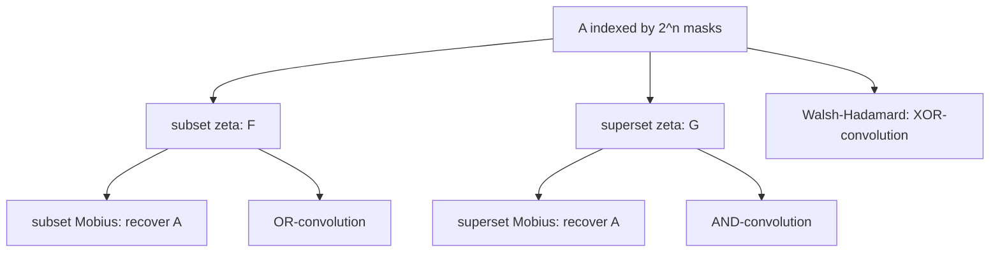

# Sum over Subsets DP (SOS DP) — Middle Level

> **Focus:** the superset variant, the Möbius (inverse) transform that undoes the zeta, why SOS *is* inclusion-exclusion, how OR/AND convolutions are built from it, the connection to Yates' multidimensional algorithm, and when each transform direction is the right tool.

---

## Table of Contents

1. [Introduction](#introduction)
2. [Deeper Concepts](#deeper-concepts)
3. [Comparison with Alternatives](#comparison-with-alternatives)
4. [Advanced Patterns](#advanced-patterns)
5. [The Möbius Inverse and Inclusion-Exclusion](#the-möbius-inverse-and-inclusion-exclusion)
6. [Subset/Superset Convolutions Overview](#subsetsuperset-convolutions-overview)
7. [Code Examples](#code-examples)
8. [Error Handling](#error-handling)
9. [Performance Analysis](#performance-analysis)
10. [Best Practices](#best-practices)
11. [Visual Animation](#visual-animation)
12. [Summary](#summary)

---

## Introduction

At junior level the message was one loop: sweep each bit, and masks with that bit set absorb the mask without it, giving `F[mask] = Σ_{sub ⊆ mask} A[sub]` in `O(n · 2^n)`. At middle level you start asking the questions that make SOS a real toolkit:

- The zeta transform *sums* over submasks. How do I *invert* it — recover `A` from `F`?
- What is the **superset** transform, and when do I want it instead?
- Why do people say "SOS DP is just inclusion-exclusion in disguise"?
- How do I multiply two functions over subsets — the **OR-convolution** and **AND-convolution**?
- What does Yates' algorithm have to do with any of this, and how is XOR-convolution (Walsh-Hadamard) related?

These are the questions that separate "I memorized the SOS loop" from "I can pick the right transform and its inverse for the problem in front of me."

---

## Deeper Concepts

### The zeta transform, restated as a prefix sum

Index every mask by its bits `(b_{n-1}, …, b_1, b_0) ∈ {0,1}^n`. The array `A` is then an `n`-dimensional array of shape `2 × 2 × … × 2`. The submask sum

```
F[mask] = Σ_{sub ⊆ mask} A[sub]
```

is precisely the **`n`-dimensional prefix sum** where each axis has length 2 and "prefix" along axis `i` means "bit `i` is 0 or 1, and we sum the 0-entry into the 1-entry". A multidimensional prefix sum is computed by doing a 1-D prefix sum along each axis in turn — and that is exactly the SOS loop. This reframing is the single most useful mental model: **SOS = multidimensional prefix sum on the hypercube `{0,1}^n`.**

### Forward (zeta) and the two directions

There are two zeta transforms, depending on which way containment points:

| Transform | Definition | Set-bit branch reads | Clear-bit branch reads |
|-----------|------------|----------------------|------------------------|
| **Subset (downward) zeta** | `F[mask] = Σ_{sub ⊆ mask} A[sub]` | `F[mask] += F[mask ^ bit]` | — |
| **Superset (upward) zeta** | `G[mask] = Σ_{sup ⊇ mask} A[sup]` | — | `G[mask] += G[mask | bit]` |

In the subset version, a mask *with* bit `i` set pulls from the mask *without* it (its lower neighbor). In the superset version, a mask *without* bit `i` set pulls from the mask *with* it (its upper neighbor). Both run in `O(n · 2^n)`.

### Möbius: the inverse transform

The zeta transform is a linear, invertible map. Its inverse is the **Möbius transform**. Because the zeta sweeps each bit by *adding*, the Möbius undoes it by *subtracting*, in the same loop structure:

```
# subset Möbius inverse: recover A from F where F = subset-zeta(A)
G = copy(F)
for i in 0..n-1:
    for mask in 0..2^n - 1:
        if mask & (1<<i):
            G[mask] -= G[mask ^ (1<<i)]
# now G == A
```

Why subtraction inverts addition here: each bit-`i` sweep of zeta is the linear map "add the bit-cleared neighbor". Its inverse along that single axis is "subtract the bit-cleared neighbor". Composing the per-axis inverses (in any order — the axes are independent) inverts the whole transform. The professional file proves this via the Möbius function `μ(sub, mask) = (-1)^{popcount(mask) - popcount(sub)}` on the subset lattice.

---

## Comparison with Alternatives

### Naive submask enumeration vs SOS DP

| Approach | Time | Space | Good when |
|----------|------|-------|-----------|
| Per-mask submask loop (`(sub-1)&mask`) | `O(3^n)` | `O(2^n)` | you need only a few masks, or as a correctness oracle |
| **SOS DP (zeta)** | `O(n · 2^n)` | `O(2^n)` | you need *all* `2^n` submask sums |
| Recompute each query from scratch | `O(2^popcount)` per query | `O(2^n)` | very few queries |

Concrete numbers:

| `n` | `3^n` | `n · 2^n` | speedup |
|-----|-------|-----------|---------|
| 10 | 59 049 | 10 240 | ~6× |
| 16 | 43 046 721 | 1 048 576 | ~41× |
| 20 | 3 486 784 401 | 20 971 520 | ~166× |
| 22 | ~3.1 × 10^10 | ~9.2 × 10^7 | ~340× |

The gap widens as `n` grows: `3^n / (n·2^n) = (1.5)^n / n`, which explodes. For `n ≥ 16` SOS is the only practical choice when you need all masks.

### When to prefer which transform

| Need | Tool |
|------|------|
| For each mask, sum over its submasks | subset zeta |
| For each mask, sum over its supersets | superset zeta |
| Recover the original `A` from a transformed array | Möbius inverse (matching direction) |
| Inclusion-exclusion over a family of sets | superset zeta / Möbius (see below) |
| `(A ⊛_OR B)`: convolution under OR | subset zeta on both, multiply, subset Möbius |
| `(A ⊛_AND B)`: convolution under AND | superset zeta on both, multiply, superset Möbius |
| `(A ⊛_XOR B)`: convolution under XOR | Walsh-Hadamard transform (Yates, sign variant) |

---

## Advanced Patterns

### Pattern: Superset sum

`G[mask] = Σ_{sup ⊇ mask} A[sup]`. Masks with bit `i` *clear* absorb from the mask with bit `i` set.

#### Go

```go
package main

import "fmt"

func supersetSum(A []int64, n int) []int64 {
	size := 1 << n
	G := make([]int64, size)
	copy(G, A)
	for i := 0; i < n; i++ {
		bit := 1 << i
		for mask := 0; mask < size; mask++ {
			if mask&bit == 0 { // bit i is CLEAR
				G[mask] += G[mask|bit]
			}
		}
	}
	return G
}

func main() {
	n := 3
	A := []int64{1, 2, 3, 4, 5, 6, 7, 8}
	G := supersetSum(A, n)
	fmt.Println("G[0] =", G[0]) // sum over all supersets of 000 = total = 36
	fmt.Println("G[5] =", G[5]) // supersets of 101: 101,111 -> A5+A7 = 6+8 = 14
}
```

#### Java

```java
public class SupersetSum {
    static long[] supersetSum(long[] A, int n) {
        int size = 1 << n;
        long[] G = A.clone();
        for (int i = 0; i < n; i++) {
            int bit = 1 << i;
            for (int mask = 0; mask < size; mask++) {
                if ((mask & bit) == 0) {   // bit i clear
                    G[mask] += G[mask | bit];
                }
            }
        }
        return G;
    }

    public static void main(String[] args) {
        int n = 3;
        long[] A = {1, 2, 3, 4, 5, 6, 7, 8};
        long[] G = supersetSum(A, n);
        System.out.println("G[0] = " + G[0]); // 36
        System.out.println("G[5] = " + G[5]); // 14
    }
}
```

#### Python

```python
def superset_sum(A, n):
    G = A[:]
    for i in range(n):
        bit = 1 << i
        for mask in range(1 << n):
            if not (mask & bit):       # bit i clear
                G[mask] += G[mask | bit]
    return G


if __name__ == "__main__":
    n = 3
    A = [1, 2, 3, 4, 5, 6, 7, 8]
    G = superset_sum(A, n)
    print("G[0] =", G[0])  # 36 (supersets of empty set = everything)
    print("G[5] =", G[5])  # supersets of 101: 101,111 -> 6+8 = 14
```

### Pattern: Möbius inverse (recover A)

Apply the zeta, do whatever you need, then invert to recover the original per-mask values.

#### Python

```python
def subset_zeta(A, n):
    F = A[:]
    for i in range(n):
        bit = 1 << i
        for mask in range(1 << n):
            if mask & bit:
                F[mask] += F[mask ^ bit]
    return F


def subset_mobius(F, n):
    """Inverse of subset_zeta: returns A given F = subset_zeta(A)."""
    A = F[:]
    for i in range(n):
        bit = 1 << i
        for mask in range(1 << n):
            if mask & bit:
                A[mask] -= A[mask ^ bit]
    return A


if __name__ == "__main__":
    n = 3
    A = [1, 2, 3, 4, 5, 6, 7, 8]
    F = subset_zeta(A, n)
    back = subset_mobius(F, n)
    assert back == A, (back, A)
    print("round-trip OK:", back)
```

### Pattern: counting "supersets present" (a common DP)

If `cnt[mask]` counts how many input elements equal exactly `mask`, then `superset_sum(cnt)[mask]` counts how many input elements are *supersets* of `mask`. This answers queries like "how many people have all of these skills (and possibly more)?" in `O(1)` after one `O(n·2^n)` precompute.



---

## The Möbius Inverse and Inclusion-Exclusion

### SOS is literally inclusion-exclusion

Inclusion-exclusion computes the size of a union (or intersection) by adding and subtracting overlaps with alternating signs. On the subset lattice, the **Möbius function** is `μ(sub, mask) = (-1)^{popcount(mask) - popcount(sub)}` when `sub ⊆ mask` (and `0` otherwise). The Möbius inversion formula says:

```
if   F[mask] = Σ_{sub ⊆ mask} A[sub]    (zeta)
then A[mask] = Σ_{sub ⊆ mask} (-1)^{popcount(mask)-popcount(sub)} F[sub]   (Möbius)
```

That alternating `(-1)^{difference in popcount}` is exactly the inclusion-exclusion sign pattern. So the SOS Möbius transform is inclusion-exclusion executed efficiently: instead of an `O(3^n)` signed sum, the bit-by-bit subtraction does it in `O(n · 2^n)`.

### A concrete inclusion-exclusion example

"How many integers in `[1, N]` are divisible by *none* of a set of primes" is classic inclusion-exclusion. Encode each subset of primes as a mask; let `A[mask]` = `floor(N / product of primes in mask)` = count divisible by all of them. The number divisible by *none* is `Σ_mask (-1)^{popcount(mask)} A[mask]`. When the same `A` must be aggregated over containment for *every* mask (not just the full set), the SOS Möbius transform delivers all those signed sums at once.

### Direction matters: which Möbius inverts which zeta

- **Subset zeta** (`F = Σ_{sub⊆mask} A[sub]`) is inverted by the **subset Möbius** (subtract bit-cleared neighbor).
- **Superset zeta** (`G = Σ_{sup⊇mask} A[sup]`) is inverted by the **superset Möbius** (subtract bit-set neighbor).

Mixing a subset zeta with a superset Möbius does **not** invert; it computes a different, usually meaningless, transform. Keep each (zeta, Möbius) pair matched.

---

## Subset/Superset Convolutions Overview

A **set convolution** combines two functions over subsets under some bitwise operation. The general recipe for OR and AND is: transform both inputs, multiply pointwise, transform back.

### OR-convolution

```
(A ⊛_OR B)[mask] = Σ_{i | j = mask} A[i] · B[j]
```

The OR of `i` and `j` is `mask` iff both `i ⊆ mask` and `j ⊆ mask` *and together they cover `mask`*. The key identity: the **subset zeta** is a homomorphism for OR — `zeta(A ⊛_OR B) = zeta(A) · zeta(B)` pointwise. So:

1. `Fa = subset_zeta(A)`, `Fb = subset_zeta(B)`.
2. `Fc[mask] = Fa[mask] · Fb[mask]` for all masks.
3. `C = subset_mobius(Fc)`.

The reason it works: `zeta(A)[mask] = Σ_{i ⊆ mask} A[i]`, and the product `zeta(A)[mask]·zeta(B)[mask] = Σ_{i ⊆ mask, j ⊆ mask} A[i]B[j] = Σ_{i|j ⊆ mask} A[i]B[j]`, which is the subset-zeta of the OR-convolution. Möbius then recovers the convolution itself.

### AND-convolution

```
(A ⊛_AND B)[mask] = Σ_{i & j = mask} A[i] · B[j]
```

Same recipe with the **superset** transform: `superset_zeta(A ⊛_AND B) = superset_zeta(A) · superset_zeta(B)`. Transform both with the superset zeta, multiply pointwise, invert with the superset Möbius. (Intuition: `i & j ⊇ mask` iff both `i ⊇ mask` and `j ⊇ mask`.)

### XOR-convolution (Walsh-Hadamard) — a different transform

```
(A ⊛_XOR B)[mask] = Σ_{i ^ j = mask} A[i] · B[j]
```

XOR does **not** use the zeta/Möbius pair. It uses the **Walsh-Hadamard Transform (WHT)**, which is the *signed* sibling in the same Yates family: for each bit `i`, the pair `(F[mask without i], F[mask with i])` is replaced by `(x + y, x - y)`. After WHT both inputs, multiply pointwise, then apply the inverse WHT (same butterfly, divide by `2^n`). All three convolutions are `O(n · 2^n)` because all three transforms are Yates' algorithm with different `2×2` "butterfly" matrices.

### Subset-sum convolution (the "exact-union, disjoint" version)

A subtler convolution requires `i & j = 0` (disjoint) *and* `i | j = mask`:

```
(A ⊛_subset B)[mask] = Σ_{i | j = mask, i & j = 0} A[i] · B[j]
```

This is the true "subset-sum convolution" used in fast subset-sum DP (e.g. graph-coloring counting). It is solved by adding a *popcount rank* dimension: do OR-convolution but track `popcount` so that only disjoint pairs (where the popcounts add exactly) survive. The cost becomes `O(n^2 · 2^n)`. This is the powerful generalization that OR-convolution alone cannot express, and it is the basis of many `2^n · poly(n)` algorithms.

---

## Code Examples

### OR-convolution end to end

#### Go

```go
package main

import "fmt"

func subsetZeta(a []int64, n int) []int64 {
	f := make([]int64, len(a))
	copy(f, a)
	for i := 0; i < n; i++ {
		bit := 1 << i
		for m := 0; m < len(f); m++ {
			if m&bit != 0 {
				f[m] += f[m^bit]
			}
		}
	}
	return f
}

func subsetMobius(f []int64, n int) []int64 {
	a := make([]int64, len(f))
	copy(a, f)
	for i := 0; i < n; i++ {
		bit := 1 << i
		for m := 0; m < len(a); m++ {
			if m&bit != 0 {
				a[m] -= a[m^bit]
			}
		}
	}
	return a
}

func orConvolution(a, b []int64, n int) []int64 {
	fa := subsetZeta(a, n)
	fb := subsetZeta(b, n)
	fc := make([]int64, len(a))
	for m := range fc {
		fc[m] = fa[m] * fb[m]
	}
	return subsetMobius(fc, n)
}

func main() {
	n := 2
	a := []int64{1, 2, 3, 4} // indices 00,01,10,11
	b := []int64{5, 6, 7, 8}
	c := orConvolution(a, b, n)
	fmt.Println("OR-conv:", c)
}
```

#### Java

```java
public class OrConvolution {
    static long[] subsetZeta(long[] a, int n) {
        long[] f = a.clone();
        for (int i = 0; i < n; i++) {
            int bit = 1 << i;
            for (int m = 0; m < f.length; m++)
                if ((m & bit) != 0) f[m] += f[m ^ bit];
        }
        return f;
    }

    static long[] subsetMobius(long[] f, int n) {
        long[] a = f.clone();
        for (int i = 0; i < n; i++) {
            int bit = 1 << i;
            for (int m = 0; m < a.length; m++)
                if ((m & bit) != 0) a[m] -= a[m ^ bit];
        }
        return a;
    }

    static long[] orConvolution(long[] a, long[] b, int n) {
        long[] fa = subsetZeta(a, n), fb = subsetZeta(b, n);
        long[] fc = new long[a.length];
        for (int m = 0; m < fc.length; m++) fc[m] = fa[m] * fb[m];
        return subsetMobius(fc, n);
    }

    public static void main(String[] args) {
        int n = 2;
        long[] a = {1, 2, 3, 4};
        long[] b = {5, 6, 7, 8};
        long[] c = orConvolution(a, b, n);
        System.out.print("OR-conv: ");
        for (long v : c) System.out.print(v + " ");
        System.out.println();
    }
}
```

#### Python

```python
def subset_zeta(a, n):
    f = a[:]
    for i in range(n):
        bit = 1 << i
        for m in range(len(f)):
            if m & bit:
                f[m] += f[m ^ bit]
    return f


def subset_mobius(f, n):
    a = f[:]
    for i in range(n):
        bit = 1 << i
        for m in range(len(a)):
            if m & bit:
                a[m] -= a[m ^ bit]
    return a


def or_convolution(a, b, n):
    fa, fb = subset_zeta(a, n), subset_zeta(b, n)
    fc = [fa[m] * fb[m] for m in range(len(a))]
    return subset_mobius(fc, n)


if __name__ == "__main__":
    n = 2
    a = [1, 2, 3, 4]   # 00,01,10,11
    b = [5, 6, 7, 8]
    print("OR-conv:", or_convolution(a, b, n))
    # check element 11: pairs (i,j) with i|j=11 over all i,j -> verified by brute force
```

### Walsh-Hadamard (XOR-convolution)

#### Python

```python
def wht(a):
    """In-place Walsh-Hadamard transform (XOR). len(a) must be a power of two."""
    a = a[:]
    h = 1
    while h < len(a):
        for i in range(0, len(a), h * 2):
            for j in range(i, i + h):
                x, y = a[j], a[j + h]
                a[j], a[j + h] = x + y, x - y
        h *= 2
    return a


def xor_convolution(a, b):
    n = len(a)
    fa, fb = wht(a), wht(b)
    fc = [fa[i] * fb[i] for i in range(n)]
    inv = wht(fc)
    return [v // n for v in inv]   # inverse WHT divides by n


if __name__ == "__main__":
    a = [1, 2, 3, 4]
    b = [5, 6, 7, 8]
    print("XOR-conv:", xor_convolution(a, b))
```

The WHT butterfly `(x+y, x-y)` is the *signed* analogue of the SOS `(x, x+y)` butterfly — same Yates structure, different `2×2` matrix.

---

## Error Handling

| Scenario | What goes wrong | Correct approach |
|----------|-----------------|------------------|
| Mismatched zeta/Möbius direction | Subset zeta inverted with superset Möbius → wrong `A`. | Keep matched pairs; subset↔subset, superset↔superset. |
| Forgot to divide in inverse WHT | XOR-convolution off by a factor of `2^n`. | Inverse WHT divides every entry by `2^n`. |
| Overflow in convolution | Products `Fa·Fb` blow up. | Reduce mod `p` after the multiply and inside each transform. |
| Negative residues after Möbius | Subtraction under a modulus yields negatives. | Normalize with `((x % p) + p) % p`. |
| In-place clobber across transforms | Re-used the same array for `A` and `F`. | Clone before transforming if both are needed. |
| Wrong convolution for the bitwise op | Used subset zeta for an AND-convolution. | OR→subset, AND→superset, XOR→WHT. |

---

## Performance Analysis

| `n` | one transform `O(n·2^n)` | OR-conv (`2 zeta + mult + 1 mobius`) |
|-----|--------------------------|--------------------------------------|
| 12 | ~49 K ops | ~200 K ops — instant |
| 16 | ~1 M ops | ~4.2 M ops — instant |
| 18 | ~4.7 M ops | ~19 M ops — well under a second |
| 20 | ~21 M ops | ~84 M ops — fraction of a second (compiled) |
| 22 | ~92 M ops | ~370 M ops — a second or two |

The dominant cost is the `2^n` array size; the `n` factor is small. SOS is excellent for `n ≤ ~20–22` and infeasible beyond `n ≈ 24` purely on memory (`2^24 · 8` bytes = 128 MB per array). The subset-sum convolution adds an `n` factor (popcount-ranked), giving `O(n^2 · 2^n)` — still feasible to `n ≈ 20`.

```python
import time

def benchmark(n):
    import random
    A = [random.randint(0, 1000) for _ in range(1 << n)]
    start = time.perf_counter()
    _ = subset_zeta(A, n)
    return time.perf_counter() - start

# Typical: n=20 -> well under a second in CPython; far faster compiled.
```

The biggest constant-factor lever is keeping `F` a flat array of machine integers and the bit loop outermost (sequential memory sweeps, predictable branches).

---

## Best Practices

- **Match the direction to the question:** submask aggregation → subset zeta; superset aggregation → superset zeta; convolution → the transform that is a homomorphism for that bitwise op.
- **Pair zeta with its own Möbius:** never invert a subset zeta with a superset Möbius.
- **Reduce mod `p` consistently** in counting problems; normalize negatives after Möbius subtraction.
- **Test against the `O(3^n)` oracle** and a brute-force convolution on small `n`.
- **Clone before transforming in place** if you still need the original `A`.
- **Recognize the prefix-sum reframing:** SOS is the hypercube prefix sum; that mental model prevents most direction bugs.

---

## Visual Animation

> See [`animation.html`](./animation.html) for an interactive view.
>
> The middle-level animation highlights:
> - The bit-by-bit relaxation, with masks pulling from `mask ^ (1<<i)` (subset) shown across the bitmask grid.
> - How the partial sums chain forward from one bit dimension to the next.
> - The interpretation of a finished cell as the full submask sum, and the contrast with the superset direction.

---

## Summary

The SOS DP is one bit-relaxation loop with four faces. The **subset zeta** sums over submasks; the **superset zeta** sums over supersets; the matching **Möbius inverse** (same loop with subtraction) recovers the original array and *is* inclusion-exclusion executed in `O(n · 2^n)` instead of `O(3^n)`, with the alternating sign `(-1)^{Δpopcount}` being exactly the lattice Möbius function. On top of these, **OR-convolution** (subset zeta is a homomorphism for OR), **AND-convolution** (superset zeta for AND), and **XOR-convolution** (the signed Walsh-Hadamard butterfly) are all the same `O(n · 2^n)` Yates "dimension-by-dimension" algorithm with different `2×2` butterflies. The deepest unifying idea is that SOS is the **multidimensional prefix sum on the hypercube `{0,1}^n`**; once you see it that way, choosing the transform, its inverse, and the right convolution becomes mechanical.
