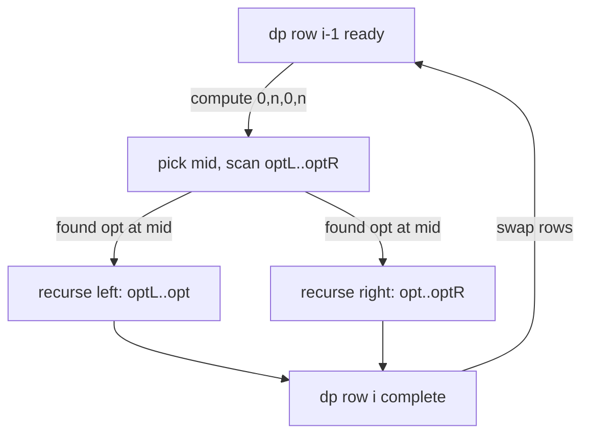

# Divide and Conquer DP Optimization — Junior Level

> **One-line summary:** When a DP has the shape `dp[i][j] = min over k < j of ( dp[i-1][k] + C(k, j) )` and the best split point `opt(i, j)` only ever moves **right** as `j` grows, you can fill an entire DP row in `O(n log n)` instead of `O(n²)` with a recursion that computes the middle column first and uses its optimum to shrink the search range for the halves.

---

## Table of Contents

1. [Introduction](#introduction)
2. [Prerequisites](#prerequisites)
3. [Glossary](#glossary)
4. [Core Concepts](#core-concepts)
5. [Big-O Summary](#big-o-summary)
6. [Real-World Analogies](#real-world-analogies)
7. [Pros & Cons](#pros--cons)
8. [Step-by-Step Walkthrough](#step-by-step-walkthrough)
9. [Code Examples](#code-examples)
10. [Coding Patterns](#coding-patterns)
11. [Error Handling](#error-handling)
12. [Performance Tips](#performance-tips)
13. [Best Practices](#best-practices)
14. [Edge Cases & Pitfalls](#edge-cases--pitfalls)
15. [Common Mistakes](#common-mistakes)
16. [Cheat Sheet](#cheat-sheet)
17. [Visual Animation](#visual-animation)
18. [Summary](#summary)
19. [Further Reading](#further-reading)

---

## Introduction

Suppose you must cut an array of `n` numbers into exactly `i` contiguous segments, and every segment has a *cost* (say, the squared sum of its elements, or the variance, or some penalty). You want the split that minimizes the **total** cost over all `i` segments. That is a classic dynamic-programming problem with the recurrence:

```
dp[i][j] = best total cost of covering the first j elements with exactly i segments
         = min over k < j of ( dp[i-1][k] + C(k, j) )
```

Here `dp[i-1][k]` is the best cost of covering the first `k` elements with `i-1` segments, and `C(k, j)` is the cost of the single segment that spans elements `k, k+1, …, j-1` (the `i`-th segment). The variable `k` is the **split point**: it says "the previous `i-1` segments ended at `k`, and the last segment runs from `k` to `j`."

The straightforward way to evaluate this recurrence tries **every** split point `k` for **every** column `j`, in **every** layer `i`. That is `O(k · n²)` total (with `k` layers and `n²` work per layer). For `n = 10^5` and a handful of layers, `n²` is ten billion operations per layer — far too slow.

There is a beautiful shortcut. For many natural cost functions, the **optimal split point** `opt(i, j)` — the value of `k` that achieves the minimum for cell `dp[i][j]` — is **monotonically non-decreasing in `j`**:

> **`opt(i, j) ≤ opt(i, j+1)`** — as the right end `j` moves right, the best place to cut never moves left.

When that holds, you do not have to scan all of `[0, j)` for each `j`. Instead you fill one DP row with a **divide-and-conquer** recursion: compute the middle column `mid` first by scanning its allowed split range, learn `opt(i, mid)`, and then recurse on the left half knowing its optima lie in `[optL, opt(i, mid)]` and on the right half knowing its optima lie in `[opt(i, mid), optR]`. Each level of the recursion does `O(n)` total split-scanning work, and there are `O(log n)` levels, so one row costs `O(n log n)`. With `k` layers, the whole DP is **`O(k · n log n)`**.

This single idea connects to two sibling optimizations you will meet right next door:

- **Knuth's optimization** (sibling topic `12`) speeds up a *different* DP shape — `dp[i][j] = min over i < k < j of ( dp[i][k] + dp[k][j] ) + C(i, j)` — using a *two-sided* monotonicity bound `opt(i, j-1) ≤ opt(i, j) ≤ opt(i+1, j)`, getting `O(n²)` from `O(n³)`.
- **The Convex Hull Trick** (sibling topic `10`) speeds up DPs where the cost factors into a *linear* form `dp[j] = min ( dp[k] + a[k]·x[j] + b[k] )`, using a hull of lines instead of monotonic split points.

Divide-and-conquer optimization sits between them: it needs only the *one-sided* monotonicity of `opt`, and it does not require the cost to be linear — just that the optimal split moves in one direction.

---

## Prerequisites

Before reading this file you should be comfortable with:

- **Dynamic programming basics** — states, transitions, base cases, filling a table. (See the rest of `13-dynamic-programming`.)
- **The "partition into segments" DP** — the recurrence `dp[i][j] = min_k ( dp[i-1][k] + C(k, j) )`. This is our running example.
- **Recursion and divide-and-conquer** — splitting a range at its midpoint and recursing on the halves (think merge sort).
- **Prefix sums** — computing a range sum in `O(1)` after an `O(n)` preprocessing pass, used so the cost `C(k, j)` is cheap.
- **Big-O notation** — `O(n²)`, `O(n log n)`, `O(k · n log n)`.

Optional but helpful:

- A glance at **Knuth's optimization** (sibling `12`) and the **Convex Hull Trick** (sibling `10`), so you can place this technique among its siblings.
- Familiarity with the idea of a **cost function** that you can evaluate for any sub-segment.

---

## Glossary

| Term | Meaning |
|------|---------|
| **Layer / row `i`** | The number of segments used so far. `dp[i][·]` is computed from `dp[i-1][·]`. |
| **Column `j`** | The right boundary: `dp[i][j]` covers the first `j` elements. |
| **Split point `k`** | Where the previous layer ended; the last segment spans `[k, j)`. We minimize over `k`. |
| **`C(k, j)`** | The cost of the single segment covering elements `k, …, j-1`. Often computed with prefix sums in `O(1)`. |
| **`opt(i, j)`** | The split point `k` that achieves the minimum for `dp[i][j]` (the **argmin**). If several tie, take the smallest. |
| **Monotonicity (of `opt`)** | The property `opt(i, j) ≤ opt(i, j+1)`: the best split never moves left as `j` increases. |
| **Quadrangle inequality / Monge condition** | A sufficient condition on `C` that *guarantees* the monotonicity of `opt`. Defined below. |
| **`compute(l, r, optL, optR)`** | The recursion that fills columns `l..r` of one row, knowing their optima lie in `[optL, optR]`. |
| **`opt(i, mid)`** | The optimum found for the middle column; it splits the search ranges for the two halves. |

---

## Core Concepts

### 1. The DP Shape We Are Optimizing

We focus on recurrences of the form:

```
dp[i][j] = min over k in [0, j)  of  ( dp[i-1][k] + C(k, j) )
```

- `i` runs over **layers** (number of segments), `1 ≤ i ≤ K`.
- `j` runs over **columns** (prefix length), `0 ≤ j ≤ n`.
- `dp[0][0] = 0` and `dp[0][j] = +∞` for `j > 0` (zero segments cover only the empty prefix).
- `C(k, j)` is the cost of one segment spanning `[k, j)`.

The answer is usually `dp[K][n]` (cover all `n` elements with exactly `K` segments).

### 2. The Optimal Split Point `opt(i, j)`

For each cell, *some* split point `k` achieves the minimum. Call it `opt(i, j)`:

```
opt(i, j) = the k in [0, j) that minimizes dp[i-1][k] + C(k, j)
```

If several `k` tie, we conventionally pick the smallest. The whole optimization rests on **where these argmins sit**.

### 3. The Monotonicity Property

The key structural fact is:

> **`opt(i, j) ≤ opt(i, j + 1)` for every `j`** (within a fixed layer `i`).

In words: as the right boundary `j` slides right, the best split point for the last segment never slides left. It can stay or move right, never back. This is exactly the property that lets us avoid re-scanning the whole range for each column.

### 4. Why Monotonicity Buys Speed

Suppose you know `opt(i, j) = p`. Then for any column `j' < j`, the optimum `opt(i, j')` lies in `[0, p]` (it cannot exceed `p`). And for any column `j'' > j`, the optimum lies in `[p, j'')`. So computing one column *constrains* the search range of its neighbors. The divide-and-conquer recursion exploits this:

1. Pick the middle column `mid = (l + r) / 2`.
2. Scan its allowed split range `[optL, min(mid, optR)]` to find `dp[i][mid]` and `opt(i, mid)`.
3. Recurse **left** on `[l, mid-1]` with split range `[optL, opt(i, mid)]`.
4. Recurse **right** on `[mid+1, r]` with split range `[opt(i, mid), optR]`.

### 5. The Quadrangle (Monge) Sufficient Condition

How do you *know* `opt` is monotone? A clean sufficient condition is the **quadrangle inequality** (also called the Monge condition) on the cost `C`:

```
C(a, c) + C(b, d) ≤ C(a, d) + C(b, c)   for all  a ≤ b ≤ c ≤ d
```

If `C` satisfies this, then `opt(i, j)` is guaranteed non-decreasing in `j`, and divide-and-conquer optimization is provably correct. Many natural costs satisfy it — for example, costs built from sums of a convex function over the segment, or `C(k, j) = (prefix[j] - prefix[k])²`-style penalties. The full proof lives in [`professional.md`](./professional.md); at this level, just remember: **quadrangle inequality on `C` ⟹ monotone `opt` ⟹ divide-and-conquer works.**

### 6. The Naive `O(k · n²)` vs the Optimized `O(k · n log n)`

The naive evaluation scans every `k` for every `(i, j)`:

```
for i in 1..K:
    for j in 0..n:
        for k in 0..j-1:
            dp[i][j] = min(dp[i][j], dp[i-1][k] + C(k, j))
```

That inner double loop is `O(n²)` per layer. The optimization replaces the `j`-and-`k` double loop with one `compute(0, n, 0, n)` call that does `O(n log n)` work per layer. Same answer, dramatically faster.

---

## Big-O Summary

| Operation | Time | Space | Notes |
|-----------|------|-------|-------|
| Naive fill of one row (all `j`, all `k`) | **O(n²)** | O(n) | Triple loop overall; scans every split. |
| Divide-and-conquer fill of one row | **O(n log n)** | O(n) | `compute` recursion; `O(n)` scan per level, `log n` levels. |
| Full DP, `K` layers, naive | O(K · n²) | O(n) or O(K·n) | Each layer `O(n²)`. |
| Full DP, `K` layers, optimized | **O(K · n log n)** | O(n) or O(K·n) | Each layer `O(n log n)`. |
| One cost evaluation `C(k, j)` | O(1) | — | With prefix sums; otherwise add its cost as a factor. |
| Verifying monotonicity empirically | O(n²) | O(n) | Brute-force `opt` table; do this only in tests. |

The headline number is **`O(K · n log n)`** — a `log n` factor instead of an `n` factor per column, which is the whole reason this technique exists.

---

## Real-World Analogies

| Concept | Analogy |
|---------|---------|
| Splitting an array into `K` segments | Cutting a long ribbon into `K` pieces, where each piece has a "waste" cost depending on its length. |
| Optimal split `opt(i, j)` | The best place to make the last cut for a ribbon of length `j`. |
| Monotonicity of `opt` | If a longer ribbon's best last cut is at position `p`, a slightly longer ribbon never wants its last cut *before* `p` — only at `p` or later. |
| Divide-and-conquer fill | A surveyor measures the middle milestone first, which tells crews on the left and right exactly which stretch of road to inspect — nobody re-walks the whole road. |
| Quadrangle inequality | A "no crossing" rule: two nested intervals are never cheaper than two crossing ones, which is why the best cuts line up in order. |
| `O(n log n)` per row | Like merge sort: divide the columns, do `O(n)` work per level, `log n` levels. |

Where the analogy breaks: real ribbons don't have an abstract cost function with a quadrangle inequality; the analogy is just to fix the intuition that "the best last cut drifts rightward as the piece grows."

---

## Pros & Cons

| Pros | Cons |
|------|------|
| Cuts a row from `O(n²)` to `O(n log n)` — a huge win for large `n`. | Only applies when `opt` is **monotone**; you must verify (often via the quadrangle inequality). |
| Needs only **one-sided** monotonicity (unlike Knuth, which needs two-sided). | Does not reduce the number of *layers* `K`; total is `O(K · n log n)`. |
| Cost function `C` can be arbitrary (not necessarily linear, unlike CHT). | Each `C(k, j)` evaluation must be cheap (ideally `O(1)`), or the cost-eval factor inflates everything. |
| Simple recursion; no heavy data structures (no hull, no segment tree). | Subtle to get the split-range bounds right; off-by-one bugs are easy. |
| Plays well with rolling two rows of `dp` to save memory. | If monotonicity *fails*, the answer is silently wrong — no crash, just garbage. |

**When to use:** layered partition DPs `dp[i][j] = min_k ( dp[i-1][k] + C(k, j) )` where `C` satisfies the quadrangle inequality (or where you empirically confirm `opt` is monotone), with large `n` and small/medium `K`.

**When NOT to use:** when the optimum is *not* monotone (then the answer is wrong); when the cost factors linearly (use CHT, sibling `10`); when the DP has the interval shape `dp[i][k] + dp[k][j]` (use Knuth, sibling `12`); when `n` is tiny (the naive `O(n²)` is simpler and fast enough).

---

## Step-by-Step Walkthrough

Let us split the array `a = [1, 3, 2, 4]` into `K = 2` contiguous segments, minimizing the sum of `(segment sum)²`.

First, prefix sums `P` so segment `[k, j)` has sum `P[j] - P[k]`:

```
a    = [ 1,  3,  2,  4 ]
P    = [ 0,  1,  4,  6, 10 ]      (P[0]=0, P[t] = a[0]+...+a[t-1])
C(k,j) = (P[j] - P[k])²
```

**Layer 0 (base case).** `dp[0][0] = 0`, and `dp[0][j] = +∞` for `j > 0`.

**Layer 1.** `dp[1][j] = min over k of ( dp[0][k] + C(k, j) )`. Since `dp[0][k]` is `+∞` except at `k = 0`, the only usable split is `k = 0`:

```
dp[1][1] = C(0,1) = (1)²  = 1     opt(1,1) = 0
dp[1][2] = C(0,2) = (4)²  = 16    opt(1,2) = 0
dp[1][3] = C(0,3) = (6)²  = 36    opt(1,3) = 0
dp[1][4] = C(0,4) = (10)² = 100   opt(1,4) = 0
```

**Layer 2 — the interesting one.** `dp[2][j] = min over k of ( dp[1][k] + C(k, j) )`. We want `dp[2][4]` (cover all 4 elements with 2 segments). Let us run `compute(2, 4, 0, 4)` for columns `j ∈ {2, 3, 4}` (a 2-segment cover needs `j ≥ 2`).

`mid = (2 + 4) / 2 = 3`. Scan `k ∈ [0, 3)` for column 3:

```
k=1: dp[1][1] + C(1,3) = 1  + (P[3]-P[1])² = 1  + (6-1)²  = 1  + 25 = 26
k=2: dp[1][2] + C(2,3) = 16 + (P[3]-P[2])² = 16 + (6-4)²  = 16 + 4  = 20   <- best
```

So `dp[2][3] = 20` and `opt(2, 3) = 2`.

Recurse **left** on column `j = 2` with split range `[0, opt(2,3)] = [0, 2]`:

```
k=1: dp[1][1] + C(1,2) = 1 + (P[2]-P[1])² = 1 + (4-1)² = 1 + 9 = 10   <- best
```

(`k = 0` gives `dp[1][0] = +∞`; `k = 2` is not `< j = 2`.) So `dp[2][2] = 10`, `opt(2,2) = 1`. Note `opt(2,2) = 1 ≤ opt(2,3) = 2` — monotonicity holds.

Recurse **right** on column `j = 4` with split range `[opt(2,3), 4] = [2, 4]`:

```
k=2: dp[1][2] + C(2,4) = 16 + (P[4]-P[2])² = 16 + (10-4)² = 16 + 36 = 52
k=3: dp[1][3] + C(3,4) = 36 + (P[4]-P[3])² = 36 + (10-6)² = 36 + 16 = 52
```

Both tie at `52`; take the smaller `k`, so `dp[2][4] = 52`, `opt(2,4) = 2`. Again `opt(2,4) = 2 ≥ opt(2,3) = 2`.

**Answer:** `dp[2][4] = 52` — split as `[1, 3] | [2, 4]` with costs `4² + 6² = 16 + 36 = 52`. The optima `opt(2, ·) = (·, 1, 2, 2)` are non-decreasing, exactly as the theory promised, and we never scanned a split point outside the narrowing ranges.

---

## Code Examples

### Example: Partition Array into `K` Segments Minimizing Sum of Squared Segment Sums

This builds prefix sums, then fills each layer with the `compute(l, r, optL, optR)` recursion.

#### Go

```go
package main

import "fmt"

const INF = int64(1) << 62

var (
	prefix []int64 // prefix[j] = a[0]+...+a[j-1]
	dpPrev []int64 // dp[i-1][*]
	dpCur  []int64 // dp[i][*]
	n      int
)

// cost of segment [k, j): (sum of a[k..j-1])^2
func cost(k, j int) int64 {
	s := prefix[j] - prefix[k]
	return s * s
}

// compute fills dpCur[l..r], knowing opt(j) in [optL, optR].
func compute(l, r, optL, optR int) {
	if l > r {
		return
	}
	mid := (l + r) / 2
	best := INF
	bestK := optL
	hi := optR
	if hi > mid-1 { // last segment must be non-empty: k < mid
		hi = mid - 1
	}
	for k := optL; k <= hi; k++ {
		if dpPrev[k] >= INF {
			continue
		}
		v := dpPrev[k] + cost(k, mid)
		if v < best {
			best = v
			bestK = k
		}
	}
	dpCur[mid] = best
	compute(l, mid-1, optL, bestK)
	compute(mid+1, r, bestK, optR)
}

func partition(a []int, K int) int64 {
	n = len(a)
	prefix = make([]int64, n+1)
	for i := 0; i < n; i++ {
		prefix[i+1] = prefix[i] + int64(a[i])
	}
	dpPrev = make([]int64, n+1)
	dpCur = make([]int64, n+1)
	for j := 0; j <= n; j++ {
		dpPrev[j] = INF
	}
	dpPrev[0] = 0 // dp[0][0] = 0
	for i := 1; i <= K; i++ {
		for j := 0; j <= n; j++ {
			dpCur[j] = INF
		}
		compute(0, n, 0, n) // fill row i over columns 0..n
		dpPrev, dpCur = dpCur, dpPrev
	}
	return dpPrev[n]
}

func main() {
	a := []int{1, 3, 2, 4}
	fmt.Println(partition(a, 2)) // 52
}
```

#### Java

```java
public class DivideConquerDP {
    static final long INF = 1L << 62;
    static long[] prefix, dpPrev, dpCur;
    static int n;

    static long cost(int k, int j) {
        long s = prefix[j] - prefix[k];
        return s * s;
    }

    static void compute(int l, int r, int optL, int optR) {
        if (l > r) return;
        int mid = (l + r) / 2;
        long best = INF;
        int bestK = optL;
        int hi = Math.min(optR, mid - 1); // k < mid
        for (int k = optL; k <= hi; k++) {
            if (dpPrev[k] >= INF) continue;
            long v = dpPrev[k] + cost(k, mid);
            if (v < best) { best = v; bestK = k; }
        }
        dpCur[mid] = best;
        compute(l, mid - 1, optL, bestK);
        compute(mid + 1, r, bestK, optR);
    }

    static long partition(int[] a, int K) {
        n = a.length;
        prefix = new long[n + 1];
        for (int i = 0; i < n; i++) prefix[i + 1] = prefix[i] + a[i];
        dpPrev = new long[n + 1];
        dpCur = new long[n + 1];
        java.util.Arrays.fill(dpPrev, INF);
        dpPrev[0] = 0;
        for (int i = 1; i <= K; i++) {
            java.util.Arrays.fill(dpCur, INF);
            compute(0, n, 0, n);
            long[] tmp = dpPrev; dpPrev = dpCur; dpCur = tmp;
        }
        return dpPrev[n];
    }

    public static void main(String[] args) {
        int[] a = {1, 3, 2, 4};
        System.out.println(partition(a, 2)); // 52
    }
}
```

#### Python

```python
import sys

INF = 1 << 62


def partition(a, K):
    n = len(a)
    prefix = [0] * (n + 1)
    for i in range(n):
        prefix[i + 1] = prefix[i] + a[i]

    def cost(k, j):
        s = prefix[j] - prefix[k]
        return s * s

    dp_prev = [INF] * (n + 1)
    dp_prev[0] = 0
    dp_cur = [INF] * (n + 1)

    def compute(l, r, opt_l, opt_r):
        if l > r:
            return
        mid = (l + r) // 2
        best = INF
        best_k = opt_l
        hi = min(opt_r, mid - 1)  # k < mid
        for k in range(opt_l, hi + 1):
            if dp_prev[k] >= INF:
                continue
            v = dp_prev[k] + cost(k, mid)
            if v < best:
                best, best_k = v, k
        dp_cur[mid] = best
        compute(l, mid - 1, opt_l, best_k)
        compute(mid + 1, r, best_k, opt_r)

    for _ in range(K):
        for j in range(n + 1):
            dp_cur[j] = INF
        compute(0, n, 0, n)
        dp_prev, dp_cur = dp_cur, dp_prev
    return dp_prev[n]


if __name__ == "__main__":
    sys.setrecursionlimit(1 << 20)
    a = [1, 3, 2, 4]
    print(partition(a, 2))  # 52
```

**What it does:** builds prefix sums, then runs `K` layers, each filled by one `compute(0, n, 0, n)` recursion. The answer `dp[K][n]` is the minimum total squared-sum cost.
**Run:** `go run main.go` | `javac DivideConquerDP.java && java DivideConquerDP` | `python dcdp.py`

---

## Coding Patterns

### Pattern 1: Brute-Force Row Filler (the oracle you test against)

**Intent:** Before trusting the divide-and-conquer fill, compute the row the slow, obvious way and confirm both give the same `dp` values (and capture the `opt` table to verify monotonicity).

```python
def brute_row(dp_prev, n, cost):
    dp = [1 << 62] * (n + 1)
    opt = [0] * (n + 1)
    for j in range(1, n + 1):
        best, best_k = 1 << 62, 0
        for k in range(j):                 # scan every split
            if dp_prev[k] >= (1 << 62):
                continue
            v = dp_prev[k] + cost(k, j)
            if v < best:
                best, best_k = v, k
        dp[j], opt[j] = best, best_k
    return dp, opt
```

This is `O(n²)` per row. Too slow for large `n`, but perfect as a correctness oracle and for empirically checking that `opt[j] ≤ opt[j+1]`.

### Pattern 2: Recover the Actual Segmentation

**Intent:** Often you need not just the minimum cost but *where the cuts are*. Store the `opt` value chosen at each `(i, j)` (an `opt[i][j]` table), then walk back from `(K, n)` following the recorded split points.

### Pattern 3: Rolling Two Rows to Save Memory

**Intent:** Since row `i` depends only on row `i-1`, keep just `dpPrev` and `dpCur` and swap them each layer. Memory drops from `O(K·n)` to `O(n)` (unless you need the `opt` table for reconstruction).



---

## Error Handling

| Error | Cause | Fix |
|-------|-------|-----|
| Wrong answer, no crash | `opt` is not actually monotone for this `C`. | Verify the quadrangle inequality, or empirically compare against the brute-force oracle. |
| Stack overflow on large `n` | Deep recursion in `compute`. | Raise the recursion limit (Python), or convert to an explicit stack. |
| Off-by-one in split range | Forgot the constraint `k < mid` (non-empty last segment). | Clamp `hi = min(optR, mid - 1)`. |
| `INF + something` overflow | Added a finite cost to an `INF` predecessor. | Skip `k` when `dpPrev[k] >= INF`. |
| Empty range handled wrong | `compute` called with `l > r`. | Return immediately when `l > r`. |
| Picking the wrong tie | Multiple `k` tie; you took the largest. | Keep the **smallest** `k` to preserve the monotonicity invariant. |

---

## Performance Tips

- **Make `C(k, j)` `O(1)`** with prefix sums (or prefix sums of squares, etc.). If a cost evaluation is `O(c)`, every bound becomes `O(K · n log n · c)`.
- **Skip `INF` predecessors** in the inner scan (`if dpPrev[k] >= INF: continue`) — it both avoids overflow and saves work in early layers.
- **Roll two rows** to keep memory at `O(n)` when you do not need to reconstruct the cuts.
- **Avoid re-allocating** `dpCur` each layer; reuse a buffer and just reset it to `INF`.
- **Prefer iteration order that keeps `prefix` cache-hot** — the scan reads `prefix[k]` and `prefix[mid]`, both contiguous.

---

## Best Practices

- Always test the divide-and-conquer fill against the brute-force oracle (Pattern 1) on random small inputs *before* trusting it.
- **Verify monotonicity** explicitly: build the `opt` table with the oracle and assert `opt[j] ≤ opt[j+1]` for every `j`. If it fails, the technique does not apply.
- State the cost function once, clearly, and confirm it satisfies the quadrangle inequality (or document that you verified monotonicity empirically).
- Write `compute` as a small, separately testable function; most bugs hide in the split-range bounds.
- Keep the smallest tying `k` so the recorded optima stay non-decreasing.
- Document whether you need exactly `K` segments or at most `K` — it changes the base case and the answer cell.

---

## Edge Cases & Pitfalls

- **`K = 1`** — one segment covers everything: `dp[1][n] = C(0, n)`. The recursion still works but there is nothing to optimize.
- **`K = n`** — every element is its own segment; make sure the split ranges allow `k = j - 1`.
- **Empty segments** — usually disallowed; enforce `k < j` (and `k < mid` in `compute`).
- **`opt` ties** — always break ties toward the **smaller** `k` so monotonicity is preserved.
- **Cost not satisfying the quadrangle inequality** — the optimum may not be monotone; the result is then silently wrong. This is the single most dangerous pitfall.
- **Recursion depth** — for `n = 10^5`, the recursion is `O(log n)` deep per call chain but the total call tree has `O(n)` nodes; raise language recursion limits where needed.
- **Integer overflow** — squared sums grow fast; use 64-bit and a sentinel `INF` comfortably below the type's max.

---

## Common Mistakes

1. **Applying it without checking monotonicity** — the most common and most dangerous error; the answer is wrong with no crash.
2. **Wrong split-range bounds** — forgetting `k < mid`, or passing `[optL, optR]` instead of the narrowed `[optL, bestK]` / `[bestK, optR]` to the recursive halves.
3. **Breaking ties toward the larger `k`** — can violate the non-decreasing invariant and produce a wrong recursion structure.
4. **Expensive cost function** — calling an `O(n)` cost evaluation inside the scan turns `O(n log n)` into `O(n² log n)`.
5. **Confusing this with Knuth's optimization** — Knuth optimizes the *interval* DP `dp[i][k] + dp[k][j]`, not the *layered* DP `dp[i-1][k] + C(k, j)`.
6. **Forgetting the base case** — `dp[0][0] = 0`, everything else `+∞`; getting this wrong makes layer 1 garbage.
7. **Not skipping `INF` predecessors** — adding a finite cost to `INF` can overflow or pick an impossible split.

---

## Cheat Sheet

| Question | Tool | Formula |
|----------|------|---------|
| DP shape this optimizes | layered partition | `dp[i][j] = min_{k<j} ( dp[i-1][k] + C(k,j) )` |
| Optimal split | argmin | `opt(i,j) = argmin_k ( dp[i-1][k] + C(k,j) )` |
| Monotonicity needed | one-sided | `opt(i,j) ≤ opt(i,j+1)` |
| Sufficient condition | quadrangle / Monge | `C(a,c)+C(b,d) ≤ C(a,d)+C(b,c)`, `a≤b≤c≤d` |
| Per-row cost | divide & conquer | `O(n log n)` |
| Total cost (`K` layers) | — | `O(K · n log n)` |
| Sibling: interval DP | Knuth (topic 12) | `dp[i][k]+dp[k][j]`, two-sided bound |
| Sibling: linear cost | CHT (topic 10) | `dp[k] + a[k]·x[j] + b[k]` |

Core recursion:

```
compute(l, r, optL, optR):
    if l > r: return
    mid = (l + r) / 2
    best = INF; bestK = optL
    for k in [optL, min(optR, mid-1)]:
        v = dp_prev[k] + C(k, mid)
        if v < best: best = v; bestK = k
    dp_cur[mid] = best
    compute(l, mid-1, optL, bestK)     # left half: optima in [optL, bestK]
    compute(mid+1, r, bestK, optR)     # right half: optima in [bestK, optR]
# one row: O(n log n); total over K layers: O(K n log n)
```

---

## Visual Animation

> See [`animation.html`](./animation.html) for an interactive visualization.
>
> The animation demonstrates:
> - One DP row being filled by the `compute(l, r, optL, optR)` recursion.
> - Picking the middle column `mid`, scanning its allowed split range `[optL, optR]`, and locking in `opt(mid)`.
> - Recursing left with `[optL, opt(mid)]` and right with `[opt(mid), optR]`, watching the ranges narrow.
> - Step / Run / Reset controls and a running tally of how many split-point checks were done versus the naive `O(n²)`.

---

## Summary

Divide-and-conquer DP optimization speeds up layered partition recurrences of the form `dp[i][j] = min over k < j of ( dp[i-1][k] + C(k, j) )`. The structural fact that makes it work is the **monotonicity of the optimal split point**: `opt(i, j) ≤ opt(i, j+1)`. When that holds — guaranteed by the **quadrangle (Monge) inequality** on the cost `C` — you fill one DP row with a recursion `compute(l, r, optL, optR)` that computes the middle column first, learns its optimum, and uses it to shrink the split-search ranges of the two halves. Each row drops from `O(n²)` to `O(n log n)`, so the full DP runs in `O(K · n log n)`. It is the one-sided cousin of Knuth's optimization (sibling `12`, two-sided, interval DP) and a non-linear alternative to the Convex Hull Trick (sibling `10`). The golden rule: **never apply it without confirming `opt` is monotone**, because otherwise it fails silently.

---

## Further Reading

- *Competitive Programmer's Handbook* (Laaksonen) — divide-and-conquer DP optimization chapter.
- cp-algorithms.com — "Divide and Conquer DP" article with the `compute` recursion.
- Sibling topic `10-convex-hull-trick` — linear-cost DP speedup.
- Sibling topic `12-knuth-optimization` — interval DP with two-sided `opt` bounds.
- Yao, "Speed-up in dynamic programming" (1980) — the quadrangle-inequality foundation.
- Kleinberg & Tardos, *Algorithm Design* — segmented least squares, a canonical partition DP.
