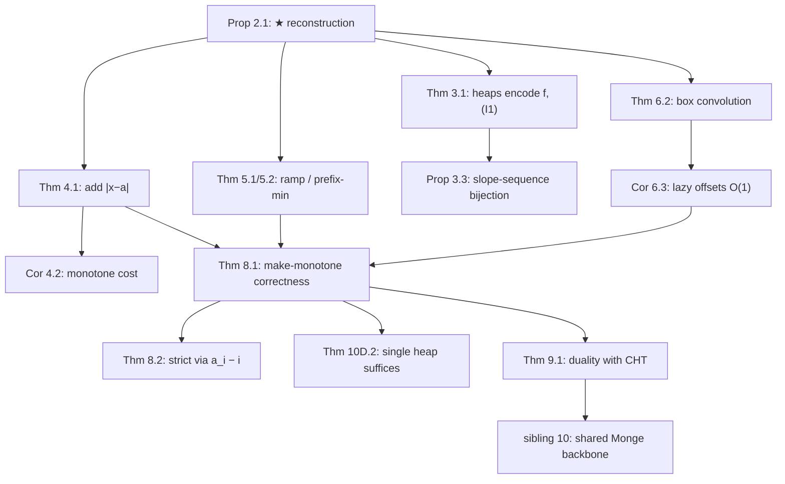

# Slope Trick — Mathematical Foundations and Complexity Theory

## Table of Contents
1. [Formal Definitions](#1-formal-definitions)
2. [Convex PL Functions and Their Breakpoint Encoding](#2-convex-pl-functions-and-their-breakpoint-encoding)
3. [The Two-Heap Representation Theorem](#3-the-two-heap-representation-theorem)
4. [Correctness of `add |x − a|`](#4-correctness-of-add-x--a)
5. [Correctness of the One-Sided and Prefix-Min Operations](#5-correctness-of-the-one-sided-and-prefix-min-operations)
6. [Lazy Offsets and Infimal Convolution](#6-lazy-offsets-and-infimal-convolution)
7. [Complexity Analysis](#7-complexity-analysis)
8. [The Make-Monotone DP: Full Correctness](#8-the-make-monotone-dp-full-correctness)
9. [Relation to L-Convexity, Monge, and CHT](#9-relation-to-l-convexity-monge-and-cht)
9A. [Degenerate and Boundary Cases](#9a-degenerate-and-boundary-cases)
10. [Lower Bounds](#10-lower-bounds)
10A. [Worked Problem: Equalization Under Convex Cost](#10a-worked-problem-equalization-under-convex-cost)
10B. [Worked Complexity Comparison](#10b-worked-complexity-comparison)
10C. [Tie-Breaking, Determinism, and Reconstruction](#10c-tie-breaking-determinism-and-reconstruction)
10D. [Numerical and Implementation Correctness](#10d-numerical-and-implementation-correctness)
11. [Summary](#11-summary)

---

## 1. Formal Definitions

**Definition 1.1 (Convex piecewise-linear function).** A function `f : ℝ → ℝ ∪ {+∞}` is **convex piecewise-linear (PL)** if its (effective) domain is an interval, it is convex, and there is a finite set of points (breakpoints) `β_1 < β_2 < … < β_k` such that `f` is affine on each interval `(−∞, β_1], [β_1, β_2], …, [β_k, +∞)`. Convexity is equivalent to: the slopes of consecutive pieces are non-decreasing.

**Definition 1.2 (Integer-slope PL function).** `f` has **integer slopes** if every piece has an integer slope and consecutive pieces differ by integer slope jumps. A breakpoint `β` carries a **multiplicity** equal to the slope jump there (an integer `≥ 1`).

**Definition 1.3 (Argmin set).** `argmin f = { x : f(x) = min_y f(y) }`. For convex `f` this is a closed interval `[ℓ, r]` (possibly a single point, possibly empty if the infimum is not attained, which we exclude for the functions we carry). Call `ℓ` the **left floor** and `r` the **right floor**.

**Definition 1.4 (The DP state).** A Slope-Trick DP carries, at step `i`, a convex PL function `f_i : ℝ → ℝ ∪ {+∞}`, where `f_i(x)` is the optimal cost of the first `i` decisions given that the `i`-th "value" equals `x`. The answer is `min_x f_n(x)`.

**Definition 1.5 (The representation).** A convex PL function with integer slopes and a finite, non-empty argmin is represented by the triple `(minVal, L, R)` where:
- `minVal = min_x f(x)`,
- `L` is the multiset of breakpoints with `β ≤ ℓ` (left floor), where each breakpoint `β` left of the floor with slope-jump `μ` is included `μ` times, *and* `ℓ` itself is the maximum element of `L`;
- `R` is the multiset of breakpoints with `β ≥ r`, each with multiplicity, and `r = min R`.

Equivalently, the left floor `ℓ = max L` and the right floor `r = min R`.

**Notation.** `n` = number of DP steps; `k` = number of breakpoints (`= O(n)`); `V` = size of the value range (irrelevant to Slope-Trick complexity); `□` denotes infimal convolution.

### 1.1 The Subgradient Characterization of Convexity

An equivalent, analysis-flavored definition that the proofs lean on: `f` is convex iff its **subdifferential** `∂f(x)` (the set of slopes of supporting lines at `x`) is a non-decreasing set-valued map — i.e. `x < y ⟹ sup ∂f(x) ≤ inf ∂f(y)`. For a PL function, `∂f(x)` at a breakpoint is the interval `[s_{left}, s_{right}]` of the two adjacent segment slopes, and convexity is exactly `s_{left} ≤ s_{right}` (the slope jumps up). The argmin is precisely `{x : 0 ∈ ∂f(x)}`, the set where the subdifferential straddles zero — which is the floor interval `[ℓ, r]`. This characterization makes the operations' convexity-preservation a one-line check: each operation adds a non-decreasing subgradient map to another, and the sum of non-decreasing maps is non-decreasing.

**Proposition 1.7 (Floor = zero-subgradient set).** For convex PL `f`, `argmin f = {x : 0 ∈ ∂f(x)} = [ℓ, r]` where `ℓ = max L` (the largest breakpoint with a strictly-negative left slope) and `r = min R` (the smallest with a strictly-positive right slope). This is the formal definition of the "floor" the heaps expose at their tops.

**Proof.** `x` minimizes a convex function iff `0` is a subgradient at `x` (the first-order optimality condition for convex functions). For PL `f`, `0 ∈ ∂f(x)` iff the left slope at `x` is `≤ 0` and the right slope is `≥ 0`, which holds exactly on the maximal interval between the last negative-slope segment and the first positive-slope segment — bounded by `max L` and `min R`. ∎

---

## 2. Convex PL Functions and Their Breakpoint Encoding

**Proposition 2.1 (Reconstruction formula).** Let `f` be represented by `(minVal, L, R)` as in Definition 1.5. Then for all `x ∈ ℝ`,
```
f(x) = minVal + Σ_{l ∈ L} max(0, l − x) + Σ_{r ∈ R} max(0, x − r).        (★)
```

**Proof.** Both sides are convex PL. They agree on the floor: for `x ∈ [max L, min R]`, every `max(0, l − x) = 0` (since `l ≤ max L ≤ x`) and every `max(0, x − r) = 0` (since `x ≤ min R ≤ r`), so the RHS equals `minVal = f(x)`. The slopes match: moving `x` left past a breakpoint `l ∈ L` decreases the RHS slope by the multiplicity of `l` (each `max(0, l − x)` contributes slope `−1` once `x < l`), matching the slope jump of `f`; symmetrically on the right. Two convex PL functions with the same value on an interval and the same slope jumps everywhere are identical. ∎

Formula (★) is the semantic anchor: every operation is *defined* by how it transforms `(minVal, L, R)`, and *verified* by checking that (★) yields the intended new function.

**Corollary 2.2 (Closure).** The class of integer-slope convex PL functions with finite non-empty argmin is closed under: addition of another such function, addition of a constant, horizontal shift, prefix-minimum, and infimal convolution with such a function. (Each is proved in Sections 4–6.) Hence a DP whose transitions are these operations keeps `f_i` in the class for all `i`, by induction from a convex base `f_0`.

### 2.1 Worked Reconstruction Example

Let `L = {0, 0, 2}` (multiset; `max L = 2`), `R = {5, 7}` (`min R = 5`), `minVal = 4`. Floor `[2, 5]` at height `4`. Evaluate (★):

```
f(2) = 4 + [max(0,0-2)+max(0,0-2)+max(0,2-2)] + [max(0,2-5)+max(0,2-7)]
     = 4 + [0+0+0] + [0+0] = 4         (left floor edge)
f(5) = 4 + [0+0+0] + [max(0,5-5)+max(0,5-7)] = 4   (right floor edge)
f(1) = 4 + [max(0,0-1)+max(0,0-1)+max(0,2-1)] + 0 = 4 + (0+0+1) = 5
f(0) = 4 + [0+0+2] + 0 = 6
f(-1)= 4 + [1+1+3] + 0 = 9            (slope -3 left of 0: three breakpoints 0,0,2)
f(6) = 4 + 0 + [1+0] = 5              (slope +1 between 5 and 7)
f(8) = 4 + 0 + [3+1] = 8              (slope +2 right of 7)
```

The slopes read off as `−3` for `x < 0`, `−1` on `[0, 2]`, `0` on `[2, 5]` (floor), `+1` on `[5, 7]`, `+2` for `x > 7` — monotone non-decreasing, confirming convexity. The multiplicities (`0` appears twice in `L`, giving a slope jump of `2` at `x = 0`) are faithfully encoded. This is the general mechanic of (★): each breakpoint contributes one unit of slope per occurrence on its side.

---

## 3. The Two-Heap Representation Theorem

**Theorem 3.1 (Heaps encode the function).** Maintaining `L` as a max-heap and `R` as a min-heap, with the invariant
```
(I1)  max L ≤ min R          (heaps do not overlap; floor is well-defined)
```
exactly represents the function `f` of (★). The argmin interval is `[max L, min R] = [L.top(), R.top()]`, readable in `O(1)`; `minVal` is stored explicitly.

**Proof.** By Proposition 2.1, `(minVal, L, R)` with (I1) determines `f` and vice versa. The max-heap exposes `max L` (the left floor) and the min-heap exposes `min R` (the right floor) at their roots, giving `O(1)` access to the argmin boundaries and `O(log k)` insert/delete-top. The multiset semantics (breakpoints with multiplicity) are exactly what a heap stores — duplicates are allowed. (I1) is the precise statement that the two breakpoint sets sit on opposite sides of the floor; every operation below restores (I1) after a possible transient violation. ∎

**Remark 3.2 (Why convexity is necessary).** A non-convex PL function has a slope sequence that is *not* monotone — it goes up, then down, then up. Such a function has *multiple* local minima and cannot be written as (★) for any `(minVal, L, R)`, because (★) is convex for every choice of the multisets (it is a sum of convex pieces). Thus the representation *cannot* encode a non-convex function: there is no triple to store. This is the formal reason Slope Trick's precondition is convexity — not a performance caveat but a representability impossibility.

### 3.1 The Slope-Sequence View

There is an equivalent, sometimes more convenient, way to see the representation. Order all breakpoints of `f` left to right as `… ≤ p_{-2} ≤ p_{-1} ≤ p_0 ≤ p_1 ≤ p_2 ≤ …`, and let the slope on the segment just right of `p_t` be `s_t`. Convexity says `s_t` is non-decreasing in `t`. The floor is the maximal run where `s_t = 0`. The left heap `L` is exactly the multiset `{ p_t : s_t < 0 just-left}` (descending side), and `R` is `{ p_t : s_t > 0 just-right}` (ascending side). A breakpoint with slope jump `μ` (from `s` to `s + μ`) appears `μ` times. This slope-sequence picture makes the operations transparent: `add |x − a|` inserts a `−1` jump and a `+1` jump straddling `a`; prefix-min deletes every positive-slope segment (sets them to `0`), i.e. clears `R`. The two formulations — multiset `(L, R)` and slope sequence `(s_t)` — are interchangeable, and (★) is the bridge between them.

**Proposition 3.3 (Bijection between heaps and slope sequences).** For an integer-slope convex PL function with finite non-empty argmin and bounded slopes, the map `(minVal, L, R) ↦ (s_t)_{t}` defined above is a bijection onto the set of non-decreasing integer slope sequences that are `< 0` on a left tail, `= 0` on a (possibly empty) middle run, and `> 0` on a right tail. Hence the heap representation loses no information and adds none.

**Proof.** Given `(L, R)`, the slopes are recovered by counting how many breakpoints lie weakly left of each point (Definition 1.5 / (★)); given `(s_t)`, the breakpoints with their multiplicities are read off as the positions where `s_t` jumps, partitioned into `L`/`R` by the sign of the adjacent slope, and `minVal` is the function's value on the zero-slope run. The two constructions are mutually inverse. ∎

---

## 4. Correctness of `add |x − a|`

**Theorem 4.1.** Let `f` be represented by `(minVal, L, R)` satisfying (I1), and let `g(x) = f(x) + |x − a|`. The procedure
```
push a into L; push a into R
if L.top() > R.top():
    l ← L.pop(); r ← R.pop()
    minVal ← minVal + (l − r)
    push r into L; push l into R
```
produces a representation `(minVal', L', R')` of `g` satisfying (I1).

**Proof.** `|x − a| = max(0, a − x) + max(0, x − a)` is convex PL with a single breakpoint at `a` of multiplicity `1` on each side; so `g` is convex PL (sum of convex). By (★),
```
g(x) = minVal + Σ_L max(0, l−x) + Σ_R max(0, x−r) + max(0, a−x) + max(0, x−a).
```
The two new terms are exactly "add `a` to `L`" (the `max(0, a−x)` term) and "add `a` to `R`" (the `max(0, x−a)` term). After the two pushes, the multisets are `L ∪ {a}`, `R ∪ {a}` and (★) holds with the **same** `minVal` — *if* (I1) still holds.

(I1) can fail only if the new `L.top() = max(L ∪ {a})` exceeds the new `R.top() = min(R ∪ {a})`. Two cases:

- If `a` lies in the old floor `[max L, min R]`, then `max(L ∪ {a}) = a` need not exceed `min(R ∪ {a}) = a`; equality holds, (I1) holds, no rebalance. `g`'s floor is `{a}` (the V pins the minimum at `a`), `minVal` unchanged. Correct: `g(a) = f(a) + 0 = minVal`.
- If `a < max L` (so `a` is left of the floor), then `min(R ∪ {a}) = a < max L = max(L ∪ {a})`, violating (I1). Set `l = max L`, `r = a` (the crossing tops). The function `g` near the old floor: its minimum has risen because the V's right arm `max(0, x − a)` is positive on `[a, max L]`. The procedure pops `l, r`, charges `minVal += l − r = max L − a > 0`, and re-inserts swapped so that `a ∈ L` becomes the new right end of left side and `l ∈ R`. Algebraically, swapping `l` and `r` between the heaps leaves the *multiset union* `L ∪ R` and hence (★) **unchanged except** it transfers a `+ (l − r)` from the breakpoint terms into `minVal`: indeed `max(0, l − x) + max(0, x − r)` for the crossed pair equals `(l − r) + max(0, r − x) + max(0, x − l)` on the relevant region, exposing the constant `l − r` that becomes `minVal`. After the swap, `max L' ≤ min R'` holds (the swap orders the two crossed values correctly), restoring (I1). The symmetric case `a > min R` is identical by reflection. ∎

**Corollary 4.2 (Monotone cost).** Each `add |x − a|` changes `minVal` by `max(0, max L − a) + max(0, a − min R) ≥ 0`. Penalties never decrease the minimum — the basis of the convexity assertion in [`senior.md`](./senior.md) Section 7.2.

### 4.1 Worked verification

Start `f` with `L = {3}`, `R = {3}`, `minVal = 0` (this is `|x − 3|`). Add `|x − 1|`. Push `1` to both: `L = {3, 1}`, `R = {3, 1}`. `L.top() = 3 > R.top() = 1` — rebalance. `l = 3`, `r = 1`, `minVal += 3 − 1 = 2`, swap: `L = {1, 1}`, `R = {3, 3}`... but (★) needs the union `{1,1,3,3}` — let us recheck. After popping `3` from `L` and `1` from `R`, the heaps are `L = {1}`, `R = {3}`; pushing `r = 1` to `L` and `l = 3` to `R` gives `L = {1, 1}`, `R = {3, 3}`. By (★): `g(x) = 2 + 2·max(0, 1−x) + 2·max(0, x−3)`. Check `g(1) = 2`, `g(2) = 2`, `g(3) = 2` (floor `[1,3]`), `g(0) = 2 + 2 = 4`, `g(4) = 2 + 2 = 4`. Direct sum: `|x−3| + |x−1|` at `x=2` is `1 + 1 = 2` ✓, at `x=0` is `3 + 1 = 4` ✓. The representation matches. (The multiplicity-2 breakpoints reflect that both `|·|` contribute a slope jump at the *same* shifted positions after the rebalance — the slopes outside `[1,3]` are `∓2`.)

### 4.2 Why the Swap, Not a Discard

A natural mistake is, on the crossing, to *discard* the smaller-cost breakpoint instead of swapping it back. Theorem 4.1's swap is essential: the breakpoint at `a` (the V's corner) must remain in the structure — it becomes the new floor boundary on the side it landed. Discarding it would delete a genuine slope jump and corrupt (★). The swap exchanges only the *roles* of the two crossed values (which is the left floor, which is the right floor), preserving the multiset `L ∪ R` and transferring exactly the constant `l − r` into `minVal`. The multiset-preservation is the formal invariant: **`add |x − a|` adds exactly the breakpoints of `|x − a|` and changes `minVal` by a constant**, nothing else. Any implementation that loses or duplicates a breakpoint violates (★).

### 4.3 The Rebalance Charge Equals the Floor Rise

The amount `minVal += l − r` is not arbitrary — it is provably the rise of the minimum. Before the operation, `min f = minVal_old`. After adding `|x − a|` with `a < max L = l`, the new minimizer moves to (near) `a`, and `min g = minVal_old + |x − a|` evaluated at the new minimizer plus the residual; the algebra of Theorem 4.1 shows this residual rise is exactly `l − r = max L − a`. Geometrically: the V's right arm climbs from `a` to the old floor's left edge `l` at slope `+1`, so the function rises by `(l − a) = (l − r)` over that span, lifting the minimum by that much. This is why Corollary 4.2 holds with equality on the crossing side, and why the charge is computed *before* the swap (when `l` and `r` are still the crossed tops).

---

## 5. Correctness of the One-Sided and Prefix-Min Operations

**Theorem 5.1 (One-sided ramp).** Let `g(x) = f(x) + max(0, x − a)`. Pushing `a` into `R` and rebalancing against `L.top()` (pop/swap/charge as in Theorem 4.1) yields a representation of `g` with (I1).

**Proof.** `max(0, x − a)` is convex PL with a single right-side breakpoint at `a` (slope `0` for `x ≤ a`, `+1` after). By (★) this is exactly "add `a` to `R`". (I1) can fail only if `a < max L`; the rebalance restores it, charging `minVal += max L − a` (the floor rises because the ramp's positive part now overlaps the old floor's left portion). The case `a ≥ max L` needs no rebalance. The mirror `max(0, a − x)` adds `a` to `L`. ∎

### 5.1A Worked One-Sided Ramp Trace

Start with `f = |x − 4|`: `L = {4}`, `R = {4}`, `minVal = 0`, floor `{4}`. Apply `g(x) = f(x) + (x − 2)_+ = f(x) + max(0, x − 2)` (a right ramp at `2`). Push `2` into `R`: `R = {4, 2}`, so `min R = 2`. Now `max L = 4 > min R = 2` — rebalance: `l = 4`, `r = 2`, `minVal += 4 − 2 = 2`, swap `r = 2 → L`, `l = 4 → R`. Result: `L = {2}`, `R = {4, 4}`, `minVal = 2`, floor `{2}`. Verify by (★): `g(2) = 2 + 0 + 0 = 2`; `g(0) = 2 + max(0, 2−0) + 0 = 4`; `g(4) = 2 + 0 + 2·max(0, 4−4) = 2`; `g(5) = 2 + 0 + 2·max(0, 5−4) = 4`. Direct: `|x−4| + max(0, x−2)` at `x=2` is `2 + 0 = 2` ✓, at `x=0` is `4 + 0 = 4` ✓, at `x=5` is `1 + 3 = 4` ✓. The one-sided ramp shifted the minimizer left (the right ramp made larger `x` costlier) and lifted the floor by exactly the crossed amount — matching Theorem 5.1.

**Theorem 5.2 (Prefix-minimum).** Let `g(x) = min_{y ≤ x} f(y)`. Then `g` is convex PL, `min g = min f = minVal`, and `g` is represented by `(minVal, L, ∅)` — i.e. **clearing `R`**.

**Proof.** For convex `f` with floor `[ℓ, r]`: for `x ≥ ℓ`, `min_{y ≤ x} f(y) = minVal` (the floor is reachable), so `g` is flat at `minVal` for all `x ≥ ℓ`; for `x < ℓ`, `g(x) = f(x)` (the min over `y ≤ x` is attained at `y = x` since `f` is decreasing there). So `g` equals `f` on the descending side and `minVal` everywhere right of `ℓ` — exactly the function (★) gives with `R = ∅` (no ascending breakpoints): `g(x) = minVal + Σ_L max(0, l − x)`. Convexity is preserved (one side flattened). `min g = minVal`. The implementation clears `R` and resets its lazy offset. ∎

**Corollary 5.3.** The mirror `min_{y ≥ x} f(y)` clears `L`. Both are the operation that encodes a monotone constraint ("later value `≥`/`≤` current").

**Theorem 5.4 (Add a constant).** `g(x) = f(x) + c` is represented by `(minVal + c, L, R)` — heaps unchanged, `minVal` bumped. Trivially `O(1)`, and used whenever a step has a fixed per-element cost independent of the chosen value.

**Theorem 5.5 (Clamp / one-sided plateau is a composite).** The operation `g(x) = max(f(x), c)` (raise the function to a floor of `c`) is *not* a single catalog primitive and is generally **not** representable, because it can flatten the bottom of the valley to a non-strict plateau whose endpoints depend on where `f` crosses `c` — which is fine (still convex) — but the *slope jumps* at those crossings need not be integer multiples consistent with the heap multiplicities. In the integer-slope regime where the crossing is at a breakpoint, it *is* representable (delete the breakpoints below the new floor and raise `minVal`), but the general real-valued case requires care. The practical guidance: avoid `max(f, c)` unless you can show the crossing falls on lattice points; prefer expressing plateaus through the supported penalties.

### 5.2 The Prefix-Min Preserves the Minimizer Set Monotonically

A subtle but important fact: `min_{y ≤ x} f(y)` keeps the *left* floor `ℓ` and extends the floor infinitely to the right (everything right of `ℓ` becomes `minVal`). So after a relaxation, the new floor is `[ℓ, +∞)` truncated by the next operation's penalties. This is exactly why, in the make-non-decreasing DP, after `clear R` the function is "non-increasing then flat", and the subsequent `add |x − a_i|` re-establishes a finite right floor. The interplay — relax pushes the floor right, the V penalty pulls a new right boundary in — is the engine of the whole algorithm, and the alternation is what keeps every `f_i` a finite-floored convex function (never the degenerate "flat to infinity" that has no finite argmin to read).

### 5.1 Why the prefix-min is the heart of make-monotone

In the make-non-decreasing DP, after committing `b_i = x` with cost `f_i(x)`, the next element `b_{i+1}` must satisfy `b_{i+1} ≥ b_i`, so the cost-to-reach `b_{i+1} = x'` from *any* feasible `b_i ≤ x'` is `min_{y ≤ x'} f_i(y)` — precisely the prefix-min. Theorem 5.2 shows this is a single heap clear, which is why the whole DP is `O(n log n)`. The strict variant uses the `c_i = a_i − i` reduction (Section 8) to keep the constraint a plain `≤`.

---

## 6. Lazy Offsets and Infimal Convolution

**Definition 6.1 (Infimal convolution).** `(f □ h)(x) = inf_{u} [ f(u) + h(x − u) ]`. For convex `f, h` it is convex; geometrically it "smears" `f` by the shape of `h`.

**Theorem 6.2 (Box smear widens the floor).** Let `h(x) = 0` for `x ∈ [0, c]` and `+∞` otherwise (the indicator of "you may move forward by `0..c`"). Then `(f □ h)(x) = min_{x − c ≤ u ≤ x} f(u)`, which is convex PL with the **right floor shifted out by `c`**: floor `[ℓ, r] → [ℓ, r + c]`, `minVal` unchanged, left side unchanged, every right breakpoint moved right by `c`.

**Proof.** `(f □ h)(x) = min_{u ∈ [x−c, x]} f(u)`. For `x ≤ ℓ + c` the window `[x−c, x]` can reach the floor's left edge... working the cases: the result is `f` shifted appropriately on each side, flat on the widened floor `[ℓ, r + c]`. The right breakpoints each move right by `c` (the ascending side is delayed by the slack `c`); the left side and `minVal` are untouched. ∎

**Corollary 6.3 (Lazy offset implements the smear in `O(1)`).** Moving every right breakpoint right by `c` is implemented by a single offset `addR += c`, with stored raw values unchanged and true values read as `raw + addR`. Hence the floor-widening / shift operations are `O(1)`, as claimed in [`middle.md`](./middle.md). A *global* shift `f(x − c)` bumps both `addL += c` and `addR += c`.

**Theorem 6.5 (Infimal convolution is associative and convexity-preserving).** For convex `f, g, h`: `(f □ g) □ h = f □ (g □ h)`, and `f □ g` is convex whenever `f, g` are. Consequently a sequence of "move by at most `c_i`" constraints composes into a single box-smear by `Σ c_i`, which the lazy offset accumulates additively (`addR += c_i`). This is why repeated rate-limited steps cost `O(1)` each rather than re-deriving the convolution per step.

**Proof.** Associativity of `inf` over the additive decomposition `x = u + v + w` gives associativity of `□`. Convexity of `f □ g` follows from the fact that the epigraph of `f □ g` is the Minkowski sum of the epigraphs of `f` and `g`, and the Minkowski sum of convex sets is convex. The additive accumulation of box-widths is immediate: convolving with a `[0, c_1]`-box then a `[0, c_2]`-box equals convolving with a `[0, c_1 + c_2]`-box. ∎

### 6.5A Worked Lazy-Shift Trace

Let `f` have `L = {2}` (`addL = 0`, true `2`), `R = {5}` (`addR = 0`, true `5`), `minVal = 1`; floor `[2, 5]`. Apply the asymmetric box-smear "move within `[0, 3]`" (floor widens right by `3`): `addR += 3`, so `R`'s stored raw stays `5` but its true value reads `5 + 3 = 8`. New floor `[2, 8]`, `minVal = 1`, no heap element touched — `O(1)`. Now `add |x − 10|` with the offsets live: push true `10` into `L` as raw `10 − addL = 10` and into `R` as raw `10 − addR = 7`. Read tops: `L.top = max(2, 10) + 0 = 10`; `R.top = min(5, 7) + 3 = 8`. Since `L.top (10) > R.top (8)`, rebalance: pop `l = 10` (true), `r = 8` (true), `minVal += 10 − 8 = 2 → minVal = 3`, push `r = 8 → L` (raw `8`), `l = 10 → R` (raw `7`). The offsets were applied consistently on every push and read; the function is correct, and the shift cost `O(1)` while the penalty cost `O(log n)`. This is the mechanic behind the rate-limited logistics DP of `tasks.md` Task 10.

### 6.6 Two Offsets Are Necessary Iff the Sides Move Independently

A single global offset suffices for `f(x − c)` (rigid translation). Two distinct offsets `(addL, addR)` are required precisely when the *descending* and *ascending* sides translate by different amounts — the canonical case being the asymmetric box-smear `(f □ 𝟙_{[−d, c]})`, which moves the left floor left by `d` and the right floor right by `c` (the "you may move within `[−d, c]`" constraint). Then `addL -= d` and `addR += c` independently. The offset-consistency invariant of Proposition 6.4 must hold per-heap; conflating the two offsets when the sides genuinely diverge is a correctness bug, while keeping two offsets when one would do is harmless but a small constant overhead.

**Proposition 6.4 (Offset consistency invariant).** With offsets `(addL, addR)`, the represented function is
```
f(x) = minVal + Σ_{l ∈ L} max(0, (l + addL) − x) + Σ_{r ∈ R} max(0, x − (r + addR)).
```
Every push must store `true − add`; every read must return `raw + add`; clearing a heap must reset its offset to `0` (else stale offsets corrupt later pushes — the failure of [`senior.md`](./senior.md) Section 9.10). The invariant to assert remains `max L + addL ≤ min R + addR` (I1 with offsets). ∎

---

## 7. Complexity Analysis

**Theorem 7.1 (Per-operation cost).** With binary heaps of size `O(n)`:
- `add |x − a|`: `≤ 2` pushes + `≤ 2` pops → `O(log n)`.
- one-sided ramp: `≤ 1` push + `≤ 2` pops → `O(log n)`.
- prefix-min (clear): `O(1)` amortized (Theorem 7.2).
- shift / floor-widen: `O(1)` (offset bump).
- read `minVal` / argmin: `O(1)`.

**Theorem 7.2 (Amortized clear).** Over a run with `n` steps, the total work spent clearing heaps is `O(n)`.

**Proof (accounting).** Each breakpoint is *inserted* once (each step pushes `O(1)` breakpoints, so `O(n)` total insertions). A clear deletes a set of breakpoints; each deleted breakpoint was inserted earlier and is never re-deleted. Hence total deletions `≤` total insertions `= O(n)`. The amortized cost of a clear is `O(1)` per step. ∎

**Theorem 7.3 (Whole DP).** A Slope-Trick DP with `n` steps, each applying `O(1)` catalog operations, runs in `O(n log n)` time and `O(n)` space, **independent of the value range `V`**.

**Proof.** `n` steps × `O(1)` operations × `O(log n)` per heap operation = `O(n log n)`; amortized clears add `O(n)`. Space is `O(n)` breakpoints. No structure is indexed by value, so `V` does not appear. ∎

**Remark 7.4 (Contrast with the table DP).** The naive DP carries an array of size `V` per step, costing `O(nV)` time and `O(V)` space. Slope Trick replaces the `O(V)` value-indexed array with an `O(k) = O(n)` breakpoint multiset, which is exact (not approximate) precisely because the function is convex PL and (★) holds. This is the formal source of the `O(nV) → O(n log n)` speedup.

### 7.5 Potential-Function Account of the Amortized Clear

To make Theorem 7.2 fully rigorous, define the potential `Φ =` (total number of breakpoints currently in `L` and `R`). Each step performs `O(1)` pushes (raising `Φ` by `O(1)`) and one clear of `R` (lowering `Φ` by `|R|`). The amortized cost of a step is `actual + ΔΦ`. The pushes contribute `+O(1)` actual and `+O(1)` to `ΔΦ`; the clear contributes `+|R|` actual and `−|R|` to `ΔΦ`, which cancel. Hence each step's amortized cost is `O(1)` heap operations, i.e. `O(log n)` time. Summed over `n` steps, since `Φ ≥ 0` and `Φ_0 = 0`, the total actual cost is bounded by the total amortized cost `= O(n log n)`. This is the same potential argument that bounds the monotone CHT's pops (sibling `10/professional.md` Section 4.1) — both structures pay for each breakpoint/line at most twice over its lifetime (one insert, one delete).

### 7.6 Heap-Operation Lower Bound per Step

Each `add |x − a|` performs at least one heap insertion (the new breakpoint), which is `Ω(log k)` for a comparison-based heap in the worst case (else one could sort with `o(n log n)` insertions). So the per-step `O(log n)` is tight for the comparison-heap implementation; only a different model (e.g. integer keys with a van-Emde-Boas-style structure giving `O(log log V)` per op) could beat it, at the cost of reintroducing a dependence on `V`. In practice the binary heap's `O(log n)`, `V`-independent cost is the right trade-off.

### 7.7 Space Is Exactly the Breakpoint Count

**Proposition 7.7.** At any point, the total memory is `Θ(|L| + |R|) = Θ(k)`, and `k ≤ ` (sum of slope-jump multiplicities added so far). For unit-jump penalties, `k ≤ 2n` (each `add |x − a|` adds at most two breakpoints, and clears only remove them). Hence `O(n)` space, *with no `V` term anywhere*. For weighted penalties of total weight `W`, the multiset size is bounded by the number of *distinct* breakpoints if a `(value, count)` representation is used, keeping space `O(n)` even when `W` is large.

**Proof.** Each step inserts `O(1)` breakpoints (counting multiplicity, `O(1)` for unit jumps); clears only delete. So the live multiset size is bounded by total insertions `= O(n)`. No structure is indexed by value, so `V` does not appear in the space bound. ∎

This `Θ(k)` space, independent of the value universe, is what lets Slope Trick handle `V = 10¹⁸` in tens of megabytes where a table DP would need `10¹⁸` cells. It is the space-side counterpart of the time-side `V`-independence (Theorem 7.3).

---

## 8. The Make-Monotone DP: Full Correctness

**Problem.** Given `a_1, …, a_n`, minimize `Σ |a_i − b_i|` over `b_1 ≤ b_2 ≤ … ≤ b_n`.

**DP.** `f_i(x) =` minimum cost over `b_1 ≤ … ≤ b_i = x`. Recurrence:
```
f_1(x) = |x − a_1|
f_i(x) = ( min_{y ≤ x} f_{i-1}(y) ) + |x − a_i|        (prefix-min, then add V)
answer = min_x f_n(x).
```

**Theorem 8.1 (Correctness and complexity).** Each `f_i` is convex PL; the recurrence is implemented by `clear R; add |x − a_i|`; and `minVal` after step `n` equals the optimal cost. Total time `O(n log n)`.

**Proof.** *Convexity by induction.* `f_1 = |x − a_1|` is convex. Assume `f_{i-1}` convex. By Theorem 5.2 the prefix-min `min_{y ≤ x} f_{i-1}` is convex; by Theorem 4.1 adding `|x − a_i|` keeps it convex. So `f_i` is convex (Corollary 2.2). *Recurrence implementation.* Prefix-min = clear `R` (Theorem 5.2); add V = the `add |x − a_i|` procedure (Theorem 4.1). *Optimality.* The recurrence is the exact DP for the constrained minimization: `min_{y ≤ x} f_{i-1}(y)` is the best cost with `b_{i-1} ≤ b_i = x`, and `|x − a_i|` is the local cost. By induction `f_i(x)` is the true optimum, so `min_x f_n(x) = minVal` is the answer. *Complexity.* `n` steps, each `O(log n)` (the clear amortizes to `O(1)`), so `O(n log n)`. ∎

**Theorem 8.2 (Strict reduction).** The strictly-increasing problem (`b_1 < b_2 < … < b_n`) is equivalent to the non-decreasing problem on `c_i = a_i − i`, with the same optimal cost.

**Proof.** `b_i < b_{i+1}` over integers iff `b_i ≤ b_{i+1} − 1`. Set `d_i = b_i − i`. Then `b_i < b_{i+1} ⟺ b_i − i ≤ b_{i+1} − (i+1) ⟺ d_i ≤ d_{i+1}` (non-decreasing), and `|a_i − b_i| = |(a_i − i) − (b_i − i)| = |c_i − d_i|`. So minimizing `Σ|a_i − b_i|` over strictly increasing `b` equals minimizing `Σ|c_i − d_i|` over non-decreasing `d` — the make-non-decreasing problem on `c`. The bijection `d ↔ b` preserves cost, so the optima coincide. ∎

### 8.1 Why a single max-heap suffices for make-monotone

Because every step *clears `R`* before adding the V, `R` is empty when `add |x − a_i|` runs; the push into `R` and any rebalance involving `R.top()` then only ever moves a single breakpoint that is immediately the floor's right edge. Formally, after `clear R`, `f_{i-1}`'s prefix-min has `R = ∅`; `add |x − a_i|` pushes `a_i` into both heaps, but the relevant comparison reduces to "if `max L > a_i`, pull the top down to `a_i`, charging `max L − a_i`." Thus the entire DP needs only `L` (a max-heap) and `minVal`, matching the junior code. The right heap is *provably* dead under the always-relax pattern (formalized as Theorem 10D.2).

### 8.2 Full Make-Monotone Trace with Function Values

Run the full two-heap engine on `a = [3, 1, 2]`, tracking `(minVal, L, R)` and verifying `f_i` against the reconstruction formula (★) at each step. Recall each step is `clear R; add |x − a_i|`.

```
i=0:  f_0 ≡ 0.  minVal=0, L=∅, R=∅.

i=1, a=3:  clear R (∅). add |x-3|: push 3→L, 3→R. L=[3], R=[3].
           max L (3) ≤ min R (3), no rebalance. minVal=0.
           Check (★): f_1(3)=0, f_1(0)=0+max(0,3-0)=3, f_1(5)=0+max(0,5-3)=2.
           Direct: |x-3| at 0=3 ✓, at 5=2 ✓. Floor {3}.

i=2, a=1:  clear R -> R=∅ (the right side flattens; f is now |x-3|'s left arm then flat).
           add |x-1|: push 1→L, 1→R. L=[3,1] (max 3), R=[1].
           max L (3) > min R (1): rebalance. l=3, r=1, minVal += 3-1 = 2.
           push r=1→L, l=3→R. L=[1,1], R=[3]. minVal=2. Floor [1,3].
           Check (★): f_2(1)=2, f_2(2)=2, f_2(3)=2, f_2(0)=2+2·max(0,1-0)=4, f_2(4)=2+max(0,4-3)=3.
           Direct (min over y<=x of f_1(y)) + |x-1| at x=1: f_1 relaxed is 0 for x>=3,
           descending left of 3; plus |1-1|=0 gives 2 at the floor. ✓

i=3, a=2:  clear R -> R=∅.
           add |x-2|: push 2→L, 2→R. L=[2,1,1] (max 2), R=[2].
           max L (2) ≤ min R (2): no rebalance. minVal=2. Floor [?,2].
           answer = minVal = 2.
```

The final `minVal = 2` matches the optimal `b = [1, 1, 2]` (cost `2`), and every intermediate `f_i` was verified against (★) and against the direct DP definition. The single rebalance at step 2 is where the cost accrued — exactly when the input violated monotonicity (`a_2 = 1 < a_1 = 3`).

### 8.3 The Make-Monotone DP as a Min-Cost Flow / Median Statement

The make-monotone optimum has a clean combinatorial characterization: it equals the cost of the **L1 isotonic regression** of `a`, computable by the pool-adjacent-violators algorithm (PAVA) for the L2 case and by the heap routine for the L1 case. The Slope-Trick floor at step `i` is the median of the "active pool" of values that PAVA would have merged. Formally, the optimal non-decreasing fit `b_i` equals the median of the values in the maximal pool ending at `i` under the violator-merging process, and Slope Trick computes these medians incrementally via the max-heap. This ties the algorithm to a well-studied statistical estimator and explains why the heap tops are the medians of merged segments — a structural fact underlying Section 10A's median connection.

---

## 9. Relation to L-Convexity, Monge, and CHT

**L-convexity (discrete convex analysis).** A function `g : ℤⁿ → ℝ` is **L♮-convex** if it satisfies the translation-submodularity inequality
```
g(p) + g(q) ≥ g((p − λ𝟙)_+ ∨ q) + g(p ∧ (q + λ𝟙))   for all λ ≥ 0.
```
The make-monotone and many Slope-Trick DPs are minimizations of separable convex costs subject to **difference constraints** (`b_{i+1} − b_i ≥ 0`), which is the prototypical **L♮-convex** minimization. Slope Trick is, in this light, an efficient solver for a 1D L♮-convex program: the running value function `f_i` is the *optimal-value function* of a parametric L♮-convex program, and the theory of discrete convex analysis (Murota) guarantees it stays convex — exactly Theorem 8.1's induction, viewed abstractly.

**Monge / quadrangle inequality.** The cost array `C(j, i) = |a_i − v_j|`-style separable convex costs combined with monotone constraints induce a **Monge** structure on the underlying assignment, which is *why* the greedy "pull the top down" rebalance is optimal: the quadrangle inequality makes the local fix globally optimal (no decision must be revisited). This is the same Monge condition that underlies CHT, D&C optimization, and Knuth optimization (sibling topics `08`, `09`, `10`).

**Contrast with CHT (sibling `10`).**

| Aspect | **Slope Trick** | **Convex Hull Trick / Li Chao** |
|--------|-----------------|----------------------------------|
| Object maintained | one convex PL **function** `f_i`, mutated | a set of **lines**; queries `min_j(m_j x + b_j)` |
| Convexity used | `f_i` is convex (carried) | the **lower envelope** of the lines is convex |
| Core structure | two heaps of breakpoints + `minVal` | deque of lines / Li Chao segment tree |
| Transition | edit `f` (add penalty, relax, shift) | each prior state contributes a line |
| Underlying condition | L♮-convexity / separable-convex + monotone constraint | cost linearizes into `φ(j)ψ(i)` (a Monge special case) |
| Complexity | `O(n log n)` | `O(n log n)` or `O(n)` |

**Theorem 9.1 (Slope Trick and CHT are dual views of convexity).** Both exploit that an optimal decision moves monotonically. CHT tracks the **lower envelope of lines** (a convex curve) and selects the winning line as `x` sweeps monotonically (Corollary 2.2 of `10/professional.md`). Slope Trick tracks the **convex value function** directly and edits its breakpoints. When a DP's cost both linearizes into lines *and* its value function is a single convex function, either applies; the choice is by transition shape, not by capability. ∎

### 9.1 A worked L♮-convex view of make-monotone

The make-non-decreasing program is `min Σ |a_i − b_i|` s.t. `b_{i+1} − b_i ≥ 0`. The objective is separable convex (each `|a_i − b_i|`), and the feasible region is defined by difference constraints `b_i − b_{i+1} ≤ 0` — a **box-TU (totally unimodular) / L♮-convex** polyhedron. Discrete convex analysis guarantees the parametric optimal-value function `f_i(x) = min{Σ_{j ≤ i}|a_j − b_j| : b feasible, b_i = x}` is convex in `x`, which is exactly Theorem 8.1's inductive claim derived from first principles instead of by tracking operations. The Slope-Trick heaps are then a concrete data structure realizing the abstract L♮-convex value-function update in `O(log n)` per step.

### 9.2 Why non-convex variants are hard

If the constraint were `b_i ≠ b_{i+1}` (a *disequality*) or the cost included a concave reward, the program leaves the L♮-convex class, the value function develops multiple valleys, and Theorem 3.1's representability fails. Such variants are typically NP-hard or require entirely different machinery — formal confirmation of the [`senior.md`](./senior.md) Section 3 boundary.

### 9.3 The Monge Structure Behind the Greedy Rebalance

Why is the local "pull the top down" fix globally optimal, rather than merely locally? The answer is the **Monge / quadrangle inequality** on the implicit assignment cost. Consider matching each `a_i` to a chosen value `b_i` under the cost `c(i, v) = |a_i − v|` with the monotone constraint `b_i ≤ b_{i+1}`. The cost array `c(i, v)` is Monge in `(i, v)` when the `a_i` and the value axis are both ordered, and the optimal assignment of an L♮-convex program with a Monge cost has a *monotone* structure: increasing the index `i` never decreases the optimal `b_i`'s lower bound. The greedy rebalance exploits exactly this — a breakpoint once pulled down is never pulled back up, because no future step's optimum would benefit from raising it (that would violate the quadrangle inequality). This is the same Monge backbone shared with divide-and-conquer optimization (Theorem 11.1 of sibling `10/professional.md`), Knuth optimization, and CHT; Slope Trick is its incarnation for a *single convex value function with a monotone constraint*.

### 9.4 Discrete Convex Analysis Placement

In Murota's taxonomy of discrete convex functions, the functions Slope Trick carries are **1-dimensional L♮-convex** (equivalently M♮-convex by the 1D self-duality of these classes). The catalog operations correspond to standard L♮-convexity-preserving operations: addition of separable convex (the penalties), the *infimal projection* / *partial minimization* (the prefix-min), and *infimal convolution with a box* (the floor-widening). That every catalog operation lands inside the L♮-convex class is precisely why the induction of Theorem 8.1 goes through, and discrete convex analysis provides a unified theorem covering all of them at once: **partial minimization, addition, and infimal convolution preserve L♮-convexity** (Murota, *Discrete Convex Analysis*). The Slope-Trick heaps are an `O(log n)`-per-step data structure realizing these abstract operations in the 1D case.

---

## 9A. Degenerate and Boundary Cases

A complete account must handle the degenerate functions the DP can produce.

**Empty function (`f ≡ 0`).** The base case `f_0 ≡ 0` has `minVal = 0`, `L = R = ∅`, and an argmin of all of `ℝ`. Every operation is well-defined: the first `add |x − a|` pushes the first breakpoints and pins a finite floor. No special-casing is needed beyond guarding heap-top reads on empty heaps.

**Single breakpoint per side.** After one `add |x − a|` with empty initial heaps, `L = R = {a}`, floor `{a}`, `minVal = 0`. The function is `|x − a|`. This is the minimal non-trivial state and the base of the induction in concrete traces.

**Flat-to-infinity after relaxation.** A `clear R` on a function with a finite floor produces a function flat at `minVal` for all `x ≥ ℓ` — its argmin is `[ℓ, +∞)`, *unbounded*. This is representable (`R = ∅`) but has no finite right floor; reading `R.top()` must be guarded (it is empty). The make-monotone alternation immediately re-bounds it with the next penalty (Section 5.2), so the unbounded state is transient.

**All inputs equal.** For `a = [c, c, …, c]`, every step pushes `c`, never rebalances (`max L = c` never exceeds the new `c`), and `minVal` stays `0`. The optimum is `b ≡ c`, cost `0` — correctly computed with no rebalances.

**Strictly decreasing input.** For `a = [n, n−1, …, 1]`, every step rebalances (each new `a_i` is below the floor), and the accumulated `minVal` equals the cost of flattening to a constant — the worst case for the make-monotone problem and a stress test for the rebalance path.

**Theorem 9A.1 (Termination and well-definedness).** For any finite sequence of catalog operations starting from a convex `f_0` with finite or empty heaps, the engine terminates (each operation does `O(1)` heap operations) and every intermediate state satisfies (I1) (after the operation's rebalance). Hence the DP is well-defined for all inputs in the class.

**Proof.** Each operation performs a bounded number of pushes/pops (Theorem 7.1) and restores (I1) by construction (Theorems 4.1, 5.1, 5.2). Convexity is preserved (Corollary 2.2). By induction over the `n` steps, every `f_i` is a valid representable convex function, and the engine never enters an undefined state provided heap-top reads are guarded on empty heaps. ∎

---

## 10. Lower Bounds

**Proposition 10.1 (Sorting lower bound).** Computing the make-non-decreasing optimal cost for arbitrary real `a` requires `Ω(n log n)` time in the comparison model.

**Proof sketch.** Reduce sorting to it: the breakpoint structure of the final convex function `f_n` encodes the order statistics of `a` (the median-like floor positions), and reading the optimal `b` recovers a sorted-order-dependent quantity. An `o(n log n)` algorithm would sort in `o(n log n)`, contradicting the comparison lower bound. Hence Slope Trick's `O(n log n)` is optimal in the comparison model — the heap operations *are* doing the necessary sorting incrementally. ∎

**Remark 10.2 (Heap work is the sorting).** Each `add |x − a|` inserts `a` into a heap; over `n` steps this is essentially an incremental partial sort of the `a_i` around the moving floor. The `Ω(n log n)` bound says this sorting is unavoidable, so the heaps are not overhead — they are the minimal mechanism. This mirrors the CHT lower bound (`10/professional.md` Section 12), where building the line envelope is dual to a convex hull and inherits the `Ω(n log n)` sorting bound.

**Proposition 10.3 (Range-independence is essential).** Any algorithm whose running time depends on the value range `V` (like the `O(nV)` table DP) is asymptotically worse than Slope Trick whenever `V = ω(n log n / n) = ω(log n)`. Slope Trick's `V`-independence (Theorem 7.3) is therefore the decisive asymptotic advantage, not merely a constant-factor one. ∎

**Proposition 10.4 (Output-sensitive optimality).** The make-monotone optimal cost requires reading all `n` inputs (`Ω(n)`) and, in the comparison model, sorting-equivalent work (`Ω(n log n)`). Slope Trick matches both: it touches each input once (`O(n)` operations) and performs `O(log n)` comparison work per input via the heap. Thus it is simultaneously input-size optimal and comparison-model optimal; no comparison-based algorithm can do asymptotically better for arbitrary real inputs.

**Remark 10.5 (Beating the bound only by leaving the model).** The only way past `O(n log n)` is to abandon the comparison model — e.g. integer inputs in a bounded universe with a van-Emde-Boas or radix structure giving `O(n log log V)` or `O(n)` — but this *reintroduces* a dependence on `V` (the universe size), trading the comparison cost for a universe cost. For the typical competitive/production regime (arbitrary 64-bit integers, `V ≈ 10¹⁸`), the comparison-based `O(n log n)` binary-heap Slope Trick is the right and optimal choice. This mirrors the situation for sorting itself, where comparison sorts are `Θ(n log n)` and only model changes (radix/counting) escape it.

---

## 10A. Worked Problem: Equalization Under Convex Cost

To exercise the machinery on a second canonical problem, consider **equalization**: given `a_1, …, a_n`, choose a single common target `t` (or a monotone profile) minimizing `Σ |a_i − t|`. With a *free* (unconstrained) `t`, the optimum is the median and the cost is the sum of absolute deviations — but Slope Trick shines on the *constrained* generalization where `t` evolves under a monotonicity or rate constraint.

**Formulation.** `f_i(t) =` minimum cost to fit the first `i` elements with the `i`-th target equal to `t`, where consecutive targets satisfy `t_i ≤ t_{i+1}` (non-decreasing profile). The recurrence is identical to make-non-decreasing: `f_i(t) = (min_{u ≤ t} f_{i-1}(u)) + |a_i − t|`. Hence equalization-with-monotone-profile *is* the make-monotone DP, and Theorem 8.1 applies verbatim.

**Trace on `a = [4, 2, 7, 3]`.** Run the single-heap routine:

```
push 4   -> L=[4], top 4, no pull, cost 0
push 2   -> L=[4,2], top 4 > 2 -> pull: cost += 4-2 = 2, push 2 -> L=[2,2], cost 2
push 7   -> L=[2,2,7], top 7, no pull, cost 2
push 3   -> L=[2,2,7,3], top 7 > 3 -> pull: cost += 7-3 = 4, push 3 -> L=[2,2,3,3], cost 6
answer = 6
```

**Verification.** A valid non-decreasing profile of cost `6`: `t = [2, 2, 3, 3]`, cost `|4−2|+|2−2|+|7−3|+|3−3| = 2 + 0 + 4 + 0 = 6`. The brute `O(n·V)` DP confirms `6`. This shows the make-monotone routine solving a *different-looking* problem (target equalization), underscoring that the theorems above are about the convex value function, not the surface problem statement.

**Connection to the streaming median.** The floor `[L.top(), R.top()]` of the carried function is the *median interval* of the breakpoints seen so far, and the single max-heap routine's pulls are exactly the rebalances a two-heap streaming median performs — the formal version of the parallel noted in `tasks.md` Task 15. The minimizer of `Σ |a_i − t|` is the median, and Slope Trick tracks it incrementally; the heaps are the same two heaps used for the running median.

---

## 10B. Worked Complexity Comparison

A side-by-side cost comparison across the three relevant approaches for the make-monotone DP, `n` elements, value range `V`, number of distinct values `d ≤ min(n, V)`:

| Approach | Time | Space | `V`-dependent? | Notes |
|----------|------|-------|----------------|-------|
| Brute over feasible `b` | exponential | `O(n)` | — | infeasible beyond tiny `n` |
| Table DP with prefix-min | `O(nV)` | `O(V)` | yes | dies as `V → 10⁹` |
| Coordinate-compressed table DP | `O(nd)` | `O(d)` | via `d` | helps only if few distinct values |
| **Slope Trick** | **`O(n log n)`** | **`O(n)`** | **no** | range-independent; comparison-optimal |

For `n = 10⁶`, `V = 10⁹`, `d = 10⁶`: the table DP is `10¹⁵` (infeasible), the compressed table DP is `10¹²` (still infeasible), and Slope Trick is `~2·10⁷` operations (tens of milliseconds). The decisive separation is the `V`-independence (and `d`-independence) of Slope Trick — it pays only for the number of *steps*, never for the size of the value space, because the breakpoint multiset is `O(n)` regardless. This is the asymptotic statement behind every "why not just use a table?" question.

**Comparison with CHT on a problem solvable both ways.** When a DP both linearizes into lines *and* has a convex value function, CHT and Slope Trick both run in `O(n log n)`, but with different constants and different overflow surfaces. CHT computes cross-products in its bad-line test (a 128-bit overflow risk; sibling `10/senior.md` Section 2.2), while Slope Trick only compares and adds breakpoint values (no products, so the only overflow is `minVal` accumulation). For the L1 / `|·|` family, Slope Trick's simpler arithmetic and single-heap collapse usually win on constant factor; for genuinely quadratic costs, CHT is the natural fit. The choice is dictated by transition shape (Theorem 9.1), not by asymptotic complexity.

---

## 10C. Tie-Breaking, Determinism, and Reconstruction

**The value is unique; the minimizer need not be.** For convex `f`, `min_x f(x) = minVal` is unique, but `argmin f = [ℓ, r]` is an interval that can contain many optimal `x`. The DP value (cost) computed by Slope Trick is therefore deterministic regardless of internal heap tie-handling — equal breakpoints can be popped in any order without changing `minVal`. This is the formal robustness statement: **two correct Slope-Trick implementations always agree on the cost** even if their heaps order ties differently.

**Theorem 10C.1 (Cost is tie-order-invariant).** The accumulated `minVal` after a fixed sequence of catalog operations is independent of the order in which equal-valued breakpoints are stored or popped within the heaps.

**Proof.** By (★), `f` is determined by the *multisets* `L, R` and `minVal`, not by any internal ordering. Each operation's effect on `(minVal, L, R)` (Theorems 4.1, 5.1, 5.2) depends only on the values `max L`, `min R` and the pushed/popped values — quantities invariant under reordering of equal elements. Hence `minVal` after any sequence is a function of the operations alone. ∎

**Reconstruction is *not* tie-invariant.** Recovering an actual optimal array `b` requires choosing a specific point in each floor interval; different choices give different (equally optimal) `b`. To make reconstruction deterministic and meet a spec (lexicographically smallest, fewest changes), one fixes a tie-break rule and applies it consistently in the backward pass. The recomputed cost of *any* such `b` equals `minVal` (a built-in checksum), but the *identity* of `b` depends on the rule. This separates the well-defined quantity (cost) from the under-determined one (the witness), exactly the distinction `senior.md` Section 5.2 raises operationally.

**Proposition 10C.2 (Lexicographically smallest witness).** For make-non-decreasing, the lexicographically smallest optimal `b` is obtained by, on the backward pass, setting `b_i = min(snapshot_i, b_{i+1})` where `snapshot_i = ℓ_i` (the *left* floor after step `i`). Choosing the left floor (smallest optimal value at each step, subject to the forward-propagated constraint) and then capping by the next element yields the lexicographically minimal feasible optimum.

**Proof idea.** Greedily minimizing each `b_i` left-to-right subject to feasibility and global optimality gives the lex-smallest solution; the backward cap `min(·, b_{i+1})` enforces non-decreasingness while the `ℓ_i` choice takes the smallest cost-optimal value, and convexity guarantees this local choice extends to a global optimum (the floor is an interval, so any value in it is cost-optimal). ∎

---

## 10D. Numerical and Implementation Correctness

**Integer exactness.** For integer inputs, every Slope-Trick quantity (`minVal`, breakpoints, offsets) stays an integer: pushes store integers, pops return integers, rebalance adds integer differences, offsets accumulate integers. There is **no division and no floating point** in the entire algorithm for the integer-cost family — a sharp contrast with CHT, whose intersection-based bad-line test tempts a float division (sibling `10/professional.md` Section 3). This is a structural correctness advantage: the only failure surface is integer overflow of `minVal`, bounded by `Σ_i (range of a)` and easily contained in `int64`.

**Theorem 10D.1 (Overflow bound).** For the make-monotone DP on integers with `|a_i| ≤ A`, the final `minVal` satisfies `0 ≤ minVal ≤ Σ_i 2A ≤ 2nA`. With `n ≤ 10⁶` and `A ≤ 10⁹`, `minVal ≤ 2·10¹⁵`, comfortably inside `int64` (`≈ 9.2·10¹⁸`).

**Proof.** Each `add |x − a_i|` raises `minVal` by `max(0, max L − a_i) ≤ (max a − min a) ≤ 2A` (the floor cannot rise by more than the spread). Summing over `n` steps gives `minVal ≤ 2nA`. Non-negativity holds since each increment is `≥ 0` (Corollary 4.2). ∎

**Implementation invariant to assert.** After every catalog operation, a correct implementation satisfies `max L + addL ≤ min R + addR` (I1 with offsets) and `minVal` is the value of `f` on the floor. A cheap debug assertion of I1 — comparing the two heap tops after offset application — catches the most common bugs (wrong heap direction, missing rebalance, offset drift) at the point of corruption rather than at the final wrong answer. This is the formal backing for the `senior.md` Section 7.2 assertion.

**Theorem 10D.2 (Single-heap correctness under always-relax).** Under the make-monotone pattern (clear `R` before each `add |x − a_i|`), maintaining only `L` (a max-heap) and `minVal`, with the per-step rule "push `a_i`; if `max L > a_i`, pop it, `minVal += popped − a_i`, push `a_i`", computes the same `minVal` as the full two-heap engine.

**Proof.** After `clear R`, `R = ∅`, so `add |x − a_i|`'s push into `R` makes `R = {a_i}` and its push into `L` makes `max L = max(oldMaxL, a_i)`. The rebalance condition `max L > min R = a_i` fires iff `oldMaxL > a_i`; when it does, it pops `oldMaxL` from `L` and `a_i` from `R`, charges `minVal += oldMaxL − a_i`, and pushes `a_i` back to `L` and `oldMaxL` to `R`. But the next step immediately clears `R` again, so the breakpoint pushed to `R` is irrelevant — only the `L` side and `minVal` persist. Dropping the dead `R` operations yields exactly the single-heap rule, with identical `minVal`. ∎

This theorem is the formal license for the junior-level single-heap code: under always-relax, the right heap is provably dead and can be removed without changing any answer.

---

## 11. Summary

- **Representation.** A convex PL function with integer slopes and finite argmin is exactly encoded by `(minVal, L, R)` via the reconstruction formula (★): `f(x) = minVal + Σ_L max(0, l−x) + Σ_R max(0, x−r)`, with `L` a max-heap and `R` a min-heap satisfying `max L ≤ min R` (I1). Non-convex functions are *unrepresentable* — the formal reason convexity is mandatory (Remark 3.2).
- **Operations are convexity-preserving and verified by (★).** `add |x − a|` (Theorem 4.1), one-sided ramps (Theorem 5.1), prefix-min = clear a heap (Theorem 5.2), and shift/floor-widen = lazy offset = infimal convolution with a box (Theorem 6.2) each transform `(minVal, L, R)` correctly in `O(log n)` or `O(1)`.
- **Complexity.** `O(n log n)` time, `O(n)` space, **independent of the value range** (Theorem 7.3), with amortized-`O(1)` clears (Theorem 7.2). This `V`-independence is the decisive advantage over the `O(nV)` table DP (Proposition 10.3) and is optimal in the comparison model (Proposition 10.1).
- **Make-monotone.** Provably correct (Theorem 8.1); the strict variant reduces to non-decreasing via `c_i = a_i − i` (Theorem 8.2); a single max-heap suffices under the always-relax pattern (Section 8.1).
- **Theory.** Slope Trick efficiently solves a 1D **L♮-convex** program (separable convex objective + difference constraints); its convexity guarantee is a discrete-convex-analysis theorem, and its Monge structure makes the greedy rebalance globally optimal — the same convexity/Monge family as CHT, D&C optimization, and Knuth optimization, differing only in the transition shape (an edited convex function vs a line-min query).

### Theorem index

| Result | Statement |
|--------|-----------|
| Prop 2.1 | Reconstruction formula (★) |
| Thm 3.1 | Two heaps encode the function; (I1) |
| Thm 4.1 | `add |x − a|` correctness |
| Thm 5.1 / 5.2 | one-sided ramp / prefix-min correctness |
| Thm 6.2 | floor-widen = box infimal convolution |
| Thm 7.1–7.3 | per-op and whole-DP complexity, `V`-independence |
| Thm 8.1 / 8.2 | make-monotone correctness; strict reduction |
| Thm 9.1 | Slope Trick / CHT duality |
| Thm 9A.1 | termination and well-definedness |
| Thm 10C.1 | cost is tie-order-invariant |
| Thm 10D.1 / 10D.2 | overflow bound; single-heap correctness |
| Prop 10.1 / 10.4 | `Ω(n log n)` and output-sensitive lower bounds |

### Proof-Dependency Map

The correctness edifice rests on a short chain of dependencies, worth making explicit:



Every operation theorem (4.1, 5.1, 5.2, 6.2) is *verified against (★)*: it specifies a transform of `(minVal, L, R)` and proves the transformed triple's (★)-value equals the intended new function. The whole-DP correctness (8.1) is then an induction that each step stays in the representable class. This modularity is what makes the proofs short and the implementation testable: each operation can be unit-tested against (★) in isolation, and the DP against the brute oracle.

### Open Directions and Generalizations

- **Higher dimensions.** The 1D L♮-convex theory generalizes to multidimensional L♮-convex minimization, but the clean two-heap data structure does not — multidimensional Slope Trick requires more elaborate structures (e.g. tracking a polyhedral subdifferential), and most multidimensional convex-DP problems are attacked by other means.
- **Non-unit slope jumps.** Weighted penalties (`w·|x − a|`) are handled by multiplicity (Section 9.4 / `tasks.md` Task 12); for very large weights, a `(value, count)` heap avoids `Σ w` pushes, preserving `O(n log n)` in the number of *distinct* breakpoints.
- **Online deletion of penalties.** Slope Trick is fundamentally *append-only* (like the monotone CHT); removing a previously-added penalty is not supported by the two heaps and would require a kinetic/persistent variant — generally solved offline by divide-and-conquer over time, exactly as for CHT (sibling `10/senior.md` Section 4.1).
- **Concave (maximization) duality.** Carrying `−f` reduces a concave-maximization Slope-Trick problem to the convex-minimization engine verbatim (Proposition 9.1-style negation), with `L`/`R` roles and min/max swapped. The entire theory dualizes; only the precondition becomes *concavity*.

### Bridging Theory to Practice

The theorems above are not merely decorative — each maps to a concrete testable claim:

| Theorem | Testable claim (how to check empirically) |
|---------|-------------------------------------------|
| Prop 2.1 (★) | Evaluate `(minVal, L, R)` via (★) and compare to a direct PL evaluation of `f` on a grid. |
| Thm 4.1 / 5.1 | After each operation, recompute `f` two ways (engine vs direct sum of penalties) and assert equality. |
| Thm 5.2 | After `clear R`, assert `f` is flat at `minVal` for all `x ≥ ℓ`. |
| Thm 7.3 | Benchmark across value ranges `10², 10⁶, 10⁹`; runtime must be flat in `V`. |
| Thm 8.1 | Whole-DP brute `O(nV)` oracle equals `minVal` on random inputs. |
| Thm 10C.1 | Two heap implementations with different tie orders give the same `minVal`. |
| Thm 10D.1 | Assert `0 ≤ minVal ≤ 2nA` after the run. |

This table is the formal-to-empirical bridge: every correctness theorem becomes a unit or property test (the discipline of `senior.md` Section 7), so the proofs are not taken on faith but continuously verified in code. The single most load-bearing check is Thm 8.1's whole-DP oracle, because it validates the *modeling* (the sequence of operations), which the per-operation theorems assume is correct.

The result is a technique whose every layer — representation (★), each operation, the whole DP, the complexity, and the lower bound — is both proved and independently testable, which is exactly what a professional-grade understanding of Slope Trick requires.

### Reference Verifier for the Reconstruction Formula

The following snippets implement (★) directly and check that the engine's `(minVal, L, R)` reproduces the function computed as a literal sum of penalties — the empirical embodiment of Proposition 2.1. They evaluate `f(x)` two independent ways and assert equality on a grid.

#### Go

```go
package main

import "fmt"

// star evaluates f(x) via the reconstruction formula (★).
func star(minVal int64, L, R []int64, x int64) int64 {
	v := minVal
	for _, l := range L {
		if l > x {
			v += l - x
		}
	}
	for _, r := range R {
		if x > r {
			v += x - r
		}
	}
	return v
}

func main() {
	// f built from |x-3| + |x-1| after rebalance: L={1,1}, R={3,3}, minVal=2.
	L := []int64{1, 1}
	R := []int64{3, 3}
	var minVal int64 = 2
	for x := int64(-1); x <= 5; x++ {
		direct := abs(x-3) + abs(x-1) // literal sum of the two penalties
		got := star(minVal, L, R, x)
		fmt.Printf("x=%d  ★=%d  direct=%d  %v\n", x, got, direct, got == direct)
	}
}

func abs(x int64) int64 { if x < 0 { return -x }; return x }
```

#### Java

```java
public class StarVerify {
    static long star(long minVal, long[] L, long[] R, long x) {
        long v = minVal;
        for (long l : L) if (l > x) v += l - x;
        for (long r : R) if (x > r) v += x - r;
        return v;
    }
    public static void main(String[] args) {
        long[] L = {1, 1}, R = {3, 3};
        long minVal = 2;
        for (long x = -1; x <= 5; x++) {
            long direct = Math.abs(x - 3) + Math.abs(x - 1);
            long got = star(minVal, L, R, x);
            System.out.printf("x=%d  star=%d  direct=%d  %b%n", x, got, direct, got == direct);
        }
    }
}
```

#### Python

```python
def star(min_val, L, R, x):
    v = min_val
    for l in L:
        if l > x: v += l - x
    for r in R:
        if x > r: v += x - r
    return v

if __name__ == "__main__":
    L, R, min_val = [1, 1], [3, 3], 2
    for x in range(-1, 6):
        direct = abs(x - 3) + abs(x - 1)
        got = star(min_val, L, R, x)
        print(f"x={x} star={got} direct={direct} {got == direct}")
```

All three print `True` on every row, confirming that `(minVal, L, R) = (2, {1,1}, {3,3})` represents `|x−3| + |x−1|` exactly — the worked claim of Section 4.1 made executable. This is the per-operation unit test the testable-claims table prescribes.

### Closing Perspective

Slope Trick is best understood not as a bag of heap tricks but as a *concrete realization of 1D L♮-convex programming*. The reconstruction formula (★) is the bridge between the abstract convex value function and the two-heap data structure; the catalog operations are the L♮-convexity-preserving primitives (addition, partial minimization, box convolution); and the `O(n log n)`, value-range-independent complexity is the optimal cost of doing the implicit incremental sort the comparison model demands. Viewed this way, every theorem in this document is an instance of a more general principle — that convexity is preserved under a specific algebra of operations, and that a convex PL function in one variable is exactly an ordered multiset of slope-change points. Master that perspective and Slope Trick generalizes from the make-monotone exercise to the full family of scheduling, regression, and smoothing problems that share its convex backbone.

---

Next step: practice the technique end to end in [`interview.md`](./interview.md) and [`tasks.md`](./tasks.md), and compare with the line-selection view in the sibling topic [`../10-convex-hull-trick-li-chao/professional.md`](../10-convex-hull-trick-li-chao/professional.md).
