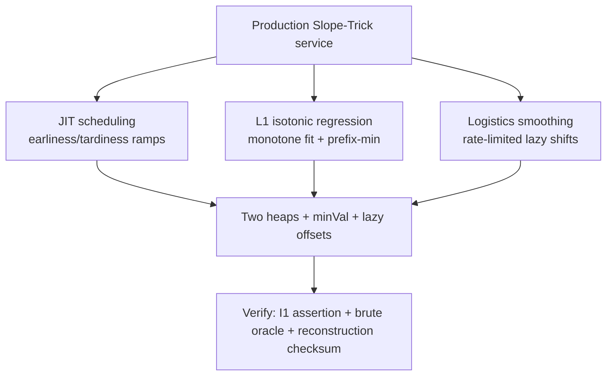

# Slope Trick — Senior Level

> The two-heap idea is elegant; shipping it is where the judgment lies. The carried function must be *provably* convex (and silently breaks when it is not), the lazy offsets must stay consistent across clears, reconstructing the actual chosen values needs deliberate bookkeeping, and the wrong reduction (strict vs non-strict, min vs max) corrupts answers without crashing. This document covers where Slope Trick shows up (scheduling, logistics, signal smoothing), its hard limits, the engineering of the heaps, and how to reconstruct and test the result at scale.

## Table of Contents
1. [Introduction](#1-introduction)
2. [Where Slope Trick Appears](#2-where-slope-trick-appears)
3. [The Convexity Boundary: When It Does and Does Not Apply](#3-the-convexity-boundary-when-it-does-and-does-not-apply)
4. [Engineering the Heaps and Lazy Offsets](#4-engineering-the-heaps-and-lazy-offsets)
5. [Reconstructing the Optimal Solution](#5-reconstructing-the-optimal-solution)
6. [Choosing Slope Trick vs CHT vs Plain DP](#6-choosing-slope-trick-vs-cht-vs-plain-dp)
7. [Testing Strategy](#7-testing-strategy)
8. [Code Examples](#8-code-examples)
9. [Failure Modes](#9-failure-modes)
10. [Summary](#10-summary)

---

## 1. Introduction

At senior level the question shifts from "how do the two heaps work" to "what breaks when I ship this against real input at scale, and how do I make the failures loud?". Slope Trick appears in production-adjacent settings — batch scheduling with earliness/tardiness penalties, isotonic regression (monotone curve fitting under L1 loss), logistics where a quantity must be smoothed under convex costs, and large-`n` competitive DP — and the same failure axes recur:

1. **Convexity** — the carried function is assumed convex but the transition (or an unnoticed cost term) makes it non-convex; the two-heap invariant silently corrupts.
2. **Offset consistency** — lazy shifts drift out of sync after a heap is cleared, so breakpoints land at wrong true positions.
3. **Reduction correctness** — strict vs non-strict, min vs max, or the `−i` change of variables is applied wrong; answers are off by a structured amount.
4. **Reconstruction** — the problem needs the actual array `b`, not just its cost, and the value was never tracked.

The recurring theme — exactly as with CHT — is that **Slope Trick bugs are silent**. A corrupted convex representation still returns *a* number for `minVal`; a desynced offset still places breakpoints *somewhere*; a wrong reduction produces correct answers on the symmetric test cases and wrong ones on adversarial input. There is no crash. Every practice here exists to convert silent wrongness into a loud, testable failure before production: convexity asserted or proved, offsets invariant-checked, the whole DP validated against a brute oracle, and reconstruction verified by recomputing the cost.

---

## 2. Where Slope Trick Appears

### 2.1 Scheduling with earliness/tardiness (just-in-time)

Classic single-machine scheduling: jobs have due dates `d_i`, and completing a job at time `t` incurs `α·(d_i − t)_+ + β·(t − d_i)_+` — a convex (asymmetric V) penalty for being early or late. Sequencing the jobs and then choosing completion times to minimize total penalty is a Slope-Trick DP: process jobs in order, each adding a one-sided ramp pair, with prefix-min relaxations encoding precedence/idle-time constraints. The carried function is "minimum penalty so far as a function of the current completion time", convex by construction. This is the canonical *industrial* use and the reason Slope Trick is taught beyond competitive programming.

### 2.2 Isotonic / L1 monotone regression

Fitting a non-decreasing step function to data minimizing `Σ |y_i − ŷ_i|` is *exactly* the make-non-decreasing problem. Slope Trick solves L1 isotonic regression in `O(n log n)` — a result used in statistics and signal processing (the L2 version is the classic pool-adjacent-violators algorithm; the L1 version is the Slope-Trick max-heap routine). The convex carried function is the L1 fitting cost as a function of the last fitted level.

### 2.3 Logistics: smoothing a quantity under convex transport cost

Inventory or throughput that must change slowly (a per-step "you may change by at most `k`, and changing costs convexly") under convex holding/shortage costs is a Slope-Trick DP with **lazy shifts** encoding the rate constraint (widen the floor by `k` each step) and `|x − target_i|` penalties for matching demand. The shift mechanics from [`middle.md`](./middle.md) are load-bearing here.

### 2.4 Why these are Slope Trick and not CHT

All three carry a *single convex cost-vs-quantity function* that is edited each step (add a penalty, relax, shift). None is a "minimum over many lines" query. That is the discriminator: an editable convex function → Slope Trick; a selection among lines → CHT.

| Domain | Carried function | Key operations | Why convex |
|--------|------------------|----------------|------------|
| JIT scheduling | penalty vs completion time | one-sided ramps + relax | sum of asymmetric Vs |
| L1 isotonic regression | fit cost vs last level | `|x − y_i|` + prefix-min | sum of Vs, monotone constraint |
| Logistics smoothing | cost vs inventory level | `|x − demand|` + lazy shift | convex holding/shortage costs |



### 2.5 A fuller scheduling example

Concretely, take a single-machine batch with jobs `1..n` in a fixed processing order, each with due date `d_i`, unit earliness cost `α`, unit tardiness cost `β`, and a *no-idle* constraint that completion times are non-decreasing and at least the running processing time. The DP carries `f_i(t) =` minimum penalty for the first `i` jobs given job `i` completes at time `t`. The transition is:

1. **Advance time** by the processing time `p_i` of job `i`: a lazy shift `t ← t + p_i` (`addL += p_i; addR += p_i`), or fold it into the constraint.
2. **Relax** to encode that job `i` may complete no earlier than job `i−1` plus `p_i`: clear the appropriate side.
3. **Add the penalty** `α·(d_i − t)_+ + β·(t − d_i)_+`: `α` ramp-downs and `β` ramp-ups at `d_i`.

The carried function stays convex because every term is a one-sided ramp (convex) and the constraint is monotone. The answer `min_t f_n(t)` is the minimum total earliness/tardiness penalty. This is a textbook industrial Slope-Trick application and a clean illustration that *shifts, relaxes, and ramps compose* into a real algorithm — the same primitives the make-monotone problem uses, recombined.

---

## 3. The Convexity Boundary: When It Does and Does Not Apply

### 3.1 The hard precondition

Slope Trick is valid **iff** every intermediate function `f_i` is convex (for minimization) or concave (for maximization). The two heaps encode a convex function and *only* a convex function — there is no representation for a function with two separate valleys. Senior judgment is knowing, before writing code, whether the DP's carried function stays convex.

### 3.2 Operations that preserve convexity

- Adding a convex function (`|x−a|`, one-sided ramps, any convex PL): sum of convex is convex.
- Prefix-min `min_{y ≤ x} f` (or `min_{y ≥ x}`): the *running minimum* of a convex function is convex (it is the convex function with one side flattened).
- Horizontal shift / change of variables `f(x − c)`: convexity is shift-invariant.
- Infimal convolution `(f □ g)(x) = min_{u} f(u) + g(x − u)` with `g` convex: convex (this is what "you may move by at most `k`" encodes, and why the floor widens).

### 3.3 Operations that break convexity (the traps)

- **Pointwise maximum of two convex functions** `max(f, g)` is *not* generally convex-friendly for the carried-function role (it is convex but not representable as one valley with monotone slopes unless one dominates).
- **Adding a concave term** (e.g. `−|x − a|`, a reward for being far) destroys convexity outright.
- **A constraint that creates a forbidden interval** (value cannot be in `[p, q]`) splits the valley.
- **Multiplying the function** by a non-constant, or composing with a non-monotone map.

If any transition is one of these, Slope Trick does not apply directly; you fall back to plain DP, or reformulate (sometimes a clever change of variables restores convexity).

### 3.4 A worked "does it stay convex?" check

Take the JIT penalty `α·(d − t)_+ + β·(t − d)_+`. Each piece is a one-sided ramp (convex); their sum is convex; adding it to a convex `f` keeps `f` convex. Contrast with a hypothetical "bonus for finishing exactly on time": `−M·[t = d]` is a downward spike — non-convex — and Slope Trick is immediately invalid. The discipline: classify *every* term of the per-step cost as convex/concave before trusting the two heaps. One concave term is fatal.

### 3.5 The classification cheat sheet

When facing a new problem, run each per-step cost term through this filter:

| Cost term shape | Convex? | Slope-Trick-able? |
|-----------------|---------|-------------------|
| `c` (constant) | yes (trivially) | yes — add to `minVal` |
| `|x − a|`, `(x−a)_+`, `(a−x)_+` | yes | yes — catalog primitives |
| `max(f, g)` of two convex | yes, but | only if it stays a single valley (rarely) |
| `(x − a)²` and other convex powers | yes | yes if you can keep PL (often via CHT instead) |
| `−|x − a|`, any concave term | no | **no** — invalidates the representation |
| indicator of a forbidden interval | no (splits the valley) | **no** |
| `min(f, g)` of two convex | generally no | **no** |

The rule of thumb: *additions of convex terms and prefix-mins are safe; subtractions, forbidden regions, and `min` of two functions are dangerous.* If every term is in the top block, you have a Slope-Trick DP; one term in the bottom block and you do not.

### 3.6 Reformulation can sometimes restore convexity

A non-convex-looking problem occasionally hides a convex one after a change of variables (like the strict→non-strict `−i` shift) or a dualization. Before abandoning Slope Trick, ask: is there a monotone reparametrization, a sign flip (max↔min), or a constraint reformulation that makes the carried function convex? The strict-increasing reduction is the canonical example; another is converting "difference at most `k`" constraints into box infimal convolutions (lazy shifts). But if no such reformulation exists and a genuinely concave reward or a disequality constraint remains, the problem is outside the L♮-convex class and Slope Trick cannot solve it — fall back to plain DP or an entirely different method.

---

## 4. Engineering the Heaps and Lazy Offsets

### 4.1 Heap choice and constants

The hot loop is heap pushes/pops. Use the language's tuned heap (`container/heap`, `PriorityQueue`, `heapq`). For `n` up to a few million, an array-backed binary heap is fine; pairing/leftist heaps rarely pay off here because the operation mix is push/pop-top, which binary heaps do well with good cache behavior.

### 4.2 The offset-consistency invariant

With lazy offsets `addL`, `addR`, the discipline is absolute: **every** push stores `true − add`, **every** read returns `raw + add`, and **clearing a heap resets its offset to 0**. A single violated site corrupts all subsequent breakpoints. In debug builds, assert after each operation that `L.top() ≤ R.top()` (invariant I1) — a cheap check that catches offset drift immediately.

### 4.3 When you need two offsets vs one

A single global shift (`f(x − c)`) bumps both offsets equally. Two *different* offsets are needed only when the sides move independently — e.g. the floor widens asymmetrically (right side moves out by `k`, left stays). Most make-monotone problems need *no* offset; scheduling/logistics with rate limits need them. Keep the offsets out unless the problem demands them — they are a bug surface.

### 4.4 Collapsing to one heap

When every step relaxes the same side (clears `R`), `R` stays empty and you can drop it entirely, keeping only `L` (a max-heap) and `minVal`. This is the make-non-decreasing routine: half the code, half the heap traffic, no offset needed. Recognizing when the second heap is dead is a real performance and correctness win.

### 4.5 Memory

`O(n)` breakpoints total (one or two per step). For `n = 10⁶` that is a few million `int64` — tens of MB, fine. There is no dependence on the value range `V`, which is the whole point: a range of `10¹⁸` costs nothing.

### 4.6 Weighted breakpoints to avoid `Σ w` pushes

When penalties are weighted (`w·|x − a|`), the naive approach pushes `a` into the heap `w` times — `O(Σ w)` work, which can blow up. The engineering fix is a `(value, count)` heap: store each distinct breakpoint once with its multiplicity, and on a rebalance move `min(count_l, count_r)` units at a time. This keeps the heap size `O(#distinct breakpoints) = O(n)` and the work `O(n log n)` regardless of the total weight. For unit weights the `(value, 1)` pairs degenerate to plain values. This is the standard production technique for weighted L1 isotonic regression where weights can be large.

### 4.7 Language-specific notes

- **Go:** `container/heap` requires an interface implementation; for hot loops, an inlined array-based heap (or a generic heap with `int64`) avoids interface dispatch overhead. Pre-size the backing slice.
- **Java:** `PriorityQueue<Long>` autoboxes — for `n = 10⁶`+, a primitive `long[]` heap (hand-written) is markedly faster and avoids GC pressure from boxed `Long` objects.
- **Python:** `heapq` is C-implemented and fast; use negation for the max-heap rather than a wrapper class. For very large `n`, the constant factor of Python's per-op overhead dominates — but the algorithm remains `O(n log n)`.

These constant-factor choices do not change the asymptotics but matter at the `10⁶`-element scale where Slope Trick is typically deployed.

---

## 5. Reconstructing the Optimal Solution

The DP returns `minVal` — the optimal *cost*. Many real problems need the actual array `b` (the schedule, the fitted curve, the inventory plan). Slope Trick does not give it for free.

### 5.1 The standard reconstruction

For the make-monotone family, the optimal `b` can be recovered with a **second backward pass**:

1. During the forward pass, after processing element `i`, record the argmin's right boundary `r_i = R.top()` (or, for the single-heap variant, `L.top()` after the pull) — the value the optimal `b_i` would take if unconstrained by later elements.
2. Backward, set `b_n =` the final argmin, then `b_i = min(b_{i+1}, r_i)` (for non-decreasing: `b_i` is pulled down to not exceed `b_{i+1}`).

The recovered `b` must recompute to exactly `minVal` — a built-in assertion. The details vary per problem; the principle is: **snapshot the floor boundary at each step, then propagate the constraint backward.**

### 5.2 Reconstruction is fragile under ties

When the floor is a flat interval (many optimal values), the recovered `b` depends on *which* boundary you snapshot and how you break the backward tie. If the spec requires a specific optimum (lexicographically smallest, fewest changes), encode that tie-break consistently. Otherwise any value in the floor is equally optimal in cost.

### 5.3 Memory cost of reconstruction

Storing one boundary per step is `O(n)` extra — cheap. The temptation to store the *whole heap state* per step (for a more general reconstruction) is `O(n²)` and almost never necessary; the single-boundary snapshot suffices for the monotone family.

### 5.4 A worked reconstruction note

For `a = [3, 1, 2]` (non-decreasing), the forward pass produced floors at `x = 3`, then `x = 1` (after the pull), then `x = 2`. Backward: `b_3 = 2`; `b_2 = min(b_3, floor_2) = min(2, 1) = 1`; `b_1 = min(b_2, floor_1) = min(1, ?)`. The recovered `b = [1, 1, 2]` recomputes to cost `2 = minVal`. The assertion "reconstructed cost == minVal" is the cheapest, strongest reconstruction test.

### 5.5 Why the backward pass, not a forward one

Reconstruction must go *backward* because the constraint propagates that way: `b_i` is capped by `b_{i+1}` (you may not exceed the next element in a non-decreasing array, given the optimal future). The forward pass computes the *unconstrained-by-future* optimal value at each step (the floor), but the actual `b_i` may need to be smaller to respect the later choices. Walking backward and taking `b_i = min(floor_i, b_{i+1})` applies the future constraint to each `b_i`. Attempting a forward reconstruction would commit to `b_i` before knowing the later constraints and can produce an infeasible or suboptimal array. This asymmetry — forward DP, backward reconstruction — is standard in optimization DPs and Slope Trick is no exception.

### 5.6 Reconstruction under shifts and offsets

When the DP uses lazy shifts, the snapshotted floor boundaries are *true* values (offset already applied), so the backward pass works on true coordinates directly. If you snapshot raw values, you must add the offset *at the time of the snapshot* (not at reconstruction time, since the offset may change later). The safest practice is to snapshot true values via the offset-applying read helper, so reconstruction never needs to reason about offsets. This is a common subtle bug: snapshotting raw heap values and forgetting they will be re-interpreted under a different offset by the time you reconstruct.

---

## 6. Choosing Slope Trick vs CHT vs Plain DP

A decision procedure, in priority order:

1. **Is the DP state a single convex PL function of one variable, edited each step by `|x−a|` / one-sided / prefix-min / shift?**
   → **Slope Trick.** `O(n log n)`, memory independent of value range.
2. **Is the DP value a number, computed as `min_j(m_j·x_i + b_j)` where each prior state is a line?**
   → **Convex Hull Trick / Li Chao** (sibling `10`). `O(n log n)` or `O(n)`.
3. **Is the value range small and the transition arbitrary?**
   → **Plain `O(n·range)` DP.** Simplest; fine when `range` is modest.
4. **Is the cost Monge but not linearizable and not a single editable function?**
   → **Divide-and-conquer optimization** (sibling `08`) or **Knuth** (sibling `09`).

Secondary considerations:

- **Value range:** huge range strongly favors Slope Trick (range-independent) over plain DP.
- **Convexity proof:** if you cannot prove convexity, Slope Trick is off the table — that is a feature, not a limitation; it forces the precondition check.
- **Reconstruction need:** if you need the solution and the convex function is hard to invert, CHT with attached argmin can be easier to reconstruct.

### 6.1 The boundary case

Some monotone-cost DPs can be cast *either* as Slope Trick (carry the convex fit cost) *or* as CHT (each level contributes a line). When both apply, Slope Trick usually wins on simplicity and constant factor for the L1/`|·|` family, while CHT wins when the cost is genuinely quadratic. The transition's *shape* — editable function vs line-min — is the deciding question, exactly as in [`middle.md`](./middle.md).

### 6.2 A decision flow for a new problem

When a new optimization DP lands on your desk, work top-down:

1. **Is the state a 1-variable cost function?** If no, it is probably a value-min DP → consider CHT or plain DP.
2. **Is that function convex (every per-step cost term convex, prove by induction)?** If no, Slope Trick is out.
3. **Are the transitions expressible as `|x−a|` / ramps / prefix-min / shift?** If yes → Slope Trick, `O(n log n)`, range-independent.
4. **Is the value range small?** If yes and you want simplicity → plain `O(n·V)` table DP.
5. **Does the cost linearize into lines?** If yes → CHT / Li Chao.

Following this flow avoids the two classic senior mistakes: forcing Slope Trick onto a non-convex problem (steps 2 blocks it) and reaching for a heavy structure when a simple table DP would do (step 4). The single highest-leverage check is step 2 — convexity — because it is both the precondition and the most commonly violated assumption.

---

## 7. Testing Strategy

A Slope-Trick result is opaque: one wrong `minVal` looks like any other number. Build verification in from the start.

### 7.1 The brute-force oracle

The single most valuable test: an `O(n·V)` table DP that computes the same answer directly. For random small inputs (`n ≤ 50`, `V ≤ 50`), assert the Slope-Trick `minVal` equals the table-DP minimum on *every* case. This catches the overwhelming majority of bugs: wrong heap direction, missing `minVal` increment, wrong relaxation side, and offset drift.

### 7.2 Convexity assertion

In debug builds, after each operation, assert the two-heap invariant:

```text
assert: L is non-empty implies R is empty OR L.top() <= R.top()   (I1)
assert: minVal is non-decreasing across |x-a| / ramp operations    (penalties only add cost)
```

A violated I1 means a non-convex function slipped in or an offset desynced — turn it into a loud failure during testing.

### 7.3 Property tests

| Property | Why |
|----------|-----|
| Matches brute `O(n·V)` DP on random inputs | Catches nearly all logic bugs. |
| Already-monotone input gives cost `0` | Sanity for the relaxation/penalty interplay. |
| Reversing the array and the monotone direction gives the symmetric cost | Catches left/right heap confusion. |
| `add |x−a|` then querying at `a` increases cost by `0` at the new argmin | Verifies the V is centered correctly. |
| Reconstructed `b` recomputes to exactly `minVal` | Verifies reconstruction. |
| Strict variant on `a` equals non-strict on `a_i − i` | Verifies the `−i` reduction. |

### 7.4 Stress the whole DP, not just the engine

Test the *entire* DP: brute-force the `O(n·V)` version on small `n, V` and compare to the Slope-Trick version. This catches *modeling* mistakes (wrong relaxation side, forgotten penalty) that an engine-only test cannot, because the engine faithfully applies whatever operations you call — if the sequence of operations is wrong, the engine returns the wrong answer correctly.

### 7.5 Differential testing against CHT where applicable

For problems solvable both ways, run a Slope-Trick and a CHT implementation on the same random inputs and assert equal costs. They compute the same optimum by entirely different mechanisms, so agreement is a strong signal and disagreement localizes the bug (broken by the brute oracle).

### 7.6 What to log in production

For a service running Slope-Trick optimization at scale, log: a **periodic invariant check** (re-run I1 on a shadow copy), the **heap sizes** (a runaway size signals a missing clear/relaxation), an **overflow guard** asserting `minVal` stays within `[0, INF/2]`, and a **reconstruction checksum** (recomputed cost equals `minVal`). These turn opaque "wrong number" failures into observable, alertable events.

### 7.7 A concrete test harness

A minimal but high-coverage harness combines four checks on every random small input:

```text
for trial in 1..100000:
    a = random array (n <= 12, values in [-20, 20])
    cost_slope = slope_trick(a)              # the implementation under test
    cost_brute = brute_table_dp(a)           # O(n*V) oracle
    assert cost_slope == cost_brute          # whole-DP correctness (catches modeling bugs)
    b = reconstruct(a)
    assert is_non_decreasing(b)              # feasibility
    assert sum(|a_i - b_i|) == cost_slope    # reconstruction checksum
    assert invariant_I1_held_throughout()    # convexity (catches offset/direction bugs)
```

Running this to a hundred thousand trials before shipping converts every silent-failure mode of Section 9 into a loud assertion failure on a small, debuggable input. The four assertions are orthogonal: the oracle catches modeling errors, feasibility catches reconstruction errors, the checksum catches both, and I1 catches representation errors. Adding a differential check against a second implementation (Section 7.5) raises confidence further. The cost of the harness is negligible relative to the cost of a silent wrong answer reaching production.

### 7.8 Performance regression guarding

Beyond correctness, log per-input **operation counts** (pushes, pops, clears) and **wall-clock**. A sudden jump in pops-per-step signals an input distribution that triggers many rebalances (e.g. adversarially decreasing data) — not a bug, but a latency risk worth alerting on. Because Slope Trick is `O(n log n)` with small constants, a regression usually means an accidental `O(n)` per step (e.g. a non-lazy shift looping over the heap, or re-sorting). Track these counts to catch such regressions in CI before they reach production.

---

## 8. Code Examples

### 8.1 Go — JIT scheduling penalty (asymmetric one-sided ramps) with convexity assertion

```go
package main

import (
	"container/heap"
	"fmt"
)

type maxHeap []int64

func (h maxHeap) Len() int            { return len(h) }
func (h maxHeap) Less(i, j int) bool  { return h[i] > h[j] }
func (h maxHeap) Swap(i, j int)       { h[i], h[j] = h[j], h[i] }
func (h *maxHeap) Push(x interface{}) { *h = append(*h, x.(int64)) }
func (h *maxHeap) Pop() interface{}   { o := *h; n := len(o); v := o[n-1]; *h = o[:n-1]; return v }

type minHeap []int64

func (h minHeap) Len() int            { return len(h) }
func (h minHeap) Less(i, j int) bool  { return h[i] < h[j] }
func (h minHeap) Swap(i, j int)       { h[i], h[j] = h[j], h[i] }
func (h *minHeap) Push(x interface{}) { *h = append(*h, x.(int64)) }
func (h *minHeap) Pop() interface{}   { o := *h; n := len(o); v := o[n-1]; *h = o[:n-1]; return v }

// nonDecreasingAbs: minimum sum |a_i - b_i| over non-decreasing b,
// with an explicit two-heap engine and a convexity (I1) assertion.
func nonDecreasingAbs(a []int64) int64 {
	L := &maxHeap{}
	R := &minHeap{}
	heap.Init(L)
	heap.Init(R)
	var minVal int64
	addAbs := func(v int64) {
		heap.Push(L, v)
		heap.Push(R, v)
		if (*L)[0] > (*R)[0] {
			l := heap.Pop(L).(int64)
			r := heap.Pop(R).(int64)
			minVal += l - r
			heap.Push(L, r)
			heap.Push(R, l)
		}
		// I1 assertion: heaps must not overlap after the operation.
		if L.Len() > 0 && R.Len() > 0 && (*L)[0] > (*R)[0] {
			panic("convexity invariant violated")
		}
	}
	for _, v := range a {
		// relax: later b may be >= current -> clear R
		R = &minHeap{}
		heap.Init(R)
		addAbs(v)
	}
	return minVal
}

func main() {
	fmt.Println(nonDecreasingAbs([]int64{3, 1, 2}))       // 2
	fmt.Println(nonDecreasingAbs([]int64{5, 4, 3, 2, 1})) // 6
}
```

### 8.2 Java — reconstruction of the optimal non-decreasing array

```java
import java.util.*;

public class SlopeReconstruct {
    // Returns {cost, b_1, ..., b_n}: optimal non-decreasing b minimizing sum |a_i - b_i|.
    static long[] solve(long[] a) {
        int n = a.length;
        PriorityQueue<Long> L = new PriorityQueue<>(Collections.reverseOrder());
        long cost = 0;
        long[] bound = new long[n];      // snapshot of the floor's right edge per step
        for (int i = 0; i < n; i++) {
            L.add(a[i]);
            if (L.peek() > a[i]) {
                long top = L.poll();
                cost += top - a[i];
                L.add(a[i]);
            }
            bound[i] = L.peek();          // optimal b_i if unconstrained by later
        }
        long[] b = new long[n];
        b[n - 1] = bound[n - 1];
        for (int i = n - 2; i >= 0; i--) {
            b[i] = Math.min(bound[i], b[i + 1]); // non-decreasing: do not exceed next
        }
        // verify reconstruction
        long check = 0;
        for (int i = 0; i < n; i++) check += Math.abs(a[i] - b[i]);
        if (check != cost) throw new IllegalStateException("reconstruction mismatch");
        long[] out = new long[n + 1];
        out[0] = cost;
        System.arraycopy(b, 0, out, 1, n);
        return out;
    }

    public static void main(String[] args) {
        System.out.println(Arrays.toString(solve(new long[]{3, 1, 2}))); // [2, 1, 1, 2]
    }
}
```

### 8.3 Python — full DP with Slope Trick plus brute-force DP oracle (modeling test)

```python
import heapq
import random


def slope_non_decreasing(a):
    """Minimum sum |a_i - b_i| over non-decreasing b. Single max-heap."""
    L = []        # max-heap via negation
    cost = 0
    for v in a:
        heapq.heappush(L, -v)
        if -L[0] > v:
            top = -heapq.heappop(L)
            cost += top - v
            heapq.heappush(L, -v)
    return cost


def brute_non_decreasing(a):
    """O(n * V) table-DP oracle."""
    V = 60
    prev = [abs(a[0] - x) for x in range(V)]
    for i in range(1, len(a)):
        best = float("inf")
        cur = []
        for x in range(V):
            best = min(best, prev[x])   # min over y <= x
            cur.append(best + abs(a[i] - x))
        prev = cur
    return min(prev)


if __name__ == "__main__":
    for _ in range(5000):
        n = random.randint(1, 9)
        a = [random.randint(0, 40) for _ in range(n)]
        assert slope_non_decreasing(a) == brute_non_decreasing(a), a
    print("all random whole-DP tests passed")
```

The Python example tests the *entire DP*, not just the engine — exactly the Section 7.4 discipline. It catches a wrong relaxation side or a missing `minVal` increment that an engine-only test would miss.

---

## 9. Failure Modes

### 9.1 Non-convex function slipped in

A transition (or an unnoticed concave cost term) breaks convexity; the two-heap invariant I1 cannot hold. Symptom: wrong `minVal`, sometimes a heap-overlap that a non-asserting build ignores. Mitigation: classify every per-step cost term as convex/concave before coding; assert I1 in debug.

### 9.2 Lazy-offset drift

A push stored `true` instead of `true − add`, or a clear forgot to reset the offset. Symptom: breakpoints at wrong positions, wrong costs on inputs that exercise shifts, correct on inputs that do not. Mitigation: centralize push/read through helpers that apply the offset; reset offset on clear; assert I1.

### 9.3 Wrong heap direction

`L` built as a min-heap or `R` as a max-heap. Symptom: systematically wrong (usually too large) cost. Mitigation: name the heaps `leftMax` / `rightMin`; test that a reversed input gives the symmetric cost.

### 9.4 Missing `minVal` increment

A rebalance swapped the tops but forgot `minVal += l − r`. Symptom: cost under-counts by exactly the crossed amounts. Mitigation: the increment and the swap live in the same code block; the brute oracle catches it instantly.

### 9.5 Strict/non-strict mix-up

Forgot the `c_i = a_i − i` change of variables for the strictly-increasing variant. Symptom: off by a structured amount tied to indices. Mitigation: do the transform explicitly and document it; test "strict on `a` equals non-strict on `a_i − i`".

### 9.6 Reconstruction not tracked

The problem needs the array `b` but only `minVal` was computed. Symptom: correct cost, no solution to emit. Mitigation: snapshot the floor boundary per step, propagate backward, assert recomputed cost equals `minVal` (Section 5).

### 9.7 Overflow

Accumulated `minVal` exceeds 32-bit. Symptom: wraparound to a negative or small value. Mitigation: `int64`/`long` everywhere; pick `INF` below the overflow threshold.

### 9.8 Min/max confusion

Applied the convex (min) machinery to a maximization (concave) problem without mirroring. Symptom: the answer is a different extreme. Mitigation: negate the function (carry `−f`) to reuse the proven min engine, exactly as CHT negates for max.

### 9.9 Worked failure: the silent non-convexity

Concretely, suppose a problem's per-step cost is `|x − a| − 0.5·|x − b|` (a penalty minus a half-reward). Each `|·|` alone is convex, but the *minus* makes the second term concave, and the sum can have two local minima. Fed into the two heaps, the rebalance still runs and `minVal` still updates — producing *a* number — but it does not equal the true minimum, because the representation cannot encode a two-valley function. On symmetric small tests where the reward never dominates, the answer is coincidentally correct, so the bug ships. This is the archetypal "passes the small tests, fails in production" Slope-Trick failure, and the reason the convexity classification (Section 3.4) and the I1 assertion (Section 7.2) are non-negotiable.

### 9.10 Worked failure: clearing a heap without resetting its offset

If `relaxLeft` clears `R` but leaves `addR` at its accumulated shift value, the *next* push into `R` stores `true − addR` with a stale `addR`, so the breakpoint reappears at `true_position + (oldShift)` instead of `true_position`. On inputs without shifts this never triggers; on shifted inputs it corrupts every subsequent right-side cost. Mitigation: clearing a heap must reset its offset to `0` in the same statement.

---

## 10. Summary

- **Where it appears:** JIT scheduling (earliness/tardiness), L1 isotonic regression, logistics smoothing under convex cost — all carrying a single editable convex cost-vs-quantity function.
- **The hard limit:** the carried function must be **convex** (or concave, mirrored). Adding a concave term, a forbidden interval, or a downward spike breaks it; classify every cost term before coding.
- **Engineering:** push `true − add`, read `raw + add`, reset the offset on every clear, assert `L.top() ≤ R.top()` (I1) in debug, and collapse to a single heap whenever the second side is always cleared.
- **Reconstruction:** snapshot the floor boundary per step and propagate the monotone constraint backward; assert the recomputed cost equals `minVal`.
- **Choose by shape:** editable convex function → Slope Trick; `min_j(m_j x + b_j)` line selection → CHT (sibling `10`); small range → plain DP; Monge non-linear → D&C/Knuth.
- **Test in layers:** a whole-DP brute `O(n·V)` oracle, I1/convexity assertions, monotone/symmetry property tests, reconstruction-checksum, and (where applicable) differential testing against CHT.

### Decision summary

- **Large `n`, huge value range, convex editable function** → Slope Trick, `O(n log n)`.
- **`min` over lines, quadratic-looking cost** → Convex Hull Trick / Li Chao.
- **Small value range, arbitrary transition** → plain `O(n·range)` DP.
- **Strictly increasing** → reduce to non-decreasing via `a_i − i`.
- **Need the array, not just the cost** → snapshot floor boundaries, reconstruct backward.
- **Maximization / concave** → negate and reuse the convex engine.
- **Any concave term in the per-step cost** → Slope Trick is invalid; reformulate or fall back.

### Pre-ship checklist

1. Proved (or asserted via I1) that every intermediate function is convex.
2. Centralized heap push/read through offset-applying helpers; reset offset on every clear.
3. Used the correct heap directions (`L` max, `R` min) and verified with a reversed-input symmetry test.
4. Incremented `minVal` on every rebalance.
5. Applied the right reduction (strict → `a_i − i`; max → negate).
6. Used `int64`/`long` for `minVal`, breakpoints, offsets.
7. Validated the *whole DP* against an `O(n·V)` brute oracle on small inputs.
8. Reconstructed the solution (if required) and asserted its recomputed cost equals `minVal`.

Run this checklist on every Slope-Trick change. Each item maps to a silent-failure mode (Section 9). The highest-value item is 7 — the whole-DP brute oracle — because it validates the *sequence of operations you apply*, not merely the engine that applies them.

---

Next step: [`professional.md`](./professional.md) — the proof that the maintained function stays convex and that the two heaps encode it exactly, the complexity analysis, and the relation to L-convexity / Monge structure.
