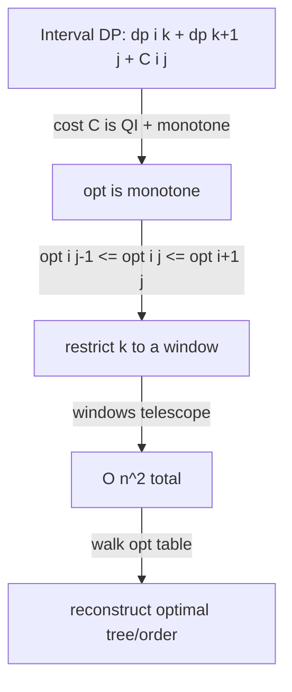

# Knuth's DP Optimization (Knuth-Yao) — Junior Level

> **One-line summary:** For an interval DP of the form `dp[i][j] = min over i ≤ k < j of (dp[i][k] + dp[k+1][j]) + C(i,j)`, when the cost `C` is "nice" (it satisfies the *quadrangle inequality* and *monotonicity*), the best split point `opt[i][j]` is **monotone**: `opt[i][j-1] ≤ opt[i][j] ≤ opt[i+1][j]`. Restricting the `k`-search to that window turns the naive `O(n³)` interval DP into `O(n²)`. The canonical application is the **optimal binary search tree**.

---

## Table of Contents

1. [Introduction](#introduction)
2. [Prerequisites](#prerequisites)
3. [Glossary](#glossary)
4. [Core Concepts](#core-concepts)
5. [Big-O Summary](#big-o-summary)
6. [Real-World Analogies](#real-world-analogies)
7. [Pros & Cons](#pros--cons)
8. [Step-by-Step Walkthrough](#step-by-step-walkthrough)
9. [Code Examples](#code-examples)
10. [Coding Patterns](#coding-patterns)
11. [Error Handling](#error-handling)
12. [Performance Tips](#performance-tips)
13. [Best Practices](#best-practices)
14. [Edge Cases & Pitfalls](#edge-cases--pitfalls)
15. [Common Mistakes](#common-mistakes)
16. [Cheat Sheet](#cheat-sheet)
17. [Visual Animation](#visual-animation)
18. [Summary](#summary)
19. [Further Reading](#further-reading)

---

## Introduction

Suppose you are building a dictionary that will be searched millions of times. Some words are looked up constantly (`the`, `and`), others almost never. You want to arrange the words in a **binary search tree** so that the *average* search is as fast as possible — frequently searched words should sit near the root (short path), rare words can sit deep. The question "what is the best-possible tree?" is the **optimal binary search tree** (optimal BST) problem, and it is the headline example of this entire topic.

The optimal BST problem has a clean dynamic-programming solution. If you decide that key `k` is the **root** of the subtree covering keys `i..j`, the left subtree handles `i..k-1`, the right subtree handles `k+1..j`, and every key drops one level deeper, paying its frequency once more. Trying every possible root and recursing gives:

```
dp[i][j] = min over i ≤ k ≤ j of ( dp[i][k-1] + dp[k+1][j] ) + W(i, j)
```

where `W(i, j)` is the total frequency of keys `i..j` (the "cost of going one level deeper for everyone in this range"). This is a textbook interval DP. Computed directly it costs **`O(n³)`**: there are `O(n²)` intervals `(i, j)` and each one tries up to `n` split points `k`.

Here is the beautiful shortcut. The frequency-sum cost `W` is *not arbitrary* — it satisfies two structural properties (the **quadrangle inequality** and **monotonicity**). Donald Knuth proved that under those properties the **optimal root** `opt[i][j]` moves in a disciplined way as you grow the interval:

> **`opt[i][j-1] ≤ opt[i][j] ≤ opt[i+1][j]`**

In plain words: the best root for `i..j` lies between the best root for the slightly smaller interval `i..j-1` and the best root for the slightly smaller interval `i+1..j`. So instead of scanning all `n` candidate roots for every interval, you only scan the **window** `[opt[i][j-1], opt[i+1][j]]`. Summed across all intervals these windows telescope, and the total work collapses from `O(n³)` to **`O(n²)`**. This is **Knuth's optimization** (sometimes called **Knuth-Yao** after F. F. Yao's later generalization).

This document teaches the idea from the ground up: the `O(n³)` DP first, the monotonicity fact next, and finally the `O(n²)` version with the restricted `k`-loop. We use optimal BST as the running example throughout, exactly as Knuth did in 1971.

A close relative is **divide-and-conquer optimization** (sibling topic `11`). Both exploit a monotone optimal split, but they apply to *different DP shapes* — we contrast them carefully in [`middle.md`](./middle.md). Knuth's optimization is specifically for the **interval / two-sided** recurrence above, where a subproblem splits into a *left* and a *right* sub-interval.

---

## Prerequisites

Before reading this file you should be comfortable with:

- **Dynamic programming basics** — memoization, optimal substructure, filling a table. See the parent section `13-dynamic-programming`.
- **Interval DP** — DPs indexed by a range `[i, j]`, filled by increasing interval *length*. (Matrix-chain multiplication is the classic example.)
- **Binary search trees** — what a BST is, what its "search cost" / depth means.
- **Prefix sums** — computing a range sum `W(i, j)` in `O(1)` after an `O(n)` precompute.
- **Big-O notation** — `O(n²)`, `O(n³)`, and why dropping a factor of `n` matters.
- **2D arrays / nested loops** — the DP table and the `opt` table are both `n × n`.

Optional but helpful:

- A glance at **matrix-chain multiplication**, so you recognize the `dp[i][k] + dp[k+1][j]` split shape.
- Familiarity with the word **amortized** — the `O(n²)` bound is an *amortized* (telescoping) argument, not a per-interval one.

---

## Glossary

| Term | Meaning |
|------|---------|
| **Interval DP** | A DP whose state is a contiguous range `[i, j]`; the table is filled by increasing interval length. |
| **Split point `k`** | The index where the interval `[i, j]` is divided into `[i, k]` and `[k+1, j]` (or `root = k` for BST). |
| **`opt[i][j]`** | The split point `k` that achieves the minimum for interval `[i, j]` — the **optimal split / optimal root**. |
| **`C(i, j)`** | A cost added to every interval regardless of the split (e.g. the total frequency `W(i, j)` for optimal BST). |
| **Quadrangle inequality (QI)** | `C(a, c) + C(b, d) ≤ C(a, d) + C(b, c)` for `a ≤ b ≤ c ≤ d`. A "concavity"-like condition on `C`. Also called the **Monge condition**. |
| **Monotonicity (of `C`)** | `C(b, c) ≤ C(a, d)` whenever `[b, c] ⊆ [a, d]` — bigger intervals cost at least as much. |
| **Knuth's optimization** | Using `opt[i][j-1] ≤ opt[i][j] ≤ opt[i+1][j]` to shrink the `k`-search, giving `O(n²)`. |
| **Knuth-Yao** | The same technique; "Yao" credits F. F. Yao, who proved the general QI ⇒ monotone-`opt` theorem (1980). |
| **Optimal BST** | The minimum-expected-cost binary search tree over keys with given access frequencies (Knuth's original 1971 application). |
| **Telescoping** | The summation trick where the per-interval window widths cancel, leaving an `O(n²)` total. |
| **D&C optimization** | A *different* speedup (sibling topic `11`) for `dp[i] = min_k dp_prev[k] + C(k, i)` shapes; contrasted in `middle.md`. |

---

## Core Concepts

### 1. The interval DP shape Knuth's optimization targets

Knuth's optimization applies to recurrences of exactly this form:

```
dp[i][j] = min over i ≤ k < j of ( dp[i][k] + dp[k+1][j] ) + C(i, j)
```

The defining features are:

- The state is an **interval** `[i, j]`.
- A subproblem splits into a **left** part `[i, k]` and a **right** part `[k+1, j]` — two sub-intervals that *together* cover `[i, j]`.
- A cost `C(i, j)` is added that depends only on the interval, **not** on the split `k`.

Optimal BST fits this. (For BST the split is the *root* `k` with children `[i, k-1]` and `[k+1, j]`; the indexing shifts by one but the structure is identical — we will use the root formulation in the walkthrough.)

### 2. The naive `O(n³)` algorithm

Fill the table by increasing interval length. For each interval `[i, j]`, try **every** split `k` and keep the minimum:

```
for length = 1 .. n:
    for i, j with j - i = length:
        dp[i][j] = +infinity
        for k = i .. j-1:               # try ALL splits
            cost = dp[i][k] + dp[k+1][j] + C(i, j)
            if cost < dp[i][j]:
                dp[i][j] = cost
                opt[i][j] = k
```

There are `O(n²)` intervals and each inner loop runs up to `n` times, so this is `O(n³)`. For `n = 2000` that is `8 × 10⁹` operations — too slow. We want to cut the inner loop.

### 3. The monotonicity of the optimal split

The magic fact, proved in [`professional.md`](./professional.md):

> If `C` satisfies the quadrangle inequality **and** is monotone on intervals, then `dp` also satisfies the quadrangle inequality, and the optimal split is monotone:
>
> ```
> opt[i][j-1] ≤ opt[i][j] ≤ opt[i+1][j]
> ```

Intuitively: as you extend the interval on the right (`j-1 → j`), the best split can only move *right* (or stay). As you extend on the left (`i+1 → i`), the best split can only move *left* (or stay). So `opt[i][j]` is sandwiched between two neighbors you have **already computed** (both are shorter intervals).

### 4. The `O(n²)` algorithm with the restricted `k`-loop

Because intervals are filled by increasing length, when we reach `[i, j]` both `[i, j-1]` and `[i+1, j]` are already done, so `opt[i][j-1]` and `opt[i+1][j]` are known. We restrict the inner loop to that window:

```
for length = 1 .. n:
    for i, j with j - i = length:
        lo = opt[i][j-1]                 # already computed
        hi = opt[i+1][j]                 # already computed
        dp[i][j] = +infinity
        for k = lo .. hi:                # RESTRICTED window
            cost = dp[i][k] + dp[k+1][j] + C(i, j)
            if cost < dp[i][j]:
                dp[i][j] = cost
                opt[i][j] = k
```

The only change is the loop bounds. Correctness is guaranteed by the monotonicity theorem (the optimum is *inside* the window). The speedup comes from the window widths summing to `O(n²)` total instead of `O(n³)` — see the next concept.

### 5. Why the restricted loops sum to `O(n²)` (telescoping)

Fix an interval length `L`. The total work over all intervals of that length is:

```
Σ over i of ( opt[i+1][i+L] − opt[i][i+L-1] + 1 )
```

The `opt[i+1][...]` terms and the `opt[i][...]` terms **telescope** (consecutive ones cancel), leaving roughly `opt[last] − opt[first] + (number of intervals) ≤ n + n = O(n)` work *per length*. There are `n` lengths, so the grand total is `O(n²)`. This is the whole payoff. (The careful telescoping proof is in [`professional.md`](./professional.md).)

### 6. The two conditions on `C`, in plain language

- **Quadrangle inequality (QI):** `C(a, c) + C(b, d) ≤ C(a, d) + C(b, c)` for `a ≤ b ≤ c ≤ d`. Think "two overlapping intervals cost no more than the wider + narrower pair." A range-sum cost like `W(i, j) = freq[i] + … + freq[j]` satisfies this *with equality* (both sides equal the same sum), so QI holds.
- **Monotonicity:** `C(b, c) ≤ C(a, d)` when `[b, c] ⊆ [a, d]`. For a sum of non-negative frequencies, a sub-interval's sum is `≤` the bigger interval's sum, so this holds too.

If your cost is a sum of non-negative weights over the interval — as in optimal BST and optimal merging — **both conditions hold automatically**, and Knuth's optimization is safe to apply. We verify and prove this carefully in the higher-level files.

---

## Big-O Summary

| Quantity | Naive interval DP | Knuth's optimization |
|----------|-------------------|----------------------|
| Time | **O(n³)** | **O(n²)** |
| Space | O(n²) (dp + opt tables) | O(n²) (dp + opt tables) |
| Per-interval `k`-scan | up to `n` | amortized `O(1)` (windows telescope) |
| Precompute `C(i,j)` (range sum) | O(n) prefix sums, O(1) per query | same |
| Reconstruct the tree/order | O(n) walk over `opt` | same |

The headline is dropping a full factor of `n`: from `O(n³)` to **`O(n²)`**, which moves the practical limit from `n ≈ 500` to `n ≈ 5000`+ comfortably. Space is unchanged — you still store the `dp` and `opt` tables, both `n × n`.

---

## Real-World Analogies

| Concept | Analogy |
|---------|---------|
| Optimal BST | Arranging a library's most-borrowed books on the shelves nearest the door so the *average* trip is shortest. |
| The cost `C(i,j) = W(i,j)` | Everyone in the range "walks one extra aisle," so the penalty is the total foot-traffic of that range. |
| `opt[i][j]` monotone | As you add one more book to the right of a shelf range, the ideal "center of gravity" (best root) drifts right, never left. |
| Restricted `k`-window | You do not re-search the whole shelf for the new best center — you only check between the two neighbors' centers. |
| Telescoping to `O(n²)` | Each re-search is tiny because it starts where the last one left off; the little searches stitch together into one sweep. |
| QI + monotonicity | The cost behaves "smoothly" enough that the best center never jumps around erratically — that smoothness is exactly what lets you skip work. |

Where the analogy breaks: real shelving has physical constraints; the DP is a pure combinatorial optimum. And the monotonicity is a *proved theorem* under QI, not a vague intuition — apply it only when the conditions actually hold (see pitfalls).

---

## Pros & Cons

| Pros | Cons |
|------|------|
| Drops `O(n³)` interval DP to `O(n²)` with a tiny code change (just the loop bounds). | Only applies to the specific two-sided interval recurrence `dp[i][k] + dp[k+1][j] + C(i,j)`. |
| Correctness is a clean theorem once QI + monotonicity hold. | You **must verify** QI + monotonicity; applying it blindly gives silently wrong answers. |
| Needs the `opt` table you often want anyway (for reconstruction). | Same `O(n²)` space as the naive DP — no space win. |
| The canonical applications (optimal BST, optimal merge) are common and important. | Not the right tool for `dp[i] = min_k dp[k] + C(k,i)` — that is D&C optimization (topic `11`). |
| Idea generalizes (Knuth-Yao / SMAWL / Monge) to a whole family of problems. | The telescoping argument is subtle; easy to mis-bound the windows and think it is still `O(n³)`. |

**When to use:** an interval DP that splits into left+right sub-intervals with a per-interval additive cost `C` that is a non-negative range sum (or otherwise provably QI + monotone). Optimal BST, optimal file merging, optimal alphabetic/Huffman-like trees, certain matrix-chain-like problems.

**When NOT to use:** the recurrence is not a left+right interval split (use D&C optimization or convex-hull trick instead); `C` does not satisfy QI; `n` is tiny (the naive `O(n³)` is simpler and fine for `n ≤ 300`).

---

## Step-by-Step Walkthrough

Let us solve a tiny **optimal BST** instance by hand and watch `opt` stay monotone.

Keys `1, 2, 3` with access frequencies `freq = [5, 2, 4]` (indexing keys `0,1,2`). The cost of a subtree over keys `i..j` is `dp[i][j] = min_root ( dp[left] + dp[right] ) + W(i, j)`, where `W(i, j) = Σ freq[i..j]`. Prefix sums of frequency: `W(0,0)=5, W(1,1)=2, W(2,2)=4, W(0,1)=7, W(1,2)=6, W(0,2)=11`.

**Length-1 intervals (single keys).** A single key is its own root, cost = its frequency:

```
dp[0][0] = 5,  opt[0][0] = 0
dp[1][1] = 2,  opt[1][1] = 1
dp[2][2] = 4,  opt[2][2] = 2
```

**Length-2 intervals.**

Interval `[0,1]` (keys 1,2), `W=7`. Try roots 0 and 1:
```
root 0: dp[-]=0 (empty left) + dp[1][1]=2 → 2 + 7 = 9
root 1: dp[0][0]=5 + dp[-]=0 (empty right) → 5 + 7 = 12
dp[0][1] = 9,  opt[0][1] = 0
```

Interval `[1,2]` (keys 2,3), `W=6`. Try roots 1 and 2:
```
root 1: 0 + dp[2][2]=4 → 4 + 6 = 10
root 2: dp[1][1]=2 + 0 → 2 + 6 = 8
dp[1][2] = 8,  opt[1][2] = 2
```

**Length-3 interval `[0,2]` (all keys), `W=11`.** Here is where Knuth's window helps. The monotone bound says:
```
opt[0][2] is in [ opt[0][1], opt[1][2] ] = [ 0, 2 ]
```
For this tiny case the window is the full range `{0,1,2}`, but watch the values:
```
root 0: dp[-]=0      + dp[1][2]=8  → 8  + 11 = 19
root 1: dp[0][0]=5   + dp[2][2]=4  → 9  + 11 = 20
root 2: dp[0][1]=9   + dp[-]=0     → 9  + 11 = 20
dp[0][2] = 19,  opt[0][2] = 0
```

The optimum root is key `0` (frequency 5, the most-accessed key sits at the root — exactly what intuition predicts). And `opt[0][2] = 0`, which indeed lies in `[opt[0][1], opt[1][2]] = [0, 2]`. **The monotonicity held.** On larger inputs this window is a small slice, not the whole range, and that is where the `O(n²)` speedup comes from.

Final answer: minimum expected cost `= 19` (in frequency-weighted depth units). The optimal tree has key 1 (freq 5) at the root, key 2 (freq 2) as a child, key 3 (freq 4)... — reconstructing via `opt` gives the exact shape.

---

## Code Examples

### Example: Optimal BST — naive `O(n³)` then Knuth's `O(n²)`

We solve the same instance both ways and check the answers match. `W(i, j)` is a range sum of frequencies via prefix sums.

#### Go

```go
package main

import "fmt"

const INF = int64(1) << 60

// rangeSum returns freq[i..j] using prefix sums.
func makeRange(freq []int64) func(i, j int) int64 {
	n := len(freq)
	pre := make([]int64, n+1)
	for i := 0; i < n; i++ {
		pre[i+1] = pre[i] + freq[i]
	}
	return func(i, j int) int64 {
		if i > j {
			return 0
		}
		return pre[j+1] - pre[i]
	}
}

// Naive O(n^3) optimal BST.
func optimalBSTNaive(freq []int64) int64 {
	n := len(freq)
	W := makeRange(freq)
	dp := make([][]int64, n)
	for i := range dp {
		dp[i] = make([]int64, n)
	}
	for i := 0; i < n; i++ {
		dp[i][i] = freq[i]
	}
	for length := 1; length < n; length++ {
		for i := 0; i+length < n; i++ {
			j := i + length
			dp[i][j] = INF
			for r := i; r <= j; r++ { // root = r, try ALL
				left := int64(0)
				if r > i {
					left = dp[i][r-1]
				}
				right := int64(0)
				if r < j {
					right = dp[r+1][j]
				}
				if c := left + right + W(i, j); c < dp[i][j] {
					dp[i][j] = c
				}
			}
		}
	}
	return dp[0][n-1]
}

// Knuth O(n^2) optimal BST using monotone opt.
func optimalBSTKnuth(freq []int64) int64 {
	n := len(freq)
	W := makeRange(freq)
	dp := make([][]int64, n)
	opt := make([][]int, n)
	for i := range dp {
		dp[i] = make([]int64, n)
		opt[i] = make([]int, n)
		dp[i][i] = freq[i]
		opt[i][i] = i
	}
	for length := 1; length < n; length++ {
		for i := 0; i+length < n; i++ {
			j := i + length
			dp[i][j] = INF
			lo := opt[i][j-1]   // already computed
			hi := opt[i+1][j]   // already computed
			for r := lo; r <= hi; r++ { // RESTRICTED window
				left := int64(0)
				if r > i {
					left = dp[i][r-1]
				}
				right := int64(0)
				if r < j {
					right = dp[r+1][j]
				}
				if c := left + right + W(i, j); c < dp[i][j] {
					dp[i][j] = c
					opt[i][j] = r
				}
			}
		}
	}
	return dp[0][n-1]
}

func main() {
	freq := []int64{5, 2, 4}
	fmt.Println("naive:", optimalBSTNaive(freq)) // 19
	fmt.Println("knuth:", optimalBSTKnuth(freq)) // 19
}
```

#### Java

```java
public class OptimalBST {
    static final long INF = 1L << 60;

    static long[] prefix(long[] freq) {
        long[] pre = new long[freq.length + 1];
        for (int i = 0; i < freq.length; i++) pre[i + 1] = pre[i] + freq[i];
        return pre;
    }

    static long W(long[] pre, int i, int j) {
        if (i > j) return 0;
        return pre[j + 1] - pre[i];
    }

    static long naive(long[] freq) {
        int n = freq.length;
        long[] pre = prefix(freq);
        long[][] dp = new long[n][n];
        for (int i = 0; i < n; i++) dp[i][i] = freq[i];
        for (int len = 1; len < n; len++)
            for (int i = 0; i + len < n; i++) {
                int j = i + len;
                dp[i][j] = INF;
                for (int r = i; r <= j; r++) {
                    long left = (r > i) ? dp[i][r - 1] : 0;
                    long right = (r < j) ? dp[r + 1][j] : 0;
                    dp[i][j] = Math.min(dp[i][j], left + right + W(pre, i, j));
                }
            }
        return dp[0][n - 1];
    }

    static long knuth(long[] freq) {
        int n = freq.length;
        long[] pre = prefix(freq);
        long[][] dp = new long[n][n];
        int[][] opt = new int[n][n];
        for (int i = 0; i < n; i++) { dp[i][i] = freq[i]; opt[i][i] = i; }
        for (int len = 1; len < n; len++)
            for (int i = 0; i + len < n; i++) {
                int j = i + len;
                dp[i][j] = INF;
                int lo = opt[i][j - 1], hi = opt[i + 1][j];
                for (int r = lo; r <= hi; r++) {
                    long left = (r > i) ? dp[i][r - 1] : 0;
                    long right = (r < j) ? dp[r + 1][j] : 0;
                    long c = left + right + W(pre, i, j);
                    if (c < dp[i][j]) { dp[i][j] = c; opt[i][j] = r; }
                }
            }
        return dp[0][n - 1];
    }

    public static void main(String[] args) {
        long[] freq = {5, 2, 4};
        System.out.println("naive: " + naive(freq)); // 19
        System.out.println("knuth: " + knuth(freq)); // 19
    }
}
```

#### Python

```python
INF = float("inf")


def prefix(freq):
    pre = [0] * (len(freq) + 1)
    for i, f in enumerate(freq):
        pre[i + 1] = pre[i] + f
    return pre


def w(pre, i, j):
    return 0 if i > j else pre[j + 1] - pre[i]


def optimal_bst_naive(freq):
    n = len(freq)
    pre = prefix(freq)
    dp = [[0] * n for _ in range(n)]
    for i in range(n):
        dp[i][i] = freq[i]
    for length in range(1, n):
        for i in range(n - length):
            j = i + length
            dp[i][j] = INF
            for r in range(i, j + 1):              # ALL roots
                left = dp[i][r - 1] if r > i else 0
                right = dp[r + 1][j] if r < j else 0
                dp[i][j] = min(dp[i][j], left + right + w(pre, i, j))
    return dp[0][n - 1]


def optimal_bst_knuth(freq):
    n = len(freq)
    pre = prefix(freq)
    dp = [[0] * n for _ in range(n)]
    opt = [[0] * n for _ in range(n)]
    for i in range(n):
        dp[i][i] = freq[i]
        opt[i][i] = i
    for length in range(1, n):
        for i in range(n - length):
            j = i + length
            dp[i][j] = INF
            lo, hi = opt[i][j - 1], opt[i + 1][j]   # RESTRICTED window
            for r in range(lo, hi + 1):
                left = dp[i][r - 1] if r > i else 0
                right = dp[r + 1][j] if r < j else 0
                c = left + right + w(pre, i, j)
                if c < dp[i][j]:
                    dp[i][j] = c
                    opt[i][j] = r
    return dp[0][n - 1]


if __name__ == "__main__":
    freq = [5, 2, 4]
    print("naive:", optimal_bst_naive(freq))  # 19
    print("knuth:", optimal_bst_knuth(freq))  # 19
```

**What it does:** builds prefix sums for `W(i, j)`, then solves optimal BST both ways. The only difference between the two functions is the inner `r`-loop bounds (`i..j` versus `opt[i][j-1]..opt[i+1][j]`). Both print `19`.
**Run:** `go run main.go` | `javac OptimalBST.java && java OptimalBST` | `python obst.py`

---

## Coding Patterns

### Pattern 1: The naive `O(n³)` oracle you test against

**Intent:** Before trusting the `O(n²)` version, compute the answer the obvious way and confirm they agree on small random inputs.

```python
def obst_oracle(freq):
    # Identical to optimal_bst_naive above; scan ALL roots.
    # Use as ground truth for the Knuth version on random small inputs.
    ...
```

This is `O(n³)` — too slow for big `n`, but perfect as a correctness oracle. The Knuth version must always match it.

### Pattern 2: Fill by increasing interval length

**Intent:** Knuth's optimization *requires* that `opt[i][j-1]` and `opt[i+1][j]` are computed before `opt[i][j]`. Filling by increasing length `j - i` guarantees this, because both neighbors are shorter.

```python
for length in range(1, n):
    for i in range(n - length):
        j = i + length
        # opt[i][j-1] and opt[i+1][j] are length-(length-1) intervals: done.
```

### Pattern 3: Reconstruct the tree from `opt`

**Intent:** The minimum cost is `dp[0][n-1]`, but you often want the *tree itself*. Walk the `opt` table recursively: `opt[i][j]` is the root, recurse into `[i, opt[i][j]-1]` and `[opt[i][j]+1, j]`.



---

## Error Handling

| Error | Cause | Fix |
|-------|-------|-----|
| Wrong answer vs the naive oracle | Applied Knuth's window when `C` is **not** QI + monotone. | Verify the conditions first; only then restrict the loop. |
| `opt[i][j-1]` or `opt[i+1][j]` not yet set | Filled the table in the wrong order (not by length). | Always loop `length = 1..n` outer, `i` inner. |
| Index out of range at `opt[i+1][j]` | Forgot the base diagonal `opt[i][i] = i`. | Initialize `dp[i][i]` and `opt[i][i]` before the length loop. |
| Empty-child indexing bug | `dp[i][r-1]` when `r == i` (no left child). | Treat empty sub-interval cost as `0`. |
| Overflow on large frequencies | `dp` values can be `Σ freq × depth`, large. | Use 64-bit (`int64` / `long`); Python is arbitrary-precision. |
| `O(n³)` despite the window | Window mis-set to the full range. | Use exactly `lo = opt[i][j-1]`, `hi = opt[i+1][j]`. |

---

## Performance Tips

- **Precompute `W(i, j)` with prefix sums** so each query is `O(1)`. Recomputing the sum inside the loop reintroduces an `O(n)` factor and ruins the `O(n²)` bound.
- **Store `dp` and `opt` as flat or row-major arrays** for cache locality; the inner loop reads `dp[i][r-1]` and `dp[r+1][j]`.
- **Do not recompute neighbors** — read `opt[i][j-1]` and `opt[i+1][j]` directly; they are already filled.
- **Use `long`/`int64`** for `dp`; frequency-weighted costs grow quickly.
- **Keep the window tight** — `hi = opt[i+1][j]` (not `j`); a too-wide window silently costs you the speedup.

---

## Best Practices

- Always test the `O(n²)` version against the `O(n³)` oracle (Pattern 1) on random small inputs before trusting it.
- Confirm `C` satisfies **both** QI and monotonicity for your problem. For a non-negative range-sum cost this is automatic; for anything else, prove it (see `senior.md`/`professional.md`).
- Initialize the diagonal (`dp[i][i]`, `opt[i][i]`) explicitly; the whole window logic depends on it.
- Fill strictly by increasing interval length so both neighbor `opt` values exist.
- Keep `W`/`C` as a separate `O(1)` function so the DP loop stays clean and the cost model is easy to audit.

---

## Edge Cases & Pitfalls

- **`n = 0` or `n = 1`** — trivial: cost `0` for empty, `freq[0]` for a single key. Make sure the length loop handles these without entering the inner scan.
- **Empty sub-intervals** — when the root is the leftmost (`r = i`) there is no left child; its cost is `0`. Same on the right.
- **Equal costs / ties** — when several splits tie, any choice is optimal *for the value*, but **pick consistently** (e.g. the smallest `k`) so `opt` stays monotone and reconstruction is deterministic.
- **`C` not monotone** — if intervals can *decrease* cost as they grow (e.g. negative weights), monotonicity fails and the window may exclude the true optimum. Do **not** apply Knuth's optimization.
- **Wrong recurrence shape** — `dp[i] = min_k dp[k] + cost(k, i)` is a *one-sided* DP; that is D&C optimization (topic `11`), **not** Knuth's interval optimization.
- **Off-by-one in BST indexing** — the root formulation uses children `[i, r-1]` and `[r+1, j]`; the generic split formulation uses `[i, k]` and `[k+1, j]`. Pick one and be consistent.

---

## Common Mistakes

1. **Applying the window without checking QI + monotonicity** — the single most dangerous mistake; the answer is silently wrong, not crashing.
2. **Filling the table in the wrong order** — if `[i, j]` is computed before `[i, j-1]` or `[i+1, j]`, the window bounds are garbage.
3. **Recomputing `W(i, j)` in `O(n)` inside the loop** — turns `O(n²)` back into `O(n³)`; always use prefix sums.
4. **Setting the window to `[i, j]`** — that is the naive scan; the speedup needs `[opt[i][j-1], opt[i+1][j]]`.
5. **Forgetting the base diagonal** — `opt[i][i]` must be `i` (or `i ± 1` per convention) or the first length-2 intervals read uninitialized neighbors.
6. **Inconsistent tie-breaking** — different choices among equal-cost splits can break monotonicity and corrupt the window for larger intervals.
7. **Confusing it with D&C optimization** — both use monotone `opt`, but they target different recurrence shapes (see `middle.md`).

---

## Cheat Sheet

| Question | Answer |
|----------|--------|
| Recurrence shape | `dp[i][j] = min_{i≤k<j} (dp[i][k] + dp[k+1][j]) + C(i,j)` |
| Speedup | `O(n³) → O(n²)` |
| Key fact | `opt[i][j-1] ≤ opt[i][j] ≤ opt[i+1][j]` |
| Conditions on `C` | quadrangle inequality + monotonicity |
| Fill order | by increasing interval length |
| Inner loop bounds | `for k = opt[i][j-1] .. opt[i+1][j]` |
| Canonical app | optimal binary search tree (Knuth 1971) |
| Other app | optimal file merging / alphabetic trees |
| Cost `C` for those | non-negative range sum `W(i,j)` (QI + monotone automatically) |
| NOT for | `dp[i] = min_k dp[k] + C(k,i)` → that's D&C optimization (topic 11) |

Core algorithm:

```
for length = 1 .. n-1:
    for i = 0 .. n-1-length:
        j = i + length
        dp[i][j] = INF
        for k = opt[i][j-1] .. opt[i+1][j]:     # restricted window
            c = dp[i][k] + dp[k+1][j] + C(i,j)
            if c < dp[i][j]: dp[i][j] = c; opt[i][j] = k
# total: O(n^2), because the windows telescope
```

---

## Visual Animation

> See [`animation.html`](./animation.html) for an interactive visualization.
>
> The animation demonstrates:
> - The interval DP table being filled by **increasing interval length** (diagonals).
> - For each `(i, j)`, the **restricted `k`-window** `[opt[i][j-1], opt[i+1][j]]` highlighted versus the full `[i, j]` range it replaces.
> - The chosen `opt[i][j]` recorded and reused as the bound for larger intervals.
> - Step / Run / Reset controls to watch the windows telescope into an `O(n²)` sweep.

---

## Summary

Knuth's optimization speeds up a specific shape of interval DP — `dp[i][j] = min_{i≤k<j} (dp[i][k] + dp[k+1][j]) + C(i,j)` — from `O(n³)` to `O(n²)`. The key fact is that when the per-interval cost `C` satisfies the **quadrangle inequality** and is **monotone**, the optimal split `opt[i][j]` is *monotone*: it lies in the window `[opt[i][j-1], opt[i+1][j]]`, both of which are already computed if you fill the table by increasing interval length. Restricting the inner `k`-loop to that window costs only `O(1)` per interval *amortized*, because the windows telescope to `O(n²)` total. The canonical application is the **optimal binary search tree** (Knuth's 1971 problem) and **optimal file merging**; for both, the cost is a non-negative range sum, which satisfies QI and monotonicity automatically. The code change is tiny — just the loop bounds — but you must *verify the conditions first*, because applying the window when they fail gives silently wrong answers.

---

## Further Reading

- D. E. Knuth, *Optimum Binary Search Trees*, Acta Informatica 1 (1971) — the original.
- F. F. Yao, *Efficient dynamic programming using quadrangle inequalities*, STOC 1980 — the general QI ⇒ monotone-`opt` theorem (the "Yao" in Knuth-Yao).
- *Introduction to Algorithms* (CLRS) — optimal BST DP (Chapter 15) and matrix-chain multiplication (the sibling interval DP).
- Sibling topic `11-divide-and-conquer-optimization` — the related but different monotone-`opt` speedup.
- cp-algorithms.com — "Knuth's Optimization" and "Divide and Conquer DP".
- Parent section `13-dynamic-programming` — interval DP foundations.
