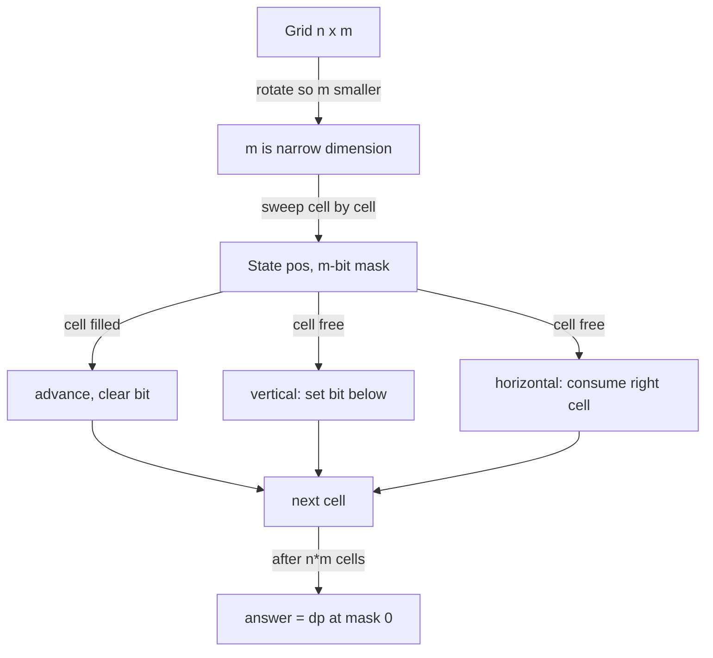

# Profile DP / Broken Profile DP (Tiling a Grid with a Frontier Bitmask) — Junior Level

> **One-line summary:** To count the ways to tile an `n × m` grid with `1×2` dominoes, walk the grid **cell by cell** and carry a small **bitmask** (the *profile*, one bit per column of the narrow dimension `m`) that records the boundary between the already-decided region and the rest. At each cell you decide *leave empty / place a vertical domino / place a horizontal domino*, update the mask, and sum the ways. The cost is `O(n · m · 2^m)`, which is tiny when the narrow dimension `m` is small (say `m ≤ 16`).

---

## Table of Contents

1. [Introduction](#introduction)
2. [Prerequisites](#prerequisites)
3. [Glossary](#glossary)
4. [Core Concepts](#core-concepts)
5. [Big-O Summary](#big-o-summary)
6. [Real-World Analogies](#real-world-analogies)
7. [Pros & Cons](#pros--cons)
8. [Step-by-Step Walkthrough](#step-by-step-walkthrough)
9. [Code Examples](#code-examples)
10. [Coding Patterns](#coding-patterns)
11. [Error Handling](#error-handling)
12. [Performance Tips](#performance-tips)
13. [Best Practices](#best-practices)
14. [Edge Cases & Pitfalls](#edge-cases--pitfalls)
15. [Common Mistakes](#common-mistakes)
16. [Cheat Sheet](#cheat-sheet)
17. [Visual Animation](#visual-animation)
18. [Summary](#summary)
19. [Further Reading](#further-reading)

---

## Introduction

Suppose someone hands you an `n × m` rectangle of unit squares and a pile of `1×2` **dominoes**, and asks: *"In how many different ways can I tile the whole board so that every cell is covered exactly once, no domino sticks out, and no two overlap?"* A domino covers two adjacent cells — either two cells side by side (a **horizontal** domino) or two cells stacked vertically (a **vertical** domino).

The brute-force answer is to try every placement of every domino, which explodes combinatorially. There is a much smarter way that is one of the most useful patterns in competitive programming and combinatorics: **profile dynamic programming**.

The idea is to stop thinking about "the whole board at once" and instead **sweep across the grid one cell at a time**, in reading order (row by row, left to right). At every moment of the sweep there is a clean dividing line — a **frontier** — between the cells we have already decided and the cells we have not yet touched. The only information about the past that the future actually needs is the shape of that frontier: *which cells just behind the frontier are already filled by a domino that pokes across it?* That information is small — it fits in `m` bits, one per column — so we can encode it as an integer **bitmask** called the **profile**.

> **The key fact:** the number of distinct frontier shapes is at most `2^m`, and for each cell we make a constant number of choices, so the whole count runs in `O(n · m · 2^m)`.

When the narrow dimension `m` is small (commonly `m ≤ 16`, sometimes up to `~20`), `2^m` is manageable and the algorithm is fast even when the long dimension `n` is large. This is why the standard trick is **"rotate the board so that `m` is the smaller side"** — the cost is exponential only in the *narrow* dimension.

This file uses **domino tiling of an `n × m` grid** as its running example throughout. We will build the intuition for the frontier, then write the **broken-profile** version that processes exactly one cell per step (so the mask is always exactly `m` bits). Later files generalize to L-trominoes, independent sets on grids, transfer matrices for fixed small `m`, and the proofs.

A reassuring landmark: for the classic `n × m` domino tiling, the answer also has a famous **closed-form product formula** (the Kasteleyn / Temperley-Fisher formula). We will not need it to *compute* the answer — profile DP does that directly — but it is a great way to check your code (the `2 × n` case gives the Fibonacci numbers, for instance).

---

## Prerequisites

Before reading this file you should be comfortable with:

- **Bitmasks** — representing a small set of yes/no flags as the bits of an integer; the operations `mask & (1<<c)` (test bit `c`), `mask | (1<<c)` (set bit `c`), `mask & ~(1<<c)` (clear bit `c`).
- **Basic dynamic programming** — the idea of a DP table indexed by a *state*, filled by a recurrence, where overlapping subproblems are computed once. (See sibling topics in `13-dynamic-programming`.)
- **2D grids and indexing** — converting a `(row, col)` pair to a linear index `row*m + col` and back.
- **Big-O notation** — `O(2^m)`, `O(n · m · 2^m)`.
- **Modular arithmetic** — `(a + b) mod p`; many tiling problems ask for the count modulo a prime like `10^9 + 7` because the count grows fast.

Optional but helpful:

- A glance at **Fibonacci** — the `2 × n` domino tiling count *is* the Fibonacci sequence, which is the gentlest sanity check you can run.
- Familiarity with **recursion / memoization**, since the cell-by-cell DP is naturally written as a recursive function with memoized `(cell, mask)` states.

---

## Glossary

| Term | Meaning |
|------|---------|
| **Tiling** | A placement of dominoes covering every cell of the grid exactly once, with no overlap and nothing hanging off the edge. |
| **Domino** | A `1×2` piece covering two orthogonally adjacent cells. **Vertical** = two stacked cells; **horizontal** = two side-by-side cells. |
| **Profile / frontier** | The boundary between cells already decided and cells not yet decided. Encoded as a bitmask. |
| **Bitmask** | An integer whose bits encode a small set of boolean flags — here, "which frontier cells are already filled." |
| **Broken profile** | The refinement that advances **one cell at a time** (not a whole row). The mask stays exactly `m` bits, encoding the `m` cells on the frontier. |
| **`n`, `m`** | Grid dimensions: `n` rows, `m` columns. We arrange so `m` (the **narrow** dimension) is the smaller one, because cost is exponential in `m`. |
| **State** | A pair `(cell index, mask)` — where we are in the sweep and the shape of the frontier. |
| **Transition** | Moving from one cell to the next by choosing leave-empty / place-vertical / place-horizontal, updating the mask. |
| **Full-row profile** | An alternative where the DP advances a whole row at a time, enumerating which cells of the next row are pushed down by verticals. |
| **Modulus `p`** | A prime (often `10^9 + 7`) we reduce by; tiling counts grow exponentially and overflow 64-bit integers. |

---

## Core Concepts

### 1. Why a frontier is enough

Imagine sweeping a vertical "scan line" through the grid, but more precisely, sweep **cell by cell** in reading order: row 0 left-to-right, then row 1, and so on. Process cell `(r, c)`. Everything **before** it (earlier in reading order) is fully decided; everything **after** it is untouched.

The crucial observation: when you are about to decide cell `(r, c)`, the only cells whose status can still affect your choice are the `m` cells forming a *staircase frontier* — specifically the cells from `(r, c)` going right to the end of the row, plus the cells from the start of row `r+1` up to column `c-1`. That is exactly `m` cells. For each of those `m` cells we only need one bit: **is it already covered by a domino placed earlier (one that reached into it), or is it still free?**

That `m`-bit answer is the **profile**. The past beyond the frontier does not matter because dominoes are local (they cover two adjacent cells), so a fully-decided cell far behind the frontier can never interact with a future placement.

### 2. The state: `(cell, mask)`

We index cells `0, 1, …, n·m − 1` in reading order: cell number `pos = r*m + c`. The DP state is:

```
(pos, mask)  — we are about to decide cell `pos`,
               and `mask` (m bits) says which of the m frontier cells are already filled.
```

`dp[pos][mask]` = number of ways to consistently fill cells `0 … pos−1` (and the cross-frontier parts) so that the frontier currently looks like `mask`.

### 3. The three transitions (broken profile, cell by cell)

When we arrive at cell `(r, c)` with the bit for this cell being either **filled** or **free**:

- **If this cell is already filled** (its bit in `mask` is 1) — it was covered by a vertical domino whose top half was placed in the row above, or by a horizontal domino's left half placed just before. We do nothing here except **advance** to the next cell, clearing this cell's bit (it is now "behind" the frontier).

- **If this cell is free** (its bit is 0), we must cover it now, and there are choices:
  1. **Place a vertical domino** covering `(r, c)` and `(r+1, c)` — only legal if `r + 1 < n`. This *sets* the bit for column `c` so that when the sweep reaches `(r+1, c)` we know it is already filled.
  2. **Place a horizontal domino** covering `(r, c)` and `(r, c+1)` — only legal if `c + 1 < m` **and** cell `(r, c+1)` is currently free. This consumes the next cell to the right.

That is the entire move set. Every legal tiling corresponds to exactly one path of these decisions, so summing over all paths counts all tilings.

> A cell can never be "left empty" forever in a *full* tiling — every cell must be covered. The "leave empty / skip" wording you will see refers to the case where a cell is *already* filled (skip and advance) versus a free cell that we must cover with one of the two domino orientations.

### 4. Advancing the mask by one cell

After deciding cell `(r, c)`, we move to cell `pos+1`. The mask is reinterpreted so that its bits line up with the new frontier. In the standard broken-profile encoding, bit `c` of the mask means "cell in column `c` of the frontier is filled." When we place a vertical domino at `(r, c)`, we set bit `c` (so the cell directly below is marked filled); when we just advance past a filled cell, we clear its bit. Section 8 walks a full example so this becomes concrete.

### 5. Base case and the answer

- **Start:** `dp[0][0] = 1` — before deciding any cell, the frontier is empty (all bits 0) and there is exactly one such empty configuration.
- **Answer:** after processing all `n·m` cells, the only valid final mask is `0` (no domino pokes past the bottom-right edge). The answer is `dp[n·m][0]`.

### 6. Take everything mod `p`

Tiling counts grow exponentially. For example an `n × m` board's count roughly multiplies by a constant per added row. By moderate sizes it overflows 64-bit integers, so problems ask for the count **modulo a prime** like `10^9 + 7`. Reduce after each addition. Because `(+) mod p` is valid arithmetic, the count theorem holds for the residues too.

---

## Big-O Summary

| Quantity | Value | Notes |
|----------|-------|-------|
| Number of states | **O(n · m · 2^m)** | `n·m` cells × `2^m` masks. |
| Transitions per state | O(1) | At most 3 choices (skip / vertical / horizontal). |
| Total time | **O(n · m · 2^m)** | The headline cost. |
| Space (rolling) | **O(2^m)** | Keep only the current and next cell's mask layer. |
| Space (full table) | O(n · m · 2^m) | If you store every layer (rarely needed). |
| Closed-form check (`2 × n`) | O(n) | The `2 × n` count is `Fibonacci(n+1)`. |

The headline number is **`O(n · m · 2^m)`** — *linear* in the area `n·m` and *exponential only in the narrow dimension `m`*. That is why you always rotate so `m` is the smaller side: with `m = 12`, `2^m = 4096`, and even `n = 10^4` is instant.

---

## Real-World Analogies

| Concept | Analogy |
|---------|---------|
| Sweeping cell by cell | Reading a book one character at a time, left to right, top to bottom — you never need to re-read earlier pages to know what to write next. |
| The frontier / profile | A **zipper**: everything below the zipper is sealed (decided), everything above is open, and the only thing that matters is the exact shape of the teeth right at the zipper line. |
| The bitmask | A row of **light switches**, one per column on the frontier: on = "this cell already covered by a domino reaching across the line," off = "still free." |
| Placing a vertical domino | Pushing a peg **down through the frontier** so the cell below is pre-claimed for the next row. |
| Placing a horizontal domino | Snapping two adjacent open zipper teeth together at once. |
| Taking mod `p` | The number of tilings is astronomically large, so you only track the last few digits (the remainder) to keep the bookkeeping in range. |

Where the analogy breaks: a real zipper has one shape, but our DP tracks **all possible** frontier shapes simultaneously and counts how many ways lead to each — it is a superposition of zippers, weighted by the number of ways to reach them.

---

## Pros & Cons

| Pros | Cons |
|------|------|
| Counts tilings of a grid with **huge** long dimension `n` in `O(n · m · 2^m)`. | Exponential in the **narrow** dimension `m`: useless if both sides are large. |
| One uniform technique handles dominoes, trominoes, forbidden cells, colorings, independent sets. | The mask encoding is fiddly; off-by-one bugs in bit indexing are common. |
| The broken-profile (one cell per step) version keeps the mask exactly `m` bits and transitions O(1). | Requires care with modular arithmetic to avoid overflow. |
| Naturally memoized; easy to add blocked cells (just forbid covering them). | For fixed small `m` and astronomically large `n`, you still need transfer-matrix exponentiation (later files) to go faster than `O(n)`. |
| Easy to validate: the `2 × n` case equals Fibonacci. | Choosing the wrong dimension as `m` blows up the runtime by orders of magnitude. |

**When to use:** counting tilings / packings / colorings of a grid where one dimension is small (`m ≤ ~16–20`) and the other can be large; problems with per-cell local constraints; "number of ways to fill" style counting.

**When NOT to use:** both grid dimensions large (`2^m` explodes); problems needing a *single specific* tiling rather than a count (use a constructive/matching approach); problems where the constraint is non-local (cannot be summarized by a fixed-width frontier).

---

## Step-by-Step Walkthrough

Let us tile a tiny **`2 × 3` grid** (so `n = 2` rows, `m = 3` columns) with dominoes and count by hand, then mirror it with the broken-profile sweep. The answer is **3** (we will confirm).

The three tilings of `2 × 3`:

```
Tiling A: three vertical dominoes
  | | |        columns 0,1,2 each a vertical domino
  | | |

Tiling B: a horizontal pair on top-left, the rest forced
  [=][|]       cells (0,0)-(0,1) horizontal; (1,0)-(1,1) horizontal; column 2 vertical
  [=][|]

Tiling C: a horizontal pair on the right
  [|][=]       column 0 vertical; (0,1)-(0,2) horizontal; (1,1)-(1,2) horizontal
  [|][=]
```

So the count is **3**.

**Now the broken-profile sweep.** Cells in reading order: `(0,0)→(0,1)→(0,2)→(1,0)→(1,1)→(1,2)`, indices `0..5`. The mask has `m = 3` bits, bit `c` = "column `c` cell on the frontier is already filled."

We start with `dp[pos=0][mask=000] = 1`.

```
pos 0, cell (0,0), mask 000 (cell free) — must cover it:
  • vertical (0,0)-(1,0): set bit 0 → go to pos 1 with mask 001
  • horizontal (0,0)-(0,1): consume (0,1) → go to pos 1 with mask 010
    (bit 1 set means column-1 frontier cell now filled by this horizontal)
```

Two branches. Follow them; each subsequent free cell again forks into the legal {vertical, horizontal} options, while each already-filled cell just advances and clears its bit. Carrying this out fully (the animation does it visually) yields exactly the three terminal paths corresponding to tilings A, B, C, and the final `dp[pos=6][mask=000] = 3`.

**Verify with the known formula.** For a `2 × n` board the domino-tiling count is `Fibonacci(n+1)` with `F(1)=1, F(2)=1, F(3)=2, F(4)=3`. Here `n = 3` (treating the `2` as the fixed small side), and indeed the `2 × 3` count is `3`. The hand count and the formula agree, and a correct broken-profile DP must return `3`.

**One more by formula:** `2 × 4` should be `F(5) = 5`; `2 × 5` should be `F(6) = 8`. These make excellent unit tests.

---

## Code Examples

### Example: Count Domino Tilings of an `n × m` Grid (mod `p`)

We use the **broken-profile** DP: process cells `0 … n·m−1` in reading order. State `dp[mask]` = number of ways to reach the current cell with frontier `mask` (we roll the array forward one cell at a time). Bit `c` of `mask` means "the cell in column `c` on the frontier is already filled."

The clean way to advance: at cell `(r, c)`, let `bit = 1 << c`.
- If `mask & bit` (already filled): the only move is to advance, clearing the bit → next mask `mask ^ bit`.
- Else (free):
  - **vertical** (needs `r+1 < n`): advance with the bit *set* (`mask | bit`), so the cell below is marked filled.
  - **horizontal** (needs `c+1 < m` and column `c+1` currently free, i.e. `!(mask & (1<<(c+1)))`): this covers `(r,c)` and `(r,c+1)`; after advancing past `(r,c)` we want column `c+1` marked filled. With the per-cell rolling encoding below, that is achieved by setting bit `c+1`.

We always rotate so `m` is the smaller dimension.

#### Go

```go
package main

import "fmt"

const MOD = 1_000_000_007

// countTilings returns the number of domino tilings of an n x m grid, mod p.
func countTilings(n, m int) int64 {
	if (n*m)%2 != 0 {
		return 0 // odd number of cells: impossible to tile with dominoes
	}
	if m > n {
		n, m = m, n // ensure m is the narrow (small) dimension
	}
	full := 1 << m
	// dp over masks for the current cell; start before cell 0 with empty frontier.
	dp := make([]int64, full)
	dp[0] = 1
	for r := 0; r < n; r++ {
		for c := 0; c < m; c++ {
			ndp := make([]int64, full)
			bit := 1 << c
			for mask := 0; mask < full; mask++ {
				if dp[mask] == 0 {
					continue
				}
				v := dp[mask]
				if mask&bit != 0 {
					// cell already filled: advance, clear the bit
					ndp[mask^bit] = (ndp[mask^bit] + v) % MOD
				} else {
					// cell free: place vertical (if room below)
					if r+1 < n {
						ndp[mask|bit] = (ndp[mask|bit] + v) % MOD
					}
					// place horizontal (if room right and right cell free)
					if c+1 < m && mask&(1<<(c+1)) == 0 {
						ndp[mask|(1<<(c+1))] = (ndp[mask|(1<<(c+1))] + v) % MOD
					}
				}
			}
			dp = ndp
		}
	}
	return dp[0]
}

func main() {
	fmt.Println(countTilings(2, 3)) // 3
	fmt.Println(countTilings(2, 4)) // 5  (Fibonacci F(5))
	fmt.Println(countTilings(4, 4)) // 36
	fmt.Println(countTilings(8, 8)) // 12988816
}
```

#### Java

```java
public class DominoTilings {
    static final long MOD = 1_000_000_007L;

    static long countTilings(int n, int m) {
        if (((long) n * m) % 2 != 0) return 0; // odd area: impossible
        if (m > n) { int tmp = n; n = m; m = tmp; } // narrow dimension = m
        int full = 1 << m;
        long[] dp = new long[full];
        dp[0] = 1;
        for (int r = 0; r < n; r++) {
            for (int c = 0; c < m; c++) {
                long[] ndp = new long[full];
                int bit = 1 << c;
                for (int mask = 0; mask < full; mask++) {
                    if (dp[mask] == 0) continue;
                    long v = dp[mask];
                    if ((mask & bit) != 0) {
                        int nm = mask ^ bit;
                        ndp[nm] = (ndp[nm] + v) % MOD;
                    } else {
                        if (r + 1 < n) {
                            int nm = mask | bit;
                            ndp[nm] = (ndp[nm] + v) % MOD;
                        }
                        if (c + 1 < m && (mask & (1 << (c + 1))) == 0) {
                            int nm = mask | (1 << (c + 1));
                            ndp[nm] = (ndp[nm] + v) % MOD;
                        }
                    }
                }
                dp = ndp;
            }
        }
        return dp[0];
    }

    public static void main(String[] args) {
        System.out.println(countTilings(2, 3)); // 3
        System.out.println(countTilings(2, 4)); // 5
        System.out.println(countTilings(4, 4)); // 36
        System.out.println(countTilings(8, 8)); // 12988816
    }
}
```

#### Python

```python
MOD = 1_000_000_007


def count_tilings(n, m):
    if (n * m) % 2 != 0:
        return 0                       # odd area: impossible
    if m > n:
        n, m = m, n                    # narrow dimension = m
    full = 1 << m
    dp = [0] * full
    dp[0] = 1
    for r in range(n):
        for c in range(m):
            ndp = [0] * full
            bit = 1 << c
            for mask in range(full):
                if dp[mask] == 0:
                    continue
                v = dp[mask]
                if mask & bit:
                    nm = mask ^ bit            # filled: advance, clear bit
                    ndp[nm] = (ndp[nm] + v) % MOD
                else:
                    if r + 1 < n:              # vertical
                        nm = mask | bit
                        ndp[nm] = (ndp[nm] + v) % MOD
                    if c + 1 < m and not (mask & (1 << (c + 1))):  # horizontal
                        nm = mask | (1 << (c + 1))
                        ndp[nm] = (ndp[nm] + v) % MOD
            dp = ndp
    return dp[0]


if __name__ == "__main__":
    print(count_tilings(2, 3))  # 3
    print(count_tilings(2, 4))  # 5
    print(count_tilings(4, 4))  # 36
    print(count_tilings(8, 8))  # 12988816
```

**What it does:** sweeps the grid cell by cell, carrying an `m`-bit frontier mask, and sums the ways for each of the three local moves.
**Run:** `go run main.go` | `javac DominoTilings.java && java DominoTilings` | `python tilings.py`

---

## Coding Patterns

### Pattern 1: Brute-Force Tiling Counter (the oracle you test against)

**Intent:** Before trusting the profile DP, count tilings the slow, obvious way (recursive backtracking that places a domino on the first free cell) and check the two agree on small grids.

```python
def count_tilings_bruteforce(n, m):
    filled = [[False] * m for _ in range(n)]

    def first_free():
        for r in range(n):
            for c in range(m):
                if not filled[r][c]:
                    return r, c
        return None

    def rec():
        cell = first_free()
        if cell is None:
            return 1                       # all covered → one full tiling
        r, c = cell
        total = 0
        if r + 1 < n and not filled[r + 1][c]:   # vertical
            filled[r][c] = filled[r + 1][c] = True
            total += rec()
            filled[r][c] = filled[r + 1][c] = False
        if c + 1 < m and not filled[r][c + 1]:   # horizontal
            filled[r][c] = filled[r][c + 1] = True
            total += rec()
            filled[r][c] = filled[r][c + 1] = False
        return total

    return rec()
```

This is exponential and only for small grids, but it is the perfect correctness oracle. The profile DP must give the same answer.

### Pattern 2: Always Rotate So `m` Is the Smaller Side

**Intent:** Cost is `O(n · m · 2^m)` — exponential in `m`. Always pick the smaller dimension as `m`.

```python
if m > n:
    n, m = m, n
```

A `1000 × 10` board with `m = 10` costs `~1000 · 10 · 1024`; the same board treated as `m = 1000` is astronomically infeasible. One swap is the difference.

### Pattern 3: Reject Odd Area Early

**Intent:** A domino covers 2 cells, so a grid with an odd number of cells cannot be tiled. Return 0 immediately.

```python
if (n * m) % 2 != 0:
    return 0
```



---

## Error Handling

| Error | Cause | Fix |
|-------|-------|-----|
| Wildly wrong huge numbers | Forgot to take `mod p`; 64-bit overflow. | Reduce after every `+` in the transition. |
| Runtime / memory blow-up | Used the **large** dimension as `m`. | Swap so `m = min(n, m)` before allocating `2^m`. |
| Always returns 0 | Odd area, or never reaching final mask 0, or wrong final index. | Check `(n*m)%2`; the answer is `dp[mask=0]` after all `n·m` cells. |
| Off-by-one in bit index | Confusing column index with bit position, or shifting by `c` vs `c+1`. | Bit `c` ↔ column `c`; horizontal sets bit `c+1`. |
| Counts too large by far | Allowed placing a domino on an already-filled cell, or double-covering. | A free cell must be covered exactly once; a filled cell only advances. |
| Vertical placed off the bottom | Allowed vertical when `r+1 == n`. | Guard `if r+1 < n`. |
| Horizontal placed off the right | Allowed horizontal when `c+1 == m`. | Guard `if c+1 < m` **and** right cell free. |

---

## Performance Tips

- **Skip zero masks** in the inner loop (`if dp[mask] == 0: continue`). Many masks are unreachable; skipping them is a large speedup.
- **Use a rolling array** of size `2^m` (current + next cell), not a full `n·m × 2^m` table. Memory drops from `O(n·m·2^m)` to `O(2^m)`.
- **Rotate so `m` is smallest** — the single most important performance decision; it is exponential in `m`.
- **Precompute the bit `1<<c`** once per cell instead of recomputing inside the mask loop.
- **Reduce mod only on addition** — there are no multiplications in the basic domino transition, so one `% p` per accumulation suffices.
- **Reuse buffers** — allocating a fresh `ndp` slice every cell pressures the garbage collector; reuse two arrays and zero them.

---

## Best Practices

- Always test the profile DP against the brute-force backtracking oracle (Pattern 1) on small grids before trusting it.
- Validate against the **Fibonacci** closed form for `2 × n` boards (`F(n+1)`), and against the known value `8×8 = 12988816`.
- State your modulus once, at the top, as a named constant; never inline magic `1000000007`.
- Always rotate so `m = min(n, m)` at the very start of the function.
- Reject odd area immediately and return 0 — it is both correct and a clarity signal.
- Keep the three transition cases (filled-advance / vertical / horizontal) clearly separated and commented; this is where bugs hide.

---

## Edge Cases & Pitfalls

- **Odd number of cells** (`n·m` odd) — no tiling exists; return 0.
- **`m = 1`** — a `1 × n` strip: tileable only if `n` is even, in exactly 1 way (all horizontal / all vertical along the strip). The DP handles it but it is a good edge test.
- **`1 × 1`** — one cell, odd area, answer 0.
- **Wrong dimension chosen as `m`** — the classic performance disaster; always swap to the smaller side.
- **Both dimensions large** — profile DP does not help; `2^m` explodes. This is a genuine limitation, not a bug.
- **Overflow without a modulus** — if the problem genuinely wants the exact (non-modular) count and the grid is large, the number exceeds 64 bits; use big integers.
- **Forgetting the final mask must be 0** — reading the answer from the wrong mask (e.g. summing all masks) over-counts; only `mask = 0` is a complete, valid tiling.

---

## Common Mistakes

1. **Forgetting to rotate** so `m` is the smaller side — turns a fast algorithm into an infeasible one.
2. **Forgetting the modulus** — the count overflows and silently wraps to garbage.
3. **Reading the answer from the wrong final state** — it is `dp[mask = 0]` after all `n·m` cells, not the sum over all masks.
4. **Placing a vertical off the bottom or a horizontal off the right** — missing the `r+1 < n` / `c+1 < m` guard.
5. **Covering an already-filled cell** — a cell whose bit is set must only advance, never be re-covered.
6. **Off-by-one in bit positions** — using bit `c-1` or `c+1` where bit `c` is meant; trace a `2×3` by hand to lock the convention.
7. **Not rejecting odd area** — wasting work (the DP returns 0 anyway, but checking up front is clearer and faster).

---

## Cheat Sheet

| Question | Tool | Note |
|----------|------|------|
| Count domino tilings of `n × m` | broken-profile DP | `O(n·m·2^m)`, rotate so `m` smallest |
| Check `2 × n` count | Fibonacci | `F(n+1)` |
| Check `8 × 8` count | known value | `12988816` |
| Odd area | return 0 | no tiling possible |
| State | `(cell pos, m-bit mask)` | mask = frontier "filled?" bits |
| Moves on a free cell | vertical (set bit), horizontal (consume right) | guarded by bounds + right-free |
| Move on a filled cell | advance, clear bit | the only option |
| Answer | `dp[mask = 0]` | after sweeping all `n·m` cells |

Core algorithm (broken profile):

```
rotate so m = min(n, m); if n*m odd return 0
dp[0] = 1                                   # empty frontier
for r in 0..n-1:
  for c in 0..m-1:
    ndp = zeros(2^m); bit = 1<<c
    for mask with dp[mask] != 0:
      if mask has bit:  ndp[mask ^ bit] += dp[mask]          # filled → advance
      else:
        if r+1<n:        ndp[mask | bit] += dp[mask]          # vertical
        if c+1<m and right free: ndp[mask | (1<<(c+1))] += dp[mask]  # horizontal
    dp = ndp
return dp[0]                                # cost O(n*m*2^m), mod p
```

---

## Visual Animation

> See [`animation.html`](./animation.html) for an interactive visualization.
>
> The animation demonstrates:
> - Sweeping the `n × m` grid **cell by cell** in reading order
> - The `m`-bit **frontier mask** displayed as a row of on/off cells
> - The three transitions: **skip** (filled cell advances), **place vertical** (sets the bit below), **place horizontal** (consumes the right cell)
> - Step / Run / Reset controls to watch the frontier evolve and the running tiling count accumulate

---

## Summary

Profile DP turns "count the tilings of an `n × m` grid" into a cell-by-cell sweep that carries a small `m`-bit **frontier mask** summarizing the boundary between decided and undecided cells. At each free cell you branch into *place vertical* (mark the cell below) or *place horizontal* (consume the cell to the right); at each already-filled cell you simply advance and clear its bit. Summing over all decision paths counts every tiling exactly once. The cost is `O(n · m · 2^m)` — linear in the area and exponential only in the *narrow* dimension `m`, which is why you always rotate so `m` is the smaller side. Take the count mod a prime to dodge overflow, validate against the Fibonacci `2 × n` values and the known `8 × 8 = 12988816`, and you can count tilings of grids with an enormous long dimension in a flash.

---

## Further Reading

- cp-algorithms.com — "Counting tilings with the broken profile" and "Dynamic programming on broken profile".
- *Introduction to Algorithms* (CLRS) — dynamic programming foundations (optimal substructure, overlapping subproblems).
- Sibling topics in `13-dynamic-programming` — bitmask DP and DP over subsets.
- The Kasteleyn / Temperley-Fisher closed-form product formula for domino tilings (a great correctness check).
- Flajolet & Sedgewick, *Analytic Combinatorics*, Ch. V — the transfer-matrix method behind fixed-`m` tiling counts.
- Sibling topic `11-graphs` `32-paths-fixed-length` — matrix exponentiation, which speeds the fixed-small-`m` tiling recurrence to `O(log n)`.
