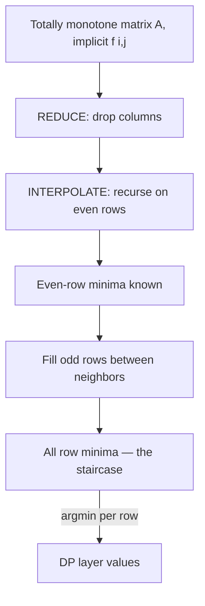

# SMAWK Algorithm and Monge Matrices — Junior Level

> **One-line summary:** A **Monge matrix** is a grid where "nested" pairs of cells beat "crossing" pairs (`A[i][j] + A[i'][j'] ≤ A[i][j'] + A[i'][j]` for `i < i'`, `j < j'`); this forces the position of each row's minimum to form a non-decreasing **staircase**, and the **SMAWK algorithm** uses that staircase to find *all* row minima of an `n×m` matrix in `O(n + m)` time instead of the obvious `O(n·m)`.

---

## Table of Contents

1. [Introduction](#introduction)
2. [Prerequisites](#prerequisites)
3. [Glossary](#glossary)
4. [Core Concepts](#core-concepts)
5. [Big-O Summary](#big-o-summary)
6. [Real-World Analogies](#real-world-analogies)
7. [Pros & Cons](#pros--cons)
8. [Step-by-Step Walkthrough](#step-by-step-walkthrough)
9. [Code Examples](#code-examples)
10. [Coding Patterns](#coding-patterns)
11. [Error Handling](#error-handling)
12. [Performance Tips](#performance-tips)
13. [Best Practices](#best-practices)
14. [Edge Cases & Pitfalls](#edge-cases--pitfalls)
15. [Common Mistakes](#common-mistakes)
16. [Cheat Sheet](#cheat-sheet)
17. [Visual Animation](#visual-animation)
18. [Summary](#summary)
19. [Further Reading](#further-reading)

---

## Introduction

Imagine you have a big rectangular table of numbers — `n` rows and `m` columns — and for **every row** you want the **column where that row's smallest value sits**. The obvious way is to walk along each row, look at all `m` cells, and remember the smallest. That is `n·m` cell reads. For a `100000 × 100000` matrix that is ten billion reads. Too slow.

But many tables that show up in dynamic programming are not arbitrary. They have a hidden regularity called the **Monge condition**. When a matrix is Monge, the position of the minimum in each row never moves *left* as you go down the rows:

```
row 0:  min is in column 1
row 1:  min is in column 1   (stayed, or moved right — never left)
row 2:  min is in column 3
row 3:  min is in column 3
row 4:  min is in column 6
```

Those minimum positions `1, 1, 3, 3, 6` form a **non-decreasing staircase**. Once you know the minima form a staircase, you do not need to scan every cell. The **SMAWK algorithm** (named after its five inventors — **S**haror, **M**oran, **A**ggarwal, **K**lawe, **W**ilber, usually written Aggarwal–Klawe–Moran–Shor–Wilber, 1987) finds *all* `n` row minima in just `O(n + m)` total work — linear, not quadratic.

There are two ideas inside SMAWK, and the whole algorithm is just these two steps applied over and over:

- **REDUCE** — throw away columns that *cannot possibly* hold the minimum of any surviving row. After REDUCE there are at most as many columns as rows.
- **INTERPOLATE** — solve the problem for the even-numbered rows first (recursing on half the rows), then fill in the odd rows cheaply, because each odd row's minimum is squeezed between the two even neighbors' minima.

Why does a junior engineer care? Because this is the engine behind a family of **DP speedups**. A DP transition like `dp[j] = min over k of ( something(k) + cost(k, j) )` is *secretly* "find the minimum of each column of a matrix." If that matrix is Monge, SMAWK (or its simpler `O(n log n)` cousin, **divide-and-conquer optimization**, sibling topic `12`) turns a slow `O(n²)` DP into a linear or near-linear one. This topic gives you the matrix-level view that the sibling DP-optimization topics build on.

---

## Prerequisites

Before reading this file you should be comfortable with:

- **2-D arrays / matrices** — indexing `A[i][j]`, rows, columns. (See `05-basic-data-structures/01-array`.)
- **Finding a minimum** by scanning — the brute-force `O(n·m)` baseline we are beating.
- **Recursion and divide-and-conquer** — splitting a problem in half and recursing (think merge sort). INTERPOLATE recurses on half the rows.
- **Big-O notation** — `O(n·m)`, `O(n + m)`, `O(n log n)`.
- **Basic dynamic programming** — the recurrence `dp[j] = min_k ( g(k) + cost(k, j) )`, since the payoff of this topic is speeding such DPs up.

Optional but helpful:

- A glance at **divide-and-conquer DP optimization** (sibling `12`) and **Knuth optimization** (sibling `14`) — SMAWK is the asymptotically optimal relative of both.
- The idea of an **implicit matrix**: a matrix you never actually store, but whose entries you can compute on demand with a small `O(1)` function.

---

## Glossary

| Term | Meaning |
|------|---------|
| **Row minimum** | For row `i`, the smallest value `A[i][·]` and the column where it occurs. SMAWK computes all of them. |
| **Monge matrix** | A matrix where `A[i][j] + A[i'][j'] ≤ A[i][j'] + A[i'][j]` for all `i < i'`, `j < j'`. "Nested ≤ crossing." |
| **Totally monotone (TM)** | A weaker, more directly useful property: if a lower row wins (or ties) in a left column, it also wins in every right column. Monge ⟹ totally monotone. |
| **Staircase / monotone minima** | The fact that the column index of each row's minimum is **non-decreasing** as the row index grows. |
| **SMAWK** | The `O(n + m)` algorithm (Aggarwal–Klawe–Moran–Shor–Wilber, 1987) that finds all row minima of a totally monotone matrix. |
| **REDUCE** | The SMAWK step that eliminates columns that cannot be the minimum of any surviving row. |
| **INTERPOLATE** | The SMAWK step that recurses on even rows, then fills odd rows from their even neighbors. |
| **Implicit matrix** | A matrix never materialized; any entry `A[i][j]` is produced by an `O(1)` cost function on demand. |
| **Cost function `f(i, j)`** | The `O(1)` rule that defines the matrix. SMAWK only ever calls `f`; it never needs the full grid in memory. |

---

## Core Concepts

### 1. The Problem: All Row Minima

We are given an `n × m` matrix `A` (possibly implicit). For each row `i` we want:

```
rowmin[i] = the column j minimizing A[i][j]
```

The brute force is two nested loops, `O(n·m)`. SMAWK does it in `O(n + m)` **when `A` is totally monotone**.

> Convention note: some texts phrase SMAWK for *column minima* / *row maxima*; they are all the same algorithm with indices or signs flipped. This file uses **row minima** throughout. The sibling DP-optimization files phrase it as **column minima**; that is the *transpose* — the math is identical.

### 2. The Monge Condition

A matrix `A` is **Monge** if, for every choice of two rows `i < i'` and two columns `j < j'`:

```
A[i][j] + A[i'][j']  ≤  A[i][j'] + A[i'][j]
```

The left side pairs the cells "nested" (top-left with bottom-right); the right pairs them "crossing" (top-right with bottom-left). The condition says **nested is never more expensive than crossing**. It is enough to check the *local* `2×2` version (adjacent rows and columns) — that single inequality, checked everywhere, implies the full thing.

### 3. Total Monotonicity (the property we actually use)

The Monge condition implies a property that is easier to use directly. A matrix is **totally monotone** (for row minima) if, for any two rows `i < i'` and columns `j < j'`:

```
if  A[i][j']  ≤  A[i][j]   (upper row prefers the right column j')
then A[i'][j'] ≤ A[i'][j]   (the lower row also prefers j', or beyond)
```

In plain words: **once a row "switches" to preferring a right-hand column, no lower row ever switches back to a left-hand column.** That is exactly what makes the minima form a non-decreasing staircase. Every Monge matrix is totally monotone (proven in [`professional.md`](./professional.md)); SMAWK only needs total monotonicity.

### 4. The Staircase of Minima

The headline consequence:

> **`argmin(row i) ≤ argmin(row i+1)`** — the column holding the minimum never moves left as you go down a row.

Draw the minima as dots on the grid and they form stairs that only go right and down — never back up-left. This staircase is the entire reason a linear-time algorithm exists: knowing one row's minimum *constrains* where its neighbors' minima can be.

### 5. SMAWK = REDUCE + INTERPOLATE

SMAWK is two steps in a loop/recursion:

1. **REDUCE(columns).** Use total monotonicity to discard columns that cannot be the minimum of *any* surviving row. After REDUCE, the number of columns is at most the number of rows.
2. **INTERPOLATE.** Recurse on the **even rows** only (half as many rows). That gives the minima of even rows. Then each **odd row's** minimum lies *between* the minima of its two even neighbors (by the staircase), so a short local scan finds it.

Because REDUCE shrinks columns to `≤ rows`, and INTERPOLATE halves the rows each recursion, the total work telescopes to `O(n + m)`.

### 6. The Matrix Is Usually Implicit

In real DP applications you almost never build the `n × m` grid. Instead you have an `O(1)` **cost function** `f(i, j)` and you let SMAWK call it on demand. A `100000 × 100000` matrix has `10^{10}` entries — you cannot store it — but you can compute any single entry in `O(1)`, and SMAWK only ever touches `O(n + m)` of them. This is the key engineering point: **SMAWK works on an implicit matrix.**

---

## Big-O Summary

| Operation | Time | Space | Notes |
|-----------|------|-------|-------|
| Brute-force all row minima | **O(n·m)** | O(1) extra | Scan every cell of every row. |
| SMAWK all row minima | **O(n + m)** | O(n + m) | REDUCE + INTERPOLATE; needs total monotonicity. |
| Divide-and-conquer minima (sibling `12`) | O((n + m) log n) | O(n + m) | Simpler than SMAWK; a `log` factor slower. |
| One implicit entry `f(i, j)` | O(1) | — | The matrix is never materialized. |
| Verifying total monotonicity empirically | O(n·m) | O(1) | Brute-force check; tests only. |
| One DP layer via SMAWK | **O(n)** | O(n) | The headline DP speedup (vs `O(n²)` naive). |

The number to remember is **`O(n + m)`** — linear in the matrix *dimensions*, not its *area*. That is the whole point of SMAWK.

---

## Real-World Analogies

| Concept | Analogy |
|---------|---------|
| Row minima | For each shelf (row), find the cheapest item and which slot (column) it sits in. |
| Monge condition | A "no crossing" rule for prices: two nested deals never cost more than two crossing deals. |
| Staircase of minima | As you go to higher shelves, the cheapest slot only ever drifts rightward — never back left. |
| REDUCE | Crossing out price columns that can't be the cheapest for *any* remaining shelf — pure waste to keep checking them. |
| INTERPOLATE | Survey every *other* shelf first; then each skipped shelf's best slot must lie between its two surveyed neighbors, so a quick glance suffices. |
| Implicit matrix | You never print the giant price catalog; you phone the warehouse (`f(i, j)`) for any single price on demand. |

Where the analogies break: real prices don't obey the Monge inequality; the analogy only fixes the intuition that "the cheapest column drifts rightward as you descend the rows."

---

## Pros & Cons

| Pros | Cons |
|------|------|
| Finds **all** row minima in `O(n + m)` — optimal, you must at least read the answer. | Only correct when the matrix is **totally monotone**; otherwise silently wrong. |
| Works on an **implicit** matrix via an `O(1)` cost function — no `O(n·m)` storage. | The REDUCE + INTERPOLATE bookkeeping is **fiddly** to implement correctly. |
| Turns many `O(n²)` DPs into `O(n)` per layer — a big asymptotic win. | The simpler `O((n+m) log n)` divide-and-conquer (sibling `12`) is often "good enough" and far easier to get right. |
| No heavy data structures (no heap, no segment tree). | The "staircase" restriction `k < j` in DP matrices (upper-triangular shape) needs careful `+∞` padding. |
| Foundation for LARSCH (online SMAWK) and 1-D clustering. | If total monotonicity *fails*, there is no crash — just a wrong number. |

**When to use:** you must find all row minima (or run a DP layer) on a **totally monotone** matrix, `n` and `m` are large, and the linear-time bound matters.

**When NOT to use:** the matrix is not totally monotone (the result is wrong); `n` is small (brute force or the `O(n log n)` recursion is simpler); you only need *one* row's minimum (just scan that row).

---

## Step-by-Step Walkthrough

Let us run the *idea* of SMAWK on a small totally monotone matrix. (`∞` marks forbidden cells, as in DP staircases.)

```
        c0   c1   c2   c3
r0 [     5    3    9   12 ]    row-min at c1 (=3)
r1 [     6    4    7   10 ]    row-min at c1 (=4)
r2 [     8    7    5    6 ]    row-min at c2 (=5)
r3 [    11   10    8    6 ]    row-min at c3 (=6)
```

The row minima sit at columns `1, 1, 2, 3` — **non-decreasing**, the staircase. Now watch the two SMAWK steps reduce the work.

**REDUCE the columns.** We ask: can column `c0` ever be the minimum of any row? In row 0, `c0 = 5` but `c1 = 3` is smaller; in row 1, `c0 = 6` but `c1 = 4` is smaller; and by total monotonicity, once a lower row prefers `c1` to `c0`, no further row can prefer `c0`. So **`c0` can be dropped** — it is never a row minimum. After REDUCE we keep the columns that *could* win: `{c1, c2, c3}`. (In a larger example REDUCE can drop many columns, leaving at most as many columns as rows.)

```
        c1   c2   c3
r0 [     3    9   12 ]
r1 [     4    7   10 ]
r2 [     7    5    6 ]
r3 [    10    8    6 ]
```

**INTERPOLATE — solve even rows first.** Recurse on rows `{r0, r2}` only:

```
r0 → min at c1 (=3)
r2 → min at c2 (=5)
```

Now fill the **odd rows** `r1, r3` cheaply, knowing each lies between its even neighbors' answers:

- `r1` is between `r0` (min at c1) and `r2` (min at c2), so its minimum column is in `[c1, c2]`. Scan just those: `r1` has `c1 = 4`, `c2 = 7` → min at **c1**.
- `r3` is after `r2` (min at c2) and is the last row, so its minimum column is in `[c2, c3]`. Scan just those: `r3` has `c2 = 8`, `c3 = 6` → min at **c3**.

**Result:** row minima at columns `1, 1, 2, 3` — exactly the staircase — but we never scanned every cell of every row. We dropped a whole column with REDUCE and only fully solved half the rows directly; the rest were squeezed into tiny ranges. On a real `n × m` matrix this is the difference between `O(n·m)` and `O(n + m)`.

---

## Code Examples

The cleanest first implementation is a **recursive SMAWK that takes a row list, a column list, and a cost function `f(i, j)`**, and returns the argmin column of each row. We keep it readable rather than maximally optimized.

### Example: SMAWK on an Implicit Totally Monotone Matrix

#### Go

```go
package main

import "fmt"

// f(i, j) returns the matrix entry A[i][j] in O(1) (implicit matrix).
type CostFn func(i, j int) int64

// smawk returns, for each row in `rows`, the column (from `cols`) holding its
// minimum. `cols` must be in increasing order. Result indexed by position in rows.
func smawk(rows, cols []int, f CostFn, result map[int]int) {
	if len(rows) == 0 {
		return
	}
	// REDUCE: drop columns that can't be any row's minimum. Stack of survivors.
	survivors := reduce(rows, cols, f)

	// Base case: a single row scans its surviving columns directly.
	if len(rows) == 1 {
		r := rows[0]
		best, bestC := f(r, survivors[0]), survivors[0]
		for _, c := range survivors[1:] {
			if v := f(r, c); v < best {
				best, bestC = v, c
			}
		}
		result[r] = bestC
		return
	}

	// INTERPOLATE: recurse on even-indexed rows.
	evenRows := make([]int, 0, (len(rows)+1)/2)
	for i := 0; i < len(rows); i += 2 {
		evenRows = append(evenRows, rows[i])
	}
	smawk(evenRows, survivors, f, result)

	// Fill odd rows: each lies between its even neighbors' answers.
	colIndex := map[int]int{}
	for idx, c := range survivors {
		colIndex[c] = idx
	}
	for i := 1; i < len(rows); i += 2 {
		r := rows[i]
		lo := colIndex[result[rows[i-1]]] // left neighbor's argmin position
		hi := len(survivors) - 1
		if i+1 < len(rows) {
			hi = colIndex[result[rows[i+1]]] // right neighbor's argmin position
		}
		best, bestC := f(r, survivors[lo]), survivors[lo]
		for t := lo + 1; t <= hi; t++ {
			if v := f(r, survivors[t]); v < best {
				best, bestC = v, survivors[t]
			}
		}
		result[r] = bestC
	}
}

// reduce keeps only columns that can be a row minimum (stack-based, O(rows)).
func reduce(rows, cols []int, f CostFn) []int {
	stack := []int{}
	for _, c := range cols {
		for len(stack) > 0 {
			top := stack[len(stack)-1]
			i := len(stack) - 1 // row index = current stack height - 1
			if f(rows[i], top) <= f(rows[i], c) {
				break // current survivor still wins here; keep it
			}
			stack = stack[:len(stack)-1] // top can never win again; pop it
		}
		if len(stack) < len(rows) {
			stack = append(stack, c)
		}
	}
	return stack
}

func main() {
	grid := [][]int64{
		{5, 3, 9, 12},
		{6, 4, 7, 10},
		{8, 7, 5, 6},
		{11, 10, 8, 6},
	}
	f := func(i, j int) int64 { return grid[i][j] }
	rows := []int{0, 1, 2, 3}
	cols := []int{0, 1, 2, 3}
	res := map[int]int{}
	smawk(rows, cols, f, res)
	for i := 0; i < 4; i++ {
		fmt.Printf("row %d: min at col %d (=%d)\n", i, res[i], grid[i][res[i]])
	}
}
```

#### Java

```java
import java.util.*;
import java.util.function.BiFunction;

public class SmawkBasic {
    // f(i, j) = A[i][j] in O(1) (implicit matrix).
    static void smawk(List<Integer> rows, List<Integer> cols,
                      BiFunction<Integer, Integer, Long> f, Map<Integer, Integer> result) {
        if (rows.isEmpty()) return;
        List<Integer> survivors = reduce(rows, cols, f);

        if (rows.size() == 1) {
            int r = rows.get(0);
            int bestC = survivors.get(0);
            long best = f.apply(r, bestC);
            for (int c : survivors) {
                long v = f.apply(r, c);
                if (v < best) { best = v; bestC = c; }
            }
            result.put(r, bestC);
            return;
        }

        List<Integer> evenRows = new ArrayList<>();
        for (int i = 0; i < rows.size(); i += 2) evenRows.add(rows.get(i));
        smawk(evenRows, survivors, f, result);

        Map<Integer, Integer> colIndex = new HashMap<>();
        for (int idx = 0; idx < survivors.size(); idx++) colIndex.put(survivors.get(idx), idx);

        for (int i = 1; i < rows.size(); i += 2) {
            int r = rows.get(i);
            int lo = colIndex.get(result.get(rows.get(i - 1)));
            int hi = (i + 1 < rows.size()) ? colIndex.get(result.get(rows.get(i + 1)))
                                           : survivors.size() - 1;
            int bestC = survivors.get(lo);
            long best = f.apply(r, bestC);
            for (int t = lo + 1; t <= hi; t++) {
                long v = f.apply(r, survivors.get(t));
                if (v < best) { best = v; bestC = survivors.get(t); }
            }
            result.put(r, bestC);
        }
    }

    static List<Integer> reduce(List<Integer> rows, List<Integer> cols,
                                BiFunction<Integer, Integer, Long> f) {
        List<Integer> stack = new ArrayList<>();
        for (int c : cols) {
            while (!stack.isEmpty()) {
                int i = stack.size() - 1;
                int top = stack.get(i);
                if (f.apply(rows.get(i), top) <= f.apply(rows.get(i), c)) break;
                stack.remove(stack.size() - 1);
            }
            if (stack.size() < rows.size()) stack.add(c);
        }
        return stack;
    }

    public static void main(String[] args) {
        long[][] grid = {
            {5, 3, 9, 12}, {6, 4, 7, 10}, {8, 7, 5, 6}, {11, 10, 8, 6}
        };
        BiFunction<Integer, Integer, Long> f = (i, j) -> grid[i][j];
        List<Integer> rows = Arrays.asList(0, 1, 2, 3);
        List<Integer> cols = Arrays.asList(0, 1, 2, 3);
        Map<Integer, Integer> res = new HashMap<>();
        smawk(rows, cols, f, res);
        for (int i = 0; i < 4; i++)
            System.out.printf("row %d: min at col %d (=%d)%n", i, res.get(i), grid[i][res.get(i)]);
    }
}
```

#### Python

```python
def smawk(rows, cols, f, result):
    """f(i, j) -> A[i][j] in O(1). Fills result[row] = argmin column."""
    if not rows:
        return
    survivors = reduce_cols(rows, cols, f)

    if len(rows) == 1:
        r = rows[0]
        best_c = min(survivors, key=lambda c: f(r, c))
        result[r] = best_c
        return

    even_rows = rows[::2]
    smawk(even_rows, survivors, f, result)

    col_index = {c: idx for idx, c in enumerate(survivors)}
    for i in range(1, len(rows), 2):
        r = rows[i]
        lo = col_index[result[rows[i - 1]]]
        hi = col_index[result[rows[i + 1]]] if i + 1 < len(rows) else len(survivors) - 1
        best_c = survivors[lo]
        best = f(r, best_c)
        for t in range(lo + 1, hi + 1):
            v = f(r, survivors[t])
            if v < best:
                best, best_c = v, survivors[t]
        result[r] = best_c


def reduce_cols(rows, cols, f):
    stack = []
    for c in cols:
        while stack:
            i = len(stack) - 1
            if f(rows[i], stack[-1]) <= f(rows[i], c):
                break
            stack.pop()
        if len(stack) < len(rows):
            stack.append(c)
    return stack


if __name__ == "__main__":
    grid = [
        [5, 3, 9, 12],
        [6, 4, 7, 10],
        [8, 7, 5, 6],
        [11, 10, 8, 6],
    ]
    f = lambda i, j: grid[i][j]
    res = {}
    smawk([0, 1, 2, 3], [0, 1, 2, 3], f, res)
    for i in range(4):
        print(f"row {i}: min at col {res[i]} (={grid[i][res[i]]})")
```

**What it does:** finds the column of each row's minimum on a totally monotone matrix, calling `f(i, j)` lazily so the matrix is never materialized. Output is the staircase `row 0 → 1, row 1 → 1, row 2 → 2, row 3 → 3`.
**Run:** `go run main.go` | `javac SmawkBasic.java && java SmawkBasic` | `python smawk.py`

> Note: this readable version uses a `result` map and a few `O(rows)` helper structures; the `professional.md` file gives the array-based `O(n + m)` form. For learning, prefer clarity first.

---

## Coding Patterns

### Pattern 1: Brute-Force Row Minima (the oracle you test against)

**Intent:** Before trusting SMAWK, compute the row minima the slow, obvious way and confirm both agree. This is your correctness oracle.

```python
def brute_row_minima(n, m, f):
    res = []
    for i in range(n):
        best_c, best = 0, f(i, 0)
        for j in range(1, m):
            v = f(i, j)
            if v < best:          # strict <, keep the smallest column on ties
                best, best_c = v, j
        res.append(best_c)
    return res
```

This is `O(n·m)`. Too slow for large inputs, but perfect for validating SMAWK on small ones and for checking that the minima are a non-decreasing staircase.

### Pattern 2: Assert the Staircase (total-monotonicity sanity check)

**Intent:** Total monotonicity is the precondition. The cheap runtime symptom is "argmins are non-decreasing." Assert it on the brute-force answer.

```python
def assert_monotone(row_argmins):
    for i in range(1, len(row_argmins)):
        assert row_argmins[i - 1] <= row_argmins[i], (i, row_argmins)
```

If this fails, the matrix is **not** totally monotone and SMAWK's answer would be silently wrong.

### Pattern 3: Implicit Matrix from a DP Cost

**Intent:** Wrap a DP transition cost as a matrix-entry function so SMAWK can run a DP layer.



```python
# dp[j] = min over k<j of ( g[k] + cost(k, j) )   →   matrix A[j][k] = g[k] + cost(k, j)
# (rows = target index j, cols = split k). Row minima of A give the DP layer.
def make_entry(g, cost):
    INF = 1 << 62
    def f(j, k):
        if k >= j:          # staircase: split must be left of target
            return INF
        return g[k] + cost(k, j)
    return f
```

---

## Error Handling

| Error | Cause | Fix |
|-------|-------|-----|
| Wrong answer, no crash | Matrix is not totally monotone. | Verify Monge/total monotonicity; assert the staircase on the brute-force oracle. |
| Argmins not non-decreasing | Tie broken toward the *larger* column. | Keep the **smallest** column on ties (strict `<`). |
| Index out of range in INTERPOLATE | Last odd row has no right even neighbor. | Clamp `hi` to the last surviving column. |
| `∞ + cost` overflow | Added a finite cost to an `∞` predecessor in a DP matrix. | Return `∞` directly for forbidden `k ≥ j`; skip such entries. |
| Stack grows past `#rows` in REDUCE | Forgot the cap. | Only push a column while `len(stack) < #rows`. |
| Wrong axis | Confused row minima with column minima. | Pick one convention and transpose the input if needed. |

---

## Performance Tips

- **Keep `f(i, j)` `O(1)`** with prefix sums (or prefix sums of squares). If a cost evaluation is `O(c)`, every bound becomes `O((n + m)·c)`.
- **Never materialize the matrix** — pass a cost function. A `10^5 × 10^5` matrix has `10^{10}` cells; SMAWK touches only `O(n + m)`.
- **Prefer divide-and-conquer (sibling `12`)** if you do not need the last `log n` factor — it is far simpler to implement correctly and only `O((n+m) log n)`.
- **Reuse buffers** across DP layers instead of reallocating row/column lists.
- **Cache-friendly access:** the cost function should read contiguous prefix arrays so reads stay hot.

---

## Best Practices

- Always test SMAWK against the **brute-force oracle** (Pattern 1) on random small inputs *before* trusting it on large ones.
- **Assert the staircase** (Pattern 2): build argmins with the oracle and confirm they are non-decreasing. If not, SMAWK does not apply.
- Pick a single convention (**row minima**, smallest column on ties) and stick to it across the whole codebase.
- Treat the matrix as **implicit** by default — write the `O(1)` cost function first, then hand it to SMAWK.
- For a first implementation, **prefer the simpler `O(n log n)` divide-and-conquer recursion**; reach for full SMAWK only when the linear bound is necessary.
- Document the staircase restriction (`k < j`) explicitly and pad forbidden cells with `∞`.

---

## Edge Cases & Pitfalls

- **Single row** — just scan that row; SMAWK's machinery is overkill.
- **Single column** — every row's minimum is that column.
- **Ties** — always break toward the **smaller** column so the staircase stays non-decreasing.
- **Matrix not totally monotone** — the most dangerous case: SMAWK returns a wrong answer with no error. Verify the property.
- **Staircase / upper-triangular DP matrices** — forbidden cells (`k ≥ j`) must be `∞`; an unpadded entry can be picked as a bogus minimum.
- **Off-by-one in INTERPOLATE bounds** — the odd row's window is `[neighbor_left, neighbor_right]`; clamp the last odd row's right bound to the last column.
- **Overflow** — DP costs (squared sums, variance) grow fast; use 64-bit and keep `∞` well below the type max.

---

## Common Mistakes

1. **Applying SMAWK without verifying total monotonicity** — the single most dangerous error; the answer is wrong with no crash.
2. **Breaking ties toward the larger column** — can break the non-decreasing argmin staircase and corrupt INTERPOLATE's bounds.
3. **Materializing the matrix** — defeats the purpose; use an `O(1)` implicit cost function.
4. **Forgetting `∞` on forbidden cells** in a DP staircase matrix — a `k ≥ j` entry gets wrongly chosen.
5. **Reaching for SMAWK when `O(n log n)` divide-and-conquer would do** — more code, more bugs, for a `log` factor.
6. **Confusing row minima with column minima** — pick one convention; the DP-optimization siblings use column minima (the transpose).
7. **Expensive cost function** — an `O(n)` `f(i, j)` turns `O(n + m)` into `O((n + m)·n)`.

---

## Cheat Sheet

| Question | Answer |
|----------|--------|
| What does SMAWK compute? | All row minima of an `n×m` matrix. |
| How fast? | `O(n + m)` — linear in dimensions, not area. |
| Precondition? | Matrix is **totally monotone** (Monge ⟹ TM). |
| Monge condition | `A[i][j] + A[i'][j'] ≤ A[i][j'] + A[i'][j]`, `i<i'`, `j<j'`. |
| Key consequence | argmins form a non-decreasing **staircase**. |
| Two steps | **REDUCE** (drop dead columns) + **INTERPOLATE** (recurse even rows, fill odd). |
| Simpler cousin | divide-and-conquer optimization, `O((n+m) log n)` (sibling `12`). |
| DP payoff | one DP layer in `O(n)` instead of `O(n²)`. |
| Matrix storage | **implicit** — `O(1)` cost function, never materialized. |
| Online version | **LARSCH** (online SMAWK) — answers as rows arrive. |

Two-step skeleton:

```
SMAWK(rows, cols, f):
    cols = REDUCE(rows, cols, f)              # ≤ #rows columns survive
    if one row: scan cols, return argmin
    recurse on even rows with cols            # INTERPOLATE part 1
    for each odd row:                         # INTERPOLATE part 2
        scan only between its even neighbors' argmins
# total: O(n + m)
```

---

## Visual Animation

> See [`animation.html`](./animation.html) for an interactive visualization.
>
> The animation demonstrates:
> - A totally monotone matrix grid with the **staircase** of row minima highlighted.
> - The **REDUCE** step crossing out columns that cannot hold any row's minimum.
> - The **INTERPOLATE** step recursing on the even rows, then filling odd rows from their even neighbors' positions.
> - Step / Run / Reset controls and a tally of cells SMAWK touched versus the naive `O(n·m)` scan.

---

## Summary

A **Monge matrix** satisfies `A[i][j] + A[i'][j'] ≤ A[i][j'] + A[i'][j]` ("nested ≤ crossing"), which makes it **totally monotone**: once a row prefers a right-hand column, no lower row prefers a left-hand one. That forces the per-row minima into a non-decreasing **staircase**. The **SMAWK algorithm** exploits this to find *all* `n` row minima of an `n × m` matrix in `O(n + m)` — optimal — using two steps in a loop: **REDUCE** discards columns that cannot be any row's minimum (leaving `≤ #rows` columns), and **INTERPOLATE** recurses on the even rows and then fills each odd row from the tight window between its even neighbors' minima. The matrix is almost always **implicit**, defined by an `O(1)` cost function so the `O(n·m)` grid is never stored. This is the matrix-level engine behind the DP speedups in the sibling topics: **divide-and-conquer optimization** (`12`, the simpler `O(n log n)` cousin) and **Knuth optimization** (`14`). The golden rule, exactly as for those siblings: **never apply SMAWK without confirming the matrix is totally monotone**, because otherwise it fails silently.

---

## Further Reading

- Aggarwal, Klawe, Moran, Shor, Wilber — "Geometric applications of a matrix-searching algorithm" (1987) — the original SMAWK paper.
- *Competitive Programmer's Handbook* (Laaksonen) — DP optimization chapter.
- cp-algorithms.com — "Divide and Conquer DP" (the simpler cousin) and Monge-matrix notes.
- Sibling topic `12-divide-conquer-optimization` — the `O(n log n)` realization of monotone minima.
- Sibling topic `14-knuth-optimization` — interval DP with two-sided argmin bounds.
- Burkard, Klinz, Rudolf — "Perspectives of Monge properties in optimization" (1996) — Monge-matrix theory.

---

**Next step:** Continue to [`middle.md`](./middle.md) to see *why* REDUCE and INTERPOLATE are correct, walk the full SMAWK recursion on an implicit cost matrix, and compare SMAWK against divide-and-conquer optimization (sibling `12`).
