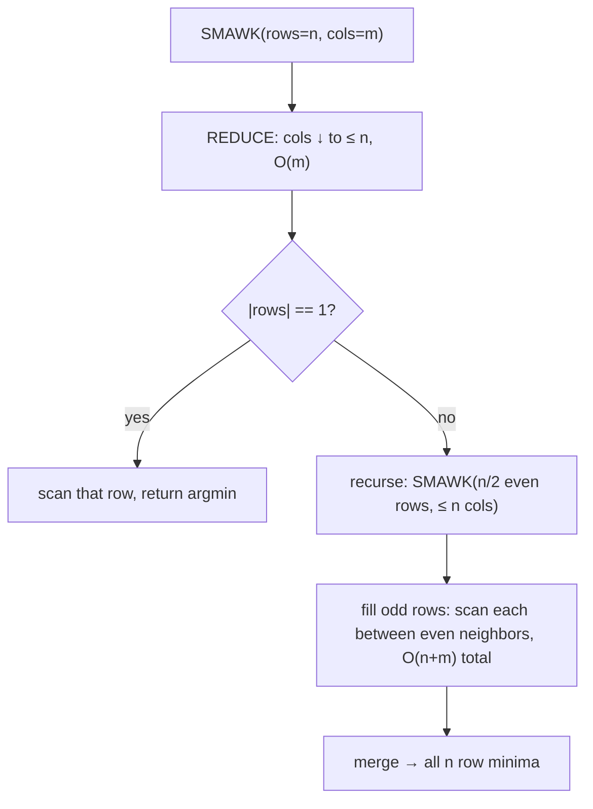

# SMAWK Algorithm and Monge Matrices — Middle Level

> **Focus:** *Why* REDUCE can safely throw columns away and *why* INTERPOLATE's even-row recursion is correct, the full SMAWK recursion on an **implicit** cost matrix, why the work telescopes to `O(n + m)`, and exactly how SMAWK relates to **divide-and-conquer optimization** (sibling `12`) and **Knuth optimization** (sibling `14`).

---

## Table of Contents

1. [Introduction](#introduction)
2. [Deeper Concepts](#deeper-concepts)
3. [REDUCE in Detail](#reduce-in-detail)
4. [INTERPOLATE in Detail](#interpolate-in-detail)
5. [Putting It Together: The O(n + m) Recursion](#putting-it-together-the-on--m-recursion)
6. [Implicit Cost Matrices](#implicit-cost-matrices)
7. [Comparison with Divide-and-Conquer and Knuth](#comparison-with-divide-and-conquer-and-knuth)
8. [Advanced Patterns](#advanced-patterns)
9. [Code Examples](#code-examples)
10. [Error Handling](#error-handling)
11. [Performance Analysis](#performance-analysis)
12. [Best Practices](#best-practices)
13. [Visual Animation](#visual-animation)
14. [Summary](#summary)

---

## Introduction

At junior level the message was a single fact: a totally monotone matrix has a staircase of row minima, and SMAWK finds all of them in `O(n + m)` by alternating REDUCE and INTERPOLATE. At middle level you start asking the correctness and engineering questions that decide whether your solution is *fast* **and** *right*:

- *Why* is it safe for REDUCE to delete columns? What invariant guarantees a deleted column was never anyone's minimum?
- *Why* does INTERPOLATE's "recurse on even rows, then squeeze the odd rows" strategy find the true minima?
- What exactly makes the total work `O(n + m)` rather than `O(n log m)` or `O((n+m) log n)`?
- How do I feed SMAWK an **implicit** matrix from a DP transition, including the staircase restriction `k < j`?
- How does SMAWK differ from divide-and-conquer optimization (which also uses monotone minima) and from Knuth optimization (which also uses the quadrangle inequality)?

These are the questions that separate "I pasted a SMAWK template" from "I can recognize when it applies, justify both steps, and adapt it to a real DP."

---

## Deeper Concepts

### Total monotonicity, restated precisely

A matrix `A` (rows `0..n-1`, columns `0..m-1`) is **totally monotone for row minima** if for all rows `i < i'` and columns `j < j'`:

```
A[i][j']  ≤  A[i][j]    ⟹    A[i'][j'] ≤ A[i'][j].
```

Read it as: *if the upper row weakly prefers the right column, the lower row does too.* Contrapositive (often easier to use): if a **lower** row strictly prefers a **left** column, the upper row strictly prefers it too. The single structural fact that follows is:

> **Monotone argmin (the staircase):** `argmin(row i) ≤ argmin(row i')` whenever `i < i'`.

This is what every step of SMAWK exploits. Note Monge ⟹ totally monotone (proof in [`professional.md`](./professional.md)), but total monotonicity is the weaker property SMAWK actually needs, so we phrase everything in terms of it.

### The matrix view of a DP

The reason this topic lives inside `13-dynamic-programming` is that a DP transition

```
dp[j] = min over k in [0, j) of ( g(k) + cost(k, j) )
```

*is* a row-minima problem. Define the matrix

```
A[j][k] = g(k) + cost(k, j)    for k < j,    +∞ otherwise.
```

Then `dp[j]` is the **minimum of row `j`** of `A`, and `argmin` is the optimal split. (The sibling divide-and-conquer files use the transpose — columns as targets — and speak of "column minima"; same math, different axis.) If `cost` is Monge, `A` is totally monotone, and SMAWK computes the whole DP layer in `O(n)`.

### Why two-row / two-column reasoning is enough

Total monotonicity is a `2 × 2` property: it talks about two rows and two columns at a time. Every argument in SMAWK — "this column is dead," "this row's minimum is between its neighbors'" — is built by chaining `2 × 2` facts. That is what makes the algorithm provable without heavy machinery.

### What "implicit" really buys

A `100000 × 100000` matrix has `10^{10}` entries. You can never store it. But you can compute any `A[i][j]` in `O(1)` from prefix arrays. SMAWK calls the entry function `O(n + m)` times total, so the *memory* is `O(n + m)` and the *time* is `O(n + m)` — both independent of the `n·m` area. Implicitness is not an optimization detail; it is what makes the technique usable at all.

---

## REDUCE in Detail

### What REDUCE does

Given the current rows and an ordered list of columns, REDUCE returns a sublist of columns such that **every surviving column is the minimum of *some* row**, and the number of survivors is **at most the number of rows**. It never deletes a column that is genuinely a row's minimum.

### The key lemma

> **Dead-column lemma.** Consider columns `c₁ < c₂` and a row index `r`. If `A[r][c₁] > A[r][c₂]` (column `c₂` already beats `c₁` at row `r`), then for **every row `i ≥ r`**, column `c₂` beats `c₁` too. Hence `c₁` can never be the minimum of any row `≥ r`.

This is exactly total monotonicity: if a lower-or-equal row weakly prefers the right column, all further rows do. So a column that loses to a later column "from row `r` onward" is useless for rows `≥ r`.

### The stack mechanic

REDUCE walks the columns left to right, maintaining a **stack** of candidate columns. The crucial bookkeeping: a column sitting at **stack position `i`** is the "incumbent winner" for **row `i`**. When a new column `c` arrives, we compare it against the top of the stack *at the row that top represents*:

```
for each column c in cols:
    while stack not empty:
        i   = stack.size - 1        # the row index the top column represents
        top = stack[i]
        if A[rows[i]][top] <= A[rows[i]][c]:
            break                    # top still wins at its row → keep it
        pop()                        # top loses at its row → it's dead, discard
    if stack.size < #rows:
        push(c)                      # c becomes the incumbent for the next row
```

Why this is correct:

- If `top` (representing row `i`) **loses** to `c` at row `i` (`A[rows[i]][top] > A[rows[i]][c]`), then by the dead-column lemma `top` loses to `c` for all rows `≥ i` — `top` can never be a minimum again, so we **pop** it.
- If `top` **wins** at row `i`, we stop; `c` will be considered for the *next* row (we only push if there is a row slot left, `stack.size < #rows`).
- We never push beyond `#rows` columns, because each stack slot corresponds to one row.

REDUCE runs in `O(#columns)` time (each column is pushed and popped at most once) and returns `≤ #rows` survivors.

### Tiny REDUCE trace

Matrix (rows `r0..r2`, columns `c0..c3`), totally monotone:

```
      c0  c1  c2  c3
r0 [   5   3   8   9 ]
r1 [   6   4   2   7 ]
r2 [   9   8   5   3 ]
```

REDUCE with `#rows = 3`:

```
c0: stack empty → push. stack=[c0]            (c0 is incumbent for r0)
c1: i=0, A[r0][c0]=5 > A[r0][c1]=3 → pop c0. stack empty → push c1. stack=[c1]
c2: i=0, A[r0][c1]=3 ≤ A[r0][c2]=8 → keep. push c2. stack=[c1,c2]
c3: i=1, A[r1][c2]=2 ≤ A[r1][c3]=7 → keep. push c3. stack=[c1,c2,c3] (size==#rows)
```

Survivors `{c1, c2, c3}` — column `c0` was correctly killed (its only smaller-than-neighbor chance was at `r0`, where `c1` beat it). Exactly `#rows = 3` columns survive.

---

## INTERPOLATE in Detail

### The idea

After REDUCE leaves `≤ #rows` columns, INTERPOLATE solves the row-minima problem by:

1. **Recurse on the even rows** `0, 2, 4, …` with the surviving columns. This halves the number of rows and returns the argmin column of each even row.
2. **Fill the odd rows** `1, 3, 5, …`. By the staircase, the minimum of odd row `2t+1` lies in the column interval `[argmin(2t), argmin(2t+2)]` — between its two even neighbors. (For the last odd row with no right neighbor, the upper bound is the last surviving column.) Scan only that interval.

### Why the odd-row bound is correct

The staircase says argmins are non-decreasing in the row index. So for odd row `2t+1`:

```
argmin(2t)  ≤  argmin(2t+1)  ≤  argmin(2t+2).
```

The lower bound is the previous even row's argmin; the upper bound is the next even row's argmin. The true minimum of the odd row must sit in that window, so scanning only `[argmin(2t), argmin(2t+2)]` is both correct and (as the accounting below shows) cheap.

### Why the odd-row work telescopes to O(#columns)

Let the even argmins be `p₀ ≤ p₂ ≤ p₄ ≤ …` (column positions). Odd row `2t+1` scans the window `[p_{2t}, p_{2t+2}]`, of length `p_{2t+2} − p_{2t} + 1`. Summing over all odd rows:

```
Σ_t (p_{2t+2} − p_{2t} + 1)  =  (p_last − p_first)  +  (#odd rows)
                              ≤  m  +  n/2  =  O(n + m).
```

The differences telescope (consecutive windows share endpoints), so the total odd-row scanning is linear, **not** quadratic. This telescoping is the same accounting trick that makes the divide-and-conquer recursion `O(n log n)` — but here the row halving plus the linear odd-row fill gives the better `O(n + m)`.

### Tiny INTERPOLATE trace

Continue with survivors `{c1, c2, c3}` and rows `r0, r1, r2`:

```
Even rows {r0, r2}:
  r0: scan c1=3, c2=8, c3=9 → argmin c1
  r2: scan c1=8, c2=5, c3=3 → argmin c3
Odd row r1: window [argmin(r0)=c1, argmin(r2)=c3] = scan c1=4, c2=2, c3=7 → argmin c2
```

Result argmins `r0→c1, r1→c2, r2→c3` — non-decreasing, the staircase, with each odd row scanned only inside its window.

---

## Putting It Together: The O(n + m) Recursion

```
SMAWK(rows, cols):
    cols ← REDUCE(rows, cols)            # ≤ |rows| survivors, O(|cols|)
    if |rows| == 1:
        return argmin over cols of A[rows[0]][·]
    evenArgmins ← SMAWK(rows[0::2], cols)    # recurse on half the rows
    for each odd row r = rows[2t+1]:
        lo ← evenArgmins[2t]             # left even neighbor's argmin
        hi ← (2t+2 < |rows|) ? evenArgmins[2t+2] : last(cols)
        argmin[r] ← scan cols in [lo, hi]
    merge even and odd argmins; return
```

### The recurrence

Let `T(n, m)` be the time on `n` rows and `m` columns.

- REDUCE costs `O(m)` and leaves `≤ n` columns.
- The recursive call has `⌈n/2⌉` rows and `≤ n` columns: `T(n/2, n)`.
- The odd-row fill costs `O(n + m)` (telescoping, shown above).

So:

```
T(n, m) = T(n/2, n) + O(n + m).
```

After the first REDUCE, the column count is `≤ n`, and it keeps shrinking as rows halve. Unrolling, the `m` only appears once (the first REDUCE), and the remaining terms form `O(n) + O(n/2) + O(n/4) + … = O(n)`. Hence:

```
T(n, m) = O(n + m).
```

This is **optimal**: any algorithm must at least output `n` answers and read enough of the matrix, so `Ω(n + m)` is a lower bound.



---

## Implicit Cost Matrices

In practice the matrix comes from a DP and is never stored. You hand SMAWK an entry function.

### From a layered DP transition

```
dp[j] = min over k<j of ( g(k) + cost(k, j) )
```

becomes the matrix `A[j][k] = g(k) + cost(k, j)` (`+∞` for `k ≥ j`). Rows are targets `j`, columns are splits `k`. SMAWK's row minima are the DP values; the argmins are the optimal splits. The `O(1)` entry function:

```python
def entry(j, k):
    if k >= j:                 # staircase: split must be strictly left of target
        return INF
    return g[k] + cost(k, j)   # cost is O(1) via prefix sums
```

### The staircase restriction

The matrix is **upper-triangular** (only `k < j` is allowed). Padding forbidden cells with `+∞` keeps total monotonicity intact (an `+∞` entry never wins a minimum), so SMAWK is still correct. The price is care in indexing: REDUCE and INTERPOLATE must treat `+∞` columns as legitimately "never minimal," which the comparisons handle automatically because `+∞` loses every comparison.

### Why the cost must be `O(1)`

Every entry access goes through the cost function. SMAWK makes `O(n + m)` accesses, so if each is `O(c)` the layer is `O((n + m)·c)`. With prefix sums `c = O(1)` and the layer is truly linear. An `O(n)` cost evaluation silently makes the layer `O(n²)` — defeating the purpose.

---

## Comparison with Divide-and-Conquer and Knuth

All three speed up a DP `min` transition by exploiting **monotone argmins**, but they differ in matrix shape, recursion, and asymptotics. Confusing them is the most common conceptual error.

| | What it computes | Structural property | Per-layer / total cost | Implementation difficulty |
|---|------------------|---------------------|------------------------|---------------------------|
| **SMAWK (this)** | all row minima of a totally monotone matrix | total monotonicity (Monge ⟹ TM) | **`O(n + m)`** per layer, `O(K(n+m))` total | high (REDUCE + INTERPOLATE bookkeeping) |
| **Divide & Conquer (sibling 12)** | column minima via recursion on the middle column | one-sided monotone argmin `opt(j) ≤ opt(j+1)` | `O(n log n)` per layer, `O(K n log n)` total | low |
| **Knuth (sibling 14)** | interval DP `dp[i][k]+dp[k][j]+C` | two-sided argmin `opt(i,j-1) ≤ opt(i,j) ≤ opt(i+1,j)` | — / `O(n²)` total (from `O(n³)`) | low–medium |

### Versus divide-and-conquer optimization (sibling `12`)

Both solve "find all minima of a totally monotone matrix." Divide-and-conquer resolves the **middle row** by scanning its whole window, then recurses on the two row-halves with narrowed column windows — `O(n)` work per level, `log n` levels, `O(n log n)`. SMAWK is smarter: REDUCE first cuts the columns to `≤ #rows`, then the even-row recursion plus telescoping odd-row fill removes the `log` factor entirely, giving `O(n + m)`. The trade-off is pure engineering: divide-and-conquer is a dozen lines and hard to get wrong; SMAWK is intricate. **Most production and contest code uses divide-and-conquer; SMAWK is reserved for when the `log n` factor is decisive or `n` is enormous.**

### Versus Knuth optimization (sibling `14`)

Knuth optimizes the **interval** DP `dp[i][j] = min_{i<k<j} ( dp[i][k] + dp[k][j] ) + C(i, j)`, where a cell combines two smaller cells *of the same DP*. It needs the **two-sided** bound and fills the table by increasing interval length. SMAWK (and divide-and-conquer) optimize the **layered** DP, where a cell builds on the *previous layer*. Different recurrence, different bound, different fill order — but the shared mathematical heart of all three is the **quadrangle (Monge) inequality** on the cost, which is what makes the relevant matrix totally monotone.

### Quick decision rule

```
Layered DP  dp[i][j] = dp[i-1][k] + C(k, j),  C Monge?
    need the last log-factor of speed / n huge?   → SMAWK  (O(n+m) per layer)
    otherwise (almost always)                     → Divide & Conquer (O(n log n), simpler)
Interval DP dp[i][k] + dp[k][j] + C(i,j),  C Monge + monotone? → Knuth (O(n²))
```

### One cost, three lenses

Take the squared-segment-sum cost `cost(k, j) = (P[j] − P[k])²`. It is Monge, so the matrix `A[j][k] = g(k) + cost(k, j)` is totally monotone. Therefore:

- **SMAWK** computes each DP layer in `O(n)`.
- **Divide-and-conquer** computes each layer in `O(n log n)` with far less code.
- **Knuth does not apply** — the recurrence is layered, not interval.

(For this *specific* cost the Convex Hull Trick — sibling `10` — also applies, because the cost factors into lines; but that exploits linearity, not Monge-ness. SMAWK works for *any* Monge cost, including convex-of-length costs that do not factor into lines.)

---

## Advanced Patterns

### Pattern: One DP layer via SMAWK

Wrap `dp[j] = min_{k<j} ( g(k) + cost(k, j) )` as a matrix and run SMAWK; the row minima are the new layer, the argmins are the optimal splits.

```
build entry(j, k) = (k < j) ? g[k] + cost(k, j) : +∞
argmin ← SMAWK(rows = 1..n, cols = 0..n-1, entry)
for j: dp_new[j] = entry(j, argmin[j])
```

Repeat for `K` layers (swapping `g ← dp_new`) → `O(K · n)` total.

### Pattern: Reconstructing the partition

Store the argmin column at each `(layer, j)` (the optimal split), then backtrack from `(K, n)` following the recorded splits — exactly as in the divide-and-conquer sibling. Costs `O(K·n)` extra memory.

### Pattern: Maximization (row maxima)

For `max` DPs, the relevant condition is the **inverse** Monge inequality, and you find row *maxima* of an **inverse**-totally-monotone matrix. SMAWK works unchanged with the comparison reversed and `−∞` as the identity.

### Pattern: Online — LARSCH

When the matrix entries depend on results not yet known (e.g. `g(k) = dp[k]` of the *same* row, a "1D/1D" DP where `dp[j]` depends on earlier `dp[k]`), you cannot run SMAWK in one shot because the matrix is not fully defined up front. **LARSCH** (Larmore–Schieber, 1991) is the *online* version of SMAWK: it produces row minima as the rows become available, still in amortized `O(1)` per row (`O(n)` total). It is the right tool for the **least-weight subsequence** / concave-cost 1D/1D DP. Senior-level detail is in [`senior.md`](./senior.md).

### Pattern: Transposing to fit your convention

SMAWK as stated finds row minima; if your DP is naturally "column minima," transpose the index roles (or just relabel). Pick one convention per codebase and convert inputs at the boundary.

---

## Code Examples

### Reusable SMAWK over an implicit cost matrix (DP layer)

This runs one layer of `dp[j] = min_{k<j} ( g[k] + (P[j]-P[k])² )` via SMAWK, returning both the layer values and the argmins.

#### Go

```go
package main

import "fmt"

const INF = int64(1) << 62

// smawkArgmin returns argmin column for each row, using cost fn f.
// rows and cols are increasing index lists.
func smawkArgmin(rows, cols []int, f func(i, j int) int64) map[int]int {
	res := map[int]int{}
	var rec func(rows, cols []int)
	rec = func(rows, cols []int) {
		if len(rows) == 0 {
			return
		}
		cols = reduce(rows, cols, f)
		if len(rows) == 1 {
			r := rows[0]
			best, bc := f(r, cols[0]), cols[0]
			for _, c := range cols[1:] {
				if v := f(r, c); v < best {
					best, bc = v, c
				}
			}
			res[r] = bc
			return
		}
		even := make([]int, 0, (len(rows)+1)/2)
		for i := 0; i < len(rows); i += 2 {
			even = append(even, rows[i])
		}
		rec(even, cols)
		pos := map[int]int{}
		for idx, c := range cols {
			pos[c] = idx
		}
		for i := 1; i < len(rows); i += 2 {
			r := rows[i]
			lo := pos[res[rows[i-1]]]
			hi := len(cols) - 1
			if i+1 < len(rows) {
				hi = pos[res[rows[i+1]]]
			}
			best, bc := f(r, cols[lo]), cols[lo]
			for t := lo + 1; t <= hi; t++ {
				if v := f(r, cols[t]); v < best {
					best, bc = v, cols[t]
				}
			}
			res[r] = bc
		}
	}
	rec(rows, cols)
	return res
}

func reduce(rows, cols []int, f func(i, j int) int64) []int {
	st := []int{}
	for _, c := range cols {
		for len(st) > 0 {
			i := len(st) - 1
			if f(rows[i], st[i]) <= f(rows[i], c) {
				break
			}
			st = st[:len(st)-1]
		}
		if len(st) < len(rows) {
			st = append(st, c)
		}
	}
	return st
}

func main() {
	a := []int{1, 3, 2, 4}
	n := len(a)
	P := make([]int64, n+1)
	for i := 0; i < n; i++ {
		P[i+1] = P[i] + int64(a[i])
	}
	g := []int64{0, INF, INF, INF, INF} // layer-0 base: dp[0][0]=0
	f := func(j, k int) int64 {
		if k >= j || g[k] >= INF {
			return INF
		}
		s := P[j] - P[k]
		return g[k] + s*s
	}
	rows := []int{1, 2, 3, 4} // targets j
	cols := []int{0, 1, 2, 3} // splits k
	arg := smawkArgmin(rows, cols, f)
	for _, j := range rows {
		fmt.Printf("dp[1][%d] = %d (split k=%d)\n", j, f(j, arg[j]), arg[j])
	}
}
```

#### Java

```java
import java.util.*;
import java.util.function.BiFunction;

public class SmawkLayer {
    static final long INF = 1L << 62;

    static Map<Integer, Integer> smawkArgmin(List<Integer> rows, List<Integer> cols,
                                             BiFunction<Integer, Integer, Long> f) {
        Map<Integer, Integer> res = new HashMap<>();
        rec(rows, cols, f, res);
        return res;
    }

    static void rec(List<Integer> rows, List<Integer> cols,
                    BiFunction<Integer, Integer, Long> f, Map<Integer, Integer> res) {
        if (rows.isEmpty()) return;
        cols = reduce(rows, cols, f);
        if (rows.size() == 1) {
            int r = rows.get(0), bc = cols.get(0);
            long best = f.apply(r, bc);
            for (int c : cols) { long v = f.apply(r, c); if (v < best) { best = v; bc = c; } }
            res.put(r, bc);
            return;
        }
        List<Integer> even = new ArrayList<>();
        for (int i = 0; i < rows.size(); i += 2) even.add(rows.get(i));
        rec(even, cols, f, res);
        Map<Integer, Integer> pos = new HashMap<>();
        for (int idx = 0; idx < cols.size(); idx++) pos.put(cols.get(idx), idx);
        for (int i = 1; i < rows.size(); i += 2) {
            int r = rows.get(i);
            int lo = pos.get(res.get(rows.get(i - 1)));
            int hi = (i + 1 < rows.size()) ? pos.get(res.get(rows.get(i + 1))) : cols.size() - 1;
            int bc = cols.get(lo);
            long best = f.apply(r, bc);
            for (int t = lo + 1; t <= hi; t++) {
                long v = f.apply(r, cols.get(t));
                if (v < best) { best = v; bc = cols.get(t); }
            }
            res.put(r, bc);
        }
    }

    static List<Integer> reduce(List<Integer> rows, List<Integer> cols,
                                BiFunction<Integer, Integer, Long> f) {
        List<Integer> st = new ArrayList<>();
        for (int c : cols) {
            while (!st.isEmpty()) {
                int i = st.size() - 1;
                if (f.apply(rows.get(i), st.get(i)) <= f.apply(rows.get(i), c)) break;
                st.remove(st.size() - 1);
            }
            if (st.size() < rows.size()) st.add(c);
        }
        return st;
    }

    public static void main(String[] args) {
        int[] a = {1, 3, 2, 4};
        int n = a.length;
        long[] P = new long[n + 1];
        for (int i = 0; i < n; i++) P[i + 1] = P[i] + a[i];
        long[] g = {0, INF, INF, INF, INF};
        BiFunction<Integer, Integer, Long> f = (j, k) -> {
            if (k >= j || g[k] >= INF) return INF;
            long s = P[j] - P[k];
            return g[k] + s * s;
        };
        List<Integer> rows = Arrays.asList(1, 2, 3, 4);
        List<Integer> cols = Arrays.asList(0, 1, 2, 3);
        Map<Integer, Integer> arg = smawkArgmin(rows, cols, f);
        for (int j : rows)
            System.out.printf("dp[1][%d] = %d (split k=%d)%n", j, f.apply(j, arg.get(j)), arg.get(j));
    }
}
```

#### Python

```python
import sys

INF = 1 << 62


def smawk_argmin(rows, cols, f):
    res = {}

    def rec(rows, cols):
        if not rows:
            return
        cols = reduce_cols(rows, cols, f)
        if len(rows) == 1:
            r = rows[0]
            res[r] = min(cols, key=lambda c: f(r, c))
            return
        even = rows[::2]
        rec(even, cols)
        pos = {c: idx for idx, c in enumerate(cols)}
        for i in range(1, len(rows), 2):
            r = rows[i]
            lo = pos[res[rows[i - 1]]]
            hi = pos[res[rows[i + 1]]] if i + 1 < len(rows) else len(cols) - 1
            bc = cols[lo]
            best = f(r, bc)
            for t in range(lo + 1, hi + 1):
                v = f(r, cols[t])
                if v < best:
                    best, bc = v, cols[t]
            res[r] = bc

    rec(rows, cols)
    return res


def reduce_cols(rows, cols, f):
    st = []
    for c in cols:
        while st:
            i = len(st) - 1
            if f(rows[i], st[i]) <= f(rows[i], c):
                break
            st.pop()
        if len(st) < len(rows):
            st.append(c)
    return st


if __name__ == "__main__":
    sys.setrecursionlimit(1 << 20)
    a = [1, 3, 2, 4]
    n = len(a)
    P = [0] * (n + 1)
    for i in range(n):
        P[i + 1] = P[i] + a[i]
    g = [0, INF, INF, INF, INF]

    def f(j, k):
        if k >= j or g[k] >= INF:
            return INF
        s = P[j] - P[k]
        return g[k] + s * s

    arg = smawk_argmin([1, 2, 3, 4], [0, 1, 2, 3], f)
    for j in (1, 2, 3, 4):
        print(f"dp[1][{j}] = {f(j, arg[j])} (split k={arg[j]})")
```

**What it does:** runs one DP layer (`g` is layer 0, so this produces layer 1) via SMAWK over the implicit squared-cost matrix. The matrix is never built; `f(j, k)` is called only `O(n + m)` times.
**Run:** `go run main.go` | `javac SmawkLayer.java && java SmawkLayer` | `python smawk_layer.py`

### Brute-force oracle + monotonicity assertion

#### Python

```python
def brute_layer(g, n, cost):
    INF = 1 << 62
    dp = [INF] * (n + 1)
    arg = [0] * (n + 1)
    for j in range(1, n + 1):
        best, bk = INF, 0
        for k in range(j):
            if g[k] >= INF:
                continue
            v = g[k] + cost(k, j)
            if v < best:
                best, bk = v, k
        dp[j], arg[j] = best, bk
    for j in range(2, n + 1):          # staircase assertion
        if arg[j - 1] and arg[j]:
            assert arg[j - 1] <= arg[j], (j, arg)
    return dp, arg
```

Run SMAWK and the oracle on random small inputs and diff entrywise; the assertion catches a non-totally-monotone cost before it silently corrupts results.

---

## Error Handling

| Scenario | What goes wrong | Correct approach |
|----------|-----------------|------------------|
| Matrix not totally monotone | SMAWK prunes/skips the true minimum; wrong answer, no crash. | Prove Monge, or assert the staircase against the oracle. |
| Tie broken toward larger column | Argmins not non-decreasing; INTERPOLATE windows corrupt. | Use strict `<`, keep the smallest column. |
| Forbidden cell not `∞` | A `k ≥ j` entry wins a bogus minimum. | Return `+∞` for `k ≥ j` (and for `∞` predecessors). |
| REDUCE stack exceeds `#rows` | More survivors than rows; INTERPOLATE indexing breaks. | Push only while `stack.size < #rows`. |
| Odd row has no right neighbor | Index past the last even argmin. | Clamp `hi` to the last surviving column. |
| Expensive cost function | `O(n + m)` becomes `O((n+m)·c)`. | Precompute prefix sums so `f` is `O(1)`. |

---

## Performance Analysis

| `n` (= `m`) | brute `O(n·m)` | divide-and-conquer `O(n log n)` | SMAWK `O(n + m)` |
|-------------|----------------|----------------------------------|-------------------|
| 1 000 | 1 000 000 | ~10 000 | ~2 000 |
| 10 000 | 100 000 000 | ~130 000 | ~20 000 |
| 100 000 | 10 000 000 000 | ~1 700 000 | ~200 000 |
| 1 000 000 | 10¹² (infeasible) | ~20 000 000 | ~2 000 000 |

Per layer, SMAWK is `O(n + m)` versus divide-and-conquer's `O(n log n)` and brute force's `O(n·m)`. Over `K` layers: `O(K(n+m))` vs `O(K n log n)` vs `O(K n²)`. The `log n` SMAWK saves over divide-and-conquer is at most ~20 for `n = 10^6`; whether that justifies SMAWK's implementation complexity is the senior-level judgment call.

The dominant cost is **entry-function evaluations**: SMAWK makes `O(n + m)` of them, each `O(1)` with prefix sums. The recursion and REDUCE stack overhead are `O(n + m)` and negligible against the arithmetic.

```python
# Sanity: n = 10^6, K = 10 finishes comfortably under SMAWK;
# the same with naive O(n^2) per layer is ~10^{13} ops — infeasible.
```

---

## Best Practices

- **Confirm total monotonicity first.** Prove the Monge inequality or assert the staircase on random inputs. Never deploy unverified.
- **Keep the cost `O(1)`.** Precompute prefix sums (and prefix sums of squares for variance/SSE).
- **Break ties toward the smallest column** so the argmin staircase stays valid.
- **Pad forbidden cells with `+∞`** to keep the upper-triangular DP matrix totally monotone.
- **Default to divide-and-conquer** (sibling `12`) for `O(n log n)`; switch to SMAWK only when the linear bound truly matters.
- **Test against the brute-force oracle** entrywise on small `n`.
- **Know your siblings:** SMAWK/divide-and-conquer for layered Monge DPs, Knuth for interval Monge DPs (sibling `14`), CHT for linear costs (sibling `10`), LARSCH for online 1D/1D.

---

## Visual Animation

> See [`animation.html`](./animation.html) for an interactive view.
>
> The middle-level animation highlights:
> - The totally monotone grid with the **staircase** of row minima.
> - **REDUCE** popping/pushing columns on a stack and crossing out dead columns (`≤ #rows` survive).
> - **INTERPOLATE** solving even rows first, then squeezing each odd row into the window between its even neighbors' argmins.
> - A live counter of entries SMAWK touched versus the naive `n·m` scan.

---

## Summary

SMAWK finds all row minima of a **totally monotone** matrix in `O(n + m)` by alternating two provable steps. **REDUCE** uses the dead-column lemma — if a later column beats an earlier one at some row, total monotonicity guarantees it beats it at every lower row, so the earlier column is never minimal again — to discard columns down to `≤ #rows` survivors with a stack in `O(m)`. **INTERPOLATE** recurses on the **even rows** (halving the rows) and then fills each **odd row** by scanning only the window `[argmin(prev even), argmin(next even)]`, whose total length telescopes to `O(n + m)`. The recurrence `T(n, m) = T(n/2, n) + O(n + m)` solves to the optimal `O(n + m)`. The matrix is almost always **implicit**, defined by an `O(1)` cost function so the `O(n·m)` grid is never stored; for a layered DP `dp[j] = min_{k<j} ( g(k) + cost(k, j) )` the matrix `A[j][k] = g(k) + cost(k, j)` (`+∞` for `k ≥ j`) is totally monotone exactly when `cost` is Monge, and SMAWK then runs the whole layer in `O(n)`. SMAWK is the asymptotically optimal relative of **divide-and-conquer optimization** (sibling `12`, simpler but `O(n log n)`) and shares the quadrangle-inequality foundation with **Knuth optimization** (sibling `14`, interval DPs). Default to divide-and-conquer; reach for SMAWK only when the `log n` factor is decisive — and always verify total monotonicity, because failure is silent.

---

**Next step:** Continue to [`senior.md`](./senior.md) to use SMAWK to speed up real DPs (optimal partitioning, 1-D clustering), handle the online **LARSCH** variant, and engineer implicit access at scale.
