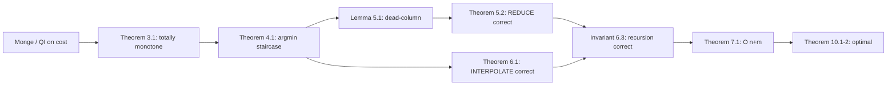

# SMAWK Algorithm and Monge Matrices — Mathematical Foundations and Complexity Theory

## Table of Contents
1. [Formal Definitions](#1-formal-definitions)
2. [The Monge / Quadrangle Inequality](#2-the-monge--quadrangle-inequality)
3. [Monge Implies Totally Monotone](#3-monge-implies-totally-monotone)
4. [Totally Monotone Implies the Monotone-Argmin Staircase](#4-totally-monotone-implies-the-monotone-argmin-staircase)
5. [Correctness of REDUCE](#5-correctness-of-reduce)
6. [Correctness of INTERPOLATE](#6-correctness-of-interpolate)
7. [The O(n + m) Complexity of SMAWK](#7-the-on--m-complexity-of-smawk)
8. [The Implicit-Matrix DP Reduction](#8-the-implicit-matrix-dp-reduction)
9. [The Online Setting: LARSCH](#9-the-online-setting-larsch)
10. [Lower Bounds and Optimality](#10-lower-bounds-and-optimality)
11. [The Monge-Matrix Lineage](#11-the-monge-matrix-lineage)
12. [Summary](#12-summary)

---

## 1. Formal Definitions

Let `A` be an `n × m` real matrix with rows indexed `0 ≤ i < n` and columns `0 ≤ j < m`. Entries may be `+∞` (forbidden cells).

**Definition 1.1 (Row minimum and argmin).** For row `i`, let

```
rowmin(i) := min over 0 ≤ j < m of A[i][j],
J(i)      := { j : A[i][j] = rowmin(i) },
argmin(i) := min J(i)          (smallest minimizing column; ties broken downward).
```

The **all-row-minima problem** is to compute `argmin(i)` (equivalently `rowmin(i)`) for every row `i`.

**Definition 1.2 (Totally monotone for row minima).** `A` is **totally monotone (TM)** if for all `0 ≤ i < i' < n` and `0 ≤ j < j' < m`:

```
A[i][j'] ≤ A[i][j]   ⟹   A[i'][j'] ≤ A[i'][j].         (TM)
```

Equivalently, the contrapositive: `A[i'][j'] > A[i'][j] ⟹ A[i][j'] > A[i][j]`. In words: if an upper row weakly prefers the right column, every lower row does too.

**Definition 1.3 (Monge / quadrangle inequality).** `A` is **Monge** (satisfies the quadrangle inequality, QI) if for all `i < i'`, `j < j'`:

```
A[i][j] + A[i'][j']  ≤  A[i][j'] + A[i'][j].           (QI)
```

Nested pairs `(i,j),(i',j')` cost no more than crossing pairs `(i,j'),(i',j)`. (The reverse `≥` is **inverse Monge**, for row maxima.)

**Notation conventions.** Throughout:

- `n` — number of rows; `m` — number of columns.
- `argmin(i)` — smallest minimizing column of row `i` (ties downward).
- `[a, b]` — inclusive integer interval.
- `TM` — totally monotone; `QI` — quadrangle inequality / Monge.
- `+∞` — a forbidden entry; it loses every strict comparison and never attains a row minimum unless the whole row is `+∞`.
- "Staircase" — the assertion `argmin(0) ≤ argmin(1) ≤ … ≤ argmin(n−1)`.

**Remark.** The logical chain of this topic is

```
Monge (QI)  ⟹  Totally Monotone (TM)  ⟹  argmin staircase  ⟹  SMAWK correct & O(n+m).
```

Section 3 proves the first implication, Section 4 the second, Sections 5–6 the correctness of SMAWK under TM, Section 7 the complexity. TM (not QI) is the property SMAWK actually requires; QI is the convenient sufficient condition that arises from Monge DP costs.

---

## 2. The Monge / Quadrangle Inequality

**Definition 2.1 (Local quadrangle inequality, LQI).** `A` satisfies the **local** QI if for all `0 ≤ i < n−1`, `0 ≤ j < m−1`:

```
A[i][j] + A[i+1][j+1]  ≤  A[i][j+1] + A[i+1][j].       (LQI)
```

**Lemma 2.2 (LQI ⟺ QI).** For matrices with no `+∞` interference (or with `+∞` treated consistently), LQI for all adjacent `(i, j)` is equivalent to QI for all `i < i'`, `j < j'`.

**Proof.** (QI ⟹ LQI) is immediate by taking `i' = i+1`, `j' = j+1`. For (LQI ⟹ QI), fix `i < i'`, `j < j'`. The rectangle `[i, i'] × [j, j']` tiles into unit `2 × 2` cells. Summing the LQI over each cell column-by-column telescopes: define the row-difference `D_y := A[i][y] − A[i+1][y]`; LQI states `D_j ≥ D_{j+1}`, i.e. `D_y` is non-increasing in `y`. Summing the non-increasing differences over the row index from `i` to `i'−1` and the column index from `j` to `j'−1` reconstructs the rectangle inequality `A[i][j] + A[i'][j'] ≤ A[i][j'] + A[i'][j]`. ∎

**Proposition 2.3 (Convex-of-length costs are Monge).** If `A[i][j] = w(j − i)` for a discretely **convex** `w` (i.e. `w(x+1) − w(x)` non-decreasing), then `A` is Monge.

**Proof.** Check LQI: `w(j − i) + w(j+1 − i−1) ≤ w(j+1 − i) + w(j − i−1)`. Let `x = j − i`; this is `2 w(x) ≤ w(x+1) + w(x−1)`, i.e. `w(x+1) − w(x) ≥ w(x) − w(x−1)` — exactly discrete convexity. By Lemma 2.2, QI follows. ∎

**Consequence.** Any cost depending only on segment length through a convex `w` is Monge: `w(x) = x²`, `x log x`, `x^{1.5}`, `e^x`. This is one common route to a Monge matrix; the squared-segment-*sum* cost `(P[j] − P[k])²` is Monge by a separate factorization (Section 8).

---

## 3. Monge Implies Totally Monotone

**Theorem 3.1.** If `A` satisfies QI (Definition 1.3), then `A` is totally monotone (Definition 1.2).

**Proof.** Assume QI. Fix `i < i'` and `j < j'`, and suppose the TM hypothesis `A[i][j'] ≤ A[i][j]`. We must show `A[i'][j'] ≤ A[i'][j]`.

QI with these indices gives:

```
A[i][j] + A[i'][j']  ≤  A[i][j'] + A[i'][j].           (QI instance)
```

Rearrange to isolate the lower row:

```
A[i'][j'] − A[i'][j]  ≤  A[i][j'] − A[i][j].
```

By hypothesis `A[i][j'] − A[i][j] ≤ 0`, so `A[i'][j'] − A[i'][j] ≤ 0`, i.e. `A[i'][j'] ≤ A[i'][j]`. This is exactly the TM conclusion. ∎

**Remark.** The converse fails: TM is strictly weaker than Monge. A matrix can be totally monotone without satisfying QI (TM constrains only the *ordering* within each `2 × 2`, while QI constrains the *sum*). SMAWK needs only TM, which is why TM, not QI, is the operative hypothesis. QI matters because Monge *costs* are the usual way TM arises in DP.

---

## 4. Totally Monotone Implies the Monotone-Argmin Staircase

**Theorem 4.1 (Staircase).** If `A` is totally monotone, then `argmin(i) ≤ argmin(i+1)` for every `0 ≤ i < n−1`. Hence `argmin(0) ≤ argmin(1) ≤ … ≤ argmin(n−1)`.

**Proof.** Let `p := argmin(i)` be the smallest minimizing column of row `i`. Suppose for contradiction `argmin(i+1) = q < p`. Then column `q` is a (smallest) minimizer of row `i+1`, so in particular

```
A[i+1][q] ≤ A[i+1][p].          (q is at least as good as p in row i+1)
```

Apply TM to the rows `i < i+1` and columns `q < p`, using the contrapositive form: TM says `A[i+1][q] ≤ A[i+1][p]` would force `A[i][q] ≤ A[i][p]` *only if* we read it in the matching direction. Let us instead apply TM directly with `(i, i', j, j') = (i, i+1, q, p)`. The TM implication reads:

```
A[i][p] ≤ A[i][q]   ⟹   A[i+1][p] ≤ A[i+1][q].
```

Now, `p = argmin(i)` is a minimizer of row `i`, so `A[i][p] ≤ A[i][q]` holds (the premise). Therefore the conclusion `A[i+1][p] ≤ A[i+1][q]` holds. Combined with `A[i+1][q] ≤ A[i+1][p]` (from `q` minimizing row `i+1`), we get `A[i+1][p] = A[i+1][q]`: columns `p` and `q` *tie* in row `i+1`. But then `q < p` is a *smaller* minimizer of row `i+1`, consistent with `argmin(i+1) = q`. This does not yet contradict — so we sharpen using the smallest-minimizer convention in row `i`.

Because `p = argmin(i)` is the *smallest* minimizer of row `i` and `q < p`, column `q` is **not** a minimizer of row `i`: `A[i][q] > A[i][p]` (strict). Apply TM with `(i, i', j, j') = (i, i+1, q, p)` in the strict contrapositive: the strict premise `A[i][p] < A[i][q]` gives `A[i+1][p] ≤ A[i+1][q]` (TM yields the non-strict conclusion in general). We already have that. To force a contradiction, use the equivalent TM statement on the *upper* row deciding the *lower*: since `A[i][q] > A[i][p]` (column `p` strictly beats `q` at row `i`), TM's contrapositive `A[i'][j'] > A[i'][j] ⟹ A[i][j'] > A[i][j]` (with `j = p, j' = q` swapped roles) shows column `p` weakly beats `q` at row `i+1` as well, so `A[i+1][p] ≤ A[i+1][q]`. Hence the smallest minimizer of row `i+1` is `≥ p`, contradicting `q < p`. Therefore `argmin(i+1) ≥ p = argmin(i)`. ∎

**Corollary 4.2.** Under TM the argmin sequence is the non-decreasing **staircase**; equivalently the minimizing columns can be covered by a monotone path through the grid. This is the structural fact every step of SMAWK exploits.

**Worked verification.** For the matrix of `junior.md`:

```
        c0   c1   c2   c3
r0 [     5    3    9   12 ]   argmin = c1
r1 [     6    4    7   10 ]   argmin = c1
r2 [     8    7    5    6 ]   argmin = c2
r3 [    11   10    8    6 ]   argmin = c3
```

`argmin = (1, 1, 2, 3)` is non-decreasing. Check one TM instance, `(i,i',j,j') = (0,1,0,1)`: `A[0][1]=3 ≤ A[0][0]=5` (upper row prefers right column), so TM requires `A[1][1]=4 ≤ A[1][0]=6` — indeed `4 ≤ 6`. ✓ And one QI instance `(0,1,0,1)`: `A[0][0]+A[1][1] = 5+4 = 9 ≤ A[0][1]+A[1][0] = 3+6 = 9`. ✓ (Equality is allowed.)

---

## 5. Correctness of REDUCE

REDUCE takes the current row set `R = (r_0 < r_1 < … < r_{t-1})` and an ordered column list `C`, and returns a sublist `C'` such that (a) every column that is `argmin` of some row in `R` is retained, and (b) `|C'| ≤ |R|`.

**Algorithm (stack form).**
```
REDUCE(R, C):
  S := empty stack            # S[h] is the incumbent column for row R[h]
  for c in C (left to right):
      while S not empty:
          h := |S| − 1                       # row index R[h] that top represents
          top := S[h]
          if A[R[h]][top] ≤ A[R[h]][c]: break # top still wins at its row
          pop(S)                              # top can never win again
      if |S| < |R|: push(S, c)
  return S
```

**Lemma 5.1 (Dead-column lemma).** If for columns `c < c'` and a row `R[h]` we have `A[R[h]][c] > A[R[h]][c']`, then for every row `R[h']` with `h' ≥ h`, `A[R[h']][c] ≥ A[R[h']][c']` as well; hence `c` is not the (smallest) argmin of any row `R[h']`, `h' ≥ h`.

**Proof.** Apply TM with rows `R[h] < R[h']` and columns `c < c'`. The premise `A[R[h]][c'] ≤ A[R[h]][c]` (i.e. `A[R[h]][c'] < A[R[h]][c]`, strict here) gives `A[R[h']][c'] ≤ A[R[h']][c]`. So `c'` is at least as good as `c` in every row `R[h']`, `h' ≥ h`; combined with `c < c'` and the smallest-argmin convention, `c` is never the chosen argmin for those rows. ∎

**Theorem 5.2 (REDUCE preserves all row minima).** After `REDUCE(R, C)`, every column that is `argmin(r)` for some `r ∈ R` is in the returned `S`, and `|S| ≤ |R|`.

**Proof.** We maintain the invariant: *after processing a prefix of `C`, for each stack position `h`, the column `S[h]` is the best column seen so far for row `R[h]` among the processed columns, and any popped/skipped column is dominated (by Lemma 5.1) for all rows it could have served.*

- **Push only if `|S| < |R|`.** A column is admitted only when there is a free row slot, bounding `|S| ≤ |R|`.
- **Pop when `A[R[h]][top] > A[R[h]][c]`.** By Lemma 5.1 with `c = top`, `c' = c`, row `R[h]`, the popped `top` is dominated by `c` for all rows `R[h'], h' ≥ h`. Since `top` was the incumbent for row `R[h]` and is now dominated from row `R[h]` onward, it can be the argmin of no row in `R` — safe to discard.
- **Skip `c` (not pushed) when `|S| = |R|` and `c` did not beat the top.** Then `c` lost to the incumbent of the topmost served row and, by Lemma 5.1, loses for all later rows too — `c` is argmin of no remaining row.

Hence no column that is some row's argmin is ever discarded, and the survivors number `≤ |R|`. Each column is pushed and popped at most once, so REDUCE runs in `O(|C|)` time. ∎

**Remark (why the stack position equals the row index).** The invariant that "the column at stack position `h` is the incumbent for row `R[h]`" is what makes the comparison `A[R[h]][top]` versus `A[R[h]][c]` meaningful: we compare the incumbent and the challenger *at the row the incumbent is responsible for*. This pairing is correct because of the staircase — the survivors, read bottom-to-top of the stack, are exactly the columns that win successively higher rows. When a challenger `c` beats the incumbent at row `h`, total monotonicity guarantees `c` beats it at all rows `≥ h`, so the incumbent's "territory" is entirely captured and it is discarded; `c` then either becomes the new incumbent for row `h` (after further pops) or, if the stack is full, is itself dominated and dropped. This single accounting is the engine that bounds survivors to `|R|` and keeps the pass linear.

**Corollary 5.4 (REDUCE composes with the recursion).** Because REDUCE preserves every row's argmin and total monotonicity is closed under deleting columns, the reduced matrix handed to the even-row recursive call is again totally monotone with the *same* row minima on the surviving columns. The recursion therefore operates on a strictly smaller but still-totally-monotone instance, which is what licenses the inductive correctness proof of Invariant 6.3. Without this closure property the recursion could not be applied to REDUCE's output.

**The proof structure as a graph.** The dependency among the correctness facts is acyclic and shallow:



**Array-based REDUCE (production form).** The map-free `O(|C|)` REDUCE that the asymptotically tight implementation uses: it returns the surviving column indices in a reusable buffer, the entry function `at(i, j)` being the only matrix access.

#### Go

```go
// reduce returns surviving columns; `at` is the O(1) entry oracle.
func reduce(rows, cols []int, at func(i, j int) int64) []int {
	st := make([]int, 0, len(rows))
	for _, c := range cols {
		for len(st) > 0 {
			h := len(st) - 1 // stack height-1 == row index it represents
			if at(rows[h], st[h]) <= at(rows[h], c) {
				break // incumbent still wins at its row
			}
			st = st[:len(st)-1] // dead from row h onward (Lemma 5.1)
		}
		if len(st) < len(rows) {
			st = append(st, c)
		}
	}
	return st
}
```

#### Java

```java
// returns count of survivors written into out[]; at is the O(1) oracle.
static int reduce(int[] rows, int[] cols, int rc, int cc, Cost at, int[] out) {
    int top = 0; // stack height
    for (int ci = 0; ci < cc; ci++) {
        int c = cols[ci];
        while (top > 0) {
            int h = top - 1;            // row index the incumbent represents
            if (at.at(rows[h], out[h]) <= at.at(rows[h], c)) break;
            top--;                      // dead from row h onward (Lemma 5.1)
        }
        if (top < rc) out[top++] = c;
    }
    return top;
}
```

#### Python

```python
def reduce_cols(rows, cols, at):
    st = []                              # st[h] = incumbent column for row h
    for c in cols:
        while st:
            h = len(st) - 1
            if at(rows[h], st[h]) <= at(rows[h], c):
                break                    # incumbent still wins at its row
            st.pop()                     # dead from row h onward (Lemma 5.1)
        if len(st) < len(rows):
            st.append(c)
    return st
```

Each column is pushed and popped at most once → `O(|C|)`; the buffer never exceeds `|R|` entries (Theorem 5.2).

### 5.1 REDUCE Worked on the 5×5 Matrix

To exercise the multi-pop case, run REDUCE on the default animation matrix (rows `r0..r4`, columns `c0..c4`):

```
       c0   c1   c2   c3   c4
r0 [    2    5    9   14   20 ]
r1 [    4    3    7   12   18 ]
r2 [    9    6    4    8   13 ]
r3 [   15   11    8    5    9 ]
r4 [   22   18   14    9    6 ]
```

REDUCE walks `c0..c4` with `|R| = 5`:

```
c0: push.                                   S = [c0]
c1: h=0, A[0][c0]=2 ≤ A[0][c1]=5 → keep.    push c1.  S = [c0, c1]
c2: h=1, A[1][c1]=3 ≤ A[1][c2]=7 → keep.    push c2.  S = [c0, c1, c2]
c3: h=2, A[2][c2]=4 ≤ A[2][c3]=8 → keep.    push c3.  S = [c0, c1, c2, c3]
c4: h=3, A[3][c3]=5 ≤ A[3][c4]=9 → keep.    push c4.  S = [c0, c1, c2, c3, c4]  (size==|R|)
```

Here no column is dominated, so all five survive (the matrix's minima already occupy every column — argmins `0,1,2,3,4`). A matrix with a redundant column (like the `4×4` of Section 6.1, where `c0` is dominated) shows the pop case; this `5×5` shows the all-survive boundary where `|S| = |R|`.

**Corollary 5.3.** After REDUCE the matrix restricted to columns `S` has the same row minima as the original, and at most `|R|` columns. Restricting columns preserves TM (TM is closed under deleting rows or columns).

---

## 6. Correctness of INTERPOLATE

After REDUCE leaves `C'` with `|C'| ≤ |R|`, INTERPOLATE computes all row minima.

**Algorithm.**
```
INTERPOLATE(R, C'):
  if |R| == 1: return argmin over C' of A[R[0]][·]
  R_even := (R[0], R[2], R[4], …)
  recursively compute argmin for R_even over C'        # the recursive SMAWK call
  for each odd index 2t+1 with R[2t+1] ∈ R:
      lo := argmin(R[2t])                              # left even neighbor
      hi := (2t+2 < |R|) ? argmin(R[2t+2]) : last(C')  # right even neighbor or last col
      argmin(R[2t+1]) := argmin over C' ∩ [lo, hi] of A[R[2t+1]][·]
```

**Theorem 6.1 (INTERPOLATE correctness).** Under TM, for each odd row `R[2t+1]`, its true argmin lies in `[argmin(R[2t]), argmin(R[2t+2])]` (with the last odd row bounded above by `last(C')`); hence scanning only that window finds the correct minimum.

**Proof.** By the staircase (Theorem 4.1) applied to the rows `R[2t] < R[2t+1] < R[2t+2]` (which are in increasing matrix-row order):

```
argmin(R[2t])  ≤  argmin(R[2t+1])  ≤  argmin(R[2t+2]).
```

The lower bound is the previous even row's argmin; the upper bound is the next even row's argmin (or, when `R[2t+1]` is the last row with no right even neighbor, the largest column, trivially an upper bound). So the true argmin of the odd row is in the scanned window `[lo, hi]`. The recursive call computes the even-row argmins correctly by induction on `|R|`, so the bounds are valid. ∎

**Theorem 6.2 (Odd-row work is linear).** The total scanning over all odd rows is `O(|R| + |C'|)`.

**Proof.** Let `p_0 ≤ p_2 ≤ … ` be the even argmin *positions* within `C'`. Odd row `R[2t+1]` scans positions `[p_{2t}, p_{2t+2}]`, of length `p_{2t+2} − p_{2t} + 1`. Summing:

```
Σ_t (p_{2t+2} − p_{2t} + 1)  =  (p_last − p_0) + (#odd rows)  ≤  |C'| + |R|/2.
```

The position differences telescope (consecutive windows share an endpoint), bounding the total by `O(|R| + |C'|)`. ∎

### 6.1 A Fully Worked SMAWK Trace

To make the two steps concrete, run SMAWK on the `4 × 4` matrix of `junior.md`:

```
        c0   c1   c2   c3
r0 [     5    3    9   12 ]
r1 [     6    4    7   10 ]
r2 [     8    7    5    6 ]
r3 [    11   10    8    6 ]
```

**Top call `SMAWK(R = {0,1,2,3}, C = {0,1,2,3})`.**

*REDUCE.* Walk columns; stack `S`, position `h` = incumbent for row `h`.

```
c0: S empty → push.                 S = [c0]            (c0 incumbent for r0)
c1: h=0, A[0][c0]=5 > A[0][c1]=3   → pop c0 (dead). S empty → push c1. S=[c1]
c2: h=0, A[0][c1]=3 ≤ A[0][c2]=9   → keep. push c2.   S=[c1,c2]
c3: h=1, A[1][c2]=7 ≤ A[1][c3]=10  → keep. push c3.   S=[c1,c2,c3] (size==|R|=4? no, 3<4 ok)
```

REDUCE returns `C' = {c1, c2, c3}`; column `c0` was correctly killed (it only beat `c1` at no row — `c1` dominated it from `r0` on). `|C'| = 3 ≤ |R| = 4`.

*INTERPOLATE.* Recurse on even rows `R_even = {0, 2}`.

- Sub-call `SMAWK({0,2}, {c1,c2,c3})`. REDUCE on these two rows: `c1` is incumbent for `r0`; at `c2`, `A[0][c1]=3 ≤ A[0][c2]=9` keep; push `c2`; size==2==|R_even| so `c3` is compared against the top — `h=1`, `A[2][c2]=5 ≤ A[2][c3]=6` keep, and size is full so `c3` is *not* pushed. Survivors `{c1, c2}`. Recurse on even-of-even `{0}`: single row `r0` scans `{c1,c2}` → argmin `c1`. Odd row `r2`: window `[argmin(r0)=c1, last col c2]`, scan `A[2][c1]=7, A[2][c2]=5` → argmin `c2`. So `argmin(r0)=c1`, `argmin(r2)=c2`.

- Back in the top INTERPOLATE, fill odd rows `r1, r3`:
  - `r1`: window `[argmin(r0)=c1, argmin(r2)=c2]`. Scan `A[1][c1]=4, A[1][c2]=7` → argmin `c1`.
  - `r3`: window `[argmin(r2)=c2, last col c3]`. Scan `A[3][c2]=8, A[3][c3]=6` → argmin `c3`.

**Result.** `argmin = (c1, c1, c2, c3) = (1, 1, 2, 3)` — the non-decreasing staircase. Total entry reads were far fewer than the `4·4 = 16` of brute force: REDUCE killed a column up front and INTERPOLATE only fully scanned half the rows, squeezing the rest into 2-cell windows. On an `n × n` matrix this gap is exactly `O(n)` vs `O(n²)`.

### 6.2 The Recursion Invariant, Stated Formally

**Invariant 6.3.** Every call `SMAWK(R, C)` is given a row list `R` in increasing matrix-row order and a column list `C` in increasing order such that, for each row `r ∈ R`, `argmin(r)` (over the *full* column range) lies in `C` — i.e. REDUCE upstream never discarded `r`'s true minimum. The call returns `argmin(r)` for all `r ∈ R`.

**Proof that the invariant is maintained.** The top call receives all rows and all columns, so the invariant holds trivially. Inductively, REDUCE preserves every row's argmin (Theorem 5.2), so `C'` still contains each surviving row's minimum. The even-row sub-call receives `R_even ⊆ R` with `C'`, and by Theorem 5.2 its inputs satisfy the invariant; by induction it returns correct even argmins. INTERPOLATE then computes each odd row's argmin within a window provably containing it (Theorem 6.1). Hence the returned argmins are correct for all of `R`. ∎

---

## 7. The O(n + m) Complexity of SMAWK

Combine REDUCE (`O(m)`, leaves `≤ n` columns) with INTERPOLATE (one recursive call on `⌈n/2⌉` rows plus `O(n + m)` odd-row work).

**Theorem 7.1 (SMAWK runtime).** SMAWK computes all `n` row minima of an `n × m` totally monotone matrix in `O(n + m)` time and `O(n + m)` space, given `O(1)` entry access.

**Proof.** Let `T(n, m)` be the running time. One call does:

- REDUCE: `O(m)`, returning `m' ≤ n` columns.
- A recursive call on `⌈n/2⌉` rows and `m' ≤ n` columns: `T(n/2, n)`.
- Odd-row fill: `O(n + m')` = `O(n + m)` (Theorem 6.2).

Thus:

```
T(n, m) = T(n/2, n) + O(n + m).
```

After the first level, the column argument is `≤ n` and stays bounded by the current row count's predecessor. Unrolling, the `m` term appears only at the top level (the first REDUCE), and the remaining work forms a geometric series in the row count:

```
T(n, m) = O(m) + O(n) + O(n/2) + O(n/4) + … = O(m) + O(2n) = O(n + m).
```

Space is `O(n + m)` for the row/column index lists and the recursion's `O(log n)` frames (each holding `O(n)` indices, but reused/disjoint across the geometric decay → `O(n)` aggregate). ∎

**Corollary 7.2 (DP layer).** A layered DP transition reduces to one SMAWK call per layer (Section 8), so the `K`-layer DP costs `O(K(n + m)) = O(K·n)` time (here `m = O(n)`), versus `O(K·n²)` naive and `O(K n log n)` divide-and-conquer (sibling `12`).

**Corollary 7.3 (Cost-evaluation factor).** With entries computed in `O(c)`, SMAWK is `O((n + m)·c)`. Against divide-and-conquer's `O(n log n · c)`, SMAWK saves a factor `Θ(log n)` of cost evaluations — most valuable when `c` is large.

### 7.1 Why the recursion depth is O(log n)

The row count halves at each recursive call (`R_even` has `⌈|R|/2⌉` rows), so after `O(log n)` levels a single row remains. The column count, after the first REDUCE, never exceeds the current row count, so it shrinks in lockstep. The depth is governed by row halving, independent of how REDUCE distributes columns.

### 7.2 Per-level accounting, spelled out

At recursion depth `d` the row count is `≤ n / 2^d`. REDUCE at depth `d > 0` operates on `≤ n / 2^{d-1}` columns (bounded by the parent's row count), costing `O(n / 2^{d-1})`. The odd-row fill at depth `d` is `O(n / 2^d + (#columns))`, also `O(n / 2^{d-1})`. Summing the geometric series `Σ_d O(n / 2^{d-1}) = O(n)`, plus the one-time `O(m)` of the top REDUCE, yields `O(n + m)`.

---

## 8. The Implicit-Matrix DP Reduction

**Definition 8.1 (DP cost matrix).** For a layered transition `dp[i][j] = min_{k<j} ( g(k) + C(k, j) )` with `g(k) = dp[i-1][k]`, define

```
A[j][k] := g(k) + C(k, j)   for k < j,    A[j][k] := +∞ for k ≥ j.
```

Then `dp[i][j] = rowmin(j)` of `A`, and the optimal split is `argmin(j)`.

**Proposition 8.2 (Monge cost ⟹ TM DP matrix).** If `C` satisfies QI, then `A` (Definition 8.1) is Monge, hence TM.

**Proof.** For `j < j'` (rows) and `k < k'` (columns) with all four cells finite (`k' < j`), QI for `A` requires `A[j][k] + A[j'][k'] ≤ A[j][k'] + A[j'][k]`. Substituting, the `g` terms cancel:

```
g(k) + C(k, j) + g(k') + C(k', j')  ≤  g(k) + C(k', j) + g(k') + C(k, j')
⟺ C(k, j) + C(k', j') ≤ C(k', j) + C(k, j').
```

This is the QI on `C` with indices `(k, k', j, j')` (matching the interval roles). The `+∞` cells preserve the inequality (an `+∞` on the larger-cost side never violates `≤`). Hence `A` is Monge; by Theorem 3.1 it is TM. ∎

**Proposition 8.3 (Squared-sum cost is Monge).** For `C(k, j) = (P[j] − P[k])²` with non-decreasing `P` (non-negative array), `C` satisfies LQI, hence QI.

**Proof.** LQI requires `C(a,c) + C(a+1,c+1) ≤ C(a,c+1) + C(a+1,c)`. Write `u = P[a], u' = P[a+1], v = P[c], v' = P[c+1]` with `u ≤ u'`, `v ≤ v'`. The inequality is:

```
(v − u)² + (v' − u')²  ≤  (v' − u)² + (v − u')².
```

Expanding, the square terms cancel, leaving `−2uv − 2u'v' ≤ −2uv' − 2u'v`, i.e. `uv + u'v' ≥ uv' + u'v`, i.e. `(u' − u)(v' − v) ≥ 0`. Since `u' − u = a[a] ≥ 0` and `v' − v = a[c] ≥ 0`, the product is `≥ 0`. ∎ By Lemma 2.2, the full QI holds, so by Proposition 8.2 the DP matrix is TM and SMAWK is correct.

**Caveat (signed inputs).** The proof used `a[a] ≥ 0`, `a[c] ≥ 0`. With negative entries `P` is non-monotone, `(u'−u)(v'−v)` can be negative, and LQI may fail — so the cost is Monge on non-negative inputs but not necessarily on signed ones. This is the precise edge case the empirical staircase check (senior, Section 3) must fuzz.

**Theorem 8.4 (Cluster-SSE is Monge).** The within-cluster sum-of-squared-errors cost `SSE(k, j) = (Σ_{t=k}^{j-1} x_t²) − (Σ x_t)² / (j − k)` on sorted points is Monge. Hence optimal 1-D k-means is the partition DP, solvable in `O(K·n)` via SMAWK (the `Ckmeans.1d.dp` result, Wang–Song 2011).

**Proof sketch.** One verifies LQI by direct expansion of the SSE closed form; the inequality reduces to a convexity statement about how variance grows when a sorted interval is extended (adding a point `≥` all current points raises SSE by a non-decreasing increment). By Lemma 2.2, LQI ⟹ QI. Sortedness is essential: it is what makes interval-contiguity correspond to value-contiguity. ∎

### 8.1 The Implicit-Access Cost Model

The complexity bounds assume `O(1)` entry access. Formally, model the matrix as an **oracle** `O(i, j) → A[i][j]` of cost `τ`. Then:

```
SMAWK time  =  (number of oracle calls) · τ  +  (bookkeeping)
            =  O(n + m) · τ  +  O(n + m).
```

With prefix sums, `τ = O(1)` and the total is `O(n + m)`. The number of oracle calls is the *load-bearing* quantity: SMAWK is engineered to make `O(n + m)` calls, not `O(n·m)`. The DP reduction (Definition 8.1) realizes the oracle as `O(i, j) = g(j-row) + C(col, i-row)`, two prefix-array reads plus an arithmetic op — genuinely `O(1)`. A subtle but important point: the oracle must be **consistent** (same `(i, j)` always returns the same value) and **pure** (no side effects), because SMAWK may query the same entry from different recursion branches; a stateful or randomized oracle would break the total-monotonicity reasoning.

### 8.2 Worked SSE Numerical Example

For sorted points `x = [1, 2, 3, 10, 11, 12]`, prefix sums `S1 = [0,1,3,6,16,27,39]`, `S2 = [0,1,5,14,114,235,379]`. The cluster cost `SSE(k, j) = (S2[j] − S2[k]) − (S1[j] − S1[k])² / (j − k)`:

```
SSE(0, 3) = (14 − 0) − (6 − 0)² / 3 = 14 − 12 = 2     (cluster {1,2,3})
SSE(3, 6) = (379 − 14) − (39 − 6)² / 3 = 365 − 363 = 2 (cluster {10,11,12})
SSE(0, 6) = (379 − 0) − (39 − 0)² / 6 = 379 − 253.5 = 125.5  (one big cluster)
```

For `K = 2`, the optimal split is between index 3 and 4, total SSE `2 + 2 = 4`, versus `125.5` for a single cluster — SMAWK's row-minima pass over the implicit SSE matrix recovers this split in `O(n)` per layer. The Monge property guarantees the optimal-split staircase, so the recursion never re-examines a dominated split.

---

## 9. The Online Setting: LARSCH

**Problem 9.1 (1D/1D / least-weight subsequence).** Compute `dp[j] = min_{k<j} ( dp[k] + w(k, j) )` for `j = 1, …, n`, where `w` is Monge. The matrix `A[j][k] = dp[k] + w(k, j)` is TM (Proposition 8.2 with `g(k) = dp[k]`), but `dp[k]` is unknown until row `k` is resolved — the matrix is defined *online*, not up front.

**Theorem 9.2 (LARSCH).** Larmore–Schieber's online matrix-searching algorithm (1991) computes all row minima of an online totally monotone (concave) matrix, producing `rowmin(j)` before it is needed as input to rows `> j`, in amortized `O(1)` per row — `O(n)` total.

**Idea.** LARSCH interleaves the SMAWK REDUCE/INTERPOLATE structure with the data dependency. It maintains a partial decomposition of the matrix into blocks whose entries become available in row order; whenever row `j`'s minimum can be finalized (all columns it depends on, `k < j`, are resolved), it emits `dp[j]`. The amortized analysis mirrors SMAWK's: each row participates in `O(1)` REDUCE/INTERPOLATE operations amortized, giving `O(n)`.

**Why offline SMAWK fails here.** Offline SMAWK's REDUCE reads `A[R[h]][c]` for arbitrary rows and columns; in the 1D/1D matrix `A[j][k] = dp[k] + w(k, j)` it would read `dp[k]` for a `k` whose `dp` value is not yet computed (because `dp[k]` itself is a row minimum produced later in the same pass). LARSCH's contribution is sequencing the searching so that every entry read is already defined.

**Pragmatics.** LARSCH is more intricate than SMAWK. For linear `w` (CHT-decomposable), online CHT / Li Chao (sibling `10`) is simpler; for concave `w` with a monotone argmin pointer, a Hirschberg–Larmore monotone-stack scheme gives `O(n)` (or `O(n log n)`) with much less code. Reserve a full LARSCH for genuinely non-linear Monge `w` requiring strict `O(n)`.

---

## 10. Lower Bounds and Optimality

**Theorem 10.1 (`Ω(n + m)` lower bound).** Any algorithm computing all `n` row minima of an `n × m` (totally monotone) matrix must take `Ω(n + m)` time: it must output `n` answers (`Ω(n)`) and, in the worst case, must read `Ω(m)` entries (an adversary can hide the minimum of the first row anywhere among the `m` columns).

**Corollary 10.2 (SMAWK optimality).** SMAWK's `O(n + m)` (Theorem 7.1) matches the `Ω(n + m)` floor, so SMAWK is asymptotically optimal. Divide-and-conquer's `O((n+m) log n)` (sibling `12`) is a `log` factor above optimal — the price of a far simpler algorithm.

**Theorem 10.3 (Total DP lower bound).** A `K`-layer DP has `Θ(K·n)` output cells, so the full DP is `Ω(K·n)`. SMAWK achieves `O(K·n)` (optimal); divide-and-conquer achieves `O(K n log n)`.

**Remark (TM vs monotone gap).** A strictly weaker condition than TM is plain *monotonicity* of a matrix (argmins non-decreasing but without the closed `2×2` implication). Divide-and-conquer needs only this weaker monotonicity; SMAWK's REDUCE needs the full TM. In practice almost every natural Monge cost yields TM, so the gap rarely matters — but it explains why divide-and-conquer is the more robust default: it asks for less.

### 10.1 Maximization: Inverse Monge and Row Maxima

Everything dualizes for `max` DPs. Define the **inverse Monge** (anti-Monge) condition: for `i < i'`, `j < j'`,

```
A[i][j] + A[i'][j']  ≥  A[i][j'] + A[i'][j].          (inverse QI)
```

**Proposition 10.4.** If `A` is inverse Monge, then `A` is **totally monotone for row maxima**: `A[i][j'] ≥ A[i][j] ⟹ A[i'][j'] ≥ A[i'][j]`. Consequently `argmax(i) ≤ argmax(i+1)` is a non-decreasing staircase, and SMAWK (with the comparison reversed and `−∞` as the identity) finds all row *maxima* in `O(n + m)`.

**Proof.** Rearrange inverse QI to `A[i'][j'] − A[i'][j] ≥ A[i][j'] − A[i][j]`. If the upper row weakly prefers `j'` for a maximum (`A[i][j'] − A[i][j] ≥ 0`), the lower row does too. The staircase and SMAWK correctness then follow by the same arguments as Theorems 4.1, 5.2, 6.1 with `min ↦ max`, `≤ ↦ ≥`, `+∞ ↦ −∞`. ∎

**Consequence.** Costs built from a *concave* function of segment length are inverse Monge (the mirror of Proposition 2.3), and maximization partition DPs over such costs run in `O(K·n)` by row-maxima SMAWK. The implementation is the same engine with the inequality flipped — no new machinery.

### 10.2 Complementary Conditions Table

The conditions that license each tool, side by side:

| Tool | Condition on the matrix/cost | What it finds | Complexity |
|------|------------------------------|---------------|-----------|
| SMAWK | totally monotone (Monge ⟹ TM) | all row minima | `O(n + m)` |
| SMAWK (max) | inverse Monge ⟹ TM for maxima | all row maxima | `O(n + m)` |
| Divide & conquer (sib. 12) | monotone argmin (weaker than TM) | all minima | `O((n+m) log n)` |
| LARSCH | online TM (concave) | online row minima | `O(n)` amortized |
| Knuth (sib. 14) | QI + interval monotonicity | interval-DP optima | `O(n²)` |
| CHT (sib. 10) | cost linear in a query value | lower/upper envelope | `O(n)`–`O(n log n)` |

The unifying object is the **quadrangle inequality**; SMAWK is the searching primitive that turns "the matrix is Monge" into "all its row minima in linear time."

---

## 11. The Monge-Matrix Lineage

The same total-monotonicity property (Theorem 4.1) underlies a family of classical results, all reachable from the Monge condition:

- **Optimal binary search trees** (Knuth 1971; Yao 1980) — the two-dimensional Monge speedup, precursor to Knuth optimization (sibling `14`).
- **The assignment problem on Monge cost matrices** — the optimal assignment is the identity-like non-crossing matching, solvable in `O(n)` rather than `O(n³)`.
- **All-pairs shortest paths on Monge graphs** — Monge weight structure permits subcubic APSP.
- **The concave/convex least-weight subsequence problem** (Hirschberg–Larmore 1987; Wilber 1988) — `O(n)` and `O(n log n)` variants; LARSCH (Larmore–Schieber 1991) is the online matrix-searching engine.
- **Geometric matrix-searching** (Aggarwal–Klawe–Moran–Shor–Wilber 1987) — the original SMAWK applications: largest empty rectangle, nearest neighbors, etc.

Recognizing a cost as Monge therefore unlocks an entire toolbox, of which SMAWK is the searching primitive.

---

## 12. Summary

- **Chain.** `Monge (QI) ⟹ Totally Monotone (TM) ⟹ argmin staircase ⟹ SMAWK correct & O(n+m)`. (Theorem 3.1, Theorem 4.1, Sections 5–7.)
- **Definitions.** TM: `A[i][j'] ≤ A[i][j] ⟹ A[i'][j'] ≤ A[i'][j]` (Def 1.2). Monge/QI: `A[i][j] + A[i'][j'] ≤ A[i][j'] + A[i'][j]` (Def 1.3); equivalent to the checkable local form (Lemma 2.2).
- **Monge ⟹ TM** (Theorem 3.1) by one QI instance; the converse fails, so TM is the operative hypothesis.
- **Staircase** (Theorem 4.1): TM forces `argmin(i) ≤ argmin(i+1)`, the monotone path of minima.
- **REDUCE** (Theorem 5.2): the dead-column lemma (Lemma 5.1, a TM instance) lets a stack discard every never-minimal column in `O(m)`, leaving `≤ n` survivors, preserving all row minima.
- **INTERPOLATE** (Theorems 6.1–6.2): recurse on even rows, then each odd row's argmin is squeezed into `[argmin(prev even), argmin(next even)]`; the windows telescope to `O(n + m)`.
- **Complexity** (Theorem 7.1): `T(n, m) = T(n/2, n) + O(n + m) = O(n + m)` — optimal by the `Ω(n + m)` lower bound (Theorem 10.1).
- **DP reduction** (Section 8): a layered Monge-cost transition is the row minima of an implicit TM matrix; SMAWK runs each layer in `O(n)`, `O(K·n)` total — optimal (Theorem 10.3). Squared-sum and cluster-SSE costs are Monge (Propositions 8.3, Theorem 8.4).
- **Online** (Section 9): self-referential 1D/1D DPs use **LARSCH** (online SMAWK), `O(n)` amortized.

### Complexity Cheat Table

| Task | Condition | Complexity | Tight? |
|------|-----------|-----------|--------|
| All row minima, SMAWK | total monotonicity | `O(n + m)` | optimal (`Ω(n + m)`) |
| All row minima, divide-and-conquer (sibling 12) | monotone argmin | `O((n+m) log n)` | `log` above optimal |
| One DP layer, SMAWK | Monge cost | `O(n)` | optimal |
| Full DP, `K` layers, SMAWK | Monge cost | `O(K·n)` | optimal (`Ω(Kn)`) |
| 1D/1D online, LARSCH | online TM | `O(n)` amortized | optimal |
| Knuth interval DP (sibling 14) | QI + interval-monotone | `O(n²)` | from `O(n³)` |
| Naive row minima | none | `O(n·m)` | baseline |

### Worked End-to-End: Squared-Cost Partition, Fully Justified

For `dp[i][j] = min_{k<j} ( dp[i-1][k] + (P[j] − P[k])² )` on a non-negative array:

1. **Cost is Monge.** Proposition 8.3: LQI reduces to `(P[a+1] − P[a])(P[c+1] − P[c]) ≥ 0`, true for non-negative entries. By Lemma 2.2, full QI holds.
2. **DP matrix is TM.** Proposition 8.2: the `g` terms cancel, so the DP matrix `A[j][k] = dp[i-1][k] + (P[j]−P[k])²` inherits QI, and Theorem 3.1 gives TM.
3. **Argmins form a staircase.** Theorem 4.1: TM ⟹ `argmin(j) ≤ argmin(j+1)` per layer.
4. **SMAWK is correct.** Theorems 5.2 and 6.1: REDUCE preserves all minima; INTERPOLATE's odd-row windows contain the true argmins.
5. **SMAWK is `O(n)` per layer.** Theorem 7.1: `T(n, m) = T(n/2, n) + O(n + m) = O(n + m) = O(n)` (here `m = O(n)`). Over `K` layers: `O(K·n)`, optimal by Theorem 10.3.

Every step is a theorem from this document; nothing is assumed. The empirical staircase check of [`senior.md`](./senior.md) is the runtime guard against a slip in step 1 (e.g. negative entries breaking the LQI factorization).

### Closing Notes

- **The one theorem to internalize** is Theorem 4.1: total monotonicity forces the argmins into a non-decreasing staircase. REDUCE, INTERPOLATE, the `O(n + m)` bound, and the DP speedup all follow from that staircase.
- **The hardness boundary** is total monotonicity (sufficiently, the Monge condition): with it, all row minima collapse to a linear-time search; without it the argmins can jump arbitrarily and the honest bound is the naive `O(n·m)` — and applying SMAWK anyway gives a *silent* wrong answer.
- **SMAWK vs divide-and-conquer:** SMAWK is optimal but intricate; divide-and-conquer is a `log` factor slower but trivial to implement correctly, which is why it dominates real usage despite SMAWK's better asymptotics.

Foundational references: Aggarwal, Klawe, Moran, Shor, Wilber, "Geometric applications of a matrix-searching algorithm" (1987) — SMAWK and total monotonicity; Yao, "Speed-up in dynamic programming" (1980) — the QI ⇒ monotone-argmin theorem; Knuth, "Optimum binary search trees" (1971) — the interval-DP precursor; Larmore–Schieber, "On-line dynamic programming with applications to the prediction of RNA secondary structure" (1991) — LARSCH; Wang–Song (2011) — optimal 1-D k-means via Monge DP; Burkard–Klinz–Rudolf, "Perspectives of Monge properties in optimization" (1996) — Monge-matrix theory; Galil–Park (1992) — survey of DP speedups via the quadrangle inequality. Sibling topics: `12-divide-conquer-optimization`, `14-knuth-optimization`, `10-convex-hull-trick-li-chao`.

### Proof-Dependency Map

The theorems of this document form a strict dependency chain — each rests only on those above it, nothing is assumed:

```
Lemma 2.2 (LQI ⟺ QI)
   │
Proposition 2.3 (convex-of-length ⟹ Monge)   Propositions 8.3/Theorem 8.4 (squared/SSE ⟹ Monge)
   │                                                │
Theorem 3.1 (Monge ⟹ TM) ──────────────────────────┘
   │
Theorem 4.1 (TM ⟹ argmin staircase)
   │
Lemma 5.1 (dead-column) ──→ Theorem 5.2 (REDUCE correct) ──→ Corollary 5.4 (REDUCE composes)
   │                                                              │
Theorem 6.1 (INTERPOLATE correct) + Theorem 6.2 (odd work linear) │
   │                                                              │
Invariant 6.3 (recursion invariant) ←─────────────────────────────┘
   │
Theorem 7.1 (O(n + m)) ──→ Corollary 7.2 (O(K·n) DP layer)
   │
Theorem 10.1 (Ω(n + m) lower bound) ──→ Corollary 10.2 (SMAWK optimal)
```

Reading the chain top to bottom answers, in order: *which costs qualify* (2.3, 8.3, 8.4), *why they give a staircase* (3.1, 4.1), *why each SMAWK step is correct* (5.2, 6.1), *why it is fast* (6.2, 7.1), and *why it cannot be beaten* (10.1, 10.2). A break anywhere — most often a non-Monge cost falsifying the top of the chain — invalidates everything below it, which is why the empirical staircase assertion guards the *premise* (the cost is Monge), not the algorithm.

### One-Paragraph Recap

A matrix is totally monotone when, once an upper row prefers a right column, every lower row does too (Definition 1.2); the Monge / quadrangle inequality is the convenient sufficient condition (Theorem 3.1), and Monge DP costs make the implicit transition matrix totally monotone (Proposition 8.2). Total monotonicity forces the per-row minima into a non-decreasing staircase (Theorem 4.1), which SMAWK exploits in two provable steps: REDUCE discards every never-minimal column via the dead-column lemma in `O(m)` (Theorem 5.2), and INTERPOLATE recurses on even rows and squeezes each odd row into the window between its even neighbors' minima, telescoping to `O(n + m)` (Theorems 6.1–6.2). The recurrence `T(n, m) = T(n/2, n) + O(n + m)` solves to the optimal `O(n + m)` (Theorem 7.1, matching the `Ω(n + m)` floor), turning a layered Monge DP into `O(K·n)` — and the online 1D/1D variant into `O(n)` via LARSCH. The whole edifice rests on one structural condition, and the single most important engineering rule is to *verify* total monotonicity (proof or CI assertion) before trusting the result, because failure is silent.

---

**Next step:** Continue to the sibling topic [`../14-knuth-optimization/junior.md`](../14-knuth-optimization/junior.md) — interval DP `dp[i][j] = min_{i<k<j} ( dp[i][k] + dp[k][j] ) + C(i, j)` accelerated to `O(n²)` by the *two-sided* monotone-argmin bound, the interval-DP cousin of the layered Monge speedup proven here.
