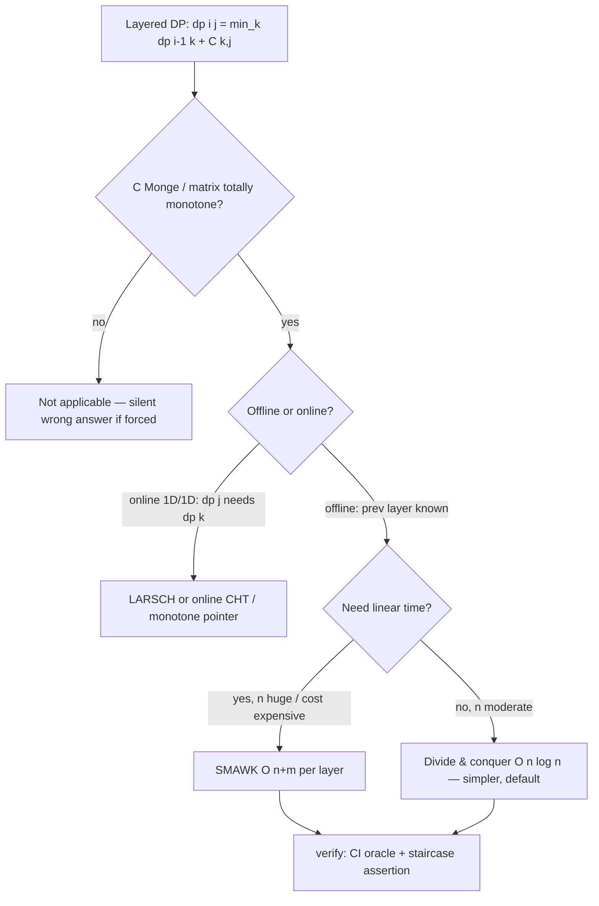

# SMAWK Algorithm and Monge Matrices — Senior Level

> SMAWK is rarely the bottleneck on a small input — but the moment you need to run a DP layer in linear time, the cost function is subtle, or the total monotonicity is *assumed* rather than *proven*, every detail (verifying the Monge property, the per-call cost of evaluating the matrix entry, the staircase restriction, the online vs offline split, memory layout, tie-breaking, and the silent-wrong-answer failure mode) becomes a correctness or performance incident.

## Table of Contents

1. [Introduction](#1-introduction)
2. [Recognizing Applicability](#2-recognizing-applicability)
3. [Verifying Total Monotonicity in Production](#3-verifying-total-monotonicity-in-production)
4. [Speeding Up Real DPs: Partitioning and Clustering](#4-speeding-up-real-dps-partitioning-and-clustering)
5. [Online SMAWK: LARSCH and 1D/1D DP](#5-online-smawk-larsch-and-1d1d-dp)
6. [Engineering Implicit Matrix Access](#6-engineering-implicit-matrix-access)
7. [Code Examples](#7-code-examples)
8. [Observability and Testing](#8-observability-and-testing)
9. [Failure Modes](#9-failure-modes)
10. [Summary](#10-summary)

---

## 1. Introduction

At the senior level the question is no longer "how do REDUCE and INTERPOLATE work" but "is this technique *applicable* to the problem in front of me, do I actually need SMAWK over the simpler divide-and-conquer, and what breaks when I scale it?" SMAWK shows up in four guises that look different but share one engine — *find all row minima of a totally monotone matrix in linear time*:

1. **Optimal partitioning / segmentation** — split `n` items into `K` contiguous groups minimizing a sum of Monge per-group costs. The headline use; `n` up to `10^6`, `K` from a handful to thousands.
2. **1-D clustering (k-means on a line)** — partition sorted points into `K` clusters minimizing within-cluster SSE; the SSE cost is Monge, so this is exactly the partition DP. SMAWK gives the optimal `Ckmeans.1d.dp` algorithm.
3. **Least-weight subsequence / 1D/1D DP** — `dp[j]` depends on earlier `dp[k]` of the *same* sequence through a Monge cost; this is **online** and needs **LARSCH**, not offline SMAWK.
4. **Monge-matrix subroutines** — assignment problem on Monge cost matrices, row maxima for certain geometric problems, all-pairs shortest paths on Monge graphs.

The senior decisions are: *do I need SMAWK at all* (vs the much simpler `O(n log n)` divide-and-conquer, sibling `12`), *how do I confirm applicability* without a silent wrong answer, *how do I keep the matrix entry `O(1)`*, *offline or online*, and *how do I test a result whose only symptom of a bug is "a plausibly wrong number."*

This document treats those decisions in production terms.



---

## 2. Recognizing Applicability

SMAWK applies to **all row minima of a totally monotone matrix**. A DP qualifies when it reduces to that. The recognition checklist:

1. **Does the problem reduce to row minima?** A layered transition `dp[i][j] = min_k ( dp[i-1][k] + C(k, j) )` is the row minima of `A[j][k] = dp[i-1][k] + C(k, j)`. If you cannot express the answer as "the minimum of each row of some matrix," SMAWK is the wrong tool.
2. **Is the entry a fixed function of `(row, col)`?** `A[i][j]` must depend only on `i` and `j` (through prefix data), not on the path taken. Path-dependence breaks the matrix view.
3. **Is the matrix totally monotone?** The crux. Sufficient: the cost `C` is Monge (quadrangle inequality). If you cannot prove it, verify empirically and accept the risk (Section 3).
4. **Offline or online?** If the matrix is fully defined before you start (e.g. `dp[i-1][·]` is a *completed* previous layer), use offline SMAWK. If `A[i][j]` depends on `dp[k]` not yet computed (1D/1D), use **LARSCH** (Section 5).
5. **Do I actually need linear time?** For `n ≤ ~10^5` and few layers, the `O(n log n)` divide-and-conquer (sibling `12`) is far simpler and usually fast enough. SMAWK earns its complexity only when `K(n+m)` vs `K n log n` is decisive, or `n` is enormous, or the cost is expensive (so saving `O(n log n)` evaluations matters).

### 2.1 The "do I need SMAWK?" decision

This is the most important senior judgment, because SMAWK's implementation risk is real. A practical rule:

| Situation | Choose |
|-----------|--------|
| First implementation, `n ≤ 10^5`, contest/prototype | **Divide-and-conquer** (sibling `12`) — `O(n log n)`, ~15 lines |
| `n ≥ 10^6`, many layers, tight time limit | **SMAWK** — `O(n + m)` per layer |
| Expensive cost (`O(c)` per entry, `c` large) | **SMAWK** — does `O(n)` not `O(n log n)` evaluations |
| 1D/1D online (dp[j] needs dp[k], same row) | **LARSCH** (online SMAWK) |
| Interval DP `dp[i][k] + dp[k][j]` | **Knuth** (sibling `14`), not SMAWK |
| Linear cost `dp[k] + a[k]·x[j]` | **CHT** (sibling `10`), often faster |

### 2.2 Common applicable problems

| Problem | Matrix entry `A[j][k]` | Monge? |
|---------|------------------------|--------|
| Min sum of squared segment sums, `K` parts | `dp[i-1][k] + (P[j] − P[k])²` | yes |
| 1-D k-means (sorted points), `K` clusters | `dp[i-1][k] + SSE(k, j)` | yes |
| Optimal piecewise-constant regression | `dp[i-1][k] + SSE(k, j)` | yes |
| Least-weight subsequence (concave cost) | `dp[k] + w(k, j)` (online) | yes (use LARSCH) |
| Min `Σ (len)^p`, `p ≥ 1` convex | `dp[i-1][k] + w(j − k)` | yes |

### 2.3 Common *inapplicable* look-alikes

- **Interval DP** (`dp[i][k] + dp[k][j] + C`) — not row minima of a single matrix; use Knuth (sibling `14`).
- **Cost depending on the chosen split history** — no fixed `A[i][j]`; the matrix is undefined.
- **Non-Monge cost** — argmins not monotone; SMAWK is silently wrong.
- **Negative-entry arrays breaking the Monge proof** — the squared cost is Monge only when `P` is monotone (non-negative entries); signed inputs may break it.

---

## 3. Verifying Total Monotonicity in Production

The defining hazard of SMAWK (and all Monge DP speedups) is that **a non-totally-monotone matrix produces a wrong answer with no error**. Treat verification as a first-class engineering concern.

### 3.1 Three levels of assurance

1. **Proof (best).** Prove `C` satisfies the local quadrangle inequality `C(a,c) + C(a+1,c+1) ≤ C(a,c+1) + C(a+1,c)`. This implies total monotonicity (see [`professional.md`](./professional.md)). Encode the proof's preconditions (e.g. "array entries non-negative") as input validation.
2. **Oracle equality (CI).** On random small inputs, run SMAWK and a brute-force `O(n·m)` row-minima oracle and assert *entrywise* equality of both the minima and the argmins. This catches implementation bugs *and* non-monotone costs.
3. **Staircase assertion (CI + optional prod sampling).** Build the brute-force argmins and assert they are non-decreasing per row block. A failure means the matrix is not totally monotone.

### 3.2 Input fuzzing that matters

The Monge property of common costs is fragile at boundaries:

- **Negative entries.** The squared cost `(P[j] − P[k])²` is Monge only when `P` is monotone. Fuzz with negative array values to catch the break.
- **Equal values / ties.** Ensure tie-breaking (smallest column) keeps the staircase non-decreasing.
- **Degenerate sizes.** `n = 1`, `m = 1`, all-equal rows, single distinct value.
- **Extreme magnitudes.** Values near the overflow boundary, to surface `∞`-handling bugs.

### 3.3 What "verified" does and does not mean

Empirical checks **refute** non-monotone costs cheaply but never **prove** monotonicity — there could be a large adversarial instance that small fuzzing misses. For anything where correctness is load-bearing, the algebraic proof is mandatory; the oracle is the safety net for *implementation* bugs, not a substitute for the proof of *applicability*.

---

## 4. Speeding Up Real DPs: Partitioning and Clustering

### 4.1 Optimal partition into K segments

The canonical application: `dp[i][j] = min_{k<j} ( dp[i-1][k] + C(k, j) )`, answer `dp[K][n]`. Each layer is the row minima of `A[j][k] = dp[i-1][k] + C(k, j)`. Run SMAWK once per layer → `O(K·n)` total, vs `O(K·n²)` naive or `O(K n log n)` divide-and-conquer.

Engineering notes:

- **Roll two rows** (`g = dp[i-1]`, write `dp[i]`) for `O(n)` memory if you do not need reconstruction.
- **Store argmins** in an `O(K·n)` table if you must recover the actual cuts.
- **Staircase padding:** `A[j][k] = +∞` for `k ≥ j` keeps the matrix totally monotone; SMAWK handles `∞` columns automatically.

### 4.2 1-D k-means (Ckmeans.1d.dp)

Partition sorted points `x₁ ≤ … ≤ xₙ` into `K` clusters minimizing total within-cluster SSE. The cluster cost

```
SSE(k, j) = Σ_{t=k}^{j-1} (x_t − μ)²  =  (Σ x_t²) − (Σ x_t)² / (j − k)
```

is computable in `O(1)` from prefix sums of `x` and `x²`, and is **Monge on sorted data**. So 1-D k-means is exactly the partition DP, solved in `O(K·n)` with SMAWK — the basis of the optimal `Ckmeans.1d.dp` algorithm (Wang–Song 2011), turning an NP-hard-in-general problem into a polynomial, *optimal* one in one dimension.

Practical wrinkles:

- **Sorting is a precondition** (`O(n log n)`, cheaper than the DP). On unsorted data the contiguous-partition cost is not Monge.
- **Choosing `K`:** the layer loop already produces `dp[i][n]` for all `i ≤ K_max` in one run; pick `K` by elbow/BIC post-processing.
- **Weighted points** (frequencies) keep the cost Monge; fold weights into the prefix sums.

### 4.3 Optimal segmented regression / histogram

Piecewise-constant (or piecewise-linear) least-squares segmentation is the same DP with an SSE cost; SMAWK gives the optimal `K`-segment fit in `O(K·n)`. Used in time-series change-point detection and data compression (optimal histograms).

---

## 5. Online SMAWK: LARSCH and 1D/1D DP

### 5.1 The 1D/1D problem

Offline SMAWK assumes the matrix is fully defined up front. But a common DP shape is **1D/1D**:

```
dp[j] = min over k < j of ( dp[k] + w(k, j) )
```

Here `dp[j]` depends on `dp[k]` for `k < j` of the **same** array — the matrix entry `A[j][k] = dp[k] + w(k, j)` references `dp[k]`, which is *not yet known* when SMAWK would want to read it. You cannot run offline SMAWK because column `k` of every row depends on a value computed only when row `k` is resolved.

### 5.2 LARSCH

**LARSCH** (Larmore–Schieber, 1991) is the **online** version of SMAWK. It computes the row minima of a totally monotone (concave) matrix *in row order*, producing `dp[j]` before it is needed as input to later rows, in amortized `O(1)` per row — `O(n)` total. It interleaves the SMAWK REDUCE/INTERPOLATE structure with the data dependency so that each `dp[j]` is finalized exactly when row `j` is reached and immediately available for rows `> j`.

When to reach for it:

- **Least-weight subsequence** with a concave (Monge) weight — the textbook LARSCH application.
- **1D/1D DPs** where `dp[j] = min_{k<j} ( dp[k] + w(k, j) )` and `w` is Monge.
- **Online segmentation** where points arrive in a stream.

### 5.3 Pragmatic alternatives to a full LARSCH

LARSCH is even more intricate than SMAWK. In practice seniors often substitute:

- **Divide-and-conquer with the online twist** — works for the layered "exactly K" form (the previous layer is fully known), but *not* for the genuine 1D/1D self-referential form.
- **CHT / Li Chao** — if `w(k, j)` is linear in a query value, the online insertion of CHT (sibling `10`) handles the 1D/1D dependency naturally and is far simpler than LARSCH.
- **Monotone-stack two-pointer** — for the special concave 1D/1D case where the argmin pointer only advances, a simpler amortized-`O(n)` scheme exists (the "monotone CHT" / Hirschberg–Larmore style), often preferred over a full LARSCH implementation.

The senior judgment: implement LARSCH only when the cost is genuinely non-linear Monge *and* the 1D/1D self-dependency is real *and* linear time is required. Otherwise an online CHT or a monotone-pointer scheme is the safer choice.

---

## 6. Engineering Implicit Matrix Access

### 6.1 The cost function is the hot path

SMAWK touches `O(n + m)` entries; every touch is a call to `A[i][j]`. Engineering this function dominates real-world performance:

- **Prefix sums in contiguous arrays.** `SSE` and squared-sum costs reduce to two prefix-array reads; keep them `int64`/`long` and contiguous for cache locality.
- **Avoid closures with captured boxing** (Java/Python) on the hot path; in Java prefer a small interface with a primitive method `long at(int i, int j)` over `BiFunction<Integer,Integer,Long>` to dodge autoboxing.
- **Inline the `∞` / staircase check** so a forbidden `k ≥ j` short-circuits before any arithmetic.

### 6.2 Overflow and sentinels

DP costs (squared sums, variance) grow quadratically with magnitude. Use 64-bit (or 128-bit for adversarial inputs), keep `∞` comfortably below the type max (`1 << 62`, not `MAX`), and **skip `∞` predecessors before adding** so `∞ + cost` never wraps.

### 6.3 Recursion vs explicit stack

Offline SMAWK's INTERPOLATE recursion is `O(log n)` deep (rows halve), so stack overflow is rarely an issue even for `n = 10^6` — unlike divide-and-conquer's `O(log n)`-deep but `O(n)`-node tree. Still, in languages with small default stacks, an explicit work-stack or raising the recursion limit is prudent.

### 6.4 The array-based form

The readable map-based implementation in `junior.md`/`middle.md` is `O(n + m)` in calls but has constant-factor overhead from hash maps. The production form (in [`professional.md`](./professional.md)) uses index arrays and avoids maps entirely, which matters at `n = 10^6`.

---

## 7. Code Examples

### 7.1 K-segment partition via SMAWK (rolled rows, optional reconstruction)

#### Go

```go
package main

import "fmt"

const INF = int64(1) << 62

type CostFn func(i, j int) int64

// smawk fills argmin[r] for each r in rows, over columns cols (increasing).
func smawk(rows, cols []int, f CostFn, argmin []int) {
	cols = reduce(rows, cols, f)
	if len(rows) == 1 {
		r := rows[0]
		best, bc := f(r, cols[0]), cols[0]
		for _, c := range cols[1:] {
			if v := f(r, c); v < best {
				best, bc = v, c
			}
		}
		argmin[r] = bc
		return
	}
	even := make([]int, 0, (len(rows)+1)/2)
	for i := 0; i < len(rows); i += 2 {
		even = append(even, rows[i])
	}
	smawk(even, cols, f, argmin)
	pos := map[int]int{}
	for idx, c := range cols {
		pos[c] = idx
	}
	for i := 1; i < len(rows); i += 2 {
		r := rows[i]
		lo := pos[argmin[rows[i-1]]]
		hi := len(cols) - 1
		if i+1 < len(rows) {
			hi = pos[argmin[rows[i+1]]]
		}
		best, bc := f(r, cols[lo]), cols[lo]
		for t := lo + 1; t <= hi; t++ {
			if v := f(r, cols[t]); v < best {
				best, bc = v, cols[t]
			}
		}
		argmin[r] = bc
	}
}

func reduce(rows, cols []int, f CostFn) []int {
	st := []int{}
	for _, c := range cols {
		for len(st) > 0 {
			i := len(st) - 1
			if f(rows[i], st[i]) <= f(rows[i], c) {
				break
			}
			st = st[:len(st)-1]
		}
		if len(st) < len(rows) {
			st = append(st, c)
		}
	}
	return st
}

func partition(a []int, K int) int64 {
	n := len(a)
	P := make([]int64, n+1)
	for i := 0; i < n; i++ {
		P[i+1] = P[i] + int64(a[i])
	}
	g := make([]int64, n+1)
	for j := range g {
		g[j] = INF
	}
	g[0] = 0
	rows := make([]int, n)
	cols := make([]int, n)
	for i := 0; i < n; i++ {
		rows[i] = i + 1
		cols[i] = i
	}
	argmin := make([]int, n+1)
	for layer := 0; layer < K; layer++ {
		f := func(j, k int) int64 {
			if k >= j || g[k] >= INF {
				return INF
			}
			s := P[j] - P[k]
			return g[k] + s*s
		}
		smawk(rows, cols, f, argmin)
		ng := make([]int64, n+1)
		for jj := range ng {
			ng[jj] = INF
		}
		for _, j := range rows {
			ng[j] = f(j, argmin[j])
		}
		g = ng
	}
	return g[n]
}

func main() {
	fmt.Println(partition([]int{1, 3, 2, 4}, 2)) // 52
}
```

#### Java

```java
import java.util.*;

public class SmawkPartition {
    static final long INF = 1L << 62;
    interface Cost { long at(int i, int j); }

    static void smawk(List<Integer> rows, List<Integer> cols, Cost f, int[] argmin) {
        cols = reduce(rows, cols, f);
        if (rows.size() == 1) {
            int r = rows.get(0), bc = cols.get(0);
            long best = f.at(r, bc);
            for (int c : cols) { long v = f.at(r, c); if (v < best) { best = v; bc = c; } }
            argmin[r] = bc;
            return;
        }
        List<Integer> even = new ArrayList<>();
        for (int i = 0; i < rows.size(); i += 2) even.add(rows.get(i));
        smawk(even, cols, f, argmin);
        Map<Integer, Integer> pos = new HashMap<>();
        for (int idx = 0; idx < cols.size(); idx++) pos.put(cols.get(idx), idx);
        for (int i = 1; i < rows.size(); i += 2) {
            int r = rows.get(i);
            int lo = pos.get(argmin[rows.get(i - 1)]);
            int hi = (i + 1 < rows.size()) ? pos.get(argmin[rows.get(i + 1)]) : cols.size() - 1;
            int bc = cols.get(lo);
            long best = f.at(r, bc);
            for (int t = lo + 1; t <= hi; t++) {
                long v = f.at(r, cols.get(t));
                if (v < best) { best = v; bc = cols.get(t); }
            }
            argmin[r] = bc;
        }
    }

    static List<Integer> reduce(List<Integer> rows, List<Integer> cols, Cost f) {
        List<Integer> st = new ArrayList<>();
        for (int c : cols) {
            while (!st.isEmpty()) {
                int i = st.size() - 1;
                if (f.at(rows.get(i), st.get(i)) <= f.at(rows.get(i), c)) break;
                st.remove(st.size() - 1);
            }
            if (st.size() < rows.size()) st.add(c);
        }
        return st;
    }

    static long partition(int[] a, int K) {
        int n = a.length;
        long[] P = new long[n + 1];
        for (int i = 0; i < n; i++) P[i + 1] = P[i] + a[i];
        long[] g = new long[n + 1];
        Arrays.fill(g, INF);
        g[0] = 0;
        List<Integer> rows = new ArrayList<>(), cols = new ArrayList<>();
        for (int i = 0; i < n; i++) { rows.add(i + 1); cols.add(i); }
        int[] argmin = new int[n + 1];
        for (int layer = 0; layer < K; layer++) {
            final long[] gg = g;
            Cost f = (j, k) -> {
                if (k >= j || gg[k] >= INF) return INF;
                long s = P[j] - P[k];
                return gg[k] + s * s;
            };
            smawk(rows, cols, f, argmin);
            long[] ng = new long[n + 1];
            Arrays.fill(ng, INF);
            for (int j : rows) ng[j] = f.at(j, argmin[j]);
            g = ng;
        }
        return g[n];
    }

    public static void main(String[] args) {
        System.out.println(partition(new int[]{1, 3, 2, 4}, 2)); // 52
    }
}
```

#### Python

```python
import sys

INF = 1 << 62


def smawk(rows, cols, f, argmin):
    cols = reduce_cols(rows, cols, f)
    if len(rows) == 1:
        r = rows[0]
        argmin[r] = min(cols, key=lambda c: f(r, c))
        return
    even = rows[::2]
    smawk(even, cols, f, argmin)
    pos = {c: idx for idx, c in enumerate(cols)}
    for i in range(1, len(rows), 2):
        r = rows[i]
        lo = pos[argmin[rows[i - 1]]]
        hi = pos[argmin[rows[i + 1]]] if i + 1 < len(rows) else len(cols) - 1
        bc = cols[lo]
        best = f(r, bc)
        for t in range(lo + 1, hi + 1):
            v = f(r, cols[t])
            if v < best:
                best, bc = v, cols[t]
        argmin[r] = bc


def reduce_cols(rows, cols, f):
    st = []
    for c in cols:
        while st:
            i = len(st) - 1
            if f(rows[i], st[i]) <= f(rows[i], c):
                break
            st.pop()
        if len(st) < len(rows):
            st.append(c)
    return st


def partition(a, K):
    n = len(a)
    P = [0] * (n + 1)
    for i in range(n):
        P[i + 1] = P[i] + a[i]
    g = [INF] * (n + 1)
    g[0] = 0
    rows = list(range(1, n + 1))
    cols = list(range(n))
    argmin = [0] * (n + 1)
    for _ in range(K):
        gg = g

        def f(j, k, gg=gg):
            if k >= j or gg[k] >= INF:
                return INF
            s = P[j] - P[k]
            return gg[k] + s * s

        smawk(rows, cols, f, argmin)
        ng = [INF] * (n + 1)
        for j in rows:
            ng[j] = f(j, argmin[j])
        g = ng
    return g[n]


if __name__ == "__main__":
    sys.setrecursionlimit(1 << 20)
    print(partition([1, 3, 2, 4], 2))  # 52
```

**What it does:** computes the minimum total squared-segment-sum partition of `a` into `K` parts, running each DP layer as a SMAWK row-minima pass over the implicit cost matrix. `O(K·n)` total.

### 7.2 Monge SSE cost for 1-D k-means

#### Python

```python
def make_sse_cost(x):
    """Monge cluster-SSE cost for sorted points x (O(1) per call)."""
    n = len(x)
    s1 = [0.0] * (n + 1)   # prefix sum of x
    s2 = [0.0] * (n + 1)   # prefix sum of x^2
    for i in range(n):
        s1[i + 1] = s1[i] + x[i]
        s2[i + 1] = s2[i] + x[i] * x[i]

    def sse(k, j):         # within-cluster SSE for points [k, j)
        cnt = j - k
        if cnt <= 0:
            return 0.0
        tot = s1[j] - s1[k]
        return (s2[j] - s2[k]) - tot * tot / cnt

    return sse
```

Feed `sse` into the partition DP above (replacing the squared cost) to get optimal `O(K·n)` 1-D k-means.

---

## 8. Observability and Testing

| Concern | What to do |
|---------|-----------|
| Correctness vs oracle | CI: SMAWK == brute-force `O(n·m)` row minima, entrywise, on random small inputs. |
| Total monotonicity | CI: assert brute-force argmins are non-decreasing per row block; fuzz negatives/ties. |
| Reconstruction round-trip | Build the partition from stored argmins, recompute its cost, assert it equals `dp[K][n]`. |
| Scaling regression | Time at `n = 10^4, 10^5, 10^6`; assert near-linear growth (not quadratic). |
| Overflow | Property test with large magnitudes; assert no value exceeds `INF/2` unexpectedly. |
| Entry-call budget | Instrument the cost function call count; assert it is `O(n + m)` per layer, not `O(n·m)`. |

The single most valuable test is the **oracle equality on small inputs** — it catches both implementation bugs and non-monotone costs, which are otherwise invisible.

---

## 9. Failure Modes

- **Silent wrong answer (non-totally-monotone matrix).** The dominant failure. No crash; the number is just wrong. *Mitigation:* prove Monge; CI oracle + staircase assertion; input validation of the proof's preconditions (e.g. non-negative entries).
- **Cost function not `O(1)`.** Turns `O(n + m)` into `O((n+m)·c)` silently. *Mitigation:* precompute prefix sums; instrument entry cost.
- **Overflow in costs.** Squared/variance costs wrap. *Mitigation:* 64-bit, `INF < MAX/2`, skip `∞` predecessors.
- **Tie-break drift.** Largest-column tie-break breaks the staircase and corrupts INTERPOLATE windows. *Mitigation:* strict `<`, smallest column.
- **Wrong tool for online 1D/1D.** Offline SMAWK reads `dp[k]` before it exists. *Mitigation:* use LARSCH / online CHT / monotone-pointer scheme.
- **Over-engineering.** Reaching for SMAWK when divide-and-conquer's `O(n log n)` would pass. *Mitigation:* default to the simpler tool; promote to SMAWK only on a measured need.
- **Staircase padding bug.** Forbidden `k ≥ j` entries not `∞` → bogus minima. *Mitigation:* return `∞` for `k ≥ j`; unit-test the entry function in isolation.

---

## 10. Summary

At the senior level, SMAWK is a *linear-time row-minima engine* for totally monotone matrices that turns a class of `O(n²)` DPs into `O(n)` per layer — most importantly **optimal partitioning** and **1-D k-means** (the Monge SSE cost). The defining engineering questions are: *do I actually need SMAWK over the far simpler `O(n log n)` divide-and-conquer* (sibling `12`) — usually not, unless `n` is enormous, the cost is expensive, or `K` is large; *is the matrix offline or online* — online 1D/1D self-referential DPs need **LARSCH** (online SMAWK) or a simpler online-CHT / monotone-pointer scheme; *is the matrix totally monotone* — prove the Monge/quadrangle inequality and back it with a CI oracle and staircase assertion, because the failure mode is a *silent wrong answer*; and *is the entry function `O(1)`* — prefix sums in contiguous arrays, primitive interfaces over boxed lambdas, `∞`-padded staircase, 64-bit overflow discipline. Verify before you trust, default to the simpler tool, and reserve SMAWK for the cases where its linear bound is genuinely decisive.

---

**Next step:** Continue to [`professional.md`](./professional.md) for the correctness proofs — why REDUCE preserves all row minima, why INTERPOLATE is correct, the `O(n + m)` recurrence, and the chain Monge ⟹ totally monotone ⟹ monotone-argmin staircase.
