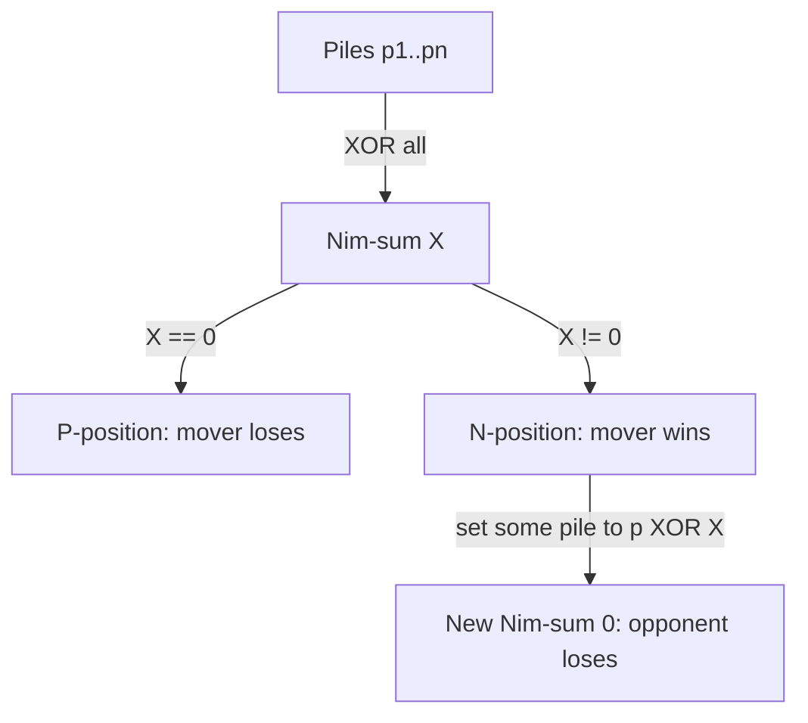

# Nim and Impartial Game Theory Basics — Junior Level

> **One-line summary:** In the game of Nim, players alternately remove stones from piles, and the player who takes the last stone wins. The whole game is decided by one number — the **Nim-sum**, the XOR (`^`) of all pile sizes. **Bouton's theorem** says the position is losing for the player about to move exactly when the Nim-sum is `0`. Otherwise the mover can win, and the winning move is the one that makes the Nim-sum `0`.

---

## Table of Contents

1. [Introduction](#introduction)
2. [Prerequisites](#prerequisites)
3. [Glossary](#glossary)
4. [Core Concepts](#core-concepts)
5. [Big-O Summary](#big-o-summary)
6. [Real-World Analogies](#real-world-analogies)
7. [Pros & Cons](#pros--cons)
8. [Step-by-Step Walkthrough](#step-by-step-walkthrough)
9. [Code Examples](#code-examples)
10. [Coding Patterns](#coding-patterns)
11. [Error Handling](#error-handling)
12. [Performance Tips](#performance-tips)
13. [Best Practices](#best-practices)
14. [Edge Cases & Pitfalls](#edge-cases--pitfalls)
15. [Common Mistakes](#common-mistakes)
16. [Cheat Sheet](#cheat-sheet)
17. [Visual Animation](#visual-animation)
18. [Summary](#summary)
19. [Further Reading](#further-reading)

---

## Introduction

Picture three piles of stones on a table: 3 stones, 4 stones, and 5 stones. Two players take turns. On your turn you pick **one** pile and remove **any positive number** of stones from it (one, several, or the whole pile). You must take at least one stone. The player who takes the very last stone **wins**. This is the game of **Nim**, and it is the single most important example in all of combinatorial game theory.

Most games feel like they need cleverness, intuition, or luck. Nim does not. It is completely *solved*: from any starting position, with perfect play, we can say in advance **who wins** and **exactly what move to make**. And the answer comes from one astonishingly simple computation:

> **Compute the XOR of all the pile sizes. Call it the Nim-sum.**
> **If the Nim-sum is `0`, the player about to move loses (with perfect play).**
> **If the Nim-sum is not `0`, the player about to move wins, and there is a move that makes the Nim-sum `0`.**

For piles `3, 4, 5` the Nim-sum is `3 ^ 4 ^ 5`. In binary: `011 ^ 100 ^ 101 = 010 = 2`. The Nim-sum is `2`, which is not `0`, so the player to move **wins**. We will see exactly which move achieves that.

This result is **Bouton's theorem** (Charles Bouton, 1901), and it is the gateway to a whole theory. Nim is the prototype of an **impartial game**: a game where both players have the *same* moves available from any position (unlike chess, where one player moves white pieces and the other black). The remarkable **Sprague-Grundy theorem** — covered in sibling topic `15-sprague-grundy` — says that *every* impartial game is, in a precise sense, "equivalent to a single Nim pile." So mastering Nim is mastering the engine behind a huge family of games: subtraction games, coin-turning games, graph games, and more.

In this junior file we focus on the concrete mechanics: how the game works, why XOR is the magic number, how to compute the winning move, and how to verify everything with small programs and by hand. We keep the proofs light here (the full proofs live in [`professional.md`](./professional.md)) and build rock-solid intuition first.

---

## Prerequisites

Before reading this file you should be comfortable with:

- **Bitwise XOR (`^`)** — the operation where `a ^ b` flips, bit by bit, the bits that differ. `5 ^ 3 = 6` because `101 ^ 011 = 110`. We will lean on this constantly.
- **Binary representation of integers** — reading a number like `13` as `1101` in base 2.
- **Basic arrays / lists** — the piles are just a list of non-negative integers.
- **Loops and conditionals** — every algorithm here is a loop over the piles.
- **The idea of "turns"** — two players alternate; we always reason from the perspective of the player *about to move*.

Optional but helpful:

- A glance at **recursion / dynamic programming**, since we will also compute win/loss by brute force for small games (and that connects to sibling topic `15-sprague-grundy`).
- Familiarity with the words **"optimal play"** — both players always make the best possible move.

You do **not** need any prior game theory. Nim is the starting point.

---

## Glossary

| Term | Meaning |
|------|---------|
| **Nim** | The game: piles of stones; a move removes ≥ 1 stone from exactly one pile; last stone taken wins (**normal play**). |
| **Pile** | One heap of stones; described by its current count (a non-negative integer). |
| **Position** | The full state of the game: the multiset of pile sizes, e.g. `(3, 4, 5)`. |
| **Move** | Choosing one pile and reducing it to any strictly smaller (≥ 0) value. |
| **Nim-sum** | The XOR of all pile sizes: `p₁ ^ p₂ ^ … ^ pₙ`. Also called the **XOR-sum**. |
| **Normal play** | The rule "the player who takes the **last** stone **wins**." Bouton's theorem is stated for normal play. |
| **Misère play** | The opposite rule: the player who takes the last stone **loses**. |
| **P-position** | A position that is **losing for the Previous-player-perspective mover** — i.e. losing for the player **about to move**. (Mnemonic: the *Previous* player, who just moved, is winning.) |
| **N-position** | A position that is winning for the player about to move (the **Next** player can force a win). |
| **Impartial game** | A game where both players have the same set of legal moves from any position (Nim is the prototype). |
| **Optimal play** | Both players always choose a move that leads to a win if one exists. |
| **Grundy number / mex** | A generalization (sibling `15-sprague-grundy`); for a single Nim pile of size `n`, its Grundy number is just `n`. |

---

## Core Concepts

### 1. The Game and the Goal

A Nim position is a list of pile sizes, e.g. `(3, 4, 5)`. Players alternate. A legal move picks one pile and lowers it by at least one stone (possibly emptying it). Under **normal play**, whoever removes the last stone — the one that brings the total to all-zero piles — wins. Equivalently: the player who faces the position `(0, 0, …, 0)` (all empty) on their turn **loses**, because they cannot move.

So the entire question is: *from the current position, can the player to move force a win?*

### 2. P-positions and N-positions

We classify every position as one of two types, and this classification is purely structural:

- A **P-position** is **losing for the player about to move** (the *Previous* player is winning). Example: `(0, 0, 0)` — you can't move, you lose. Also `(1, 1)` — whatever you take, your opponent takes the matching pile and wins.
- An **N-position** is **winning for the player about to move** (the *Next* player can force the win). Example: `(1)` — take the stone, you win. Also `(3, 4, 5)`.

There are exactly two defining rules, which we will see again in [`professional.md`](./professional.md):

1. **Every move from a P-position lands in an N-position.** (You can only hand your opponent a winning position.)
2. **From every N-position, there exists at least one move to a P-position.** (You can always hand your opponent a losing position.)

The terminal position `(0,0,…,0)` is a P-position (the mover has already lost). These two rules let us label *every* position by working backward from the terminal one.

### 3. The Nim-sum (XOR of pile sizes)

Define the **Nim-sum** of a position as the XOR of all its pile sizes:

```
nim_sum = p₁ ^ p₂ ^ … ^ pₙ
```

For `(3, 4, 5)`:

```
  3 = 011
  4 = 100
  5 = 101
  -------- XOR (a bit is 1 in the result iff an odd number of rows have a 1 there)
      010 = 2
```

The Nim-sum is `2`. XOR is "addition without carry," bit by bit: a result bit is `1` exactly when an **odd** number of piles have a `1` in that position.

### 4. Bouton's Theorem

This is the whole game in one sentence:

> **A Nim position is a P-position (losing for the mover) if and only if its Nim-sum is `0`.**

So:

- **Nim-sum `= 0`** → P-position → the player to move **loses** under perfect play.
- **Nim-sum `≠ 0`** → N-position → the player to move **wins** under perfect play.

For `(3, 4, 5)` the Nim-sum is `2 ≠ 0`, so the mover **wins**. For `(1, 1)` the Nim-sum is `1 ^ 1 = 0`, so the mover **loses** — which matches our hand analysis.

### 5. Finding the Winning Move

When the Nim-sum `X ≠ 0`, here is the move that wins. Let `b` be the position of the highest set bit of `X` (the most significant `1` in `X`). Find any pile `pᵢ` whose binary representation also has a `1` in bit `b`. Then change that pile to:

```
new value = pᵢ ^ X
```

Because `pᵢ` has a `1` where `X`'s top bit is, `pᵢ ^ X` is **strictly smaller** than `pᵢ` (that top bit turns off, and only lower bits can turn on), so it is a legal move. And it makes the new Nim-sum `0`, handing your opponent a P-position.

For `(3, 4, 5)`, `X = 2 = 010`. Its top set bit is bit 1. Which pile has bit 1 set? Pile `3 = 011` does (and so does `pile? 4=100` no, `5=101` no). So change pile `3` to `3 ^ 2 = 001 = 1`. New position `(1, 4, 5)`, Nim-sum `1 ^ 4 ^ 5 = 0`. You just handed your opponent a losing position.

### 6. Why It Works (Intuition)

Two facts make the proof go (full version in [`professional.md`](./professional.md)):

- **From Nim-sum `0`, *every* move makes it nonzero.** Changing one pile changes exactly one term of the XOR, and you cannot change a term without changing the XOR (XOR is "self-inverse": you can't alter one input and keep the output the same).
- **From Nim-sum `X ≠ 0`, *some* move makes it `0`.** The recipe above (`pᵢ → pᵢ ^ X`) always exists and is always a legal decrease.

So a player handed Nim-sum `0` is stuck giving the opponent Nim-sum `≠ 0`; the opponent restores it to `0`; eventually the `0`-Nim-sum player is forced to face `(0,0,…,0)` and lose. That is exactly the P/N rules of Concept 2, with "Nim-sum `= 0`" labeling the P-positions.

---

## Big-O Summary

| Operation | Time | Space | Notes |
|-----------|------|-------|-------|
| Compute the Nim-sum | **O(n)** | O(1) | `n` = number of piles; one XOR per pile. |
| Decide winner (who wins) | **O(n)** | O(1) | Compute Nim-sum; check `== 0`. |
| Find the winning move | **O(n)** | O(1) | One pass to find a pile with the top bit of `X`. |
| Brute-force win/loss (small game) | O(states · moves) | O(states) | Recursion + memo; only for tiny piles. |
| Grundy number of one pile | O(1) | O(1) | For standard Nim, it is just the pile size. |

The headline is that solving Nim is **`O(n)`** — *linear in the number of piles* — regardless of how big the piles are. There is no search, no DP for the standard game: just one XOR pass. The brute-force solver is only for *teaching/verification* and for *variant* games where the closed form is unknown.

---

## Real-World Analogies

| Concept | Analogy |
|---------|---------|
| A Nim position | Several jars of coins on a counter; a move empties some coins out of exactly one jar. |
| Nim-sum `= 0` | A perfectly "balanced" position — like a tug-of-war that is exactly even, where the next puller is doomed to break the balance. |
| The mover handed Nim-sum `0` | Being put in zugzwang in chess: any move you make worsens your position. |
| Restoring Nim-sum to `0` | A mirror strategy: whatever your opponent disturbs, you "rebalance" so the total XOR is `0` again. |
| Misère Nim (last stone loses) | The "old maid" or "loser's" variant — you want to *avoid* taking the final item. |
| Grundy number = pile size | A single jar's "value" is literally its coin count; complex games reduce to one equivalent jar (Sprague-Grundy). |

Where the analogy breaks: real tug-of-war and coin games have continuous or noisy outcomes; Nim is *perfect-information, deterministic, finite*. There is no luck and no hidden state — which is exactly why it can be solved completely.

---

## Pros & Cons

| Pros | Cons |
|------|------|
| The standard game is solved in **O(n)** by one XOR pass — no search. | Only applies cleanly to **impartial** games (both players, same moves). |
| Bouton's theorem gives both the winner *and* the explicit winning move. | The clean XOR rule is for **normal play**; misère and variants need extra care. |
| It is the building block of all impartial games (Sprague-Grundy, sibling `15`). | Beginners confuse "last stone wins" (normal) with "last stone loses" (misère). |
| Verifiable: a tiny brute-force solver confirms the theorem on small inputs. | Variants (limited take, Moore's Nimₖ) change the rule — XOR-of-sizes alone no longer decides them. |
| XOR is associative and commutative, so pile order never matters. | Easy to forget that a move must remove **at least one** stone (empty move is illegal). |

**When to use the XOR rule:** standard Nim, and any game you can prove reduces to Nim (via Sprague-Grundy). It instantly answers "who wins" and "what move."

**When NOT to use it directly:** misère play (use the misère theorem instead), partisan games (different moves per player — Nim theory does not apply), or unfamiliar variants where you must first *compute Grundy numbers* before any XOR makes sense.

---

## Step-by-Step Walkthrough

Let us fully analyze the position `(3, 4, 5)` from the moving player's seat.

**Step 1 — Compute the Nim-sum.**

```
  3 = 0 1 1
  4 = 1 0 0
  5 = 1 0 1
  ---------
XOR = 0 1 0   →  Nim-sum X = 2
```

Bit 2 (value 4): two ones (in 4 and 5) → even → result bit `0`.
Bit 1 (value 2): one one (in 3) → odd → result bit `1`.
Bit 0 (value 1): two ones (in 3 and 5) → even → result bit `0`.
So `X = 010₂ = 2`.

**Step 2 — Decide the winner.** `X = 2 ≠ 0`, so this is an **N-position**: the player to move **wins** with perfect play.

**Step 3 — Find the winning move.** The highest set bit of `X = 2` is bit 1. We need a pile with bit 1 set:

- `3 = 011` → bit 1 is set. ✓
- `4 = 100` → bit 1 is `0`.
- `5 = 101` → bit 1 is `0`.

So target the pile `3`. Replace it with `3 ^ X = 3 ^ 2 = 011 ^ 010 = 001 = 1`. That removes `3 - 1 = 2` stones (legal: a positive decrease).

**Step 4 — Verify the new position is a P-position.** New piles `(1, 4, 5)`:

```
  1 = 001
  4 = 100
  5 = 101
  -------
XOR = 000  →  Nim-sum 0  ✓
```

We handed the opponent Nim-sum `0` — a losing position.

**Step 5 — Play it out (opponent is now stuck).** Suppose the opponent takes all of pile `4`, reaching `(1, 0, 5)`, Nim-sum `1 ^ 5 = 4 ≠ 0`. We respond by setting pile `5 → 5 ^ 4 = 1`, reaching `(1, 0, 1)`, Nim-sum `0`. Now the opponent must break a `0` again: from `(1,0,1)` they take one pile to `0`, say `(0,0,1)`, Nim-sum `1`. We take the last stone, reaching `(0,0,0)`, and **we took the last stone — we win.**

The pattern is mechanical: *whenever it is our turn the Nim-sum is `≠ 0`, we restore it to `0`; the opponent is forced to disturb it again; the descent ends with us taking the final stone.*

---

## Code Examples

### Example: Decide the Winner and Print the Winning Move

This computes the Nim-sum, declares the winner, and — if the mover wins — prints one winning move.

#### Go

```go
package main

import "fmt"

// nimSum returns the XOR of all pile sizes.
func nimSum(piles []int) int {
	x := 0
	for _, p := range piles {
		x ^= p
	}
	return x
}

// firstPlayerWins reports whether the player to move wins (normal play).
func firstPlayerWins(piles []int) bool {
	return nimSum(piles) != 0
}

// winningMove returns (pileIndex, newValue) for a move that makes the
// Nim-sum 0. It assumes the position is winning (nimSum != 0).
func winningMove(piles []int) (int, int) {
	x := nimSum(piles)
	for i, p := range piles {
		target := p ^ x
		if target < p { // a legal decrease
			return i, target
		}
	}
	return -1, -1 // unreachable when x != 0
}

func main() {
	piles := []int{3, 4, 5}
	x := nimSum(piles)
	fmt.Printf("Nim-sum = %d\n", x) // 2
	if firstPlayerWins(piles) {
		i, v := winningMove(piles)
		fmt.Printf("First player WINS. Move: set pile %d (=%d) to %d.\n", i, piles[i], v)
	} else {
		fmt.Println("First player LOSES (Nim-sum is 0).")
	}
}
```

#### Java

```java
public class Nim {
    static int nimSum(int[] piles) {
        int x = 0;
        for (int p : piles) x ^= p;
        return x;
    }

    static boolean firstPlayerWins(int[] piles) {
        return nimSum(piles) != 0;
    }

    // Returns {pileIndex, newValue}; assumes the position is winning.
    static int[] winningMove(int[] piles) {
        int x = nimSum(piles);
        for (int i = 0; i < piles.length; i++) {
            int target = piles[i] ^ x;
            if (target < piles[i]) return new int[]{i, target};
        }
        return new int[]{-1, -1}; // unreachable when x != 0
    }

    public static void main(String[] args) {
        int[] piles = {3, 4, 5};
        int x = nimSum(piles);
        System.out.println("Nim-sum = " + x); // 2
        if (firstPlayerWins(piles)) {
            int[] mv = winningMove(piles);
            System.out.printf("First player WINS. Move: set pile %d (=%d) to %d.%n",
                    mv[0], piles[mv[0]], mv[1]);
        } else {
            System.out.println("First player LOSES (Nim-sum is 0).");
        }
    }
}
```

#### Python

```python
from functools import reduce
from operator import xor


def nim_sum(piles):
    return reduce(xor, piles, 0)


def first_player_wins(piles):
    return nim_sum(piles) != 0


def winning_move(piles):
    """Return (pile_index, new_value) making the Nim-sum 0.
    Assumes the position is winning (nim_sum != 0)."""
    x = nim_sum(piles)
    for i, p in enumerate(piles):
        target = p ^ x
        if target < p:            # a legal decrease
            return i, target
    return -1, -1                 # unreachable when x != 0


if __name__ == "__main__":
    piles = [3, 4, 5]
    x = nim_sum(piles)
    print(f"Nim-sum = {x}")  # 2
    if first_player_wins(piles):
        i, v = winning_move(piles)
        print(f"First player WINS. Move: set pile {i} (={piles[i]}) to {v}.")
    else:
        print("First player LOSES (Nim-sum is 0).")
```

**What it does:** builds `(3, 4, 5)`, computes Nim-sum `2`, declares the first player the winner, and prints the move "set pile 0 (=3) to 1" — exactly the move from the walkthrough.
**Run:** `go run main.go` | `javac Nim.java && java Nim` | `python nim.py`

---

## Coding Patterns

### Pattern 1: Brute-Force Win/Loss Solver (the oracle you test against)

**Intent:** Before trusting Bouton's theorem (or when exploring a *variant*), decide win/loss the slow, obvious way by recursion + memoization, and check it agrees with the XOR rule on small inputs.

```python
from functools import lru_cache


def solve(piles):
    """Return True if the player to move wins (normal play), by brute force."""
    # Canonicalize: order does not matter, so sort to share memo entries.
    @lru_cache(maxsize=None)
    def win(state):
        # state is a sorted tuple of pile sizes
        if all(p == 0 for p in state):
            return False  # no move: the mover loses
        for i, p in enumerate(state):
            for take in range(1, p + 1):
                nxt = list(state)
                nxt[i] = p - take
                child = tuple(sorted(nxt))
                if not win(child):   # opponent ends up losing -> we win
                    return True
        return False
    return win(tuple(sorted(piles)))
```

This is exponential in the pile sizes, so it is only for tiny inputs. But it is the ground truth: `solve(piles) == (nim_sum(piles) != 0)` must hold for every small position. This is exactly the verification used at senior level.

### Pattern 2: Highest-Bit Targeting for the Winning Move

**Intent:** The move that zeroes the Nim-sum always targets a pile that shares the **top set bit** of `X`. Computing `p ^ X < p` is the clean test for "this pile works."

```python
def winning_move(piles):
    x = 0
    for p in piles:
        x ^= p
    if x == 0:
        return None              # losing position: no winning move
    for i, p in enumerate(piles):
        if (p ^ x) < p:          # equivalent to "p has X's top bit set"
            return i, p ^ x
```

### Pattern 3: Pile-Order Independence

**Intent:** XOR is commutative and associative, so the answer never depends on pile order. You may sort piles freely (handy for memoization keys), and combining sub-games is just XOR-ing their values.



---

## Error Handling

| Error | Cause | Fix |
|-------|-------|-----|
| Says "loses" when it should win | Computed `sum` (addition) instead of XOR. | The Nim-sum is **XOR**, not arithmetic sum. |
| Winning move increases a pile | Used `p ^ X` without checking `< p`. | Only accept the move when `p ^ X < p` (a legal decrease). |
| Crash / wrong answer for empty input | No piles, or all piles `0`. | Nim-sum is `0` → P-position; mover loses (cannot move). |
| Misère answer wrong | Applied the normal-play XOR rule to misère. | Use the misère rule (see [`middle.md`](./middle.md)). |
| Treats a move of `0` stones as legal | Allowed reducing a pile to itself. | A move must remove **≥ 1** stone (strict decrease). |
| Negative pile produced | Took more stones than the pile holds. | A pile can only go down to `0`, never below. |

---

## Performance Tips

- **Just XOR — do not search.** For standard Nim the answer is one `O(n)` XOR pass. Never run a game-tree search when Bouton's theorem applies.
- **Sort only when memoizing.** Pile order is irrelevant to the result, but sorting gives a canonical key for the brute-force memo, collapsing equivalent states.
- **Use native integer XOR.** It is a single CPU instruction; no need for bit-by-bit loops.
- **Cap the brute-force solver.** Limit it to small piles/few piles; it is exponential and is only a teaching/verification oracle.
- **Precompute the top-bit lookup** if you find many winning moves repeatedly; but for one query a single pass over the piles is already optimal.

---

## Best Practices

- Always state up front whether you are in **normal** play (last stone wins) or **misère** play (last stone loses); they have different rules.
- Compute the Nim-sum once and reuse it for both the decision and the move.
- Verify against the brute-force oracle (Pattern 1) on random small positions before trusting any closed-form rule, *especially* for variants.
- Test the legality of any move you output: it must strictly decrease exactly one pile.
- Remember pile order does not matter — do not write code that depends on it.
- For variant games (limited take, multi-pile take), do **not** assume the plain XOR-of-sizes rule; first reduce to Grundy numbers (sibling `15-sprague-grundy`).

---

## Edge Cases & Pitfalls

- **All piles empty `(0,0,…,0)`** — Nim-sum `0`, P-position; the mover cannot move and loses. This is the terminal position.
- **Single pile `(n)` with `n ≥ 1`** — Nim-sum `n ≠ 0`, N-position; the mover takes the whole pile and wins.
- **Two equal piles `(a, a)`** — Nim-sum `0`, P-position; the mover loses (mirror strategy beats them).
- **One pile is `0`** — a `0` pile contributes `0` to the XOR and has no legal move; it is just ignored.
- **Huge pile sizes** — XOR works on the integers directly; the algorithm is still `O(n)` regardless of magnitude.
- **Misère with all piles `= 1`** — special case: the normal rule flips (see [`middle.md`](./middle.md)); the parity of the number of piles decides it.
- **Confusing "wins" with "moves first"** — moving first does **not** guarantee a win; it depends entirely on the Nim-sum.

---

## Common Mistakes

1. **Adding instead of XOR-ing** — using `p₁ + p₂ + …` rather than `p₁ ^ p₂ ^ …`. The Nim-sum is XOR.
2. **Increasing a pile in the "winning move"** — outputting `p ^ X` when `p ^ X > p`; that pile is the wrong target. Always require `p ^ X < p`.
3. **Applying the normal-play rule to misère** — misère Nim has its own rule; the XOR-of-sizes test alone is wrong there.
4. **Assuming the first player always wins** — false; if the starting Nim-sum is `0`, the first player loses.
5. **Forgetting a move must take ≥ 1 stone** — a "pass" is illegal in Nim.
6. **Letting pile order matter** — XOR is commutative; any code sensitive to order is buggy.
7. **Using XOR-of-sizes on a *variant* game** — limited-take or multi-pile-take games are *not* solved by XOR-of-sizes; you must compute Grundy numbers first.

---

## Cheat Sheet

| Question | Tool | Formula |
|----------|------|---------|
| Who wins (normal play)? | Nim-sum | `X = p₁ ^ … ^ pₙ`; mover wins iff `X ≠ 0` |
| Is this a P-position (mover loses)? | Nim-sum | `X == 0` |
| What is the winning move? | XOR trick | pick pile with `p ^ X < p`; set it to `p ^ X` |
| Does pile order matter? | XOR property | No — XOR is commutative & associative |
| Single pile `(n)`? | direct | mover wins iff `n ≠ 0` (take all) |
| Two equal piles? | mirror | Nim-sum `0` → mover loses |
| Grundy of one Nim pile of size `n`? | identity | `g(n) = n` (sibling `15`) |
| Misère play? | special rule | see [`middle.md`](./middle.md) |

Core algorithm:

```
solveNim(piles):
    X = 0
    for p in piles: X ^= p          # Nim-sum, O(n)
    if X == 0: return "mover LOSES"  # P-position
    for i, p in piles:
        if (p ^ X) < p:             # legal decreasing move
            return "mover WINS; set pile i to p^X"
```

---

## Visual Animation

> See [`animation.html`](./animation.html) for an interactive visualization.
>
> The animation demonstrates:
> - Piles drawn as vertical stacks of stones
> - The running Nim-sum shown in **binary**, bit by bit, as each pile is XOR-ed in
> - The highlighted **winning move** that zeroes the Nim-sum (and why `p ^ X < p`)
> - Step / Play / Pause / Reset controls to walk a full game, alternating optimal moves until the last stone is taken

---

## Summary

Nim is the game where players alternately remove stones from piles and the one who takes the last stone wins. Its complete solution is **Bouton's theorem**: compute the **Nim-sum** (XOR of all pile sizes); the position is **losing for the mover (a P-position) exactly when the Nim-sum is `0`**, and **winning (an N-position) otherwise**. When the mover wins, the move that secures it changes some pile `pᵢ` (one sharing the top set bit of the Nim-sum `X`) to `pᵢ ^ X`, which is a legal decrease and makes the new Nim-sum `0`. From there the winner simply *re-zeroes* the Nim-sum on every turn, forcing the opponent to face the empty position. Everything runs in `O(n)`, order-independent, with no search. Nim is more than a puzzle: by the Sprague-Grundy theorem (sibling `15-sprague-grundy`) it is the universal model for *all* impartial games. Master the XOR rule and the winning-move recipe here, and you hold the key to that whole theory.

---

## Further Reading

- C. L. Bouton, "Nim, a game with a complete mathematical theory" (1901) — the original paper.
- *Winning Ways for Your Mathematical Plays* (Berlekamp, Conway, Guy) — the bible of combinatorial game theory.
- *Lessons in Play* (Albert, Nowakowski, Wolfe) — a gentle modern introduction.
- Sibling topic `15-sprague-grundy` — how *every* impartial game reduces to a Nim pile via Grundy numbers and `mex`.
- cp-algorithms.com — "Games on arbitrary graphs" and "Sprague-Grundy theorem / Nim."
- *Introduction to Algorithms* (CLRS) — bitwise operations and recursion/memoization background.
