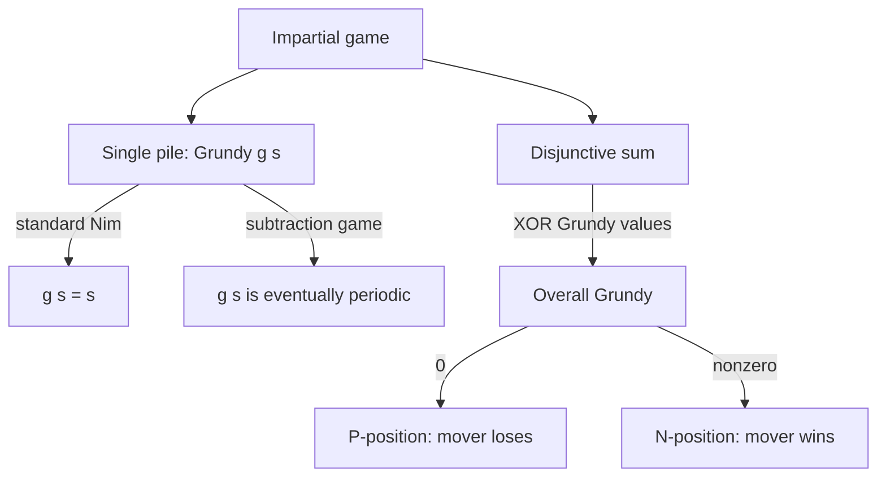
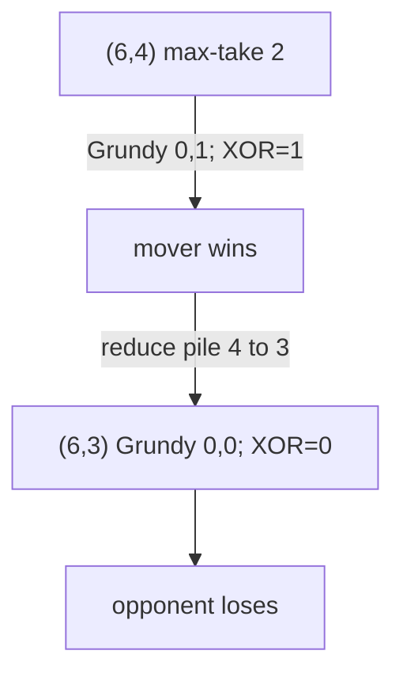

# Nim and Impartial Game Theory Basics — Middle Level

> **Focus:** How to *derive* the winning Nim move from the Nim-sum, the exact rule for **misère** Nim, the family of **subtraction games** (Nim with a bounded take) and how their Grundy numbers become periodic, **Moore's Nimₖ** generalization, building **DP win/loss tables**, and the pointer to Grundy numbers / `mex` that unifies all of it (sibling `15-sprague-grundy`).

---

## Table of Contents

1. [Introduction](#introduction)
2. [Deeper Concepts](#deeper-concepts)
3. [Comparison with Alternatives](#comparison-with-alternatives)
4. [Advanced Patterns](#advanced-patterns)
5. [Misère Nim](#misère-nim)
6. [Subtraction Games and Moore's Nimₖ](#subtraction-games-and-moores-nimk)
7. [Code Examples](#code-examples)
8. [Error Handling](#error-handling)
9. [Performance Analysis](#performance-analysis)
10. [Best Practices](#best-practices)
11. [Visual Animation](#visual-animation)
12. [Summary](#summary)

---

## Introduction

At junior level the message was a single fact: *the mover loses iff the Nim-sum (XOR of pile sizes) is `0`*. At middle level we move from "I can state Bouton's theorem" to "I can derive the move, recognize Nim-like structure in disguised games, and adapt when the rules change." The questions that separate the two levels:

- Given a winning Nim position, **how do I systematically construct the move** that zeroes the Nim-sum — and why does such a move always exist?
- What changes under **misère play** (last stone *loses*), and why does the rule almost — but not quite — match normal play?
- When a move can take **at most `m` stones** (a *subtraction game*), the plain XOR-of-sizes rule fails. What replaces it? (Answer: Grundy numbers, which turn out to be **periodic**.)
- **Moore's Nimₖ** lets a player take from up to `k` piles at once. The losing condition generalizes from "XOR `= 0`" to a base-`(k+1)` digit condition.
- How do I build a **DP win/loss table** for an arbitrary small game, and how does that table reveal the Grundy structure that sibling `15-sprague-grundy` makes precise?

These are the tools that let you walk into an unfamiliar impartial game and *figure out* its theory rather than recall it.

---

## Deeper Concepts

### Deriving the winning move (Bouton's strategy)

Suppose the Nim-sum is `X = p₁ ^ p₂ ^ … ^ pₙ ≠ 0`. We claim there is always a legal move to a position with Nim-sum `0`, and here is the construction:

1. Let `b` be the index of the **highest set bit** of `X`.
2. Because `X` has a `1` in bit `b`, an **odd** number of piles have a `1` in bit `b`; in particular **at least one** pile `pᵢ` does.
3. Set that pile to `pᵢ' = pᵢ ^ X`.

Why this is a legal decrease: `pᵢ` has bit `b` set, and `X` has its **highest** set bit at `b`. XOR-ing turns bit `b` of `pᵢ` from `1` to `0`, while every bit above `b` is unchanged (both `pᵢ` and `X` have `0` there beyond `b` for `X`). So the most significant bit where `pᵢ'` and `pᵢ` differ goes `1 → 0`, which makes `pᵢ' < pᵢ`. A strict decrease is a legal move.

Why the new Nim-sum is `0`: replacing `pᵢ` by `pᵢ ^ X` changes the total XOR from `X` to `X ^ pᵢ ^ (pᵢ ^ X) = X ^ X = 0`. The whole thing telescopes.

This is the *constructive* half of Bouton's theorem; [`professional.md`](./professional.md) proves both directions formally.

### Why XOR is the right "addition" of games

XOR is the **Nim-sum** because of how independent games combine. If you play several Nim piles "in parallel" (a move is one move in one pile), the combined game's value is the XOR of the individual pile values. This is the *disjunctive sum* of games, and a single Nim pile of size `n` has **Grundy value `n`**. So the Nim-sum is literally the Grundy value of the whole disjunctive sum. This is the conceptual bridge to sibling `15-sprague-grundy`: every impartial game position has a Grundy number, single Nim piles have Grundy number equal to their size, and **disjunctive sums XOR their Grundy numbers**. Bouton's theorem is the special case where every component is already a Nim pile.

### P-positions and N-positions, formally restated

- **P-position** (mover loses): all moves lead to N-positions. Equivalently Grundy value `0`.
- **N-position** (mover wins): at least one move leads to a P-position. Equivalently Grundy value `≠ 0`.

For standard Nim, "Grundy value `0`" coincides exactly with "Nim-sum `0`". For variants the Grundy value is *not* simply the pile size, which is why XOR-of-sizes stops working and you must compute Grundy numbers first.

---

## Comparison with Alternatives

### XOR rule vs brute-force game solver

| Approach | Decide standard Nim | Decide a variant | Good when |
|----------|--------------------|------------------|-----------|
| **Bouton XOR rule** | `O(n)` | does **not** apply | standard normal-play Nim |
| **Misère rule** | `O(n)` | does **not** apply | misère **standard** Nim only |
| **Grundy + XOR** | `O(n)` (Grundy = size) | `O(states · moves)` to build, then `O(n)` to combine | any impartial game reducible to subgames |
| **Brute-force memoized solver** | exponential | exponential | tiny inputs; the verification oracle |

The XOR rule is unbeatable when it applies, but the moment the move set changes (limited take, multi-pile take, take-and-split), you fall back to computing Grundy numbers and only *then* XOR them.

### Win/loss DP vs Grundy DP

| You compute | Tells you | Cost | Combine subgames? |
|-------------|-----------|------|-------------------|
| Win/loss boolean per state | who wins a single game | `O(states · moves)` | **No** — booleans do not XOR meaningfully |
| Grundy number per state | the game's Nim-value | `O(states · moves)` | **Yes** — XOR the Grundy numbers |

Crucial subtlety: a *win/loss* table for one pile does **not** let you combine piles. To analyze a *sum* of games you need **Grundy numbers**, then XOR them. This is the single most common middle-level mistake, and the reason sibling `15-sprague-grundy` exists.

---

## Advanced Patterns

### Pattern: Construct the winning move from the Nim-sum

```python
def winning_move(piles):
    x = 0
    for p in piles:
        x ^= p
    if x == 0:
        return None                  # P-position: no winning move exists
    for i, p in enumerate(piles):
        target = p ^ x
        if target < p:               # bit b of p is set; legal decrease
            return (i, p - target, target)  # (pile, stones removed, new value)
    return None                      # unreachable when x != 0
```

### Pattern: Win/loss DP for a single-pile game

For a one-pile game where the legal moves from size `s` are some set `moves(s)` of new sizes, win/loss is a straightforward DP:

```python
def build_winloss(max_size, moves):
    win = [False] * (max_size + 1)   # win[s] = mover wins with a pile of size s
    for s in range(1, max_size + 1):
        win[s] = any(not win[t] for t in moves(s))  # move to a losing state
    return win
```

`win[s]` is `True` iff some move leads to a `False` (losing-for-opponent) state. This is exactly the P/N recurrence.

### Pattern: Grundy DP via mex (the bridge to sibling 15)

```python
def mex(s):
    """Minimum EXcludant: smallest non-negative integer not in set s."""
    m = 0
    while m in s:
        m += 1
    return m


def build_grundy(max_size, moves):
    g = [0] * (max_size + 1)
    for s in range(1, max_size + 1):
        reachable = {g[t] for t in moves(s)}
        g[s] = mex(reachable)
    return g
```

For standard Nim where `moves(s) = {0, 1, …, s-1}`, this yields `g[s] = s` — confirming the Grundy value of a Nim pile is its size. The full treatment of `mex` and Grundy numbers is sibling `15-sprague-grundy`.



---

## Misère Nim

**Misère play** flips the winning condition: the player who takes the **last stone loses**. Remarkably, the strategy is *almost* identical to normal play, with one special case.

**Misère Nim theorem.** Consider the piles. Call a pile "large" if it has `≥ 2` stones.

- **If at least one pile has `≥ 2` stones:** play exactly as in normal Nim. The mover wins iff the Nim-sum is `≠ 0`. (Same XOR rule.)
- **If every pile has `≤ 1` stone** (so the position is some number of 1-piles and some 0-piles): the mover **wins iff the number of nonzero (i.e., size-1) piles is *even***. (The opposite of the normal-play parity.)

Intuition: as long as a big pile exists, a player can always steer the game so that, when piles finally collapse to all-`1`s, the parity lands in their favor — they delay the "switch" to the all-ones endgame and choose its parity. Once only `1`s remain, the game is forced: players alternately take single stones, and you simply count whether the last stone falls to you or your opponent. Under misère you *want* your opponent to take the last one, so you want an **even** count of `1`-piles facing you.

Concretely:

- `(1, 1, 1)` misère, all piles `≤ 1`, three `1`s (odd) → mover **loses** the misère count… wait, three is odd, so the mover **wins** is false; the mover *loses*? Let's be precise: mover wins iff the number of 1-piles is *even*. Three is odd → mover **loses**. Check: from `(1,1,1)` mover takes one to `(1,1)`, opponent takes one to `(1)`, mover is forced to take the last stone and **loses**. ✓
- `(1, 1)` misère, two `1`s (even) → mover **wins**: mover takes one to `(1)`, opponent forced to take the last stone and loses. ✓

So misère Nim is "normal Nim until you reach the all-ones endgame, then flip the parity." See [`professional.md`](./professional.md) for the proof that this single special case is correct and complete.

### Misère decision code

```python
def misere_nim_first_player_wins(piles):
    nonempty = [p for p in piles if p > 0]
    if all(p == 1 for p in nonempty):       # endgame: only 1-piles remain
        return len(nonempty) % 2 == 0        # win iff EVEN count of 1-piles
    # otherwise: a pile >= 2 exists -> normal-play XOR rule
    x = 0
    for p in piles:
        x ^= p
    return x != 0
```

---

## Subtraction Games and Moore's Nimₖ

### Subtraction games (Nim with a bounded take)

A **subtraction game** restricts how many stones a move may remove. The classic case: from a pile you may remove `1` up to `m` stones (a "max-take = `m`" game). The plain XOR-of-sizes rule **does not** decide this — the move set changed, so the Grundy value of a pile is no longer its size.

For a single pile under "remove `1..m`," the Grundy number is **periodic**:

```
g(s) = s mod (m + 1)
```

So `g(s) = 0` exactly when `s` is a multiple of `m + 1`. For one pile, the mover loses iff `s ≡ 0 (mod m+1)` (it is a P-position). For several such piles, XOR the per-pile Grundy values `g(pᵢ) = pᵢ mod (m+1)`; the mover loses iff that XOR is `0`.

More generally, a subtraction game with allowed-take **set** `S` (e.g. `S = {1, 3, 4}`) has a Grundy sequence `g(0), g(1), g(2), …` that is **eventually periodic** (a finite subtraction set forces periodicity). You compute it by the `mex` DP above, detect the period, and then XOR per-pile Grundy values.

| Game | Move | Single-pile Grundy `g(s)` | P-position (single pile) |
|------|------|---------------------------|--------------------------|
| Standard Nim | remove any `≥ 1` | `g(s) = s` | `s = 0` |
| Max-take `m` | remove `1..m` | `g(s) = s mod (m+1)` | `s ≡ 0 (mod m+1)` |
| Subtraction set `S` | remove `t ∈ S` | eventually periodic (compute by mex) | `g(s) = 0` |

### Moore's Nimₖ

**Moore's Nimₖ** generalizes Nim: on a turn a player may remove stones from **up to `k` piles at once** (at least one). Standard Nim is `k = 1`. Moore's theorem generalizes the losing condition from "binary XOR `= 0`" to a condition on **base-2 digit sums modulo `k+1`**:

> Write each pile size in binary. For **each bit position**, sum the number of piles having a `1` in that position. The position is a **P-position (mover loses) iff every one of these per-bit sums is divisible by `(k+1)`.**

For `k = 1` this is exactly "each bit's count is even," i.e. the binary XOR is `0` — recovering Bouton. For `k = 2`, every per-bit count must be `≡ 0 (mod 3)`, and so on. The winning move adjusts up to `k` piles to restore all per-bit sums to multiples of `k + 1`. The proof (a P/N induction on this digit condition) is in [`professional.md`](./professional.md).

```python
def moore_nim_first_player_wins(piles, k):
    """Moore's Nim_k: remove from up to k piles per move. Mover loses iff
    every bit-column count is divisible by (k+1)."""
    bits = max(p.bit_length() for p in piles) if any(piles) else 1
    for b in range(bits):
        col = sum((p >> b) & 1 for p in piles)
        if col % (k + 1) != 0:
            return True          # some column not divisible -> N-position -> win
    return False                 # all columns divisible -> P-position -> lose
```

---

## Code Examples

### Reusable engine: Grundy table + disjunctive-sum decision

This is the general machinery: compute single-pile Grundy values by `mex`, then XOR them across piles. It works for standard Nim, max-take, and arbitrary finite subtraction sets — the move set is the only thing that changes.

#### Python

```python
def mex(reachable):
    m = 0
    while m in reachable:
        m += 1
    return m


def grundy_table(max_size, take_set=None):
    """take_set=None means standard Nim (remove any >=1).
    Otherwise remove t stones for each t in take_set."""
    g = [0] * (max_size + 1)
    for s in range(1, max_size + 1):
        if take_set is None:
            reachable = {g[t] for t in range(s)}        # any decrease
        else:
            reachable = {g[s - t] for t in take_set if t <= s}
        g[s] = mex(reachable)
    return g


def first_player_wins(piles, take_set=None):
    if not piles:
        return False
    g = grundy_table(max(piles), take_set)
    x = 0
    for p in piles:
        x ^= g[p]
    return x != 0


if __name__ == "__main__":
    # Standard Nim: Grundy of pile = pile size.
    print(first_player_wins([3, 4, 5]))            # True (Nim-sum 2)
    print(first_player_wins([1, 1]))               # False (Nim-sum 0)
    # Max-take 3 (remove 1..3): single-pile Grundy = s mod 4.
    print(first_player_wins([4, 8], take_set={1, 2, 3}))   # 4%4 ^ 8%4 = 0 -> False
    print(first_player_wins([5, 8], take_set={1, 2, 3}))   # 1 ^ 0 = 1 -> True
```

#### Go

```go
package main

import "fmt"

func mex(reachable map[int]bool) int {
	m := 0
	for reachable[m] {
		m++
	}
	return m
}

// grundyTable: takeSet nil => standard Nim; else remove t in takeSet.
func grundyTable(maxSize int, takeSet map[int]bool) []int {
	g := make([]int, maxSize+1)
	for s := 1; s <= maxSize; s++ {
		reachable := map[int]bool{}
		if takeSet == nil {
			for t := 0; t < s; t++ {
				reachable[g[t]] = true
			}
		} else {
			for t := range takeSet {
				if t <= s {
					reachable[g[s-t]] = true
				}
			}
		}
		g[s] = mex(reachable)
	}
	return g
}

func firstPlayerWins(piles []int, takeSet map[int]bool) bool {
	if len(piles) == 0 {
		return false
	}
	mx := 0
	for _, p := range piles {
		if p > mx {
			mx = p
		}
	}
	g := grundyTable(mx, takeSet)
	x := 0
	for _, p := range piles {
		x ^= g[p]
	}
	return x != 0
}

func main() {
	fmt.Println(firstPlayerWins([]int{3, 4, 5}, nil)) // true
	fmt.Println(firstPlayerWins([]int{1, 1}, nil))    // false
	take := map[int]bool{1: true, 2: true, 3: true}
	fmt.Println(firstPlayerWins([]int{4, 8}, take)) // false
	fmt.Println(firstPlayerWins([]int{5, 8}, take)) // true
}
```

#### Java

```java
import java.util.*;

public class NimEngine {
    static int mex(Set<Integer> reachable) {
        int m = 0;
        while (reachable.contains(m)) m++;
        return m;
    }

    // takeSet == null => standard Nim; else remove t in takeSet.
    static int[] grundyTable(int maxSize, Set<Integer> takeSet) {
        int[] g = new int[maxSize + 1];
        for (int s = 1; s <= maxSize; s++) {
            Set<Integer> reachable = new HashSet<>();
            if (takeSet == null) {
                for (int t = 0; t < s; t++) reachable.add(g[t]);
            } else {
                for (int t : takeSet) if (t <= s) reachable.add(g[s - t]);
            }
            g[s] = mex(reachable);
        }
        return g;
    }

    static boolean firstPlayerWins(int[] piles, Set<Integer> takeSet) {
        if (piles.length == 0) return false;
        int mx = 0;
        for (int p : piles) mx = Math.max(mx, p);
        int[] g = grundyTable(mx, takeSet);
        int x = 0;
        for (int p : piles) x ^= g[p];
        return x != 0;
    }

    public static void main(String[] args) {
        System.out.println(firstPlayerWins(new int[]{3, 4, 5}, null)); // true
        System.out.println(firstPlayerWins(new int[]{1, 1}, null));    // false
        Set<Integer> take = new HashSet<>(Arrays.asList(1, 2, 3));
        System.out.println(firstPlayerWins(new int[]{4, 8}, take)); // false
        System.out.println(firstPlayerWins(new int[]{5, 8}, take)); // true
    }
}
```

---

## Error Handling

| Scenario | What goes wrong | Correct approach |
|----------|-----------------|------------------|
| XOR-of-sizes on a subtraction game | Wrong winner; move set is restricted. | Compute Grundy `g(s)` first, then XOR `g(pᵢ)`. |
| Misère handled with normal rule | Wrong winner in the all-ones endgame. | Special-case "all piles ≤ 1" → win iff count of 1-piles is even. |
| Combining win/loss booleans across piles | Booleans do not XOR meaningfully. | Use Grundy numbers, then XOR them. |
| `mex` over a list with duplicates slow | Repeated membership scans. | Use a set / boolean array for `mex`. |
| Moore's Nim with binary XOR | Only correct for `k = 1`. | Use base-`(k+1)` per-bit-column divisibility. |
| Period not detected for subtraction set | Table too short to see the cycle. | Extend the table to at least `2·(max take)` and detect repetition. |
| Empty / all-zero piles | Edge of the recurrence. | Nim-sum / Grundy XOR is `0` → P-position. |

---

## Performance Analysis

| Task | Cost | Notes |
|------|------|-------|
| Standard Nim decision | `O(n)` | one XOR pass |
| Winning move | `O(n)` | one pass to find the target pile |
| Grundy table, subtraction set `S` | `O(maxSize · |S|)` | per state, scan the take set |
| Grundy table, standard Nim | `O(maxSize²)` naive (but `g(s)=s` analytically) | use the closed form `g(s)=s` |
| Moore's Nimₖ decision | `O(n · bits)` | per-bit-column sums |
| Brute-force solver | exponential in pile sizes | verification oracle only |

The key performance lesson: **for standard or max-take games, use the closed form** (`g(s)=s` or `g(s)=s mod (m+1)`) — do not build a table. Build the table only for arbitrary subtraction sets, and even then exploit **periodicity**: once you detect the period `π`, `g(s) = g(s mod-pattern)` for large `s`, so you never need a table sized to the actual (possibly huge) pile values.

```python
def detect_period(seq, min_len=2):
    n = len(seq)
    for p in range(1, n // 2 + 1):
        if all(seq[i] == seq[i + p] for i in range(n - p)):
            return p
    return None
# Build a generous prefix of the Grundy sequence, detect the period,
# then evaluate g(huge_pile) via the periodic pattern in O(1).
```

---

## Worked Examples

### Example A — Deriving the move on `(6, 9, 12)`

Compute the Nim-sum:

```
   6 = 0110
   9 = 1001
  12 = 1100
  ----------
 XOR = 0011  →  X = 3
```

`X = 3 ≠ 0`, so the mover wins. The highest set bit of `X = 0011` is bit 1 (value 2). Which piles have bit 1 set?

- `6 = 0110` → bit 1 is `1`. ✓
- `9 = 1001` → bit 1 is `0`.
- `12 = 1100` → bit 1 is `0`.

Only pile `6` qualifies. Set it to `6 ^ 3 = 0110 ^ 0011 = 0101 = 5`. New position `(5, 9, 12)`:

```
   5 = 0101
   9 = 1001
  12 = 1100
  ----------
 XOR = 0000  →  X = 0  ✓
```

We removed `6 - 5 = 1` stone and handed the opponent a P-position. Note there was exactly **one** winning move here (one pile shared the top bit), illustrating Proposition 5.2 from [`professional.md`](./professional.md): the count of winning piles is odd, hence at least one.

### Example B — Max-take 2 on a single pile of 6

Allowed takes: `{1, 2}`. The Grundy values are `g(s) = s mod 3`:

```
 s:    0 1 2 3 4 5 6
 g(s): 0 1 2 0 1 2 0
```

`g(6) = 0`, so a single pile of 6 is a **P-position** under max-take 2 — the mover loses. Verify by hand: from 6 the mover reaches 5 or 4 (both N-positions, `g = 2, 1`); the opponent then restores a multiple of 3, and the descent `6 → 3 → 0` (each a P-position for the mover) ends with the mover unable to reach 0 first. The XOR-of-sizes rule would wrongly say "6 ≠ 0, mover wins" — the move-set restriction flips the verdict.

### Example C — Combining two subtraction-game piles

Piles `(6, 4)` under max-take 2. Grundy values: `g(6) = 0`, `g(4) = 1`. XOR: `0 ^ 1 = 1 ≠ 0`, so the mover wins. The winning move is on the pile whose Grundy value carries the difference: reduce pile `4` so its Grundy value becomes `0`, i.e. to a multiple of 3 — take 1 stone, reaching `(6, 3)` with Grundy XOR `0 ^ 0 = 0`. This is exactly Nim played on the *Grundy values* rather than the raw sizes.



---

## Why Each Variant Needs Its Own Rule

It is worth seeing, side by side, *why* the four rules differ — they all come from the same P/N machinery, but the move set changes what a "pile value" means.

| Variant | Move | What a pile is worth | Decision |
|---------|------|----------------------|----------|
| Standard Nim | remove any `≥ 1` from one pile | its size `s` (Grundy `= s`) | `⊕ pᵢ ≠ 0` |
| Max-take `m` | remove `1..m` from one pile | `s mod (m+1)` (Grundy) | `⊕ (pᵢ mod (m+1)) ≠ 0` |
| Subtraction set `S` | remove `t ∈ S` from one pile | eventually-periodic Grundy `g(s)` | `⊕ g(pᵢ) ≠ 0` |
| Moore's Nimₖ | remove from up to `k` piles | per-bit base-`(k+1)` digit | every column `≡ 0 (mod k+1)` ⇒ lose |
| Misère (standard) | as standard, last stone **loses** | size, except all-ones endgame | normal rule, flip parity in endgame |

The single unifying statement: **decide by `g = 0`, where `g` is the Grundy value (or its generalization)**. Standard Nim is the lucky case where `g(s) = s`, so we can XOR sizes directly. Every other variant first transforms sizes into Grundy values (or generalizes the "XOR `= 0`" condition, as Moore's does), and only then combines.

---

## Building and Reading a Win/Loss Table by Hand

For learning, it is worth tabulating P/N classifications for a small two-pile game and watching the structure emerge. Standard Nim, two piles up to 3, "1" = N-position (mover wins), "0" = P-position (mover loses):

```
        pile B
        0  1  2  3
pile A 0 0  1  1  1
       1 1  0  1  1
       2 1  1  0  1
       3 1  1  1  0
```

The P-positions (the `0`s) lie exactly on the diagonal — these are the positions `(a, a)` with Nim-sum `0`. Every off-diagonal cell is an N-position, and the winning move always slides you onto the diagonal (equalize the piles). This visual is the two-pile shadow of Bouton's theorem: "make the piles equal" is the two-pile special case of "make the Nim-sum 0."

For three or more piles the table is higher-dimensional, but the rule is unchanged: the P-positions are precisely the Nim-sum-zero cells, and they form the kernel of the XOR map (the linear-algebra view in [`professional.md`](./professional.md)).

---

## Best Practices

- **Identify the move set first.** Standard Nim (XOR of sizes), max-take (`s mod (m+1)`), arbitrary subtraction set (compute Grundy), or multi-pile (Moore's Nimₖ) — each needs a different rule.
- **Use Grundy numbers to combine subgames, never win/loss booleans.** XOR the Grundy values of independent components.
- **State normal vs misère explicitly** and remember the misère special case is only the all-ones endgame.
- **Exploit periodicity** for subtraction games so pile size never bounds your table.
- **Validate against the brute-force oracle** on random small positions for every variant — closed forms are easy to misremember.
- **Reuse one `mex`/Grundy engine**; swap only the `moves(s)` function per game.

---

## Visual Animation

> See [`animation.html`](./animation.html) for an interactive view.
>
> The middle-level animation highlights:
> - The binary columns of the piles and the per-bit parity that forms the Nim-sum (the basis for Moore's per-column generalization).
> - The construction of the winning move: which pile shares the Nim-sum's top set bit and how `p ^ X < p`.
> - Stepping a full game where the winner re-zeroes the Nim-sum each turn until the last stone is taken.

---

## Summary

Middle-level Nim is about *deriving and adapting*, not just stating. The **winning move** is built explicitly: target a pile sharing the Nim-sum's highest set bit and set it to `pᵢ ^ X`, a guaranteed legal decrease that zeroes the Nim-sum. **Misère Nim** is normal Nim until the all-ones endgame, where the parity of the count of 1-piles flips the outcome (win iff **even**). **Subtraction games** (max-take `m`, or any finite take-set `S`) break the XOR-of-sizes rule because the Grundy value of a pile is no longer its size; instead it is `s mod (m+1)` for max-take and an eventually **periodic** sequence in general — compute it by `mex`, then XOR the per-pile Grundy values. **Moore's Nimₖ** (take from up to `k` piles) generalizes "binary XOR `= 0`" to "every per-bit-column count divisible by `k+1`". The unifying idea behind all of it — Grundy numbers and `mex` — is the subject of sibling `15-sprague-grundy`: single Nim piles have Grundy value equal to their size, and disjunctive sums of games XOR their Grundy numbers, which is exactly why XOR runs the whole theory.
