# Aliens Trick (Lagrangian Relaxation) — Mathematical Foundations and Complexity Theory

## Table of Contents
1. Formal Definitions
2. The Lagrangian Function and Its Concavity
3. Convex `opt(k)` Implies Monotone Count (Main Theorem)
4. Strong Duality: Exact Recovery of `opt(k)`
5. Correctness of the Binary Search on `λ`
6. Tie-Handling and Collinear Points
7. Complexity Analysis
8. Integer-`λ` Search and Half-Integer Slopes
9. The Maximization (Concave) Mirror
10. Verifying Convexity of `opt(k)`
11. Relationship to CHT, D&C, and Parametric Search
12. Worked End-to-End Proof on the Running Example
13. Summary

---

## 1. Formal Definitions

We are given a family of optimization problems indexed by a non-negative integer **count** `k` (number of items / segments / groups used). Let `K ⊆ {0, 1, …, n}` be the set of **feasible** counts.

**Definition 1.1 (The constrained optima).** For each `k ∈ K`,

```
opt(k) := the optimal (minimum) objective value when EXACTLY k items are used.
```

We treat `opt` as a function `opt : K → ℝ ∪ {+∞}` (with `+∞` for infeasible counts). The **target** is to compute `opt(k₀)` for a given `k₀ ∈ K`, where building the full count-indexed DP costs `O(|K| · D)` with `D` the per-layer DP cost.

**Definition 1.2 (Penalized / Lagrangian objective).** For a real multiplier `λ ≥ 0` define

```
f(λ) := min over c ∈ K  of  ( opt(c) + λ · c ).
```

`f(λ)` is computed by the **penalized DP**, which has no count dimension: every transition that opens an item pays an extra `λ`, and the DP returns the unconstrained optimum of (raw cost + `λ` · count).

**Definition 1.3 (Selected count / argmin).** Let

```
A(λ) := { c ∈ K : opt(c) + λ·c = f(λ) }
cnt(λ) := min A(λ)        (smallest minimizing count; ties broken downward).
```

`cnt(λ)` is the number of items the penalized optimum uses at penalty `λ`, with the convention of choosing the **fewest** items on ties.

**Conventions and standing assumptions.** We assume `opt` is finite on a contiguous feasible range `K = {k_min, …, k_max}`, that the penalized DP computes both `f(λ)` and `cnt(λ)` exactly (no rounding) with a fixed tie-break, and that `λ ≥ 0` (minimization). The maximization case is obtained by the mirror of Section 9. All proofs below are stated for the minimization with these standing assumptions in force.

**Notation conventions.** Throughout:

- `n` — number of underlying elements; `k, c` — item counts.
- `opt(k)` — best objective using exactly `k` items (minimization unless stated).
- `λ` — the Lagrange multiplier / per-item penalty (`λ ≥ 0`).
- `f(λ)` — penalized optimum `min_c ( opt(c) + λ·c )`.
- `cnt(λ)` — smallest count achieving `f(λ)`.
- `Δ(k) := opt(k) − opt(k−1)` — the `k`-th marginal (first difference).
- **Convex** (for a minimization) means `Δ(k)` is non-decreasing in `k`.
- `D` — the cost of one penalized-DP evaluation `f(λ)`.

**Remark.** The crux of the topic is that, under **convexity** of `opt` (Section 2–3), the function `cnt(λ)` is **monotone** (non-increasing) in `λ`, which (a) licenses a binary search for the `λ` exposing count `k₀` (Section 5) and (b) makes the relaxation **tight**, so `opt(k₀) = f(λ) − λ·k₀` exactly (Section 4). Without convexity, the relaxation has a **duality gap** for the interior counts, the binary search can skip `k₀`, and applying the trick anyway yields a silently incorrect answer (the dominant real-world failure mode, treated in [`senior.md`](./senior.md)).

---

## 2. The Lagrangian Function and Its Concavity

**Definition 2.1 (Convexity of `opt`).** `opt` is **convex** on `K` if for all consecutive feasible `k−1, k, k+1`:

```
opt(k) − opt(k−1)  ≤  opt(k+1) − opt(k)        i.e.  Δ(k) ≤ Δ(k+1).      (CONV)
```

Equivalently, the points `P_c := (c, opt(c))` for `c ∈ K` lie on (or above the chords of) their **lower convex hull**, with every `c` a hull vertex iff the inequality in (CONV) is strict at `c`.

**Proposition 2.2 (`f` is concave and piecewise linear in `λ`).** Regardless of convexity of `opt`, the function `λ ↦ f(λ) = min_c ( opt(c) + c·λ )` is concave and piecewise linear on `λ ≥ 0`.

**Proof.** For each fixed `c`, the map `λ ↦ opt(c) + c·λ` is an affine (linear) function of `λ`. The pointwise **minimum** of a family of affine functions is concave (the minimum of concave — here affine — functions is concave) and, over finitely many `c`, piecewise linear. ∎

**Interpretation.** `f(λ)` is the **lower envelope** of the lines `ℓ_c(λ) = opt(c) + c·λ`, one line per count `c`, with **slope `c`** and **intercept `opt(c)`**. The count `cnt(λ)` is the slope of the line that is minimal at `λ`. Equivalently, in the *primal* picture, `λ` is the slope of a supporting line of the point set `{(c, opt(c))}`: minimizing `opt(c) + λ·c` over `c` finds the point where a line of slope `−λ` first supports the set from below.

```mermaid
graph LR
    A["primal: points &#40;c, opt&#40;c&#41;&#41;"] -->|convex hull| B["lower hull vertices = selectable counts"]
    B -->|supporting line slope −λ| C["cnt&#40;λ&#41; = tangent vertex"]
    C -->|conjugate| D["dual: f&#40;λ&#41; = min_c opt&#40;c&#41;+cλ &#40;concave&#41;"]
    D -->|biconjugate| E["opt_hull&#40;k&#41; = max_λ f&#40;λ&#41;−λk"]
    E -->|k on hull| F["= opt&#40;k&#41; exactly &#40;no gap&#41;"]
    E -->|k off hull| G["&lt; opt&#40;k&#41; &#40;duality gap&#41;"]
```



**Lemma 2.3 (Which counts can ever be selected).** A count `c` satisfies `cnt(λ) = c` for some `λ ≥ 0` **iff** `(c, opt(c))` is a vertex of the lower convex hull of `{(c', opt(c'))}` (or an endpoint of a hull edge). In particular, if `opt` is **not** convex and `(c, opt(c))` lies strictly above the hull, then **no** `λ` selects `c`: `cnt(λ) ≠ c` for all `λ`.

**Proof.** `cnt(λ) = c` requires `opt(c) + λc ≤ opt(c') + λc'` for all `c'`, i.e. `opt(c) ≤ opt(c') + λ(c' − c)` — the line of slope `−λ` through `(c, opt(c))` lies weakly below every other point. Such a supporting line exists iff `(c, opt(c))` is on the lower hull (a vertex, or an edge endpoint when the inequality is non-strict). If the point is strictly above the hull, every line through it has some other point strictly below, so no `λ` selects it. ∎

This lemma is exactly **why convexity is mandatory**: it is the precise statement that the Aliens binary search can only ever land on hull vertices/edges, so a non-hull (non-convex) target count is unreachable.

---

## 3. Convex `opt(k)` Implies Monotone Count (Main Theorem)

This is the theorem that licenses the entire technique.

**Theorem 3.1 (Monotone count).** If `opt` is convex (CONV), then `cnt(λ)` is **non-increasing** in `λ`: for `λ₁ < λ₂`, `cnt(λ₁) ≥ cnt(λ₂)`.

**Proof.** Let `c₁ = cnt(λ₁)` and `c₂ = cnt(λ₂)`. By optimality at `λ₁` and `λ₂`:

```
opt(c₁) + λ₁ c₁  ≤  opt(c₂) + λ₁ c₂            (c₁ optimal at λ₁)     (I)
opt(c₂) + λ₂ c₂  ≤  opt(c₁) + λ₂ c₁            (c₂ optimal at λ₂)     (II)
```

Add (I) and (II):

```
λ₁ c₁ + λ₂ c₂  ≤  λ₁ c₂ + λ₂ c₁
⟺ λ₁(c₁ − c₂) + λ₂(c₂ − c₁) ≤ 0
⟺ (λ₁ − λ₂)(c₁ − c₂) ≤ 0.
```

Since `λ₁ − λ₂ < 0`, we need `c₁ − c₂ ≥ 0`, i.e. `c₁ ≥ c₂`, that is `cnt(λ₁) ≥ cnt(λ₂)`. ∎

**Remark.** Theorem 3.1 used only the *exchange inequalities* (I)–(II), which hold for the argmins of **any** family — so monotonicity of `cnt` as defined by the *smallest* minimizer actually holds even without convexity *as a relation between two specific argmins*. Convexity is what guarantees, via Lemma 2.3, that **every** count in `[cnt(λ⁺), cnt(λ⁻)]` is *achievable*, so the search can target an arbitrary `k`. The two facts together — monotone *and* surjective onto hull counts — are what make the binary search both valid and able to reach `k`.

**Corollary 3.2 (Slope-to-count is a staircase).** Under (CONV), as `λ` decreases from `+∞` to `0`, `cnt(λ)` increases in unit (or larger, across collinear edges) steps from the minimal hull count to the maximal one. Each hull **vertex** count `k` is selected on an open slope interval `(λ_k⁺, λ_k⁻)`; each hull **edge** (collinear stretch) collapses to a single boundary slope at which the count jumps.

**Corollary 3.3 (The supporting slope at `k`).** If `k` is a hull vertex, the set of `λ` with `cnt(λ) = k` is the interval `[Δ(k+1), Δ(k)]` *(with signs per minimization; see Section 8)* — bounded by the marginal differences on either side. Any `λ` in this interval recovers `opt(k)` (Section 4).

---

## 4. Strong Duality: Exact Recovery of `opt(k)`

The recovery `opt(k) = f(λ) − λ·k` is **exact**, not a bound. This is *strong duality* for the (discrete) convex problem.

**Theorem 4.1 (Tight recovery).** Suppose `opt` is convex and `λ*` is a supporting slope at the target `k` (i.e. `cnt`'s staircase includes `k` at `λ*`, meaning `opt(k) + λ*k ≤ opt(c) + λ*c` for all `c`). Then

```
f(λ*) = opt(k) + λ* · k,   hence   opt(k) = f(λ*) − λ* · k.
```

**Proof.** By the supporting-slope hypothesis, `k ∈ A(λ*)`, so `opt(k) + λ*k = min_c ( opt(c) + λ*c ) = f(λ*)`. Rearranging gives the claim. The existence of such a `λ*` for every hull-vertex (or hull-edge) count `k` is Lemma 2.3 / Corollary 3.3. ∎

**Theorem 4.2 (No duality gap on the hull).** For convex `opt` and any hull count `k`,

```
opt(k) = max over λ ≥ 0 of ( f(λ) − λ·k ).
```

**Proof.** *Weak duality (≥).* For every `λ`, `f(λ) = min_c (opt(c)+λc) ≤ opt(k) + λk`, so `f(λ) − λk ≤ opt(k)`; taking the max over `λ` keeps `≤`. *Strong duality (=).* By Theorem 4.1 the supporting slope `λ*` attains equality, so the max is achieved and equals `opt(k)`. ∎

**Interpretation (geometry).** `f(λ) − λ·k` is the **`y`-intercept** of the supporting line of slope `−λ` shifted to pass through the vertical line `x = k`; maximizing the intercept over `λ` raises the line until it touches the hull at `x = k`, where the intercept equals `opt(k)`. This is the precise sense in which "lower the tangent until it touches `k`" recovers the answer.

**Corollary 4.3 (Recovery is `λ`-invariant on the count-`k` interval).** If `k` is a hull vertex and `λ`, `λ'` both have `cnt = k`, then `f(λ) − λk = f(λ') − λ'k = opt(k)`. (Both equal `opt(k)` by Theorem 4.1.) This is the basis of the "recovery invariance" unit test.

---

## 5. Correctness of the Binary Search on `λ`

**Algorithm (Aliens search, minimization, integer `λ`).**
```
ALIENS(k):
  lo := 0 ; hi := Λ           # Λ ≥ max marginal |Δ|
  while lo < hi:
    mid := (lo + hi) / 2
    (_, c) := SOLVE(mid)        # penalized DP; c = cnt(mid), fewest-items tie-break
    if c <= k: hi := mid        # too few/equal items → λ may be too large, shrink
    else:      lo := mid + 1     # too many items → raise λ
  (f, _) := SOLVE(lo)
  return f - lo * k             # recover with TARGET k
```

**Theorem 5.1 (Search correctness).** If `opt` is convex and `Λ ≥ max_k |Δ(k)|`, then `ALIENS(k)` returns `opt(k)` for every feasible hull count `k`.

**Proof.** By Theorem 3.1, `cnt(λ)` is non-increasing in `λ`. Define the predicate `Q(λ) := [cnt(λ) ≤ k]`. Monotonicity makes `Q` a **monotone step predicate**: false for small `λ` (many items), true for large `λ`. The binary search finds `λ⁰ = min { λ : cnt(λ) ≤ k }`. We claim `λ⁰` is a supporting slope at `k`:

- For `λ = λ⁰`, `cnt(λ⁰) ≤ k`. If `cnt(λ⁰) = k`, then `λ⁰` supports `k` directly (Theorem 4.1).
- If `cnt(λ⁰) < k`, then for `λ = λ⁰ − 1` (or the previous slope), `cnt > k`, so `k` lies *between* the counts selected on the two sides of `λ⁰`. By Corollary 3.2, `k` is then on a **collinear edge** whose boundary slope is `λ⁰`, and (Section 6) all counts in the stretch, including `k`, share the supporting line of slope `λ⁰` — so `λ⁰` supports `k` as well.

In both cases `λ⁰` supports `k`, and Theorem 4.1 gives `opt(k) = f(λ⁰) − λ⁰·k`, which is exactly the returned value. Range adequacy: `cnt(0)` is the maximal hull count `≥ k` (items free) and `cnt(Λ)` is the minimal hull count `≤ k` for `Λ ≥ max|Δ|`, so the boundary `λ⁰ ∈ [0, Λ]` is found. ∎

**Remark (why drive by count, not value).** The predicate `Q` is monotone in `λ` only because it is phrased on the **count**; the *value* `f(λ)` is concave (not monotone), so a value-based search would be ill-defined. This is why every implementation returns `(value, count)` and branches on the count.

### 5.1 Generalization to multiple constraints

The single-`λ` Aliens trick relaxes **one** count constraint. The same machinery generalizes to `m` simultaneous "exactly-`k_i`" constraints by introducing a multiplier vector `λ = (λ₁, …, λ_m)` and penalizing each constrained quantity:

```
f(λ) = min over solutions of ( objective + Σᵢ λᵢ · (quantity_i) ),
opt(k₁, …, k_m) = f(λ*) − Σᵢ λ*ᵢ · k_i  at the supporting multiplier λ*.
```

The validity requires `opt` to be **jointly convex** in `(k₁, …, k_m)`, and the search becomes a higher-dimensional one (e.g. nested binary searches, or a more general subgradient/parametric ascent on the concave dual `f(λ) − ⟨λ, k⟩`). Two caveats make multi-dimensional Aliens far harder than the 1-D case:

1. **Monotonicity is partial.** Each `cnt_i(λ)` is monotone in `λᵢ`, but the coordinates interact, so a simple coordinate-wise binary search need not converge; the dual is concave but not separable.
2. **Exact integer recovery is fragile.** Collinear faces (not just edges) of the higher-dimensional hull make the tie-handling combinatorially richer.

In competitive programming, `m = 1` dominates; `m = 2` appears rarely and is usually solved with a careful nested search. The professional takeaway: the *theory* extends (Lagrangian duality is dimension-agnostic), but the *clean binary search* is a 1-D luxury.

### 5.2 Why `Λ ≥ max|Δ|` is the right range bound (formal)

**Lemma 5.3.** Let `Λ := max_{2 ≤ k ≤ n} |opt(k) − opt(k−1)|`. Then for every feasible hull count `k`, the supporting-slope interval for `k` is contained in `[0, Λ]` (minimization, non-negative counts with `λ ≥ 0`).

**Proof.** The supporting interval for hull vertex `k` is bounded by the magnitudes of the adjacent hull-edge slopes, each of which is some `|Δ(·)| ≤ Λ` by definition of `Λ`. The smallest hull count's interval extends to `λ = Λ` (the steepest marginal); the largest hull count's interval reaches down to `λ = 0` (items free). Hence the union of all supporting intervals is `[0, Λ]`, and any target `k`'s interval lies inside it. ∎

This justifies setting `hi = Λ` (or any safe over-estimate of `max|Δ|`) in the search; the only cost of over-estimating is `O(log(hi/Λ))` extra probes and a wider `λ·k` to keep within the integer type.

---

## 6. Tie-Handling and Collinear Points

The subtle case: `opt` convex but with **collinear** consecutive points, so `k` sits on a hull **edge** rather than a vertex.

**Definition 6.1 (Collinear stretch).** Counts `c_L < c_L+1 < … < c_R` form a collinear stretch at slope `λ*` if `opt(c) = α − λ*·c` for a common intercept `α` and all `c` in `[c_L, c_R]`, and this line strictly supports the hull (no other point is below it).

**Lemma 6.2 (Count jump).** On a collinear stretch at `λ*`: for `λ` slightly **above** `λ*`, `cnt(λ) = c_L` (fewest items wins the slightly-steeper penalty); for `λ` slightly **below** `λ*`, `cnt(λ) = c_R`. At exactly `λ*`, all of `c_L..c_R` tie; with the **fewest-items** tie-break, `cnt(λ*) = c_L`.

**Proof.** Above `λ*`, the line of slope `c_L` (smallest slope = fewest items among the tied) has the smallest value `opt(c) + λc` because increasing `λ` past `λ*` rewards smaller `c`; symmetric below. At `λ*` all tie; the definition `cnt = min A` picks `c_L`. ∎

**Theorem 6.3 (Exact recovery on an edge).** If `k ∈ [c_L, c_R]` is on a collinear stretch at slope `λ*`, then `opt(k) = f(λ*) − λ*·k`, **using the target `k`** — even though `cnt(λ*) = c_L ≠ k`.

**Proof.** On the stretch, `opt(k) = α − λ*·k` and `f(λ*) = α` (the common minimized value, since every tied count gives `opt(c)+λ*c = α`). Hence `opt(k) = f(λ*) − λ*·k`. ∎

**Corollary 6.4 (The boundary search suffices).** The search of Section 5, returning `λ⁰ = min{λ : cnt(λ) ≤ k}` with fewest-items tie-break, lands on the boundary slope `λ*` of the stretch containing `k` (or on the vertex `k`), and target-`k` recovery (Theorem 6.3) yields `opt(k)` exactly. **No special-casing of the value is needed — only the discipline of recovering with `k` rather than with `cnt(λ⁰)`.**

**Remark (witness vs value).** Theorem 6.3 recovers the *value* `opt(k)` exactly. A *witness* using exactly `k` items still requires, on a collinear edge, splitting/merging within the stretch (all configurations from `c_L` to `c_R` are equally optimal); the value is independent of which witness count the DP reconstructs. This separation — value always exact, witness needing a final adjustment — is the source of much confusion and is made precise here.

---

## 7. Complexity Analysis

**Theorem 7.1 (Time).** Let `D` be the cost of one penalized-DP evaluation `f(λ)` and `R` the size of the `λ` search range. The Aliens trick computes `opt(k)` in

```
O( log R · D ).
```

**Proof.** The binary search (Section 5) performs `O(log R)` probes; each probe runs `SOLVE` once at cost `D` and returns `(f(λ), cnt(λ))`. A final `SOLVE` plus an `O(1)` recovery adds `O(D)`. Total `O(log R · D)`. ∎

**Corollary 7.2 (Concrete instantiations).**

| Inner penalized DP | `D` | Aliens total |
|--------------------|-----|--------------|
| Plain `O(n²)` | `O(n²)` | `O(n² log R)` |
| Monotonic / `O(n)` | `O(n)` | `O(n log R)` |
| CHT (linear cost) | `O(n)` | `O(n log R)` |
| D&C (Monge cost) | `O(n log n)` | `O(n log n · log R)` |

Versus the count-indexed baseline `O(k · D)` (or `O(k · n log n)` with per-layer D&C). For `k = Θ(n)` and `R = poly(n)` (so `log R = O(log n)`), Aliens is `O(n log² n)` or `O(n log n)` while the baseline is `O(n² log n)` — a near-linear-vs-quadratic separation.

**Theorem 7.3 (Space).** Each penalized DP uses `O(n)` working memory (one row `g[·]` and one count row `cnt[·]`); the search reuses it across probes. Total space `O(n)`, independent of `k`. Reconstruction of a witness adds an `O(n)` parent array per the final probe. ∎

**Remark (the `log R` factor is benign).** With integer `λ` and `R ≤ (\text{max cost})`, `log R` is typically 30–60. The inner `D` dominates; the relaxation effectively trades a factor of `k` for a factor of `≈ 40`.

### 7.4 The staircase structure of `cnt(λ)` (full characterization)

We make Corollary 3.2 precise, since the search's correctness rests on the exact shape of `cnt(·)`.

**Lemma 7.5 (Breakpoints are the marginals).** For convex `opt` with hull vertices `k₁ < k₂ < … < k_m`, the function `cnt(λ)` is a non-increasing right-continuous step function whose breakpoints are exactly the consecutive marginals `Δ⁻(k_i) := opt(k_{i}) − opt(k_{i-1})` (the slopes of the hull edges). On the open interval between two consecutive breakpoints, `cnt(λ)` is constant and equals a single hull vertex.

**Proof.** Vertex `k_i` is the unique minimizer of `opt(c) + λc` exactly when the line of slope `−λ` supports the hull at `k_i`, i.e. for `λ` strictly between the slopes of the two hull edges incident to `k_i`: `Δ⁻(k_{i+1}) < λ < Δ⁻(k_i)` (recall slopes are negative or increasing in magnitude; signs per minimization). At an edge slope `λ = Δ⁻(k_i)`, the two endpoint vertices tie and `cnt` jumps. Hence `cnt` is piecewise constant with jumps exactly at the edge slopes, non-increasing because the vertices are ordered. Right-continuity follows from the fewest-items tie-break (`cnt = min A`). ∎

**Corollary 7.6 (Why exactly `⌈log₂ R⌉` probes suffice).** Because `cnt(λ)` is a monotone step function on the integer grid `[0, Λ]`, the predicate `cnt(λ) ≤ k` flips exactly once; standard integer binary search isolates the flip point in `⌈log₂(Λ+1)⌉` evaluations. No probe is wasted re-examining a constant region, since the search always halves the *parameter* range, not the count range.

### 7.7 A second worked example: collinear edge

Take `opt = (0, 0, 5, 12, 21)` for `k = 0..4` (differences `Δ = (0, 5, 7, 9)` — convex; note `Δ(1)=0` makes `k=0` and `k=1` **collinear** on slope `0`). Target `k = 1`. Lines `ℓ_c(λ) = opt(c) + cλ`:

```
ℓ₀ = 0
ℓ₁ = 0 + λ
ℓ₂ = 5 + 2λ
ℓ₃ = 12 + 3λ
ℓ₄ = 21 + 4λ
```

For `λ > 0`, `ℓ₀ = 0 < ℓ₁ = λ`, so `cnt(λ) = 0`. For `λ = 0`, `ℓ₀ = ℓ₁ = 0` tie → fewest items → `cnt(0) = 0`. So **no `λ ≥ 0` gives `cnt(λ) = 1`** — `k = 1` is on the collinear edge `[0, 1]` at slope `λ* = 0`. The boundary search (smallest `λ` with `cnt ≤ 1`) returns `λ⁰ = 0`, `f(0) = 0`, and target-`k` recovery gives `opt(1) = f(0) − 0·1 = 0` — exactly correct, illustrating Theorem 6.3 even though the probe reported `cnt = 0 ≠ 1`.

---

## 8. Integer-`λ` Search and Half-Integer Slopes

**Proposition 8.1 (Integer boundary slopes).** If all `opt(k)` are integers, then every hull edge has an **integer** slope `λ* = opt(c_R) − opt(c_R − 1)` (a difference of integers), and the supporting-slope intervals `[Δ(k+1), Δ(k)]` have integer endpoints.

**Proof.** Hull edge slopes are first differences `Δ(c) = opt(c) − opt(c−1)`, integers by hypothesis; vertex supporting intervals are bounded by adjacent such differences. ∎

**Corollary 8.2 (Integer search is exact).** Binary-searching `λ` over integers `[0, Λ]` lands exactly on the integer boundary slope `λ⁰`, so no half-integer or floating handling is needed. This is why integer `λ` is the senior default (see [`senior.md`](./senior.md) §5).

**Remark (the "λ and λ+1 differ by the count" check).** A robust integer implementation can verify it sits at a true boundary by checking that `cnt(λ⁰) ≤ k < cnt(λ⁰ − 1)` (the predicate flips at `λ⁰`); Theorem 5.1 guarantees this and that target-`k` recovery is then exact. If `opt` values are rationals with bounded denominator `Δ`, scale by `Δ` to integerize, search, then divide back.

---

## 9. The Maximization (Concave) Mirror

For a **maximization** with objective `opt(k)` to be **concave** (`Δ(k)` non-increasing), every statement mirrors with sign flips.

**Definition 9.1.** `f(λ) := max_c ( opt(c) − λ·c )` (subtract the penalty). Then `f` is **convex** piecewise linear in `λ`, and `cnt(λ)` is **non-decreasing** in `λ`.

**Theorem 9.2 (Mirror of 3.1, 4.1).** If `opt` is concave, `cnt(λ)` is non-decreasing, and at a supporting slope `λ*` for `k`, `f(λ*) = opt(k) − λ*·k`, hence `opt(k) = f(λ*) + λ*·k`.

**Proof.** Apply Theorems 3.1, 4.1 to `−opt` (which is convex) with multiplier `λ`, and translate signs. The exchange inequalities yield `(λ₁ − λ₂)(c₁ − c₂) ≥ 0`, giving the non-decreasing direction. ∎

**Summary of signs.**

| | Minimization | Maximization |
|---|---|---|
| `opt(k)` condition | convex (`Δ` ↑) | concave (`Δ` ↓) |
| penalty in DP | `+λ` per item | `−λ` per item |
| `cnt(λ)` vs `λ` | non-increasing | non-decreasing |
| recover | `f(λ) − λ·k` | `f(λ) + λ·k` |

---

## 10. Verifying Convexity of `opt(k)`

**Proposition 10.1 (Monge partition cost ⟹ convex `opt`).** Consider the layered partition DP `dp[i][j] = min_{t<j} ( dp[i-1][t] + C(t, j) )` with `opt(k) = dp[k][n]`, where `C` satisfies the quadrangle (Monge) inequality `C(a,c)+C(b,d) ≤ C(a,d)+C(b,c)` for `a ≤ b ≤ c ≤ d`. Then `opt(k)` is convex in `k`.

**Proof sketch.** This is a classical consequence of the **Monge / SMAWK** theory (Aggarwal-Klawe-Moran-Shor-Wilber): a Monge cost makes the partition-cost-as-a-function-of-parts convex. Concretely, an exchange argument shows that combining an optimal `k`-partition and an optimal `(k+2)`-partition yields two `(k+1)`-partitions whose total cost is no larger (the Monge inequality lets you "uncross" overlapping segment boundaries without increasing cost), giving `2·opt(k+1) ≤ opt(k) + opt(k+2)`, i.e. `Δ(k+1) ≤ Δ(k+2)` — convexity. The full argument is the standard "concavity of the value function under a Monge transition" lemma; see the references. ∎

**Proposition 10.2 (Diminishing returns ⟹ convex/concave `opt`).** For a maximization where the marginal gain of the `k`-th item is non-increasing in `k` (a *diminishing-returns* / submodular-style property), `opt(k)` is concave. Symmetrically, non-increasing marginal *savings* in a minimization give convexity.

**Empirical verification (the practical default).** When a proof is unavailable, build the count-indexed `opt(k)` table on random small inputs and assert `Δ(k)` is non-decreasing (minimization) for every layer. This *finds* violations; it does not *prove* their absence. Combine with adversarial edge inputs (all-equal, single huge element, `k = 1`, `k = n`) where convexity proofs slip (see [`senior.md`](./senior.md) §3).

**A non-convex counterexample.** Suppose `opt = (0, 10, 12, 30)` for `k = 0,1,2,3`. Differences `Δ = (10, 2, 18)` are **not** non-decreasing (`10 > 2`), so `opt` is non-convex: the point `(1, 10)` lies *above* the segment from `(0,0)` to `(2,12)` (midpoint `6 < 10`). By Lemma 2.3, **no** `λ` selects `k = 1`: for any `λ`, either `k = 0` or `k = 2` beats it. An Aliens search targeting `k = 1` converges to a boundary `λ` whose count is `0` or `2`, and `f(λ) − λ·1` returns a value that is **not** `opt(1) = 10`. This is the silent-wrong-answer mechanism in its purest form.

### 10.1 Full proof of the uncrossing lemma (Monge ⟹ convex `opt`)

We give the exchange argument behind Proposition 10.1 in detail, because it is the most common way `opt(k)`'s convexity is *established* (rather than merely tested).

**Setup.** Let `Π_k` denote an optimal partition of `[0, n)` into exactly `k` contiguous segments, with cost `opt(k) = Σ C(segment)`, where `C` satisfies the quadrangle inequality `C(a,c) + C(b,d) ≤ C(a,d) + C(b,c)` for `a ≤ b ≤ c ≤ d`.

**Claim.** `opt(k−1) + opt(k+1) ≥ 2·opt(k)` for all valid `k`, i.e. `Δ(k+1) = opt(k+1) − opt(k) ≥ opt(k) − opt(k−1) = Δ(k)` — convexity.

**Proof.** Take optimal partitions `Π_{k−1}` (with `k−1` cut points `0 = u₀ < u₁ < … < u_{k−1} = n`) and `Π_{k+1}` (with `k+1` cut points `0 = v₀ < v₁ < … < v_{k+1} = n`). The interior cut sets have sizes `k−2` and `k`. Overlay both partitions. Because `Π_{k+1}` has *two more* interior cuts than `Π_{k−1}`, there exist two adjacent "regions" where `Π_{k+1}`'s boundaries can be *uncrossed* against `Π_{k−1}`'s to produce two new partitions, one with `k` segments derived from `Π_{k−1}` (adding one well-chosen cut) and one with `k` segments derived from `Π_{k+1}` (removing one well-chosen cut), whose **total** cost is `≤ opt(k−1) + opt(k+1)`.

Concretely, pick an interior cut `v` of `Π_{k+1}` that lies strictly between two consecutive cuts `u, u'` of `Π_{k−1}` (such a `v` exists by counting). Form:

- `Π'`: `Π_{k−1}` with the extra cut `v` inserted → a `k`-segment partition. Its cost is `opt(k−1) − C(u, u') + C(u, v) + C(v, u')`.
- `Π''`: `Π_{k+1}` with the cut `v` removed → a `k`-segment partition. If `v` lay between cuts `w, w'` of `Π_{k+1}`, its cost is `opt(k+1) − C(w, v) − C(v, w') + C(w, w')`.

By optimality of `opt(k)`, both `cost(Π') ≥ opt(k)` and `cost(Π'') ≥ opt(k)`. Summing and applying the quadrangle inequality to the four-term differences (the inserted/removed segment endpoints satisfy `w ≤ u ≤ v ≤ u' ≤ w'` after choosing `v` appropriately) yields:

```
cost(Π') + cost(Π'') ≤ opt(k−1) + opt(k+1),
```

because each "uncrossing" replacement `C(a,d) + C(b,c) → C(a,c) + C(b,d)` (nested ≤ crossing) does not increase total cost under QI. Combining `2·opt(k) ≤ cost(Π') + cost(Π'') ≤ opt(k−1) + opt(k+1)` gives the claim. ∎

**Remark.** The heart of the argument is that QI lets you *swap* a crossing pair of segment boundaries for a nested pair without increasing cost; the two extra cuts in `Π_{k+1}` provide exactly the slack needed to route one cut into the `k−1` partition. This is the same uncrossing principle behind Knuth's optimization and SMAWK, specialized to the *number of parts* as the variable.

### 10.2 The epigraph / subgradient viewpoint

There is a clean convex-analysis restatement. Define the **piecewise-linear interpolation** `\overline{opt}` of the points `(k, opt(k))`. Then:

- `opt` convex ⟺ `\overline{opt}` is a convex function ⟺ its **epigraph** `{(x, y) : y ≥ \overline{opt}(x)}` is a convex set.
- The penalty `λ` is a **subgradient direction**: `cnt(λ)` is the `x`-coordinate where the line of slope `−λ` supports the epigraph from below.
- `f(λ) = min_x ( \overline{opt}(x) + λx )` is (the negation of) the **Legendre–Fenchel conjugate** `(\overline{opt})^*(−λ)` evaluated at the multiplier — and conjugation is an involution on convex functions, which is *exactly* why `opt(k) = max_λ ( f(λ) − λk )` recovers `opt` with no gap (Theorem 4.2). Non-convex `opt` is not recovered by its biconjugate — the biconjugate is the convex hull `\widehat{opt}`, and `f(λ) − λk` reconstructs `\widehat{opt}(k) ≤ opt(k)`, the formal reason the trick under-reports on non-hull counts.

This viewpoint also explains the **duality gap** precisely: for a non-hull count `k`, `max_λ ( f(λ) − λk ) = \widehat{opt}(k) < opt(k)`, and the gap `opt(k) − \widehat{opt}(k)` is the vertical distance from `(k, opt(k))` down to the lower hull. The Aliens trick computes the **convex hull value**, which coincides with `opt(k)` iff `k` is a hull point — the single sentence that captures the entire correctness theory.

### 10.3 Exact-arithmetic correctness with integer `λ`

**Theorem 10.4 (Exact integer correctness).** Suppose all `opt(k)` are integers and the penalized DP computes `f(λ)` and `cnt(λ)` in exact integer arithmetic with the fewest-items tie-break. Then for integer `λ` searched over `[0, Λ]` with `Λ = max|Δ|`, the Aliens algorithm returns `opt(k)` **exactly**, with no rounding, for every hull count `k`.

**Proof.** By Proposition 8.1 every hull-edge slope is an integer `Δ(·)`, so the boundary `λ⁰ = min{λ : cnt(λ) ≤ k}` is an integer in `[0, Λ]` and is found by integer binary search (Corollary 8.2, Lemma 5.3 for the range). At `λ⁰`, `f(λ⁰)` and the product `λ⁰·k` are exact integers, so `opt(k) = f(λ⁰) − λ⁰·k` is computed exactly (Theorem 4.1 / 6.3). No step introduces non-integer intermediates, hence no rounding error. ∎

**Corollary 10.5 (No epsilon tuning).** Unlike the floating-`λ` variant — which needs an iteration budget and a tolerance and can mis-identify the boundary by `±1` index near collinear edges — the integer-`λ` variant has a *proof of exactness*. This is the formal reason senior practice prefers integer `λ` whenever the inputs are integers.

**Remark (rational `opt`).** If `opt(k) ∈ ℚ` with common denominator `q` (e.g. averaged costs), scale the entire problem by `q`: `opt'(k) = q·opt(k) ∈ ℤ`, run the exact integer algorithm, then divide the recovered value by `q`. The boundary slopes become integers in the scaled problem, restoring Theorem 10.4. Floating point is needed only when `opt` is genuinely irrational, which is rare in combinatorial problems.

### 10.4 Decision summary: when convexity is guaranteed

| Source of convexity | Holds because | Typical objective |
|---------------------|---------------|--------------------|
| Monge / quadrangle cost | uncrossing lemma (10.1) | partition into `k` segments, squared sums, SSE |
| Convex-of-length cost `w(j−t)` | discrete convexity of `w` | `(len)²`, `len·log len` penalties |
| Diminishing returns / submodular | exchange argument (10.2) | choose `k` intervals/projects (max) |
| Matroid / exchange structure | greedy exchange | `k`-element optimal bases |
| Empirically observed only | — (verify in CI) | unproven; guard with assertion + fallback |

The last row is the dangerous one: an *empirically convex* objective must run the convexity assertion in CI and keep a count-indexed fallback, because a single non-convex corner silently corrupts the answer.

---

## 11. Relationship to CHT, D&C, and Parametric Search

**11.1 vs Convex Hull Trick (sibling `10`).** CHT speeds up a *single-layer* transition whose cost is **linear in a query value**, maintaining a line envelope. The Aliens trick removes the **count dimension**. They compose: the penalized DP `g[j] = min_{t<j}(g[t] + C(t,j) + λ)` is single-layer; if `C` is linear in a query of `j` (e.g. `(P[j]−P[t])²`), each `f(λ)` is solved by CHT in `O(n)`, giving the canonical `O(n log R)` IOI-Aliens build.

**11.2 vs Divide & Conquer optimization (sibling `12`).** D&C speeds up a single-layer partition transition with **Monge** cost (monotone optimal split) in `O(n log n)`. It composes as the inner solver for `f(λ)` when the cost is Monge but not line-decomposable, giving `O(n log n · log R)`.

**11.3 vs Parametric Search (Megiddo).** The Aliens trick is a discrete instance of **Lagrangian / parametric optimization**: `λ` is a parameter, `cnt(λ)` is a monotone parametric quantity, and we binary-search the parameter to satisfy a constraint. Megiddo's parametric search generalizes this (simulating the algorithm on a symbolic `λ`); the Aliens trick is the special, practical case where the parameter is one-dimensional, the parametric function is monotone, and a numeric binary search suffices.

**11.4 Why Aliens is "orthogonal."** CHT and D&C reduce the **per-layer** factor; Aliens reduces the **number-of-layers** (count) factor. That orthogonality is exactly why they stack multiplicatively in the cost `O(log R · D)` rather than competing.

---

**11.5 Why the cost composes multiplicatively.** Let `D` be the inner per-probe cost. Aliens contributes a factor `log R` (probes); the inner method contributes `D`. Because the inner DP is re-run *independently* at each probe (different `λ` shifts every line's intercept by `+λ`, but the structure is unchanged), the costs multiply: total `O(log R · D)`. There is no interaction term — the relaxation does not make the inner DP harder, it only changes a constant added to each transition. This independence is what makes the cost analysis a clean product rather than a recurrence.

**11.6 Contrast with a single combined optimization.** One might ask whether a *single* DP optimization could both remove the count and accelerate the layer. In general no: removing the count is a **dual/parametric** transformation (it changes *what* is optimized), while CHT/D&C are **primal** accelerations (they change *how fast* a fixed optimization runs). They act on different axes, which is exactly why they compose without conflict and why no single technique subsumes both.

---

## 12. Worked End-to-End Proof on the Running Example

Take a convex instance `opt = (opt(1), opt(2), opt(3), opt(4)) = (100, 52, 30, 16)` (chosen convex: `Δ = (−48, −22, −14)`, non-decreasing ✓). Target `k = 2`.

**Lines** `ℓ_c(λ) = opt(c) + c·λ`:

```
ℓ₁(λ) = 100 + 1·λ
ℓ₂(λ) =  52 + 2·λ
ℓ₃(λ) =  30 + 3·λ
ℓ₄(λ) =  16 + 4·λ
```

**Supporting interval for `k = 2`** is `[Δ(3-as-savings) , Δ(2)]`; concretely find where `ℓ₂` is the lower envelope. `ℓ₂ ≤ ℓ₁ ⟺ 52 + 2λ ≤ 100 + λ ⟺ λ ≤ 48`. `ℓ₂ ≤ ℓ₃ ⟺ 52 + 2λ ≤ 30 + 3λ ⟺ λ ≥ 22`. So `cnt(λ) = 2` exactly for `λ ∈ [22, 48]`.

**Run the search** for `k = 2`, range `[0, 48]`:

```
λ = 24:  ℓ₂ = 52+48 = 100 is minimal → cnt = 2 ≤ 2 → hi = 24
λ = 12:  ℓ₃ = 30+36 = 66, ℓ₄ = 16+48 = 64 minimal → cnt = 4 > 2 → lo = 13
λ = 18:  ℓ₃ = 30+54 = 84, ℓ₂ = 52+36 = 88, ℓ₄ = 16+72 = 88 → cnt = 3 > 2 → lo = 19
λ = 21:  ℓ₃ = 30+63 = 93, ℓ₂ = 52+42 = 94 → cnt = 3 > 2 → lo = 22
λ = 23:  ℓ₂ = 52+46 = 98, ℓ₃ = 30+69 = 99 → cnt = 2 ≤ 2 → hi = 23
λ = 22:  ℓ₂ = 52+44 = 96, ℓ₃ = 30+66 = 96 (tie!) → fewest items → cnt = 2 ≤ 2 → hi = 22
```

Converges to `λ⁰ = 22`. **Recover:** `opt(2) = f(22) − 22·2 = 96 − 44 = 52`. ✓

Note the tie at `λ = 22` between counts 2 and 3 (a hull edge between vertices 2 and 3): the fewest-items tie-break picks `cnt = 2`, the boundary search lands at `λ⁰ = 22`, and target-`k` recovery returns the exact `opt(2) = 52` — illustrating Theorem 6.3 in action.

**Verify strong duality (Theorem 4.2):** `max_λ ( f(λ) − 2λ )`. At `λ = 22`: `96 − 44 = 52`. At `λ = 30`: `f = ℓ₂ = 52+60 = 112`, `112 − 60 = 52`. At `λ = 48`: `f = ℓ₂ = 52+96 = 148` (and `ℓ₁ = 148` tie), `148 − 96 = 52`. The intercept is `52` across the whole supporting interval `[22, 48]`, confirming `λ`-invariance (Corollary 4.3) and that the dual max equals `opt(2) = 52` with no gap.

### 12.0 A non-convex run, traced to failure

To cement *why* the convexity hypothesis cannot be dropped, trace the algorithm on the non-convex `opt = (0, 10, 12, 30)` (counts `0..3`, differences `10, 2, 18`) targeting `k = 1`. Lines `ℓ_c(λ) = opt(c) + cλ`:

```
ℓ₀ = 0
ℓ₁ = 10 + λ
ℓ₂ = 12 + 2λ
ℓ₃ = 30 + 3λ
```

Which count is selected for each `λ`?

```
λ = 0:   ℓ₀=0,  ℓ₁=10, ℓ₂=12, ℓ₃=30   → cnt = 0
λ = 4:   ℓ₀=0,  ℓ₁=14, ℓ₂=20, ℓ₃=42   → cnt = 0
large λ: ℓ₀ = 0 always smallest         → cnt = 0
λ → −∞ (not allowed, λ≥0):              → would pick larger c
```

Compare `ℓ₁` against `ℓ₀` and `ℓ₂`: `ℓ₁ ≤ ℓ₀ ⟺ 10 + λ ≤ 0 ⟺ λ ≤ −10` (impossible for `λ ≥ 0`); so `ℓ₁` is **never** the minimum for any `λ ≥ 0`. The count `1` is simply unreachable — `(1, 10)` sits above the hull edge from `(0,0)` to `(2,12)` (the edge value at `x=1` is `6 < 10`). The boundary search for `cnt ≤ 1` returns `λ⁰ = 0`, and target-`k` recovery gives `f(0) − 0·1 = 0`, which is **not** `opt(1) = 10`. The error is the vertical gap `opt(1) − \widehat{opt}(1) = 10 − 6 = 4`, exactly the convex-hull deficiency predicted by §10.2. This is the canonical demonstration that the convexity check is not optional.

### 12.1 Correctness of the CHT-composed penalized DP

Composing Aliens with CHT introduces a second optimization whose correctness must be argued separately from the relaxation. The penalized partition DP is `g[j] = min_{t<j} ( g[t] + (P[j]−P[t])² + λ )`. Expand:

```
g[t] + (P[j]−P[t])² + λ = ( g[t] + P[t]² + λ ) + P[j]² − 2 P[t] · P[j].
```

The `P[j]²` term is constant across `t`, so minimizing over `t` is minimizing the **line** `m_t·x + b_t` with `m_t = −2 P[t]`, `b_t = g[t] + P[t]² + λ`, evaluated at `x = P[j]`.

**Lemma 12.2 (CHT applicability per probe).** For each fixed `λ`, the family `{(m_t, b_t)}` admits an `O(n)` lower-envelope (CHT) evaluation if the query points `x = P[j]` are monotone. For non-negative inputs `P` is non-decreasing, so queries are monotone and a deque-based CHT answers each `g[j]` in amortized `O(1)`.

**Proof.** Standard CHT: maintain the lower hull of lines; pop from the front while the next line is better at the (non-decreasing) query `x`; pop from the back while a new line makes the previous one redundant. Each line is pushed/popped once, giving `O(n)` per probe. The count `cnt[j]` is carried with the winning line; on ties prefer the line with fewer segments to preserve the fewest-items convention. ∎

**Remark (two preconditions, both required).** The composed solution is correct iff *both* hold: (i) `(P[j]−P[t])²` is Monge so `opt(k)` is convex (Aliens validity, Proposition 10.1), and (ii) the cost is linear in `P[j]` so CHT applies (Lemma 12.2). Establishing only one is the classic composition bug (see [`senior.md`](./senior.md) §4.5).

### 12.3 Theorem index

| # | Statement | Role |
|---|-----------|------|
| Prop 2.2 | `f(λ)` is concave, piecewise linear | the dual is well-structured |
| Lemma 2.3 | only hull counts are selectable | convexity is **necessary** |
| Thm 3.1 | convex `opt` ⟹ `cnt(λ)` non-increasing | monotonicity for the search |
| Thm 4.1–4.2 | `opt(k) = f(λ*) − λ*k`; no gap | exact recovery (strong duality) |
| Cor 4.3 | recovery `λ`-invariant on the interval | the invariance unit test |
| Thm 5.1 | count-driven binary search is correct | search validity |
| Lemma 5.3 | `hi = max|Δ|` covers all slopes | range bound |
| Thm 6.3 | target-`k` recovery exact on edges | collinear handling |
| Thm 7.1/7.3 | `O(log R · D)` time, `O(n)` space | complexity |
| Prop 8.1 / Thm 10.4 | integer `opt` ⟹ exact integer search | numeric exactness |
| Prop 10.1 | Monge cost ⟹ convex `opt` | how convexity is established |
| §10.2 | conjugate / hull viewpoint | the unifying lens |

---

## 13. Summary

- **Formal setup:** `opt(k)` is the exactly-`k` optimum; the Lagrangian relaxation `f(λ) = min_c ( opt(c) + λc )` is the **lower envelope of the lines** `opt(c) + c·λ` (Proposition 2.2), so `f` is concave and `cnt(λ)` is the selected slope/count.
- **Why convexity:** only hull-vertex/edge counts are ever selected (Lemma 2.3), so a non-convex target count is **unreachable** — convexity is necessary, not merely sufficient.
- **Main theorem:** convex `opt` ⟹ `cnt(λ)` non-increasing in `λ` (Theorem 3.1), via the exchange inequality `(λ₁−λ₂)(c₁−c₂) ≤ 0`.
- **Strong duality:** at a supporting slope, `opt(k) = f(λ) − λ·k` **exactly** (Theorems 4.1–4.2); no duality gap on the hull, and recovery is `λ`-invariant on the count-`k` interval (Corollary 4.3).
- **Search validity:** driving a binary search by the **count** (a monotone predicate) finds the supporting/boundary slope (Theorem 5.1); driving by value would be ill-posed since `f` is concave.
- **Collinear edges:** when `k` is on a hull edge, `cnt(λ)` jumps over `k`, but **target-`k` recovery** `f(λ⁰) − λ⁰·k` is still exact (Theorem 6.3); a true exactly-`k` *witness* needs an extra split/merge within the stretch.
- **Complexity:** `O(log R · D)` time, `O(n)` space — trading a factor of `k` for `≈ 40` probes; with CHT/D&C inner solvers, near-linear total.
- **Integer `λ`:** integer `opt` ⟹ integer boundary slopes ⟹ exact integer search (Proposition 8.1, Corollary 8.2).
- **Maximization:** mirror with concave `opt`, `−λ` penalty, non-decreasing `cnt`, recovery `f(λ) + λ·k` (Section 9).
- **Establishing convexity:** Monge cost (Proposition 10.1) or diminishing returns (Proposition 10.2); else verify empirically and guard the edges.
- **The unifying lens:** Aliens computes the **convex-hull value** `\widehat{opt}(k)` (the biconjugate); it equals `opt(k)` iff `(k, opt(k))` is on the lower hull (§10.2). This one statement explains exactness on convex instances *and* the silent error on non-convex ones.
- **Composition:** the cost is a clean product `O(log R · D)` because the relaxation (dual transform) and the inner CHT/D&C (primal acceleration) act on orthogonal axes (§11.5–11.6).
- **Exactness:** with integer `opt`, integer `λ` gives a *proof* of exact recovery — no tolerance tuning (Theorem 10.4).

### Limits and Open Directions

- **Non-convex `opt`.** No multiplier recovers a non-hull count exactly; the trick computes only the convex-hull value. Recovering the *true* non-convex `opt(k)` requires the full count-indexed DP (or problem-specific structure) — there is no Lagrangian shortcut.
- **Multi-constraint (`m ≥ 2`).** Joint convexity makes the dual concave, but the 1-D binary search has no clean analogue; subgradient methods converge but lose the exactness and simplicity of the single-`λ` case (§5.1).
- **Cost not `O(1)`.** If the penalized transition cannot be evaluated cheaply, each probe's `D` inflates and the `log R` saving may not beat the count-indexed DP; one must look for incremental structure (akin to the SMAWK / pointer tricks in sibling `12`).
- **Finding the *exact-`k` witness* on a collinear face.** The *value* is exact (Theorem 6.3) but constructing a witness with precisely `k` items on a high-dimensional collinear face is a separate combinatorial step with no general closed form.

### Reference Map

| Topic | Source |
|-------|--------|
| Naming problem | IOI 2016 "Aliens" + official editorial |
| Monge / convexity of partition value | Aggarwal-Klawe-Moran-Shor-Wilber (SMAWK, 1987); Yao (1980) |
| Parametric / Lagrangian search | Megiddo (1979, 1983) |
| Convex duality / conjugacy | Rockafellar, *Convex Analysis* (biconjugate = convex hull) |
| Inner accelerations | sibling `10-convex-hull-trick`, `12-divide-conquer-optimization` |

References: IOI 2016 "Aliens" and editorial; Aggarwal-Klawe-Moran-Shor-Wilber (SMAWK, 1987) for Monge convexity; Megiddo's parametric search (1979, 1983); the convexity of the optimal-partition value function under Monge costs; Rockafellar's *Convex Analysis* for the conjugate/biconjugate viewpoint; and sibling topics `10-convex-hull-trick` and `12-divide-conquer-optimization`.

---

**Next step:** [`interview.md`](./interview.md) — tiered Q&A across all levels plus a full coding challenge in Go, Java, and Python.
