# Aliens Trick (Lagrangian Relaxation) — Senior Level

> The Aliens trick is rarely the bottleneck on a small input — but the moment `n` is large, the count `k` is up to `n`, the cost function is subtle, or convexity is *assumed* rather than *proven*, every detail (verifying convexity, the inner penalized-DP speedup with CHT/D&C, the binary-search range, integer-vs-real `λ` numerics, collinear-edge recovery, tie-break determinism, and the silent-wrong-answer failure mode) becomes a correctness or performance incident.

## Table of Contents
1. [Introduction](#1-introduction)
2. [Recognizing Applicability](#2-recognizing-applicability)
3. [Verifying Convexity in Production](#3-verifying-convexity-in-production)
4. [Composing Aliens with CHT and D&C](#4-composing-aliens-with-cht-and-dc)
5. [Integer vs Real Lambda and Numerical Pitfalls](#5-integer-vs-real-lambda-and-numerical-pitfalls)
6. [The Binary-Search Range](#6-the-binary-search-range)
7. [Collinear Edges and Recovery at Scale](#7-collinear-edges-and-recovery-at-scale)
8. [Code Examples](#8-code-examples)
9. [Observability and Testing](#9-observability-and-testing)
10. [Failure Modes](#10-failure-modes)
11. [Summary](#11-summary)

---

## 1. Introduction

At the senior level the question is no longer "how does the penalty + binary search work" but "is this technique *applicable* to the problem in front of me, and what breaks when I scale it?" The Aliens trick appears in three guises that look different but share one engine:

1. **Array/sequence partitioning into exactly `k` groups** — split `n` items into exactly `k` contiguous segments minimizing a sum of per-segment costs (the canonical IOI-Aliens case). `n` up to `10^5`–`10^6`, `k` from a handful to `n`.
2. **Budget/selection with a hard count** — choose exactly `k` items/intervals/projects maximizing profit (or minimizing cost), where the per-`k` DP is expensive but the penalized "pay `λ` per chosen item" DP is cheap.
3. **Tree / interval / scheduling DPs with a fixed-`k` constraint** — any DP `opt(k) = (best with exactly k uses)` where `opt(k)` is convex and the unconstrained-with-penalty version drops the `k` dimension.

All three reduce to: *verify `opt(k)` is convex, then binary-search the penalty `λ`, solving the cheap penalized DP at each probe, and recover `f(λ) − λ·k`.* The senior-level decisions are: how to *confirm* convexity without a silent wrong answer, how to make each penalized `f(λ)` fast (CHT/D&C), how to pick the `λ` range, how to manage integer-vs-real `λ` numerics, how to recover correctly on collinear edges, and how to test a result whose only symptom of a bug is "a number that is plausibly wrong."

This document treats those decisions in production terms.

---

## 2. Recognizing Applicability

The technique applies **only** to an exactly-`k` (or at-most-`k`) optimization whose `opt(k)` is convex *and* whose penalized version is cheaper than the count-indexed DP. The recognition checklist:

1. **Is there a hard count constraint?** "exactly `k`", "exactly `k` segments", "choose exactly `k`". If `k` is just a small constant, the naive `O(k · DP)` may be simpler and fast — Aliens earns its complexity when `k` is large (up to `n`).
2. **Is `opt(k)` convex in `k`?** This is the crux. For a minimization, `opt(k) − opt(k−1)` must be non-decreasing. If you cannot prove it, you must verify empirically and accept the risk (Section 3).
3. **Is the penalized (count-free) problem genuinely cheaper?** The penalty must *remove* the count dimension and leave a DP you can solve in `O(n)` or `O(n log n)`. If penalizing does not simplify the DP, there is nothing to gain.
4. **Can you compute both `f(λ)` and `cnt(λ)`?** The search is driven by the count; you must track it along the optimal path with a deterministic tie-break.
5. **Are the numbers bounded?** Penalized/squared costs and `λ·k` must fit your integer type; pick the width deliberately (Section 5).

### 2.1 A modeling discipline

When you suspect "exactly-`k` → Aliens," write `opt(k)` *explicitly* and ask: *is each additional item's marginal benefit diminishing?* If the `k`-th item always helps at least as much as the `(k+1)`-th, `opt(k)` is convex and the trick applies. If marginal benefit can *increase* (e.g. items combine synergistically), `opt(k)` may be non-convex and Aliens is unsafe. The act of articulating the marginal structure usually reveals convexity or its absence.

### 2.2 Common applicable problems

| Problem | `opt(k)` | Convex? |
|---------|----------|---------|
| Min sum of squared segment sums, exactly `k` parts | per-`k` partition cost | yes (Monge/convex cost) |
| 1-D k-means with fixed `k` clusters | within-cluster SSE | yes |
| Max profit choosing exactly `k` non-overlapping intervals | best-`k` selection | yes (diminishing returns) |
| Min total cost cutting an array into exactly `k` pieces | piece-cost sum | yes for convex piece costs |
| "Exactly `k` transactions" stock problems (large `k`) | best with `k` trades | yes (each extra trade helps less) |

### 2.3 Common *inapplicable* look-alikes

- **Non-convex `opt(k)`** — synergistic items, some max-based or "all-or-nothing" costs; the tangent line misses interior `k`.
- **Penalizing does not simplify** — if the count-free DP is just as expensive as the count-indexed one, no win.
- **`opt(k)` not well-defined for all `k`** (some `k` infeasible) — handle feasibility separately; the hull must be over feasible counts.

### 2.4 The decision flow in production

```
1. Hard "exactly k" (or at-most-k) constraint?       no  → not an Aliens problem
2. Is opt(k) convex in k?                             no  → must verify empirically or use naive O(k·DP)
3. Does penalizing remove the k dimension cheaply?    no  → no gain; use count-indexed DP
4. Is k large enough that O(k·DP) hurts?              no  → just use the naive DP (simpler, safer)
5. Is the penalized transition linear / Monge?        yes → compose with CHT (10) / D&C (12)
otherwise → Aliens with a plain O(n)/O(n^2) inner DP, O(log(range) · DP_cost) total
```

The most consequential branch is step 2: skipping it ships a silently-wrong solution. The second is step 4 — applying a subtle relaxation where the naive `O(k·DP)` would have been fast enough is a classic over-engineering trap.

```mermaid
graph TD
    A[Exactly-k DP] --> B{opt&#40;k&#41; convex?}
    B -->|no| Z[Count-indexed DP / different method]
    B -->|yes| C{Penalizing simplifies DP?}
    C -->|no| Z
    C -->|yes| D{k large enough to matter?}
    D -->|no| Y[Naive O&#40;k·DP&#41; — simpler, safer]
    D -->|yes| E{Inner cost structure?}
    E -->|linear in query| F[Aliens + CHT — O&#40;n log R&#41;]
    E -->|Monge| G[Aliens + D&C — O&#40;n log n · log R&#41;]
    E -->|simple| H[Aliens + plain O&#40;n&#41;]
```



---

## 3. Verifying Convexity in Production

The defining hazard: **when `opt(k)` is not convex, you get a wrong answer with no crash, no exception, no warning.** Senior practice is to make that failure *loud* before it reaches users.

### 3.1 Three levels of confidence

1. **Algebraic / structural proof.** The gold standard. Show `opt(k)` is convex from the problem structure — e.g. the cost is Monge (so the partition DP's `opt(k)` is convex), or the objective exhibits provable diminishing returns (matroid/submodular arguments, exchange arguments). With this you need no runtime correctness checks (only bug checks).
2. **Hull-membership argument.** Show every count `k` lies on the lower hull of `(k, opt(k))` — equivalently, that the `k`-th marginal `opt(k) − opt(k−1)` is non-decreasing. Often provable by an exchange argument on the optimal solutions for `k` and `k+1`.
3. **Empirical verification.** Build the count-indexed `opt(k)` table on random small inputs and assert non-decreasing increments. This *finds counterexamples* but does not *prove* their absence; treat it as a strong test, not a proof.

### 3.2 An empirical convexity harness

Run this in CI on many random instances spanning the input distribution:

```text
for many random small inputs:
    opt = brute_force_opt_for_all_k(input)        # O(n^2 · k) count-indexed DP
    diffs = [opt[k] - opt[k-1] for valid k]
    assert diffs is non-decreasing                  # convexity (minimization)
    fast = aliens(input, target_k)
    assert fast == opt[target_k]                    # value agreement
```

If the convexity assertion ever fires, the Aliens result is untrustworthy for that objective — fall back to the count-indexed DP (or a different optimization).

### 3.3 Guarding against distribution shift

An objective can be convex on the test distribution but not in a corner of the input space (negative weights, zero-cost items, all-equal arrays, `k` near `0` or `n`). Senior practice: fuzz the *edges* of the input domain where convexity proofs often slip — all-equal arrays, a single huge element, alternating signs, `k = 1`, `k = n`. Many "passes on samples, fails on the judge" incidents trace to an untested corner.

---

## 4. Composing Aliens with CHT and D&C

The Aliens trick *removes the `k` dimension*; CHT (sibling `10`) and D&C (sibling `12`) *speed up the remaining single-layer penalized DP*. Stacking them is the standard high-performance build.

### 4.1 The penalized DP is a single-layer DP

After penalizing, each probe solves:

```
g[j] = min over t < j of ( g[t] + cost(t, j) + λ ) ,   f(λ) = g[n]
```

This is exactly the kind of single-layer transition CHT and D&C accelerate.

### 4.2 Inner = CHT when cost is linear in a query

If `cost(t, j)` expands so the `t`-dependent part is **linear in a query value** of `j` — e.g. `(P[j] − P[t])² = P[j]² − 2 P[t] P[j] + P[t]²`, where `−2 P[t] · P[j] + (g[t] + P[t]²)` is a line of slope `−2P[t]` evaluated at `x = P[j]` — maintain a lower-hull of lines and answer each `g[j]` in `O(1)` (monotone queries) or `O(log n)`. Each `f(λ)` becomes `O(n)`; total `O(n log(range))`. **This is the canonical IOI "Aliens" solution.**

### 4.3 Inner = D&C when cost is Monge

If `cost` satisfies the quadrangle (Monge) inequality but does not factor into lines, fill each penalized row with the Divide & Conquer recursion in `O(n log n)`; total `O(n log n · log(range))`. Slightly slower than CHT but applies to general Monge costs.

### 4.4 The composition cost table

| Inner method | Cost of one `f(λ)` | Aliens total | Applies when |
|--------------|--------------------|--------------|--------------|
| Plain `O(n²)` | `O(n²)` | `O(n² log(range))` | tiny `n`, or cost not structured |
| Plain `O(n)` (monotonic) | `O(n)` | `O(n log(range))` | simple monotone transitions |
| **CHT (10)** | `O(n)` | **`O(n log(range))`** | cost linear in a query value |
| **D&C (12)** | `O(n log n)` | `O(n log n · log(range))` | Monge cost, no line form |

### 4.5 The combined correctness obligation

Composing stacks *two* correctness preconditions: Aliens needs **`opt(k)` convex**; the inner CHT/D&C needs **its own** structural property (linear cost for CHT, Monge cost for D&C). Both must hold, and both must be verified. A common senior mistake is proving one and assuming the other. In code review, require a comment citing *both* the convexity justification and the inner method's precondition.

### 4.6 Beyond partitions: tree, interval, and scheduling DPs

The penalized DP need not be a left-to-right array scan. Aliens applies to **any** exactly-`k` DP whose penalized version drops the count dimension:

- **Tree DPs** ("pick exactly `k` vertices/subtrees optimizing a tree cost"): the penalized DP is a single bottom-up tree pass paying `λ` per chosen vertex; `opt(k)` is often convex by an exchange argument on subtree allocations. Each probe is `O(n)`; the Aliens search wraps it.
- **Interval scheduling** ("schedule exactly `k` non-overlapping jobs maximizing profit"): the penalized DP is the classic weighted-interval-scheduling scan paying `−λ` per job; `opt(k)` is concave (diminishing returns), so the maximization mirror applies.
- **Stock-trading with exactly `k` transactions** (large `k`): the penalized DP is the `O(n)` "buy/sell with a fee `λ` per transaction" recurrence; `opt(k)` is concave in `k`.

The senior recognition skill is to see past the *partition* framing: whenever the count `k` is a separable additive term you can price, and the rest of the DP is a single-pass optimum, Aliens removes the count. The inner pass might be a tree DP, an interval scan, or a monotonic-queue recurrence rather than CHT/D&C — the *outer* Aliens machinery is identical.

### 4.7 A worked composition cost analysis

Consider exactly-`k` partition with `(P[j]−P[t])²` cost, `n = 2·10^5`, `k = n/2`:

| Approach | Per-layer | Layers / probes | Total |
|----------|-----------|-----------------|-------|
| Count-indexed, naive layer | `O(n²)` | `k` | `O(k·n²) ≈ 4·10^{15}` (hopeless) |
| Count-indexed, D&C layer | `O(n log n)` | `k` | `O(k·n log n) ≈ 3·10^{11}` (TLE) |
| Aliens + plain `O(n²)` inner | `O(n²)` | `≈ 45` probes | `O(n² log R) ≈ 1.8·10^{12}` (TLE) |
| Aliens + D&C inner | `O(n log n)` | `≈ 45` | `O(n log n · log R) ≈ 1.5·10^8` (OK) |
| **Aliens + CHT inner** | `O(n)` | `≈ 45` | **`O(n log R) ≈ 9·10^6` (fast)** |

The table makes the engineering decision explicit: Aliens *alone* is not enough if the inner DP stays `O(n²)` — you must also pick an inner accelerator. The winning combination is Aliens (removes `k`) + CHT (makes each probe `O(n)`).

---

## 5. Integer vs Real Lambda and Numerical Pitfalls

### 5.1 Prefer integer `λ` for integer inputs

When all costs are integers, the lower-hull slopes are **integer differences** `opt(k) − opt(k−1)`, so the boundary `λ` is an integer. Binary-searching `λ` over an integer range lands exactly on the boundary slope, with no precision loss and a clean termination (`lo == hi`). This is the senior default.

### 5.2 The half-integer / strict-inequality subtlety

With integer `λ`, two adjacent counts can tie at the boundary slope (the collinear case). To make `cnt(λ)` strictly monotone and the search well-defined, fix a **tie-break** (prefer fewer items) so that at the boundary the count is a definite endpoint. Some implementations search `λ` and then, at the found boundary, additionally compare both tie endpoints; the cleanest is the "smallest `λ` with `cnt(λ) ≤ k`" boundary search plus target-`k` recovery (Section 7).

### 5.3 Real `λ`: iterations and tolerance

For genuinely continuous problems, binary-search a `double` for a fixed number of iterations (≈ 50–100). Pitfalls:

- **Count flicker** near the boundary as floating error nudges the argmin — the count may oscillate between `k−1` and `k+1`. Stop on a fixed iteration count rather than on `cnt == k`.
- **Recovery error** accumulates: `f(λ) − λ·k` subtracts two large nearly-equal floats. Use a numerically stable cost and, if the answer is supposed to be an integer, round at the very end.
- Prefer integer `λ` whenever the problem permits — it sidesteps all of this.

### 5.4 Cost-magnitude bounds (overflow)

Penalized and squared costs grow fast. For squared-segment-sum with `n` items each `≤ V`: the largest segment sum is `n·V`, so a single segment cost is `(n·V)²`; with `n = 10^6`, `V = 10^4`, that is `(10^{10})² = 10^{20}` — overflowing signed `int64` (~`9.2·10^{18}`). And the penalized value adds `λ·k`, where `λ` can be as large as the max marginal cost (~`(n·V)²`) and `k ≤ n`, so `λ·k` can reach `10^{20}·10^6` if unbounded. **Bound `λ` tightly** (Section 6) and choose `int64`, `int128`, or big integers deliberately. A silent overflow in `f(λ)` or in `λ·k` is a classic cause of a "plausible but wrong" answer.

### 5.5 Floating-point in variance/SSE costs

The SSE closed form `Σx² − (Σx)²/(j−t)` suffers **catastrophic cancellation** for near-constant segments, producing tiny negative SSE that then mis-orders the argmin. Mitigations: clamp negatives to `0`; use a stable variance formula; or, for integer inputs, keep the cost as a scaled integer `((j−t)·Σx² − (Σx)²)` and compare scaled values, deferring the division. The scaled-integer comparison avoids floating point entirely and is the senior default with integer inputs.

---

## 6. The Binary-Search Range

The `λ` range must contain the boundary slope but be no wider than necessary (to bound `λ·k` and probe count).

### 6.1 Lower bound

`λ = 0` corresponds to "items are free," which selects the count that minimizes the *raw* cost — usually the **maximum** feasible count (for diminishing-returns minimizations) or the global cost-minimizer. If your target `k` can be the maximum count, `lo = 0` suffices; otherwise `lo` can be a negative slope only for unusual objectives — keep `lo = 0` unless the structure demands otherwise.

### 6.2 Upper bound

`hi` must exceed the largest possible marginal cost `|opt(k) − opt(k−1)|`. A safe, computable bound: the maximum possible single-item cost. For squared-segment-sum, `hi = (P[n])² = (total sum)²` is a coarse but safe upper bound; a tighter one is the maximum single-segment cost. Over-wide `hi` only adds a few probes (`log` of the range), but it also inflates `λ·k` toward overflow, so prefer the **tightest provable** bound.

### 6.3 Number of probes

Integer search over `[0, hi]` takes `⌈log₂(hi)⌉` probes — typically 30–60. Each probe is one penalized DP. So the `log(range)` factor is a small constant in practice; the inner DP cost dominates.

### 6.4 A worked bound

For `n = 2·10^5`, values `≤ 10^4`: total sum `≤ 2·10^9`, so `(sum)² ≤ 4·10^{18}` — just under `int64` max. Using `hi = 4·10^{18}` gives ~62 integer probes. To stay safely in `int64`, verify `hi·k` does not overflow during recovery, or recover with a wider type. If it would overflow, switch to `int128` or tighten `hi` to the max single-segment cost.

---

## 7. Collinear Edges and Recovery at Scale

The collinear case is where production bugs concentrate. When several consecutive `opt(k)` are **collinear** on the lower hull, one slope `λ*` is optimal for the whole stretch, and `cnt(λ)` **jumps over** the interior counts — possibly your target `k`.

### 7.1 The robust recipe

1. **Boundary search.** Find the smallest `λ` with `cnt(λ) ≤ k`, using a tie-break that prefers **fewer** items (so `cnt(λ)` is the left endpoint of each collinear stretch and is monotone).
2. **Recover with the target `k`.** Compute `opt(k) = f(λ) − λ·k`, using the **target `k`**, *not* the probed count. Because `k` lies on the same supporting line as the boundary counts, this is exact.

### 7.2 Why target-`k` recovery is exact on an edge

On a collinear stretch `[c_left, c_right]`, all `(c, opt(c))` satisfy `opt(c) = α − λ*·c` for the boundary slope `λ*` and common intercept `α = f(λ*)`. Then for any `k` in the stretch, `opt(k) = f(λ*) − λ*·k`. The probe's reported count may be `c_left` (with the fewer-items tie-break), but the recovery uses `k`, landing exactly on `opt(k)`.

### 7.3 The alternative two-endpoint tie-break (DP-level)

A widely used implementation: in the penalized DP, when two transitions tie in penalized value, **break ties to minimize the item count**. Then `cnt(λ)` is the minimum count achievable at that penalized value, which is monotone and equals the left endpoint of any collinear stretch. The boundary search plus this tie-break is the cleanest way to "always find a usable `λ` for exactly `k`."

### 7.4 Reconstruction at scale

If the deliverable is the actual partition (not just `opt(k)`), reconstruct from the penalized DP at the found `λ`: store the chosen predecessor `t` at each `g[j]`, then backtrack from `g[n]`. Caveats: the reconstructed segmentation depends on the tie-break (document "fewer items"); and on a collinear edge the reconstructed count may be `c_left`, not `k` — if the problem demands an *exactly-`k`* witness, you must additionally split/merge within the collinear stretch to reach exactly `k` items (all equally optimal). This "produce an exactly-`k` witness" step is the most overlooked requirement; the *value* `opt(k)` is exact regardless.

---

## 8. Code Examples

### 8.1 Go — Aliens with a CHT-accelerated inner DP (squared-segment-sum)

```go
package main

import "fmt"

const INF = int64(1) << 62

type Solver struct {
	prefix []int64
	n      int
}

// Lower-hull (CHT) for lines y = m·x + b, queried at increasing x.
type Hull struct {
	m, b []int64
	cnt  []int // segment count carried with each line
}

func (h *Hull) bad(l1, l2, l3 int) bool {
	// remove middle line l2 if it is never minimal
	return (h.b[l3]-h.b[l1])*(h.m[l1]-h.m[l2]) <= (h.b[l2]-h.b[l1])*(h.m[l1]-h.m[l3])
}

func (h *Hull) add(m, b int64, c int) {
	h.m = append(h.m, m)
	h.b = append(h.b, b)
	h.cnt = append(h.cnt, c)
	for len(h.m) >= 3 && h.bad(len(h.m)-3, len(h.m)-2, len(h.m)-1) {
		h.m[len(h.m)-2] = h.m[len(h.m)-1]
		h.b[len(h.m)-2] = h.b[len(h.m)-1]
		h.cnt[len(h.m)-2] = h.cnt[len(h.m)-1]
		h.m = h.m[:len(h.m)-1]
		h.b = h.b[:len(h.b)-1]
		h.cnt = h.cnt[:len(h.cnt)-1]
	}
}

// query minimal value at x with a moving pointer (x non-decreasing)
func (h *Hull) query(x int64, ptr *int) (int64, int) {
	if *ptr >= len(h.m) {
		*ptr = len(h.m) - 1
	}
	for *ptr+1 < len(h.m) &&
		h.m[*ptr+1]*x+h.b[*ptr+1] <= h.m[*ptr]*x+h.b[*ptr] {
		*ptr++
	}
	return h.m[*ptr]*x + h.b[*ptr], h.cnt[*ptr]
}

// solve penalized DP in O(n) with CHT; returns f(λ) and segment count.
func (s *Solver) solve(lambda int64) (int64, int) {
	P := s.prefix
	g := make([]int64, s.n+1)
	cnt := make([]int, s.n+1)
	h := &Hull{}
	// line for t=0: y = (-2 P[0]) x + (g[0] + P[0]^2 + λ), x = P[j]
	h.add(-2*P[0], g[0]+P[0]*P[0]+lambda, cnt[0]+1)
	ptr := 0
	for j := 1; j <= s.n; j++ {
		val, c := h.query(P[j], &ptr)
		g[j] = val + P[j]*P[j] // add back the j-only term P[j]^2
		cnt[j] = c
		// add line for t=j (used by future columns)
		h.add(-2*P[j], g[j]+P[j]*P[j]+lambda, cnt[j]+1)
	}
	return g[s.n], cnt[s.n]
}

func (s *Solver) Aliens(a []int, K int) int64 {
	s.n = len(a)
	s.prefix = make([]int64, s.n+1)
	for i, x := range a {
		s.prefix[i+1] = s.prefix[i] + int64(x)
	}
	lo, hi := int64(0), s.prefix[s.n]*s.prefix[s.n] // safe upper bound on slope
	for lo < hi {
		mid := lo + (hi-lo)/2
		if _, c := s.solve(mid); c <= K {
			hi = mid
		} else {
			lo = mid + 1
		}
	}
	f, _ := s.solve(lo)
	return f - lo*int64(K) // recover with target K
}

func main() {
	s := &Solver{}
	fmt.Println(s.Aliens([]int{1, 3, 2, 4}, 2)) // 52
}
```

> Note: the CHT tie-break above prefers the *first* equally-good line; for strict collinear correctness, prefer fewer segments on ties (compare `cnt`). The plain `O(n²)` solver from `middle.md` is the safe reference to diff against.

### 8.2 Java — Aliens with a plain `O(n²)` inner DP and explicit count tie-break

```java
public class AliensSenior {
    static final long INF = 1L << 62;
    long[] prefix;
    int n;

    long cost(int t, int j) {
        long s = prefix[j] - prefix[t];
        return s * s;
    }

    // returns {f(lambda), count}; ties → FEWER segments (left endpoint of collinear stretch)
    long[] solve(long lambda) {
        long[] g = new long[n + 1];
        int[] cnt = new int[n + 1];
        for (int j = 1; j <= n; j++) {
            long best = INF; int bestCnt = 0;
            for (int t = 0; t < j; t++) {
                long v = g[t] + cost(t, j) + lambda;
                int c = cnt[t] + 1;
                if (v < best || (v == best && c < bestCnt)) { best = v; bestCnt = c; }
            }
            g[j] = best; cnt[j] = bestCnt;
        }
        return new long[]{g[n], cnt[n]};
    }

    long aliens(int[] a, int K) {
        n = a.length;
        prefix = new long[n + 1];
        for (int i = 0; i < n; i++) prefix[i + 1] = prefix[i] + a[i];
        long lo = 0, hi = prefix[n] * prefix[n];
        while (lo < hi) {                         // smallest λ with cnt(λ) <= K
            long mid = lo + (hi - lo) / 2;
            if (solve(mid)[1] <= K) hi = mid; else lo = mid + 1;
        }
        long f = solve(lo)[0];
        return f - lo * (long) K;                 // recover with target K
    }

    public static void main(String[] args) {
        System.out.println(new AliensSenior().aliens(new int[]{1, 3, 2, 4}, 2)); // 52
    }
}
```

### 8.3 Python — Aliens with reconstruction of the actual cuts

```python
INF = 1 << 62


def aliens_with_cuts(a, K):
    n = len(a)
    pre = [0] * (n + 1)
    for i, x in enumerate(a):
        pre[i + 1] = pre[i] + x

    def cost(t, j):
        s = pre[j] - pre[t]
        return s * s

    def solve(lam):
        g = [0] * (n + 1)
        cnt = [0] * (n + 1)
        par = [-1] * (n + 1)
        for j in range(1, n + 1):
            best, best_cnt, best_t = INF, 0, -1
            for t in range(j):
                v = g[t] + cost(t, j) + lam
                c = cnt[t] + 1
                if v < best or (v == best and c < best_cnt):   # fewer segments
                    best, best_cnt, best_t = v, c, t
            g[j], cnt[j], par[j] = best, best_cnt, best_t
        return g[n], cnt[n], par

    lo, hi = 0, pre[n] * pre[n]
    while lo < hi:
        mid = (lo + hi) // 2
        _, c, _ = solve(mid)
        if c <= K:
            hi = mid
        else:
            lo = mid + 1
    f, c_found, par = solve(lo)
    value = f - lo * K                  # exact opt(K), even if c_found != K

    # reconstruct the (possibly c_found-piece) partition from this λ
    cuts, j = [], n
    while j > 0:
        t = par[j]
        cuts.append((t, j))
        j = t
    cuts.reverse()
    return value, c_found, cuts


if __name__ == "__main__":
    print(aliens_with_cuts([1, 3, 2, 4], 2))  # (52, 2, [(0, 2), (2, 4)])
```

---

## 9. Observability and Testing

An Aliens result is opaque — one wrong number looks like any other. Build in checks from day one.

| Check | Why |
|-------|-----|
| Count-indexed `O(k · DP)` oracle on small `n, k` | Catches penalty-sign, recovery, and inner-DP bugs. |
| Convexity assertion on the oracle's `opt(k)` | Confirms the technique is even applicable to this objective. |
| Value agreement (Aliens == oracle) for every `k` | Catches `λ`-range, boundary, and recovery bugs. |
| Recovery invariance test | For two `λ` in the count-`k` interval, `f(λ) − λ·k` must match. |
| Tie-break determinism test | Ensures `cnt(λ)` and reconstruction are reproducible. |
| Overflow guard (max `f(λ)` and `λ·k` < type max) | A silent overflow yields a plausible wrong answer. |
| Edge inputs (all equal, single element, `k=1`, `k=n`) | Convexity proofs often slip at the boundaries. |
| Collinear-edge case (forced ties) | The hardest path; verify target-`k` recovery there. |

The single most valuable test is the **count-indexed oracle plus convexity assertion** on a few hundred random small instances. It catches both classes of bug: the implementation bug (penalty sign, recovery, range) and the *applicability* bug (objective not convex).

### 9.1 A property-test battery

```text
for random small inputs, for each k in [1, n]:
    assert aliens(input, k) == opt_oracle[k]          # value
    assert opt_oracle increments non-decreasing       # applicability (convexity)
    assert f(λ1)-λ1·k == f(λ2)-λ2·k for two valid λ    # recovery invariance
    assert reconstructed cuts re-cost to opt[k]        # reconstruction (adjusting count on edges)
```

### 9.2 Production guardrails

For a service running this on user data: validate `1 ≤ k ≤ n`; bound and log the maximum possible cost and `λ·k` to catch overflow risk; and, if convexity is only *empirically* believed, run a cheap shadow check (the count-indexed DP on a small downsample) and alert on disagreement.

---

## 10. Failure Modes

### 10.1 Silent wrong answer from non-convex `opt(k)`
The headline failure. If `opt(k)` is not convex, the tangent line misses interior counts, the search converges to a `λ` whose count is `k±1`, and recovery yields a wrong but plausible number. Mitigation: prove convexity, or run the convexity assertion in CI; never assume.

### 10.2 Recovering with the probe's count instead of `k`
On a collinear edge the probe's count ≠ `k`; using it gives the wrong value. Mitigation: always subtract `λ · k` with the **target** `k`.

### 10.3 Penalty-sign error
Adding `−λ` for a minimization (or `+λ` for a maximization) inverts the monotonicity; the search goes the wrong way. Mitigation: `+λ` per item for min, `−λ` for max; unit-test the direction.

### 10.4 Binary-search range wrong
Too-narrow `[lo, hi]` excludes the boundary slope; too-wide invites `λ·k` overflow. Mitigation: bound `hi` by the max marginal cost; verify `hi·k` fits the type.

### 10.5 Overflow in `f(λ)` or `λ·k`
Squared/penalized costs and `λ·k` overflow 64-bit for large `n`. Mitigation: compute the worst-case magnitude, widen the type (`int128`/big-int), or tighten `hi`.

### 10.6 Float-`λ` instability
Real-`λ` search flickers near the boundary and never stabilizes on `cnt == k`. Mitigation: fixed iteration count; prefer integer `λ` for integer inputs.

### 10.7 Inner-DP precondition unmet
Composing with CHT requires linear cost; with D&C requires Monge cost. Using the wrong inner method silently corrupts each `f(λ)`. Mitigation: verify the inner precondition independently of convexity.

### 10.8 Non-deterministic tie-break
Inconsistent tie-breaks make `cnt(λ)` non-monotone, breaking the search. Mitigation: fix one tie-break (fewer items) across the DP and the search; unit-test it.

### 10.9 Missing exactly-`k` witness on an edge
The *value* `opt(k)` is exact on a collinear edge, but the reconstructed partition may use `c_left ≠ k` pieces. If the problem demands an exactly-`k` witness, split/merge within the collinear stretch to reach `k`. Mitigation: handle witness construction explicitly when required.

### 10.10 Treating the relaxation as a black box
Copying an Aliens template without re-deriving why `opt(k)` is convex for *this* objective is how the silent-wrong-answer bug (10.1) enters a codebase. Mitigation: require, in code review, an explicit comment citing the convexity proof or the CI convexity assertion for every new objective the template is applied to.

---

## 11. Summary

- The trick applies **only** to exactly-`k` (or at-most-`k`) optimizations whose `opt(k)` is **convex** and whose penalized, count-free DP is **cheaper**. Recognizing the shape and confirming convexity is the first senior decision.
- The defining hazard is a **silent wrong answer** when convexity fails. Prove it from structure (Monge cost, diminishing returns), or assert non-decreasing increments of a count-indexed `opt(k)` in CI — never assume.
- Make each penalized `f(λ)` fast by **composing** with the **Convex Hull Trick** (linear cost) or **Divide & Conquer optimization** (Monge cost); both add their own precondition to verify.
- Prefer **integer `λ`** for integer inputs — exact boundary, clean termination, no float flicker. Reserve real `λ` (fixed iterations + tolerance) for continuous problems.
- Choose the `λ` range from a **provable bound** on the marginal cost; verify `hi·k` does not overflow.
- Handle **collinear edges** with a boundary search (smallest `λ` with `cnt ≤ k`, fewer-items tie-break) and **recover with the target `k`** (`f(λ) − λ·k`) — exact even when the probe's count ≠ `k`.
- Always keep a count-indexed `O(k · DP)` oracle and a convexity assertion; together they catch implementation bugs and applicability bugs — the two ways this technique goes wrong.

### Decision summary

- **Exactly-`k`, convex `opt(k)`, large `k`, linear cost** → Aliens + CHT (`O(n log(range))`).
- **Exactly-`k`, convex `opt(k)`, Monge cost** → Aliens + D&C (`O(n log n · log(range))`).
- **Exactly-`k`, convex `opt(k)`, simple transition** → Aliens + plain `O(n)` inner.
- **`k` small** → count-indexed DP (simpler, safer).
- **`opt(k)` non-convex** → count-indexed DP; do not gamble on a silent wrong answer.
- **Need an exactly-`k` witness on a collinear edge** → split/merge within the stretch after recovery.

References to study further: IOI 2016 "Aliens" and its editorial; Lagrangian relaxation / parametric search (Megiddo); the connection between convex `opt(k)` and the SMAWK/Monge speedups; and sibling topics `10-convex-hull-trick` and `12-divide-conquer-optimization` for the inner accelerations.

---

**Next step:** [`professional.md`](./professional.md) — the formal proof that convex `opt(k)` ⟹ count monotone in `λ` ⟹ binary search valid, exact tie/collinearity handling, and the complexity analysis.
