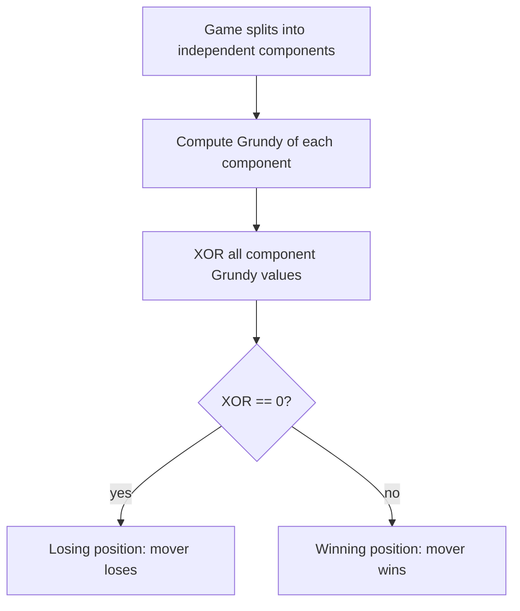

# Sprague-Grundy Theorem and Grundy Numbers — Junior Level

> **One-line summary:** Every position in an impartial two-player game can be tagged with a single number — its **Grundy number** (also called its *nimber*) — computed as the **mex** (minimum excludant) of the Grundy numbers of the positions you can move to. A position is a **loss for the player about to move** exactly when its Grundy number is `0`; any other value means the mover can win.

---

## Table of Contents

1. [Introduction](#introduction)
2. [Prerequisites](#prerequisites)
3. [Glossary](#glossary)
4. [Core Concepts](#core-concepts)
5. [Big-O Summary](#big-o-summary)
6. [Real-World Analogies](#real-world-analogies)
7. [Pros & Cons](#pros--cons)
8. [Step-by-Step Walkthrough](#step-by-step-walkthrough)
9. [Code Examples](#code-examples)
10. [Coding Patterns](#coding-patterns)
11. [Error Handling](#error-handling)
12. [Performance Tips](#performance-tips)
13. [Best Practices](#best-practices)
14. [Edge Cases & Pitfalls](#edge-cases--pitfalls)
15. [Common Mistakes](#common-mistakes)
16. [Cheat Sheet](#cheat-sheet)
17. [Visual Animation](#visual-animation)
18. [Summary](#summary)
19. [Further Reading](#further-reading)

---

## Introduction

Two players sit across a table. There is a pile of stones, and on your turn you must remove `1`, `2`, or `3` stones. Players alternate. Whoever cannot move — because the pile is empty — **loses**. If you are about to move from a pile of `7` stones, are you going to win or lose with best play? And what about a pile of `100`? Or *several* piles at once with different rules?

This family of games — two players, alternating turns, perfect information, no luck, and (crucially) **the same set of moves available to whoever's turn it is** — is called **impartial**. The astonishing result of this topic, the **Sprague-Grundy theorem**, says:

> **Every position of every impartial game behaves *exactly* like a single Nim pile of some size.** That size is a number we can compute, and we call it the position's *Grundy number*.

Once you have that one number per position, two things fall out for free:

- **Who wins:** the player to move loses (with best play) if and only if the Grundy number is `0`. We call such positions **losing positions** (or P-positions, "Previous player wins"). Everything else is a **winning position** (N-position, "Next player wins").
- **Sums of games:** if you are playing several independent games at once and on each turn you make a move in *one* of them, the Grundy number of the whole thing is the **XOR** (bitwise exclusive-or) of the individual Grundy numbers. This is the magic that lets you analyze multi-pile Nim and dozens of other compound games.

The engine that computes a Grundy number is tiny. For a position `p`, look at every position `q` you can move to, collect their Grundy numbers into a set, and take the **mex** — the smallest non-negative integer *not* in that set:

```
grundy(p) = mex { grundy(q) : p → q is a legal move }
```

A position with no moves (the player to move is stuck) has an empty move-set, and `mex {} = 0`. That is the base case, and it correctly says "no moves = you lose = Grundy 0."

This is a **dynamic-programming** technique: positions form a directed acyclic graph (a DAG) of "who can move to whom," and we compute Grundy numbers bottom-up, memoizing each one. The actual Nim arithmetic (XOR of pile sizes) lives in sibling topic `14-nim`; here we build the *general* machine that explains *why* Nim's XOR rule works and lets you apply the same idea to games that look nothing like Nim.

One promise to keep from minute one: Sprague-Grundy is for **impartial** games where the *last player to move wins* (the "normal play" convention). Games where the moves differ by player (like chess, where you move only your own pieces) are **partizan** and need a different theory. And games where moving last *loses* ("misère play") need a small but important twist. We focus on impartial, normal-play games throughout.

---

## Prerequisites

Before reading this file you should be comfortable with:

- **Recursion and memoization** — computing a value from the values of smaller subproblems and caching results. See `13-dynamic-programming` siblings.
- **Bitwise XOR (`^`)** — `a ^ b` flips the bits where `a` and `b` differ. We will lean on `5 ^ 3 = 6`, `x ^ x = 0`, and `x ^ 0 = x`.
- **Sets and the idea of a "smallest missing number"** — the mex operation.
- **Directed acyclic graphs (DAGs)** — positions point to the positions reachable in one move; no cycles if the game must end.
- **Big-O basics** — `O(states × moves)` for the DP.

Optional but helpful:

- A glance at **Nim** (sibling `14-nim`): a pile-removal game whose winning rule is "XOR of pile sizes ≠ 0." Sprague-Grundy generalizes it.
- Familiarity with **game trees** — the tree (or DAG) of all reachable positions.

---

## Glossary

| Term | Meaning |
|------|---------|
| **Impartial game** | A two-player game where, from any position, *both* players have the *same* legal moves. (Contrast: chess is partizan.) |
| **Normal play** | The convention that the player who **cannot move loses** (equivalently, the last player to move wins). The default here. |
| **Misère play** | The opposite convention: the player who makes the last move **loses**. Needs a small correction (see middle/professional). |
| **Position / state** | A complete snapshot of the game (e.g., "a pile of 7 stones"). |
| **Move** | A legal transition `p → q` from one position to another. |
| **Terminal position** | A position with no legal moves; the player to move there loses. |
| **P-position (losing)** | A position from which the **P**revious player wins — i.e., the player *about to move* loses. Grundy value `0`. |
| **N-position (winning)** | A position from which the **N**ext player (the mover) wins. Grundy value `≠ 0`. |
| **mex(S)** | **M**inimum **ex**cludant: the smallest non-negative integer not in the set `S`. `mex{} = 0`, `mex{0,1,3} = 2`. |
| **Grundy number / nimber** | The value `mex` of the Grundy numbers of all positions reachable in one move. Written `g(p)` or `G(p)`. |
| **Game sum** | Several independent games played together; one move affects exactly one component. |
| **XOR rule** | The Grundy number of a sum is the bitwise XOR of the components' Grundy numbers. |
| **Subtraction game** | A pile game where you may remove a number of stones from a fixed allowed set `S` (e.g. `{1,2,3}`). |

---

## Core Concepts

### 1. Impartial Games and the Win/Loss Question

An impartial game is fully described by: a set of positions, and for each position the set of positions reachable in one move. Under **normal play**, whoever faces a terminal position (no moves) loses. The fundamental question is: *from position `p`, does the player about to move win or lose with perfect play?*

There is a simple recursive characterization, even before Grundy numbers:

- A position is **losing** (for the mover) if **every** move leads to a **winning** position (you have no good option).
- A position is **winning** if **some** move leads to a **losing** position (you can hand your opponent a loss).
- A terminal position is **losing** (no moves at all).

This already answers the win/loss question. Grundy numbers add *more* information that makes **sums of games** solvable.

### 2. The mex Function

`mex(S)` is the smallest non-negative integer not present in the set `S`:

```
mex {}        = 0      (nothing is excluded, 0 is missing)
mex {0}       = 1
mex {1}       = 0      (0 is missing!)
mex {0,1,2}   = 3
mex {0,1,3}   = 2
mex {0,2,3,5} = 1
```

The name stands for **m**inimum **ex**cludant. It is the engine of the whole theory because of one key property: from a position whose reachable Grundy values are `S`, the mover can move to *any* value in `S` but **not** to `mex(S)`. So `mex(S)` is the unique value that behaves like "the size of an equivalent Nim pile."

### 3. The Grundy Number (Nimber) of a Position

Define recursively, over the move DAG:

```
grundy(p) = mex { grundy(q) : there is a legal move p → q }
```

- A **terminal** position has no moves, so `grundy = mex{} = 0`.
- Any other position takes the mex of its children's Grundy values.

Because the game must end (the move graph is a DAG), this recursion bottoms out. We compute it bottom-up with memoization — pure dynamic programming.

The headline fact connecting Grundy to winning:

> `grundy(p) = 0` ⟺ `p` is a **losing** position (mover loses). `grundy(p) ≠ 0` ⟺ **winning**.

### 4. The Sprague-Grundy Theorem

> **Every impartial-game position `p` is equivalent to a single Nim pile of size `grundy(p)`.**

"Equivalent" means: you can replace `p` by a Nim pile of that size in *any* sum of games without changing who wins. This is why one number suffices. The full proof is in [`professional.md`](./professional.md); the intuition is that `mex` makes a position behave exactly like a Nim heap whose moves go to every *smaller* value.

### 5. The XOR Rule for Sums of Games

If you play games `A`, `B`, `C`, … simultaneously and each turn you move in exactly one component, then:

```
grundy(A + B + C + …) = grundy(A) XOR grundy(B) XOR grundy(C) XOR …
```

Combined with the theorem, the whole compound game is a loss for the mover iff this XOR is `0`. This is *identical* to Nim's rule (XOR of pile sizes), because each component is equivalent to a Nim pile of size equal to its Grundy number — see sibling `14-nim`.

### 6. Computing Grundy Values by DP

For a subtraction game with allowed removals `S` and a pile of `n`:

```
g[0] = 0
for x from 1 to n:
    reachable = { g[x - s] : s in S and s <= x }
    g[x] = mex(reachable)
```

That is an `O(n · |S|)` table fill — a one-dimensional DP. Many games reduce to filling exactly this kind of table and then reading or XOR-ing entries.

### 7. Periodicity of Subtraction Games

A wonderful practical fact: for a **subtraction game** with a fixed finite set `S`, the sequence `g[0], g[1], g[2], …` is **eventually periodic**. So you can compute the first few hundred values, detect the period, and then answer queries for astronomically large `n` by looking up `g[n mod period]` (after the pre-period). We expand on this in [`middle.md`](./middle.md) and prove it in [`professional.md`](./professional.md).

---

## Big-O Summary

| Operation | Time | Space | Notes |
|-----------|------|-------|-------|
| `mex` of a set of size `m` | **O(m)** | O(m) | Mark seen values 0..m, scan for the gap. |
| Grundy of one position (given children) | O(children) | O(children) | One mex call. |
| Fill Grundy table for pile `0..n`, moves `|S|` | **O(n · |S|)** | O(n) | The standard subtraction-game DP. |
| Grundy of a general game (V states, E moves) | **O(V + E)** | O(V) | Memoized DFS over the move DAG. |
| Decide a sum of `m` games | O(m) after Grundy values | O(1) | XOR the values; nonzero ⇒ mover wins. |
| Huge `n` via periodicity | **O(period)** precompute, O(1) query | O(period) | After detecting eventual period. |

The headline numbers: computing one Grundy table is **`O(n · |S|)`**, and deciding a sum of games is **`O(m)`** once each component's Grundy value is known.

---

## Real-World Analogies

| Concept | Analogy |
|---------|---------|
| Grundy number | A "difficulty score" for a position, where score `0` means "you're stuck — you'll lose with perfect play." |
| mex | At a deli with numbered tickets `{0,1,3}` already taken, the next *smallest* free ticket is `2 = mex`. |
| Sprague-Grundy theorem | Every weird single-pile game is secretly "just Nim" once you relabel its positions by Grundy number. |
| XOR rule | Combining several gadgets into one machine: the machine is "off" (a loss for the mover) exactly when the gadgets' Grundy values cancel out under XOR. |
| Losing position (Grundy 0) | A balanced scale — whatever you do tips it, and your opponent can always re-balance it back to `0`. |
| Periodicity | A traffic-light pattern that repeats: once you know one cycle, you know the color at any future second by taking the time modulo the cycle. |

Where the analogy breaks: a "difficulty score" suggests bigger is worse, but the *magnitude* of a nonzero Grundy number does not measure how good a position is — only `0` vs nonzero decides win/loss for a single game. The magnitude matters only when you XOR several games together.

---

## Pros & Cons

| Pros | Cons |
|------|------|
| Reduces any impartial game to **one number per position** — then win/loss is a single comparison to `0`. | Only applies to **impartial, normal-play** games; partizan games (chess-like) need other theory. |
| The **XOR rule** decomposes complex compound games into independent pieces. | Computing Grundy values can be expensive if the state space is huge. |
| It is plain **DP/memoization** over a DAG — easy to implement and test. | Misère play (last move loses) needs a special correction; the naive XOR rule fails. |
| **Periodicity** makes subtraction games answerable for enormous `n`. | Detecting the period rigorously requires care; an unverified guess can be wrong. |
| Brute-force win/loss labeling gives a free correctness oracle. | The theory says *who* wins, not always an easy-to-describe *winning move* without extra work. |

**When to use:** any two-player, perfect-information, no-luck game where both players share the same moves and the last to move wins; especially when the game splits into independent components.

**When NOT to use:** partizan games (different moves per player), games with chance, scoring games where the *number* of moves or points matters beyond "who moves last," or misère games without applying the misère correction.

---

## Step-by-Step Walkthrough

Let us fully analyze the **subtraction game** with allowed removals `S = {1, 2, 3}`: from a pile of `n` stones you may remove `1`, `2`, or `3`; the player who cannot move (empty pile) loses. We compute `g[n]` for `n = 0 … 8`.

**`g[0]`** — empty pile, no moves. `mex{} = 0`. So `g[0] = 0` (losing: the player to move has already lost).

**`g[1]`** — can remove `1` to reach pile `0`. Reachable Grundy set `= {g[0]} = {0}`. `mex{0} = 1`. So `g[1] = 1`.

**`g[2]`** — remove `1`→pile1, remove `2`→pile0. Reachable `= {g[1], g[0]} = {1, 0}`. `mex{0,1} = 2`. So `g[2] = 2`.

**`g[3]`** — remove `1,2,3` → piles `2,1,0`. Reachable `= {g[2],g[1],g[0]} = {2,1,0}`. `mex{0,1,2} = 3`. So `g[3] = 3`.

**`g[4]`** — remove `1,2,3` → piles `3,2,1`. Reachable `= {g[3],g[2],g[1]} = {3,2,1}`. `mex{1,2,3} = 0` (0 is missing!). So `g[4] = 0` — a **losing** position.

**`g[5]`** — piles `4,3,2` → `{g[4],g[3],g[2]} = {0,3,2}`. `mex{0,2,3} = 1`. So `g[5] = 1`.

**`g[6]`** — piles `5,4,3` → `{1,0,3}`. `mex{0,1,3} = 2`. So `g[6] = 2`.

**`g[7]`** — piles `6,5,4` → `{2,1,0}`. `mex{0,1,2} = 3`. So `g[7] = 3`.

**`g[8]`** — piles `7,6,5` → `{3,2,1}`. `mex{1,2,3} = 0`. So `g[8] = 0` — **losing**.

Collecting the sequence:

```
n     :  0  1  2  3  4  5  6  7  8
g[n]  :  0  1  2  3  0  1  2  3  0
```

The pattern `0 1 2 3` repeats with **period 4** — and indeed `g[n] = n mod 4`. So the losing positions are exactly the multiples of `4`. If you face a pile of `7`, `g[7] = 3 ≠ 0`, so you **win**: remove `3` to leave `4` (a losing position) for your opponent.

**Now a sum of games.** Suppose you face three piles `{5, 6, 7}` of this same game, and on each turn you remove `1–3` stones from *one* pile. Grundy values are `g[5]=1, g[6]=2, g[7]=3`. The whole-game Grundy is `1 XOR 2 XOR 3 = 0`. Because it is `0`, the position is **losing** for the player about to move. (Notice that `1 XOR 2 = 3`, and `3 XOR 3 = 0`.)

That is the entire workflow: fill the Grundy table, read the components, XOR them, compare to `0`.

---

## Code Examples

### Example: Grundy Table + Winner of a Sum (subtraction game `S = {1,2,3}`)

This computes `g[0..n]`, prints them, and decides a sum of piles via XOR.

#### Go

```go
package main

import "fmt"

// mex returns the smallest non-negative integer not in the slice.
func mex(vals []int) int {
	seen := make([]bool, len(vals)+1) // mex is at most len(vals)
	for _, v := range vals {
		if v >= 0 && v < len(seen) {
			seen[v] = true
		}
	}
	for i := 0; i < len(seen); i++ {
		if !seen[i] {
			return i
		}
	}
	return len(seen)
}

// grundyTable fills g[0..n] for a subtraction game with allowed removals S.
func grundyTable(n int, S []int) []int {
	g := make([]int, n+1)
	g[0] = 0 // empty pile: no moves, mex{} = 0
	for x := 1; x <= n; x++ {
		var reachable []int
		for _, s := range S {
			if s <= x {
				reachable = append(reachable, g[x-s])
			}
		}
		g[x] = mex(reachable)
	}
	return g
}

func main() {
	S := []int{1, 2, 3}
	g := grundyTable(8, S)
	fmt.Println("n   :", []int{0, 1, 2, 3, 4, 5, 6, 7, 8})
	fmt.Println("g[n]:", g) // 0 1 2 3 0 1 2 3 0

	piles := []int{5, 6, 7}
	x := 0
	for _, p := range piles {
		x ^= g[p]
	}
	if x != 0 {
		fmt.Printf("Sum %v -> XOR=%d -> FIRST player wins\n", piles, x)
	} else {
		fmt.Printf("Sum %v -> XOR=0 -> SECOND player wins\n", piles)
	}
}
```

#### Java

```java
import java.util.*;

public class GrundySubtraction {

    // mex: smallest non-negative integer not in vals
    static int mex(List<Integer> vals) {
        boolean[] seen = new boolean[vals.size() + 1];
        for (int v : vals) {
            if (v >= 0 && v < seen.length) seen[v] = true;
        }
        for (int i = 0; i < seen.length; i++) {
            if (!seen[i]) return i;
        }
        return seen.length;
    }

    static int[] grundyTable(int n, int[] S) {
        int[] g = new int[n + 1];
        g[0] = 0; // empty pile: mex{} = 0
        for (int x = 1; x <= n; x++) {
            List<Integer> reachable = new ArrayList<>();
            for (int s : S) {
                if (s <= x) reachable.add(g[x - s]);
            }
            g[x] = mex(reachable);
        }
        return g;
    }

    public static void main(String[] args) {
        int[] S = {1, 2, 3};
        int[] g = grundyTable(8, S);
        System.out.println("g[n]: " + Arrays.toString(g)); // 0 1 2 3 0 1 2 3 0

        int[] piles = {5, 6, 7};
        int x = 0;
        for (int p : piles) x ^= g[p];
        if (x != 0)
            System.out.println("XOR=" + x + " -> FIRST player wins");
        else
            System.out.println("XOR=0 -> SECOND player wins");
    }
}
```

#### Python

```python
def mex(vals):
    """Smallest non-negative integer not in the iterable `vals`."""
    s = set(vals)
    i = 0
    while i in s:
        i += 1
    return i


def grundy_table(n, S):
    g = [0] * (n + 1)
    g[0] = 0  # empty pile: mex{} = 0
    for x in range(1, n + 1):
        reachable = [g[x - s] for s in S if s <= x]
        g[x] = mex(reachable)
    return g


if __name__ == "__main__":
    S = [1, 2, 3]
    g = grundy_table(8, S)
    print("g[n]:", g)  # [0, 1, 2, 3, 0, 1, 2, 3, 0]

    piles = [5, 6, 7]
    x = 0
    for p in piles:
        x ^= g[p]
    if x != 0:
        print(f"XOR={x} -> FIRST player wins")
    else:
        print("XOR=0 -> SECOND player wins")
```

**What it does:** builds the `S = {1,2,3}` Grundy table (`0 1 2 3 0 1 2 3 0`), then evaluates the sum of piles `{5,6,7}` whose XOR is `1^2^3 = 0`, so the second player wins.
**Run:** `go run main.go` | `javac GrundySubtraction.java && java GrundySubtraction` | `python grundy.py`

---

## Coding Patterns

### Pattern 1: Brute-Force Win/Loss Oracle (the thing you test against)

**Intent:** Before trusting Grundy values, label each position win/loss the slow, obvious way and check that "loss" lines up with "Grundy 0."

```python
from functools import lru_cache


def moves(n, S):
    return [n - s for s in S if s <= n]


@lru_cache(maxsize=None)
def is_winning(n, S):
    # mover wins if SOME move leads to a losing position
    for nxt in moves(n, tuple(S)):
        if not is_winning(nxt, S):
            return True
    return False  # no moves, or all moves lead to wins
```

`is_winning(n)` is `True` exactly when `grundy(n) != 0`. Always cross-check.

### Pattern 2: Memoized Grundy over a General Move DAG

**Intent:** When positions are not just integers, encode a state, list its successors, and memoize the mex.

```python
from functools import lru_cache


@lru_cache(maxsize=None)
def grundy(state):
    succ = successors(state)          # problem-specific
    if not succ:
        return 0                      # terminal: mex{} = 0
    return mex(grundy(s) for s in succ)
```

### Pattern 3: XOR-Decompose a Sum

**Intent:** Combine independent components by XOR-ing their Grundy values; nonzero ⇒ mover wins.



---

## Error Handling

| Error | Cause | Fix |
|-------|-------|-----|
| Grundy of terminal is wrong | Returned something other than `0` for "no moves." | `mex{} = 0`; handle the empty move-set explicitly. |
| `mex` returns wrong value | Treated `mex` as `max+1` or as the count of children. | `mex` is the smallest *missing* non-negative integer, not the max. |
| Winner flipped | Confused "mover wins" with "mover loses." | Grundy `0` ⇒ mover **loses**; nonzero ⇒ mover **wins**. |
| Sum decided wrong | Summed Grundy values instead of XOR-ing. | Use bitwise XOR (`^`), never `+`. |
| Infinite recursion | The move graph has a cycle (game can loop forever). | Sprague-Grundy requires a DAG (finite games). Loopy games need different theory. |
| Off-by-one in subtraction DP | Included moves with `s > x`. | Only allow `s <= x` so you never index a negative pile. |
| Misère answer wrong | Applied normal-play XOR to a misère game. | Misère needs a correction (see middle/professional). |

---

## Performance Tips

- **Bound the mex array by the number of children.** `mex` of `m` values is at most `m`, so a boolean array of size `m+1` is enough — no need to size it by the largest Grundy value.
- **Memoize aggressively.** Each position's Grundy value should be computed once; cache by a canonical state key.
- **Detect periodicity for subtraction games.** Compute a few hundred values, find the repeating block, then answer huge `n` in `O(1)`. (Details in `middle.md`.)
- **Canonicalize symmetric states** (e.g., sort pile sizes) so equivalent positions share a cache entry.
- **Avoid building large sets when a small boolean array suffices** — set allocation dominates the cost of `mex` in tight loops.

---

## Best Practices

- Always test Grundy values against the brute-force win/loss oracle (Pattern 1) on small inputs: `g == 0` must match "losing."
- State your play convention explicitly (normal vs misère) in a comment; they give different answers.
- Separate `mex`, `grundy(position)`, and "decide a sum" into small, independently testable functions.
- For sums, **XOR** Grundy values — write it as `acc ^= g[...]`, never `acc += g[...]`.
- When a game obviously splits into independent parts, decompose first and compute Grundy per part; do not analyze the monolith.
- Verify periodicity empirically (does the block truly repeat for many cycles?) before relying on it for huge `n`.

---

## Edge Cases & Pitfalls

- **Empty / terminal position** — `grundy = 0`. The player to move there has already lost.
- **Single move available** — still take the mex; e.g., if the only child has Grundy `0`, the mex is `1` (winning).
- **All children share a Grundy value** — e.g., children all `0` gives `mex{0} = 1`; children all `2` gives `mex{2} = 0`.
- **Self-loops / cycles** — Sprague-Grundy assumes the game ends (a DAG). A position you can return to breaks the recursion and the theory.
- **Misère play** — moving last *loses*; the naive XOR rule is wrong (a position with XOR `0` is not necessarily a loss). Use the misère correction.
- **Magnitude is not strength** — for a single game, only `0` vs nonzero matters; a Grundy value of `7` is not "better" than `1`. Magnitude matters only inside an XOR.
- **Partizan games** — if the two players have different moves, Grundy numbers do not apply; you need surreal/partizan theory.

---

## Common Mistakes

1. **Using `+` instead of XOR** to combine games — the single most common bug. Sums combine by **XOR**.
2. **Returning `max+1` for mex** — mex is the smallest *missing* value, which can be far below `max` (e.g., `mex{0,5} = 1`).
3. **Forgetting the base case** — terminal positions must be `0`, not undefined.
4. **Confusing win and loss** — Grundy `0` means the **mover loses**, not wins.
5. **Applying it to partizan or chance games** — Sprague-Grundy is only for impartial, deterministic games.
6. **Ignoring the play convention** — misère vs normal play change the answer; never assume.
7. **Trusting an unverified period** — a guessed period that "looks right" for 20 terms may break later; verify across many cycles or use a proven bound.

---

## Cheat Sheet

| Question | Tool | Formula |
|----------|------|---------|
| Grundy of a position | mex of children | `g(p) = mex{ g(q) : p→q }` |
| Grundy of terminal | base case | `g = mex{} = 0` |
| Does the mover win (single game)? | compare to 0 | `g(p) ≠ 0 ⇒ win` |
| Grundy of a sum of games | XOR | `g(A+B+…) = g(A) ⊕ g(B) ⊕ …` |
| Does the mover win (sum)? | XOR vs 0 | `XOR ≠ 0 ⇒ win` |
| Subtraction game table | 1-D DP | `g[x] = mex{ g[x-s] : s∈S, s≤x }` |
| Huge `n`, subtraction game | periodicity | `g[n] = g[pre + (n-pre) mod period]` |

Core engine:

```
grundy(p):
    if p has no moves: return 0       # mex{} = 0
    return mex({ grundy(q) for each move p->q })

decide_sum(components):
    x = 0
    for c in components: x ^= grundy(c)
    return "mover wins" if x != 0 else "mover loses"
```

---

## Visual Animation

> See [`animation.html`](./animation.html) for an interactive visualization.
>
> The animation demonstrates:
> - A game's **position DAG**, with each node labeled by its Grundy number.
> - Computing Grundy **bottom-up**: terminals get `0`, then each node takes the **mex** of its children's values (you watch the mex being selected).
> - **XOR over a sum** of independent games, showing how component Grundy values combine and whether the result is `0` (loss) or nonzero (win).
> - Step / Run / Reset controls to watch each mex and each XOR resolve one at a time.

---

## Summary

An **impartial, normal-play** game tags every position with a single **Grundy number**, computed as the **mex** of the Grundy numbers of the positions you can move to. A terminal position has Grundy `0` (no moves, `mex{} = 0`), and the recursion fills in the rest bottom-up over the move DAG — pure dynamic programming. The **Sprague-Grundy theorem** says every position is equivalent to a Nim pile of size equal to its Grundy number, so for a single game the mover **loses** exactly when the Grundy number is `0`. For **sums** of independent games, the Grundy number of the whole is the **XOR** of the parts, which decides the compound game with a single comparison to `0`. Subtraction games have **eventually periodic** Grundy sequences, letting you answer huge `n` instantly. Master `mex`, the recursive Grundy definition, and the XOR rule, and you can analyze a vast family of two-player games — with the actual Nim arithmetic living in sibling `14-nim`.

---

## Further Reading

- *Winning Ways for Your Mathematical Plays* (Berlekamp, Conway, Guy) — the canonical reference on impartial and partizan game theory.
- *On Numbers and Games* (Conway) — the deeper algebraic foundation (nimbers, surreal numbers).
- Sibling topic `14-nim` — Nim and its XOR rule, the prototype that Sprague-Grundy generalizes.
- Sibling topics in `13-dynamic-programming` — memoization and DP over DAGs.
- cp-algorithms.com — "Games on graphs" and "Sprague-Grundy theorem. Nim."
- *Lessons in Play* (Albert, Nowakowski, Wolfe) — a gentle modern introduction to combinatorial game theory.
