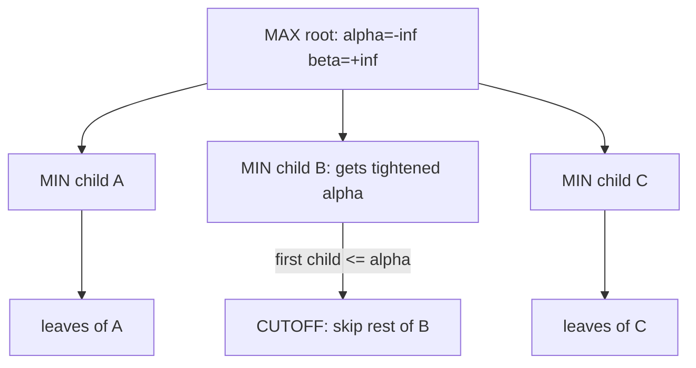

# Minimax and Alpha-Beta Pruning (Adversarial Search) — Junior Level

> **One-line summary:** In a two-player, perfect-information, zero-sum game, the **minimax value** of a position is the best score you can force assuming your opponent always plays to minimize your score. You compute it by recursing through the game tree — one player **maximizes**, the other **minimizes** — and **alpha-beta pruning** skips branches that provably cannot change the answer, often making the search dramatically faster *without changing the result*.

---

## Table of Contents

1. [Introduction](#introduction)
2. [Prerequisites](#prerequisites)
3. [Glossary](#glossary)
4. [Core Concepts](#core-concepts)
5. [Big-O Summary](#big-o-summary)
6. [Real-World Analogies](#real-world-analogies)
7. [Pros & Cons](#pros--cons)
8. [Step-by-Step Walkthrough](#step-by-step-walkthrough)
9. [Code Examples](#code-examples)
10. [Coding Patterns](#coding-patterns)
11. [Error Handling](#error-handling)
12. [Performance Tips](#performance-tips)
13. [Best Practices](#best-practices)
14. [Edge Cases & Pitfalls](#edge-cases--pitfalls)
15. [Common Mistakes](#common-mistakes)
16. [Cheat Sheet](#cheat-sheet)
17. [Visual Animation](#visual-animation)
18. [Summary](#summary)
19. [Further Reading](#further-reading)

---

## Introduction

Imagine you and a friend are playing tic-tac-toe. You want to win; your friend wants to win too — and since only one of you can win, your friend wanting to win is *exactly the same as* your friend wanting **you** to lose. This is what "zero-sum" means: whatever is good for you is bad for them, and vice versa. There is no cooperation and no luck.

Now ask the central question of game AI: *"If both of us play perfectly, what is the best result I can guarantee from this position?"* The answer is called the **minimax value**. The name comes from the procedure: when it is **your** turn you pick the move that **maximizes** your score, and when it is the **opponent's** turn they pick the move that **minimizes** your score. You alternate `max`, `min`, `max`, `min`, … all the way down the tree of possible futures, and the value bubbles back up to the current position.

> **Minimax value** = the score you can force, assuming the opponent always responds with the move that is worst for you.

The set of all possible game continuations forms a **game tree**: the current position is the root, each legal move is an edge, and the positions you can reach are the children. Leaves are finished games (win / lose / draw) or positions where you stop and *estimate* the value with an **evaluation function**. Minimax is just a depth-first walk of that tree that returns the value of the root.

The catch is size. Tic-tac-toe has at most `9! = 362,880` move sequences — tiny, so we can search the whole tree. But chess has roughly `10^120` positions, and Go far more. We cannot look at all of them. Two ideas tame this:

1. **Depth limit + evaluation function.** Stop at a fixed depth and *guess* the value of the position with a heuristic instead of searching to the end of the game.
2. **Alpha-beta pruning.** While searching, keep track of two bounds, `alpha` (the best the maximizer is already guaranteed) and `beta` (the best the minimizer is already guaranteed). Whenever a branch can no longer affect the final answer, **cut it off** and do not search it. Crucially, alpha-beta returns *exactly the same value* as plain minimax — it only avoids wasted work.

This file uses **tic-tac-toe** as the running example because it is small enough to search completely, so you can verify the minimax value by hand and trust that the code is correct. The same machinery scales (with a depth limit and an evaluation function) to checkers, Connect Four, chess, and beyond. Related game-theory tools live in sibling topics: combinatorial game theory in `14-nim` and `15-sprague-grundy`, general game DP in `17-game-dp`, and games played on graphs in `26-games-on-graphs`.

---

## Prerequisites

Before reading this file you should be comfortable with:

- **Recursion** — a function that calls itself; minimax *is* recursion over the game tree. (See `13-dynamic-programming` siblings and recursion/backtracking material.)
- **Trees** — root, children, leaves, depth; the game tree is the central object here.
- **Depth-first search (DFS)** — minimax explores the tree depth-first, fully evaluating one branch before the next.
- **Big-O notation** — `O(b^d)` where `b` is the branching factor and `d` the depth.
- **Basic arrays / 2D grids** — the tic-tac-toe board is a `3 × 3` grid.
- **Simple conditionals and loops** — to generate moves and detect wins.

Optional but helpful:

- A feel for **backtracking** (make a move, recurse, undo the move) — the standard way to explore moves cheaply.
- The idea of a **heuristic** (an educated guess) — needed once we add a depth limit.

You do **not** need probability or any advanced math. Minimax is deterministic; there is no randomness in the games we consider here.

---

## Glossary

| Term | Meaning |
|------|---------|
| **Zero-sum game** | A game where one player's gain is exactly the other's loss. Total payoff is constant (often `0`). |
| **Perfect information** | Both players see the entire game state; nothing is hidden (unlike poker). |
| **Game tree** | Tree of all reachable positions: root = current position, edges = moves, leaves = finished/cut-off positions. |
| **Ply** | A single move by one player (a half-move). Two plies (your move + opponent's) make one "full move". |
| **Minimax value** | The score the position is worth under optimal play by both sides. |
| **Maximizing player (MAX)** | The player trying to make the score as large as possible (usually "us"). |
| **Minimizing player (MIN)** | The opponent, trying to make the score as small as possible. |
| **Evaluation function** | A heuristic that estimates a position's value when we stop searching before the game ends. |
| **Depth limit** | The maximum number of plies we look ahead before calling the evaluation function. |
| **Alpha (α)** | The best (highest) value MAX is already guaranteed somewhere up the tree. Lower bound for MAX. |
| **Beta (β)** | The best (lowest) value MIN is already guaranteed somewhere up the tree. Upper bound for MIN. |
| **Cutoff / pruning** | Abandoning a branch because it cannot affect the final value (when `alpha >= beta`). |
| **Branching factor (b)** | The average number of legal moves per position. |
| **Terminal position** | A finished game: win, loss, or draw. Its value is known exactly. |

---

## Core Concepts

### 1. The Game Tree

Every reachable position is a node. From a position, each legal move leads to a child position. The root is "now". Layers alternate between MAX-to-move and MIN-to-move. For tic-tac-toe, the root has up to 9 children (the 9 empty cells), each of those has up to 8 children, and so on. A node is a **leaf** when the game is over (someone won, or the board is full = draw).

```
                MAX to move (root)
             /        |         \
        MIN ...     MIN ...     MIN ...
        /  \         /  \        /  \
      ...   ...    ...  ...    ...  ...   (alternating layers)
```

### 2. Scoring Terminal Positions

We pick a numbering convention from MAX's point of view. For tic-tac-toe with MAX = `X`:

```
X wins  -> +1
draw    ->  0
O wins  -> -1
```

MAX wants the value as **high** as possible; MIN (player `O`) wants it as **low** as possible. Any consistent numbering works as long as both players read it the same way.

### 3. The Minimax Rule

For a position `p`:

- If `p` is terminal, return its exact score.
- If it is **MAX's** turn, return the **maximum** over all children's minimax values.
- If it is **MIN's** turn, return the **minimum** over all children's minimax values.

```
minimax(p):
    if terminal(p): return score(p)
    if MAX to move: return max( minimax(child) for each child )
    if MIN to move: return min( minimax(child) for each child )
```

That is the entire algorithm. Each player assumes the other plays optimally against them, and the value propagates up from the leaves.

### 4. Depth Limit + Evaluation Function

For big games we cannot reach terminal leaves. We add a `depth` parameter; when `depth == 0` we stop and call an **evaluation function** `eval(p)` that returns a *heuristic estimate* of the position's value (e.g., for chess, material count). The recursion becomes:

```
minimax(p, depth):
    if terminal(p): return score(p)
    if depth == 0:  return eval(p)        # heuristic, not exact
    ... max/min over children with depth-1 ...
```

For tic-tac-toe we usually search to the end (no depth limit needed) because the tree is tiny.

### 5. Alpha-Beta Pruning

Plain minimax may explore branches whose result cannot matter. Alpha-beta carries two values down the recursion:

- **alpha** = the highest value MAX can already guarantee (starts at `-∞`).
- **beta** = the lowest value MIN can already guarantee (starts at `+∞`).

At a MAX node, after a child returns a value, update `alpha = max(alpha, value)`. If `alpha >= beta`, **stop** — MIN, higher up, already has a way to hold the score to `beta`, so it will never let MAX reach this `alpha`. Symmetrically at a MIN node, update `beta = min(beta, value)` and cut off when `beta <= alpha`.

> The cut is safe because the pruned branch can only make MAX's value larger (or MIN's smaller), and the parent has already committed to a bound that makes those improvements irrelevant. **Alpha-beta returns the same value as minimax.** ([`professional.md`](./professional.md) proves this.)

### 6. Move Ordering

How much alpha-beta prunes depends heavily on the **order** you try moves. If you try the *best* move first, the bounds tighten immediately and you prune the rest quickly. With perfect ordering, alpha-beta examines only about `b^(d/2)` leaves instead of `b^d` — effectively **doubling the depth** you can search in the same time. (Details in [`middle.md`](./middle.md).)

---

## Big-O Summary

| Operation | Time | Space | Notes |
|-----------|------|-------|-------|
| Plain minimax, full tree | **O(b^d)** | O(d) | `b` = branching factor, `d` = depth; space is the recursion stack. |
| Alpha-beta, worst case | O(b^d) | O(d) | If moves are ordered badly, no pruning happens. |
| Alpha-beta, best case (perfect ordering) | **O(b^(d/2))** | O(d) | Searches the square root of the leaves — same time buys ~2× depth. |
| Alpha-beta, random ordering | ~O(b^(3d/4)) | O(d) | Typical middle ground. |
| Evaluate one tic-tac-toe position | O(1) | O(1) | Check 8 lines for three-in-a-row. |
| Full tic-tac-toe search | O(9!) ≈ 3.6e5 | O(9) | Tiny; runs instantly. |

The headline: minimax is **exponential in depth**. Alpha-beta does not change the worst case but, with good move ordering, cuts the *effective* exponent in half — the single most important practical speedup before you add transposition tables and other tricks (see [`middle.md`](./middle.md)).

---

## Real-World Analogies

| Concept | Analogy |
|---------|---------|
| Minimax value | Planning a route through hostile territory assuming every fork leads you to the *worst* outcome an adversary can pick — you prepare for the most pessimistic response. |
| MAX vs MIN | A chess clock argument: you push for the best line, your opponent pushes for the worst (for you). Each ply flips whose interest dominates. |
| Evaluation function | A real-estate appraisal: you cannot sell the house to know its true price, so an appraiser *estimates* its value from features (square footage, location). |
| Alpha-beta cutoff | Job interviews: once a candidate gives an answer worse than someone you already accepted, you stop the interview — no remaining answer can change your decision. |
| Move ordering | Reading the most promising résumés first: you fill the bar quickly and reject the rest faster. |
| Depth limit | A weather forecast: reliable a few days out, then you stop and rely on climatological averages (the heuristic). |

Where the analogy breaks: real adversaries are not always optimal, and real evaluation functions are imperfect. Minimax assumes a *perfectly rational* opponent and treats the evaluation as if it were the truth — assumptions worth remembering when the model meets reality.

---

## Pros & Cons

| Pros | Cons |
|------|------|
| Gives **provably optimal** play when the full tree is searched (e.g., tic-tac-toe). | Cost is **exponential** in depth (`O(b^d)`); infeasible to search big games fully. |
| Simple, recursive, and easy to reason about. | Needs a good **evaluation function** for large games — designing one is hard. |
| Alpha-beta speeds it up with **zero loss of correctness**. | Alpha-beta's benefit depends on **move ordering**; bad ordering = no pruning. |
| Works for any zero-sum, perfect-information, deterministic game. | Does not directly handle chance (dice) or hidden information (cards). |
| Easy to extend with transposition tables, iterative deepening, etc. | Assumes the **opponent plays optimally**; may be over-cautious vs weak opponents. |

**When to use:** two-player, turn-based, zero-sum, perfect-information, deterministic games (tic-tac-toe, checkers, Connect Four, chess, Othello, Nim-like games).

**When NOT to use:** games with chance (backgammon — use expectiminimax), hidden information (poker — use other techniques), more than two players without modification, or non-zero-sum games where opponents may cooperate.

---

## Step-by-Step Walkthrough

Take a small abstract game tree where MAX moves first, then MIN, then leaves (depth 2). Leaf values are from MAX's perspective:

```
                 MAX
            /     |     \
          A       B       C        (MIN nodes)
        / | \   / | \   / | \
       3  5  6 1  2  0 9  7  8     (leaf values)
```

**Plain minimax, bottom-up.**

- MIN node `A` minimizes its children `{3, 5, 6}` → `3`.
- MIN node `B` minimizes `{1, 2, 0}` → `0`.
- MIN node `C` minimizes `{9, 7, 8}` → `7`.
- MAX root maximizes `{3, 0, 7}` → **`7`**.

So the minimax value of the root is `7`: MAX should move toward `C`, and MIN will then hold MAX to `7`.

**Now with alpha-beta** (left to right, `alpha = -∞`, `beta = +∞` at the root):

1. Enter `A` (MIN) with `(α=-∞, β=+∞)`. Children: `3` → `β=3`. `5` → no change. `6` → no change. `A` returns `3`. Back at root: `α = max(-∞, 3) = 3`.
2. Enter `B` (MIN) with `(α=3, β=+∞)`. First child `1` → `β=1`. Now `β=1 <= α=3` → **cutoff!** We skip `B`'s remaining children `{2, 0}`. `B` returns `1` (an upper bound; the true value `0` is even lower, but it does not matter — `B` is already worse for MAX than `A`'s `3`).
3. Enter `C` (MIN) with `(α=3, β=+∞)`. `9` → `β=9`. `7` → `β=7`. `8` → no change. `7 > α=3`, no cutoff. `C` returns `7`. Root: `α = max(3, 7) = 7`.
4. Root returns **`7`** — identical to plain minimax.

**What we saved:** we never evaluated leaves `2` and `0` under `B`. The cutoff fired because once MIN at `B` could force the value down to `1`, and MAX already had `3` available from `A`, MAX would never choose `B` — so the rest of `B` is irrelevant. The answer is provably unchanged.

This is the whole idea: **the bounds let us discard work that cannot change the decision.** Try the animation (linked below) to watch the bounds tighten and branches get cut live.

---

## Code Examples

### Example: Tic-Tac-Toe Minimax (search to the end)

The board is a length-9 array: `1` = X (MAX), `-1` = O (MIN), `0` = empty. `minimax` returns the exact value from X's perspective. We also show how to pick the best move.

#### Go

```go
package main

import "fmt"

// board: 9 cells, 1 = X (MAX), -1 = O (MIN), 0 = empty.
var lines = [8][3]int{
	{0, 1, 2}, {3, 4, 5}, {6, 7, 8}, // rows
	{0, 3, 6}, {1, 4, 7}, {2, 5, 8}, // cols
	{0, 4, 8}, {2, 4, 6}, // diagonals
}

// winner returns 1 if X won, -1 if O won, 0 otherwise.
func winner(b []int) int {
	for _, l := range lines {
		s := b[l[0]] + b[l[1]] + b[l[2]]
		if s == 3 {
			return 1
		}
		if s == -3 {
			return -1
		}
	}
	return 0
}

func full(b []int) bool {
	for _, c := range b {
		if c == 0 {
			return false
		}
	}
	return true
}

// minimax returns the exact value from X's perspective.
// player = 1 means X (MAX) to move, -1 means O (MIN) to move.
func minimax(b []int, player int) int {
	if w := winner(b); w != 0 {
		return w
	}
	if full(b) {
		return 0
	}
	if player == 1 { // MAX
		best := -2
		for i := 0; i < 9; i++ {
			if b[i] == 0 {
				b[i] = 1
				v := minimax(b, -1)
				b[i] = 0 // undo (backtrack)
				if v > best {
					best = v
				}
			}
		}
		return best
	}
	// MIN
	best := 2
	for i := 0; i < 9; i++ {
		if b[i] == 0 {
			b[i] = -1
			v := minimax(b, 1)
			b[i] = 0
			if v < best {
				best = v
			}
		}
	}
	return best
}

func main() {
	empty := make([]int, 9)
	fmt.Println("minimax value of empty board:", minimax(empty, 1)) // 0 (perfect play draws)
}
```

#### Java

```java
public class TicTacToe {
    static final int[][] LINES = {
        {0, 1, 2}, {3, 4, 5}, {6, 7, 8},
        {0, 3, 6}, {1, 4, 7}, {2, 5, 8},
        {0, 4, 8}, {2, 4, 6}
    };

    static int winner(int[] b) {
        for (int[] l : LINES) {
            int s = b[l[0]] + b[l[1]] + b[l[2]];
            if (s == 3) return 1;
            if (s == -3) return -1;
        }
        return 0;
    }

    static boolean full(int[] b) {
        for (int c : b) if (c == 0) return false;
        return true;
    }

    // player = 1 (X, MAX) or -1 (O, MIN)
    static int minimax(int[] b, int player) {
        int w = winner(b);
        if (w != 0) return w;
        if (full(b)) return 0;
        if (player == 1) {
            int best = -2;
            for (int i = 0; i < 9; i++) {
                if (b[i] == 0) {
                    b[i] = 1;
                    best = Math.max(best, minimax(b, -1));
                    b[i] = 0;
                }
            }
            return best;
        } else {
            int best = 2;
            for (int i = 0; i < 9; i++) {
                if (b[i] == 0) {
                    b[i] = -1;
                    best = Math.min(best, minimax(b, 1));
                    b[i] = 0;
                }
            }
            return best;
        }
    }

    public static void main(String[] args) {
        int[] empty = new int[9];
        System.out.println("minimax value of empty board: " + minimax(empty, 1)); // 0
    }
}
```

#### Python

```python
LINES = [
    (0, 1, 2), (3, 4, 5), (6, 7, 8),
    (0, 3, 6), (1, 4, 7), (2, 5, 8),
    (0, 4, 8), (2, 4, 6),
]


def winner(b):
    for a, c, d in LINES:
        s = b[a] + b[c] + b[d]
        if s == 3:
            return 1
        if s == -3:
            return -1
    return 0


def full(b):
    return all(c != 0 for c in b)


def minimax(b, player):
    """player = 1 (X, MAX) or -1 (O, MIN). Returns value from X's view."""
    w = winner(b)
    if w != 0:
        return w
    if full(b):
        return 0
    if player == 1:                       # MAX
        best = -2
        for i in range(9):
            if b[i] == 0:
                b[i] = 1
                best = max(best, minimax(b, -1))
                b[i] = 0                  # undo
        return best
    else:                                 # MIN
        best = 2
        for i in range(9):
            if b[i] == 0:
                b[i] = -1
                best = min(best, minimax(b, 1))
                b[i] = 0
        return best


if __name__ == "__main__":
    empty = [0] * 9
    print("minimax value of empty board:", minimax(empty, 1))  # 0
```

**What it does:** searches the entire tic-tac-toe tree and returns the value of the empty board, which is `0` — perfect play by both sides always draws. The `b[i] = 0` line is the **backtracking** step: make a move, recurse, then undo so the same array is reused.
**Run:** `go run main.go` | `javac TicTacToe.java && java TicTacToe` | `python ttt.py`

---

## Coding Patterns

### Pattern 1: Make–Recurse–Undo (Backtracking)

**Intent:** Explore each move cheaply by mutating one shared board, then restoring it.

```python
b[i] = player          # make the move
value = minimax(b, -player)
b[i] = 0               # undo — restore the board for the next move
```

This avoids copying the board at every node, which would multiply memory and time. The undo is essential; forgetting it corrupts the search.

### Pattern 2: Pick the Best Move (not just the value)

**Intent:** Often you want the *move*, not only the value. Run the loop at the top level and remember the argmax/argmin.

```python
def best_move(b, player):
    best_val, best_i = (-2 if player == 1 else 2), -1
    for i in range(9):
        if b[i] == 0:
            b[i] = player
            v = minimax(b, -player)
            b[i] = 0
            if (player == 1 and v > best_val) or (player == -1 and v < best_val):
                best_val, best_i = v, i
    return best_i
```

### Pattern 3: Add Alpha-Beta to Minimax

**Intent:** Same answer, far fewer nodes. Pass `alpha` and `beta` down; cut off when they cross.



The single new rule: at a MAX node `if alpha >= beta: break`; at a MIN node `if beta <= alpha: break`.

---

## Error Handling

| Error | Cause | Fix |
|-------|-------|-----|
| Wrong winner detected | Line sums computed incorrectly (e.g. mixing +1/-1 encoding). | Use a consistent encoding and sum the three cells; `+3` = X, `-3` = O. |
| Search never terminates | Forgot the terminal/full check, or forgot to undo the move. | Always check `winner` and `full` first; always restore `b[i] = 0`. |
| Best move is `-1` (none chosen) | Called `best_move` on a finished or full board. | Guard: if terminal, there is no move; return early. |
| Stack overflow on big game | No depth limit on a large tree. | Add a `depth` parameter and an evaluation function for non-terminal cutoffs. |
| Value sign flipped | Maximizer/minimizer roles swapped, or eval not from MAX's view. | Fix the convention: scores are always from MAX's perspective. |
| Off-by-one in depth | Decrementing depth at the wrong place. | Decrement once per recursive call; stop when `depth == 0`. |

---

## Performance Tips

- **Order moves well.** Try likely-best moves first (e.g., center, then corners in tic-tac-toe). Good ordering is what lets alpha-beta prune; it can shrink work from `b^d` toward `b^(d/2)`.
- **Use alpha-beta, always.** It never hurts correctness and usually helps a lot. Plain minimax is for explanation only.
- **Backtrack instead of copying boards.** Mutate one array and undo; copying at every node is wasteful.
- **Stop early on a forced win.** If a move yields the best possible score (e.g., `+1`), you can stop searching siblings — they cannot beat it. (Alpha-beta does this automatically.)
- **Cache repeated positions** with a transposition table once games get bigger (see [`middle.md`](./middle.md)).
- **Keep the evaluation function cheap** — it runs at every leaf, so an expensive heuristic dominates the runtime.

---

## Best Practices

- Keep all scores from a **single player's perspective** (MAX's), so `max`/`min` always mean the same thing.
- Check **terminal** (`winner`) before **full** before **depth limit** — a win must override a "board full" draw.
- Write `minimax` and the **evaluation function** as separate, testable functions; most bugs hide in the eval.
- For small games (tic-tac-toe), **verify against the known result** (empty board = draw = `0`). This is your oracle.
- Prefer the **negamax** reformulation (see [`middle.md`](./middle.md)) once you are comfortable — it collapses the MAX/MIN duplication into one branch and is less error-prone.
- Document the score convention in a comment at the top of the file; sign confusion is the most common bug.

---

## Edge Cases & Pitfalls

- **Empty board** — the value is `0` (a draw) for tic-tac-toe under perfect play. A frequent confusion is expecting the first player to win; they cannot, against perfect defense.
- **Already-won board** — return the terminal score immediately; do not keep searching.
- **Full board with no winner** — that is a draw, value `0`. Check `winner` first so a winning-but-full board is not misreported as a draw.
- **Single legal move** — minimax still works; the loop just has one child.
- **Depth limit hides a loss** — if you cut off before a forced loss, the evaluation may look fine while disaster waits just beyond the horizon (the **horizon effect**; see [`senior.md`](./senior.md)).
- **Ties in value** — multiple moves may share the optimal value; any of them is correct, but you may prefer the one that wins *fastest* (encode depth into the score; see [`middle.md`](./middle.md)).
- **Alpha-beta with equal bounds** — using `alpha >= beta` (with `>=`) versus `>` matters for whether you prune on ties; `>=` is standard and safe.

---

## Common Mistakes

1. **Forgetting to undo the move** (`b[i] = 0`) — the board gets corrupted and every result downstream is wrong.
2. **Mixing up MAX and MIN** — applying `max` on the opponent's turn. Keep the `player` flag and the perspective straight.
3. **Checking "full" before "winner"** — a board can be full *and* won; report the win.
4. **Assuming alpha-beta changes the value** — it does not; it returns the *same* minimax value, just faster. If your alpha-beta and minimax disagree, you have a bug.
5. **Evaluation not from MAX's perspective** — flipping the sign for the opponent's view breaks the `max`/`min` logic.
6. **No depth limit on a large game** — leads to a hopeless full search; you need a cutoff and a heuristic.
7. **Pruning at the wrong node type** — cutting off with `alpha >= beta` belongs at MAX; `beta <= alpha` at MIN. Swapping them prunes incorrectly.
8. **Not preferring faster wins** — without depth in the score, the engine may "toy" with a lost opponent instead of finishing.

---

## Cheat Sheet

| Question | Tool | Rule |
|----------|------|------|
| Value under perfect play | minimax | MAX takes `max` of children, MIN takes `min` |
| Same value, faster | alpha-beta | cut off when `alpha >= beta` |
| Stop before game end | depth limit + `eval` | return heuristic at `depth == 0` |
| Track bounds | α, β | α = best for MAX so far, β = best for MIN so far |
| Effect of good ordering | `b^(d/2)` best case | try best move first |
| Tic-tac-toe empty board | known result | value `0` (draw) |
| Win/draw/loss for MAX=X | scoring | `+1 / 0 / -1` |

Core algorithm:

```
alphabeta(p, depth, alpha, beta, maximizing):
    if terminal(p) or depth == 0:
        return value(p)               # exact score or eval()
    if maximizing:
        best = -inf
        for child of p (ordered):
            best = max(best, alphabeta(child, depth-1, alpha, beta, false))
            alpha = max(alpha, best)
            if alpha >= beta: break    # beta cutoff
        return best
    else:
        best = +inf
        for child of p (ordered):
            best = min(best, alphabeta(child, depth-1, alpha, beta, true))
            beta = min(beta, best)
            if beta <= alpha: break    # alpha cutoff
        return best
# returns exactly the minimax value; cost O(b^d), best case O(b^(d/2))
```

---

## Visual Animation

> See [`animation.html`](./animation.html) for an interactive visualization.
>
> The animation demonstrates:
> - A small game tree with alternating MAX and MIN layers and leaf values.
> - Depth-first minimax with **alpha/beta bounds propagating** down and values bubbling up.
> - **Pruned branches visibly cut off** when `alpha >= beta`, with a count of leaves saved.
> - Step / Run / Reset controls to watch each comparison, update, and cutoff happen one at a time.

---

## Summary

Minimax answers a single question for two-player, zero-sum, perfect-information games: *what score can I force if my opponent plays perfectly against me?* You compute it by a depth-first walk of the game tree where you (MAX) take the maximum of your children and the opponent (MIN) takes the minimum, with values bubbling up from terminal leaves scored from your perspective. Because the tree is exponential (`O(b^d)`), real games add a **depth limit** with an **evaluation function** to estimate non-terminal positions. **Alpha-beta pruning** tracks two bounds, `alpha` and `beta`, and discards branches that provably cannot change the result — returning the *exact same* minimax value while, with good **move ordering**, examining only about `b^(d/2)` leaves. Tic-tac-toe is small enough to search completely, and its empty-board value is `0`: perfect play always draws. Master make–recurse–undo, the max/min duality, and the alpha-beta cutoff, and you have the core of every classical game engine.

---

## Further Reading

- *Artificial Intelligence: A Modern Approach* (Russell & Norvig) — the canonical chapter on adversarial search, minimax, and alpha-beta.
- Sibling topic `14-nim` — combinatorial game theory and winning/losing positions.
- Sibling topic `15-sprague-grundy` — Grundy numbers for impartial games.
- Sibling topic `17-game-dp` — dynamic programming formulations of games.
- Sibling topic `26-games-on-graphs` — games modeled as positions on a graph.
- The Chess Programming Wiki — practical alpha-beta, move ordering, and transposition tables.
- Knuth & Moore, "An Analysis of Alpha-Beta Pruning" (1975) — the foundational complexity analysis.
