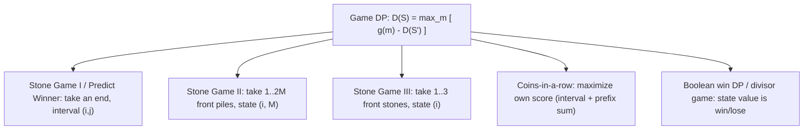

# Game DP — Optimal Play in Turn-Based Scoring Games (Middle Level)

> **Focus:** The score-difference recurrence as a special case of interval DP, why it is correct, the family of variants (Stone Game I / II / III, coins-in-a-row, divisor games), the boolean "can-I-win" formulation, and exactly how game DP relates to minimax (topic `16`) and contrasts with Grundy theory (topic `15`).

---

## Table of Contents

1. [Introduction](#introduction)
2. [Deeper Concepts](#deeper-concepts)
3. [Comparison with Alternatives](#comparison-with-alternatives)
4. [Advanced Patterns](#advanced-patterns)
5. [Variants: Stone Game I / II / III and Friends](#variants-stone-game-i--ii--iii-and-friends)
6. [Boolean Win DP and Divisor Games](#boolean-win-dp-and-divisor-games)
7. [Code Examples](#code-examples)
8. [Error Handling](#error-handling)
9. [Performance Analysis](#performance-analysis)
10. [Best Practices](#best-practices)
11. [Visual Animation](#visual-animation)
12. [Summary](#summary)

---

## Introduction

At junior level the message was a single recurrence: `dp[i][j] = max(a[i] - dp[i+1][j], a[j] - dp[i][j-1])`. At middle level you start asking the questions that decide whether you can adapt the idea to a *new* game in front of you:

- *Why* is the score-difference recurrence correct — what assumptions (zero-sum, perfect information, alternating turns) does it secretly rely on?
- When the move set is richer than "take an end" (e.g., "take 1 to 2X piles from the front" in Stone Game II), what does the state and recurrence become?
- When do you want a **numeric difference**, an **explicit `(myScore, oppScore)`** state, or just a **boolean** "can the current player win"?
- How is this the same as **minimax** (topic `16`), and why is it *not* the same as **Grundy / Sprague-Grundy** (topic `15`)?
- How do you recover the winner and the raw scores, and reconstruct the optimal moves?

These are the questions that separate "I memorized one recurrence" from "I can model a new two-player scoring game as a DP."

---

## Deeper Concepts

### The difference recurrence, restated and justified

Let `D(S)` be the best achievable value of *(player-to-move's total) − (opponent's total)* on game state `S`, assuming both play optimally. The current player surveys all legal moves `m`. Move `m` immediately collects some gain `g(m)` and transitions to a new state `S'` where it is now the **opponent's** turn. By definition the opponent will force a difference `D(S')` *in their own favor* on `S'`. From the current player's viewpoint that contributes `-D(S')`. So:

```
D(S) = max over legal moves m of [ g(m) - D(S') ]
```

This is the universal game-DP recurrence. For the pick-from-ends game, `S = (i, j)`, the two moves are "take left" (`g = a[i]`, `S' = (i+1, j)`) and "take right" (`g = a[j]`, `S' = (i, j-1)`), recovering `dp[i][j] = max(a[i] - dp[i+1][j], a[j] - dp[i][j-1])`. Everything in this topic is an instance of `D(S) = max_m [ g(m) - D(S') ]`; only the state and the move set change.

**The three load-bearing assumptions:**

1. **Zero-sum:** one player's gain equals the other's loss *relative to the difference*. This is what makes a single number `D(S)` sufficient instead of a vector of payoffs.
2. **Perfect information:** both players see the entire state; no hidden cards or randomness. Otherwise you need expectimax / game theory with beliefs, not plain DP.
3. **Alternating turns with the same objective:** because the opponent is also "a player to move maximizing their own difference," the recurrence is symmetric and self-similar.

If any assumption fails, the difference shortcut breaks and you fall back to richer formulations (Section 3 and `professional.md`). A useful mnemonic: the difference scalar works exactly when "what one player gains, the other loses" — the moment a move can create or destroy value, or a payoff is awarded for *ending* the game, conservation fails and you need a per-player vector.

### Score difference vs explicit two-score state

You *can* model the game with a state value of `(myBest, oppBest)` or even track the maximizing player's score directly. But for a zero-sum game this doubles the work and invites bugs. The difference `D(S)` is enough because:

```
score_to_move + score_opponent = totalSum(S)         (conservation)
score_to_move - score_opponent = D(S)                (the DP value)
=> score_to_move = (totalSum(S) + D(S)) / 2
```

So you reconstruct both raw scores from the difference and the (known) remaining sum at any time. The explicit two-score formulation is only worth it for **non-zero-sum** payoffs (rare in interview-style problems) — see `senior.md` for when to choose which.

### Interval DP framing

The pick-from-ends game is the textbook example of **interval DP**: the state is a contiguous range `[i..j]`, and `dp[i][j]` depends only on strictly shorter ranges (`[i+1..j]` and `[i..j-1]`). That dependency structure forces the fill order — **by increasing interval length** — and yields the `O(n²)` states, each `O(1)` here (some interval-DP problems like matrix-chain multiplication are `O(n³)` because each state tries `O(n)` split points; the game version is cheaper because there are only two moves).

```
for length in 1..n:
    for i in 0..n-length:
        j = i + length - 1
        dp[i][j] = (combine shorter intervals)
```

This is the same skeleton as matrix-chain multiplication, optimal BST, and palindrome partitioning — recognizing "the state is an interval" is the transferable skill.

The one feature that makes the *game* version of interval DP different from the cooperative ones is the **minus sign**. Matrix-chain combines two sub-intervals additively (`dp[i][k] + dp[k+1][j] + cost`) because one optimizer controls both halves. The game version *subtracts* the sub-interval's value because the sub-interval is played by the adversary. Same triangular table, same fill order, same `O(n²)` — but additive (cooperative) vs subtractive (adversarial) combination. If you already know any interval DP, you can port it to a two-player game by flipping the sign on the recursive term and reinterpreting the value as a difference.

---

## Comparison with Alternatives

### Greedy vs game DP

| Approach | Result on pick-from-ends | When valid |
|----------|--------------------------|------------|
| Greedy "take the bigger end" | **Wrong in general** | Almost never for adversarial games. |
| Naive recursion (no memo) | Correct but `O(2ⁿ)` | Only `n <= ~20` (use as oracle). |
| **Score-difference interval DP** | Correct, `O(n²)` | The standard tool. |
| Two-score interval DP | Correct, `O(n²)` with bigger constant | Needed for non-zero-sum payoffs. |

A concrete greedy failure: `a = [1, 5, 233, 7]`. Greedy P1 takes 7 (right is 7 > left 1), then the row is `[1, 5, 233]`; P2 grabs 233. P1 is crushed. Optimal P1 takes the left 1 first, *forcing* P2 to expose the 233. The DP finds this; greedy never does.

The reason greedy fails is structural, not incidental: greedy optimizes a *single* decision-maker's immediate gain, but in a two-player game the opponent responds adversarially. Any move that improves your immediate position while *worsening* what you leave the opponent can backfire. Greedy has no mechanism to weigh "what does this hand my opponent"; the DP's `- dp[...]` term is exactly that mechanism. As a rule, treat greedy as wrong for adversarial games until you have a proof (like the Stone Game I parity argument) that it is right for that specific game.

### Game DP vs minimax (topic `16`)

| Aspect | Game DP (this topic) | General minimax (topic `16`) |
|--------|----------------------|------------------------------|
| State space | Small & structured (interval, prefix, small int) | Arbitrary game tree (chess, tic-tac-toe) |
| Value | Numeric payoff/score | Numeric eval or win/draw/loss |
| Overlap | Heavy → memoize into a table | Often a tree (less overlap), may use alpha-beta pruning |
| Formulation | `D(S) = max_m[g(m) − D(S')]` (negamax) | `max`/`min` alternating, or negamax |

Game DP **is** minimax — specifically the *negamax* reformulation — applied to a game with enough subproblem overlap that memoization collapses the exponential tree into a polynomial table. When the state space is too large or irregular to tabulate, you stay in the general minimax world of topic `16` (with alpha-beta pruning, iterative deepening, heuristics). When the state is a clean interval or prefix, you get the `O(n²)` DP of this topic.

### Game DP vs Grundy / Sprague-Grundy (topic `15`)

This is the most important contrast to get right in interviews:

| Aspect | Game DP (scoring) | Grundy / Sprague-Grundy (topic `15`) |
|--------|-------------------|--------------------------------------|
| Game type | **Scoring**: players accumulate numeric payoffs | **Impartial win/loss**: last move wins/loses, no score |
| Question | "What is the optimal score / who's ahead by how much?" | "Does the first player win or lose (with optimal play)?" |
| Core object | Score difference `dp[i][j]` | Grundy number `g(state) = mex(...)`; XOR across independent games |
| Combining games | Does not decompose by XOR | Independent subgames combine by XOR of Grundy values |
| Example | Predict the Winner, Stone Game | Nim, Kayles, Turning Turtles |

If a game has **scores/payoffs**, use game DP. If it is **win/loss only** and decomposes into independent piles, use Grundy. Stone Game I (LeetCode 877) is a *scoring* game → game DP. Nim is *impartial win/loss* → Grundy. Do not mix them.

A two-question decision procedure resolves the choice every time:

1. *Is there a numeric score that accumulates?* Yes → game DP (this topic). No, only "who moves last" → continue.
2. *Does the game split into independent subgames whose moves don't interact?* Yes → Grundy/XOR (topic `15`). No (one evolving game) → boolean win DP.

For a single win/loss game the boolean DP and Grundy agree (`canWin ⇔ Grundy > 0`); Grundy's extra power is only needed for *sums* of games. So the practical rule is: scored ⇒ difference DP; single win/loss ⇒ boolean DP; sum of win/loss ⇒ Grundy.

---

## Advanced Patterns

### Pattern: Reconstructing the optimal move sequence

After filling `dp`, replay from `(0, n-1)`. At each interval, the player to move took the branch that achieved the max:

```python
def optimal_moves(a):
    n = len(a)
    dp = [[0] * n for _ in range(n)]
    for i in range(n):
        dp[i][i] = a[i]
    for length in range(2, n + 1):
        for i in range(n - length + 1):
            j = i + length - 1
            dp[i][j] = max(a[i] - dp[i + 1][j], a[j] - dp[i][j - 1])
    # replay
    i, j, moves = 0, n - 1, []
    while i <= j:
        if i == j:
            moves.append(("take", a[i], i))
            break
        if a[i] - dp[i + 1][j] >= a[j] - dp[i][j - 1]:
            moves.append(("left", a[i], i)); i += 1
        else:
            moves.append(("right", a[j], j)); j -= 1
    return dp[0][n - 1], moves
```

### Pattern: Top-down memo for irregular move sets

When the move set is complex (Stone Game II/III), top-down memoization is often cleaner than figuring out an explicit fill order. Memoize on the full state tuple.

The trade-off between the two styles, at middle level:

| | Top-down (recursion + cache) | Bottom-up (table) |
|---|------------------------------|-------------------|
| Maps directly from the recurrence | Yes — write `D(S)` literally | Needs an explicit fill order |
| Irregular move sets (Stone Game II) | Natural | Awkward |
| Large `n` | Risk of recursion-depth limits | Safe |
| Space reduction (rolling array) | Hard | Easy |

A good default: prototype top-down to get the recurrence right, then convert to bottom-up if `n` is large or you need the rolling-array space cut. For interval DP the bottom-up order is always "increasing interval length."

### Pattern: Suffix-sum acceleration

Many "take from the front" games (Stone Game II/III) need "sum of the rest after I take." Precompute a **suffix sum** so each transition is `O(1)`:

```
suffix[i] = a[i] + a[i+1] + ... + a[n-1]
gain of taking a[i..i+x-1] = suffix[i] - suffix[i+x]
```

This is the key to making Stone Game II's `O(n²)`-ish recurrence efficient.

---

## Variants: Stone Game I / II / III and Friends



### Stone Game I / Predict the Winner — take an end

Already covered: state `(i, j)`, two moves, `dp[i][j] = max(a[i]-dp[i+1][j], a[j]-dp[i][j-1])`. In LeetCode 877 "Stone Game" the piles count is even and the sum is odd, so the first player always wins — but the *general* version needs the full DP.

### Stone Game III — take 1, 2, or 3 from the front

State is just the front index `i`. The current player takes the first `x ∈ {1,2,3}` stones, gaining their sum, then the opponent faces `i+x`:

```
dp[i] = max over x in {1,2,3}, i+x <= n of
        ( sum(a[i..i+x-1]) - dp[i+x] )
base: dp[n] = 0   (no stones left)
```

`dp[0]` is player 1's score difference. Winner: `dp[0] > 0` (P1), `< 0` (P2), `== 0` (tie). This is **`O(n)`** because the state is one-dimensional with `O(1)` moves. It is the same `D(S) = max_m[g(m) − D(S')]` template with a prefix-style state.

Worked trace on `a = [1, 2, 3, 7]` (filling `dp` from the back, `dp[4] = 0`):

```
dp[3]: take {7} -> 7 - dp[4] = 7.                         dp[3] = 7
dp[2]: take {3} -> 3 - dp[3] = -4
       take {3,7} -> 10 - dp[4] = 10.                     dp[2] = 10
dp[1]: take {2} -> 2 - dp[2] = -8
       take {2,3} -> 5 - dp[3] = -2
       take {2,3,7} -> 12 - dp[4] = 12.                   dp[1] = 12
dp[0]: take {1} -> 1 - dp[1] = -11
       take {1,2} -> 3 - dp[2] = -7
       take {1,2,3} -> 6 - dp[3] = -1.                    dp[0] = -1
```

`dp[0] = -1 < 0`, so **Bob wins** — even though Alice moves first. The 1-D state and the back-to-front fill make this `O(n)`; contrast the `O(n²)` pick-from-ends game, whose two-ended structure forces the interval state.

### Stone Game II — take 1..2M front piles

State is `(i, M)`: front index plus the current cap `M` (you may take `x` piles with `1 <= x <= 2M`, and `M` becomes `max(M, x)` afterward). With a suffix sum, the current player's *best total* (not difference) is often modeled directly:

```
best(i, M) = max over x in 1..2M, i+x <= n of
             ( suffix[i] - best(i+x, max(M, x)) )
```

Here `best(i, M)` is the most stones the player to move can collect from `a[i..]`. The `suffix[i] - best(i+x, ...)` says "I get everything from `i` onward, minus whatever the opponent then collects." Answer: `best(0, 1)`. Complexity `O(n²)` states (`i × M`, with `M <= n`) times `O(n)` moves = `O(n³)` worst case, often less in practice.

Note this `best(i, M)` formulation tracks the mover's *own collected total*, not the difference — but it is still the same `D(S) = max_m[g(m) − D(S')]` template in disguise: `suffix[i]` is the conserved remaining total `Σ(S)`, and `suffix[i] − best(i+x, ...)` is exactly "the whole remaining pot minus what the opponent collects," which equals the mover's own collection. The two views (own-total and difference) are interchangeable for zero-sum games via `own = (Σ + D)/2`; Stone Game II is conventionally written in the own-total form because the "take everything when `2M >= remaining`" terminal is more natural to express that way.

### Why "both play optimally" forbids greedy in Stone Game II

It is tempting to "just take as many high piles as you can." But taking more piles *raises `M`*, which hands the opponent a larger future cap. The DP weighs this trade-off automatically: sometimes taking fewer piles now (keeping `M` small for the opponent) yields more in total. This is the same adversarial subtlety as the pick-from-ends greedy failure, now expressed through the evolving cap `M` rather than the exposed coin. Whenever a move changes the opponent's *future options* (not just the immediate pot), greedy is suspect and the DP is required.

### Coins-in-a-row (Optimal Strategy for a Game) — maximize own score

GeeksforGeeks' classic "Optimal Strategy for a Game" is the same pick-from-ends setup but usually phrased as "maximize the value *you* collect." You can solve it with the difference DP and convert via `(S + dp)/2`, or directly with a value DP:

```
val[i][j] = max( a[i] + min(val[i+2][j], val[i+1][j-1]),
                 a[j] + min(val[i+1][j-1], val[i][j-2]) )
```

The inner `min` models the opponent (who, on their turn, leaves you the *worse* of the two resulting positions). The difference formulation is cleaner and less error-prone; prefer it unless the problem specifically wants raw collected value at every step.

---

## Boolean Win DP and Divisor Games

When the game has **no score** — only "the player who cannot move (or makes the last move) wins/loses" — the state value becomes a boolean: *can the player to move force a win?*

```
canWin(S) = OR over legal moves m of [ NOT canWin(S') ]
```

"I win if there exists a move leading to a state where the *opponent* loses." This is still game DP (memoized over states), just with a boolean instead of a number.

### Divisor Game (LeetCode 1025)

Starting with integer `N`, a player picks `x` with `0 < x < N` and `N % x == 0`, replaces `N` with `N - x`; a player who cannot move loses. The DP:

```
win[1] = false                              # can't move with N=1: lose
win[N] = OR over divisors x of N (x < N) of [ NOT win[N - x] ]
```

(The famous closed-form answer is "first player wins iff `N` is even," but the DP derives it without the insight.) This is *win/loss*, so it sits between pure Grundy (topic `15`) and scored game DP: it is a boolean game DP. If the game decomposed into independent subgames you would prefer Grundy; since it is a single evolving integer, boolean DP is natural.

### Boolean win DP vs Grundy, one more time

A boolean "can I win" DP answers *whether* the first player wins for a **single** game. Grundy numbers (topic `15`) generalize this to **sums of independent games** via XOR, and reduce to the boolean answer (`Grundy > 0` ⇔ first player wins) for a single game. Use boolean DP for one game; reach for Grundy only when you must combine several independent games.

### A quick worked boolean trace

Take the divisor game at `N = 4`. `win[1] = false` (no move). `win[2]`: divisors `< 2` is just `1`; move to `2 − 1 = 1` which is losing, so `win[2] = true`. `win[3]`: only divisor `1`; move to `2` which is winning, so `win[3] = false`. `win[4]`: divisors `1, 2`; moving to `3` (losing) makes `win[4] = true`. So Alice wins at `N = 4`. The pattern `false, true, false, true, ...` confirms the closed form "Alice wins iff `N` is even" — but notice the DP *derived* it without the insight, which is the point: when you don't see the trick, the boolean DP still gives the right answer mechanically.

---

## Code Examples

### Stone Game III — take 1/2/3 from the front (O(n) difference DP)

#### Go

```go
package main

import "fmt"

func stoneGameIII(stones []int) string {
	n := len(stones)
	dp := make([]int, n+1) // dp[i] = best score difference from a[i..]
	dp[n] = 0
	const NEG = -1 << 60
	for i := n - 1; i >= 0; i-- {
		take := 0
		best := NEG
		for x := 1; x <= 3 && i+x <= n; x++ {
			take += stones[i+x-1]
			if v := take - dp[i+x]; v > best {
				best = v
			}
		}
		dp[i] = best
	}
	switch {
	case dp[0] > 0:
		return "Alice"
	case dp[0] < 0:
		return "Bob"
	default:
		return "Tie"
	}
}

func main() {
	fmt.Println(stoneGameIII([]int{1, 2, 3, 7}))    // Bob
	fmt.Println(stoneGameIII([]int{1, 2, 3, -9}))   // Alice
	fmt.Println(stoneGameIII([]int{1, 2, 3, 6}))    // Tie
}
```

#### Java

```java
public class StoneGameIII {
    static String stoneGameIII(int[] stones) {
        int n = stones.length;
        long[] dp = new long[n + 1]; // best score difference from index i onward
        final long NEG = Long.MIN_VALUE / 4;
        for (int i = n - 1; i >= 0; i--) {
            long take = 0, best = NEG;
            for (int x = 1; x <= 3 && i + x <= n; x++) {
                take += stones[i + x - 1];
                best = Math.max(best, take - dp[i + x]);
            }
            dp[i] = best;
        }
        if (dp[0] > 0) return "Alice";
        if (dp[0] < 0) return "Bob";
        return "Tie";
    }

    public static void main(String[] args) {
        System.out.println(stoneGameIII(new int[]{1, 2, 3, 7}));  // Bob
        System.out.println(stoneGameIII(new int[]{1, 2, 3, -9})); // Alice
        System.out.println(stoneGameIII(new int[]{1, 2, 3, 6}));  // Tie
    }
}
```

#### Python

```python
def stone_game_iii(stones):
    n = len(stones)
    dp = [0] * (n + 1)  # dp[i] = best score difference using stones[i:]
    for i in range(n - 1, -1, -1):
        take, best = 0, float("-inf")
        for x in range(1, 4):
            if i + x <= n:
                take += stones[i + x - 1]
                best = max(best, take - dp[i + x])
        dp[i] = best
    if dp[0] > 0:
        return "Alice"
    if dp[0] < 0:
        return "Bob"
    return "Tie"


if __name__ == "__main__":
    print(stone_game_iii([1, 2, 3, 7]))   # Bob
    print(stone_game_iii([1, 2, 3, -9]))  # Alice
    print(stone_game_iii([1, 2, 3, 6]))   # Tie
```

### Stone Game II — take 1..2M front piles (suffix-sum DP)

#### Python

```python
from functools import lru_cache


def stone_game_ii(piles):
    n = len(piles)
    suffix = [0] * (n + 1)
    for i in range(n - 1, -1, -1):
        suffix[i] = suffix[i + 1] + piles[i]

    @lru_cache(maxsize=None)
    def best(i, m):
        if i >= n:
            return 0
        if i + 2 * m >= n:
            return suffix[i]            # take everything remaining
        # maximize my own total = suffix[i] - opponent's best after my move
        return max(
            suffix[i] - best(i + x, max(m, x))
            for x in range(1, 2 * m + 1)
        )

    return best(0, 1)


if __name__ == "__main__":
    print(stone_game_ii([2, 7, 9, 4, 4]))  # 10
    print(stone_game_ii([1, 2, 3, 4, 5, 100]))  # 104
```

---

## Error Handling

| Scenario | What goes wrong | Correct approach |
|----------|-----------------|------------------|
| Added the sub-result instead of subtracting | Reports the wrong winner (opponent's gain credited to you). | The recurrence is `g(m) - D(S')`; the opponent's optimal value works against you. |
| Used greedy "take bigger end" | Fails adversarial inputs like `[1,5,233,7]`. | Use the full DP; never assume greedy in a two-player game. |
| Wrong base case for the prefix games | `dp[n] != 0` for Stone Game III, or missing "take everything" terminal in Stone Game II. | Empty suffix has difference `0`; when `i+2M >= n` you take the whole rest. |
| Overflow with large/negative values | `int` overflows or `NEG` sentinel arithmetic wraps. | Use 64-bit; pick `NEG` like `MIN/4` so subtractions stay safe. |
| Confused difference with raw score | Output the difference where the problem wanted a score. | Convert with `(totalSum + diff)/2`. |
| Applied Grundy XOR to a scoring game | Nonsense answers. | Grundy is for win/loss impartial games (topic `15`); scoring games use the difference DP. |

---

## Performance Analysis

| Variant | State | Moves per state | Time | Space |
|---------|-------|-----------------|------|-------|
| Predict the Winner / Stone Game I | `(i, j)` interval | 2 (take end) | `O(n²)` | `O(n²)` → `O(n)` rolling |
| Stone Game III | `(i)` front index | 3 (take 1/2/3) | `O(n)` | `O(n)` |
| Stone Game II | `(i, M)` | up to `2M` | `O(n³)` worst, often less | `O(n²)` |
| Coins-in-a-row | `(i, j)` interval | 2 | `O(n²)` | `O(n²)` |
| Boolean win / divisor game | `(N)` or game state | up to #divisors | `O(N · d)` | `O(N)` |

The general rule: **time = (number of states) × (moves per state)**. Game DP wins because the number of distinct states is polynomial; the exponential blowup of naive recursion comes purely from recomputing the same states, which memoization eliminates.

To make the speedup concrete: for `n = 30`, naive recursion explores `~2^30 ≈ 10^9` paths, while the DP touches `~30²/2 = 450` states. That is a seven-order-of-magnitude difference, and it is *entirely* due to caching the overlapping interval results. The lesson generalizes: whenever a recursive game search has overlapping subproblems (the same state reached by different move orders), memoization is not an optimization but a necessity. The two diagnostic questions are "are subproblems reused?" (yes → memoize) and "is the state count polynomial?" (yes → DP is feasible).

```python
# Quick sanity benchmark for Predict the Winner
import time, random

def bench(n):
    a = [random.randint(0, 1000) for _ in range(n)]
    t = time.perf_counter()
    # ... run predict_winner_diff(a) ...
    return time.perf_counter() - t
# n = 2000 -> ~ tens of ms in CPython; the O(n^2) table is the cost.
```

---

## Best Practices

- **Always express the value as `g(m) - D(S')`.** Memorize this one template; every variant is an instance of it.
- **Prefer the difference formulation** over `(myScore, oppScore)` for zero-sum games — half the state, fewer bugs.
- **Pick the smallest sufficient state.** Stone Game III needs only `i`; do not carry `j` or turn parity you don't use.
- **Use suffix/prefix sums** to make "sum of the rest" transitions `O(1)`.
- **Test against the `O(2ⁿ)` brute-force oracle** on random small inputs before trusting the DP.
- **Classify the game first:** scored → game DP; win/loss single game → boolean DP; win/loss sum of independent games → Grundy (topic `15`); huge/irregular tree → minimax with pruning (topic `16`).
- **Prototype top-down, ship bottom-up** when `n` is large: the recurrence reads directly as a memoized function, but the iterative table avoids recursion-depth limits and enables the rolling-array space cut.
- **Recover raw scores only when asked.** The difference `dp[0][n-1]` answers "who wins and by how much"; convert with `(sum ± dp)/2` only if the problem wants per-player totals.

---

## Visual Animation

> See [`animation.html`](./animation.html) for an interactive view.
>
> The middle-level reading of the animation highlights:
> - The interval table filling diagonal by diagonal (by increasing length), the hallmark of interval DP.
> - At each cell, the explicit `max(a[i] − dp[i+1][j], a[j] − dp[i][j−1])` comparison with the winning branch marked.
> - The conversion of the final difference `dp[0][n−1]` into the winner and, via the total sum, the raw per-player scores.

---

## Summary

### Variant cheat table

| Variant | State | Recurrence shape | Complexity |
|---------|-------|------------------|------------|
| Predict the Winner / Stone Game I | `(i, j)` | `max(a[i]-dp[i+1][j], a[j]-dp[i][j-1])` | `O(n²)` |
| Stone Game III | `(i)` | `max_{x∈{1,2,3}}(sum - dp[i+x])` | `O(n)` |
| Stone Game II | `(i, M)` | `max_{x≤2M}(suffix[i] - best(i+x, max(M,x)))` | `O(n³)` |
| Coins-in-a-row | `(i, j)` | difference DP, then `(S+dp)/2` | `O(n²)` |
| Divisor / boolean game | `(N)` or state | `OR_m[NOT canWin(S')]` | states × moves |

The score-difference recurrence `dp[i][j] = max(a[i] - dp[i+1][j], a[j] - dp[i][j-1])` is one instance of the universal game-DP template `D(S) = max_m [ g(m) - D(S') ]`, valid whenever the game is **zero-sum, perfect-information, and alternating**. It is **interval DP** for the pick-from-ends family (state `(i, j)`, fill by increasing length, `O(n²)`), but the same template reshapes for richer move sets: Stone Game III uses a 1-D front index (`O(n)`), Stone Game II adds a cap `M` and suffix sums, and coins-in-a-row maximizes raw collected value. When the game is win/loss rather than scored, the value becomes a boolean (`canWin(S) = OR over moves of NOT canWin(S')`), as in the divisor game. Game DP **is** memoized minimax (topic `16`) for games small enough to tabulate, and it is **not** Grundy theory (topic `15`), which is for impartial win/loss games that decompose by XOR. Classify the game, pick the smallest state, always subtract the opponent's sub-result, and a whole family of optimal-play problems reduces to one tiny table.

The transferable mental model: a two-player optimal-play game is interval (or prefix) DP with the recursive term *negated* to model the adversary. Get the state minimal, the base case explicit, and the sign right, and verify against a brute-force oracle — then any new "both play optimally" problem is just a fresh instantiation of `D(S) = max_m [g(m) − D(S')]`.

### Further Reading

- LeetCode 486 "Predict the Winner", 877 "Stone Game", 1140 "Stone Game II", 1406 "Stone Game III", 1025 "Divisor Game" — the canonical problem set for this template.
- Sibling topic `15-grundy-numbers` — Sprague-Grundy theory for impartial win/loss games and their XOR decomposition.
- Sibling topic `16-minimax` — the general game-tree algorithm with alpha-beta pruning that this topic specializes via memoization.
- cp-algorithms.com — "Games on graphs" and "Sprague-Grundy theorem" for the broader landscape.
- GeeksforGeeks — "Optimal Strategy for a Game" (coins-in-a-row) and its DP derivation.
- *Competitive Programmer's Handbook* (Laaksonen), "Game theory" — connects scoring DP to nim-value theory.
