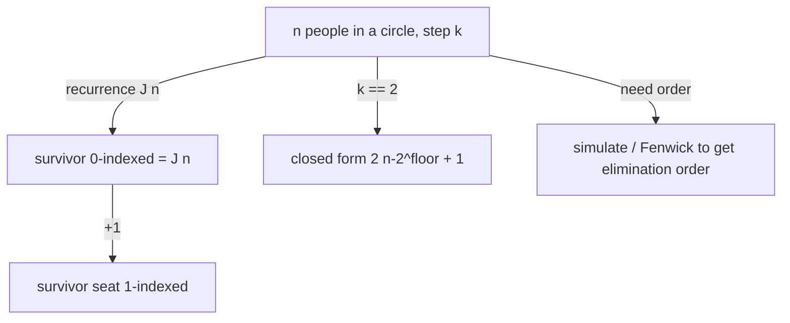

# The Josephus Problem — Junior Level

> **One-line summary:** `n` people stand in a circle and count off; every `k`-th person is eliminated until one survives. The survivor's 0-indexed position is given by the recurrence `J(1) = 0`, `J(n) = (J(n-1) + k) mod n`, computable in `O(n)` time and `O(1)` space.

---

## Table of Contents

1. [Introduction](#introduction)
2. [Prerequisites](#prerequisites)
3. [Glossary](#glossary)
4. [Core Concepts](#core-concepts)
5. [Big-O Summary](#big-o-summary)
6. [Real-World Analogies](#real-world-analogies)
7. [Pros & Cons](#pros--cons)
8. [Step-by-Step Walkthrough](#step-by-step-walkthrough)
9. [Code Examples](#code-examples)
10. [Coding Patterns](#coding-patterns)
11. [Error Handling](#error-handling)
12. [Performance Tips](#performance-tips)
13. [Best Practices](#best-practices)
14. [Edge Cases & Pitfalls](#edge-cases--pitfalls)
15. [Common Mistakes](#common-mistakes)
16. [Cheat Sheet](#cheat-sheet)
17. [Visual Animation](#visual-animation)
18. [Summary](#summary)
19. [Further Reading](#further-reading)

---

## Introduction

Imagine `n` people standing in a circle, numbered `1` to `n`. Starting from person `1`, you count off `1, 2, …, k`, and the `k`-th person steps out of the circle (is "eliminated"). Counting then resumes from the next remaining person, again up to `k`, eliminating another. This repeats — the circle shrinks by one each round — until only a single person is left standing. The question is simple to state and surprisingly fun to answer:

> **Which position survives?**

This is the **Josephus problem**, named after the historian Flavius Josephus. The legend says he and 40 soldiers, trapped by Roman forces, chose mass suicide over capture by arranging themselves in a circle and eliminating every third person. Josephus, preferring to live, supposedly worked out exactly where to stand so he would be the last one remaining.

The brute-force way to answer "who survives?" is to literally simulate the circle: keep a list of people, walk around it counting `k` each time, remove the chosen person, and repeat. That works, but if you remove from the middle of an array it costs `O(n)` per removal and `O(n²)` overall. The beautiful insight of this topic is that you do **not** need to simulate at all. There is a tiny recurrence that gives the survivor directly:

```
J(1) = 0
J(n) = (J(n-1) + k) mod n        (0-indexed)
```

Here `J(n)` is the **0-indexed** position of the survivor among `n` people. You compute `J(2)` from `J(1)`, `J(3)` from `J(2)`, and so on up to `J(n)` — just `n` cheap steps, `O(n)` time and `O(1)` extra space. At the very end you usually add `1` to convert the 0-indexed answer into a human-friendly 1-indexed seat number.

There is an even more striking result for the special case `k = 2` (eliminate every *second* person). Then the survivor has a **closed form** with no loop at all:

```
J(n) = 2·(n − 2^⌊log₂ n⌋) + 1      (1-indexed)
```

In words: write `n` in binary, move the leading `1` bit to the end, and read the result — that is the surviving seat. This "bit rotation" trick is one of the most elegant closed forms in all of combinatorics, and we will derive and use it below.

This file focuses on the circle-elimination picture and the `O(n)` recurrence as the core ideas. The full derivation (why the recurrence is correct) lives in [`middle.md`](./middle.md) and [`professional.md`](./professional.md); production concerns (huge `n`, large `k`, finding the whole elimination order) live in [`senior.md`](./senior.md).

---

## Prerequisites

Before reading this file you should be comfortable with:

- **Modular arithmetic** — `(a + b) mod n`, and why we use `mod` to "wrap around" a circle.
- **0-indexed vs 1-indexed** — counting positions from `0` vs from `1`; almost every Josephus bug is an off-by-one between these two conventions.
- **Recurrence relations** — a value defined in terms of a smaller instance of itself (like `f(n) = f(n-1) + 1`).
- **Loops and arrays / lists** — for the simulation version and for converting between conventions.
- **Big-O notation** — `O(n)`, `O(n²)`, `O(log n)`.

Optional but helpful:

- A glance at **linked lists** and **queues**, used by the simulation approaches.
- Familiarity with **binary representation** of integers (for the `k = 2` closed form).
- The idea of **integer floor of log base 2** (the position of the highest set bit).

---

## Glossary

| Term | Meaning |
|------|---------|
| **Josephus problem** | Given `n` people in a circle and a step `k`, find which position survives when every `k`-th person is eliminated repeatedly. |
| **Step / count `k`** | How far you count each round before eliminating someone. `k = 2` means "every second person". |
| **`J(n)` (or `J(n, k)`)** | The survivor's **0-indexed** position among `n` people with step `k`. |
| **Elimination order** | The sequence in which people are removed (the 1st eliminated, 2nd eliminated, …). |
| **Survivor** | The single person remaining after `n − 1` eliminations. |
| **0-indexed** | Positions numbered `0, 1, …, n−1`. The recurrence is cleanest here. |
| **1-indexed** | Positions numbered `1, 2, …, n`. Human "seat numbers"; convert with `+1`. |
| **Closed form** | A direct formula (no loop), available for `k = 2`. |
| **`2^⌊log₂ n⌋`** | The largest power of two that is `≤ n` (the value of `n`'s highest set bit). |
| **Reindexing** | The trick of renumbering the circle after a removal so a smaller subproblem appears — the heart of the recurrence's proof. |

---

## Core Concepts

### 1. The Circle and the Counting Rule

Place `n` people around a circle. Pick a starting person and a direction. Count `1, 2, …, k` moving in that direction; whoever you land on at `k` is eliminated. Then continue counting from the **next** still-present person, again to `k`, eliminating again. Keep going until one person remains. That last person is the **survivor**.

The number `k` is the *step*. With `k = 1` you eliminate the very first person you count, then the next, then the next — so people leave in order `1, 2, 3, …` and the **last** person (`n`) survives. With `k = 2` you skip one and eliminate the next, which produces the famous bit-rotation answer. Larger `k` walks further around the circle each round.

### 2. The `O(n)` Recurrence (0-indexed)

The central result of this topic is:

```
J(1) = 0                              base case: with 1 person, the survivor is at position 0
J(n) = (J(n-1) + k) mod n             build up from smaller circles
```

`J(n)` is the **0-indexed** position of the survivor in a circle of `n` people, counting `k` each round and starting the count at position `0`.

Why does this work, intuitively? Solve a tiny circle first (1 person — trivially the survivor is position 0). Then, to go from a known answer for `n − 1` people to the answer for `n` people, notice that **the first elimination in an `n`-circle removes the person at position `(k − 1) mod n`**, and afterward the remaining `n − 1` people form exactly the smaller circle you already solved — just shifted. The shift is by `k` positions, and you take it `mod n` to wrap around the circle. The full, careful argument (the "reindexing bijection") is in [`middle.md`](./middle.md); for now, trust the formula and verify it by hand below.

### 3. From 0-Indexed to 1-Indexed

The recurrence returns a **0-indexed** position (`0 … n−1`). People usually number seats from `1`. So the human-facing survivor seat is:

```
survivor_seat = J(n) + 1
```

Forgetting this `+1` (or adding it twice) is the single most common Josephus mistake. Decide your convention once and write it down.

### 4. The Special Case `k = 2` and the Bit-Rotation Closed Form

When `k = 2`, the survivor has a closed form with **no loop**:

```
J(n) = 2·(n − 2^⌊log₂ n⌋) + 1        (1-indexed)
```

Let `L = 2^⌊log₂ n⌋` be the largest power of two `≤ n`, and write `n = L + m` where `0 ≤ m < L`. Then the 1-indexed survivor is `2m + 1`.

There is a gorgeous binary interpretation: if `n = 1 b_{d-1} b_{d-2} … b_1 b_0` in binary (leading bit `1`), then the survivor in binary is `b_{d-1} b_{d-2} … b_1 b_0 1` — i.e. **rotate the leading `1` to the rightmost position**. Example: `n = 41 = 101001₂`; rotating the leading `1` to the end gives `010011₂ = 19`. So among 41 people eliminating every second, seat `19` survives.

### 5. Simulation as the Honest (Slow) Baseline

If you ever doubt the recurrence, you can always *simulate*: keep the people in a list or queue, count around `k` at a time, remove the chosen person, and repeat. This is `O(n·k)` with a naive list (or `O(n)` with a clever circular structure for `k = 2`), and is the **oracle** you test the fast formula against. Simulation also naturally produces the full **elimination order**, which the recurrence alone does not.

### 6. What the Recurrence Gives and What It Doesn't

The recurrence gives the **survivor's position** in `O(n)`. It does **not** directly give the *order* in which people are eliminated, nor the position of the `m`-th person eliminated. Those require simulation or a more advanced data-structure approach (Fenwick tree + binary search, covered in [`middle.md`](./middle.md) and [`senior.md`](./senior.md)).

---

## Big-O Summary

| Operation | Time | Space | Notes |
|-----------|------|-------|-------|
| Survivor via recurrence (any `k`) | **O(n)** | O(1) | The standard method; `n` cheap modular steps. |
| Survivor via `k = 2` closed form | **O(1)** | O(1) | Bit-rotation formula; no loop. |
| Survivor via naive list simulation | O(n·k) | O(n) | Counting `k` and removing from a list each round. |
| Survivor via naive array (remove by shift) | O(n²) | O(n) | Removal from the middle costs `O(n)`. |
| Full elimination order via Fenwick + binary search | O(n log n) | O(n) | Find the `m`-th survivor among the living. |
| `O(k log n)` survivor for small `k`, huge `n` | O(k log n) | O(1) | Jumps over many rounds at once (see middle). |

The headline numbers: **`O(n)`** for the general survivor, and **`O(1)`** for the `k = 2` closed form. Both crush the `O(n²)` naive simulation.

---

## Real-World Analogies

| Concept | Analogy |
|---------|---------|
| The circle of `n` people | Kids sitting in a ring playing "duck, duck, goose" or a counting-out rhyme like "eeny, meeny, miny, moe". |
| Step `k` | How many syllables/beats the rhyme has before someone is "out". |
| Elimination | A player leaving the game when the rhyme lands on them. |
| Survivor `J(n)` | The last kid standing — the "winner" of the counting game. |
| The recurrence | Solving the game for a small ring first, then reasoning about what one extra player does to the answer. |
| `k = 2` bit rotation | A magician's trick: write the headcount in binary, flip the front `1` to the back, and instantly name the safe seat. |

Where the analogy breaks: real counting rhymes sometimes restart from a fixed leader rather than from "the next survivor", which changes the math. The Josephus problem fixes the rule precisely: counting always resumes from the person *after* the one just eliminated.

---

## Pros & Cons

| Pros | Cons |
|------|------|
| The recurrence is `O(n)` time, `O(1)` space — trivial to code and memorize. | The recurrence gives only the survivor, not the elimination order. |
| The `k = 2` case has an `O(1)` closed form (bit rotation) — instant for any `n`. | The closed form is specific to `k = 2`; general `k` has no such simple formula. |
| No data structures needed for the basic survivor query. | Naive simulation is `O(n²)` (array) or `O(n·k)` (list) — much slower. |
| Easy to verify against a brute-force simulation oracle. | Off-by-one between 0-indexed and 1-indexed conventions bites constantly. |
| Generalizes cleanly to "find position to survive" and "general step". | For `k`-th elimination order at scale you need Fenwick/BIT — more machinery. |

**When to use the recurrence:** you only need the surviving position, `n` is up to ~10⁷, and any `k`.

**When to use the `k = 2` closed form:** the step is exactly 2 and you want an instant answer for possibly huge `n`.

**When to simulate:** you need the full elimination order, or `n` is tiny and clarity matters more than speed, or you are building a test oracle.

---

## Step-by-Step Walkthrough

Let us solve a concrete instance by hand: `n = 5` people, step `k = 2`, eliminating every second person. People are seated `1, 2, 3, 4, 5` (1-indexed), and we start counting at person `1`.

**Simulate the circle directly.** Counting `1, 2` starting from person `1`:

```
Circle: 1 2 3 4 5    count 1→person1, 2→person2  ⇒ eliminate 2
Circle: 1 3 4 5      resume at 3: count 1→3, 2→4  ⇒ eliminate 4
Circle: 1 3 5        resume at 5: count 1→5, 2→1  ⇒ eliminate 1
Circle: 3 5          resume at 3: count 1→3, 2→5  ⇒ eliminate 5
Circle: 3            survivor = person 3
```

So with `n = 5, k = 2`, **seat 3 survives**. Elimination order was `2, 4, 1, 5`.

**Now verify with the recurrence (0-indexed).** Build up `J(1) … J(5)` using `J(n) = (J(n-1) + 2) mod n`:

```
J(1) = 0
J(2) = (J(1) + 2) mod 2 = (0 + 2) mod 2 = 0
J(3) = (J(2) + 2) mod 3 = (0 + 2) mod 3 = 2
J(4) = (J(3) + 2) mod 4 = (2 + 2) mod 4 = 0
J(5) = (J(4) + 2) mod 5 = (0 + 2) mod 5 = 2
```

`J(5) = 2` (0-indexed). Convert to 1-indexed: `2 + 1 = 3`. The recurrence agrees with the simulation — **seat 3**.

**Now verify with the `k = 2` closed form.** The largest power of two `≤ 5` is `L = 4 = 2²`. Write `n = L + m = 4 + 1`, so `m = 1`. The 1-indexed survivor is `2m + 1 = 2·1 + 1 = 3`. All three methods agree: **seat 3 survives**.

The binary view: `5 = 101₂`. Rotate the leading `1` to the end → `011₂ = 3`. Same answer, instantly.

---

## Code Examples

### Example: Survivor by the `O(n)` Recurrence (any `k`)

This builds `J(1) … J(n)` iteratively and returns both the 0-indexed and 1-indexed survivor.

#### Go

```go
package main

import "fmt"

// josephus returns the 0-indexed survivor position for n people, step k.
func josephus(n, k int) int {
	res := 0 // J(1) = 0
	for m := 2; m <= n; m++ {
		res = (res + k) % m
	}
	return res
}

func main() {
	n, k := 5, 2
	zero := josephus(n, k)
	fmt.Printf("n=%d k=%d: survivor 0-indexed = %d, seat = %d\n", n, k, zero, zero+1)
	// n=5 k=2: survivor 0-indexed = 2, seat = 3
}
```

#### Java

```java
public class Josephus {
    // 0-indexed survivor position for n people, step k.
    static int josephus(int n, int k) {
        int res = 0; // J(1) = 0
        for (int m = 2; m <= n; m++) {
            res = (res + k) % m;
        }
        return res;
    }

    public static void main(String[] args) {
        int n = 5, k = 2;
        int zero = josephus(n, k);
        System.out.println("n=" + n + " k=" + k +
            ": survivor 0-indexed = " + zero + ", seat = " + (zero + 1));
        // survivor 0-indexed = 2, seat = 3
    }
}
```

#### Python

```python
def josephus(n: int, k: int) -> int:
    """0-indexed survivor position for n people, step k."""
    res = 0  # J(1) = 0
    for m in range(2, n + 1):
        res = (res + k) % m
    return res


if __name__ == "__main__":
    n, k = 5, 2
    zero = josephus(n, k)
    print(f"n={n} k={k}: survivor 0-indexed = {zero}, seat = {zero + 1}")
    # n=5 k=2: survivor 0-indexed = 2, seat = 3
```

**What it does:** runs the `O(n)` recurrence and prints both index conventions.
**Run:** `go run main.go` | `javac Josephus.java && java Josephus` | `python josephus.py`

### Example: The `k = 2` Closed Form (bit rotation)

#### Go

```go
package main

import (
	"fmt"
	"math/bits"
)

// josephus2 returns the 1-indexed survivor for step k = 2.
func josephus2(n int) int {
	if n <= 0 {
		panic("n must be positive")
	}
	// L = largest power of two <= n
	L := 1 << (bits.Len(uint(n)) - 1)
	return 2*(n-L) + 1
}

func main() {
	for _, n := range []int{1, 5, 41, 100} {
		fmt.Printf("n=%d: k=2 survivor seat = %d\n", n, josephus2(n))
	}
	// n=41 -> 19
}
```

#### Java

```java
public class Josephus2 {
    // 1-indexed survivor for step k = 2.
    static int josephus2(int n) {
        if (n <= 0) throw new IllegalArgumentException("n must be positive");
        int L = Integer.highestOneBit(n); // largest power of two <= n
        return 2 * (n - L) + 1;
    }

    public static void main(String[] args) {
        for (int n : new int[]{1, 5, 41, 100}) {
            System.out.println("n=" + n + ": k=2 survivor seat = " + josephus2(n));
        }
        // n=41 -> 19
    }
}
```

#### Python

```python
def josephus2(n: int) -> int:
    """1-indexed survivor for step k = 2 (bit-rotation closed form)."""
    if n <= 0:
        raise ValueError("n must be positive")
    L = 1 << (n.bit_length() - 1)  # largest power of two <= n
    return 2 * (n - L) + 1


if __name__ == "__main__":
    for n in (1, 5, 41, 100):
        print(f"n={n}: k=2 survivor seat = {josephus2(n)}")
    # n=41 -> 19
```

**What it does:** computes the `k = 2` survivor in `O(1)` via the highest-set-bit trick.

---

## Coding Patterns

### Pattern 1: Brute-Force Simulation (the oracle you test against)

**Intent:** Before trusting the recurrence, simulate the circle the slow, obvious way and confirm they agree on small inputs.

```python
def josephus_simulate(n, k):
    """Return the 1-indexed survivor by direct simulation. O(n*k)."""
    people = list(range(1, n + 1))
    idx = 0
    while len(people) > 1:
        idx = (idx + k - 1) % len(people)  # k-th person, 0-indexed step
        people.pop(idx)                    # eliminate; next count starts here
    return people[0]
```

This is `O(n·k)` and easy to read. The fast recurrence must give the same survivor (after the `+1` conversion) for every small `n, k`.

### Pattern 2: Capture the Full Elimination Order

**Intent:** "In what order do people leave?" — simulation naturally records it.

```python
def elimination_order(n, k):
    """Return the list of eliminated people (1-indexed), in order."""
    people = list(range(1, n + 1))
    idx = 0
    order = []
    while people:
        idx = (idx + k - 1) % len(people)
        order.append(people.pop(idx))
    return order  # last element is the survivor
```

### Pattern 3: Choose Where to Stand

**Intent:** "If I want to survive, which seat do I take?" — that is exactly `J(n) + 1` for the chosen `k`. Compute the recurrence, add one, and stand there.



---

## Error Handling

| Error | Cause | Fix |
|-------|-------|-----|
| Survivor off by one | Mixed 0-indexed recurrence with 1-indexed expectation. | Decide a convention; convert with a single explicit `+1`. |
| Wrong answer for `k = 1` | Forgot that `k = 1` eliminates in order and person `n` survives. | The recurrence handles it: `J(n) = (J(n-1) + 1) mod n`. |
| `mod 0` / divide-by-zero | Loop ran with circle size `0`, or `n = 0`. | Validate `n ≥ 1`; loop `m` from `2` to `n`. |
| Infinite loop in simulation | Forgot to remove the eliminated person, or wrong index math. | Use `(idx + k - 1) % len`, then `pop(idx)`. |
| Overflow for huge `n, k` | `J(n-1) + k` exceeds the integer range before `mod`. | Use 64-bit integers; reduce `k mod m` if `k` is large. |
| Closed form gives wrong seat | Used the `k = 2` formula when `k ≠ 2`. | The bit-rotation form is **only** valid for `k = 2`. |

---

## Performance Tips

- **Prefer the recurrence over simulation** — `O(n)` beats `O(n²)` decisively once `n` is more than a few thousand.
- **Reduce `k` modulo the circle size** inside the loop if `k` can be enormous: `(res + k % m) % m` avoids large intermediate sums.
- **Use the `k = 2` closed form** whenever the step is exactly 2 — it is `O(1)` and needs no loop at all.
- **Use the highest-set-bit intrinsic** (`bits.Len`, `Integer.highestOneBit`, `int.bit_length`) instead of a manual loop to find `2^⌊log₂ n⌋`.
- **Avoid array `pop` from the middle** in simulation; it is `O(n)` per removal. A linked list or a Fenwick tree is far better if you must simulate at scale.

---

## Best Practices

- Always state your **index convention** (0-indexed or 1-indexed) at the top of the function and in its doc comment.
- Test the recurrence against the brute-force simulation oracle (Pattern 1) on every small `(n, k)` pair before trusting it on large inputs.
- Keep the base case explicit: `J(1) = 0`. Do not start the loop at `m = 1` (that would `mod 1`, which is fine but pointless).
- For the `k = 2` formula, validate `n ≥ 1` and use a tested highest-bit helper.
- Document clearly whether your function returns the **survivor** or the **elimination order** — they are different outputs that callers confuse.
- When `k` is large, normalize it with `k mod m` per step to keep arithmetic small and overflow-free.

---

## Edge Cases & Pitfalls

- **`n = 1`** — the lone person survives; `J(1) = 0`, seat `1`. The recurrence loop never runs.
- **`k = 1`** — people are eliminated in order `1, 2, …, n−1`, and person `n` survives. The recurrence gives `J(n) = n − 1` (0-indexed).
- **`k = 2`** — use the closed form; the survivor is `2·(n − 2^⌊log₂ n⌋) + 1` (1-indexed).
- **`k > n`** — perfectly fine; counting wraps around the circle multiple times. The `mod m` handles it.
- **Power-of-two `n` with `k = 2`** — when `n` is exactly a power of two, `m = 0`, so the survivor seat is `1`. (E.g. `n = 8 → seat 1`.)
- **Starting position** — the recurrence assumes counting starts at position `0`. If your problem starts elsewhere, rotate the final answer accordingly.
- **Huge `n` with general `k`** — `O(n)` may be too slow at `n = 10^18`; that needs the `O(k log n)` method (see [`middle.md`](./middle.md)).

---

## Common Mistakes

1. **Off-by-one between 0-indexed and 1-indexed** — the recurrence is 0-indexed; humans want 1-indexed. Convert exactly once with `+1`.
2. **Returning `1` for the base case** instead of `0` — `J(1) = 0` in the 0-indexed recurrence.
3. **Using the `k = 2` closed form for `k ≠ 2`** — it is valid only for step 2; general `k` needs the recurrence.
4. **Simulating with array removal from the middle** — that is `O(n²)`; use the recurrence or a better structure.
5. **Confusing "survivor" with "elimination order"** — the recurrence gives only the survivor.
6. **Forgetting `mod` wraps the circle** — without `mod m` the count would run off the end of the (shrinking) circle.
7. **Starting the loop at the wrong base** — start at `m = 2` with `res = 0`; do not initialize `res = 1`.

---

## Cheat Sheet

| Question | Tool | Formula |
|----------|------|---------|
| Survivor, any `k`, 0-indexed | recurrence | `J(1)=0; J(n)=(J(n-1)+k) mod n` |
| Survivor, any `k`, 1-indexed | recurrence + 1 | `J(n) + 1` |
| Survivor, `k = 2`, 1-indexed | closed form | `2·(n − 2^⌊log₂ n⌋) + 1` |
| Survivor, `k = 2`, binary view | rotate leading bit | move leading `1` of `n` to the end |
| `k = 1` survivor | direct | person `n` (0-indexed `n − 1`) |
| Full elimination order | simulate | list-pop loop, `O(n·k)` |
| Huge `n`, small `k` | `O(k log n)` method | see middle.md |

Core algorithm:

```
josephus(n, k):                  # 0-indexed survivor
    res = 0                      # J(1)
    for m in 2..n:
        res = (res + k) % m
    return res                   # add 1 for a 1-indexed seat
# cost: O(n) time, O(1) space
```

---

## Visual Animation

> See [`animation.html`](./animation.html) for an interactive visualization.
>
> The animation demonstrates:
> - `n` people drawn around a circle, with adjustable `n` and `k`
> - The counting pointer walking `k` steps and eliminating the landed-on person
> - The running count of remaining people and the elimination order so far
> - The surviving position highlighted at the end, with Play / Pause / Step / Reset controls

---

## Summary

The Josephus problem asks who survives when `n` people in a circle eliminate every `k`-th person. You can simulate it directly (slow: `O(n²)` with an array), but the elegant answer is the `O(n)` recurrence `J(1) = 0`, `J(n) = (J(n-1) + k) mod n`, which builds the survivor's 0-indexed position up from a circle of one. Add `1` to get a human seat number. For the special step `k = 2`, the survivor has an `O(1)` closed form — `2·(n − 2^⌊log₂ n⌋) + 1` — equivalent to rotating the leading binary `1` of `n` to the end. Always pin down your index convention, test against a simulation oracle, and remember the recurrence gives the survivor but not the elimination order.

---

## Further Reading

- *Concrete Mathematics* (Graham, Knuth, Patashnik) — the Josephus problem and its `k = 2` bit-rotation closed form, derived in detail.
- cp-algorithms.com — "Josephus problem" (recurrence and the `O(k log n)` method).
- Sibling topic `13-dynamic-programming` — the recurrence-as-DP perspective.
- Sibling structures `04-linked-lists` and `10-heaps` — data structures for efficient simulation.
- Wikipedia — "Josephus problem" for the historical background and variants.
