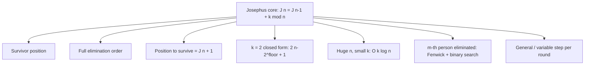

# The Josephus Problem — Middle Level

> **Focus:** *Why* the recurrence `J(n) = (J(n-1) + k) mod n` is correct (the reindexing bijection), the `k = 2` bit-rotation closed form and its proof, the `O(k log n)` method for small `k` with astronomically large `n`, the simulation methods (linked list and Fenwick + binary search) that recover the full elimination order, and how to choose among them.

---

## Table of Contents

1. [Introduction](#introduction)
2. [Deeper Concepts](#deeper-concepts)
3. [Comparison with Alternatives](#comparison-with-alternatives)
4. [Advanced Patterns](#advanced-patterns)
5. [Variants and Their Solutions](#variants-and-their-solutions)
6. [Finding the Elimination Order](#finding-the-elimination-order)
7. [Code Examples](#code-examples)
8. [Error Handling](#error-handling)
9. [Performance Analysis](#performance-analysis)
10. [Best Practices](#best-practices)
11. [Visual Animation](#visual-animation)
12. [Summary](#summary)

---

## Introduction

At junior level the message was a single recurrence: `J(n) = (J(n-1) + k) mod n`. At middle level you start asking the questions that decide whether your solution is correct *and* fast enough:

- *Why* is the recurrence true? Where does the `+k` and the `mod n` come from?
- Why does `k = 2` collapse to a one-line closed form, and how do you prove the bit-rotation form?
- If `n = 10^18` but `k` is small (say `k = 2` or `k = 7`), the `O(n)` loop is hopeless — how do you get to `O(k log n)`?
- How do you recover the *entire* elimination order, not just the survivor, and do it in `O(n log n)` instead of `O(n²)`?
- Which simulation data structure — linked list, queue, or Fenwick tree — fits which job?

These are the questions that separate "I memorized the recurrence" from "I can derive it, prove the closed form, and pick the right algorithm for the constraints in front of me."

---

## Deeper Concepts

### The recurrence, derived by reindexing

Number the `n` people `0, 1, …, n−1` (0-indexed) and start the count at position `0`. With step `k`, the **first** person eliminated is at position

```
p = (k − 1) mod n
```

(You count `k` people starting from `0`, landing on index `k−1`, wrapped mod `n`.) After this removal, `n − 1` people remain, and counting resumes from the person at position `(p + 1) mod n = k mod n`. Call that person the new "position 0" of a fresh circle of size `n − 1`.

Here is the key observation: **the remaining `n − 1` people, renumbered starting from where counting resumes, form exactly the Josephus problem on `n − 1` people.** If the survivor of that smaller problem is at *renumbered* position `J(n−1)`, then in the *original* numbering that same person sits at:

```
(J(n−1) + k) mod n
```

because the new "position 0" was the original position `k mod n`, so renumbered position `x` maps back to original position `(x + k) mod n`. Hence:

```
J(n) = (J(n−1) + k) mod n,     J(1) = 0.
```

The `+k` is the shift to the resume point; the `mod n` wraps it around the original circle. The full bijection proof (that the renumbering is a genuine one-to-one correspondence) is in [`professional.md`](./professional.md). The mental picture: **solve the smaller circle, then undo the renumbering shift.**

### A subtle but important convention

The recurrence above assumes the count starts at position `0` and the first person counted is position `0` (so `k = 1` would eliminate position `0` first). Many references and contest statements instead start counting so that the first eliminated person is position `k − 1`; this matches the formula above. If your problem starts the count elsewhere or counts the starting person as "0", you must rotate the final answer. Always pin this down against a small hand-simulation.

### Why `k = 2` has a closed form

For `k = 2`, unroll the recurrence and watch the structure. Write `n = 2^a + ℓ` where `2^a` is the largest power of two `≤ n` and `0 ≤ ℓ < 2^a`. After the **first pass** around a circle whose size is a power of two, the counting realigns perfectly with the start — every even position is removed and you are back at position `0` with a clean half-size circle. The leftover `ℓ` "extra" people beyond the power of two are exactly what shifts the answer. The result is:

```
J(n) = 2ℓ      (0-indexed),   i.e.   J(n) = 2ℓ + 1   (1-indexed)
```

with `ℓ = n − 2^a`. Substituting `2^a = 2^⌊log₂ n⌋`:

```
J(n) = 2·(n − 2^⌊log₂ n⌋) + 1     (1-indexed).
```

### The bit-rotation interpretation

Write `n` in binary as `1 b_{a-1} … b_1 b_0` (the leading bit is `1` because `2^a ≤ n < 2^{a+1}`). Then `ℓ = n − 2^a = b_{a-1} … b_1 b_0` (drop the leading `1`), and `2ℓ + 1` is `b_{a-1} … b_1 b_0 1` — the same bits with a `1` appended at the right. Equivalently, **rotate the leading `1` of `n` to the least-significant position**:

```
n = 41 = 1 0 1 0 0 1₂   →   rotate leading 1 to the end   →   0 1 0 0 1 1₂ = 19
```

So among 41 people, eliminating every second, seat 19 survives. This is a cyclic left rotation by one bit of the `(a+1)`-bit representation of `n`. The proof (induction splitting `n` into even/odd) is in [`professional.md`](./professional.md).

### The `O(k log n)` method for huge `n`, small `k`

When `n` is astronomically large but `k` is small, the `O(n)` loop is infeasible. The trick: the recurrence advances the answer by `+k mod m` at each size `m`. For the *first* `k − 1` increments (sizes `m = 2 … k`), the index `res + k` may wrap; but once `m > res + k`, several consecutive steps add a plain `+k` with no wrap, and you can **batch** them.

More precisely, the standard speedup works in the *other* direction of the recurrence and jumps over whole groups of eliminations at once. With `k` small, each full sweep around the circle removes about `⌊m/k⌋` people, shrinking the problem by a constant factor; doing this carefully gives `O(k log n)`. A clean formulation: simulate "rounds" where each round removes `⌊cnt/k⌋` people in one batch (when the count doesn't wrap within the round), and recurse on the remainder. The recursion depth is `O(log n / log(k/(k−1)))`, which is `O(k log n)` overall.

We give a correct, compact `O(k log n)` implementation in the [Code Examples](#code-examples). For `k = 2`, prefer the closed form — it is `O(1)`.

---

## Comparison with Alternatives

### Survivor: which method when

| Approach | Time | Space | Good when |
|----------|------|-------|-----------|
| Array simulation (remove by shift) | `O(n²)` | `O(n)` | tiny `n`, teaching only |
| List / queue simulation | `O(n·k)` | `O(n)` | need the elimination order, modest `n` |
| `O(n)` recurrence | `O(n)` | `O(1)` | survivor only, `n` up to ~10⁷, any `k` |
| `k = 2` closed form | `O(1)` | `O(1)` | step is exactly 2, any `n` (even huge) |
| `O(k log n)` recurrence | `O(k log n)` | `O(1)` | huge `n` (e.g. 10¹⁸), small `k` |
| Fenwick + binary search | `O(n log n)` | `O(n)` | need full elimination order at scale |

Concrete table (`k` general):

| `n` | `O(n)` recurrence ops | `O(n·k)` sim (`k = 5`) | `O(k log n)` ops (`k = 5`) | Winner |
|------|----------------------|------------------------|----------------------------|--------|
| 10³ | 1 000 | 5 000 | ~50 | `O(k log n)` (survivor) |
| 10⁶ | 1 000 000 | 5 000 000 | ~100 | `O(k log n)` |
| 10⁹ | 1 000 000 000 | infeasible | ~150 | `O(k log n)` |
| 10¹⁸ | infeasible | infeasible | ~300 | `O(k log n)` |

The lesson: for **survivor-only** queries with small `k` and large `n`, `O(k log n)` dominates. For **order** queries, you cannot avoid touching every person, so `O(n log n)` (Fenwick) is the target. For `k = 2`, nothing beats the closed form.

### Recurrence vs simulation philosophically

The recurrence is a **dynamic program**: `J(n)` depends only on `J(n−1)`, one subproblem, so it is `O(n)` time and `O(1)` space (you keep only the last value). Simulation is an **explicit model** of the physical process; it is slower but yields side information (the order) the recurrence discards. Choose based on what output you actually need.

---

## Advanced Patterns

### Pattern: `O(k log n)` survivor for huge `n`

This computes the 0-indexed survivor for small `k`, large `n`, without an `O(n)` loop.

#### Go

```go
package main

import "fmt"

// josephusFast returns the 0-indexed survivor for n people, step k.
// Runs in O(k log n): it batches the increments that do not wrap.
func josephusFast(n, k int64) int64 {
	if k == 1 {
		return n - 1
	}
	res := int64(0) // J(k) base handled by the loop below from m=2
	m := int64(2)
	for m <= n {
		if res+k < m {
			// many steps add a plain +k with no wrap: batch them.
			cnt := (m - res - 1) / k // how many sizes we can skip
			if m+cnt > n {
				cnt = n - m
			}
			res += cnt * k
			m += cnt
		} else {
			res = (res + k) % m
			m++
		}
	}
	return res
}

func main() {
	fmt.Println(josephusFast(5, 2))    // 2  (seat 3)
	fmt.Println(josephusFast(1_000_000_000, 3))
}
```

#### Java

```java
public class JosephusFast {
    // 0-indexed survivor, O(k log n).
    static long josephusFast(long n, long k) {
        if (k == 1) return n - 1;
        long res = 0;
        long m = 2;
        while (m <= n) {
            if (res + k < m) {
                long cnt = (m - res - 1) / k;
                if (m + cnt > n) cnt = n - m;
                res += cnt * k;
                m += cnt;
            } else {
                res = (res + k) % m;
                m++;
            }
        }
        return res;
    }

    public static void main(String[] args) {
        System.out.println(josephusFast(5, 2));            // 2
        System.out.println(josephusFast(1_000_000_000L, 3));
    }
}
```

#### Python

```python
def josephus_fast(n: int, k: int) -> int:
    """0-indexed survivor for n people, step k. O(k log n)."""
    if k == 1:
        return n - 1
    res = 0
    m = 2
    while m <= n:
        if res + k < m:
            cnt = (m - res - 1) // k   # sizes we can skip without wrapping
            if m + cnt > n:
                cnt = n - m
            res += cnt * k
            m += cnt
        else:
            res = (res + k) % m
            m += 1
    return res


if __name__ == "__main__":
    print(josephus_fast(5, 2))            # 2  (seat 3)
    print(josephus_fast(1_000_000_000, 3))
```

The batching step jumps over all sizes `m` for which `res + k < m` still holds, advancing `res` by `cnt·k` in one move. Because each "wrap" step (`res = (res + k) % m`) only happens about `O(k log n)` times overall, the loop is `O(k log n)`. Always validate against the plain `O(n)` recurrence for small `n`.

### Pattern: linked-list simulation (clean elimination order)

A circular singly linked list models the circle directly. Removing a node is `O(1)` once you are pointing at its predecessor, but you still walk `k` links per elimination, so it is `O(n·k)`.

### Pattern: Fenwick + binary search (order in `O(n log n)`)

Maintain a Fenwick (Binary Indexed) tree over `n` slots, each initially `1` (alive). To eliminate the `m`-th living person from the current pointer, you binary-search for the position whose prefix sum of "alive" flags equals the target rank, then set that slot to `0`. Each elimination is `O(log n)` (binary search over the Fenwick prefix sums), giving `O(n log n)` for the whole order. This is the scalable way to produce the full elimination order.

---

## Variants and Their Solutions



### Variant 1: find the position to survive

This is just the survivor query restated: compute `J(n)` for the given `k`, add `1`, and that seat survives. If you want to survive with a *chosen* `k`, you can search over `k` to find a step that lands you on your seat.

### Variant 2: the `m`-th person eliminated

"Who is the `m`-th person removed?" cannot be read off the survivor recurrence. Either simulate (and record the order), or use the Fenwick + binary-search structure to find the `m`-th elimination directly. There is also a clever `O(m)`-style direct recurrence for the *last few* eliminated, but the Fenwick approach is the general workhorse.

### Variant 3: general / variable step

If the step changes each round (`k_1, k_2, …`), the closed form is lost, but the reindexing recurrence still works: at the round that reduces size `m` to `m−1`, use the step for that round in `(res + k_m) % m`. Simulation also handles it directly.

### Variant 4: counting in the other direction / different start

Reversing direction or starting the count at a different seat is a relabeling of the circle. Solve the standard problem, then apply the inverse relabeling (a rotation and/or reflection) to the answer. Verify with a tiny hand-simulation, because the off-by-one here is brutal.

---

## Finding the Elimination Order

The survivor recurrence is `O(n)` but discards the order. To get the order:

- **Simulation (list/queue):** `O(n·k)`, simplest, fine for modest `n`.
- **Fenwick + binary search:** `O(n log n)`, the scalable choice; track a running position and repeatedly find/remove the `k`-th living person.

The Fenwick idea in one paragraph: keep `bit[]` where the prefix sum `sum(i)` counts living people in slots `1..i`. The current pointer sits at some living slot; the next eliminated is the living person `k` steps ahead (cyclically). Convert "`k` steps ahead among the living" into a target rank, binary-search the smallest index whose prefix sum equals that rank, eliminate it (`update(idx, -1)`), and continue. Each step is `O(log n)`.

---

## Code Examples

### Survivor recurrence, `k = 2` closed form, and a simulation oracle (one file)

#### Python

```python
def josephus_recurrence(n: int, k: int) -> int:
    """0-indexed survivor, O(n)."""
    res = 0
    for m in range(2, n + 1):
        res = (res + k) % m
    return res


def josephus_k2(n: int) -> int:
    """1-indexed survivor for k = 2, O(1)."""
    L = 1 << (n.bit_length() - 1)
    return 2 * (n - L) + 1


def josephus_simulate(n: int, k: int):
    """Return (survivor_1indexed, elimination_order_1indexed). O(n*k)."""
    people = list(range(1, n + 1))
    idx = 0
    order = []
    while len(people) > 1:
        idx = (idx + k - 1) % len(people)
        order.append(people.pop(idx))
    return people[0], order


if __name__ == "__main__":
    n, k = 5, 2
    assert josephus_recurrence(n, k) + 1 == josephus_simulate(n, k)[0]
    assert josephus_k2(n) == josephus_simulate(n, 2)[0]
    print("survivor:", josephus_recurrence(n, k) + 1)            # 3
    print("k=2 closed form:", josephus_k2(41))                   # 19
    print("order for n=5,k=2:", josephus_simulate(n, k)[1])      # [2,4,1,5]
```

#### Go

```go
package main

import (
	"fmt"
	"math/bits"
)

func josephusRecurrence(n, k int) int {
	res := 0
	for m := 2; m <= n; m++ {
		res = (res + k) % m
	}
	return res
}

func josephusK2(n int) int {
	L := 1 << (bits.Len(uint(n)) - 1)
	return 2*(n-L) + 1
}

func josephusSimulate(n, k int) (int, []int) {
	people := make([]int, n)
	for i := range people {
		people[i] = i + 1
	}
	idx := 0
	order := []int{}
	for len(people) > 1 {
		idx = (idx + k - 1) % len(people)
		order = append(order, people[idx])
		people = append(people[:idx], people[idx+1:]...)
	}
	return people[0], order
}

func main() {
	n, k := 5, 2
	fmt.Println("survivor:", josephusRecurrence(n, k)+1) // 3
	fmt.Println("k=2 closed:", josephusK2(41))            // 19
	surv, order := josephusSimulate(n, k)
	fmt.Println("sim survivor:", surv, "order:", order)   // 3 [2 4 1 5]
}
```

#### Java

```java
import java.util.*;

public class JosephusMiddle {
    static int recurrence(int n, int k) {
        int res = 0;
        for (int m = 2; m <= n; m++) res = (res + k) % m;
        return res;
    }

    static int k2(int n) {
        int L = Integer.highestOneBit(n);
        return 2 * (n - L) + 1;
    }

    static int[] simulate(int n, int k) {
        List<Integer> people = new ArrayList<>();
        for (int i = 1; i <= n; i++) people.add(i);
        List<Integer> order = new ArrayList<>();
        int idx = 0;
        while (people.size() > 1) {
            idx = (idx + k - 1) % people.size();
            order.add(people.remove(idx));
        }
        int[] out = new int[order.size() + 1];
        for (int i = 0; i < order.size(); i++) out[i] = order.get(i);
        out[out.length - 1] = people.get(0); // survivor last
        return out;
    }

    public static void main(String[] args) {
        System.out.println("survivor: " + (recurrence(5, 2) + 1)); // 3
        System.out.println("k=2 closed: " + k2(41));               // 19
        System.out.println("order+surv: " + Arrays.toString(simulate(5, 2)));
    }
}
```

### Fenwick + binary search for the elimination order

#### Python

```python
def elimination_order_fenwick(n: int, k: int):
    """Full elimination order (1-indexed) in O(n log n)."""
    bit = [0] * (n + 1)

    def update(i, v):
        while i <= n:
            bit[i] += v
            i += i & (-i)

    def prefix(i):  # sum of slots 1..i
        s = 0
        while i > 0:
            s += bit[i]
            i -= i & (-i)
        return s

    for i in range(1, n + 1):
        update(i, 1)  # everyone alive

    def find_kth(rank):  # smallest idx with prefix(idx) == rank
        pos, acc = 0, 0
        log = n.bit_length()
        for j in range(log, -1, -1):
            nxt = pos + (1 << j)
            if nxt <= n and acc + bit[nxt] < rank:
                pos = nxt
                acc += bit[nxt]
        return pos + 1

    order = []
    alive = n
    cur = 0  # 0-indexed living rank just before the count
    while alive > 0:
        cur = (cur + k - 1) % alive  # 0-indexed rank of victim among living
        idx = find_kth(cur + 1)      # 1-indexed slot
        order.append(idx)
        update(idx, -1)
        alive -= 1
    return order


if __name__ == "__main__":
    print(elimination_order_fenwick(5, 2))  # [2, 4, 1, 5, 3]
```

---

## Error Handling

| Scenario | What goes wrong | Correct approach |
|----------|-----------------|------------------|
| `n = 0` | Loop/`mod` misbehaves; empty circle. | Validate `n ≥ 1`; return undefined/error for `0`. |
| `k = 0` | Counting never advances → no elimination. | Require `k ≥ 1`. |
| Off-by-one survivor | Mixed 0-/1-indexed across recurrence and simulation. | Convert exactly once; assert both agree on small inputs. |
| Overflow at huge `n, k` | `res + k` or `cnt·k` exceeds range. | Use 64-bit; reduce `k mod m` where applicable. |
| `O(n)` too slow | Used the loop for `n = 10^18`. | Use `O(k log n)` (small `k`) or the `k = 2` closed form. |
| Wrong elimination order | Fenwick rank math off by one. | Test the Fenwick order against the list-simulation order. |
| `k = 2` closed form wrong | Applied for `k ≠ 2`. | The closed form is `k = 2` only. |

---

## Performance Analysis

| `n` | `O(n)` recurrence | `O(k log n)` (`k = 5`) | `k = 2` closed form |
|-----|-------------------|------------------------|---------------------|
| 10³ | ~10³ ops, instant | ~50 ops | `O(1)` |
| 10⁶ | ~10⁶ ops, instant | ~100 ops | `O(1)` |
| 10⁹ | ~10⁹ ops, ~seconds | ~150 ops, instant | `O(1)` |
| 10¹⁸ | infeasible | ~300 ops, instant | `O(1)` |

The `O(n)` recurrence is excellent up to ~10⁷–10⁸. Beyond that, only the closed form (`k = 2`) or the `O(k log n)` method (small `k`) scale. Producing the full elimination order is inherently `Ω(n)`, so `O(n log n)` Fenwick is the practical ceiling for the order at scale.

```python
import time

def benchmark_recurrence(n, k):
    start = time.perf_counter()
    res = 0
    for m in range(2, n + 1):
        res = (res + k) % m
    return time.perf_counter() - start
# n = 10**7, k = 7 -> ~1-2s in CPython; instant in Go/Java.
```

The single biggest win for survivor-only queries on huge `n` is switching from the `O(n)` loop to `O(k log n)` (or the closed form for `k = 2`).

---

## Best Practices

- **Pick `n`-and-`k`-aware:** small `n` → recurrence; huge `n`, small `k` → `O(k log n)`; `k = 2` → closed form; need order → Fenwick.
- **Keep the index convention explicit** in every signature and doc comment; convert with a single `+1`.
- **Always test against the simulation oracle** on random small `(n, k)` before trusting the fast paths.
- **Reduce `k mod m`** inside the recurrence when `k` can be large, to avoid overflow and keep arithmetic small.
- **Separate "survivor" from "order"** in your API; they are different outputs with different costs.
- **Use highest-set-bit intrinsics** for the `k = 2` formula rather than a manual loop.

---

## Visual Animation

> See [`animation.html`](./animation.html) for an interactive view.
>
> The middle-level animation highlights:
> - People arranged on a circle with adjustable `n` and `k`.
> - The counting pointer stepping `k` at a time and the eliminated person fading out.
> - The elimination order accumulating in a side panel, and the survivor highlighted at the end.
> - The running count of remaining people, so you can match it against the recurrence's intermediate `J(m)` values.

---

## Summary

The recurrence `J(n) = (J(n-1) + k) mod n` is correct because removing the first victim and renumbering from the resume point turns an `n`-circle into the already-solved `(n−1)`-circle, shifted by `k` — so you add `k` and wrap mod `n`. For `k = 2`, unrolling reveals the closed form `J(n) = 2·(n − 2^⌊log₂ n⌋) + 1` (1-indexed), equivalent to rotating the leading binary `1` of `n` to the end. When `n` is huge but `k` is small, batch the non-wrapping increments to reach `O(k log n)`; for `k = 2` the closed form is `O(1)`. Simulation (list/queue, `O(n·k)`) and Fenwick + binary search (`O(n log n)`) recover the full elimination order that the recurrence discards. Always pin the index convention and test the fast methods against a brute-force simulation oracle.
