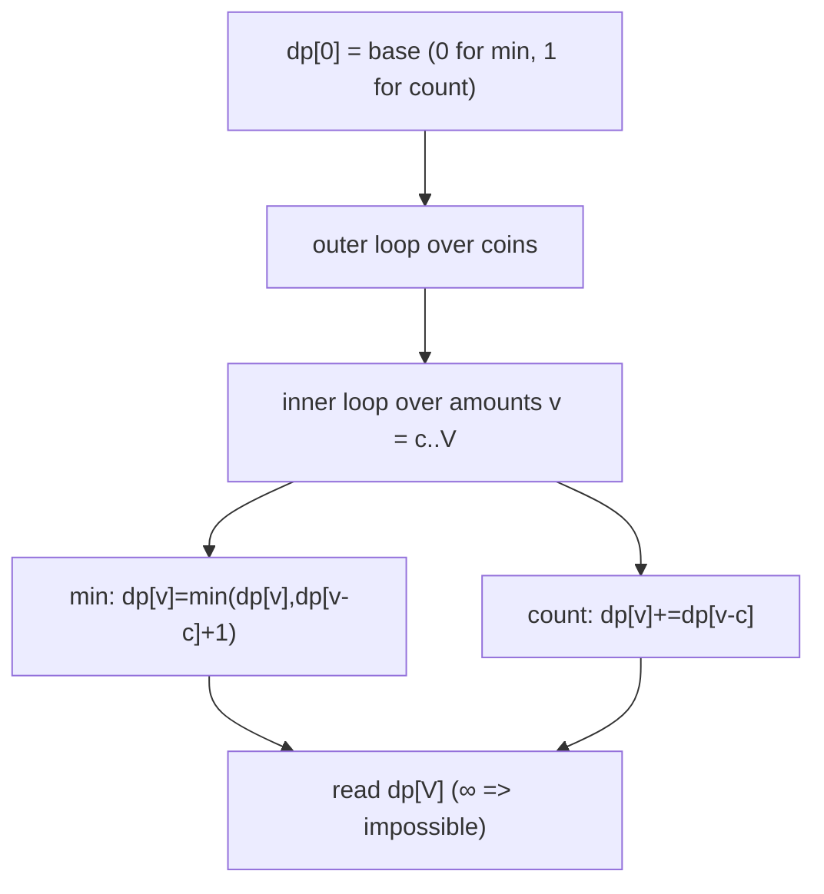

# Coin Change (Unbounded Counting DP) — Junior Level

> **One-line summary:** Coin Change is the canonical unbounded dynamic-programming problem. Two flavors share one `O(V·n)` table: (1) the **fewest coins** to make an amount `V` is `dp[v] = min over coins c of dp[v-c] + 1`, and (2) the **number of ways** to make `V` is `dp[v] += dp[v-c]` — but the **loop order decides** whether you count combinations or permutations.

---

## Table of Contents

1. [Introduction](#introduction)
2. [Prerequisites](#prerequisites)
3. [Glossary](#glossary)
4. [Core Concepts](#core-concepts)
5. [Big-O Summary](#big-o-summary)
6. [Real-World Analogies](#real-world-analogies)
7. [Pros & Cons](#pros--cons)
8. [Step-by-Step Walkthrough](#step-by-step-walkthrough)
9. [Code Examples](#code-examples)
10. [Coding Patterns](#coding-patterns)
11. [Error Handling](#error-handling)
12. [Performance Tips](#performance-tips)
13. [Best Practices](#best-practices)
14. [Edge Cases & Pitfalls](#edge-cases--pitfalls)
15. [Common Mistakes](#common-mistakes)
16. [Cheat Sheet](#cheat-sheet)
17. [Visual Animation](#visual-animation)
18. [Summary](#summary)
19. [Further Reading](#further-reading)

---

## Introduction

Imagine you are a cashier with an **unlimited supply** of coins in a few fixed denominations — say `{1, 2, 5}` — and a customer needs exactly `11` units of change. Two natural questions arise:

- *"What is the **fewest** number of coins I can hand over?"* (Answer: `5 + 5 + 1 = 11`, so **3** coins.)
- *"In **how many different ways** can I make exactly `11`?"* (Many: `5+5+1`, `5+2+2+2`, `1×11`, …)

These two questions are the two faces of **Coin Change**, and they are among the most important dynamic-programming problems you will ever learn. The first is a **minimization** problem; the second is a **counting** problem. Both are solved by filling a one-dimensional array `dp[0..V]`, where `dp[v]` answers the question for the sub-amount `v`. We build that array from `dp[0]` upward, and by the time we reach `dp[V]` we have our answer.

The reason this problem is canonical is that it crystallizes the two pillars of dynamic programming:

- **Optimal substructure** — the best way to make `v` is built from the best way to make some smaller amount `v - c` plus one coin `c`.
- **Overlapping subproblems** — the same sub-amount `v - c` is needed by many different larger amounts, so we compute it once and reuse it.

A naive recursion that re-derives every sub-amount from scratch is exponential; the DP table makes it `O(V · n)` where `V` is the target amount and `n` is the number of coin types. That is a polynomial in the *value* of `V` (we will revisit this subtlety — it is technically "pseudo-polynomial").

There is one subtlety that trips up almost everyone the first time, and we will hammer it repeatedly: for the **counting** variant, the order of your two nested loops decides whether you count **combinations** (a multiset of coins, where `1+2` and `2+1` are the *same* answer) or **permutations** (an ordered sequence, where `1+2` and `2+1` are *different*). Coin change almost always wants **combinations**, which requires the **coin-outer, amount-inner** loop order. Swap the loops and you silently count permutations instead. Get this wrong and your answer is not slightly off — it is a completely different number.

We will also look at why the obvious **greedy** approach ("always take the largest coin that fits") gives the right answer for everyday currency systems but **fails** for arbitrary coin sets, with a concrete counterexample you can verify by hand. And we will note that Coin Change is essentially **unbounded knapsack** (sibling topic `02-knapsack`) wearing a different costume.

---

## Prerequisites

Before reading this file you should be comfortable with:

- **1D arrays and indexing** — every operation here writes into a `dp[]` array of length `V + 1`.
- **Nested loops** — the whole algorithm is two loops, one over coins and one over amounts.
- **Basic recursion** — we sketch the recursive definition before turning it into a table.
- **The idea of "infinity" as a sentinel** — for the min-coins variant, unreachable amounts hold a large/`∞` placeholder.
- **Big-O notation** — `O(V · n)`, and the meaning of "pseudo-polynomial".

Optional but helpful:

- A glance at **memoization vs tabulation** (sibling `01-memoization-vs-tabulation`) — we use bottom-up tabulation here.
- Familiarity with **unbounded knapsack** (sibling `02-knapsack`), which is the same DP skeleton.

---

## Glossary

| Term | Meaning |
|------|---------|
| **Amount / target `V`** | The value we want to make exactly out of coins. |
| **Denomination / coin `c`** | One allowed coin value. The set is `coins = {c₁, …, c_n}`. |
| **Unbounded** | You may use each denomination **any number of times** (the default for coin change). |
| **Bounded** | Each denomination has a limited count (a variant; needs extra handling). |
| **`dp[v]`** | The answer (min coins, or number of ways) for sub-amount `v`. |
| **Min-coins variant** | `dp[v]` = fewest coins summing to exactly `v`; `∞` if impossible. |
| **Count-ways variant** | `dp[v]` = number of ways to make `v` (combinations, by default). |
| **Combination** | A *multiset* of coins; order does not matter (`1+2` ≡ `2+1`). |
| **Permutation** | An *ordered sequence* of coins; order matters (`1+2` ≠ `2+1`). |
| **Reconstruction** | Recovering *which* coins achieve the optimum, not just the count. |
| **Greedy** | Repeatedly take the largest coin that fits; fast but not always optimal. |
| **Canonical coin system** | A coin set for which greedy *is* optimal (e.g. real-world currency). |
| **Pseudo-polynomial** | Runtime polynomial in the numeric value `V`, not in its bit-length. |

---

## Core Concepts

### 1. The Two Questions, One Table

Both variants fill an array `dp[0..V]`. They differ only in what `dp[v]` *means* and how it combines:

```
Min coins :  dp[v] = min over coins c ≤ v of ( dp[v-c] + 1 )      base: dp[0] = 0
Count ways:  dp[v] = sum over coins c ≤ v of ( dp[v-c] )          base: dp[0] = 1
```

In both, the empty amount `v = 0` is the base case: it takes **0 coins** (min) and there is exactly **1 way** to make zero (use no coins). Everything else is built upward from there.

### 2. Min-Coins: the Recurrence

To make amount `v`, the *last* coin you place is some denomination `c ≤ v`. After placing it, you still owe `v - c`, which (by optimal substructure) you should make with as few coins as possible — that is `dp[v - c]`. So:

```
dp[v] = min over all coins c with c ≤ v of ( dp[v-c] + 1 )
```

If **no** coin works (every `dp[v-c]` is `∞`), then `dp[v]` stays `∞`, meaning the amount is **unreachable**. We use a sentinel like `INF = amount + 1` (a value larger than any real answer, since you never need more than `V` coins of value 1) so we can detect impossibility cleanly.

### 3. Count-Ways: the Recurrence

To count the **combinations** (multisets) of coins summing to `v`, we add up the ways using each coin as a contributor:

```
dp[v] = sum over coins c with c ≤ v of ( dp[v-c] )
```

But this raw recurrence, applied carelessly, double-counts. The fix is the **loop order**, explained next.

### 4. The Loop-Order Subtlety (Combinations vs Permutations)

This is the single most important idea in the counting variant.

**Combinations (coin-outer, amount-inner) — the usual goal:**

```
dp[0] = 1
for each coin c in coins:            # OUTER loop over coins
    for v from c to V:               # INNER loop over amounts
        dp[v] += dp[v - c]
```

Because each coin is fully processed before the next coin starts, you can never "go back" to an earlier coin. This forces every multiset to be counted **exactly once**, in a canonical order (say, non-decreasing coin value). `1` then `2` builds `1+2`; you never build `2+1` because by the time you process coin `2`, coin `1` is already done.

**Permutations (amount-outer, coin-inner) — different answer:**

```
dp[0] = 1
for v from 1 to V:                   # OUTER loop over amounts
    for each coin c in coins:        # INNER loop over coins
        if c <= v: dp[v] += dp[v - c]
```

Here, at every amount you reconsider *every* coin, so the ordered sequence `1+2` and `2+1` are counted as two distinct ways. This counts **ordered** coin sequences (compositions), which is what you want for problems like "number of ways to climb stairs taking steps of certain sizes" — but **not** for classic coin change.

> **Remember:** coin-outer = combinations; amount-outer = permutations. If you only memorize one fact from this file, memorize that.

### 5. Why Greedy Can Fail

The greedy idea — repeatedly grab the largest coin that still fits — is fast and *feels* right. For `{1, 2, 5}` and `V = 11` it gives `5+5+1 = 3` coins, which is optimal. But greedy is **not** always optimal. Consider coins `{1, 3, 4}` and `V = 6`:

- Greedy takes `4`, then needs `2 = 1+1`, total **3 coins** (`4+1+1`).
- Optimal is `3+3`, total **2 coins**.

Greedy fails because taking the biggest coin now can leave an awkward remainder. DP never has this problem because it tries *all* last-coin choices. Coin systems where greedy is always optimal are called **canonical** (most real currencies are canonical by design); for arbitrary coin sets you must use DP.

### 6. Connection to Unbounded Knapsack

Coin change *is* unbounded knapsack (sibling `02-knapsack`) in disguise: each coin is an item you may take unlimited times. Min-coins minimizes the item count for a target "weight" `V`; count-ways counts the item multisets hitting `V`. The loop-order combinations/permutations distinction is exactly the same one that appears in unbounded knapsack counting.

---

## Big-O Summary

| Operation | Time | Space | Notes |
|-----------|------|-------|-------|
| Min coins (1D table) | **O(V · n)** | O(V) | `V` = amount, `n` = #coins. |
| Count ways combinations (1D) | **O(V · n)** | O(V) | Coin-outer loop. |
| Count ways permutations (1D) | O(V · n) | O(V) | Amount-outer loop. |
| Reconstruct chosen coins | O(V) extra | O(V) | Store a parent/choice array. |
| Greedy min coins | O(n log n + answer) | O(1) | Fast but **only correct for canonical systems**. |
| Naive recursion (no DP) | Exponential | O(V) stack | Re-derives subproblems; avoid. |

The headline is **`O(V · n)`** time and **`O(V)`** space. This is **pseudo-polynomial**: it is polynomial in the numeric value `V`, but `V` itself can be huge (e.g. `10^9`), making it effectively exponential in the *number of digits* of `V`. We flag large-`V` concerns in the senior file.

---

## Real-World Analogies

| Concept | Analogy |
|---------|---------|
| Min-coins | A vending machine returning change with the fewest physical coins, so the tray is not overflowing. |
| Count-ways (combinations) | How many distinct *piles* of coins add up to the price — a pile is a multiset, order irrelevant. |
| Count-ways (permutations) | How many distinct *sequences* of coin-drops add up to the price — dropping a 1 then a 2 differs from 2 then 1. |
| Unbounded supply | A bank teller's drawer that never runs out of any denomination. |
| Greedy failure | Grabbing the biggest bill first and then being stuck making awkward small change. |
| Unreachable amount | A target you simply cannot hit with the coins you have (e.g. making `3` from only `{2}`). |

Where the analogy breaks: real cashiers also care about which coins they physically have on hand (a *bounded* supply). The classic problem assumes an infinite supply; the bounded variant (limited counts) needs extra care and is covered in `middle.md`.

---

## Pros & Cons

| Pros | Cons |
|------|------|
| Simple `O(V · n)` table; easy to code in one loop nest. | **Pseudo-polynomial** — blows up when `V` is large (e.g. `10^9`). |
| Solves both minimization and counting with the same skeleton. | Counting variant is fragile: wrong loop order silently gives the wrong answer. |
| 1D space `O(V)` after the natural optimization. | Min-coins needs a careful `∞` sentinel to detect impossibility. |
| Correct for *any* coin set (unlike greedy). | Reconstruction needs an extra parent array. |
| Directly generalizes to unbounded knapsack. | Counts can overflow 64-bit integers for large `V`; often needs `mod p`. |

**When to use:** arbitrary coin denominations, moderate target `V`, when you need the *guaranteed* optimum or an exact count.

**When NOT to use:** when `V` is astronomically large (DP table will not fit), or when the coin system is known canonical and you only need min-coins fast (then greedy suffices), or when you need to count *simple/distinct* arrangements with extra constraints not captured by the basic recurrence.

---

## Step-by-Step Walkthrough

Take coins `{1, 2, 5}` and target `V = 6`.

### Min coins

We fill `dp[0..6]`, starting `dp[0] = 0` and the rest `INF`.

```
Process coin 1:  dp[v] = min(dp[v], dp[v-1]+1)
  dp = [0, 1, 2, 3, 4, 5, 6]          // only coin 1 used so far
Process coin 2:  dp[v] = min(dp[v], dp[v-2]+1)
  dp[2]=min(2,dp[0]+1)=1
  dp[3]=min(3,dp[1]+1)=2
  dp[4]=min(4,dp[2]+1)=2
  dp[5]=min(5,dp[3]+1)=3
  dp[6]=min(6,dp[4]+1)=3
  dp = [0, 1, 1, 2, 2, 3, 3]
Process coin 5:  dp[v] = min(dp[v], dp[v-5]+1)
  dp[5]=min(3,dp[0]+1)=1
  dp[6]=min(3,dp[1]+1)=2
  dp = [0, 1, 1, 2, 2, 1, 2]
```

So `dp[6] = 2` — the fewest coins for `6` is **2** (namely `1 + 5`). Verify: `5 + 1 = 6`, two coins. Correct.

### Count ways (combinations)

We fill `dp[0..6]`, starting `dp[0] = 1`, rest `0`, using **coin-outer** order.

```
Process coin 1:  dp[v] += dp[v-1] for v=1..6
  dp = [1, 1, 1, 1, 1, 1, 1]          // only the all-1s multiset for each amount
Process coin 2:  dp[v] += dp[v-2] for v=2..6
  dp[2]+=dp[0]=1 -> 2
  dp[3]+=dp[1]=1 -> 2
  dp[4]+=dp[2]=2 -> 3
  dp[5]+=dp[3]=2 -> 3
  dp[6]+=dp[4]=3 -> 4
  dp = [1, 1, 2, 2, 3, 3, 4]
Process coin 5:  dp[v] += dp[v-5] for v=5..6
  dp[5]+=dp[0]=1 -> 4
  dp[6]+=dp[1]=1 -> 5
  dp = [1, 1, 2, 2, 3, 4, 5]
```

So `dp[6] = 5`. The five combinations of `{1,2,5}` summing to `6` are:
`1+1+1+1+1+1`, `1+1+1+1+2`, `1+1+2+2`, `2+2+2`, `1+5`. Exactly five. Correct.

### What permutations would give

If we had used **amount-outer** order, `dp[6]` would count *ordered* sequences and come out much larger (e.g. `1+5` and `5+1` counted separately). That is the wrong answer for classic coin change — a vivid reminder of why loop order matters.

---

## Code Examples

### Example: Min Coins and Count Ways (combinations)

#### Go

```go
package main

import "fmt"

// minCoins returns the fewest coins to make amount, or -1 if impossible.
func minCoins(coins []int, amount int) int {
	const INF = 1 << 30
	dp := make([]int, amount+1)
	for v := 1; v <= amount; v++ {
		dp[v] = INF
	}
	dp[0] = 0
	for _, c := range coins {
		for v := c; v <= amount; v++ {
			if dp[v-c]+1 < dp[v] {
				dp[v] = dp[v-c] + 1
			}
		}
	}
	if dp[amount] >= INF {
		return -1
	}
	return dp[amount]
}

// countWays returns the number of coin COMBINATIONS summing to amount.
func countWays(coins []int, amount int) int64 {
	dp := make([]int64, amount+1)
	dp[0] = 1
	for _, c := range coins { // coin-outer => combinations
		for v := c; v <= amount; v++ {
			dp[v] += dp[v-c]
		}
	}
	return dp[amount]
}

func main() {
	coins := []int{1, 2, 5}
	fmt.Println(minCoins(coins, 6))  // 2  (1 + 5)
	fmt.Println(countWays(coins, 6)) // 5
	fmt.Println(minCoins([]int{2}, 3)) // -1 (impossible)
}
```

#### Java

```java
public class CoinChange {

    // Fewest coins to make amount, or -1 if impossible.
    static int minCoins(int[] coins, int amount) {
        final int INF = 1 << 30;
        int[] dp = new int[amount + 1];
        java.util.Arrays.fill(dp, INF);
        dp[0] = 0;
        for (int c : coins) {
            for (int v = c; v <= amount; v++) {
                if (dp[v - c] + 1 < dp[v]) dp[v] = dp[v - c] + 1;
            }
        }
        return dp[amount] >= INF ? -1 : dp[amount];
    }

    // Number of coin COMBINATIONS summing to amount.
    static long countWays(int[] coins, int amount) {
        long[] dp = new long[amount + 1];
        dp[0] = 1;
        for (int c : coins) {          // coin-outer => combinations
            for (int v = c; v <= amount; v++) {
                dp[v] += dp[v - c];
            }
        }
        return dp[amount];
    }

    public static void main(String[] args) {
        int[] coins = {1, 2, 5};
        System.out.println(minCoins(coins, 6));   // 2
        System.out.println(countWays(coins, 6));  // 5
        System.out.println(minCoins(new int[]{2}, 3)); // -1
    }
}
```

#### Python

```python
def min_coins(coins, amount):
    """Fewest coins to make amount, or -1 if impossible."""
    INF = float("inf")
    dp = [INF] * (amount + 1)
    dp[0] = 0
    for c in coins:
        for v in range(c, amount + 1):
            if dp[v - c] + 1 < dp[v]:
                dp[v] = dp[v - c] + 1
    return -1 if dp[amount] == INF else dp[amount]


def count_ways(coins, amount):
    """Number of coin COMBINATIONS summing to amount."""
    dp = [0] * (amount + 1)
    dp[0] = 1
    for c in coins:                # coin-outer => combinations
        for v in range(c, amount + 1):
            dp[v] += dp[v - c]
    return dp[amount]


if __name__ == "__main__":
    coins = [1, 2, 5]
    print(min_coins(coins, 6))   # 2  (1 + 5)
    print(count_ways(coins, 6))  # 5
    print(min_coins([2], 3))     # -1 (impossible)
```

**What it does:** computes the fewest coins and the number of combinations for `{1,2,5}` making `6`, plus an impossible case.
**Run:** `go run main.go` | `javac CoinChange.java && java CoinChange` | `python coins.py`

---

## Coding Patterns

### Pattern 1: Brute-Force Recursive Oracle (test against this)

**Intent:** Before trusting the DP, count/minimize the slow obvious way on small inputs and confirm they agree.

```python
def min_coins_brute(coins, amount):
    if amount == 0:
        return 0
    best = float("inf")
    for c in coins:
        if c <= amount:
            sub = min_coins_brute(coins, amount - c)
            best = min(best, sub + 1)
    return best
```

This is exponential, but perfect as a correctness oracle for small `amount`. The DP must match it.

### Pattern 2: Count Ways — Combinations vs Permutations Side by Side

**Intent:** Make the loop-order difference visible in one place.

```python
def combinations(coins, amount):   # coin-outer
    dp = [0] * (amount + 1); dp[0] = 1
    for c in coins:
        for v in range(c, amount + 1):
            dp[v] += dp[v - c]
    return dp[amount]

def permutations(coins, amount):   # amount-outer
    dp = [0] * (amount + 1); dp[0] = 1
    for v in range(1, amount + 1):
        for c in coins:
            if c <= v:
                dp[v] += dp[v - c]
    return dp[amount]
```

For `{1,2}` and `amount = 3`: combinations gives `2` (`1+1+1`, `1+2`), permutations gives `3` (`1+1+1`, `1+2`, `2+1`).

### Pattern 3: The DP Flow



---

## Error Handling

| Error | Cause | Fix |
|-------|-------|-----|
| Returns wrong (too large) count | Used amount-outer loop, counted permutations. | Use **coin-outer** for combinations. |
| Min-coins returns garbage huge number | Forgot to map `INF` to "impossible" / `-1`. | Check `dp[amount] >= INF` and return `-1`. |
| `INF + 1` overflow in min-coins | `INF` set to `MAX_INT`, then `+1` wraps negative. | Use `INF = amount + 1` (or `1<<30`), never `MAX_INT`. |
| Count overflows 64-bit | Large `V` makes counts astronomically big. | Take `dp[v] %= MOD` if the problem asks for it. |
| `dp[0]` wrong | Set `dp[0]=0` for counting or `dp[0]=1` for min. | Min base = `0`; count base = `1`. |
| Index out of range | Inner loop started below `c`. | Start the inner loop at `v = c` (so `v-c >= 0`). |

---

## Performance Tips

- **Use the 1D array, not 2D.** The natural formulation has rows per coin, but you can collapse to a single `dp[]` — the in-place update `dp[v] += dp[v-c]` (forward sweep) is exactly the unbounded case.
- **Start the inner loop at `c`.** This skips amounts the coin cannot reach and avoids a bounds check on `v - c`.
- **Sort coins descending for min-coins greedy short-circuits** only if you have verified the system is canonical — otherwise sorting does not help correctness (DP is order-independent).
- **Take the modulus only in counting** and only if asked; min-coins never needs a modulus.
- **Skip coins larger than `V`** up front; they can never contribute.

---

## Best Practices

- Always state your `INF` sentinel as `amount + 1` (or `1<<30`), never the language's `MAX_INT`, so `dp[v-c] + 1` cannot overflow.
- For counting, **lead with a comment** stating "coin-outer => combinations" so the next reader does not flip the loops.
- Confirm whether the problem wants **combinations or permutations** before writing a single line; they are different problems sharing a skeleton.
- Test against the brute-force recursive oracle (Pattern 1) on small inputs.
- Keep min-coins and count-ways as separate, individually testable functions.
- Document whether coins are **unbounded** (default) or **bounded** (needs a different DP, see `middle.md`).

---

## Edge Cases & Pitfalls

- **`amount = 0`** — min coins is `0`; number of ways is `1` (the empty multiset). Never `0` ways.
- **Empty coin set** — min coins is `-1` for any positive amount; ways is `0` (and `1` for amount `0`).
- **Unreachable amount** — e.g. `{2}` making `3`: min coins must return `-1`, not a huge number.
- **A coin larger than `amount`** — harmless; the inner loop simply never touches it.
- **Duplicate coins in the input** — `{1, 1, 2}` will double-count in the counting variant; deduplicate first.
- **Single coin of value 1** — always reachable; min coins is `amount`, ways is `1`.
- **Greedy on a non-canonical system** — gives a wrong (suboptimal) min-coins; only DP is safe.
- **Counting overflow** — for large `V` the number of ways can exceed 64 bits; use a modulus or big integers.

---

## Common Mistakes

1. **Swapping the loops in the counting variant** — amount-outer counts permutations, not combinations. The #1 bug.
2. **Using `MAX_INT` as `INF`** — then `dp[v-c] + 1` overflows to a negative number and pollutes the `min`.
3. **Forgetting `dp[0]`** — counting needs `dp[0] = 1`; min needs `dp[0] = 0`. A wrong base wrecks everything.
4. **Returning the `INF` sentinel** instead of `-1` for impossible amounts.
5. **Assuming greedy is optimal** — it is not for arbitrary coin sets (`{1,3,4}`, `V=6` is the classic counterexample).
6. **Starting the inner loop at the wrong index** — must be `v = c`, else you read `dp[negative]`.
7. **Confusing bounded and unbounded** — the unbounded forward sweep reuses each coin many times; bounded needs a different structure (see `middle.md`).

---

## Cheat Sheet

| Question | Recurrence | Base | Loop order | Read |
|----------|-----------|------|-----------|------|
| Fewest coins for `V` | `dp[v]=min(dp[v],dp[v-c]+1)` | `dp[0]=0`, rest `∞` | either (min is order-free) | `dp[V]`, `∞ ⇒ -1` |
| #combinations for `V` | `dp[v]+=dp[v-c]` | `dp[0]=1` | **coin-outer** | `dp[V]` |
| #permutations for `V` | `dp[v]+=dp[v-c]` | `dp[0]=1` | **amount-outer** | `dp[V]` |

Core algorithms:

```
MIN COINS:
    dp[0]=0; dp[1..V]=INF
    for c in coins:
        for v in c..V: dp[v] = min(dp[v], dp[v-c]+1)
    answer = dp[V] (INF => impossible)

COUNT COMBINATIONS:
    dp[0]=1; dp[1..V]=0
    for c in coins:            # coin OUTER
        for v in c..V: dp[v] += dp[v-c]
    answer = dp[V]
# both O(V*n) time, O(V) space
```

---

## Visual Animation

> See [`animation.html`](./animation.html) for an interactive visualization.
>
> The animation demonstrates:
> - The `dp[]` array filling left-to-right as each coin is processed (coin-outer loop).
> - A toggle between **min-coins** (`dp[v]=min(dp[v],dp[v-c]+1)`) and **count-ways** (`dp[v]+=dp[v-c]`).
> - The relaxing cell `dp[v]` and its source `dp[v-c]` highlighted at each step.
> - Play / Pause / Step / Reset controls to watch the table build up one coin at a time.

---

## Summary

Coin Change is the canonical unbounded DP, and it answers two questions with one `O(V·n)` table. The **min-coins** variant uses `dp[v] = min(dp[v-c]+1)` with base `dp[0]=0` and an `∞` sentinel for unreachable amounts. The **count-ways** variant uses `dp[v] += dp[v-c]` with base `dp[0]=1`. The most important — and most error-prone — fact is that for counting, **coin-outer loops count combinations** (each multiset once) while **amount-outer loops count permutations** (ordered sequences). Greedy ("largest coin first") is fast but only correct for canonical coin systems; for arbitrary coins it fails (`{1,3,4}` making `6` needs `3+3`, not `4+1+1`). Coin Change is unbounded knapsack (sibling `02-knapsack`) in disguise, and its `O(V·n)` cost is pseudo-polynomial — fine for moderate `V`, dangerous for huge `V`. Master the two recurrences, the loop order, and the `∞`/`dp[0]` bases, and you have the foundation for a huge family of DP problems.

---

## Further Reading

- *Introduction to Algorithms* (CLRS) — rod cutting and the coin/making-change DP.
- Sibling topic `02-knapsack` — unbounded knapsack, the same DP skeleton.
- Sibling topic `01-memoization-vs-tabulation` — top-down vs bottom-up framing of this exact problem.
- Sibling topic `21-rod-cutting` — another unbounded-DP cousin.
- cp-algorithms.com — "Number of paths" / knapsack-style counting DP.
- LeetCode 322 (Coin Change, min) and 518 (Coin Change II, count) — the canonical practice pair.
