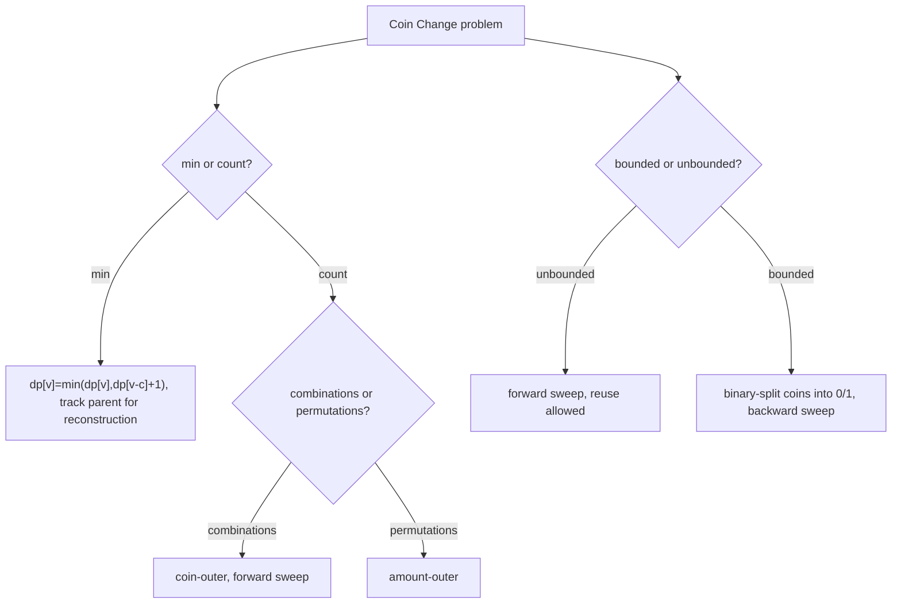

# Coin Change (Unbounded Counting DP) — Middle Level

> **Focus:** The combinations-vs-permutations loop order in depth, bounded (limited-supply) change, the greedy-failure counterexample and when greedy is safe, reconstruction of the actual coins, the 1D space optimization, and the precise link to unbounded (and 0/1) knapsack.

---

## Table of Contents

1. [Introduction](#introduction)
2. [Deeper Concepts](#deeper-concepts)
3. [Comparison with Alternatives](#comparison-with-alternatives)
4. [Advanced Patterns](#advanced-patterns)
5. [Bounded Coin Change](#bounded-coin-change)
6. [Reconstruction](#reconstruction)
7. [Code Examples](#code-examples)
8. [Error Handling](#error-handling)
9. [Performance Analysis](#performance-analysis)
10. [Best Practices](#best-practices)
11. [Visual Animation](#visual-animation)
12. [Summary](#summary)

---

## Introduction

At junior level the message was: two recurrences, one table, mind the loop order. At middle level you start asking the engineering questions that decide whether your solution is correct *and* general:

- *Why* exactly does coin-outer count combinations and amount-outer count permutations? (We will prove it by tracing the order in which multisets are built.)
- What changes when each coin has a **limited count** (bounded change)? The unbounded forward sweep silently allows infinite reuse — how do you cap it?
- Greedy is `O(n)` and tempting. *When* is it provably correct, and what is the smallest counterexample where it breaks?
- How do you recover **which** coins achieve the minimum, not just how many?
- How does the 1D in-place array relate to the 2D "rows per coin" table, and why is the sweep direction (forward vs backward) the whole story behind unbounded vs 0/1?

These are the questions that separate "I memorized two loops" from "I can adapt the coin-change DP to whatever variant the interviewer throws at me."

---

## Deeper Concepts

### The counting recurrence, restated with multiset semantics

Let `W(v)` be the number of **combinations** (multisets of coins) summing to `v`. Order the coins `c₁ < c₂ < … < c_n`. Define `f(i, v)` = number of multisets summing to `v` using only coins from `{c₁, …, c_i}`. Then:

```
f(0, 0) = 1,  f(0, v>0) = 0          (no coins: only the empty multiset makes 0)
f(i, v) = f(i-1, v)            (use NO more of coin c_i)
        + f(i, v - c_i)        (use ONE more of coin c_i, then keep using c_i)
```

The crucial term is the **second**: `f(i, v - c_i)` keeps index `i` (not `i-1`), which is what allows coin `c_i` to be used **multiple times** (unbounded). Collapsing the first dimension into an in-place 1D array, and processing coins one at a time in the outer loop, gives exactly:

```
for i in 1..n:                  # coin-outer
    for v in c_i .. V:          # forward sweep
        dp[v] += dp[v - c_i]
```

Because coin `c_i` is *fully consumed* before coin `c_{i+1}` begins, every multiset is built in **non-decreasing coin order** and therefore counted **once**.

### Why amount-outer counts permutations

Now flip to amount-outer:

```
for v in 1..V:
    for i in 1..n:
        if c_i <= v: dp[v] += dp[v - c_i]
```

Here `dp[v]` is built by appending *any* coin as the **last** coin of an ordered sequence. The sequence `1,2` (make `1`, then append `2`) and `2,1` (make `2`, then append `1`) both land in `dp[3]` and are counted **separately**. So `dp[v]` counts **ordered compositions** of `v` into coin parts — permutations. This is the right model for "ways to climb `v` stairs with step sizes in `coins`", but the **wrong** model for classic coin change.

```
{1,2}, V=3:
  combinations: {1,1,1}, {1,2}                 -> 2
  permutations: 1+1+1, 1+2, 2+1                -> 3
```

The single structural difference: coin-outer freezes a coin before moving on (canonical order ⇒ each multiset once); amount-outer reconsiders all coins at every amount (every ordering counted).

### The 1D sweep direction: unbounded vs 0/1

For the **unbounded** case (each coin reusable), the inner sweep goes **forward** (`v` from `c` to `V`), so when you read `dp[v - c]` it has *already* been updated by coin `c` in this pass — that propagation is exactly "use coin `c` again". For the **0/1** case (each item at most once — the basis of bounded change), the inner sweep goes **backward** (`v` from `V` down to `c`), so `dp[v - c]` still reflects the state *before* coin `c` was used in this pass — preventing reuse. This direction flip is the single most important mechanical fact shared with `02-knapsack`.

```
unbounded coin (reuse allowed):   for v = c .. V      (forward)
0/1 item    (use at most once):   for v = V .. c      (backward)
```

### Worked sweep-direction contrast

Coins/items `{2}` only, target `V = 4`, counting combinations.

```
FORWARD (unbounded):  dp=[1,0,0,0,0]
  v=2: dp[2]+=dp[0]=1 -> 1
  v=4: dp[4]+=dp[2]=1 -> 1        // dp[2] already updated this pass: counts {2,2}
  dp = [1,0,1,0,1]               // ways to make 4 with unlimited 2s: {2,2} = 1

BACKWARD (0/1, item used once): dp=[1,0,0,0,0]
  v=4: dp[4]+=dp[2]=0 -> 0        // dp[2] still pre-pass (0)
  v=2: dp[2]+=dp[0]=1 -> 1
  dp = [1,0,1,0,0]               // ways to make 4 with ONE 2: 0 (cannot)
```

Same coin, same loop bounds, only the sweep direction flipped — and the answers (`1` vs `0`) differ because forward lets `dp[2]` feed `dp[4]` within the pass (reuse) while backward does not. This is the entire mechanical content of "unbounded vs 0/1".

---

## Comparison with Alternatives

### DP vs Greedy for min-coins

| Approach | Time | Correct? | When |
|----------|------|----------|------|
| Greedy (largest first) | `O(n log n)` | **Only for canonical systems** | Real currency, verified canonical |
| DP (`dp[v]=min(dp[v-c]+1)`) | `O(V·n)` | Always | Arbitrary coin sets |
| BFS over amounts | `O(V·n)` | Always | When you also want the shortest coin sequence naturally |
| Naive recursion | Exponential | Always (but slow) | Tiny inputs / as an oracle |

Greedy's appeal is real — it is `O(n log n)` and uses `O(1)` space — but it is a *correctness gamble* on arbitrary coin sets. The minimal counterexample is `{1, 3, 4}`, `V = 6`: greedy gives `4+1+1` (3 coins), optimal is `3+3` (2 coins). Another classic is `{1, 5, 10, 25}` (US coins — canonical, greedy works) vs a hypothetical `{1, 5, 8, 25}` where greedy can fail at certain amounts.

### Worked greedy-failure trace

`{1, 3, 4}`, target `V = 6`, greedy (largest first):

```
remaining 6: take 4 (largest ≤ 6)  -> coins so far: [4], remaining 2
remaining 2: take 1                -> [4,1], remaining 1
remaining 1: take 1                -> [4,1,1], remaining 0
greedy result: 3 coins
```

DP (tries all last coins):

```
dp[6] = min( dp[5]+1, dp[3]+1, dp[2]+1 )
      = min( 2+1,    1+1,    2+1 )  = 2     // dp[3]=1 via single coin 3, so 3+3
DP result: 2 coins  (3 + 3)
```

The DP wins because it considers using coin `3` as the last coin, reaching `dp[3] = 1`, whereas greedy committed to `4` first and got stuck with an awkward remainder of `2`. This is the canonical demonstration that local greed can be globally suboptimal — and exactly why arbitrary coin systems demand DP.

### Counting: combinations vs permutations — pick by problem

| You want | Loop order | Example problem |
|----------|-----------|-----------------|
| Number of coin *multisets* (order irrelevant) | coin-outer | Classic "Coin Change II" / making change |
| Number of ordered coin *sequences* | amount-outer | "Combination Sum IV", staircase climbing |

These are genuinely different problems; choosing the wrong loop order is not a performance bug but a *correctness* bug that produces a different number.

### Bounded vs unbounded

| Variant | Each coin usable | Method |
|---------|------------------|--------|
| Unbounded | any number of times | forward sweep, coin-outer |
| Bounded (limited `k_i`) | at most `k_i` times | binary-splitting into 0/1 items, or bounded inner loop |
| 0/1 (each once) | at most once | backward sweep |

---

## Advanced Patterns

### Pattern: Min-coins with reconstruction

Store, for each amount, which coin was last used; then walk back from `V`.

```python
def min_coins_with_path(coins, amount):
    INF = float("inf")
    dp = [INF] * (amount + 1)
    parent = [-1] * (amount + 1)     # which coin produced dp[v]
    dp[0] = 0
    for c in coins:
        for v in range(c, amount + 1):
            if dp[v - c] + 1 < dp[v]:
                dp[v] = dp[v - c] + 1
                parent[v] = c
    if dp[amount] == INF:
        return -1, []
    # reconstruct the multiset of coins
    used = []
    v = amount
    while v > 0:
        c = parent[v]
        used.append(c)
        v -= c
    return dp[amount], used
```

`min_coins_with_path([1,2,5], 6)` returns `(2, [5, 1])` (or `[1, 5]` depending on coin iteration order) — the actual coins, not just the count.

### Pattern: Permutations (ordered) explicitly

```python
def count_permutations(coins, amount):
    dp = [0] * (amount + 1)
    dp[0] = 1
    for v in range(1, amount + 1):   # amount-outer => ordered
        for c in coins:
            if c <= v:
                dp[v] += dp[v - c]
    return dp[amount]
```

### Pattern flow



---

## Bounded Coin Change

In **bounded** coin change, coin `c_i` may be used at most `k_i` times. Two standard techniques:

### 1. Naive bounded inner loop

Add a third loop over the count `0..k_i`. This is `O(V · Σ k_i)` — fine if the counts are small, but slow if `k_i` is large.

### 2. Binary splitting (the right way)

Decompose the budget `k_i` of coin `c_i` into powers of two: `k_i = 1 + 2 + 4 + … + r`. Each "chunk" becomes a single **0/1 item** of value (chunk × `c_i`). Any usage `0..k_i` is then expressible as a subset sum of these chunks. This turns a bounded coin into `O(log k_i)` 0/1 items, giving `O(V · Σ log k_i)` — a large win when `k_i` is big. You then run the standard **0/1** DP (backward sweep) over those items.

```python
def count_bounded(coins, counts, amount):
    """Number of COMBINATIONS using coin i at most counts[i] times."""
    # Binary-split each (coin, count) into 0/1 items, then 0/1-knapsack count.
    items = []
    for c, k in zip(coins, counts):
        chunk = 1
        while k > 0:
            take = min(chunk, k)
            items.append(c * take)   # one 0/1 item worth `take` coins of value c
            k -= take
            chunk *= 2
    dp = [0] * (amount + 1)
    dp[0] = 1
    for w in items:
        for v in range(amount, w - 1, -1):   # BACKWARD => each item once
            dp[v] += dp[v - w]
    return dp[amount]
```

Note the **backward** sweep: each split item is a 0/1 item (used at most once), so we must not let it propagate within a single pass. This is the same mechanism as 0/1 knapsack in `02-knapsack`.

> Caveat: binary splitting is exact for **min-coins** and for *subset-sum feasibility*, but for **counting** combinations with multiplicities it counts each multiset once **only if** the split items are treated as distinct 0/1 items — which the code above does correctly because each chunk is a separate item. For careful counting under multiplicity, prefer the explicit bounded inner loop or generating-function convolution (senior file).

### Worked binary-splitting example

Coin `c = 3` with budget `k = 5`. Decompose `5 = 1 + 2 + 2` (chunks `1, 2`, then remainder `5 - 3 = 2`):

```
chunk 1: item worth 3·1 = 3
chunk 2: item worth 3·2 = 6
remainder 2: item worth 3·2 = 6
```

So coin `3` (≤ 5 uses) becomes three 0/1 items `{3, 6, 6}`. Any usage `0..5` of coin `3` is a subset sum of `{1, 2, 2}` chunks: `0={}`, `1={1}`, `2={2}`, `3={1,2}`, `4={2,2}`, `5={1,2,2}`. Three items instead of looping `0..5` — and for a budget of `10^6` it would be `~20` items instead of a million. This `O(log k)` reduction is what makes bounded change tractable for large supply limits.

---

## Reconstruction

### Worked reconstruction trace

Coins `{1, 2, 5}`, target `V = 6`. After the min DP, suppose `parent = [_,1,2,_,2,5,5]` (the coin that last improved each `dp[v]`; `_` for `dp[0]`). Walk back from `6`:

```
v=6: parent[6]=5 -> emit 5, v = 6-5 = 1
v=1: parent[1]=1 -> emit 1, v = 1-1 = 0
done. coins used: [5, 1]  (2 coins, matching dp[6]=2)
```

The emitted multiset `{1, 5}` sums to `6` and has cardinality `2 = M(6)`. Each step strictly decreases `v`, so the walk terminates in exactly `M(V)` steps.

For **min-coins**, store a `parent[v]` = the coin that last improved `dp[v]` (shown above) and walk back from `V`. For **count-ways**, you usually want the *number* of ways, not an enumeration — but if you must enumerate, do a DFS over the `dp` table, descending `dp[v] -> dp[v-c]` only for coins `c <= current minimum index` to respect the non-decreasing canonical order (so you enumerate each multiset once). Enumeration can be exponential in the number of solutions, so only do it when the count is known small.

---

## Code Examples

### Min-coins, count-combinations, count-permutations, and bounded — all three languages

#### Go

```go
package main

import "fmt"

const INF = 1 << 30

func minCoins(coins []int, amount int) int {
	dp := make([]int, amount+1)
	for v := 1; v <= amount; v++ {
		dp[v] = INF
	}
	for _, c := range coins {
		for v := c; v <= amount; v++ {
			if dp[v-c]+1 < dp[v] {
				dp[v] = dp[v-c] + 1
			}
		}
	}
	if dp[amount] >= INF {
		return -1
	}
	return dp[amount]
}

func countCombinations(coins []int, amount int) int64 {
	dp := make([]int64, amount+1)
	dp[0] = 1
	for _, c := range coins { // coin-outer
		for v := c; v <= amount; v++ {
			dp[v] += dp[v-c]
		}
	}
	return dp[amount]
}

func countPermutations(coins []int, amount int) int64 {
	dp := make([]int64, amount+1)
	dp[0] = 1
	for v := 1; v <= amount; v++ { // amount-outer
		for _, c := range coins {
			if c <= v {
				dp[v] += dp[v-c]
			}
		}
	}
	return dp[amount]
}

func main() {
	coins := []int{1, 2, 5}
	fmt.Println(minCoins(coins, 6))          // 2
	fmt.Println(countCombinations(coins, 6)) // 5
	fmt.Println(countPermutations([]int{1, 2}, 3)) // 3
}
```

#### Java

```java
public class CoinChangeMid {
    static final int INF = 1 << 30;

    static int minCoins(int[] coins, int amount) {
        int[] dp = new int[amount + 1];
        java.util.Arrays.fill(dp, INF);
        dp[0] = 0;
        for (int c : coins)
            for (int v = c; v <= amount; v++)
                if (dp[v - c] + 1 < dp[v]) dp[v] = dp[v - c] + 1;
        return dp[amount] >= INF ? -1 : dp[amount];
    }

    static long countCombinations(int[] coins, int amount) {
        long[] dp = new long[amount + 1];
        dp[0] = 1;
        for (int c : coins)               // coin-outer
            for (int v = c; v <= amount; v++)
                dp[v] += dp[v - c];
        return dp[amount];
    }

    static long countPermutations(int[] coins, int amount) {
        long[] dp = new long[amount + 1];
        dp[0] = 1;
        for (int v = 1; v <= amount; v++) // amount-outer
            for (int c : coins)
                if (c <= v) dp[v] += dp[v - c];
        return dp[amount];
    }

    public static void main(String[] args) {
        int[] coins = {1, 2, 5};
        System.out.println(minCoins(coins, 6));            // 2
        System.out.println(countCombinations(coins, 6));   // 5
        System.out.println(countPermutations(new int[]{1, 2}, 3)); // 3
    }
}
```

#### Python

```python
INF = float("inf")


def min_coins(coins, amount):
    dp = [INF] * (amount + 1)
    dp[0] = 0
    for c in coins:
        for v in range(c, amount + 1):
            dp[v] = min(dp[v], dp[v - c] + 1)
    return -1 if dp[amount] == INF else dp[amount]


def count_combinations(coins, amount):
    dp = [0] * (amount + 1)
    dp[0] = 1
    for c in coins:                       # coin-outer
        for v in range(c, amount + 1):
            dp[v] += dp[v - c]
    return dp[amount]


def count_permutations(coins, amount):
    dp = [0] * (amount + 1)
    dp[0] = 1
    for v in range(1, amount + 1):        # amount-outer
        for c in coins:
            if c <= v:
                dp[v] += dp[v - c]
    return dp[amount]


if __name__ == "__main__":
    coins = [1, 2, 5]
    print(min_coins(coins, 6))             # 2
    print(count_combinations(coins, 6))    # 5
    print(count_permutations([1, 2], 3))   # 3
```

---

## Error Handling

| Scenario | What goes wrong | Correct approach |
|----------|-----------------|------------------|
| Counted permutations by accident | Amount-outer loop on a combinations problem. | Use coin-outer; lead with a comment. |
| Bounded coin used unlimited times | Forward sweep on a 0/1 item. | Backward sweep for 0/1; binary-split bounded coins. |
| Min-coins overflow | `INF = MAX_INT`, then `+1` wraps. | `INF = amount + 1` or `1<<30`. |
| Impossible amount returns huge number | Did not map `INF` to `-1`. | Check `dp[V] >= INF`. |
| Greedy ships a wrong min-coins | Assumed canonical without proof. | Use DP unless the system is verified canonical. |
| Double-counted with duplicate coins | Input had repeated denominations. | Deduplicate coins before counting. |
| Count overflows 64-bit | Large `V`, large counts. | Apply `mod p` or big integers (senior). |

---

## Performance Analysis

### Worked combinations-vs-permutations on a 3-coin set

Coins `{1, 2, 3}`, target `V = 4`.

```
COMBINATIONS (coin-outer):
  after coin 1: [1,1,1,1,1]
  after coin 2: [1,1,2,2,3]
  after coin 3: [1,1,2,3,4]      -> N(4) = 4
  multisets: {1,1,1,1},{1,1,2},{2,2},{1,3}

PERMUTATIONS (amount-outer):
  v=1: 1                 (1)
  v=2: dp[1]+dp[0]=2     (1+1, 2)
  v=3: dp[2]+dp[1]+dp[0]=2+1+1=4   (1+1+1,1+2,2+1,3)
  v=4: dp[3]+dp[2]+dp[1]=4+2+1=7   -> P(4) = 7
```

`N(4) = 4` but `P(4) = 7`: the three extra permutations are reorderings — `{1,1,2}` has 3 orderings (`1+1+2, 1+2+1, 2+1+1`) and `{1,3}` has 2 (`1+3, 3+1`), versus 1 each in the combination count, accounting for the `(3-1)+(2-1) = 3` surplus. The permutation count `≥` combination count always holds.

| `V` | `n` (coins) | `O(V·n)` ops | Feasible? |
|-----|-------------|--------------|-----------|
| 10³ | 10 | 10⁴ | instant |
| 10⁶ | 50 | 5×10⁷ | well under a second |
| 10⁷ | 100 | 10⁹ | a few seconds; tighten constants |
| 10⁹ | any | 10⁹·n | **infeasible** — array too big; see senior |

The cost is `O(V · n)` time and `O(V)` space. Bounded change naively is `O(V · Σ k_i)`; binary splitting brings it to `O(V · Σ log k_i)`. The dominant practical concern is the **value** of `V`: at `V = 10^9` the `dp[]` array alone (4–8 GB) does not fit, and you must switch strategies (matrix/recurrence tricks, or accept that the problem is pseudo-polynomial-hard — senior file).

```python
import time
def bench(V, n):
    coins = list(range(1, n + 1))
    t = time.perf_counter()
    count_combinations(coins, V)
    return time.perf_counter() - t
# V=10**6, n=50 -> sub-second in CPython.
```

---

## Best Practices

- **Decide combinations vs permutations first**, then pick the loop order; annotate it in a comment.
- **Forward sweep = unbounded reuse; backward sweep = use-once (0/1).** Never mix them up.
- **Binary-split bounded coins** into 0/1 items for `O(log k)` per coin instead of `O(k)`.
- **Use `INF = amount + 1`** for min-coins so `+1` cannot overflow.
- **Track a `parent[]` array** when you need the actual coins, not just the count.
- **Verify greedy is canonical** (senior file gives the Pearson test) before trusting it; otherwise use DP.
- **Test against the brute-force oracle** on small inputs for every variant.

---

## Visual Animation

> See [`animation.html`](./animation.html) for an interactive view.
>
> The middle-level animation highlights:
> - The `dp[]` array filling per coin (coin-outer) and the relaxing cell `dp[v]` reading `dp[v-c]`.
> - A toggle between min-coins and count-combinations on the same coin set.
> - The forward sweep that propagates a coin's reuse across the array.

---

## Summary

The combinations-vs-permutations distinction comes down to one structural fact: **coin-outer** freezes each coin before the next, building every multiset in canonical (non-decreasing) order and counting it **once**; **amount-outer** reconsiders all coins at every amount, counting every ordered sequence. The 1D sweep direction is the second key lever: **forward** sweep allows unbounded reuse, **backward** sweep enforces use-once (0/1), which is the basis for **bounded** change via binary splitting into 0/1 items (`O(V · Σ log k_i)`). **Greedy** min-coins is `O(n log n)` but correct only for **canonical** systems — the minimal counterexample `{1,3,4}` making `6` (greedy `4+1+1`, optimal `3+3`) proves you cannot trust it blindly. **Reconstruction** needs only a `parent[]` array walked back from `V`. And throughout, Coin Change is **unbounded knapsack** (sibling `02-knapsack`) with coins as items — the same recurrence, the same sweep-direction trick, the same counting subtlety. Master these and you can adapt the skeleton to any variant on demand.
