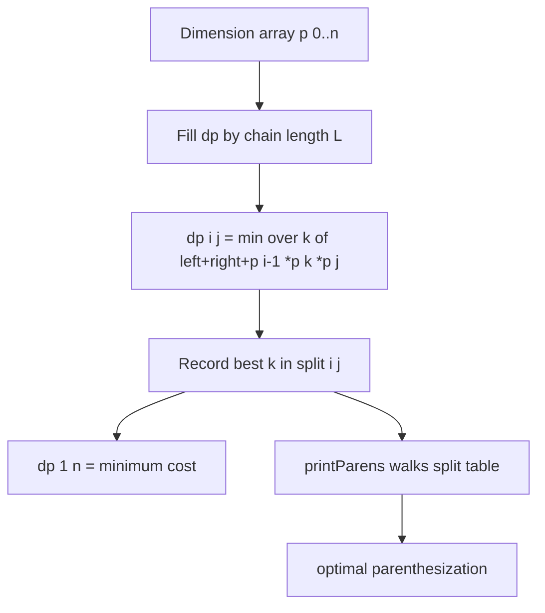

# Matrix Chain Multiplication (MCM) — Junior Level

> **One-line summary:** Multiplying a chain of matrices `A₁·A₂·⋯·Aₙ` gives the same result no matter how you parenthesize it (associativity), but the *number of scalar multiplications* can differ wildly. MCM is the interval dynamic program that finds the cheapest parenthesization in `O(n³)` time, using `dp[i][j] = min over k of dp[i][k] + dp[k+1][j] + p[i-1]·p[k]·p[j]`, and remembers the split points so you can print the optimal `((…)(…))` grouping.

---

## Table of Contents

1. [Introduction](#introduction)
2. [Prerequisites](#prerequisites)
3. [Glossary](#glossary)
4. [Core Concepts](#core-concepts)
5. [Big-O Summary](#big-o-summary)
6. [Real-World Analogies](#real-world-analogies)
7. [Pros & Cons](#pros--cons)
8. [Step-by-Step Walkthrough](#step-by-step-walkthrough)
9. [Code Examples](#code-examples)
10. [Coding Patterns](#coding-patterns)
11. [Error Handling](#error-handling)
12. [Performance Tips](#performance-tips)
13. [Best Practices](#best-practices)
14. [Edge Cases & Pitfalls](#edge-cases--pitfalls)
15. [Common Mistakes](#common-mistakes)
16. [Cheat Sheet](#cheat-sheet)
17. [Visual Animation](#visual-animation)
18. [Summary](#summary)
19. [Further Reading](#further-reading)

---

## Introduction

Suppose you must compute the product of four matrices `A·B·C·D`. Matrix multiplication is **associative**: `((A·B)·C)·D` and `A·(B·(C·D))` and `(A·B)·(C·D)` all give the *same final matrix*. So why would anyone care which order you choose? Because the **amount of arithmetic** — the number of individual scalar multiplications the computer actually performs — depends dramatically on the grouping.

Multiplying a `p × q` matrix by a `q × r` matrix costs `p·q·r` scalar multiplications and produces a `p × r` matrix. That single formula is the engine of the whole topic. When you chain several matrices, each pairwise multiply you choose to do "first" changes the dimensions of the intermediate result, which changes the cost of every later multiply. The differences are not small: for a realistic chain the cheapest order can be **thousands of times** faster than the most expensive one, even though both compute the identical answer.

**Matrix Chain Multiplication (MCM)** is the classic problem: given the dimensions of `n` matrices, find the parenthesization that minimizes the total number of scalar multiplications. You are not asked to actually multiply the matrices — only to decide the *order*. The order is then handed to whatever code does the real multiplication.

The naive approach — try every possible parenthesization — is hopeless. The number of ways to parenthesize `n` matrices is the **Catalan number** `C(n-1)`, which grows faster than `2ⁿ`. For 20 matrices there are already over a billion parenthesizations. We need something smarter.

The smarter thing is **interval dynamic programming**. The key observation: in *any* parenthesization there is one **last** multiplication that combines a left group `A_i…A_k` with a right group `A_{k+1}…A_j`. If we knew the optimal cost of each sub-chain, the best `k` is found by trying all of them and taking the minimum. That gives the recurrence

```
dp[i][j] = min over k in [i, j-1] of ( dp[i][k] + dp[k+1][j] + p[i-1]·p[k]·p[j] )
```

with `dp[i][i] = 0` (a single matrix costs nothing). Filling this table by increasing chain length gives `O(n³)` time and `O(n²)` space. Recording which `k` achieved the minimum in a **split table** lets us reconstruct and print the actual optimal parenthesization. That split-point reconstruction is the part most beginners skip — and it is exactly what this topic emphasizes.

MCM is the textbook example of interval DP. Once you understand it, a whole family of problems — optimal binary search trees, polygon triangulation, evaluating expression orders, even the order in which a database joins tables — fall to the same pattern.

---

## Prerequisites

Before reading this file you should be comfortable with:

- **Matrix multiplication dimensions** — a `p × q` times a `q × r` matrix gives a `p × r` matrix and costs `p·q·r` scalar multiplications. The inner dimensions must match.
- **Associativity** — `(A·B)·C = A·(B·C)`; the result is the same, the work is not.
- **2D arrays / tables** — `dp[i][j]` indexed by a pair, and nested loops to fill them.
- **Big-O notation** — `O(n³)`, `O(n²)`, and why exponential `Catalan(n)` is infeasible.
- **Basic recursion** — the memoized (top-down) version is a recursion with a cache.

Optional but helpful:

- A glance at **the Fibonacci DP** (overlapping subproblems, memoization).
- Familiarity with **intervals** — thinking of `dp[i][j]` as "the answer for the sub-chain from matrix `i` to matrix `j`".

---

## Glossary

| Term | Meaning |
|------|---------|
| **Chain** | The ordered product `A₁·A₂·⋯·Aₙ`. Order is fixed; only grouping is chosen. |
| **Dimension array `p[0..n]`** | `n+1` numbers where matrix `Aᵢ` has shape `p[i-1] × p[i]`. Adjacent matrices share a dimension. |
| **Parenthesization** | A full binary grouping that says which pairwise multiply happens first, second, … |
| **Scalar multiplication cost** | Multiplying `p × q` by `q × r` costs `p·q·r`. The quantity MCM minimizes. |
| **`dp[i][j]`** | Minimum scalar multiplications to compute the sub-product `Aᵢ·⋯·Aⱼ`. |
| **Split point `k`** | The index where the *last* multiply splits the sub-chain: `(Aᵢ…A_k)·(A_{k+1}…Aⱼ)`. |
| **Split table `split[i][j]`** | Stores the best `k` for each interval, used to reconstruct the parenthesization. |
| **Interval DP** | A DP whose state is a contiguous range `[i, j]`, solved by combining sub-intervals. |
| **Catalan number** | `C(n-1)` = the number of parenthesizations of `n` matrices; grows ~`4ⁿ/n^{1.5}`. |
| **Optimal substructure** | The optimal solution is built from optimal solutions of sub-chains — the property that makes DP valid. |

---

## Core Concepts

### 1. The Cost Formula

Everything starts with one fact. To multiply an `p × q` matrix by a `q × r` matrix using the standard algorithm, you compute `p·r` output entries, each a dot product of length `q`, so the total scalar multiplications are:

```
cost(p, q, r) = p · q · r
```

The result is a `p × r` matrix. The shared inner dimension `q` disappears.

### 2. The Dimension Array `p[0..n]`

We never need the matrix *contents* — only their shapes. Because adjacent matrices in a chain must have matching inner dimensions, we can store all `n` matrices' shapes in just `n+1` numbers:

```
matrix Aᵢ has shape  p[i-1] × p[i]
```

Example: matrices with dimensions `40×20`, `20×30`, `30×10`, `10×30` are encoded as the single array `p = [40, 20, 30, 10, 30]`. Here `A₁ = 40×20` uses `p[0]×p[1]`, `A₂ = 20×30` uses `p[1]×p[2]`, and so on. We use this exact chain throughout the walkthrough.

### 3. Why Associativity Makes Cost Vary Wildly

Consider `A₁·A₂·A₃` with `p = [40, 20, 30, 10]`.

- `(A₁·A₂)·A₃`: first `40·20·30 = 24000`, producing `40×30`, then `40·30·10 = 12000`. **Total 36000.**
- `A₁·(A₂·A₃)`: first `20·30·10 = 6000`, producing `20×10`, then `40·20·10 = 8000`. **Total 14000.**

Same matrices, same answer, but the first order does `2.5×` more work. The reason: the first order builds a big `40×30` intermediate; the second builds a small `20×10` one. Choosing where the *last* multiply happens controls the size of the intermediate, which ripples through all the costs.

### 4. The Recurrence

Define `dp[i][j]` = the minimum scalar multiplications needed to compute `Aᵢ·⋯·Aⱼ`. The last multiply combines two groups split at some `k`:

```
dp[i][j] = min over k in [i, j-1] of ( dp[i][k] + dp[k+1][j] + p[i-1]·p[k]·p[j] )
dp[i][i] = 0                                  (a single matrix needs no multiply)
```

Reading the cost term: the left group `Aᵢ…A_k` produces a `p[i-1] × p[k]` matrix, the right group `A_{k+1}…Aⱼ` produces a `p[k] × p[j]` matrix, and multiplying those two costs `p[i-1]·p[k]·p[j]`. We add the (already optimal) costs of building each group and try every split `k`.

### 5. Fill Order: By Increasing Chain Length

`dp[i][j]` depends on **shorter** sub-chains (`dp[i][k]` and `dp[k+1][j]` both span fewer matrices). So we must compute short intervals before long ones. The standard loop fills by **chain length** `L = 2, 3, …, n`:

```
for L = 2 to n:                 # length of the sub-chain
    for i = 1 to n-L+1:         # left endpoint
        j = i + L - 1           # right endpoint
        dp[i][j] = ∞
        for k = i to j-1:       # try every split
            cost = dp[i][k] + dp[k+1][j] + p[i-1]·p[k]·p[j]
            if cost < dp[i][j]:
                dp[i][j] = cost
                split[i][j] = k
```

### 6. Reconstructing the Parenthesization (the emphasized part)

The `dp` table gives the *minimum cost*, but the answer usually wanted is the actual grouping. We recorded `split[i][j] = k` (the best split for each interval). Reconstruct recursively: for interval `[i, j]`, if `i == j` just print `Aᵢ`; otherwise print `(`, recurse on `[i, split[i][j]]`, recurse on `[split[i][j]+1, j]`, print `)`.

```
printParens(i, j):
    if i == j: print "A" + i
    else:
        print "("
        printParens(i, split[i][j])
        printParens(split[i][j] + 1, j)
        print ")"
```

Without the split table you would know the price but not the recipe. **Always keep the split table** when the parenthesization itself is the deliverable.

---

## Big-O Summary

| Operation | Time | Space | Notes |
|-----------|------|-------|-------|
| Brute force (try all parenthesizations) | **Catalan(n-1) ≈ 4ⁿ/n^{1.5}** | O(n) | Infeasible beyond ~15 matrices. |
| Bottom-up DP (fill by chain length) | **O(n³)** | O(n²) | The standard method. |
| Top-down memoized recursion | O(n³) | O(n²) | Same complexity, recursion + cache. |
| Reconstruct parenthesization from split table | O(n) | O(n) | Linear walk of the split table. |
| Knuth / Hu-Shing optimal triangulation | **O(n log n)** | O(n) | Advanced; same problem viewed as polygon triangulation. |

The headline is **`O(n³)` time, `O(n²)` space**. The three nested loops are: chain length `L`, left endpoint `i`, and split point `k`. Each `dp[i][j]` costs up to `n` split trials, and there are `O(n²)` table entries, giving `O(n³)`.

---

## Real-World Analogies

| Concept | Analogy |
|---------|---------|
| Choosing parenthesization | Choosing the order to combine ingredients in a recipe: same dish, but doing the slow chopping on the smaller pile first saves total effort. |
| Cost `p·q·r` | The work to merge two stacks of paperwork — proportional to all three dimensions involved. |
| Small intermediate matrix | Combining two huge tables in a database *after* filtering them down, not before. |
| Split point `k` | Deciding which two adjacent teams merge *last* in a company reorg — that final merge is the most expensive, so pick it wisely. |
| Split table reconstruction | The "assembly instructions" left behind after the planner figured out the cheapest build order. |

Where the analogy breaks: in MCM the *final answer matrix* is always identical regardless of order — only the work differs. Many real "ordering" problems also change the result; MCM does not, which is exactly why it is a clean optimization.

---

## Pros & Cons

| Pros | Cons |
|------|------|
| Turns an exponential search (Catalan) into a clean `O(n³)` DP. | `O(n³)` becomes slow for very large `n` (thousands of matrices). |
| Optimal substructure makes correctness easy to reason about. | Needs `O(n²)` memory for the `dp` and `split` tables. |
| The split table reconstructs the exact optimal grouping, not just the cost. | Only minimizes *scalar multiplications* under the schoolbook multiply model — ignores cache, parallelism, Strassen. |
| Same pattern generalizes to OBST, polygon triangulation, expression evaluation. | Off-by-one errors in the dimension array `p[i-1], p[k], p[j]` are very easy to make. |
| Both bottom-up and memoized top-down versions are simple to implement. | Costs can overflow 32-bit integers for big dimensions; use 64-bit. |

**When to use:** you have a fixed chain of matrices (or any associative pairwise-combine operation) and want the cheapest grouping; query optimizers and tensor-contraction planners use exactly this.

**When NOT to use:** when the chain is huge (`n` in the thousands) and you need sub-cubic methods (Hu-Shing `O(n log n)`); or when the real cost model is not `p·q·r` (e.g., GPU kernels with their own cost surface).

---

## Step-by-Step Walkthrough

Take the chain `A₁·A₂·A₃·A₄` with dimension array `p = [40, 20, 30, 10, 30]`. So:

```
A₁ = 40 × 20   (p[0]×p[1])
A₂ = 20 × 30   (p[1]×p[2])
A₃ = 30 × 10   (p[2]×p[3])
A₄ = 10 × 30   (p[3]×p[4])
```

We fill `dp[i][j]` by increasing chain length. `dp[i][i] = 0` for all `i` (length-1 intervals).

**Length 2 intervals.**

`dp[1][2]` = `A₁·A₂` = `p[0]·p[1]·p[2]` = `40·20·30 = 24000`. split = 1.
`dp[2][3]` = `A₂·A₃` = `p[1]·p[2]·p[3]` = `20·30·10 = 6000`. split = 2.
`dp[3][4]` = `A₃·A₄` = `p[2]·p[3]·p[4]` = `30·10·30 = 9000`. split = 3.

**Length 3 intervals.**

`dp[1][3]` = `A₁·A₂·A₃`. Try both splits:
- `k=1`: `dp[1][1] + dp[2][3] + p[0]·p[1]·p[3]` = `0 + 6000 + 40·20·10` = `6000 + 8000 = 14000`.
- `k=2`: `dp[1][2] + dp[3][3] + p[0]·p[2]·p[3]` = `24000 + 0 + 40·30·10` = `24000 + 12000 = 36000`.
Minimum is **14000** at `k=1`. split[1][3] = 1.

`dp[2][4]` = `A₂·A₃·A₄`. Try both splits:
- `k=2`: `dp[2][2] + dp[3][4] + p[1]·p[2]·p[4]` = `0 + 9000 + 20·30·30` = `9000 + 18000 = 27000`.
- `k=3`: `dp[2][3] + dp[4][4] + p[1]·p[3]·p[4]` = `6000 + 0 + 20·10·30` = `6000 + 6000 = 12000`.
Minimum is **12000** at `k=3`. split[2][4] = 3.

**Length 4 interval (the whole chain).**

`dp[1][4]` = `A₁·A₂·A₃·A₄`. Try all three splits:
- `k=1`: `dp[1][1] + dp[2][4] + p[0]·p[1]·p[4]` = `0 + 12000 + 40·20·30` = `12000 + 24000 = 36000`.
- `k=2`: `dp[1][2] + dp[3][4] + p[0]·p[2]·p[4]` = `24000 + 9000 + 40·30·30` = `33000 + 36000 = 69000`.
- `k=3`: `dp[1][3] + dp[4][4] + p[0]·p[3]·p[4]` = `14000 + 0 + 40·10·30` = `14000 + 12000 = 26000`.
Minimum is **26000** at `k=3`. split[1][4] = 3.

**Final `dp` table** (upper triangle; `i` rows, `j` columns):

```
        j=1     j=2     j=3     j=4
i=1      0     24000   14000   26000
i=2      -       0      6000   12000
i=3      -       -        0     9000
i=4      -       -        -       0
```

**Reconstruct from the split table.** split[1][4] = 3, so the last multiply is `(A₁A₂A₃)·(A₄)`. For `[1,3]`, split[1][3] = 1, so `(A₁)·(A₂A₃)`. For `[2,3]`, split[2][3] = 2, so `(A₂)·(A₃)`. Putting it together:

```
((A₁·(A₂·A₃))·A₄)        total cost = 26000
```

Compare to the worst order, `k=2` at the top, which cost `69000` — almost `2.7×` more for the identical result. That is the payoff of MCM.

---

## Code Examples

### Example: MCM minimum cost + optimal parenthesization

Each version fills `dp` by chain length, records `split`, prints the minimum cost, and reconstructs the parenthesization. Matrices are 1-indexed `A₁..Aₙ`; `p` has `n+1` entries.

#### Go

```go
package main

import (
	"fmt"
	"math"
	"strconv"
)

// matrixChainOrder returns the min cost and the split table.
func matrixChainOrder(p []int) (int64, [][]int) {
	n := len(p) - 1 // number of matrices
	dp := make([][]int64, n+1)
	split := make([][]int, n+1)
	for i := range dp {
		dp[i] = make([]int64, n+1)
		split[i] = make([]int, n+1)
	}
	for L := 2; L <= n; L++ { // chain length
		for i := 1; i+L-1 <= n; i++ {
			j := i + L - 1
			dp[i][j] = math.MaxInt64
			for k := i; k < j; k++ {
				cost := dp[i][k] + dp[k+1][j] +
					int64(p[i-1])*int64(p[k])*int64(p[j])
				if cost < dp[i][j] {
					dp[i][j] = cost
					split[i][j] = k
				}
			}
		}
	}
	return dp[1][n], split
}

func parens(split [][]int, i, j int) string {
	if i == j {
		return "A" + strconv.Itoa(i)
	}
	k := split[i][j]
	return "(" + parens(split, i, k) + parens(split, k+1, j) + ")"
}

func main() {
	p := []int{40, 20, 30, 10, 30}
	cost, split := matrixChainOrder(p)
	fmt.Println("min cost:", cost)          // 26000
	fmt.Println("order:", parens(split, 1, len(p)-1)) // ((A1(A2A3))A4)
}
```

#### Java

```java
public class MatrixChain {
    static long[][] dp;
    static int[][] split;

    static long matrixChainOrder(int[] p) {
        int n = p.length - 1;
        dp = new long[n + 1][n + 1];
        split = new int[n + 1][n + 1];
        for (int L = 2; L <= n; L++) {
            for (int i = 1; i + L - 1 <= n; i++) {
                int j = i + L - 1;
                dp[i][j] = Long.MAX_VALUE;
                for (int k = i; k < j; k++) {
                    long cost = dp[i][k] + dp[k + 1][j]
                            + (long) p[i - 1] * p[k] * p[j];
                    if (cost < dp[i][j]) {
                        dp[i][j] = cost;
                        split[i][j] = k;
                    }
                }
            }
        }
        return dp[1][n];
    }

    static String parens(int i, int j) {
        if (i == j) return "A" + i;
        int k = split[i][j];
        return "(" + parens(i, k) + parens(k + 1, j) + ")";
    }

    public static void main(String[] args) {
        int[] p = {40, 20, 30, 10, 30};
        long cost = matrixChainOrder(p);
        System.out.println("min cost: " + cost);        // 26000
        System.out.println("order: " + parens(1, p.length - 1)); // ((A1(A2A3))A4)
    }
}
```

#### Python

```python
import math


def matrix_chain_order(p):
    n = len(p) - 1                       # number of matrices
    dp = [[0] * (n + 1) for _ in range(n + 1)]
    split = [[0] * (n + 1) for _ in range(n + 1)]
    for L in range(2, n + 1):            # chain length
        for i in range(1, n - L + 2):    # left endpoint
            j = i + L - 1
            dp[i][j] = math.inf
            for k in range(i, j):        # split point
                cost = dp[i][k] + dp[k + 1][j] + p[i - 1] * p[k] * p[j]
                if cost < dp[i][j]:
                    dp[i][j] = cost
                    split[i][j] = k
    return dp[1][n], split


def parens(split, i, j):
    if i == j:
        return f"A{i}"
    k = split[i][j]
    return "(" + parens(split, i, k) + parens(split, k + 1, j) + ")"


if __name__ == "__main__":
    p = [40, 20, 30, 10, 30]
    cost, split = matrix_chain_order(p)
    print("min cost:", cost)                       # 26000
    print("order:", parens(split, 1, len(p) - 1))  # ((A1(A2A3))A4)
```

**What it does:** builds the chain `p = [40,20,30,10,30]`, computes `dp[1][n] = 26000`, and prints the optimal grouping `((A1(A2A3))A4)`.
**Run:** `go run main.go` | `javac MatrixChain.java && java MatrixChain` | `python mcm.py`

---

## Coding Patterns

### Pattern 1: Brute-Force Recursion (the oracle you test against)

**Intent:** Before trusting the DP, compute the minimum cost the slow, obvious way and check they agree on small inputs.

```python
import math


def brute(p, i, j):
    if i == j:
        return 0
    best = math.inf
    for k in range(i, j):
        cost = brute(p, i, k) + brute(p, k + 1, j) + p[i - 1] * p[k] * p[j]
        best = min(best, cost)
    return best
# brute(p, 1, len(p)-1) must equal dp[1][n]
```

This is exponential (recomputes overlapping sub-chains), but perfect as a correctness oracle on chains of up to ~12 matrices.

### Pattern 2: Top-Down Memoization

**Intent:** Cache the recursion so each interval is solved once. Same `O(n³)`, sometimes easier to write.

```python
import functools


def mcm_memo(p):
    n = len(p) - 1

    @functools.lru_cache(maxsize=None)
    def solve(i, j):
        if i == j:
            return 0
        return min(solve(i, k) + solve(k + 1, j) + p[i - 1] * p[k] * p[j]
                   for k in range(i, j))

    return solve(1, n)
```

### Pattern 3: Cost-Only vs Cost-Plus-Reconstruction



Always store `split[i][j]` if you need the grouping, not just the price.

---

## Error Handling

| Error | Cause | Fix |
|-------|-------|-----|
| Wrong (too large) costs / overflow | Product `p[i-1]·p[k]·p[j]` overflows 32-bit int. | Use 64-bit (`int64`/`long`); cast operands before multiplying. |
| `dp[i][j]` stays at infinity | Forgot to initialize `dp[i][j] = ∞` before the `k` loop, or never set it. | Initialize to a large sentinel; ensure the `k` loop runs at least once. |
| Off-by-one in dimensions | Used `p[i]` instead of `p[i-1]`, or `p[k+1]` instead of `p[k]`. | Memorize: left group is `p[i-1]×p[k]`, right is `p[k]×p[j]`. |
| Wrong number of matrices | Treated `p` length as `n` instead of `n+1`. | `n = len(p) - 1`. The array has one more entry than matrices. |
| Reconstruction prints garbage | Read `split` for intervals where `i == j`. | Base case `i == j` must return the leaf `Aᵢ` and not index `split`. |
| Fill order wrong | Looped `i, j` directly so a longer interval read an uncomputed shorter one. | Loop by chain length `L` (shortest first), or memoize top-down. |

---

## Performance Tips

- **Use 64-bit accumulators.** Costs like `40·30·30 = 36000` are tiny here, but real dimensions in the thousands make `p·q·r` exceed `2³¹`. Default to `int64`/`long`.
- **Initialize the diagonal to 0 implicitly.** Zero-initialized arrays already give `dp[i][i] = 0`; do not waste a loop.
- **Reuse one buffer for the split table** rather than rebuilding it; it is `O(n²)` and read-only after the fill.
- **Skip the reconstruction when only the cost is asked.** Building the parenthesization string is extra work you can omit.
- **Prefer bottom-up for cache locality** on large `n`; the recursion stack in top-down adds overhead even though the asymptotics match.

---

## Best Practices

- Always store both `dp` and `split` when the deliverable is the *grouping*, not just the cost.
- State your indexing convention once (1-indexed matrices, `p[0..n]`) and stick to it; mixing 0- and 1-indexing is the top source of bugs.
- Validate the DP against the brute-force recursion (Pattern 1) on random small chains before trusting large inputs.
- Write `matrixChainOrder` and `printParens` as separate, independently testable functions.
- Document that the cost model is the schoolbook `p·q·r`; note explicitly that it ignores Strassen, caches, and parallelism.

---

## Edge Cases & Pitfalls

- **`n = 1` (single matrix)** — no multiplication, cost `0`, parenthesization is just `A₁`.
- **`n = 2` (two matrices)** — only one order; cost `p[0]·p[1]·p[2]`, no real choice.
- **All dimensions equal** — every order costs the same; the DP still works, ties are broken arbitrarily.
- **A dimension of 1** — a `q×1` or `1×r` matrix is fine; the cost formula still applies and such matrices often make great split points (tiny intermediates).
- **Large dimensions** — guard against integer overflow with 64-bit arithmetic.
- **Empty chain** — undefined; treat `n = 0` as cost `0` and an empty grouping, or reject it.
- **Confusing cost with the result** — MCM never changes the final matrix; only the work. Do not "optimize" by changing operands.

---

## Common Mistakes

1. **Indexing the dimension array wrong** — the cost is `p[i-1]·p[k]·p[j]`, not `p[i]·p[k]·p[j]`. The left endpoint contributes `p[i-1]`.
2. **Filling `dp` in the wrong order** — iterating `i` then `j` directly reads sub-intervals that are not yet computed. Iterate by chain length.
3. **Forgetting the split table** — then you know the price but cannot print the grouping.
4. **32-bit overflow** — big dimensions overflow `int`; use 64-bit.
5. **Not initializing `dp[i][j]` to infinity** — leaves stale or zero values that win the `min` incorrectly.
6. **Confusing "number of matrices" with "length of `p`"** — `n = len(p) - 1`.
7. **Trying brute force for large `n`** — Catalan growth makes anything past ~15 matrices hopeless; always DP.

---

## Cheat Sheet

| Question | Tool | Formula |
|----------|------|---------|
| Cost to multiply `p×q` by `q×r` | direct | `p·q·r` |
| Matrix `Aᵢ` shape | dimension array | `p[i-1] × p[i]` |
| Min cost for sub-chain `i..j` | DP | `dp[i][j]` |
| Recurrence | interval DP | `min_k dp[i][k]+dp[k+1][j]+p[i-1]·p[k]·p[j]` |
| Base case | single matrix | `dp[i][i] = 0` |
| Fill order | by length | `L = 2..n`, then `i`, then `k` |
| Reconstruct grouping | split table | recurse on `split[i][j]` |
| Number of parenthesizations | Catalan | `C(n-1)` |

Core algorithm:

```
matrixChainOrder(p):           # p has n+1 entries, n matrices
    n = len(p) - 1
    dp[i][i] = 0
    for L = 2..n:              # chain length
      for i = 1..n-L+1:
        j = i+L-1; dp[i][j] = ∞
        for k = i..j-1:
          c = dp[i][k]+dp[k+1][j]+p[i-1]*p[k]*p[j]
          if c < dp[i][j]: dp[i][j]=c; split[i][j]=k
    return dp[1][n], split      # O(n^3) time, O(n^2) space
```

---

## Visual Animation

> See [`animation.html`](./animation.html) for an interactive visualization.
>
> The animation demonstrates:
> - The `dp` table being filled diagonal by diagonal (by increasing chain length `L`)
> - For each entry, every split point `k` being tried, with the minimizing `k` highlighted
> - The cost term `dp[i][k] + dp[k+1][j] + p[i-1]·p[k]·p[j]` shown as the entry is computed
> - The reconstructed optimal parenthesization built from the split table
> - Step / Run / Reset controls to watch each interval fill in

---

## Summary

Matrix Chain Multiplication asks for the cheapest way to *parenthesize* a fixed product of matrices, measured in scalar multiplications. Because matrix multiply is associative, the final matrix never changes — but the work can vary by orders of magnitude, since each grouping produces different intermediate sizes (the cost to multiply `p×q` by `q×r` is `p·q·r`). Brute force tries `Catalan(n-1)` parenthesizations and is hopeless. The interval DP `dp[i][j] = min_k dp[i][k] + dp[k+1][j] + p[i-1]·p[k]·p[j]`, filled by increasing chain length with `dp[i][i] = 0`, solves it in `O(n³)` time and `O(n²)` space. Recording the minimizing split `k` in a split table lets you reconstruct and print the actual optimal grouping — the part to never skip. On our example chain `[40,20,30,10,30]` the optimum is `((A₁(A₂A₃))A₄)` at `26000`, versus `69000` for the worst order. Master MCM and you have the template for every interval DP that follows.

---

## Further Reading

- *Introduction to Algorithms* (CLRS), Chapter 15 — the canonical Matrix Chain Multiplication treatment and the print-optimal-parens routine.
- Sibling topic `13-dynamic-programming` introduction — optimal substructure and overlapping subproblems.
- Sibling interval-DP topics — optimal binary search trees, polygon triangulation.
- cp-algorithms.com — "Dynamic Programming on Intervals" and the Knuth optimization.
- Hu & Shing (1982, 1984) — the `O(n log n)` optimal-triangulation algorithm for MCM (advanced; see `professional.md`).
