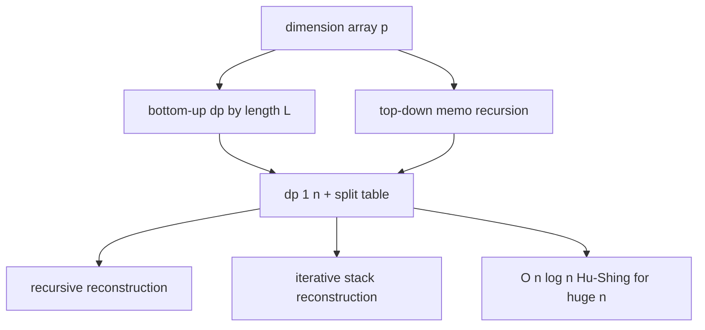

# Matrix Chain Multiplication (MCM) — Middle Level

> **Focus:** Why we iterate by chain length (and not by `i, j`), how to reconstruct the optimal parenthesization from the split table, the equivalence of top-down memoization and bottom-up tabulation, the intuition behind the cost formula, the Hu-Shing `O(n log n)` optimal-triangulation connection, and where MCM shows up in real systems (query optimization, tensor contraction).

---

## Table of Contents

1. [Introduction](#introduction)
2. [Deeper Concepts](#deeper-concepts)
3. [Comparison with Alternatives](#comparison-with-alternatives)
4. [Advanced Patterns](#advanced-patterns)
5. [Reconstruction in Depth](#reconstruction-in-depth)
6. [The Hu-Shing O(n log n) Connection](#the-hu-shing-on-log-n-connection)
7. [Code Examples](#code-examples)
8. [Error Handling](#error-handling)
9. [Performance Analysis](#performance-analysis)
10. [Applications](#applications)
11. [Best Practices](#best-practices)
12. [Visual Animation](#visual-animation)
13. [Summary](#summary)

> Running example throughout: the chain `p = [40, 20, 30, 10, 30]`, whose optimum is `26000` with grouping `((A₁(A₂A₃))A₄)`. Every claim below is checkable against this concrete table.

---

## Introduction

At junior level the message was a single recurrence: `dp[i][j] = min_k dp[i][k] + dp[k+1][j] + p[i-1]·p[k]·p[j]`. At middle level you start asking the engineering questions that decide whether your solution is correct *and* maintainable:

- *Why* must we iterate by chain length `L`, and what breaks if we loop `i` then `j` naively?
- How exactly does the split table reconstruct the parenthesization, and how do I print it iteratively to avoid stack overflow?
- Are top-down memoization and bottom-up tabulation truly equivalent, and when do I prefer each?
- What is the intuition behind the cost term `p[i-1]·p[k]·p[j]`, and why does a small middle dimension `p[k]` make a split cheap?
- The DP is `O(n³)` — is that optimal? (Spoiler: Hu-Shing gets `O(n log n)`.)
- Where does this actually get used — and why do database engines and tensor libraries care?

These are the questions that separate "I memorized the recurrence" from "I can reason about the interval-DP family and choose the right tool."

Throughout, keep the running example `p = [40, 20, 30, 10, 30]` (four matrices, optimum `26000`, order `((A₁(A₂A₃))A₄)`) in mind; we return to it repeatedly so the abstract claims stay grounded in a concrete table you can verify by hand.

---

## Deeper Concepts

### The recurrence, restated as an interval DP

Let `dp[i][j]` be the minimum scalar multiplications to compute `Aᵢ·⋯·Aⱼ`. Every parenthesization of this sub-chain has exactly one *outermost* (last-executed) multiply, which splits the chain at some `k` into a left product `Aᵢ…A_k` and a right product `A_{k+1}…Aⱼ`. Those two products have shapes `p[i-1]×p[k]` and `p[k]×p[j]`, so combining them costs `p[i-1]·p[k]·p[j]`. Adding the optimal costs of each side:

```
dp[i][j] = min over k in [i, j-1] of ( dp[i][k] + dp[k+1][j] + p[i-1]·p[k]·p[j] )
dp[i][i] = 0
```

The whole point of DP is that `dp[i][k]` and `dp[k+1][j]` are themselves optimal sub-solutions, so we never re-derive them. This is **optimal substructure**, proved rigorously in [`professional.md`](./professional.md).

### Why iterate by chain length

`dp[i][j]` depends on `dp[i][k]` and `dp[k+1][j]`, both of which span **strictly fewer matrices** (their interval length is smaller). So every dependency points to a shorter interval. If we fill in order of increasing length `L = j - i + 1`, every value we read is already computed. The standard triple loop is:

```
for L = 2 to n:                  # outer: chain length
    for i = 1 to n - L + 1:      # middle: left endpoint
        j = i + L - 1            # right endpoint determined by i and L
        for k = i to j - 1:      # inner: split point
            ...
```

If instead you wrote `for i: for j: for k`, you would compute `dp[1][n]` before `dp[2][n]`, reading an uncomputed sub-interval. The fix is either length-ordered loops (bottom-up) or memoized recursion (top-down), which orders the work by the call graph automatically.

### The cost-formula intuition

The term `p[i-1]·p[k]·p[j]` is the cost of the *final* multiply only. Reading it geometrically:

- `p[i-1]` = rows of the left intermediate (= rows of `Aᵢ`).
- `p[k]` = the shared inner dimension where left meets right (= columns of the left intermediate = rows of the right intermediate).
- `p[j]` = columns of the right intermediate (= columns of `Aⱼ`).

The lever you control is `k`, which selects the inner dimension `p[k]`. A small `p[k]` makes the final multiply cheap *and* makes both intermediates small, which tends to make the recursive sub-costs cheap too. This is why the optimal order so often splits at a matrix whose adjacent dimension is small — it pinches the chain at its thinnest point. In the example `[40,20,30,10,30]`, the dimension `10` (at `p[3]`) is the natural pinch, and the optimum `((A₁(A₂A₃))A₄)` routes its expensive work through that `10`.

A useful mental model: imagine the dimensions as the widths of pipes joining the matrices. The cost of any multiply is proportional to the product of the two outer widths and the joint inner width. Routing the computation so that the *fattest* dimensions never meet in the same multiply is the goal; a thin dimension acts as a cheap "valve" you want to push expensive combinations through. This intuition predicts the optimal split surprisingly often: scan for the smallest `p[k]` and suspect the optimum splits there or nearby.

But the intuition is only a heuristic, not a theorem — the *greedy* "always split at the smallest dimension" rule can be wrong, because a locally cheap split may force expensive sub-chains. Only the DP, which considers the *combined* cost of the split plus both optimally-solved sides, is guaranteed correct. This is precisely why MCM needs DP and not greed, and it is a frequent interview probe: candidates who propose the greedy pinch rule should immediately note it is a heuristic the DP corrects.

### Optimal substructure and overlapping subproblems

MCM has the two hallmarks of DP:

1. **Optimal substructure** — an optimal parenthesization of `[i,j]` contains optimal parenthesizations of `[i,k]` and `[k+1,j]`. (If a sub-part were suboptimal, swapping in the cheaper sub-solution would lower the total, contradicting optimality.)
2. **Overlapping subproblems** — the same interval `[i,j]` is needed by many larger intervals, so naive recursion recomputes it exponentially often. Memoization or tabulation computes each of the `O(n²)` intervals once.

### Why the shape `p[i-1] × p[j]` never depends on the order

A fact worth internalizing because it underpins the whole recurrence: *any* parenthesization of the sub-chain `Aᵢ…Aⱼ` produces a matrix of shape `p[i-1] × p[j]`, regardless of how you grouped it. The number of rows is fixed by the first matrix (`p[i-1]`) and the number of columns by the last matrix (`p[j]`); every internal dimension is consumed by some multiply. This is *why* `dp[i][j]` is a clean scalar — there is exactly one possible output shape for the interval, so the only thing that varies across parenthesizations is the *cost*, never the result shape. When you read the cost term `p[i-1]·p[k]·p[j]`, the `p[i-1]` and `p[j]` come from this fixed output shape, and only `p[k]` (the split's inner dimension) is a free choice.

### Counting the multiplies

No matter the grouping, computing a chain of `n` matrices uses exactly `n-1` pairwise multiplies — the internal nodes of a full binary tree with `n` leaves. MCM does not reduce the *number* of multiplies; it reduces their *total cost* by routing the expensive work through small inner dimensions. This is a common point of confusion: people expect MCM to "skip" multiplies, but it only reorders them.

---

## Comparison with Alternatives

### Brute force vs DP vs Hu-Shing

| Approach | Time | Space | Good when |
|----------|------|-------|-----------|
| Enumerate all parenthesizations | `Catalan(n-1) ≈ 4ⁿ/n^{1.5}` | O(n) | never beyond ~15 matrices (teaching only) |
| **Bottom-up interval DP** | `O(n³)` | O(n²) | the standard answer; `n` up to a few thousand |
| Top-down memoized recursion | `O(n³)` | O(n²) + stack | sparse access patterns, easier to write |
| **Hu-Shing optimal triangulation** | `O(n log n)` | O(n) | very large `n` where `n³` is too slow |

Concrete table (cost is "number of `dp` updates" ≈ inner-loop iterations):

| `n` | Catalan(n-1) | DP work `~n³/6` | Hu-Shing `~n log n` |
|-----|-------------|------------------|----------------------|
| 5 | 14 | ~20 | ~12 |
| 10 | 4862 | ~165 | ~33 |
| 20 | ~1.8×10⁹ | ~1330 | ~86 |
| 100 | astronomically large | ~166000 | ~664 |
| 1000 | — | ~1.6×10⁸ | ~9966 |

The lesson: brute force dies at ~15 matrices; the `O(n³)` DP is the universal practical answer; Hu-Shing matters only when `n` is large enough that `n³` becomes the bottleneck — rare for matrix chains, more relevant for the polygon-triangulation framing.

### Bottom-up vs top-down

| Aspect | Bottom-up (tabulation) | Top-down (memoization) |
|--------|------------------------|------------------------|
| Order | by chain length, all intervals | by recursion / call graph, only reached intervals |
| Memory | `O(n²)` tables, no stack | `O(n²)` cache + `O(n)` recursion stack |
| Speed | best cache locality | slight call overhead, but same asymptotics |
| Ease | needs correct fill order | reads like the recurrence directly |
| Risk | off-by-one in `L, i, j` | deep recursion / stack overflow for huge `n` |

Both compute every interval once, so both are `O(n³)`. Prefer bottom-up for large `n` (locality, no stack limit); prefer top-down when the recurrence is easier to transcribe or when not all intervals are needed.

In MCM specifically, *all* `O(n²)` intervals are needed (the full chain forces every sub-interval to be visited), so top-down's "only reached intervals" advantage does not apply — both versions touch every cell. The practical choice therefore comes down to constant factors: bottom-up wins on cache behavior and avoids recursion overhead, so it is the usual default for MCM. Top-down remains valuable pedagogically because it mirrors the recurrence one-to-one, making correctness easy to see, and for the generalizations (sparse access patterns in some tensor-network variants) where not every interval is reached.

---

## Advanced Patterns

### Pattern: Tracking both cost and split for reconstruction

```python
import math


def mcm(p):
    n = len(p) - 1
    dp = [[0] * (n + 1) for _ in range(n + 1)]
    split = [[0] * (n + 1) for _ in range(n + 1)]
    for L in range(2, n + 1):
        for i in range(1, n - L + 2):
            j = i + L - 1
            dp[i][j] = math.inf
            for k in range(i, j):
                cost = dp[i][k] + dp[k + 1][j] + p[i - 1] * p[k] * p[j]
                if cost < dp[i][j]:
                    dp[i][j] = cost
                    split[i][j] = k
    return dp, split
```

### Pattern: Iterative (stack-based) reconstruction

Recursive reconstruction can overflow the call stack for adversarial split tables (a fully left-leaning tree). An explicit stack avoids that:

```python
def parens_iter(split, n):
    out = []
    stack = [(1, n, False)]  # (i, j, closing?)
    while stack:
        i, j, closing = stack.pop()
        if closing:
            out.append(")")
        elif i == j:
            out.append(f"A{i}")
        else:
            k = split[i][j]
            stack.append((i, j, True))         # emit ) last
            stack.append((k + 1, j, False))    # right group
            stack.append((i, k, False))        # left group
            out.append("(")
    return "".join(out)
```

### Pattern: Returning the cost of the worst order too

The same DP run can compute the *maximum* by replacing `min` with `max`. Comparing best vs worst quantifies how much the order matters for a given chain — useful for deciding whether to bother optimizing at all.



---

## Reconstruction in Depth

The `dp` table gives only the *minimum cost*. The `split` table is what encodes the *structure* of the optimal solution: `split[i][j] = k` means "for the sub-chain `Aᵢ…Aⱼ`, the optimal last multiply combines `Aᵢ…A_k` with `A_{k+1}…Aⱼ`." Reconstruction is a depth-first walk of this implicit binary tree:

- The root is the interval `[1, n]`, with split `k = split[1][n]`.
- Its left child is `[1, k]`, its right child is `[k+1, n]`.
- Recurse until reaching a leaf `[i, i]`, which is the single matrix `Aᵢ`.

Each internal node corresponds to one multiply; there are exactly `n-1` of them (a full binary tree with `n` leaves has `n-1` internal nodes), matching the `n-1` multiplies any chain of `n` matrices requires. The parenthesization string is just an in-order rendering of this tree with parentheses around each internal node.

A subtle but important point: **the split table is sufficient; you do not need to store the parenthesization itself.** The tree is implicit in `split`, reconstructed in `O(n)` on demand. This keeps memory at `O(n²)` (dominated by the tables) rather than storing strings.

If you also want the *sequence of multiplies* (an execution plan rather than a parenthesization), do a post-order walk of the same tree: a node's multiply executes after both children's subtrees. That post-order list is exactly the order a runtime would perform the multiplications.

### Worked reconstruction tree

For `p = [40,20,30,10,30]` the split table is `split[1][4]=3`, `split[1][3]=1`, `split[2][3]=2`. The implicit binary tree is:

```
            [1,4] k=3
           /          \
      [1,3] k=1       [4,4]
       /     \         |
   [1,1]   [2,3] k=2   A4
     |      /   \
    A1    [2,2] [3,3]
            |     |
           A2    A3
```

In-order rendering with parentheses around each internal node gives `((A1(A2A3))A4)`. Post-order (execution order) of the internal nodes gives the multiply sequence: first `(A2A3)`, then `(A1·(A2A3))`, then `(…·A4)` — exactly three multiplies (`n-1 = 3`), matching the cost decomposition `6000 + 8000 + 12000 = 26000`. Tracing this tree by hand is the best way to convince yourself the split table fully encodes the plan.

### One split table, many readings

The same split table answers several questions: the *parenthesization string* (in-order with parens), the *execution sequence* (post-order of internal nodes), the *depth* of the multiplication tree (relevant to parallelism — a balanced tree exposes more parallel multiplies), and the *shape of each intermediate* (`p[i-1]×p[j]` for each visited interval). All are `O(n)` walks of the same table, so store the table once and derive whichever view a caller needs.

---

## The Hu-Shing O(n log n) Connection

The `O(n³)` DP is not the end of the story. MCM is **equivalent** to a geometric problem: optimally triangulating a convex polygon.

**The correspondence.** Take a convex polygon with `n+1` vertices labeled with the dimensions `p[0], p[1], …, p[n]` (vertex `m` carries weight `p[m]`). Each matrix `Aᵢ` corresponds to the polygon side between vertices `i-1` and `i`. A *triangulation* of the polygon (dividing it into triangles using non-crossing diagonals) corresponds exactly to a parenthesization: each triangle `(a, b, c)` represents one multiply costing `p[a]·p[b]·p[c]`. Minimizing the total weight of all triangles is precisely MCM.

Why this matters: the polygon view exposes structure the matrix view hides. **Hu and Shing (1982, 1984)** gave an `O(n log n)` algorithm for the minimum-weight triangulation of this special weighted polygon, using a clever "fan" decomposition that repeatedly peels off the cheapest triangles around the minimum-weight vertex. This beats the `O(n³)` DP asymptotically.

In practice the `O(n³)` DP is what almost everyone implements — it is simple, and `n` for matrix chains is rarely large enough that `n³` hurts. The Hu-Shing result is important to *know about* (it shows the DP is not optimal and reframes MCM geometrically), but it is intricate to implement correctly and seldom needed. The professional file ([`professional.md`](./professional.md)) develops the polygon-triangulation equivalence further.

There is also the **Knuth optimization** middle ground: for interval DPs whose cost satisfies the *quadrangle inequality*, the optimal split `k` is monotone in `i, j`, which shrinks the inner loop and yields `O(n²)`. Plain MCM's cost does **not** in general satisfy the conditions that make Knuth's `O(n²)` directly applicable (the `p[i-1]·p[k]·p[j]` term is not of the additive form Knuth assumes), which is precisely why the specialized Hu-Shing argument is needed to break `O(n³)`. This distinction is a common interview trap and is discussed in `professional.md`.

---

## Code Examples

### Top-down memoization with reconstruction

#### Go

```go
package main

import (
	"fmt"
	"strconv"
)

type Solver struct {
	p     []int
	memo  [][]int64
	split [][]int
	done  [][]bool
}

func (s *Solver) solve(i, j int) int64 {
	if i == j {
		return 0
	}
	if s.done[i][j] {
		return s.memo[i][j]
	}
	best := int64(-1)
	for k := i; k < j; k++ {
		cost := s.solve(i, k) + s.solve(k+1, j) +
			int64(s.p[i-1])*int64(s.p[k])*int64(s.p[j])
		if best < 0 || cost < best {
			best = cost
			s.split[i][j] = k
		}
	}
	s.memo[i][j] = best
	s.done[i][j] = true
	return best
}

func (s *Solver) parens(i, j int) string {
	if i == j {
		return "A" + strconv.Itoa(i)
	}
	k := s.split[i][j]
	return "(" + s.parens(i, k) + s.parens(k+1, j) + ")"
}

func main() {
	p := []int{40, 20, 30, 10, 30}
	n := len(p) - 1
	s := &Solver{p: p}
	s.memo = make([][]int64, n+1)
	s.split = make([][]int, n+1)
	s.done = make([][]bool, n+1)
	for i := range s.memo {
		s.memo[i] = make([]int64, n+1)
		s.split[i] = make([]int, n+1)
		s.done[i] = make([]bool, n+1)
	}
	fmt.Println("min cost:", s.solve(1, n)) // 26000
	fmt.Println("order:", s.parens(1, n))   // ((A1(A2A3))A4)
}
```

#### Java

```java
import java.util.Arrays;

public class MCMMemo {
    int[] p;
    long[][] memo;
    int[][] split;
    boolean[][] done;

    MCMMemo(int[] p) {
        this.p = p;
        int n = p.length - 1;
        memo = new long[n + 1][n + 1];
        split = new int[n + 1][n + 1];
        done = new boolean[n + 1][n + 1];
    }

    long solve(int i, int j) {
        if (i == j) return 0;
        if (done[i][j]) return memo[i][j];
        long best = -1;
        for (int k = i; k < j; k++) {
            long cost = solve(i, k) + solve(k + 1, j)
                    + (long) p[i - 1] * p[k] * p[j];
            if (best < 0 || cost < best) {
                best = cost;
                split[i][j] = k;
            }
        }
        memo[i][j] = best;
        done[i][j] = true;
        return best;
    }

    String parens(int i, int j) {
        if (i == j) return "A" + i;
        int k = split[i][j];
        return "(" + parens(i, k) + parens(k + 1, j) + ")";
    }

    public static void main(String[] args) {
        int[] p = {40, 20, 30, 10, 30};
        MCMMemo s = new MCMMemo(p);
        System.out.println("min cost: " + s.solve(1, p.length - 1));   // 26000
        System.out.println("order: " + s.parens(1, p.length - 1));     // ((A1(A2A3))A4)
    }
}
```

#### Python

```python
import functools


def mcm_with_order(p):
    n = len(p) - 1
    split = [[0] * (n + 1) for _ in range(n + 1)]

    @functools.lru_cache(maxsize=None)
    def solve(i, j):
        if i == j:
            return 0
        best = None
        for k in range(i, j):
            cost = solve(i, k) + solve(k + 1, j) + p[i - 1] * p[k] * p[j]
            if best is None or cost < best:
                best = cost
                split[i][j] = k
        return best

    def parens(i, j):
        if i == j:
            return f"A{i}"
        k = split[i][j]
        return "(" + parens(i, k) + parens(k + 1, j) + ")"

    cost = solve(1, n)
    return cost, parens(1, n)


if __name__ == "__main__":
    p = [40, 20, 30, 10, 30]
    cost, order = mcm_with_order(p)
    print("min cost:", cost)   # 26000
    print("order:", order)     # ((A1(A2A3))A4)
```

**Note:** the memoized version records `split[i][j]` during the *first* time an interval is solved. Because each interval is solved exactly once, the split table is filled consistently.

---

## Error Handling

| Scenario | What goes wrong | Correct approach |
|----------|-----------------|------------------|
| Fill order wrong | A longer interval reads an uncomputed shorter one → garbage. | Iterate by chain length `L`, or memoize top-down. |
| Memo split set on later calls | Re-deriving an already-cached interval might overwrite `split`. | Set `split` only when actually computing (guard with `done`). |
| Recursion stack overflow | Deeply left-leaning split table on huge `n`. | Use the iterative stack-based reconstruction. |
| Overflow in cost | `p[i-1]·p[k]·p[j]` exceeds 32-bit. | 64-bit arithmetic; cast before multiplying. |
| Reading `split[i][i]` | Reconstruction touches a leaf interval. | Base case `i == j` returns the leaf, never indexes `split`. |
| `n = 1` not handled | `dp[1][1]` loop never runs; some code returns junk. | Return cost `0` and parenthesization `A₁` directly. |

---

## Performance Analysis

| `n` (matrices) | `dp` entries `~n²/2` | inner-loop work `~n³/6` | feasible? |
|----------------|----------------------|--------------------------|-----------|
| 10 | ~50 | ~165 | trivial |
| 50 | ~1250 | ~20800 | instant |
| 100 | ~5000 | ~166000 | instant |
| 500 | ~125000 | ~2×10⁷ | well under a second |
| 1000 | ~500000 | ~1.6×10⁸ | ~a second |
| 5000 | ~1.25×10⁷ | ~2×10¹⁰ | seconds-to-minutes; consider Hu-Shing |

The dominant cost is the triple loop: `O(n²)` intervals, each scanning up to `n` split points, giving `O(n³)`. Memory is `O(n²)` for the two tables. For `n` past a few thousand, the `O(n log n)` Hu-Shing algorithm becomes worth the implementation effort; below that, the simple cubic DP wins on clarity.

```python
import time, random


def benchmark(n):
    p = [random.randint(1, 100) for _ in range(n + 1)]
    start = time.perf_counter()
    mcm(p)            # the bottom-up version
    return time.perf_counter() - start
# Typical: n=500 finishes in tens of milliseconds in CPython.
```

The single biggest constant-factor win in pure Python/Go/Java is keeping the inner loop tight (precompute `p[i-1]` and `p[j]` outside the `k` loop) and using flat arrays for cache locality at large `n`.

---

## Applications

### Database join-order optimization

A SQL query joining several tables is an associative chain: `R₁ ⋈ R₂ ⋈ ⋯ ⋈ Rₙ` produces the same result regardless of join order, but the *intermediate result sizes* — and therefore the cost — vary enormously. Query optimizers run an interval DP closely related to MCM (often the System R / Selinger dynamic program) to pick the cheapest join order. The "cost" is estimated rows/IO rather than `p·q·r`, but the structure — combine adjacent sub-results, minimize over the split — is the same interval DP.

### Tensor contraction ordering

In machine learning and physics, contracting a network of tensors (einsum, tensor trains) is exactly chain (and tree) multiplication generalized. The order of contractions determines the size of intermediate tensors and thus FLOPs and memory. Libraries like `opt_einsum` solve a generalization of MCM to choose the contraction path; for a linear chain it reduces to ordinary MCM.

### Expression and operator scheduling

Any associative reduction where the cost of combining two partial results depends on their sizes — concatenating ropes/strings, merging sorted runs, combining segment-tree-like structures — admits an MCM-style interval DP to schedule the combines cheaply.

### A note on the cost model

In every one of these applications, the *only* thing that changes is the cost of combining two adjacent sub-results. For matrices it is `p·q·r`; for joins it is the estimated cardinality of the joined relation; for tensor contraction it is the product of all involved index dimensions; for merging sorted runs it is the sum of the two run lengths. The interval-DP *machinery* — fill by length, try every split, record the argmin, reconstruct — is identical. A clean implementation therefore parameterizes the DP by a `combineCost(left, right)` function so the same tested code serves all of them. This abstraction is developed further in [`senior.md`](./senior.md), where the cost model becomes the central engineering concern.

The senior file also covers a crucial boundary: matrix multiplication is associative but **not commutative**, so only *contiguous* sub-chains may combine — which is exactly the regime where the `O(n³)` interval DP is correct. The moment the operation is also commutative (database joins, addition), any subset of operands may combine, the plan space explodes to "bushy trees", and you need a more expensive subset DP. Recognizing whether your problem is contiguous-only or commutative is the single most important modeling decision.

---

## Best Practices

- **Iterate by chain length** (bottom-up) or memoize (top-down) — never loop `i, j, k` directly.
- **Always store the split table** when the grouping is the deliverable; reconstruct on demand in `O(n)`.
- **Guard memo writes** so re-derivation cannot corrupt the split table.
- **Use 64-bit arithmetic** for the cost to avoid overflow on realistic dimensions.
- **Test against a brute-force oracle** on random small chains before trusting large inputs.
- **Know the Hu-Shing escape hatch** for huge `n`, but reach for it only when `O(n³)` is genuinely the bottleneck.
- **Do not trust the greedy pinch rule** — splitting at the smallest dimension is a useful intuition but can be wrong; only the DP guarantees optimality.
- **Separate planning from execution** — MCM outputs an order; the actual matrix multiply is a separate step driven by that order, so the plan can be cached and reused.

### A quick correctness self-check

Before trusting any MCM implementation, run this three-point check on the sample chain `[40,20,30,10,30]`:

1. `dp[1][n]` equals `26000`.
2. The reconstructed order is `((A1(A2A3))A4)` (or an equal-cost tie under your tie-break).
3. Re-summing the reconstructed plan's per-multiply costs (`6000 + 8000 + 12000`) equals `26000`.

If all three pass and a random fuzz against the brute-force oracle agrees for `n ≤ 12`, the implementation is almost certainly correct. The third point — the replay check — is the one most people skip and the one that catches a split table that has silently drifted from the cost table.

---

## Visual Animation

> See [`animation.html`](./animation.html) for an interactive view.
>
> The middle-level animation highlights:
> - The `dp` table filled diagonal-by-diagonal as chain length `L` increases.
> - Each candidate split `k` evaluated, with the minimizing `k` flashing green and recorded in the split table.
> - The cost decomposition `dp[i][k] + dp[k+1][j] + p[i-1]·p[k]·p[j]` shown live.
> - The final reconstruction walking the split table into `((A₁(A₂A₃))A₄)`.

---

## Summary

The `O(n³)` interval DP is the workhorse for Matrix Chain Multiplication: fill `dp[i][j]` by increasing chain length so every sub-interval is ready when needed, try every split `k`, and record the minimizing split. The cost term `p[i-1]·p[k]·p[j]` charges only the final multiply, and choosing a small inner dimension `p[k]` pinches the chain cheaply. Reconstruction is a depth-first walk of the implicit binary tree encoded in the split table — recursive for clarity, iterative when `n` is huge. Top-down memoization and bottom-up tabulation are asymptotically identical; prefer bottom-up for locality, top-down for transcribing the recurrence. MCM is equivalent to minimum-weight convex-polygon triangulation, which Hu-Shing solves in `O(n log n)` — worth knowing but rarely needed. The same interval-DP skeleton powers database join-order optimization and tensor-contraction planning, which is why MCM is the gateway to a whole family of optimization problems.

One last reminder to carry forward: MCM *plans* an order; it does not perform the multiplication. The deliverable is a parenthesization (or split table), handed to whatever code does the real numerical work. Keeping planning and execution separate is what lets the plan be cached, reused, and reasoned about independently — a discipline that pays off directly in the production settings covered in [`senior.md`](./senior.md).
