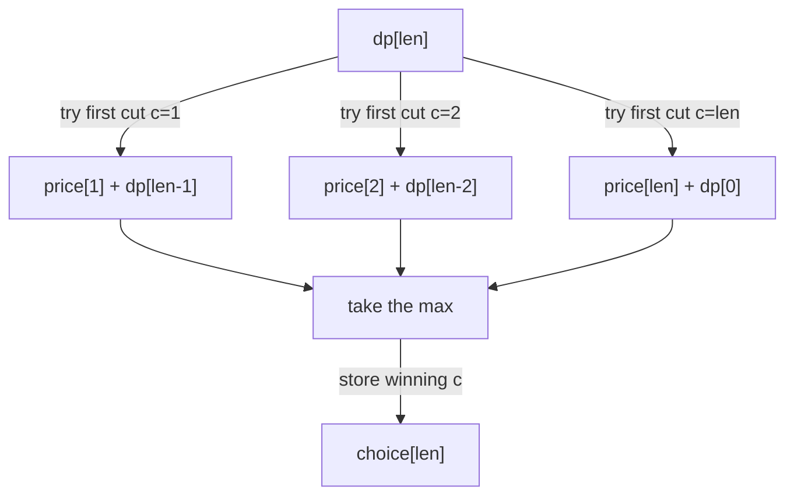

# Rod Cutting (Unbounded DP) — Junior Level

> **One-line summary:** Given a rod of length `n` and a price table where `price[i]` is the revenue for a piece of length `i`, the best total revenue obeys `dp[len] = max over cut c of price[c] + dp[len - c]`. Filling `dp` from `0` to `n` costs `O(n^2)` time and `O(n)` space, and you can reconstruct *which* cuts achieve the maximum.

---

## Table of Contents

1. [Introduction](#introduction)
2. [Prerequisites](#prerequisites)
3. [Glossary](#glossary)
4. [Core Concepts](#core-concepts)
5. [Big-O Summary](#big-o-summary)
6. [Real-World Analogies](#real-world-analogies)
7. [Pros & Cons](#pros--cons)
8. [Step-by-Step Walkthrough](#step-by-step-walkthrough)
9. [Code Examples](#code-examples)
10. [Coding Patterns](#coding-patterns)
11. [Error Handling](#error-handling)
12. [Performance Tips](#performance-tips)
13. [Best Practices](#best-practices)
14. [Edge Cases & Pitfalls](#edge-cases--pitfalls)
15. [Common Mistakes](#common-mistakes)
16. [Cheat Sheet](#cheat-sheet)
17. [Visual Animation](#visual-animation)
18. [Summary](#summary)
19. [Further Reading](#further-reading)

---

## Introduction

Imagine a steel mill that buys raw rods and sells cut pieces. The market quotes a *price per length*: a piece of length 1 sells for some amount, a piece of length 2 for another, and so on. You are handed a rod of length `n` and a price table, and the question is simple to state but not obvious to answer: *how should you cut the rod (or leave it whole) to make the most money?*

A length-4 rod, for instance, can be sold whole, or cut into `1+3`, `2+2`, `1+1+2`, `1+1+1+1`, and several other arrangements. The number of ways to write `n` as an ordered sum of positive integers is `2^(n-1)`, so brute force explodes exponentially. We need something smarter.

The smarter thing is **dynamic programming**, and rod cutting is the textbook introduction to it (it is the opening example of the dynamic-programming chapter in CLRS, *Introduction to Algorithms*). The whole solution rests on one short observation:

> **The best revenue for a rod of length `len` is obtained by choosing a first piece of length `c` (sold for `price[c]`), then optimally cutting the remaining rod of length `len - c`.**

In symbols:

```
dp[len] = max over c in 1..len of ( price[c] + dp[len - c] )
dp[0]   = 0
```

Once you trust that the *remaining* rod is solved optimally by `dp[len - c]`, the whole problem unfolds. You fill `dp[0], dp[1], …, dp[n]` in order, and each entry tries every possible first cut. That is two nested loops — `O(n^2)` time — and the final answer sits in `dp[n]`.

Rod cutting is worth mastering on its own, but it is also a doorway. It is the simplest member of a family called **unbounded dynamic programming**, where each "item" (here, each piece length) may be used *any number of times*. That same shape powers **unbounded knapsack** (sibling topic `02`) and **coin change** (sibling topic `19`). Learn rod cutting cleanly and those two problems become almost trivial relabelings of it.

One more thing the topic teaches early: **reconstruction**. Computing the best revenue is only half the job — a real mill wants the actual list of cut lengths. We will keep a small `choice[]` array recording the first cut that achieved each `dp[len]`, then walk it backwards to recover the pieces. Computing the *value* and recovering the *decisions* is a pattern you will use in every DP you ever write.

---

## Prerequisites

Before reading this file you should be comfortable with:

- **Arrays and indexing** — `dp` is a 1-D array indexed `0..n`; the price table is indexed by length.
- **Nested loops** — the core fill is an outer loop over `len` and an inner loop over the first cut `c`.
- **The `max` operation** — taking the larger of two values, and tracking which choice produced it.
- **Recursion (lightly)** — the top-down version expresses the recurrence directly as a recursive function.
- **Big-O notation** — `O(n^2)` time, `O(n)` space.

Optional but helpful:

- A glance at **memoization** (caching recursive results), which we contrast with the bottom-up table.
- Familiarity with the idea of **optimal substructure** — that a big problem's optimum is built from optima of smaller subproblems. (The formal proof lives in [`professional.md`](./professional.md).)

You do **not** need to have seen knapsack or coin change yet — rod cutting is the gentler entry point, and we point forward to those topics rather than assuming them.

---

## Glossary

| Term | Meaning |
|------|---------|
| **Rod length `n`** | The total length of the rod we must cut up (or sell whole). |
| **Price table `price[i]`** | Revenue for selling one piece of length `i`. Usually `price[0] = 0` and lengths run `1..n`. |
| **Cut** | A division point. Cutting a rod of length `len` once at position `c` yields a length-`c` piece and a length-`(len-c)` piece. |
| **Revenue / value** | Total money from selling all the pieces a rod is cut into. We maximize this. |
| **`dp[len]`** | The maximum revenue obtainable from a rod of length `len`. The answer is `dp[n]`. |
| **First cut** | In the recurrence, the length `c` of the *first* piece we decide to sell off; the rest (`len - c`) is solved recursively. |
| **`choice[len]`** | The first-cut length `c` that achieved the best `dp[len]`; used to reconstruct the cut list. |
| **Optimal substructure** | The property that `dp[len]` can be built from optimal solutions of strictly smaller lengths. |
| **Unbounded** | Each piece length may be used *any* number of times (you may cut as many length-2 pieces as you like). |
| **Top-down (memoization)** | Solve recursively, caching results so each `dp[len]` is computed once. |
| **Bottom-up (tabulation)** | Fill the `dp` array iteratively from `0` up to `n`. |

---

## Core Concepts

### 1. The Price Table

Everything starts from the price table. By convention `price[0] = 0` (a piece of length 0 is worth nothing), and `price[i]` gives the revenue for a single piece of length `i`. The classic CLRS table is:

```
length i :  1   2   3   4   5   6   7   8   9   10
price[i] :  1   5   8   9  10  17  17  20  24   30
```

Notice the prices are *not* proportional to length — a length-2 piece (5) is worth more than two length-1 pieces (1+1=2). That non-linearity is exactly what makes cutting decisions interesting.

### 2. The Recurrence

The maximum revenue for a rod of length `len` considers every possible **first cut** `c` from `1` to `len`. We sell that first piece for `price[c]` and then optimally cut what remains:

```
dp[len] = max over c in 1..len of ( price[c] + dp[len - c] )
dp[0]   = 0
```

The base case `dp[0] = 0` says an empty rod earns nothing. Every other `dp[len]` is built from strictly smaller, already-computed entries `dp[len - c]`. This is the **optimal substructure**: if the best plan for `len` starts with a length-`c` piece, then the rest of that plan must itself be the best plan for `len - c` (otherwise we could swap in a better tail and earn more — a contradiction).

### 3. Why Trying Only the First Cut Is Enough

A common worry: "shouldn't we try cutting in the *middle* too?" We do not need to. Every way of cutting a rod can be described by *what the leftmost piece is*. Whatever the optimal arrangement is, it has *some* first piece of *some* length `c`; the recurrence tries them all. The remainder is then a smaller rod, handled by `dp[len - c]`. So enumerating first cuts enumerates all arrangements — without double counting and without missing any.

### 4. Unbounded by Nature

When we compute `dp[len - c]`, that subproblem is free to cut *another* length-`c` piece. Nothing stops a length value from being reused. That is why rod cutting is **unbounded**: each piece length is an unlimited-supply "item." This is the precise feature shared with unbounded knapsack and coin change, and it is what makes the recurrence reference `dp[len - c]` (the *same* `dp` array) rather than a separate "items already used" dimension.

### 5. Bottom-Up Fill

We fill `dp` from `0` upward so that every `dp[len - c]` is ready before we need it:

```
dp[0] = 0
for len = 1 to n:
    best = -infinity
    for c = 1 to len:
        if price[c] + dp[len - c] > best:
            best = price[c] + dp[len - c]
            choice[len] = c       // remember the cut for reconstruction
    dp[len] = best
```

Two nested loops, the outer over `len` (n iterations) and the inner over `c` (up to `len` iterations), give `O(n^2)`.

### 6. Reconstruction of the Cut List

`dp[n]` tells you *how much* money, but a mill needs the *pieces*. The `choice[]` array records the winning first cut for each length. Walk it backward:

```
pieces = []
len = n
while len > 0:
    pieces.append(choice[len])   // a piece of this length
    len = len - choice[len]      // shrink to the remainder
```

The collected lengths are the optimal cut list, and they sum back to `n`.

---

## Big-O Summary

| Operation | Time | Space | Notes |
|-----------|------|-------|-------|
| Brute-force enumeration | **O(2^n)** | O(n) | Try every ordered composition of `n`; exponential. |
| Top-down memoized recursion | **O(n^2)** | O(n) | Each `dp[len]` computed once; inner loop over cuts. |
| Bottom-up tabulation | **O(n^2)** | O(n) | Two nested loops; the standard method. |
| Reconstruct the cut list | O(n) | O(n) | Walk the `choice[]` array backward. |
| Query the best revenue | O(1) | — | Read `dp[n]` after the fill. |

The headline number is **`O(n^2)` time, `O(n)` space**. For a rod of length 10,000 that is about 100 million simple operations — fast. The exponential brute force, by contrast, is hopeless beyond `n ≈ 30`.

---

## Real-World Analogies

| Concept | Analogy |
|---------|---------|
| Price table | A scrap-metal buyer's price sheet: each length fetches a posted price, not necessarily proportional to size. |
| First-cut decision | Standing at the saw, deciding how long the *first* board to cut off should be, then repeating on the leftover. |
| `dp[len]` | A lookup card pinned to each leftover length saying "the best you can get from this much rod is …". |
| Optimal substructure | A great road trip is a great first leg plus a great trip for the rest of the route — the tail is independently optimal. |
| Unbounded reuse | A vending machine that never runs out: you can dispense the same piece length as many times as you like. |
| Reconstruction | Reading a receipt that lists every individual piece, not just the grand total. |

Where the analogy breaks: real saws lose material to the blade (a *kerf*), and real mills cap how many of each length they can sell. The plain problem ignores both; the **cost-per-cut** and **bounded** variants (covered in [`middle.md`](./middle.md)) bring them back.

---

## Pros & Cons

| Pros | Cons |
|------|------|
| Turns an exponential `2^n` search into a tidy `O(n^2)` table. | Quadratic — for very large `n` (millions) the `n^2` may be too slow. |
| Tiny code: one 1-D array and two nested loops. | Easy to get the base case or index range subtly wrong. |
| Reconstruction is cheap and reuses one extra `O(n)` array. | The *value* is easy; forgetting reconstruction leaves the job half done. |
| The same skeleton solves unbounded knapsack and coin change. | Confusing "unbounded" with "0/1" (use-once) variants causes wrong loop structure. |
| Clear, correct base case (`dp[0] = 0`) that proves the recurrence. | Cost-per-cut and bounded variants change the recurrence; using the plain one is wrong there. |

**When to use:** any "maximize value by splitting a whole into priced parts, each part type reusable" problem — rod cutting, coin/integer compositions for max value, simple cutting-stock for one stock length.

**When NOT to use:** when each piece length can be used at most once (that is *bounded*/0-1 — different recurrence), when the real-world kerf or stock-count constraints dominate (the true industrial cutting-stock problem is NP-hard — see [`senior.md`](./senior.md)), or when `n` is so large that `O(n^2)` is infeasible.

---

## Step-by-Step Walkthrough

Let's solve a rod of length `n = 4` with this small price table:

```
length i :  1   2   3   4
price[i] :  1   5   8   9
```

We fill `dp[0..4]` and a `choice[]` array.

**`dp[0] = 0`** — empty rod, no revenue. `choice[0]` unused.

**`dp[1]`** — only one first cut, `c = 1`:
```
c=1: price[1] + dp[0] = 1 + 0 = 1
dp[1] = 1, choice[1] = 1
```

**`dp[2]`** — try `c = 1, 2`:
```
c=1: price[1] + dp[1] = 1 + 1 = 2
c=2: price[2] + dp[0] = 5 + 0 = 5   <- best
dp[2] = 5, choice[2] = 2
```

**`dp[3]`** — try `c = 1, 2, 3`:
```
c=1: price[1] + dp[2] = 1 + 5 = 6
c=2: price[2] + dp[1] = 5 + 1 = 6
c=3: price[3] + dp[0] = 8 + 0 = 8   <- best
dp[3] = 8, choice[3] = 3
```

**`dp[4]`** — try `c = 1, 2, 3, 4`:
```
c=1: price[1] + dp[3] = 1 + 8 = 9
c=2: price[2] + dp[2] = 5 + 5 = 10  <- best
c=3: price[3] + dp[1] = 8 + 1 = 9
c=4: price[4] + dp[0] = 9 + 0 = 9
dp[4] = 10, choice[4] = 2
```

So the best revenue for length 4 is **10**, and it beats selling the rod whole (9).

**Final tables:**
```
len    :  0   1   2   3   4
dp[len]:  0   1   5   8  10
choice :  -   1   2   3   2
```

**Reconstruct the cuts** by following `choice[]` from `len = 4`:
```
len=4 -> choice[4]=2 -> piece of length 2; remaining len = 4 - 2 = 2
len=2 -> choice[2]=2 -> piece of length 2; remaining len = 2 - 2 = 0
stop.
Cut list: [2, 2]   (two length-2 pieces, total revenue 5 + 5 = 10)
```

The mill cuts the length-4 rod into **two pieces of length 2**, earning 10 — exactly `dp[4]`.

---

## Code Examples

### Example: Max Revenue + Reconstructed Cuts (Bottom-Up)

This builds `dp[]` and `choice[]`, returns the best revenue, and reconstructs the cut list.

#### Go

```go
package main

import "fmt"

// rodCut returns the best revenue for a rod of length n and the list of cut lengths.
// price[i] is the revenue for a piece of length i; price has length n+1, price[0]=0.
func rodCut(price []int, n int) (int, []int) {
	dp := make([]int, n+1)     // dp[len] = best revenue for length len
	choice := make([]int, n+1) // choice[len] = first cut achieving dp[len]
	for length := 1; length <= n; length++ {
		best := -1 << 62 // a very small number
		for c := 1; c <= length; c++ {
			if v := price[c] + dp[length-c]; v > best {
				best = v
				choice[length] = c
			}
		}
		dp[length] = best
	}
	// reconstruct
	pieces := []int{}
	for length := n; length > 0; length -= choice[length] {
		pieces = append(pieces, choice[length])
	}
	return dp[n], pieces
}

func main() {
	price := []int{0, 1, 5, 8, 9} // index 0 unused
	rev, cuts := rodCut(price, 4)
	fmt.Println("best revenue:", rev)  // 10
	fmt.Println("cut lengths:", cuts)  // [2 2]
}
```

#### Java

```java
import java.util.*;

public class RodCutting {

    // returns {bestRevenue, then the cut lengths...} is awkward; use a small holder.
    static int[] dp;
    static int[] choice;

    static int rodCut(int[] price, int n, List<Integer> piecesOut) {
        dp = new int[n + 1];
        choice = new int[n + 1];
        for (int length = 1; length <= n; length++) {
            int best = Integer.MIN_VALUE;
            for (int c = 1; c <= length; c++) {
                int v = price[c] + dp[length - c];
                if (v > best) {
                    best = v;
                    choice[length] = c;
                }
            }
            dp[length] = best;
        }
        for (int length = n; length > 0; length -= choice[length]) {
            piecesOut.add(choice[length]);
        }
        return dp[n];
    }

    public static void main(String[] args) {
        int[] price = {0, 1, 5, 8, 9}; // index 0 unused
        List<Integer> cuts = new ArrayList<>();
        int rev = rodCut(price, 4, cuts);
        System.out.println("best revenue: " + rev); // 10
        System.out.println("cut lengths: " + cuts);  // [2, 2]
    }
}
```

#### Python

```python
def rod_cut(price, n):
    """price[i] = revenue for a piece of length i; price[0] = 0.
    Returns (best_revenue, list_of_cut_lengths)."""
    dp = [0] * (n + 1)        # dp[len] = best revenue for length len
    choice = [0] * (n + 1)    # choice[len] = first cut achieving dp[len]
    for length in range(1, n + 1):
        best = float("-inf")
        for c in range(1, length + 1):
            v = price[c] + dp[length - c]
            if v > best:
                best = v
                choice[length] = c
        dp[length] = best
    # reconstruct
    pieces = []
    length = n
    while length > 0:
        pieces.append(choice[length])
        length -= choice[length]
    return dp[n], pieces


if __name__ == "__main__":
    price = [0, 1, 5, 8, 9]  # index 0 unused
    rev, cuts = rod_cut(price, 4)
    print("best revenue:", rev)  # 10
    print("cut lengths:", cuts)  # [2, 2]
```

**What it does:** fills the DP and choice arrays for the length-4 example above, returns revenue `10`, and reconstructs the cut list `[2, 2]`.
**Run:** `go run main.go` | `javac RodCutting.java && java RodCutting` | `python rod.py`

---

## Coding Patterns

### Pattern 1: Brute-Force Recursion (the oracle you test against)

**Intent:** Before trusting the DP, compute the answer the slow, obvious way and check it agrees on small inputs.

```python
def rod_brute(price, n):
    if n == 0:
        return 0
    best = float("-inf")
    for c in range(1, n + 1):           # try every first cut
        best = max(best, price[c] + rod_brute(price, n - c))
    return best
```

This is exponential (`O(2^n)`) but a perfect correctness oracle: the DP must produce the same number on small `n`.

### Pattern 2: Value-Only DP (no reconstruction)

**Intent:** When you only need the revenue, skip the `choice[]` array entirely.

```python
def rod_value(price, n):
    dp = [0] * (n + 1)
    for length in range(1, n + 1):
        dp[length] = max(price[c] + dp[length - c] for c in range(1, length + 1))
    return dp[n]
```

### Pattern 3: The Unbounded "Reference dp[len - c]" Shape

**Intent:** Recognize the unbounded signature — the recurrence references the *same* `dp` array at a smaller index, which permits reusing a length.



This same shape reappears in unbounded knapsack (`02`, weights/values instead of length/price) and coin change (`19`, counting ways or minimizing coins).

---

## Error Handling

| Error | Cause | Fix |
|-------|-------|-----|
| `IndexError` reading `price[c]` | Price table shorter than `n`, or off-by-one in indexing. | Ensure `price` has indices `0..n`; use `price[0] = 0`. |
| Wrong answer, off by the whole-rod option | Inner loop stops at `len-1`, never trying `c = len`. | Loop `c` from `1` to `len` *inclusive*. |
| `dp[n]` is garbage / negative | Forgot `dp[0] = 0` base case, or initialized `best` wrong. | Set `dp[0] = 0`; start `best` at negative infinity. |
| Reconstruction loops forever | `choice[len]` is `0`, so `len` never decreases. | Ensure every `choice[len]` for `len >= 1` is set to a value `>= 1`. |
| Reconstructed pieces don't sum to `n` | Subtracting the wrong amount in the walk. | Always subtract `choice[len]` (the cut length), not a fixed `1`. |
| Negative prices break `max` | Some price is negative (unusual but possible). | The recurrence still works; just make sure `best` starts truly minimal. |

---

## Performance Tips

- **Use a 1-D array.** `dp` is indexed only by length; you never need a 2-D table for plain rod cutting. That is `O(n)` space.
- **Cache `dp[length - c]` reads in a local** in tight loops; it avoids repeated array bounds work in some languages.
- **Stop early only when justified.** There is no safe early-exit in the inner loop in general — every first cut might win — so try them all.
- **Prefer bottom-up for large `n`.** Top-down recursion adds call-stack overhead and risks stack overflow for large `n`; the iterative table avoids both.
- **Reuse the price array directly.** Do not copy it per call; pass it by reference/slice.

---

## Best Practices

- Always include `price[0] = 0` and index the table from `0`; it removes a whole class of off-by-one bugs.
- Keep `dp` and `choice` as two parallel arrays; compute the value and remember the decision in the *same* inner loop.
- Test the DP against the brute-force recursion (Pattern 1) on random small `n` before trusting large inputs.
- State explicitly whether the problem is **unbounded** (reuse allowed — plain rod cutting) or **bounded/0-1** (each length once); they need different loop structures. (See [`middle.md`](./middle.md).)
- Write `solve` and `reconstruct` as separate, individually testable steps; reconstruction bugs are easy to isolate that way.
- Assert at the end that the reconstructed pieces sum to `n` and their prices sum to `dp[n]` — a cheap, powerful sanity check.

---

## Edge Cases & Pitfalls

- **`n = 0`** — answer is `0`, empty cut list. The base case already handles it; make sure the reconstruction loop does not run.
- **`n = 1`** — only one cut possible; `dp[1] = price[1]`, cut list `[1]`.
- **Selling whole is best** — when `price[n]` beats every split, `choice[n] = n` and the cut list is `[n]`. The loop must reach `c = len` for this to be found.
- **Ties** — several first cuts may give the same `dp[len]`. Any of them is a valid optimum; the code keeps the first or last depending on the comparison (`>` keeps the first, `>=` keeps the last). Be consistent.
- **Prices not increasing** — there is no requirement that longer pieces cost more; the DP handles any table.
- **Very large `n`** — `O(n^2)` may be too slow past a few tens of thousands; note this and consider problem-specific structure (see [`senior.md`](./senior.md)).
- **Integer overflow** — for large `n` and large prices, the revenue can exceed 32-bit range; use 64-bit integers.

---

## Common Mistakes

1. **Stopping the inner loop at `len - 1`** — this silently forbids selling the rod whole (the `c = len` option) and produces wrong answers when whole is best.
2. **Forgetting `dp[0] = 0`** — the recurrence has no anchor and produces nonsense.
3. **Treating it as 0/1 (use-once)** — using a bounded-item loop structure forbids reusing a length and undercounts revenue. Plain rod cutting is *unbounded*.
4. **Not recording `choice[]`** — then you can report the revenue but not the cuts; reconstruction is part of the job.
5. **Reconstructing by subtracting 1** — you must subtract `choice[len]` (the actual cut length), or the pieces won't sum to `n`.
6. **Off-by-one in the price index** — using `price[c-1]` when the table is 1-indexed (or vice versa) shifts every value.
7. **32-bit overflow** — large rods with large prices overflow `int`; use `int64`/`long`.

---

## Cheat Sheet

| Question | Tool | Formula |
|----------|------|---------|
| Best revenue for length `n` | bottom-up DP | `dp[n]`, `dp[len]=max_c price[c]+dp[len-c]` |
| Base case | empty rod | `dp[0] = 0` |
| Which cuts achieve it | `choice[]` + backward walk | follow `len -= choice[len]` |
| Sell whole option | `c = len` in the inner loop | `price[len] + dp[0]` |
| Is reuse allowed? | yes — unbounded | recurrence references `dp[len - c]` |
| Time / space | quadratic / linear | `O(n^2)` / `O(n)` |
| Cost-per-cut variant | subtract a cut fee | see `middle.md` |
| Bounded (use-once) variant | extra item dimension | see `middle.md` |

Core algorithm:

```
rodCut(price, n):
    dp[0] = 0
    for len = 1..n:
        best = -infinity
        for c = 1..len:
            if price[c] + dp[len-c] > best:
                best = price[c] + dp[len-c]
                choice[len] = c
        dp[len] = best
    # reconstruct
    pieces = []; len = n
    while len > 0: pieces.add(choice[len]); len -= choice[len]
    return dp[n], pieces
# cost: O(n^2) time, O(n) space
```

---

## Visual Animation

> See [`animation.html`](./animation.html) for an interactive visualization.
>
> The animation demonstrates:
> - Filling `dp[0], dp[1], …, dp[n]` one length at a time on a concrete price table
> - For each length, trying every first cut `c` and highlighting `price[c] + dp[len - c]`, keeping the maximum
> - Recording the winning cut in `choice[]`
> - Reconstructing the cut list by walking `choice[]` backward, then drawing the chosen pieces on a rod
> - Step / Run / Reset controls to watch each decision build the table

---

## Summary

Rod cutting asks: given a rod of length `n` and a price-per-length table, how do you cut it to maximize revenue? Brute force is exponential, but the problem has **optimal substructure** — the best plan for length `len` is the best *first cut* `c` plus the best plan for the remainder `len - c`. That gives the recurrence `dp[len] = max_c (price[c] + dp[len - c])` with base case `dp[0] = 0`, filled bottom-up in `O(n^2)` time and `O(n)` space. Recording the winning cut in a `choice[]` array lets you **reconstruct** the actual pieces by walking backward in `O(n)`. Because each piece length can be reused freely, rod cutting is the simplest **unbounded** DP — the same shape that drives unbounded knapsack (`02`) and coin change (`19`). Master the recurrence, the base case, and reconstruction, and you have the foundational pattern of dynamic programming.

---

## Further Reading

- *Introduction to Algorithms* (CLRS), Chapter 15 (Dynamic Programming) — rod cutting is the opening example, with the `CUT-ROD`, `MEMOIZED-CUT-ROD`, and `EXTENDED-BOTTOM-UP-CUT-ROD` pseudocode.
- Sibling topic `02-unbounded-knapsack` — rod cutting generalized to weights and values.
- Sibling topic `19-coin-change` — the same unbounded shape for counting ways / minimizing coins.
- This topic's [`middle.md`](./middle.md) — top-down vs bottom-up, cost-per-cut, and bounded variants.
- This topic's [`professional.md`](./professional.md) — the optimal-substructure proof and complexity analysis.
- cp-algorithms.com and GeeksforGeeks — "Rod Cutting Problem" walkthroughs and variants.
