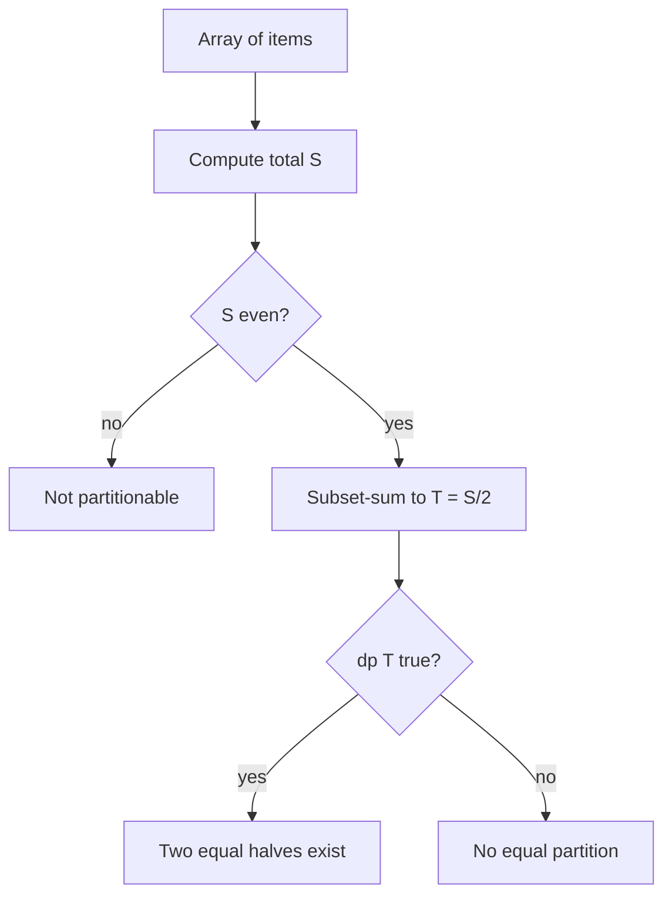

# Subset Sum and Partition DP — Junior Level

> **One-line summary:** Given a list of non-negative integers, the boolean DP `dp[t]` answers "can some subset add up to exactly `t`?" in `O(n·T)` time. The headline application is the **equal partition** problem: split the array into two halves of equal sum, which is just subset-sum with target `total / 2`.

---

## Table of Contents

1. [Introduction](#introduction)
2. [Prerequisites](#prerequisites)
3. [Glossary](#glossary)
4. [Core Concepts](#core-concepts)
5. [Big-O Summary](#big-o-summary)
6. [Real-World Analogies](#real-world-analogies)
7. [Pros & Cons](#pros--cons)
8. [Step-by-Step Walkthrough](#step-by-step-walkthrough)
9. [Code Examples](#code-examples)
10. [Coding Patterns](#coding-patterns)
11. [Error Handling](#error-handling)
12. [Performance Tips](#performance-tips)
13. [Best Practices](#best-practices)
14. [Edge Cases & Pitfalls](#edge-cases--pitfalls)
15. [Common Mistakes](#common-mistakes)
16. [Cheat Sheet](#cheat-sheet)
17. [Visual Animation](#visual-animation)
18. [Summary](#summary)
19. [Further Reading](#further-reading)

---

## Introduction

Suppose someone hands you a bag of weights — say `{1, 5, 11, 5}` — and asks: *"Can you pick some of these weights so that the picked pile weighs exactly 11?"* You may use each weight at most once, and you don't have to use all of them. This is the **subset-sum** question: does there exist a subset whose elements add up to a chosen **target** `T`?

The brute-force answer enumerates all `2^n` subsets and checks each one — fine for 10 items, hopeless for 40. There is a much better way built on a single, powerful idea:

> **`dp[t]` = `true` if some subset of the items seen so far sums to exactly `t`.**

We process the items one at a time. Each new item with value `v` can either be *skipped* (the reachable sums don't change) or *taken* (every previously reachable sum `t` now unlocks a new reachable sum `t + v`). Filling in this boolean table costs `O(n·T)` — the number of items times the target — which is dramatically faster than `2^n` for the targets we usually care about.

The single most famous use of this machinery is the **equal partition** problem (LeetCode "Partition Equal Subset Sum"), which is our running example throughout this file:

> *Can the array be split into two groups with the same sum?*

If the whole array sums to `S`, then splitting into two equal halves means each half sums to `S / 2`. So the question reduces to: **is there a subset that sums to `S / 2`?** That is exactly subset-sum with target `T = S / 2`. (If `S` is odd, the answer is trivially `no` — you cannot halve an odd number into two equal integers.)

This idea connects several problems you may have met separately:

- **Subset-sum decision** — can a subset reach exactly `T`? (the boolean DP)
- **Counting** — how *many* subsets reach `T`? (swap booleans for integer counts — see `middle.md`)
- **Equal partition** — split into two equal halves (subset-sum to `S/2`)
- **Minimum-difference partition** — split into two halves as balanced as possible (`senior.md`, `professional.md`)
- **Partition into `k` equal subsets** — a harder, bitmask variant (sibling topic `06`)

One crucial fact to keep in mind from the first minute: subset-sum is **NP-complete**, yet our `O(n·T)` DP solves it "fast." There is no contradiction — `O(n·T)` is **pseudo-polynomial**: it is polynomial in the *numeric value* `T`, not in the number of *bits* needed to write `T`. When `T` is astronomically large, `O(n·T)` is not actually efficient. We unpack this carefully in [`professional.md`](./professional.md); for now, just remember the DP shines when `T` is moderate.

---

## Prerequisites

Before reading this file you should be comfortable with:

- **Arrays and indexing** — we fill a 1D boolean array `dp[0..T]`.
- **Dynamic programming basics** — building a table from smaller subproblems (sibling intro topics in `13-dynamic-programming`).
- **Boolean logic** — `OR`, `AND`, and "is this reachable?".
- **Big-O notation** — `O(n·T)`, `O(2^n)`.
- **Summation** — computing the total `S = Σ aᵢ`.

Optional but helpful:

- A glance at the **0/1 knapsack** problem; subset-sum is the special case where each item's value equals its weight and we ask "can we hit the target exactly?".
- Familiarity with **bitsets / bitmask integers**, which give a beautiful speedup covered in `middle.md`.

---

## Glossary

| Term | Meaning |
|------|---------|
| **Subset** | Any selection of zero or more items from the array; each item is in or out. There are `2^n` subsets. |
| **Subset sum** | The total of the chosen items. The empty subset sums to `0`. |
| **Target `T`** | The sum we are trying to reach exactly. |
| **`dp[t]`** | Boolean: is sum `t` reachable by *some* subset of the items processed so far? |
| **Reachable sum** | A value `t` for which `dp[t]` is `true`. |
| **Equal partition** | Splitting the array into two groups with identical sums (each `= S/2`). |
| **Total `S`** | The sum of *all* array elements, `S = Σ aᵢ`. |
| **Pseudo-polynomial** | Running time polynomial in the numeric value `T`, not in the bit-length of `T`. |
| **0/1 knapsack** | Each item taken at most once; subset-sum is its decision-only cousin. |
| **NP-complete** | The general decision problem has no known polynomial-time (in input bits) algorithm. |

---

## Core Concepts

### 1. The Reachable-Sums Set

Imagine a set `R` of "sums we can currently make." Before processing any item, the only sum you can make is `0` (pick nothing), so `R = {0}`. Each time you consider a new item of value `v`, every existing reachable sum `t` gives you a *new* option `t + v`. So:

```
R_new = R_old  ∪  { t + v : t ∈ R_old }
```

We never *remove* sums (you can always choose to skip an item), so `R` only grows. After processing every item, `T` is reachable iff `T ∈ R`. The boolean array `dp[0..T]` is just `R` stored as a bitmap: `dp[t] = true` means `t ∈ R`.

### 2. The Boolean DP Recurrence

Let `dp[t]` mean "sum `t` is reachable using a subset of the items processed so far." The base case is:

```
dp[0] = true        // the empty subset always sums to 0
dp[t] = false        for t > 0, initially
```

When we process item `v`, a sum `t` becomes (or stays) reachable if:

- it was already reachable **without** `v` (`dp[t]` was already `true`), **or**
- the sum `t - v` was reachable, and we now add `v` to reach `t` (`dp[t - v]` was `true`).

So the update is `dp[t] = dp[t] OR dp[t - v]`, for `t` from `T` down to `v`.

### 3. Why Iterate `t` from High to Low

This is the single most important implementation detail. We use a **1D** array and reuse it across items. If we updated `t` from low to high, then taking item `v` at sum `t - v` could immediately feed into sum `t`, then into `t + v`, letting us use the *same item twice*. Iterating `t` downward (from `T` to `v`) guarantees that when we read `dp[t - v]`, that value still reflects the state *before* `v` was added — so each item is used at most once. (This is the classic 0/1-knapsack ordering rule.)

```
for each item v:
    for t = T down to v:
        dp[t] = dp[t] OR dp[t - v]
```

### 4. Equal Partition = Subset-Sum to `S/2`

Our running example. Compute the total `S = Σ aᵢ`.

- If `S` is **odd**, it cannot split into two equal integer halves → return `false` immediately.
- If `S` is **even**, run subset-sum with target `T = S / 2`. If `dp[S/2]` is `true`, one group sums to `S/2` and the rest automatically sums to `S - S/2 = S/2`. Return `dp[S/2]`.

That's the whole reduction: **partition into two equal halves ⇔ a subset sums to half the total.**

### 5. The Empty Subset and `dp[0]`

`dp[0]` is always `true` and must be initialized so before processing items — the empty subset sums to `0`. Forgetting this base case makes the whole table stay `false` (nothing can ever bootstrap). It is the seed from which all reachable sums grow.

### 6. Reconstructing Which Items Were Chosen (Preview)

The boolean DP tells you *whether* a subset exists, not *which* items. To recover the actual subset, keep a 2D table (`dp[i][t]`) or a parent-pointer trail and walk backward from `dp[n][T]`. We show the technique in [Coding Patterns](#coding-patterns) and in more depth in `middle.md`.

---

## Big-O Summary

| Operation | Time | Space | Notes |
|-----------|------|-------|-------|
| Boolean subset-sum DP (1D) | **O(n·T)** | O(T) | The standard method. |
| Boolean subset-sum DP (2D) | O(n·T) | O(n·T) | Easier to reconstruct the subset from. |
| Brute-force subset enumeration | O(2ⁿ · n) | O(n) | Only for tiny `n` (≤ ~20). |
| Equal partition (two halves) | O(n·S) | O(S) | `S` = total; runs subset-sum to `S/2`. |
| Bitset-accelerated subset-sum | **O(n·T / w)** | O(T / w) | `w` = machine word width (64); see `middle.md`. |
| Meet-in-the-middle (large `T`) | O(2^{n/2} · n) | O(2^{n/2}) | For small `n`, huge `T`; sibling `15-divide-and-conquer/06`. |
| Counting subsets summing to `T` | O(n·T) | O(T) | Integer DP instead of boolean; `middle.md`. |
| Reconstruct chosen subset | O(n·T) | O(n·T) | Needs the 2D table or parent trail. |

The headline number is **`O(n·T)`** — the number of items times the target value. Remember: this is *pseudo-polynomial* (polynomial in the value `T`, not in its bit-length).

---

## Real-World Analogies

| Concept | Analogy |
|---------|---------|
| Subset-sum decision | Coins in your pocket: can you pay *exactly* a price `T` with some subset of coins (no change given)? |
| Reachable-sums set growing | A bucket of achievable totals; each new coin adds every "old total + coin value" to the bucket. |
| Equal partition | Two movers splitting a pile of boxes so each cart carries the same total weight. |
| Iterating `t` downward | Stamping each coin "used" before it can be reused — preventing double-spending the same coin. |
| Minimum-difference partition | Two teams picking players to make the two rosters' skill totals as close as possible. |
| Pseudo-polynomial cost | A price tag in *cents* is cheap to handle; a price tag in *individual atoms* is not — the table width follows the numeric value, not the item count. |

Where the analogy breaks: real coins can be reused (unlimited supply) — that is the *unbounded* knapsack, a different ordering. Subset-sum uses each item **at most once**, which is exactly why we iterate `t` from high to low.

---

## Pros & Cons

| Pros | Cons |
|------|------|
| Solves an NP-complete problem in `O(n·T)` when `T` is moderate. | Pseudo-polynomial: blows up when `T` is large (e.g., values up to `10^9`). |
| Tiny code — one boolean array and a double loop. | Memory `O(T)` can be large if `T` is in the millions. |
| The same DP solves partition, min-difference, and (with counts) counting. | Boolean DP alone does not tell you *which* items were chosen (needs extra bookkeeping). |
| Bitset trick gives a clean 64× constant-factor speedup. | Cannot handle negative numbers without an offset/shift. |
| Easy to reason about and to test against brute force. | For small `n` with huge `T`, meet-in-the-middle is the right tool instead. |

**When to use:** non-negative integers, target `T` (or total `S`) up to a few million, `n` up to thousands; equal-partition and "can we hit a sum" style questions.

**When NOT to use:** values/targets in the billions (use meet-in-the-middle for small `n`, sibling `15-divide-and-conquer/06`), or when you need a *truly* polynomial guarantee (subset-sum is NP-complete in general).

---

## Step-by-Step Walkthrough

Take the array `a = [1, 5, 11, 5]`. Can it be partitioned into two equal halves?

**Step 0 — compute the total.** `S = 1 + 5 + 11 + 5 = 22`. It is even, so each half must sum to `T = S / 2 = 11`. We run subset-sum with target `11`.

**Initialize.** `dp` has indices `0..11`. Only `dp[0] = true` (empty subset).

```
index:  0  1  2  3  4  5  6  7  8  9 10 11
dp:     T  .  .  .  .  .  .  .  .  .  .  .
```

**Process item `v = 1`.** For `t` from `11` down to `1`, set `dp[t] |= dp[t-1]`. Only `dp[1] |= dp[0]` fires.

```
dp:     T  T  .  .  .  .  .  .  .  .  .  .
        ↑ sums {0,1} reachable
```

**Process item `v = 5`.** For `t` from `11` down to `5`, `dp[t] |= dp[t-5]`. Now `dp[5] |= dp[0]` and `dp[6] |= dp[1]` fire.

```
dp:     T  T  .  .  .  T  T  .  .  .  .  .
        sums {0,1,5,6} reachable
```

**Process item `v = 11`.** For `t` from `11` down to `11`, `dp[11] |= dp[0]`. That fires! `dp[11] = true`.

```
dp:     T  T  .  .  .  T  T  .  .  .  .  T
        sums {0,1,5,6,11} reachable  ← target 11 reached!
```

We could stop here — the target is already reachable (the single item `11` forms one half, and `{1,5,5}` forms the other). For completeness:

**Process item `v = 5`.** `dp[t] |= dp[t-5]` for `t` from `11` down to `5`. This adds sums `{10, 11}` (e.g. `dp[10] |= dp[5]`, `dp[11] |= dp[6]`), but `dp[11]` was already `true`.

```
dp:     T  T  .  .  .  T  T  .  .  .  T  T
        final reachable sums {0,1,5,6,10,11}
```

**Answer.** `dp[11] = true`, so `[1,5,11,5]` **can** be partitioned into `{11}` and `{1,5,5}`, each summing to `11`. 

Compare with `a = [1, 2, 3, 5]`: `S = 11` is **odd**, so we return `false` immediately without any DP.

---

## Code Examples

### Example: Partition Equal Subset Sum (boolean subset-sum to `S/2`)

This computes the total, rejects odd totals, then runs the 1D boolean subset-sum DP toward `S/2`.

#### Go

```go
package main

import "fmt"

// canPartition reports whether nums can be split into two equal-sum subsets.
func canPartition(nums []int) bool {
	total := 0
	for _, v := range nums {
		total += v
	}
	if total%2 != 0 {
		return false // an odd total cannot split into two equal halves
	}
	target := total / 2
	dp := make([]bool, target+1)
	dp[0] = true // empty subset sums to 0
	for _, v := range nums {
		// iterate downward so each item is used at most once
		for t := target; t >= v; t-- {
			if dp[t-v] {
				dp[t] = true
			}
		}
		if dp[target] {
			return true // early exit once the target is reachable
		}
	}
	return dp[target]
}

func main() {
	fmt.Println(canPartition([]int{1, 5, 11, 5})) // true  ({11},{1,5,5})
	fmt.Println(canPartition([]int{1, 2, 3, 5}))  // false (total 11 is odd)
}
```

#### Java

```java
public class PartitionEqualSubset {

    // canPartition reports whether nums splits into two equal-sum subsets.
    static boolean canPartition(int[] nums) {
        int total = 0;
        for (int v : nums) total += v;
        if (total % 2 != 0) return false; // odd total -> impossible
        int target = total / 2;
        boolean[] dp = new boolean[target + 1];
        dp[0] = true; // empty subset sums to 0
        for (int v : nums) {
            for (int t = target; t >= v; t--) { // downward: each item once
                if (dp[t - v]) dp[t] = true;
            }
            if (dp[target]) return true; // early exit
        }
        return dp[target];
    }

    public static void main(String[] args) {
        System.out.println(canPartition(new int[]{1, 5, 11, 5})); // true
        System.out.println(canPartition(new int[]{1, 2, 3, 5}));  // false
    }
}
```

#### Python

```python
def can_partition(nums):
    """Return True if nums can be split into two equal-sum subsets."""
    total = sum(nums)
    if total % 2 != 0:
        return False                      # odd total cannot be halved
    target = total // 2
    dp = [False] * (target + 1)
    dp[0] = True                          # empty subset sums to 0
    for v in nums:
        for t in range(target, v - 1, -1):  # downward: each item once
            if dp[t - v]:
                dp[t] = True
        if dp[target]:
            return True                    # early exit
    return dp[target]


if __name__ == "__main__":
    print(can_partition([1, 5, 11, 5]))  # True  ({11}, {1,5,5})
    print(can_partition([1, 2, 3, 5]))   # False (total 11 is odd)
```

**What it does:** sums the array, rejects odd totals, then fills the boolean `dp` toward `S/2`, returning early the moment the target becomes reachable.
**Run:** `go run main.go` | `javac PartitionEqualSubset.java && java PartitionEqualSubset` | `python partition.py`

---

## Coding Patterns

### Pattern 1: Brute-Force Subset-Sum (the oracle you test against)

**Intent:** Before trusting the DP, check membership the slow, obvious way on small inputs.

```python
def subset_sum_bruteforce(nums, target):
    n = len(nums)
    for mask in range(1 << n):           # every subset
        s = sum(nums[i] for i in range(n) if mask & (1 << i))
        if s == target:
            return True
    return False
```

This is `O(2ⁿ · n)` — too slow for large `n`, but a perfect correctness oracle. The DP must agree with it on every small case.

### Pattern 2: Generic Subset-Sum Decision (reusable building block)

**Intent:** "Is target `T` reachable?" — the core routine that partition, counting, and min-difference all build on.

```python
def subset_sum(nums, target):
    dp = [False] * (target + 1)
    dp[0] = True
    for v in nums:
        for t in range(target, v - 1, -1):
            dp[t] = dp[t] or dp[t - v]
    return dp[target]
```

### Pattern 3: Reconstructing the Chosen Subset (2D table)

**Intent:** Recover *which* items form the subset, not just whether one exists.

```python
def subset_with_sum(nums, target):
    n = len(nums)
    # dp[i][t] = can we reach sum t using the first i items?
    dp = [[False] * (target + 1) for _ in range(n + 1)]
    for i in range(n + 1):
        dp[i][0] = True
    for i in range(1, n + 1):
        v = nums[i - 1]
        for t in range(target + 1):
            dp[i][t] = dp[i - 1][t] or (t >= v and dp[i - 1][t - v])
    if not dp[n][target]:
        return None
    # walk backward to recover items
    chosen, t = [], target
    for i in range(n, 0, -1):
        if not dp[i - 1][t]:          # item i-1 was necessary
            chosen.append(nums[i - 1])
            t -= nums[i - 1]
    return chosen
```



---

## Error Handling

| Error | Cause | Fix |
|-------|-------|-----|
| Always returns `false` | Forgot `dp[0] = true`. | Initialize the empty-subset base case before the loops. |
| Same item counted twice | Iterated `t` low→high in the 1D array. | Iterate `t` from `T` down to `v`. |
| Index out of range | Looped `t` below `v` (`t - v` negative). | Stop the inner loop at `t = v` (or guard `t >= v`). |
| Wrong answer for odd total in partition | Skipped the parity check. | Return `false` immediately when `S` is odd. |
| Wrong / huge memory | Allocated `dp` of size `S` instead of `S/2 + 1` for partition. | Size the array to `target + 1`. |
| Crash on negative numbers | Subset-sum DP assumes non-negative values. | Shift values by an offset, or use a different formulation. |
| Overflow when summing `S` | Many large values overflow 32-bit. | Use 64-bit (`int64` / `long`) for the total. |

---

## Performance Tips

- **Early exit.** The moment `dp[target]` becomes `true`, you can stop processing further items.
- **Cap the target by the running prefix sum.** When processing item `i`, only sums up to `min(target, prefixSum)` are reachable; you can shrink the inner loop's upper bound.
- **Skip duplicate/zero work.** A value `v > target` can never be part of a subset summing to `target` — skip it (after confirming it doesn't make partition impossible by itself).
- **Use the bitset trick.** Representing `dp` as the bits of a big integer turns the inner loop into a single shift-and-OR, a ~64× speedup. See `middle.md`.
- **1D over 2D.** Use the 1D array (`O(T)` space) unless you specifically need the 2D table for reconstruction.

---

## Best Practices

- Always test the DP against the brute-force oracle (Pattern 1) on random small arrays before trusting it.
- For partition, check the parity of `S` first — it's an `O(1)` rejection that saves the whole DP.
- Name your target clearly (`target = S/2`) and size `dp` to exactly `target + 1`.
- Keep `subset_sum(nums, target)` as a small, separately testable function; partition, counting, and min-difference all reuse it.
- Document whether your inputs are guaranteed non-negative — the DP relies on it.
- Use 64-bit accumulators for the total to dodge overflow on large inputs.

---

## Edge Cases & Pitfalls

- **Empty array** — `S = 0`, even; subset-sum to `0` is reachable via the empty subset, so it "partitions" into two empty halves (conventionally `true`). Confirm what your problem wants.
- **Single element** — cannot split a one-element array into two non-empty equal halves; if your problem requires both halves non-empty, handle this specially.
- **All zeros** — `S = 0`; trivially partitionable. The DP handles it because `dp[0]` is `true`.
- **Odd total** — partition is immediately `false`; never run the DP.
- **A value larger than the target** — it cannot contribute to reaching `target`; the inner loop simply never touches it (its `t >= v` range is empty).
- **Target of 0** — `dp[0]` is `true` by construction (empty subset), so subset-sum to `0` is always reachable.
- **Negative numbers** — the standard DP does **not** handle them directly; you need an offset/shift or a different model.

---

## Common Mistakes

1. **Forgetting `dp[0] = true`** — the table never bootstraps and everything stays `false`.
2. **Iterating `t` low→high in the 1D array** — silently reuses each item multiple times (that's *unbounded* knapsack, not subset-sum).
3. **Skipping the parity check in partition** — you waste an entire DP pass on an odd total that can never split.
4. **Sizing `dp` to `S` instead of `S/2`** — doubles the memory and time for the partition case.
5. **Assuming the boolean DP tells you which items** — it only says *whether*; reconstruction needs the 2D table or a parent trail.
6. **Confusing pseudo-polynomial with polynomial** — `O(n·T)` is fast only when `T` is moderate; for huge `T` it is not efficient.
7. **Letting the total overflow** — use 64-bit for `S` when values are large.

---

## Cheat Sheet

| Question | Tool | Formula |
|----------|------|---------|
| Can a subset sum to `T`? | boolean DP | `dp[T]` after processing all items |
| Equal partition into two halves? | subset-sum to `S/2` | `S` even AND `dp[S/2]` |
| Base case | empty subset | `dp[0] = true` |
| Update for item `v` | OR-in shifted sums | `dp[t] |= dp[t-v]`, `t` from `T` down to `v` |
| Count subsets summing to `T` | integer DP | see `middle.md` |
| Minimum |S1 − S2| | balanced subset-sum | see `senior.md` / `professional.md` |
| Partition into `k` equal subsets | bitmask DP | sibling topic `06` |
| Huge `T`, tiny `n` | meet-in-the-middle | `15-divide-and-conquer/06` |

Core algorithm:

```
subsetSum(nums, T):
    dp = boolean[T+1]; dp[0] = true        # empty subset
    for v in nums:
        for t = T down to v:               # downward => each item once
            dp[t] = dp[t] OR dp[t - v]
    return dp[T]
# cost: O(n*T) time, O(T) space  (pseudo-polynomial)

canPartition(nums):
    S = sum(nums)
    if S is odd: return false
    return subsetSum(nums, S/2)
```

---

## Visual Animation

> See [`animation.html`](./animation.html) for an interactive visualization.
>
> The animation demonstrates:
> - The boolean `dp` table starting with only `dp[0]` lit
> - Each item being processed, lighting up newly reachable sums (`dp[t] |= dp[t-v]`, scanned high→low)
> - The partition target `S/2` highlighted, turning green the moment it becomes reachable
> - Step / Run / Reset controls to watch each item unlock new sums one at a time

---

## Summary

The boolean subset-sum DP turns "can a subset reach exactly `T`?" into filling a 1D array `dp[0..T]` where `dp[t]` means "sum `t` is reachable." The recurrence is `dp[t] |= dp[t - v]`, scanned from `T` down to `v` so each item is used at most once, seeded by `dp[0] = true`. It runs in `O(n·T)` time and `O(T)` space. The flagship application — **partition into two equal halves** — reduces to subset-sum with target `S/2` (after rejecting odd totals). The same engine, lightly modified, counts subsets, finds the most balanced split, and (with a 2D table) reconstructs the chosen items. The one caveat never to forget: `O(n·T)` is *pseudo-polynomial*, so this approach shines only when the target `T` is moderate; subset-sum is NP-complete in general.

---

## Further Reading

- *Introduction to Algorithms* (CLRS) — dynamic programming, 0/1 knapsack, and the subset-sum / NP-completeness discussion.
- LeetCode 416 "Partition Equal Subset Sum" — the canonical running example here.
- Sibling topic `06-partition-k-equal-subsets` (in this folder) — the bitmask `k`-way generalization.
- Sibling topic `15-divide-and-conquer/06` — meet-in-the-middle for large `T`, small `n`.
- cp-algorithms.com — "Knapsack problem" and the `std::bitset` subset-sum speedup.
- `professional.md` (this topic) — the NP-completeness reduction and the pseudo-polynomial correctness proof.
