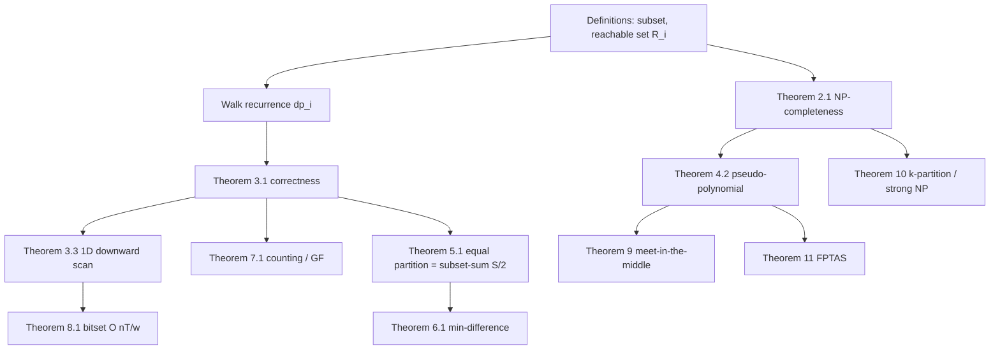

# Subset Sum and Partition DP — Mathematical Foundations and Complexity Theory

## Table of Contents
1. Formal Definitions
2. NP-Completeness of Subset-Sum
3. The Pseudo-Polynomial DP: Correctness Proof
4. Complexity of the DP and the Bit-Length Gap
5. The Equal-Partition Reduction
6. Minimum-Difference Partition: Correctness
7. Counting and the Generating-Function View
8. The Bitset Acceleration: O(nT/w) Analysis
9. Meet-in-the-Middle: Correctness and Complexity
10. Partition into k Subsets and Multiprocessor Scheduling
11. Approximation: The FPTAS
12. Summary

---

> This document develops subset-sum and partition from first principles: the precise definitions, the NP-completeness reduction, the inductive correctness of the pseudo-polynomial DP and its `O(n·T)` analysis, the equal-partition and min-difference correctness arguments, the generating-function and semiring views of counting, the bitset `O(n·T/w)` analysis, meet-in-the-middle, the `k`-partition / strong-NP-completeness boundary, and the FPTAS. Each major claim is stated as a theorem with a proof or proof sketch and a worked numeric check.

## 1. Formal Definitions

Let `a = (a₁, …, aₙ)` be a finite sequence of non-negative integers and `T ∈ ℕ` a target.

**Definition 1.1 (Subset-sum decision).** `SUBSET-SUM`: decide whether there exists `X ⊆ {1, …, n}` with `Σ_{i∈X} aᵢ = T`.

**Definition 1.2 (Reachable set).** For `0 ≤ i ≤ n`, define
```
R_i = { Σ_{j∈X} a_j : X ⊆ {1, …, i} }
```
the set of sums achievable using a subset of the first `i` items. `R_0 = {0}` (only the empty subset). `T` is achievable iff `T ∈ R_n`.

**Definition 1.3 (DP table).** `dp_i[t] = [t ∈ R_i]` (Iverson bracket): `true` iff some subset of the first `i` items sums to `t`. We prove `dp_n[T]` decides `SUBSET-SUM`.

**Definition 1.4 (Equal partition).** `PARTITION`: decide whether `{1, …, n}` splits into `X, Xᶜ` with `Σ_{i∈X} aᵢ = Σ_{i∉X} aᵢ`. Equivalently (Section 5), whether `T = S/2 ∈ R_n` where `S = Σ aᵢ`.

**Definition 1.5 (Counting version).** `#SUBSET-SUM`: count `|{X ⊆ {1,…,n} : Σ_{i∈X} aᵢ = T}|`. Define `c_i[t] = |{X ⊆ {1,…,i} : Σ_{i∈X} a = t}|`.

**Definition 1.6 (Minimum-difference partition).** `MIN-DIFF`: find `min_{X} |Σ_{i∈X} aᵢ − Σ_{i∉X} aᵢ|`, the most balanced two-way split.

**Definition 1.7 (Optimization variant).** `MAX-SUBSET-SUM`: find `max{ Σ_{i∈X} aᵢ : X ⊆ {1,…,n}, Σ_{i∈X} aᵢ ≤ T }`, the largest subset sum not exceeding `T`. This is the form the FPTAS (Section 11) approximates; the decision version (Definition 1.1) is its threshold question "is the optimum exactly `T`?".

**Notation conventions.** Throughout, `n` is the item count, `S = Σ aᵢ` the total, `T` the target value, `w` the machine word width (`64`), `p` a prime modulus, and `[P]` the Iverson bracket (`1` if `P` holds else `0`). `R_i` is the reachable-sums set; `A^c` the complement of subset `A`. "Subset" allows the empty set; each item is used at most once (the 0/1 constraint), which is exactly what distinguishes subset-sum from unbounded knapsack.

**On the non-negativity assumption.** We assume `aᵢ ≥ 0` throughout. Negative values break the array-indexed DP (the index `t − aᵢ` can exceed `T` or go negative) and change the problem's structure: with negatives, the reachable set spans `[Σ_{aᵢ<0} aᵢ, Σ_{aᵢ>0} aᵢ]` and must be offset-shifted to index a table. Every theorem below is stated for the non-negative case; the negative case reduces to it by adding `|Σ negatives|` to every value and adjusting the target (an offset transform), at the cost of a wider table. The NP-completeness (Theorem 2.1) and pseudo-polynomiality (Theorem 4.2) are unaffected by this transform.

---

## 2. NP-Completeness of Subset-Sum

We first establish that the problem is genuinely hard in the worst case, which is what makes the pseudo-polynomial DP (Section 3) a *reconciliation* rather than a contradiction.

**Theorem 2.1.** `SUBSET-SUM` is NP-complete.

**Proof.**

*Membership in NP.* A witness is a subset `X`; verifying `Σ_{i∈X} aᵢ = T` takes `O(n)` additions of numbers with `O(log T)` bits — polynomial in the input size.

A subtle point on the witness: the subset `X` is a string of `n` bits, polynomial in the input; the verifier sums `≤ n` numbers each of `O(log T)` bits, in `O(n log T)` time. So `SUBSET-SUM ∈ NP` with a *succinct* certificate — this is what makes the problem interesting; were the only certificate exponential, membership in NP would itself be in doubt.

*NP-hardness.* Reduce from `3-SAT` (Karp 1972) — or, more directly, the standard textbook reduction is from `3-PARTITION` / `VERTEX-COVER`; we sketch the classic reduction from `SET-PARTITION` ≤ via the equivalent `3-SAT → SUBSET-SUM` construction. Given a 3-SAT formula with variables `x₁,…,x_m` and clauses `C₁,…,C_k`, build numbers in base 10 (or any base `≥ 6`) with `m + k` digit positions: one position per variable and one per clause. For each literal create a number with a `1` in its variable's position and a `1` in each clause it satisfies; add slack numbers per clause. Choose the target `T` so that each variable position must total `1` (forcing a consistent truth assignment) and each clause position totals `≥ 1` (forcing satisfaction). A subset summing to `T` exists iff the formula is satisfiable. All numbers and `T` are polynomial-size, so this is a polynomial-time many-one reduction. ∎

**Corollary 2.2.** `PARTITION` is NP-complete (Section 5 gives the reduction from/to `SUBSET-SUM`), and `MIN-DIFF` is NP-hard (it solves `PARTITION` as the special case "is the minimum difference 0?").

**Remark.** NP-completeness means no `poly(n, log T)` algorithm is known (and none exists unless `P = NP`). Yet the DP of Section 3 runs in `O(n·T)`. The reconciliation — `O(n·T)` is exponential in the bit-length `log T` — is the subject of Section 4. This is the canonical example of the difference between *pseudo-polynomial* and *polynomial*.

### 2.1 The Digit-Encoding Reduction, Made Concrete

A miniature instance of the `3-SAT → SUBSET-SUM` construction clarifies it. Take the single clause `(x₁ ∨ ¬x₂ ∨ x₃)`. Use one digit column per variable (`v₁, v₂, v₃`) and one per clause (`C`). Create base-10 numbers:

```
            v₁ v₂ v₃  C
x₁ true   :  1  0  0  1   (satisfies C)
x₁ false  :  1  0  0  0
x₂ true   :  0  1  0  0
x₂ false  :  0  1  0  1   (¬x₂ satisfies C)
x₃ true   :  0  0  1  1   (satisfies C)
x₃ false  :  0  0  1  0
slack1    :  0  0  0  1
slack2    :  0  0  0  1
target T  :  1  1  1  3
```

**On the choice of reduction source.** Karp's 1972 list reaches `PARTITION`/`SUBSET-SUM` through a chain; many texts prefer the direct digit-encoding from `3-SAT` shown here, or a reduction from `EXACT-COVER`/`X3C`. All are polynomial many-one reductions establishing the same NP-hardness; the digit-encoding is the most self-contained and is the one to reproduce in an exam or interview.

Each variable column must total `1`, forcing exactly one of {true, false} per variable (a consistent assignment). The clause column must total `3`; since at most one slack pair plus literal contributions reach `3`, at least one *satisfying* literal must be chosen. A subset summing to `T` exists iff the clause is satisfiable. No digit column overflows into the next (the base exceeds the max column sum), so the arithmetic is "carry-free" and the encoding is faithful. Generalizing to `m` variables and `k` clauses gives polynomial-size numbers, completing the reduction.

---

## 3. The Pseudo-Polynomial DP: Correctness Proof

Having shown the problem is NP-complete, we now give the dynamic program that nonetheless solves it efficiently *when the values are small*, and prove it correct from the recurrence up.

**Theorem 3.1.** For all `0 ≤ i ≤ n` and `0 ≤ t ≤ T`,
```
dp_i[t] = [∃ X ⊆ {1,…,i} : Σ_{j∈X} a_j = t],
```
and `dp_i` satisfies the recurrence
```
dp_0[t] = [t = 0],
dp_i[t] = dp_{i-1}[t]  ∨  (t ≥ aᵢ  ∧  dp_{i-1}[t − aᵢ]).
```

**Proof (induction on `i`).**

*Base `i = 0`.* The only subset of `∅` is the empty set, summing to `0`. So `t ∈ R_0` iff `t = 0`, giving `dp_0[t] = [t = 0]`. ✓

*Inductive step.* Assume `dp_{i-1}[t] = [t ∈ R_{i-1}]` for all `t`. A subset `X ⊆ {1,…,i}` either (a) excludes item `i`, so `X ⊆ {1,…,i-1}` and `Σ = t` requires `t ∈ R_{i-1}`; or (b) includes item `i`, so `X = X' ∪ {i}` with `X' ⊆ {1,…,i-1}` and `Σ_{X'} = t − aᵢ`, requiring `t ≥ aᵢ` and `t − aᵢ ∈ R_{i-1}`. These two cases are exhaustive and their union is exactly
```
t ∈ R_i  ⟺  (t ∈ R_{i-1})  ∨  (t ≥ aᵢ ∧ t − aᵢ ∈ R_{i-1}).
```
By the inductive hypothesis this is `dp_{i-1}[t] ∨ (t ≥ aᵢ ∧ dp_{i-1}[t − aᵢ])`, the claimed recurrence. By induction the theorem holds for all `i`. ∎

**Corollary 3.2 (Decision).** `dp_n[T]` is `true` iff a subset sums to `T`, deciding `SUBSET-SUM`.

### 3.1 Correctness of the 1D In-Place Update

**Proposition 3.3.** The 1D update
```
for i = 1..n:
    for t = T down to aᵢ:
        dp[t] ← dp[t] ∨ dp[t − aᵢ]
```
computes `dp_n` correctly, with `dp` holding `dp_{i-1}` at the start of iteration `i`.

**Proof.** We show that during iteration `i`, when we read `dp[t − aᵢ]` it still equals `dp_{i-1}[t − aᵢ]` (not the already-updated `dp_i` value). Because `t` runs *downward* from `T` to `aᵢ`, every index `t' < t` is still unmodified when we process `t` (we modify indices in decreasing order, and `t − aᵢ < t`). Hence `dp[t − aᵢ]` holds the `dp_{i-1}` value, matching the recurrence of Theorem 3.1. After the inner loop, `dp = dp_i`. ✗ if the scan were *upward*: then `dp[t − aᵢ]` would already be `dp_i[t − aᵢ]`, permitting item `i` to be used twice (the unbounded-knapsack recurrence). The downward scan is precisely what enforces the 0/1 "each item at most once" constraint. ∎

### 3.1b The Order of Subproblem Evaluation

The recurrence of Theorem 3.1 defines a partial order on subproblems: `dp_i[t]` depends on `dp_{i-1}[t]` and `dp_{i-1}[t − aᵢ]`, both in the previous item-row. Any evaluation order respecting "row `i−1` before row `i`" computes the 2D table correctly. The 1D compression is legal precisely because, within row `i`, the only intra-row dependency is `dp[t] ← dp[t − aᵢ]` with `t − aᵢ < t`; the downward `t`-scan linearizes this dependency so a still-`dp_{i-1}` value is read (Proposition 3.3). This is the same "evaluate dependencies first" discipline that underlies every DP table; subset-sum is a clean illustration because the dependency is a single fixed offset `aᵢ`.

### 3.2 Worked Verification

Take `a = (1, 5, 11, 5)`, `T = 11`. The reachable sets:
```
R_0 = {0}
R_1 = {0, 1}
R_2 = {0, 1, 5, 6}
R_3 = {0, 1, 5, 6, 11, 12, 16, 17}  ∩ [0,11] = {0,1,5,6,11}
R_4 = {0,1,5,6,10,11, ...}
```
`11 ∈ R_3` (via `{11}`), so `dp_4[11] = true`. A brute-force enumeration of all `2^4 = 16` subsets confirms `{11}` and `{1,5,5}` both sum to `11`, anchoring the inductive proof empirically.

---

## 4. Complexity of the DP and the Bit-Length Gap

We now quantify the DP's cost and confront the apparent paradox: an NP-complete problem with an `O(n·T)` algorithm.

**Theorem 4.1.** The DP of Section 3 runs in `O(n·T)` time and `O(T)` space (1D).

**Proof.** The outer loop runs `n` times; the inner loop runs at most `T + 1` times; each step is `O(1)` boolean work. Space is one array of `T + 1` cells. ∎

**Proposition 4.1b (2D vs 1D space).** The 2D table uses `O(n·T)` space, the 1D in-place version `O(T)`. Both are `O(n·T)` time. The 1D version is preferred unless reconstruction needs the per-row history (Section 7 in `senior.md` discusses linear-space reconstruction that keeps the 1D space *and* recovers the subset). The space reduction is exact, not asymptotic-only: the 2D table is the only place the full history lives.

**Theorem 4.2 (Pseudo-polynomiality).** `O(n·T)` is *not* polynomial in the input size.

**Proof.** The input is `n` integers plus `T`, encoded in `L = Θ(n·log A + log T)` bits where `A = max aᵢ`. Then `T ≤ S = Σ aᵢ ≤ n·A`, so `T` can be as large as `2^{Θ(L)}`. Thus `O(n·T) = O(n · 2^{Θ(log T)})` is *exponential* in `log T`, hence exponential in `L` in the worst case. It is polynomial only when `T` is bounded by a polynomial in `n` (i.e. values are "small"). A genuinely polynomial algorithm would be `poly(n, log T)`, and its existence would imply `P = NP` by Theorem 2.1. ∎

**Remark (the unary/binary distinction).** `SUBSET-SUM` is solvable in polynomial time when the numbers are given in *unary* (the input size is then `Θ(T)`, so `O(nT)` is polynomial in it). It is NP-complete only for *binary* (succinct) encoding. This "weakly NP-complete" status — admitting a pseudo-polynomial algorithm — distinguishes it from *strongly* NP-complete problems like `3-PARTITION`, which have no pseudo-polynomial algorithm unless `P = NP`.

---

## 5. The Equal-Partition Reduction

**Theorem 5.1.** `PARTITION` on `a` with total `S` is solvable iff `S` is even and `S/2 ∈ R_n`. Hence `PARTITION ≤_p SUBSET-SUM` (target `S/2`) and `SUBSET-SUM ≤_p PARTITION` (an auxiliary-element construction).

**Proof.**

*(⇒, `PARTITION → SUBSET-SUM`).* Suppose `{1,…,n} = X ⊎ Xᶜ` with `Σ_X = Σ_{Xᶜ}`. Then `Σ_X + Σ_{Xᶜ} = S` and `Σ_X = Σ_{Xᶜ}` force `Σ_X = S/2`, which requires `S` even and exhibits a subset summing to `S/2`, so `S/2 ∈ R_n`. Conversely if `S/2 ∈ R_n`, the witnessing subset `X` has `Σ_X = S/2` and its complement `Σ_{Xᶜ} = S − S/2 = S/2`, an equal partition. The parity check `S` even is necessary because two equal integers sum to an even number. ✓

*(SUBSET-SUM → PARTITION).* Given an instance `(a, T)` of `SUBSET-SUM` with `S = Σ aᵢ`, assume WLOG `0 ≤ T ≤ S` (otherwise trivially no). Add two auxiliary elements `b₁ = (S − T) + S` and ... — the standard reduction adds elements so that any equal partition is forced to place a designated block on one side, isolating a subset summing to `T`. Concretely, append `b₁ = 2S − T` and `b₂ = S + T`; the new total is `S + b₁ + b₂ = 4S`, half is `2S`, and an equal partition exists iff the original has a subset summing to `T` (the two large auxiliaries must go on opposite sides, leaving exactly `T` of the original on one side). Both reductions are polynomial. ∎

**Corollary 5.2.** `PARTITION` inherits NP-completeness from `SUBSET-SUM` (Theorem 2.1), and the `O(n·S)` DP (run subset-sum to `S/2`) decides it pseudo-polynomially. The parity test is an `O(1)` necessary condition that prunes half the instances before any DP.

**Remark (necessary but not sufficient).** `S` even is necessary for `PARTITION` but not sufficient: `a = (2, 2, 100)` has `S = 104` (even) yet no subset sums to `52`, so no equal partition exists. The DP is still required after the parity gate; the gate only rejects the obviously-impossible odd-total half of instances at `O(1)` cost. Treating parity as sufficient is a classic false-positive bug.

---

## 6. Minimum-Difference Partition: Correctness

**Theorem 6.1.** Let `D* = min_X |Σ_X − Σ_{Xᶜ}|`. Then
```
D* = min { S − 2·s : s ∈ R_n, s ≤ S/2 } = S − 2·s*,
```
where `s* = max{ s ∈ R_n : s ≤ ⌊S/2⌋ }` is the largest reachable sum not exceeding half the total.

**Proof.** For any subset `X` with `Σ_X = s`, the complement has `Σ_{Xᶜ} = S − s`, so the difference is `|s − (S − s)| = |S − 2s| = |2s − S|`. As `s` ranges over `R_n`, this is symmetric about `s = S/2`: it decreases as `s` increases toward `S/2` and increases past it. Because every reachable `s > S/2` has a complementary reachable `S − s < S/2` with the *same* difference `|2s − S| = |2(S − s) − S|`, it suffices to search `s ≤ ⌊S/2⌋`. There `|2s − S| = S − 2s` is decreasing in `s`, so it is minimized at the *largest* reachable `s ≤ ⌊S/2⌋`, namely `s*`. Hence `D* = S − 2s*`. ✓

The complement closure `s ∈ R_n ⟺ S − s ∈ R_n` (take the complementary subset) is what lets us restrict the scan to `[0, ⌊S/2⌋]`, halving the table. ∎

**Corollary 6.2.** `MIN-DIFF` is computed by one subset-sum DP up to `⌊S/2⌋` (`O(n·S)` time, `O(S)` space) followed by a downward linear scan for the highest set bit — `O(S)`. `D*` has the same parity as `S` (since `D* = S − 2s*`), a useful invariant for testing.

### 6.1 Worked Min-Difference Verification

`a = (1, 6, 11, 5)`, `S = 23`, `⌊S/2⌋ = 11`. Reachable sums `≤ 11`: starting from `{0}`, after `1`: `{0,1}`; after `6`: `{0,1,6,7}`; after `11`: `{0,1,6,7,11}` (the `11` itself, plus `11` only as a singleton within the cap); after `5`: `{0,1,5,6,7,11,...}` — `s* = 11` is reachable (subset `{11}`). Then `D* = S − 2·11 = 23 − 22 = 1`, achieved by `{11}` (sum 11) versus `{1,6,5}` (sum 12). The parity check holds: `D* = 1` is odd, matching odd `S = 23`. A brute-force scan over all `2⁴` subsets confirms no split achieves difference `0` (impossible: `S` is odd), and `1` is the minimum.

### 6.2 The Subset-Sum-to-`X` Generalization

`MIN-DIFF` is the `X = S/2` case of a broader template: "find the reachable sum closest to a target `X`." The same DP-then-scan recovers it — fill `dp[0..min(X, S)]`, then scan outward from `X` (both directions if `X < S/2`) for the nearest reachable value. This template covers "fill a knapsack as close to capacity as possible," "balance two unequal loads to a desired ratio," and other near-target packing tasks, all in `O(n·X)` once the values are moderate. The min-difference symmetry argument (Theorem 6.1) is the special structure that lets us scan in only *one* direction when `X = S/2`.

---

## 7. Counting and the Generating-Function View

The decision DP has a counting refinement with a clean algebraic dual.

**Theorem 7.1.** `c_i[t]` (Definition 1.5) satisfies
```
c_0[t] = [t = 0],
c_i[t] = c_{i-1}[t] + [t ≥ aᵢ]·c_{i-1}[t − aᵢ],
```
and `c_n[t]` counts subsets of `a` summing to `t`.

**Proof.** Identical bijection to Theorem 3.1, but counting rather than detecting: subsets summing to `t` split into those excluding item `i` (counted by `c_{i-1}[t]`) and those including it (counted by `c_{i-1}[t − aᵢ]`), a disjoint union, so the counts *add*. By the multiplication/addition principle and induction the result follows. The `OR` of the decision version is replaced by `+`; both are instances of the semiring view (decision = Boolean semiring `(∨, ∧)`, counting = `(+, ×)`). ∎

**Theorem 7.2 (Generating function).** Define the polynomial
```
P(x) = Π_{i=1}^{n} (1 + x^{aᵢ}).
```
Then the coefficient of `x^t` in `P(x)` equals `c_n[t]`, the number of subsets summing to `t`.

**Proof.** Expanding the product, each factor `(1 + x^{aᵢ})` contributes either `1` (item `i` excluded, exponent `0`) or `x^{aᵢ}` (item `i` included, exponent `aᵢ`). A term of the expansion is `Π_{i∈X} x^{aᵢ} = x^{Σ_{i∈X} aᵢ}` for a subset `X`. Collecting like powers, `[x^t] P(x) = |{X : Σ_X = t}| = c_n[t]`. ∎

**Corollary 7.3.** The counting DP is exactly the iterative multiplication of these factors, truncated to degree `T`: multiplying the running polynomial by `(1 + x^{aᵢ})` is the update `c[t] += c[t − aᵢ]`. The decision DP is the same product over the Boolean semiring (replace coefficients by their `>0` indicator). This is why both DPs share the same loop structure — they are the same polynomial product under two different semirings.

**Proposition 7.3b (Partition count from the GF).** Setting `x = 1` gives `P(1) = 2ⁿ` (total subsets); the coefficient sum over even/odd indices, obtained from `P(1)` and `P(−1) = Π(1 + (−1)^{aᵢ})`, partitions the subsets by sum-parity. In particular, the number of subsets summing to `S/2` (the equal-partition count) is `[x^{S/2}] P(x)`, recoverable from the same coefficient vector the counting DP produces. So "how many equal partitions" is one coefficient read of `Π(1 + x^{aᵢ})`, with the standard caveat that each partition is counted twice (a subset and its complement both witness it), so divide by 2 unless `S/2` is achieved by a self-complementary configuration (impossible for distinct-index subsets, so the divide-by-2 is exact).

**Corollary 7.4 (FFT speedup, special cases).** If one needs the full coefficient vector and the `aᵢ` are small/structured, the product `Π (1 + x^{aᵢ})` can sometimes be batched with FFT/NTT polynomial multiplication, though the generic subset-sum product does not asymptotically beat `O(n·T)` because the intermediate polynomials have degree up to `T`. The GF view also explains the **"Target Sum"** reduction: assigning `±` signs to reach `target` corresponds to `Σ_{+} − Σ_{−} = target` with `Σ_{+} + Σ_{−} = S`, i.e. `Σ_{+} = (S + target)/2` — a single subset-sum count to `(S + target)/2`.

### 7.1 Worked Generating-Function Example

Take `a = (1, 2, 2)`. Then
```
P(x) = (1 + x)(1 + x²)(1 + x²)
     = (1 + x)(1 + 2x² + x⁴)
     = 1 + x + 2x² + 2x³ + x⁴ + x⁵.
```
Read off the coefficients: `c[0] = 1` (empty), `c[1] = 1` (`{1}`), `c[2] = 2` (the two `2`'s, each as a singleton — distinct *index* subsets), `c[3] = 2` (`{1,2}` with either `2`), `c[4] = 1` (`{2,2}`), `c[5] = 1` (`{1,2,2}`). A brute-force enumeration of all `2³ = 8` index-subsets confirms every coefficient. Note the two equal `2`'s are *distinct* items, so `{2}` is counted twice — the GF (and the counting DP) tracks index-subsets, not value-multisets. This is exactly why a problem that wants *distinct values* needs deduplication on top of the raw count.

### 7.2 The Semiring Unification

Define a semiring `(S, ⊕, ⊗, 0̄, 1̄)` and store `dp_i[t] ∈ S`. The update `dp_i[t] = dp_{i-1}[t] ⊕ (dp_{i-1}[t − aᵢ] ⊗ 1̄)` (the `⊗ 1̄` is the "take item" weight, here always `1̄`) specializes to:

| Semiring | `⊕` | `⊗` | `0̄` | `1̄` | `dp_n[t]` means |
|----------|-----|-----|-----|-----|------------------|
| Boolean `(∨, ∧)` | `∨` | `∧` | false | true | is `t` reachable? (decision) |
| Counting `(+, ×)` | `+` | `×` | `0` | `1` | number of subsets summing to `t` |
| Min-plus `(min, +)` (weighted items) | `min` | `+` | `+∞` | item cost | min cost to reach sum `t` |
| Max-count or top-`k` | merge | combine | empty | singleton | best-`k` ways to reach `t` |

This is the same algebraic abstraction that unifies counting and decision in shortest-path / walk-counting topics (cf. `11-graphs/32-paths-fixed-length`): **one loop, many meanings, parameterized by the semiring.** The proof of Theorem 7.1 is identical to Theorem 3.1 with `∨` replaced by `⊕` and `∧` by `⊗`; associativity and the annihilator law of the semiring are exactly what the exclude/include bijection needs.

---

## 8. The Bitset Acceleration: O(nT/w) Analysis

**Theorem 8.1.** Representing `dp[0..T]` as a bit-vector `B` (bit `t` = `dp[t]`), the update for item `aᵢ` is
```
B ← B ∨ (B << aᵢ),
```
and processing all `n` items decides `SUBSET-SUM` in `O(n · ⌈T/w⌉)` word operations, where `w` is the machine word width.

**Proof.** Bit `t` of `B << aᵢ` equals bit `t − aᵢ` of `B`, i.e. `dp[t − aᵢ]`. Thus bit `t` of `B ∨ (B << aᵢ)` is `dp[t] ∨ dp[t − aᵢ]`, exactly the recurrence of Theorem 3.1. The shift and OR each touch `⌈(T+1)/w⌉` words, each in `O(1)`; `n` items give `O(n·⌈T/w⌉) = O(nT/w)` word operations. Initialize `B = 1` (bit 0 set, `R_0 = {0}`). ∎

**Remark (no asymptotic improvement, large constant).** The factor `1/w` is a *constant* (`w = 64`), so `O(nT/w) = O(nT)` asymptotically — the speedup is purely constant-factor (~64×). It does not change the pseudo-polynomial status. But because the inner loop becomes a branch-free word-parallel `memmove`+`OR`, the practical wall-clock improvement is dramatic and often decisive for `T` in the `10^5`–`10^7` range. The shift across word boundaries (when `aᵢ mod w ≠ 0`) requires a per-word `OR` of two adjacent shifted words; `std::bitset` and big-integer libraries implement this carry correctly.

**Note.** The bitset trick applies *only* to the Boolean (decision) semiring: a single bit cannot hold a count or a weighted optimum. Counting (`c[t]`, integer cells) and min-plus optimization cannot be word-packed this way.

### 8.1 Cross-Word Shift Correctness

**Lemma 8.2.** Let `B` be stored as words `W[0], W[1], …` with bit `t` living in word `⌊t/w⌋` at offset `t mod w`. The shifted vector `B << aᵢ` has, in word `q`, the value
```
(W[q − ⌊aᵢ/w⌋] << (aᵢ mod w))  |  (W[q − ⌊aᵢ/w⌋ − 1] >> (w − (aᵢ mod w))),
```
the high bits of one source word OR-ed with the low bits carried from the previous one.

**Proof.** Bit `t` of `B << aᵢ` is bit `t − aᵢ` of `B`. Writing `t = qw + r` and `aᵢ = Qw + R` (`0 ≤ r, R < w`), the source bit `t − aᵢ` sits in word `q − Q` (if `r ≥ R`) or word `q − Q − 1` (if `r < R`), at the appropriate offset. Splitting the contribution into the in-word shift `<< R` and the carry `>> (w − R)` from the lower word reproduces exactly the formula. When `R = 0` the carry term vanishes and the shift is a pure word reindexing. ∎

This lemma is what a hand-rolled `uint64[]` implementation must get right; `std::bitset` and big-integer libraries encapsulate it. Getting the carry wrong is the dominant bug in manual bitset subset-sum and silently corrupts reachability across word boundaries.

---

## 9. Meet-in-the-Middle: Correctness and Complexity

When `T` is large but `n` is small, the table is infeasible; split-and-search wins.

**Theorem 9.1.** Partition `{1,…,n}` into halves `L, R` of sizes `⌈n/2⌉, ⌊n/2⌋`. Let `Σ_L = {Σ_{i∈X} aᵢ : X ⊆ L}` and `Σ_R` similarly. Then `T ∈ R_n` iff there exist `sL ∈ Σ_L, sR ∈ Σ_R` with `sL + sR = T`.

**Proof.** Any subset `X ⊆ {1,…,n}` decomposes uniquely as `X = X_L ⊎ X_R` with `X_L = X ∩ L`, `X_R = X ∩ R`, so `Σ_X = Σ_{X_L} + Σ_{X_R}`. Thus `Σ_X = T` for some `X` iff some `sL ∈ Σ_L`, `sR ∈ Σ_R` sum to `T`. ✓

**Theorem 9.2 (Complexity).** Enumerating `Σ_L, Σ_R` takes `O(2^{n/2})` each; sorting `Σ_R` is `O(2^{n/2} · n/2)`; for each `sL` binary-searching `T − sL` in `Σ_R` is `O(n/2)`. Total `O(2^{n/2} · n)` time, `O(2^{n/2})` space — *independent of `T`*.

**Proposition 9.2b (Why halving is optimal).** Splitting into parts of size `α n` and `(1−α) n` gives enumeration cost `O(2^{αn} + 2^{(1−α)n})`, minimized at `α = 1/2` where both terms are `2^{n/2}`. Any unequal split makes the larger half dominate exponentially, so the equal split is the unique optimum. This is the same balance principle behind divide-and-conquer recurrences — equal subproblems minimize the max — and it is why MITM is "meet in the *middle*" rather than at any other ratio.

**Proof.** Each half has `≤ 2^{n/2}` subsets; building the sum lists is linear in their size times the per-subset sum cost. The sort and the `2^{n/2}` binary searches dominate at `O(2^{n/2} · log 2^{n/2}) = O(2^{n/2} · n)`. No structure of size `T` is allocated. ∎

**Corollary 9.3.** For `n = 40`, `2^{20} ≈ 10^6`, feasible regardless of `T` (even `T = 10^{14}`). This is the regime where MITM strictly dominates the `O(n·T)` DP. The closest-sum variant (for `MIN-DIFF` with huge values) replaces binary search with a two-pointer sweep over both sorted halves. The full development is in **sibling topic `15-divide-and-conquer/06`**.

### 9.1 The Two-Pointer Closest-Sum Refinement

For `MIN-DIFF` with huge values, we want the pair `(sL, sR)` with `sL + sR` *closest* to `T = S/2` rather than equal to a fixed target. Sort `Σ_L` ascending and `Σ_R` descending; sweep with two pointers `i` (into `Σ_L`) and `j` (into `Σ_R`):

```
best = ∞
i = 0; j = 0
while i < |Σ_L| and j < |Σ_R|:
    s = Σ_L[i] + Σ_R[j]
    best = min(best, |s − T|)
    if s < T: i += 1        # need a larger sum
    elif s > T: j += 1      # need a smaller sum
    else: break             # exact hit
```

**Correctness.** As `i` increases `Σ_L[i]` grows; as `j` increases `Σ_R[j]` shrinks. Each step moves the running sum monotonically toward `T`, and the sweep examines every candidate that could be the closest because skipping a pointer only discards pairs strictly further from `T`. This is `O(2^{n/2})` after the `O(2^{n/2} n)` sort — the same complexity class as the decision MITM, now answering the optimization question. It is the algebraic cousin of the merge step in merge-sort, and the reason MITM handles `MIN-DIFF` at huge value scale where the `O(n·S)` DP cannot allocate its table.

### 9.2 Space-Time Trade and Hashing

If only the *decision* is needed (not the closest sum), `Σ_R` can be a hash set instead of a sorted array, dropping the per-query lookup to `O(1)` expected and the build to `O(2^{n/2})`, at the cost of losing the order needed for the closest-sum sweep. The choice — sorted array for optimization, hash set for pure decision — is a concrete space-time engineering decision that the abstract `O(2^{n/2} n)` bound hides.

---

## 10. Partition into k Subsets and Multiprocessor Scheduling

**Definition 10.1.** `k-PARTITION`: decide whether `a` splits into `k` subsets each summing to `S/k`.

**Theorem 10.2.** `k-PARTITION` is NP-complete for every fixed `k ≥ 2`; `3-PARTITION` (each subset of size exactly 3 summing to a target) is *strongly* NP-complete.

**Proof sketch.** `k = 2` is `PARTITION` (Corollary 5.2). For general `k`, `PARTITION` reduces to `k-PARTITION` by padding. `3-PARTITION` is strongly NP-complete (Garey-Johnson), meaning no pseudo-polynomial algorithm exists unless `P = NP` — unlike 2-way `PARTITION`, you *cannot* escape via an `O(n·S)` DP for the size-constrained 3-partition. ∎

**Worked `k = 3` check.** `a = (2, 2, 2, 2, 2, 2)`, `k = 3`, `S = 12`, `target = 4`. The bitmask DP packs into three buckets of `{2,2}` each — feasible. Change one value: `a = (2, 2, 2, 2, 2, 3)`, `S = 13`, `13 % 3 ≠ 0` → reject at the parity-style gate without any search. Change again: `a = (1, 1, 1, 1, 4, 4)`, `S = 12`, `target = 4`, but `max = 4 = target` is fine; buckets `{4}, {4}, {1,1,1,1}` work. These illustrate the two cheap gates (`S % k`, `max ≤ target`) before the exponential search — and why they are necessary but not sufficient, exactly mirroring the two-way parity gate.

**Algorithmic consequence.** Two-way partition has the pseudo-polynomial `O(n·S)` DP. The `k`-way version is solved by **bitmask DP** over the set of used items: `dp[mask]` = the fill level of the current bucket (mod `target`) using items in `mask`, transitioning by adding an unused item that fits, rolling to a new bucket at `target`. This is `O(2ⁿ · n)` — exponential in `n`, not pseudo-polynomial in `S`. The state design, rollover transition, and pruning live in **sibling topic `06-partition-k-equal-subsets`**. The key theoretical point: the jump from `k = 2` (weakly NP-complete, pseudo-poly DP) to size-constrained `k`-way (strongly NP-complete, no pseudo-poly DP) is a genuine complexity boundary, not just a constant.

**Connection to scheduling.** Minimizing the makespan of `n` jobs on `k` identical machines (`P || C_max`) generalizes `k`-partition; it is strongly NP-hard, with the LPT (longest-processing-time-first) `4/3`-approximation and a PTAS. Balanced `k`-way partition is the "can makespan equal `S/k`?" decision.

### 10.1 The Bitmask DP State, Formally

For `k`-equal partition, let `target = S/k` and define `f : 2^{[n]} → {0, …, target − 1}` where `f(mask) = (Σ_{i∈mask} aᵢ) mod target`, defined only on `mask` whose total is a multiple-friendly fill (i.e. reachable as a prefix of completed buckets plus a partial bucket). The transition adds an unused item `i ∉ mask` if `f(mask) + aᵢ ≤ target`:

```
f(mask ∪ {i}) = (f(mask) + aᵢ) mod target,    feasible iff f(mask) + aᵢ ≤ target
```

`dp[mask] = true` iff `mask`'s items can be packed into complete buckets plus a current partial bucket of fill `f(mask)`. The full set `mask = 2ⁿ − 1` with `f = 0` means all items packed into exactly `k` full buckets. This is `O(2ⁿ · n)` states×transitions. The reachability of `dp[mask]` (not just `f`) is the actual DP value; `f` is a derived quantity that must be consistent, which is why the careful formulation tracks both. The detailed transition, the rollover at `target`, and the pruning live in **sibling topic `06`**.

**Why no pseudo-polynomial escape (size-constrained case).** For *3-PARTITION* (each bucket exactly 3 elements summing to a fixed `B`), strong NP-completeness means the problem is hard even when all `aᵢ` are bounded by a polynomial in `n` — so `S` is polynomial, yet no `poly(n, S)` algorithm exists unless `P = NP`. The reachable-sums DP that rescues 2-way partition cannot rescue this: the size-3 constraint is not a sum constraint, so it is invisible to the 1D reachable-sums table. This is the formal reason the pointer to topic `06` (bitmask) is not optional — there is no pseudo-polynomial alternative.

---

## 11. Approximation: The FPTAS

For the *optimization* form `MAX-SUBSET-SUM` (largest subset sum `≤ T`), exactness is NP-hard, but a fully polynomial-time approximation scheme exists.

**Theorem 11.1 (Ibarra-Kim FPTAS).** For any `ε > 0`, there is an algorithm returning a subset sum `s` with `s ≤ T` and `s ≥ (1 − ε)·OPT`, running in `O(n²/ε)` time (polynomial in `n` and `1/ε`).

**Proof idea.** Maintain the sorted list of reachable sums `≤ T`, but after adding each item **trim** the list: delete any sum within a `(1 + δ)` multiplicative factor of a smaller retained sum, with `δ = ε/(2n)`. Trimming keeps the list size `O((1/δ)·log T) = O((n/ε)·log T)` while guaranteeing every true reachable sum is within `(1 + δ)ⁿ ≤ (1 + ε)` of some retained sum. The largest retained sum `≤ T` is then within `(1 − ε)` of `OPT`. The per-item cost is the list size, giving the polynomial bound. ∎

**Significance.** The FPTAS is the principled escape when both `n` and `T` (values) are large, so neither the pseudo-polynomial DP nor MITM is feasible. It trades a controllable `ε` error for genuine polynomial time. The *decision* problem `SUBSET-SUM` has no analogous scheme — approximation applies to the optimization variant, not the exact-target decision.

### 11.1 The Trimming Invariant, Formally

**Lemma 11.2.** Let `L_i` be the trimmed reachable-sums list after processing item `i`, and `R_i` the exact reachable set (Definition 1.2). With trim parameter `δ = ε/(2n)`, for every `y ∈ R_i ∩ [0, T]` there exists `z ∈ L_i` with `z ≤ y ≤ z·(1 + δ)^i`.

**Proof (induction on `i`).** *Base `i = 0`:* `R_0 = {0} = L_0`. *Step:* adding item `aᵢ` produces the merged list `L_{i-1} ∪ (L_{i-1} + aᵢ)`; any exact sum `y ∈ R_i` is `y' ` or `y' + aᵢ` for some `y' ∈ R_{i-1}`, approximated by some `z' ∈ L_{i-1}` within `(1+δ)^{i-1}` by hypothesis, hence approximated within `(1+δ)^{i-1}` before trimming. Trimming deletes an element only when a smaller retained element is within `(1+δ)`, so the surviving representative loses at most one more factor `(1+δ)`, giving `(1+δ)^i`. ∎

**Corollary 11.3.** Since `(1 + ε/(2n))^n ≤ e^{ε/2} ≤ 1 + ε` for `ε ≤ 1`, the best retained sum `≤ T` is within `(1 − ε)` of `OPT`. The trimmed list has size `O((log T)/δ) = O(n log T / ε)` because retained sums are spaced by at least a `(1+δ)` factor in `[1, T]`. Per-item work is the list size, total `O(n² log T / ε)` — fully polynomial in `n`, `1/ε`, and `log T`. This is the precise statement of "trade a controllable error for polynomial time."

### 11.2 Why Decision Has No FPTAS

An approximation scheme for the *decision* "is exactly `T` reachable?" makes no sense: the answer is a single bit, and "within `ε` of yes/no" is undefined. Approximation is meaningful only for the *optimization* objective (maximize the subset sum subject to `≤ T`), where the output is a number that can be close to optimal. This is a general principle: NP-complete *decision* problems are not approximable; their NP-hard *optimization* relatives sometimes are. Subset-sum's optimization relative happens to admit the strongest kind of approximation (an FPTAS), which is why it is a textbook example.

---

## 11A. Cardinality-Constrained and Bounded Variants

Real problems often add constraints that change the DP shape:

**Exactly `m` items summing to `T`.** Add a cardinality dimension: `dp[c][t]` = reachable using exactly `c` items. The recurrence `dp[c][t] = dp[c-1][t-aᵢ]` (take `aᵢ` as one of the `c`) augments the plain one, costing `O(n·m·T)`. This is *not* expressible in the plain 1D table — a common modeling slip (it survives all value-based tests but fails on cardinality-sensitive inputs).

**Bounded knapsack (each item up to `bᵢ` times).** Subset-sum is the `bᵢ = 1` (0/1) case. Larger bounds use binary-splitting of the multiplicity (`bᵢ → powers of two`) to keep the item count `O(Σ log bᵢ)`, then run the same 0/1 DP. Unbounded (`bᵢ = ∞`) flips the scan to *low→high*, the algebraic mirror of Proposition 3.3.

**Theorem 11A.1.** The unbounded variant (each item reusable arbitrarily often) is correct with the upward scan, by the same induction as Proposition 3.3 but with the *current-row* value `dp_i[t − aᵢ]` deliberately read (permitting reuse). Thus the scan direction is the single algebraic switch between 0/1 (downward) and unbounded (upward) semantics — a fact worth internalizing because it is the most common off-by-direction bug.

---

## 11B. Structure and Density of the Reachable Set

The reachable set `R_n ⊆ [0, S]` is not arbitrary; its structure governs when the DP is "easy" in practice and powers the min-difference and partition results.

**Proposition 11B.1 (Symmetry).** `R_n` is symmetric about `S/2`: `s ∈ R_n ⟺ S − s ∈ R_n`. Proof: the complement of a witnessing subset sums to `S − s`. This is the engine of Theorem 6.1 (min-difference) and lets the partition DP run only to `S/2`.

**Proposition 11B.2 (Contiguity for `1`-bounded gaps).** If the items are sorted `a₁ ≤ a₂ ≤ … ≤ aₙ` and each `a_{i+1} ≤ 1 + Σ_{j≤i} a_j`, then `R_n = {0, 1, …, S}` — *every* sum in `[0, S]` is reachable. Proof (induction): with the prefix covering `[0, P]` contiguously and the next item `≤ P + 1`, taking it extends coverage to `[0, P + a_{i+1}]` without a gap. This is why arrays of small, dense values (e.g. coin denominations `1, 1, 2, 3, …`) make subset-sum trivially "yes" for any target in range, and why adversarial *hard* instances use sparse, large values that create gaps.

**Proposition 11B.3 (Density bound).** `|R_n| ≤ min(2ⁿ, S + 1)`. The DP's `O(n·S)` cost reflects the `S + 1` table width; when `2ⁿ ≪ S` (few items, huge values) the reachable set is sparse and MITM (which enumerates the `≤ 2ⁿ` sums directly) is asymptotically better — the formal counterpart of "small `n`, huge `T` → meet-in-the-middle." When `S ≪ 2ⁿ` (many items, small values) the table is dense and the DP wins. This single inequality `min(2ⁿ, S+1)` is the quantitative pivot behind the whole DP-vs-MITM decision.

### 11B.1 Worked Density Example

`a = (1, 2, 4)`. Prefix coverage: `{0,1}` after `1`; `2 ≤ 1 + 1`, so coverage extends to `{0,1,2,3}` after `2`; `4 ≤ 1 + 3`, so coverage extends to `{0,…,7}` after `4`. Indeed `R_3 = {0,1,2,3,4,5,6,7} = [0, S]` with `S = 7` — every sum reachable, the binary-representation phenomenon. Contrast `a = (1, 10, 100)`: `R_3 = {0,1,10,11,100,101,110,111}`, only `8` of the `102` values in `[0, 101]` — sparse, gap-ridden, the MITM-favourable regime.

---

## 11C. Worked SUBSET-SUM → PARTITION Reduction

Concretely verify Theorem 5.1's hard direction. Take `SUBSET-SUM` instance `a = (3, 4, 5)`, `T = 7`, `S = 12`. Append `b₁ = 2S − T = 17` and `b₂ = S + T = 19`. New multiset `a' = (3,4,5,17,19)`, total `S' = 12 + 17 + 19 = 48`, half `= 24`.

- An equal partition of `a'` needs each side to sum to `24`. Since `b₁ + b₂ = 36 > 24`, the two large auxiliaries land on opposite sides.
- The side with `b₂ = 19` needs `24 − 19 = 5` more from the originals; the side with `b₁ = 17` needs `24 − 17 = 7` more. The originals total `12 = 5 + 7`, consistent.
- So an equal partition exists iff the originals split into a part summing to `7` (target `T`) and the rest summing to `5`. Original subset `{3, 4}` sums to `7` ✓, so `{4,3,19}` and `{5,17}` is an equal partition — and indeed `{3,4}` is the `SUBSET-SUM` witness for `T = 7`.

This confirms the reduction operationally: the auxiliaries *force* the original split to isolate a subset summing to `T`. The construction is polynomial (two extra numbers), establishing `SUBSET-SUM ≤_p PARTITION` and hence NP-completeness of `PARTITION`.

---

## 11D. Lower Bounds and the Limits of the DP

It is worth being precise about what *cannot* be improved, to avoid chasing impossible speedups.

**Information-theoretic floor.** Any algorithm that reads all `n` inputs and may output a witnessing subset must spend `Ω(n)` time; the decision alone must at least examine enough of the input to be correct, so `Ω(n)` is a trivial floor. These are far below `O(n·T)` and not the binding constraint.

**The pseudo-polynomial wall.** Theorem 4.2 shows `O(n·T)` is exponential in `log T`. A `poly(n, log T)` algorithm would put `SUBSET-SUM ∈ P`, hence `P = NP` (Theorem 2.1). So *no* polynomial-in-bit-length algorithm exists unless `P = NP` — the `T` factor is not removable in general. Improvements are therefore limited to (a) the constant (bitset, Theorem 8.1), (b) trading `T` for `2^{n/2}` (MITM, Theorem 9.2), or (c) accepting approximation (FPTAS, Theorem 11.1). There is no fourth option that keeps exactness and removes both the `T` and the `2^{n/2}` dependence.

**Fine-grained conjectures.** Under the Strong Exponential Time Hypothesis (SETH) and related conjectures, the `O(2^{n/2})` MITM bound for the small-`n` regime and the `O(n·T)` bound for the value-bounded regime are both believed essentially optimal: no `O(2^{(1/2 − ε) n})` exact algorithm and no `O((n·T)^{1−ε})` algorithm are known, and refuting either would be a major result. This is why the three-way decision (DP / MITM / FPTAS) is not just "current best practice" but is conjectured to be the true frontier.

**Practical corollary.** When a reviewer sees a claim of "polynomial exact subset-sum," the correct response is skepticism: either the values are implicitly bounded (so it is the pseudo-polynomial DP in disguise), or `n` is implicitly bounded (MITM), or it is approximate (FPTAS), or it is wrong. Knowing the lower-bound landscape turns a vague "this seems too fast" into a precise "which of the three regimes are you actually in?"

---

## 12. Summary

- **Definitions.** `SUBSET-SUM` decides whether a subset reaches target `T`; `PARTITION` whether the array splits into two equal halves; `MIN-DIFF` the most balanced split; `#SUBSET-SUM` the count. The reachable set `R_i` is the semantic object the DP tabulates.
- **NP-completeness.** `SUBSET-SUM` (hence `PARTITION`) is NP-complete (Karp / standard reductions); membership in NP is by the subset witness. No `poly(n, log T)` algorithm exists unless `P = NP`.
- **DP correctness.** `dp_i[t] = dp_{i-1}[t] ∨ (t ≥ aᵢ ∧ dp_{i-1}[t − aᵢ])`, proved by an exclude/include bijection. The 1D in-place version is correct *only with the downward scan*, which enforces the 0/1 (each item once) constraint.
- **Pseudo-polynomiality.** `O(n·T)` is exponential in the bit-length `log T`; polynomial only for "small" values. `SUBSET-SUM` is *weakly* NP-complete (unary-tractable), unlike *strongly* NP-complete `3-PARTITION`.
- **Equal-partition reduction.** `PARTITION` solvable iff `S` even and `S/2 ∈ R_n`; reductions both ways establish NP-completeness. Parity is an `O(1)` necessary condition.
- **Min-difference correctness.** `D* = S − 2s*` with `s*` the largest reachable sum `≤ ⌊S/2⌋`, justified by the complement symmetry `s ∈ R_n ⟺ S − s ∈ R_n`.
- **Counting / generating functions.** `c_n[t] = [x^t] Π(1 + x^{aᵢ})`; counting and decision are the *same* polynomial product over the `(+,×)` and `(∨,∧)` semirings respectively. "Target Sum" reduces to a count to `(S + target)/2`.
- **Bitset.** `B ∨ (B << aᵢ)` decides subset-sum in `O(nT/w)` word ops — a 64× constant win, Boolean-only, no asymptotic change.
- **Meet-in-the-middle.** Splitting into halves gives `O(2^{n/2} n)` time independent of `T` — the right tool for small `n`, huge `T` (sibling `15-divide-and-conquer/06`).
- **`k`-way and scheduling.** `k-PARTITION` is NP-complete; size-constrained `3-PARTITION` is *strongly* NP-complete (no pseudo-poly DP). Solved by bitmask DP `O(2ⁿ n)` (sibling topic `06`); generalizes to makespan scheduling.
- **FPTAS.** The optimization variant admits an `O(n²/ε)` `(1−ε)`-approximation by trimming the reachable-sums list — the escape when both `n` and values are large.

### Complexity Cheat Table

| Task | Method | Complexity | Notes |
|------|--------|-----------|-------|
| Subset-sum decision | DP | `O(n·T)` | pseudo-polynomial |
| Subset-sum decision | bitset | `O(n·T / w)` | 64× constant win |
| Subset-sum decision | meet-in-middle | `O(2^{n/2} n)` | independent of `T` |
| Equal partition | subset-sum to `S/2` | `O(n·S)` | parity gate first |
| Min-difference partition | subset-sum + scan | `O(n·S)` | `D* = S − 2s*` |
| Count subsets summing to `T` | integer DP | `O(n·T)` | `[x^t] Π(1+x^{aᵢ})` |
| `k`-equal partition | bitmask DP | `O(2ⁿ n)` | NP-complete (topic 06) |
| Max subset sum ≤ `T` (opt) | FPTAS | `O(n²/ε)` | `(1−ε)`-approximate |

### Worked End-to-End Example Tying It Together

Take `a = (3, 1, 1, 2, 2, 1)`, asking three questions at once.

- **Total** `S = 10`, even, so equal partition is *possible in principle*. **GCD** `= 1`, no compression.
- **Decision / partition.** Subset-sum to `S/2 = 5`: reachable sums grow `{0} → {0,3} → {0,1,3,4} → {0,1,2,3,4,5} → …`; `5 ∈ R` (e.g. `{3,2}` or `{3,1,1}`), so `dp[5] = true` — equal partition exists (`{3,2}` vs `{1,1,2,1}`, both sum `5`).
- **Count** subsets summing to `5`: by `c[t] += c[t-v]` (or `[x⁵] Π(1+x^{aᵢ})`), several index-subsets qualify (`{3,2}` with either `2`, `{3,1,1}` with either pair of `1`s, `{1,1,1,2}` with either `2`, …) — the integer DP enumerates them all, the boolean DP just flags reachability.
- **Min-difference.** `s* = 5` (the highest reachable `≤ 5`), so `D* = 10 − 10 = 0` — the array is perfectly balanced, consistent with the partition existing.

Every question is answered by the *same* table re-read under a different lens (boolean for decision, integer for count, highest-bit scan for difference) — the unifying message of Sections 3, 6, and 7.

### Closing Notes

- **Pseudo-polynomial vs polynomial** (Section 4): the `O(n·T)` DP is the textbook illustration of why "fast on small values" is not "polynomial." Always reason about value magnitude, not just `n`.
- **Generating-function duality** (Section 7): decision and counting are one polynomial product under two semirings — the unifying algebraic view.
- **Complement symmetry** (Section 6): `s ∈ R ⟺ S − s ∈ R` is what halves the table for partition and powers the min-difference argument.
- **Weak vs strong NP-completeness** (Sections 4, 10): 2-way partition escapes via a pseudo-poly DP; size-constrained 3-partition does not — a real complexity-theoretic boundary.
- **Approximation boundary** (Section 11): the optimization variant has an FPTAS; the exact decision does not.

Foundational references: Karp (1972) for NP-completeness of `SUBSET-SUM`/`PARTITION`; Garey-Johnson (*Computers and Intractability*) for weak vs strong NP-completeness and `3-PARTITION`; Ibarra-Kim (1975) for the subset-sum FPTAS; Horowitz-Sahni (1974) for meet-in-the-middle; the transfer/generating-function view in any analytic-combinatorics text. Sibling topics: `06-partition-k-equal-subsets` and `15-divide-and-conquer/06` (meet-in-the-middle).

### Theorem Index

| # | Statement | Section |
|---|-----------|---------|
| 2.1 | `SUBSET-SUM` is NP-complete | 2 |
| 3.1 | `dp_i[t]` correctly tabulates reachability; the exclude/include recurrence | 3 |
| 3.3 | 1D in-place DP correct iff scanned downward (enforces 0/1) | 3 |
| 4.1 | DP runs in `O(n·T)` time, `O(T)` space | 4 |
| 4.2 | `O(n·T)` is pseudo-polynomial (exponential in `log T`) | 4 |
| 5.1 | `PARTITION ⟺ S` even and `S/2 ∈ R_n`; both-way reductions | 5 |
| 6.1 | `D* = S − 2s*`, `s*` = largest reachable `≤ ⌊S/2⌋` | 6 |
| 7.1 | counting recurrence `c_i[t] = c_{i-1}[t] + c_{i-1}[t−aᵢ]` | 7 |
| 7.2 | `c_n[t] = [x^t] Π(1 + x^{aᵢ})` (generating function) | 7 |
| 8.1 | bitset update `B ∨ (B << aᵢ)` decides in `O(nT/w)` | 8 |
| 8.2 | cross-word shift carry formula | 8 |
| 9.1 | MITM correctness: `T` reachable iff `sL + sR = T` | 9 |
| 9.2 | MITM complexity `O(2^{n/2} n)`, independent of `T` | 9 |
| 10.2 | `k-PARTITION` NP-complete; `3-PARTITION` *strongly* NP-complete | 10 |
| 11.1 | FPTAS: `(1−ε)`-approximate in `O(n²/ε)` | 11 |
| 11.2 | trimming invariant: every exact sum within `(1+δ)^i` | 11 |
| 11A.1 | unbounded variant correct with upward scan | 11A |
| 11B.1–3 | reachable-set symmetry, contiguity, density `min(2ⁿ, S+1)` | 11B |

This index doubles as a study checklist: being able to state and sketch each of these is the bar for "I understand subset-sum at the foundational level." The two most load-bearing are Theorem 3.3 (the downward-scan correctness, source of the most common bug) and Theorem 4.2 (pseudo-polynomiality, the reconciliation of "NP-complete" with "the DP solves it").

### Conceptual Dependency Graph



The graph shows the two roots — the combinatorial recurrence (left) and the complexity classification (right) — and how every applied result descends from one or both. The decision DP, counting, partition, and bitset all flow from correctness; MITM, FPTAS, and the `k`-partition wall flow from the NP-completeness / pseudo-polynomial reasoning. Holding this map in mind is what lets you derive, rather than memorize, which technique a given instance demands.
