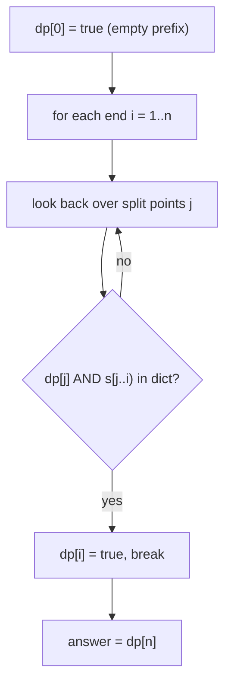

# Word Break (String Segmentation DP) — Junior Level

> **One-line summary:** Given a string `s` and a dictionary of words, "Word Break I" asks whether `s` can be cut into a sequence of dictionary words. The clean answer is a boolean DP: `dp[i]` is true if the prefix `s[0..i)` is segmentable, computed by `dp[i] = OR over j of (dp[j] AND s[j..i] ∈ dict)`. With a hash set for the dictionary this runs in `O(n²)` (or `O(n · maxWordLen)`).

---

## Table of Contents

1. [Introduction](#introduction)
2. [Prerequisites](#prerequisites)
3. [Glossary](#glossary)
4. [Core Concepts](#core-concepts)
5. [Big-O Summary](#big-o-summary)
6. [Real-World Analogies](#real-world-analogies)
7. [Pros & Cons](#pros--cons)
8. [Step-by-Step Walkthrough](#step-by-step-walkthrough)
9. [Code Examples](#code-examples)
10. [Coding Patterns](#coding-patterns)
11. [Error Handling](#error-handling)
12. [Performance Tips](#performance-tips)
13. [Best Practices](#best-practices)
14. [Edge Cases & Pitfalls](#edge-cases--pitfalls)
15. [Common Mistakes](#common-mistakes)
16. [Cheat Sheet](#cheat-sheet)
17. [Visual Animation](#visual-animation)
18. [Summary](#summary)
19. [Further Reading](#further-reading)

---

## Introduction

Suppose someone hands you the string `"applepie"` and a dictionary `{"apple", "pie", "pen"}` and asks: *"Can you chop this string into a sequence of dictionary words, end to end, with nothing left over?"* Here the answer is yes — `"apple" + "pie"`. For `"applepin"` the answer is no, because after `"apple"` you are left with `"pin"`, which is not a word, and no other split works either.

This is the **Word Break** problem. The "I" (decision) version only asks for a yes/no: *is the whole string segmentable?* It is one of the most famous interview dynamic-programming questions because it has a small, elegant recurrence that everyone can reconstruct from first principles.

The naive idea is to try every possible split point. At the very start you could match any dictionary word that is a prefix of `s`, then recurse on the rest. But the same suffix gets re-examined over and over: this is exponential. The fix is **dynamic programming** — remember, for each position `i`, whether the prefix `s[0..i)` can be fully segmented. Once you know that, you never recompute it.

> **The whole recurrence in one line:** `dp[i]` is true if there exists a split point `j < i` such that `dp[j]` is true (the prefix up to `j` is segmentable) **and** the chunk `s[j..i)` is itself a dictionary word.

The base case is `dp[0] = true`: the empty prefix is trivially segmentable (zero words). The answer to the whole problem is `dp[n]`, where `n = len(s)`.

This single boolean array turns an exponential search into an `O(n²)` algorithm: there are `n+1` positions, and for each we look back over `O(n)` earlier split points, checking each candidate chunk against a hash-set dictionary in `O(L)` (where `L` is the chunk length). If you cap the look-back at the length of the longest dictionary word, it becomes `O(n · maxWordLen)`.

Word Break connects to several ideas you may have met separately:

- **Prefix DP** — the array indexed by "how much of the string have I consumed so far".
- **Tokenization / lexing** — splitting source code or text into tokens is a real-world cousin (sibling area `string-algorithms`).
- **The Trie data structure** — a prefix tree that speeds up the "is this chunk a word" check (sibling `tree-traversals` covers tries; we use one in `middle.md`).

One important note from minute one: Word Break **I** only returns a boolean. The harder **II** variant (covered in `middle.md`) asks you to return *all* the actual sentences, and its output can be exponentially large. Keep the two clearly separate.

---

## Prerequisites

Before reading this file you should be comfortable with:

- **Strings and substrings** — indexing `s[j..i)` means characters from index `j` up to but not including `i`.
- **Hash sets** — `O(1)` average membership testing; we store the dictionary in one.
- **Arrays / lists** — the `dp` array is a flat boolean array of length `n+1`.
- **Nested loops** — the algorithm is a double loop over end position `i` and split point `j`.
- **Big-O notation** — `O(n²)`, `O(n · L)`, where `n = len(s)` and `L = maxWordLen`.
- **Basic recursion** — to understand the top-down (memoized) variant.

Optional but helpful:

- A glance at the idea of **memoization** (caching recursive results), since top-down Word Break is just recursion plus a cache.
- Familiarity with **prefix sums / prefix DP**, since `dp[i]` is "everything up to `i`".

---

## Glossary

| Term | Meaning |
|------|---------|
| **Segmentation** | A way to cut `s` into consecutive chunks, each of which is a dictionary word, covering the whole string with no gaps or overlaps. |
| **Dictionary (`wordDict`)** | The set of allowed words. Usually stored in a hash set for `O(1)` average lookup. |
| **`dp[i]`** | Boolean: is the prefix `s[0..i)` (the first `i` characters) segmentable into dictionary words? |
| **Base case `dp[0]`** | `true`. The empty prefix needs zero words, so it is trivially segmentable. |
| **Split point `j`** | An index where we consider cutting: the prefix `s[0..j)` plus the chunk `s[j..i)`. |
| **Chunk / candidate word** | The substring `s[j..i)` we test against the dictionary at each step. |
| **`maxWordLen`** | The length of the longest word in the dictionary; lets us cap the inner loop. |
| **Top-down DP** | Memoized recursion: `canBreak(start)` with a cache. |
| **Bottom-up DP** | Iterative filling of the `dp` array from `dp[0]` up to `dp[n]`. |
| **Trie** | A prefix tree of the dictionary words; speeds up the chunk-membership check (see `middle.md`). |

---

## Core Concepts

### 1. The State: `dp[i]` = "is `s[0..i)` segmentable?"

We index the DP by **how many characters of `s` we have consumed**. `dp[i]` answers a yes/no question about the *prefix* of length `i`. There are `n+1` such prefixes, from the empty prefix (`i = 0`) to the whole string (`i = n`). The final answer is `dp[n]`.

This "prefix consumed so far" framing is the key modeling decision. It is what makes the problem one-dimensional and memoryless: to decide `dp[i]`, you only need to know which *earlier* prefixes are segmentable, not *how* they were segmented.

### 2. The Recurrence

A prefix `s[0..i)` is segmentable if there is *some* last word ending at position `i`. That last word starts at some split point `j` (with `0 ≤ j < i`), occupies `s[j..i)`, and must be a dictionary word. The part before it, `s[0..j)`, must itself be segmentable — i.e. `dp[j]` must be true.

```
dp[i] = OR over all j in [0, i) of ( dp[j] AND s[j..i) ∈ wordDict )
```

In words: *the prefix up to `i` works if you can find an earlier breakpoint `j` such that everything before `j` already works AND the leftover chunk from `j` to `i` is a single dictionary word.*

### 3. The Base Case

```
dp[0] = true
```

The empty prefix is segmentable using zero words. This is the seed that everything else builds on. If you forget it, every `dp[i]` evaluates to false and the algorithm always returns "no" — a classic bug.

### 4. Why Hash-Set Lookup

To test `s[j..i) ∈ wordDict` quickly, store the dictionary in a hash set. Average membership is `O(1)` *per comparison*, but constructing the substring and hashing it costs `O(L)` where `L = i - j` is the chunk length. So each inner check is `O(L)`, and the whole algorithm is `O(n²)` in the worst case (chunks up to length `n`), or `O(n · maxWordLen)` if you only look back as far as the longest word.

### 5. Capping the Inner Loop with `maxWordLen`

No chunk longer than the longest dictionary word can ever be a word. So instead of letting `j` range over all of `[0, i)`, you only need `j` in `[max(0, i - maxWordLen), i)`. This bounds the inner loop length by `maxWordLen` and gives `O(n · maxWordLen)` — a real speedup when words are short but the string is long.

### 6. Top-Down vs Bottom-Up

The same recurrence can be evaluated two ways:

- **Bottom-up (iterative):** fill `dp[0], dp[1], …, dp[n]` in order. Clean and cache-friendly.
- **Top-down (memoized recursion):** define `canBreak(start)` = "is `s[start..n)` segmentable?", with a memo cache so each `start` is computed once. Equivalent complexity; sometimes more natural to write.

Both are `O(n²)` (or `O(n·L)`). We show both below.

---

## Big-O Summary

| Operation | Time | Space | Notes |
|-----------|------|-------|-------|
| Build hash-set dictionary | O(total dict chars) | O(total dict chars) | One-time setup. |
| Word Break I, bottom-up | **O(n²)** or **O(n · L)** | O(n) | `n+1` states, `O(n)` or `O(L)` look-back each, `O(L)` per substring check. |
| Word Break I, top-down memo | O(n²) or O(n · L) | O(n) cache + recursion | Same recurrence, recursive. |
| Single substring + set lookup | O(L) | O(L) | Building and hashing a length-`L` chunk. |
| Naive recursion (no memo) | **O(2ⁿ)** | O(n) | Exponential; never use for large `n`. |
| Word Break II (all sentences) | exponential in output | exponential | Covered in `middle.md`; output can be huge. |

The headline number is **`O(n²)`** (or `O(n · maxWordLen)` with the cap). The `n` is the string length; the dictionary size affects only the one-time set construction, not the per-state cost.

---

## Real-World Analogies

| Concept | Analogy |
|---------|---------|
| Segmenting a string into words | Reading a sign with no spaces, like `"GOODSAMARITAN"`, and figuring out it reads `"GOOD SAMARITAN"`. |
| `dp[i]` | A bookmark that says "everything up to here can be read as valid words." |
| Recurrence (look back for a last word) | "I can read up to position `i` if some real word ends right here and I could already read everything before it started." |
| Hash-set dictionary | A spell-checker dictionary you can flip to instantly to see if a chunk is a real word. |
| `maxWordLen` cap | You never bother checking a 50-letter chunk if the longest real word is 12 letters. |
| Top-down memo | Sticky notes on positions you have already solved, so you never re-solve them. |

Where the analogy breaks: a human reads left to right and rarely backtracks far, but the DP systematically considers *every* possible last word at *every* position — that exhaustiveness is what guarantees correctness.

---

## Pros & Cons

| Pros | Cons |
|------|------|
| Simple `O(n²)` boolean recurrence anyone can rederive. | Word Break **I** only gives yes/no; reconstructing a sentence needs extra work. |
| Hash set makes the chunk check `O(1)` average per comparison. | Substring construction in the inner loop is `O(L)`, easy to forget in the analysis. |
| `maxWordLen` cap brings it down to `O(n · L)` cheaply. | Word Break **II** output can be exponential — DP alone does not bound it. |
| Top-down and bottom-up are both short and easy to test. | Hash collisions / adversarial inputs can degrade the average `O(1)` lookup. |
| Generalizes to counting segmentations and to tokenization. | Naive recursion without a memo is `O(2ⁿ)` — a trap. |

**When to use:** deciding if a string can be tokenized with a given vocabulary, simple text segmentation, autocomplete/spell-check segmentation, any "can I tile this 1D sequence with allowed pieces" question.

**When NOT to use:** when you need *all* segmentations of a pathological string (exponential — see `middle.md`), or when the dictionary is enormous and you should use a Trie / Aho-Corasick instead (see `senior.md`).

---

## Step-by-Step Walkthrough

Take `s = "leetcode"` (length 8) and `wordDict = {"leet", "code"}`.

We build `dp[0..8]`. `dp[0] = true` (empty prefix). For each `i` from 1 to 8, we look back over split points `j` and check `dp[j] AND s[j..i) ∈ dict`.

```
dp[0] = true                            (base case: empty prefix)

i = 1 ("l")       : no j with dp[j] && s[j..1) in dict      → dp[1] = false
i = 2 ("le")      : none                                    → dp[2] = false
i = 3 ("lee")     : none                                    → dp[3] = false
i = 4 ("leet")    : j=0: dp[0]=true && "leet" in dict → YES → dp[4] = true
i = 5 ("leetc")   : no chunk ending at 5 is a word          → dp[5] = false
i = 6 ("leetco")  : none                                    → dp[6] = false
i = 7 ("leetcod") : none                                    → dp[7] = false
i = 8 ("leetcode"): j=4: dp[4]=true && "code" in dict → YES → dp[8] = true
```

Final `dp = [T, F, F, F, T, F, F, F, T]`. The answer is `dp[8] = true`, and indeed `"leet" + "code"` segments the string.

**Trace one decision in detail.** At `i = 8`, we try each split point `j`:

- `j = 7`: `s[7..8) = "e"` — not a word. Skip.
- `j = 6`: `s[6..8) = "de"` — not a word. Skip.
- `j = 5`: `s[5..8) = "ode"` — not a word. Skip.
- `j = 4`: `s[4..8) = "code"` — **a word!** And `dp[4] = true`. So `dp[8] = true`. We can stop early (the OR is satisfied).

Notice we only needed `dp[4]` to already be settled — which it was, because we filled the array left to right. That ordering is exactly why bottom-up DP works: every `dp[j]` we read is already final.

A negative example: `s = "leetcodx"`, same dictionary. Now `dp[8]` checks chunks ending at 8 (`"x"`, `"dx"`, `"odx"`, `"codx"`, …) — none is a word, so `dp[8] = false`. The string is not segmentable.

---

## Code Examples

### Example: Word Break I (bottom-up and top-down)

#### Go

```go
package main

import "fmt"

// wordBreak reports whether s can be segmented into dictionary words.
// Bottom-up DP, O(n * maxWordLen) with the length cap.
func wordBreak(s string, wordDict []string) bool {
	dict := make(map[string]bool)
	maxLen := 0
	for _, w := range wordDict {
		dict[w] = true
		if len(w) > maxLen {
			maxLen = len(w)
		}
	}
	n := len(s)
	dp := make([]bool, n+1)
	dp[0] = true // empty prefix is segmentable
	for i := 1; i <= n; i++ {
		// only look back as far as the longest word
		start := 0
		if i-maxLen > 0 {
			start = i - maxLen
		}
		for j := start; j < i; j++ {
			if dp[j] && dict[s[j:i]] {
				dp[i] = true
				break // OR satisfied; stop early
			}
		}
	}
	return dp[n]
}

func main() {
	fmt.Println(wordBreak("leetcode", []string{"leet", "code"})) // true
	fmt.Println(wordBreak("applepin", []string{"apple", "pie"})) // false
}
```

#### Java

```java
import java.util.*;

public class WordBreak {
    static boolean wordBreak(String s, List<String> wordDict) {
        Set<String> dict = new HashSet<>(wordDict);
        int maxLen = 0;
        for (String w : wordDict) maxLen = Math.max(maxLen, w.length());
        int n = s.length();
        boolean[] dp = new boolean[n + 1];
        dp[0] = true; // empty prefix
        for (int i = 1; i <= n; i++) {
            int start = Math.max(0, i - maxLen);
            for (int j = start; j < i; j++) {
                if (dp[j] && dict.contains(s.substring(j, i))) {
                    dp[i] = true;
                    break;
                }
            }
        }
        return dp[n];
    }

    public static void main(String[] args) {
        System.out.println(wordBreak("leetcode", List.of("leet", "code"))); // true
        System.out.println(wordBreak("applepin", List.of("apple", "pie"))); // false
    }
}
```

#### Python

```python
def word_break(s, word_dict):
    """Bottom-up DP. Returns True if s is segmentable. O(n * maxWordLen)."""
    dict_set = set(word_dict)
    max_len = max((len(w) for w in word_dict), default=0)
    n = len(s)
    dp = [False] * (n + 1)
    dp[0] = True  # empty prefix
    for i in range(1, n + 1):
        start = max(0, i - max_len)
        for j in range(start, i):
            if dp[j] and s[j:i] in dict_set:
                dp[i] = True
                break  # OR satisfied
    return dp[n]


# Top-down memoized variant of the same recurrence.
def word_break_topdown(s, word_dict):
    dict_set = set(word_dict)
    n = len(s)
    from functools import lru_cache

    @lru_cache(maxsize=None)
    def can(start):
        if start == n:
            return True
        for end in range(start + 1, n + 1):
            if s[start:end] in dict_set and can(end):
                return True
        return False

    return can(0)


if __name__ == "__main__":
    print(word_break("leetcode", ["leet", "code"]))  # True
    print(word_break("applepin", ["apple", "pie"]))   # False
    print(word_break_topdown("leetcode", ["leet", "code"]))  # True
```

**What it does:** builds a hash-set dictionary, fills `dp` left to right (or recurses with a memo), and returns whether the whole string is segmentable.
**Run:** `go run main.go` | `javac WordBreak.java && java WordBreak` | `python wordbreak.py`

---

## Coding Patterns

### Pattern 1: Naive Recursion (the slow oracle you test against)

**Intent:** Before trusting the DP, write the obvious recursion and compare on small inputs. Without a memo it is exponential, but it is trivially correct.

```python
def can_break_naive(s, dict_set, start=0):
    if start == len(s):
        return True
    for end in range(start + 1, len(s) + 1):
        if s[start:end] in dict_set and can_break_naive(s, dict_set, end):
            return True
    return False
```

This is `O(2ⁿ)` on adversarial inputs but a perfect correctness oracle for tiny strings. The DP must agree with it.

### Pattern 2: Forward DP (push instead of pull)

**Intent:** Some people find it clearer to push: when `dp[j]` is true, mark every reachable `dp[j + len(word)]`.

```python
def word_break_forward(s, word_dict):
    dict_set = set(word_dict)
    n = len(s)
    dp = [False] * (n + 1)
    dp[0] = True
    for j in range(n):
        if not dp[j]:
            continue
        for end in range(j + 1, n + 1):
            if s[j:end] in dict_set:
                dp[end] = True
    return dp[n]
```

Same complexity; just iterates from segmentable positions outward.

### Pattern 3: Early termination

**Intent:** Once `dp[i]` becomes true, `break` out of the inner loop — the OR is already satisfied, so further split points cannot change the answer.



---

## Error Handling

| Error | Cause | Fix |
|-------|-------|-----|
| Always returns `false` | Forgot `dp[0] = true`. | Seed the empty-prefix base case. |
| Off-by-one in substring | Used `s[j..i]` inclusive instead of half-open `[j, i)`. | Use half-open ranges; `s[j:i]` in Python/Go, `s.substring(j, i)` in Java. |
| Times out on long strings | Used naive recursion without a memo (`O(2ⁿ)`). | Add memoization or use bottom-up DP. |
| Wrong answer with duplicates | Treated `wordDict` as a list, slow `O(dict)` lookups. | Convert to a hash set once up front. |
| Index out of range | Looped `j` past `i` or `i` past `n`. | `i` ranges `1..n`, `j` ranges `[start, i)`. |
| Empty string handling | Returned false for `s = ""`. | Empty string is segmentable (`dp[0] = dp[n] = true`). |

---

## Performance Tips

- **Convert the dictionary to a hash set once**, outside the loops. Repeatedly scanning a list is `O(dict)` per check and kills performance.
- **Cap the look-back at `maxWordLen`.** No chunk longer than the longest word can match, so `j` need only range over the last `maxWordLen` positions: `O(n · L)` instead of `O(n²)`.
- **Break early** when `dp[i]` becomes true — the OR is satisfied.
- **Avoid building substrings when possible.** Repeated `s[j:i]` allocation is `O(L)` each. A Trie (see `middle.md`) walks characters directly and skips substring construction entirely.
- **Prefer bottom-up for cache friendliness** — a tight forward loop over a flat array beats deep recursion for large `n`.

---

## Best Practices

- Always seed `dp[0] = true` and state clearly that it represents the empty prefix.
- Use half-open ranges `[j, i)` consistently to avoid off-by-one bugs.
- Store the dictionary in a hash set (or Trie) before the loops, never inside them.
- Test the DP against the naive recursion (Pattern 1) on random short strings and small dictionaries.
- Keep Word Break **I** (boolean) and Word Break **II** (all sentences) as separate functions — they have very different complexity.
- Document whether the inner loop is capped at `maxWordLen` so future readers understand the `O(n · L)` claim.

---

## Edge Cases & Pitfalls

- **Empty string `s = ""`** — segmentable with zero words; `dp[0] = dp[n] = true`. Return `true`.
- **Empty dictionary** — only the empty string is segmentable; any non-empty `s` returns `false`.
- **Single-character words** — if every letter of `s` is in the dictionary, any string is segmentable. Make sure single-char chunks are tested (the loop must reach `j = i - 1`).
- **Word longer than `s`** — harmless; the substring check simply never matches.
- **Duplicate words in `wordDict`** — the set dedupes them; no effect on correctness.
- **Repeated characters (`"aaaaa…"` with dict `{"a", "aa"}`)** — the worst case for Word Break **II** (exponentially many sentences) but Word Break **I** still answers `true` in `O(n²)`.
- **Case sensitivity** — `"Apple"` ≠ `"apple"` unless you normalize case first; decide and document this.

---

## Common Mistakes

1. **Forgetting `dp[0] = true`** — without the empty-prefix seed, the recurrence never gets off the ground and every answer is `false`.
2. **Using a list (not a set) for the dictionary** — turns each `O(1)` lookup into `O(dict)`, ballooning the total cost.
3. **Naive recursion without memoization** — `O(2ⁿ)`; times out on inputs like `"aaaa…ab"` with dictionary `{"a","aa","aaa",…}`.
4. **Off-by-one in the substring range** — using inclusive `[j, i]` instead of half-open `[j, i)`.
5. **Reading `dp[j]` before it is computed** — only safe because bottom-up fills left to right; a wrong loop order breaks this.
6. **Confusing Word Break I with II** — returning a boolean when the problem wanted all sentences, or vice versa.
7. **Not capping the inner loop** — leaving it `O(n²)` when `O(n · maxWordLen)` was easy.

---

## Cheat Sheet

| Question | Tool | Formula |
|----------|------|---------|
| Is `s` segmentable? | boolean DP | `dp[i] = OR_j (dp[j] AND s[j..i) ∈ dict)` |
| Base case | empty prefix | `dp[0] = true` |
| Final answer | full prefix | `dp[n]` |
| Speed up the look-back | length cap | `j in [max(0, i - maxWordLen), i)` |
| Fast chunk membership | hash set | `s[j:i] in dict_set` (avg `O(1)` per compare) |
| All sentences (Word Break II) | DP + backtracking | see `middle.md` |
| Count segmentations | counting DP | replace OR with `+` (see `middle.md`) |

Core algorithm:

```
wordBreak(s, dict):
    dp[0..n] = false
    dp[0] = true                              # empty prefix
    for i in 1..n:
        for j in max(0, i - maxWordLen)..i-1:
            if dp[j] and s[j..i) in dict:
                dp[i] = true
                break                          # OR satisfied
    return dp[n]
# cost: O(n * maxWordLen), space O(n)
```

---

## Visual Animation

> See [`animation.html`](./animation.html) for an interactive visualization.
>
> The animation demonstrates:
> - Scanning the end index `i` from left to right across the string.
> - Testing each candidate chunk `s[j..i)` against the dictionary.
> - Lighting up `dp[i]` (green) when a segmentable split is found.
> - Reconstructing and highlighting one valid segmentation at the end.
> - Step / Run / Reset controls to watch the boolean array fill in.

---

## Summary

Word Break I asks a single yes/no question: can the string `s` be cut into a sequence of dictionary words? The answer is a one-dimensional boolean DP indexed by *prefix length*: `dp[i]` is true when some dictionary word ends at position `i` and the part before it was already segmentable, i.e. `dp[i] = OR_j (dp[j] AND s[j..i) ∈ dict)`, seeded with `dp[0] = true`. A hash set makes the chunk check fast, and capping the look-back at the longest word length brings the cost to `O(n · maxWordLen)` (worst case `O(n²)`). Master this recurrence and you have the foundation for the harder variants — returning all sentences, counting segmentations, and Trie-accelerated lookups — all covered in `middle.md` and beyond.

---

## Quick Self-Check

Before moving to `middle.md`, make sure you can answer these without looking:

1. What does `dp[i]` mean, and what is `dp[0]`? (Prefix `s[0..i)` segmentable; `dp[0] = true`.)
2. Write the recurrence from memory. (`dp[i] = OR_j (dp[j] AND s[j..i) ∈ dict)`.)
3. Why is the time `O(n · maxWordLen)` and not `O(n²)`? (The look-back cap.)
4. Why must the dictionary be a hash set, not a list? (`O(1)` vs `O(dict)` lookups.)
5. What is the difference between Word Break I and II? (Boolean vs all sentences; II is exponential.)

If any answer is shaky, re-read the Core Concepts and Step-by-Step Walkthrough sections.

---

## Further Reading

- LeetCode 139 "Word Break" — the canonical decision version.
- Sibling skill `dynamic-programming` — optimal substructure and overlapping subproblems in general.
- Sibling skill `string-algorithms` — substring search and text processing.
- Sibling skill `tree-traversals` — the Trie (prefix tree) used to accelerate the chunk check.
- *Introduction to Algorithms* (CLRS) — dynamic programming chapter; the prefix-DP pattern.
- cp-algorithms.com — string processing and the Aho-Corasick automaton (for huge dictionaries, see `senior.md`).
