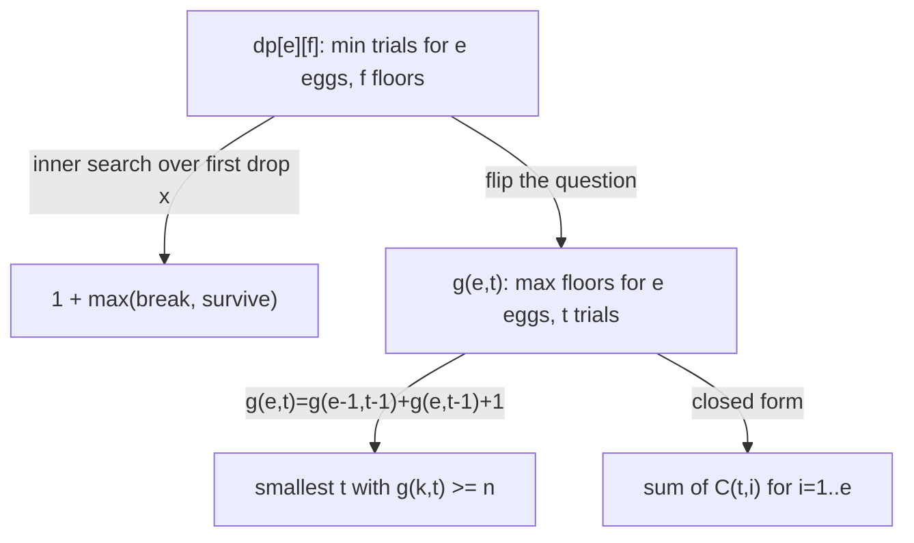

# Egg Dropping Puzzle (DP Minimax) — Junior Level

> **One-line summary:** With `k` eggs and `n` floors you want to find the highest "safe" floor, and you want a dropping strategy that guarantees an answer in the *fewest trials in the worst case*. The classic answer is a dynamic program `dp[e][f] = 1 + min over x of max(dp[e-1][x-1], dp[e][f-x])` — a **minimax** recurrence: you *minimize* over which floor to drop from, and *maximize* over the two outcomes (the egg breaks or it survives).

---

## Table of Contents

1. [Introduction](#introduction)
2. [Prerequisites](#prerequisites)
3. [Glossary](#glossary)
4. [Core Concepts](#core-concepts)
5. [Big-O Summary](#big-o-summary)
6. [Real-World Analogies](#real-world-analogies)
7. [Pros & Cons](#pros--cons)
8. [Step-by-Step Walkthrough](#step-by-step-walkthrough)
9. [Code Examples](#code-examples)
10. [Coding Patterns](#coding-patterns)
11. [Error Handling](#error-handling)
12. [Performance Tips](#performance-tips)
13. [Best Practices](#best-practices)
14. [Edge Cases & Pitfalls](#edge-cases--pitfalls)
15. [Common Mistakes](#common-mistakes)
16. [Cheat Sheet](#cheat-sheet)
17. [Visual Animation](#visual-animation)
18. [Summary](#summary)
19. [Further Reading](#further-reading)

---

## Introduction

You are standing in front of a 100-floor building holding **2 identical eggs**. There is some unknown **critical floor** `T`: an egg dropped from floor `T` or below survives, and an egg dropped from any floor above `T` breaks. (Floor `0` is the ground; an egg "dropped" from floor 0 trivially survives.) Your task is to determine `T` exactly. Every time you drop an egg you learn one bit — *broke* or *survived* — and if the egg breaks you have one fewer egg to work with. Once you run out of eggs you can drop no more.

The question is **not** "what is `T`?" (it depends on the building) but: *what is the smallest number of drops that is always enough, no matter where `T` turns out to be?* That worst-case count is what we want to minimize. This is why the problem is a **minimax**: an adversary gets to choose `T` to make you work as hard as possible, and you must choose a dropping strategy that holds up against the worst `T`.

With a single egg you have no choice: you must drop from floor `1`, then `2`, then `3`, …, climbing one floor at a time, because the moment your only egg breaks you must already know the answer. That linear scan takes up to `n` drops for `n` floors — `100` drops for our building. With **2 eggs** you can do dramatically better: roughly `√(2n)` drops, which for `100` floors is **14 drops**. With *unlimited* eggs you can binary-search, needing only `⌈log₂ n⌉ ≈ 7` drops. The egg-dropping puzzle is the beautiful middle ground: how does the answer interpolate between `log₂ n` (many eggs) and `n` (one egg) as the number of eggs varies?

The tool that answers it exactly is **dynamic programming**. We define `dp[e][f]` = the minimum number of trials that *guarantees* finding the critical floor when we have `e` eggs and `f` floors still to distinguish. The recurrence considers every possible first drop and, for each, looks at the *worse* of the two outcomes; then it picks the first drop that makes that worst case as small as possible. That is the literal meaning of "minimize the maximum."

Throughout this file the running example is **2 eggs and 100 floors**, the most famous instance of this puzzle. By the end you will be able to compute that the answer is `14`, explain *why* `14` and not `13` or `15`, and write the DP that produces it for any `(eggs, floors)`.

---

## Prerequisites

Before reading this file you should be comfortable with:

- **Basic dynamic programming** — filling a table where each entry depends on previously computed entries. (See the `13-dynamic-programming` siblings, especially `01-introduction-to-dp`.)
- **2D arrays / nested loops** — the DP table is a grid indexed by `(eggs, floors)`.
- **Big-O notation** — `O(k·n)`, `O(k·n²)`, `O(k·log n)`.
- **The idea of worst-case analysis** — counting the maximum work over all inputs, not the average.
- **Binary search** — the unlimited-egg case is exactly binary search, and the optimization later uses it.

Optional but helpful:

- A glance at **binomial coefficients** `C(t, i)` ("t choose i"), since they give a slick closed form.
- Familiarity with **recursion and memoization**, an alternative to the bottom-up table.
- The notion of a **decision tree**, since a dropping strategy *is* a binary tree (break / survive) and the number of trials is its height.

---

## Glossary

| Term | Meaning |
|------|---------|
| **Egg** | A test object that either survives or breaks when dropped. We start with `k` of them; a break consumes one. |
| **Floor** | One of the `n` candidate heights `1, 2, …, n` we must distinguish. Floor `0` is the ground (an egg always survives there). |
| **Critical floor `T`** | The highest floor from which an egg survives. Above `T` it breaks; at or below `T` it survives. There are `n + 1` possible answers: `0, 1, …, n`. |
| **Trial / drop** | One experiment: dropping an egg from a chosen floor and observing break or survive. |
| **Worst case** | The largest number of drops your strategy could need, over all possible values of `T`. |
| **Minimax** | "Minimize the maximum": pick the move (which floor to drop from) that minimizes the worst-case (maximum over the two outcomes) number of remaining drops. |
| **`dp[e][f]`** | Minimum trials that *guarantee* identifying `T` with `e` eggs and `f` floors. The quantity we compute. |
| **`dp[e][t]` (dual)** | Maximum number of floors solvable with `e` eggs and at most `t` trials. The "flipped" formulation. |
| **Decision tree** | The binary tree of break/survive outcomes; its height equals the number of trials in the worst case. |

---

## Core Concepts

### 1. What We Are Actually Computing

We are **not** computing the critical floor `T` — that depends on the physical building and is discovered by running the experiment. We are computing a single number: the **minimum number of drops that is always sufficient**, assuming we play optimally and the building is as unhelpful as possible. Call that number `dp[k][n]` for `k` eggs and `n` floors. For our running example we want `dp[2][100]`.

### 2. The Two Extremes (Sanity Anchors)

- **One egg (`e = 1`).** You must scan floors `1, 2, 3, …` from the bottom up. If you ever skipped a floor and the egg broke, you could not tell *which* of the skipped floors was critical, because you have no eggs left. So `dp[1][f] = f`: with one egg and `f` floors, you need `f` drops in the worst case.
- **Zero floors (`f = 0`).** Nothing to distinguish — the answer is already `T = 0`. So `dp[e][0] = 0` for every `e`.
- **Zero eggs (`e = 0`).** You can make no drops, so you can only handle `f = 0` floors; otherwise the task is impossible. So `dp[0][f] = 0` if `f = 0`, and "impossible" (treated as `∞`) if `f > 0`.
- **Unlimited eggs.** With enough eggs you binary-search, so the answer is `⌈log₂(n + 1)⌉`. This is the *lower bound* no strategy can beat: each drop yields at most one bit, and you must distinguish `n + 1` answers.

### 3. The Minimax Recurrence

Suppose you have `e` eggs and `f` floors and you decide your **first drop** is at floor `x` (where `1 ≤ x ≤ f`). Two things can happen:

- **The egg breaks.** The critical floor is *below* `x`, somewhere in floors `1 … x-1`. You now have `e - 1` eggs and `x - 1` floors to distinguish. The cost of finishing is `dp[e-1][x-1]`.
- **The egg survives.** The critical floor is *at or above* `x`, somewhere in floors `x … f`. You still have `e` eggs but now `f - x` floors above to distinguish. The cost of finishing is `dp[e][f-x]`.

You do not get to choose which happens — the adversary (the building) does. So the cost of choosing first-drop floor `x` is `1` (this drop) plus the **worse** of the two outcomes:

```
cost(x) = 1 + max( dp[e-1][x-1] ,  dp[e][f-x] )
```

You *do* get to choose `x`, so you pick the `x` that makes this as small as possible:

```
dp[e][f] = 1 + min over x in [1..f] of  max( dp[e-1][x-1] , dp[e][f-x] )
```

That single line is the heart of the topic. `min` is *your* choice of floor; `max` is the *adversary's* choice of outcome. Hence **minimax**.

### 4. Why the `max` and Not the Sum or Average

You must succeed no matter what happens, so you plan for the worst outcome — that is the `max`. You do not add the two branch costs (you only experience one branch), and you do not average them (the building is not random; it is adversarial). The whole subtlety of the puzzle is that the optimal `x` *balances* the two branches: if dropping at `x` makes the break-branch much more expensive than the survive-branch, you should drop lower; if the survive-branch dominates, drop higher. The optimum is where the two are as balanced as possible.

### 5. The Decision-Tree View

A dropping strategy is a **binary tree**. The root is your first drop; its left child is "egg broke", its right child is "egg survived"; each node is another drop until a leaf pins down `T`. The number of trials in the worst case is the **height** of this tree. Minimizing trials = building the shallowest tree that still distinguishes all `n + 1` outcomes. This view powers the elegant "trials-as-state" reformulation in [`middle.md`](./middle.md).

### 6. The Dual Reformulation (Preview)

The recurrence above costs `O(k·n²)` because of the inner search over `x`. There is a slicker, faster way to think: instead of asking "how few trials for `n` floors?", ask "**how many floors can I cover with `e` eggs and `t` trials?**" Call that `g(e, t)`. Then:

```
g(e, t) = g(e-1, t-1) + g(e, t-1) + 1
```

The `g(e-1, t-1)` is the floors below your drop (egg broke, one fewer egg, one fewer trial), the `g(e, t-1)` is the floors above (egg survived, same eggs, one fewer trial), and the `+1` is the floor you just dropped from. The answer to the original question is the **smallest `t` with `g(k, t) ≥ n`**. This is the key idea the rest of the topic builds on, and it makes `2 eggs / 100 floors` an easy hand computation.

---

## Big-O Summary

| Method | Time | Space | Notes |
|--------|------|-------|-------|
| Naive recursion (no memo) | exponential | `O(k·n)` stack | Recomputes overlapping subproblems; only for tiny inputs. |
| Classic DP `dp[e][f]` with inner `x` search | **O(k·n²)** | `O(k·n)` | The standard table fill; clear but quadratic in floors. |
| Classic DP + monotonicity (binary search / two-pointer on `x`) | **O(k·n·log n)** | `O(k·n)` | Exploits that the inner cost is convex in `x`. |
| Trials reformulation `g(e, t)` until `g(k, t) ≥ n` | **O(k·t*)** ≈ **O(k·log n)** for large `k` | `O(k)` rolling | `t*` is the answer (the number of trials), usually tiny. |
| Binomial closed form `Σ C(t, i)` | **O(k·t*)** to find `t*` | `O(1)` | Same cost, expressed via "t choose i". |
| `k = 2` closed form (`√(2n)` jump) | `O(1)` formula, `O(√n)` strategy | `O(1)` | The famous two-egg special case. |

The headline is that the **trials reformulation collapses the quadratic to roughly `O(k·log n)`** because the answer `t*` is small (for `2` eggs and `100` floors, `t* = 14`; with many eggs, `t* ≈ log₂ n`). You almost never need the `O(k·n²)` table once you know the dual.

---

## Real-World Analogies

| Concept | Analogy |
|---------|---------|
| Eggs | A limited supply of *destructive* tests — once a test "fails hard" it is gone. Think crash-tests of prototypes, or a fixed budget of irreversible experiments. |
| Floors | Candidate thresholds you must locate, e.g. the exact load at which a beam fails, or the request rate at which a server starts dropping traffic. |
| Critical floor `T` | The unknown breaking point you are searching for. |
| One egg = linear scan | With a single prototype you must creep upward one unit at a time so a failure leaves no ambiguity — slow but safe. |
| Many eggs = binary search | Plenty of prototypes lets you bisect the range, halving the search each test. |
| Two eggs = the `√(2n)` jump | A limited budget forces a compromise: take big jumps with the first egg, then a careful linear sweep with the second once it breaks. |
| Minimax | You plan for the *most stubborn* possible threshold, not the average one, because a guarantee must hold in the worst case. |

Where the analogy breaks: real tests can be noisy (a beam might fail probabilistically), whereas the puzzle assumes a perfectly sharp, deterministic threshold and perfectly reusable surviving eggs. The clean version is what makes the exact DP possible.

---

## Pros & Cons

| Pros | Cons |
|------|------|
| Gives the *exact* optimal worst-case number of trials, not an estimate. | The naive recurrence is `O(k·n²)`, which is slow for very large `n`. |
| The minimax recurrence is short and directly expresses the problem. | Easy to get the recurrence backwards (sum or average instead of `max`/`min`). |
| The trials reformulation is dramatically faster — roughly `O(k·log n)`. | The reformulation requires the mental "flip" (floors-from-trials), which trips people up. |
| The `k = 2` case has a clean `√(2n)` closed-form strategy. | Off-by-one errors abound (`f` vs `f-1`, floor `0` vs floor `1`). |
| Generalizes smoothly from `1` egg (`= n`) to `∞` eggs (`= log₂ n`). | Only models the idealized noiseless threshold; not directly usable for noisy tests. |

**When to use this DP:** any "find the threshold with a limited number of destructive tests, minimize worst-case tests" problem — egg drops, but also "minimum measurements to find a breaking load with `k` samples", interview minimax-DP questions, and as a teaching example of the minimax pattern.

**When NOT to use:** when tests are reusable infinitely (just binary-search), when tests are non-destructive (no egg constraint), or when the threshold is noisy/probabilistic (you need a statistical method instead).

---

## Step-by-Step Walkthrough

Let us solve **2 eggs, 100 floors** by hand using the trials reformulation, then sanity-check it against the minimax recurrence.

**The trials view.** Define `g(e, t)` = the maximum number of floors we can fully resolve with `e` eggs and `t` trials. For `e = 2` eggs, there is a neat pattern. With `t` trials and 2 eggs, your first drop should be at floor `t` (counting from the bottom). Why? If it breaks, you have `1` egg and `t-1` trials, and one egg forces a linear scan of the `t-1` floors below — exactly the `t-1` you have left. If it survives, you climb and your *next* jump should be `t-1` floors higher (because after one trial you only have `t-1` trials left, and the same logic applies recursively). So the reachable floors with 2 eggs and `t` trials are:

```
g(2, t) = t + (t-1) + (t-2) + … + 1 = t(t+1)/2
```

Now find the smallest `t` with `g(2, t) ≥ 100`:

```
t = 13 :  13·14/2 = 91   (< 100, not enough)
t = 14 :  14·15/2 = 105  (≥ 100, enough!)
```

So **`dp[2][100] = 14`**. The optimal first drop is from floor `14`. If it breaks, scan floors `1..13` with the last egg (worst case 13 more drops → 14 total). If it survives, the next drop is floor `14 + 13 = 27`, then `27 + 12 = 39`, then `50, 60, 69, 77, 84, 90, 95, 99, 100` — each jump shrinking by one, so no matter where the threshold is, you finish within 14 drops.

**Cross-check via the minimax recurrence.** Let us verify a tiny case, `dp[2][10]`, both ways. The trials formula needs the smallest `t` with `t(t+1)/2 ≥ 10`: `t = 4` gives `10`, exactly enough, so `dp[2][10] = 4`. Now the recurrence `dp[2][10] = 1 + min_x max(dp[1][x-1], dp[2][10-x])` with `dp[1][m] = m`:

```
x = 4 : 1 + max(dp[1][3], dp[2][6])
        dp[2][6]: smallest t with t(t+1)/2 ≥ 6 is t=3 (3·4/2=6) → dp[2][6] = 3
      = 1 + max(3, 3) = 4
```

Both give `4`, and the balance point is exactly where the break-branch (`dp[1][3] = 3`) equals the survive-branch (`dp[2][6] = 3`). That balance is the signature of the optimal drop.

**Why 14 and not 13?** With 13 trials and 2 eggs you can resolve at most `13·14/2 = 91` floors. `91 < 100`, so 13 trials cannot guarantee an answer for all 100 floors — some critical floor would remain ambiguous. You genuinely need the 14th trial.

**A second worked split.** Suppose after the first drop at floor `14` the egg *survives*. You now have 2 eggs, 13 trials left, and floors `15..100` (86 floors) to resolve, but you must continue from floor `14` upward. The next drop is `14 + 13 = 27`. If *that* breaks, you scan `15..26` (12 floors) with the last egg, using at most `12` more drops — `2` (the two jumps) `+ 12 = 14` total. If it survives, you jump to `27 + 12 = 39`, and so on. Every path through this tree has length exactly `14` in the worst case, which is precisely why `14` is both achievable and necessary. The diminishing jumps (`14, 13, 12, …`) are the visual signature of an optimally balanced two-egg strategy.

---

## Code Examples

### Example: Minimum Trials for `k` Eggs and `n` Floors

We show three implementations of the **classic `O(k·n²)` DP** first (clear and faithful to the recurrence), each printing `dp[2][100] = 14`.

#### Go

```go
package main

import "fmt"

// eggDrop returns the minimum number of trials that guarantees finding the
// critical floor with k eggs and n floors. Classic O(k*n^2) minimax DP.
func eggDrop(k, n int) int {
	// dp[e][f] = min trials with e eggs and f floors.
	dp := make([][]int, k+1)
	for e := range dp {
		dp[e] = make([]int, n+1)
	}
	// Base cases.
	for f := 0; f <= n; f++ {
		dp[1][f] = f // one egg: linear scan
	}
	for e := 0; e <= k; e++ {
		dp[e][0] = 0 // zero floors: nothing to do
		if e >= 1 {
			dp[e][1] = 1 // one floor: one drop
		}
	}
	for e := 2; e <= k; e++ {
		for f := 2; f <= n; f++ {
			best := f // upper bound (linear scan always works)
			for x := 1; x <= f; x++ {
				broke := dp[e-1][x-1]   // egg breaks: below x
				survived := dp[e][f-x]  // egg survives: above x
				worst := broke
				if survived > worst {
					worst = survived
				}
				if 1+worst < best {
					best = 1 + worst
				}
			}
			dp[e][f] = best
		}
	}
	return dp[k][n]
}

func main() {
	fmt.Println(eggDrop(2, 100)) // 14
	fmt.Println(eggDrop(1, 100)) // 100
	fmt.Println(eggDrop(3, 100)) // 9
}
```

#### Java

```java
public class EggDrop {
    // Minimum trials guaranteeing the critical floor: classic O(k*n^2) DP.
    static int eggDrop(int k, int n) {
        int[][] dp = new int[k + 1][n + 1];
        for (int f = 0; f <= n; f++) dp[1][f] = f;        // one egg: linear scan
        for (int e = 1; e <= k; e++) {
            dp[e][0] = 0;                                 // zero floors
            dp[e][1] = 1;                                 // one floor
        }
        for (int e = 2; e <= k; e++) {
            for (int f = 2; f <= n; f++) {
                int best = f; // linear scan upper bound
                for (int x = 1; x <= f; x++) {
                    int broke = dp[e - 1][x - 1];         // below x
                    int survived = dp[e][f - x];          // above x
                    int worst = Math.max(broke, survived);
                    best = Math.min(best, 1 + worst);
                }
                dp[e][f] = best;
            }
        }
        return dp[k][n];
    }

    public static void main(String[] args) {
        System.out.println(eggDrop(2, 100)); // 14
        System.out.println(eggDrop(1, 100)); // 100
        System.out.println(eggDrop(3, 100)); // 9
    }
}
```

#### Python

```python
def egg_drop(k: int, n: int) -> int:
    """Minimum trials guaranteeing the critical floor: classic O(k*n^2) DP."""
    # dp[e][f] = min trials with e eggs and f floors.
    dp = [[0] * (n + 1) for _ in range(k + 1)]
    for f in range(n + 1):
        dp[1][f] = f                      # one egg: linear scan
    for e in range(1, k + 1):
        dp[e][0] = 0                      # zero floors
        dp[e][1] = 1                      # one floor
    for e in range(2, k + 1):
        for f in range(2, n + 1):
            best = f                      # linear-scan upper bound
            for x in range(1, f + 1):
                broke = dp[e - 1][x - 1]  # below x
                survived = dp[e][f - x]   # above x
                worst = max(broke, survived)
                best = min(best, 1 + worst)
            dp[e][f] = best
    return dp[k][n]


if __name__ == "__main__":
    print(egg_drop(2, 100))  # 14
    print(egg_drop(1, 100))  # 100
    print(egg_drop(3, 100))  # 9
```

**What it does:** fills the `dp[e][f]` table with the minimax recurrence and reads `dp[k][n]`.
**Run:** `go run main.go` | `javac EggDrop.java && java EggDrop` | `python egg_drop.py`

### Example: The Fast Trials Reformulation

This is the one you should reach for in practice. It runs in roughly `O(k·log n)`.

#### Python

```python
def egg_drop_fast(k: int, n: int) -> int:
    """Smallest t such that k eggs and t trials can cover >= n floors.
    g[e] = floors coverable with e eggs and the current number of trials t.
    Recurrence: g_t[e] = g_{t-1}[e-1] + g_{t-1}[e] + 1."""
    g = [0] * (k + 1)   # 0 trials cover 0 floors for any egg count
    t = 0
    while g[k] < n:
        t += 1
        # update from high egg count to low so we read previous-trial values
        for e in range(k, 0, -1):
            g[e] = g[e - 1] + g[e] + 1
    return t


if __name__ == "__main__":
    print(egg_drop_fast(2, 100))  # 14
    print(egg_drop_fast(1, 100))  # 100
    print(egg_drop_fast(3, 100))  # 9
```

The full Go and Java versions of this fast method appear in [`middle.md`](./middle.md); the idea is identical: bump `t` until the floors covered reach `n`.

---

## Coding Patterns

### Pattern 1: Brute-Force Recursion (the oracle you test against)

**Intent:** Before trusting the table, compute the answer the obvious recursive way and check small cases agree.

```python
from functools import lru_cache


def egg_drop_recursive(k, n):
    @lru_cache(maxsize=None)
    def solve(e, f):
        if f == 0:
            return 0          # nothing to distinguish
        if e == 1:
            return f          # one egg: linear scan
        best = f
        for x in range(1, f + 1):
            worst = max(solve(e - 1, x - 1), solve(e, f - x))
            best = min(best, 1 + worst)
        return best
    return solve(k, n)
```

This is the same `O(k·n²)` work as the table but top-down with memoization. It is the cleanest correctness oracle for the faster methods.

### Pattern 2: Find the Optimal First Drop

**Intent:** Not just the count, but *which floor* to drop from first. Scan `x` and return the `x` minimizing `1 + max(dp[e-1][x-1], dp[e][f-x])`.

### Pattern 3: Floors-From-Trials Growth

**Intent:** The dual `g(e, t)` answers "how high can I go?" and is what makes large `n` tractable. Grow `t` and watch `g(k, t)` climb past `n`.



---

## Error Handling

| Error | Cause | Fix |
|-------|-------|-----|
| Answer is `0` for `n > 0` | Forgot `dp[1][f] = f`; left the one-egg row as zeros. | Initialize the one-egg row to a linear scan. |
| Off-by-one (`13` instead of `14`) | Used `dp[e][f-x]` where you meant `dp[e][f-x]` but indexed floors from `0`. | Floors are `1..f`; "below `x`" is `x-1` floors, "above `x`" is `f-x` floors. |
| Index out of range | Accessing `dp[e-1][...]` when `e = 0`. | Guard the egg base case (`e = 0` handles only `f = 0`). |
| Infinite / huge answer | `e = 0` and `f > 0` treated as solvable. | Mark `dp[0][f>0]` as impossible (`∞`), never as a finite number. |
| Wrong answer for `k > log₂ n` | Capped eggs incorrectly or looped eggs past usefulness. | Eggs beyond `⌈log₂(n+1)⌉` are wasted; the answer cannot drop below `log₂(n+1)`. |
| Trials loop never terminates | `g(e, t)` not increasing (bug in the update order). | Update `g[e]` from high `e` to low `e` so you read previous-trial values. |

---

## Performance Tips

- **Prefer the trials reformulation.** It is `O(k·log n)`-ish instead of `O(k·n²)`. For `n = 10^9` the quadratic table is hopeless; the trials method finishes instantly.
- **Cap the egg count.** With `n` floors you never need more than `⌈log₂(n+1)⌉` eggs; extra eggs cannot reduce the trial count below the binary-search bound. Replace `k` with `min(k, ⌈log₂(n+1)⌉)`.
- **Use a rolling 1D array for `g`.** The trials recurrence only needs the previous trial's values; one array of length `k+1` suffices (`O(k)` space).
- **Early-exit the inner `x` search.** In the classic DP the worst-case `max(...)` is convex in `x`; once it starts increasing you can stop (this is the road to the `O(k·n·log n)` speedup in [`middle.md`](./middle.md)).
- **Avoid recomputation.** If you answer many `(eggs, floors)` queries, fill the table once and reuse it.

---

## Best Practices

- Always pin down the **base cases** first: `dp[1][f] = f`, `dp[e][0] = 0`, `dp[e][1] = 1`. Most bugs live here.
- State explicitly whether floors are indexed from `0` or `1`; the recurrence assumes floors `1..f` and "below `x`" means `x-1` floors.
- Validate the fast trials method against the brute-force recursion (Pattern 1) on small `(k, n)` before trusting it on large `n`.
- Remember the result is a **worst-case guarantee**, not an average; never average the two branches.
- For the `k = 2` case, sanity-check against the closed form: the answer is the smallest `t` with `t(t+1)/2 ≥ n`.

---

## Edge Cases & Pitfalls

- **`n = 0`** — zero floors, answer `0` regardless of eggs (`T` is already known to be `0`).
- **`n = 1`** — one floor to test, answer `1` (drop once; break ⇒ `T = 0`, survive ⇒ `T = 1`) as long as `k ≥ 1`.
- **`k = 1`** — exactly `n` (linear scan); skipping any floor loses information.
- **`k ≥ ⌈log₂(n+1)⌉`** — the answer plateaus at the binary-search bound; more eggs do not help.
- **`k = 0, n > 0`** — impossible; treat as `∞`, not `0`.
- **Counting answers, not floors** — there are `n + 1` possible critical floors (`0` through `n`); the information-theoretic lower bound is `⌈log₂(n+1)⌉` drops because each drop is one bit.
- **The threshold is sharp** — the model assumes a single clean critical floor; if eggs behaved randomly, this DP would not apply.

---

## Common Mistakes

1. **Summing or averaging the branches** instead of taking the `max`. You only ever walk one branch, but you must survive the *worst* one, so it is `max`.
2. **Forgetting the `+1`** for the drop you are currently making. Each level of the recurrence costs one trial.
3. **Wrong base case for one egg** — using `dp[1][f] = 1` (or `log f`) instead of `f`. One egg means a strict linear scan.
4. **Off-by-one in the split** — "below `x`" has `x-1` floors, "above `x`" has `f-x` floors; mixing these gives `13` vs `14`.
5. **Treating `dp[0][f>0]` as `0`** — with no eggs you cannot resolve any nonzero number of floors; it must be `∞`.
6. **Using the slow `O(k·n²)` table for huge `n`** when the `O(k·log n)` trials method is available.
7. **Updating `g[e]` in the wrong order** — you must go from high `e` to low `e` so each `g[e]` still reads the *previous* trial's `g[e]` and `g[e-1]`.

---

## Cheat Sheet

| Question | Tool | Formula |
|----------|------|---------|
| Min trials, `k` eggs, `n` floors | minimax DP | `dp[e][f] = 1 + min_x max(dp[e-1][x-1], dp[e][f-x])` |
| Same, fast | trials reformulation | smallest `t` with `g(k, t) ≥ n`, `g(e,t)=g(e-1,t-1)+g(e,t-1)+1` |
| Max floors, `e` eggs, `t` trials | closed form | `g(e, t) = Σ_{i=1}^{e} C(t, i)` |
| One egg | linear scan | `dp[1][f] = f` |
| Two eggs | triangular numbers | smallest `t` with `t(t+1)/2 ≥ n`; for `n=100`, `t=14` |
| Unlimited eggs | binary search | `⌈log₂(n+1)⌉` |
| Lower bound (any `k`) | information theory | `⌈log₂(n+1)⌉` (each drop = 1 bit) |

Core recurrence:

```
dp[e][f] = 1 + min over x in [1..f] of  max( dp[e-1][x-1], dp[e][f-x] )
base: dp[1][f] = f,  dp[e][0] = 0,  dp[e][1] = 1
# classic cost O(k·n^2); use the trials dual for O(k·log n)
```

---

## Visual Animation

> See [`animation.html`](./animation.html) for an interactive visualization.
>
> The animation demonstrates:
> - The floors-covered table `g[e][t]` growing one trial at a time via `g[e][t] = g[e-1][t-1] + g[e][t-1] + 1`.
> - The moment `g[k][t]` first reaches or exceeds `n` — that `t` is the answer.
> - The optimal first-drop floor for the chosen `(eggs, floors)`.
> - Step / Run / Reset controls and adjustable eggs and floors, so you can watch `2 eggs / 100 floors` resolve to `14`.

---

## Summary

The egg-dropping puzzle asks for the *minimum number of drops that always suffices* to find a critical floor, given a limited supply of breakable eggs. It is a **minimax** problem: you minimize over which floor to drop from, while an adversary maximizes over the two outcomes (break or survive). The direct recurrence, `dp[e][f] = 1 + min_x max(dp[e-1][x-1], dp[e][f-x])`, captures this exactly and fills an `O(k·n²)` table. The far better mental model flips the question to "how many floors can `e` eggs and `t` trials cover?", giving `g(e,t) = g(e-1,t-1) + g(e,t-1) + 1` and reducing the work to roughly `O(k·log n)` — you simply grow `t` until `g(k,t) ≥ n`. For our running example, `2 eggs / 100 floors`, the answer is **14**, because `13·14/2 = 91 < 100 ≤ 105 = 14·15/2`, and the optimal first drop is floor `14`. Master the minimax recurrence, then internalize the trials reformulation, and the whole family of "limited destructive tests" problems becomes routine.

---

## Further Reading

- *Introduction to Algorithms* (CLRS) — dynamic programming and optimal substructure.
- Sibling topic `13-dynamic-programming/01-introduction-to-dp` — the DP fundamentals this builds on.
- The two-egg / 100-floor puzzle — a classic interview question; see [`interview.md`](./interview.md) for full Q&A.
- [`middle.md`](./middle.md) — the trials reformulation, the binomial closed form, and the `O(k·n·log n)` optimization.
- [`professional.md`](./professional.md) — correctness proofs of the minimax recurrence and the trials DP, plus the convexity that enables the speedup.
- *Concrete Mathematics* (Graham, Knuth, Patashnik) — binomial coefficients and the "sum of `C(t, i)`" identity.
