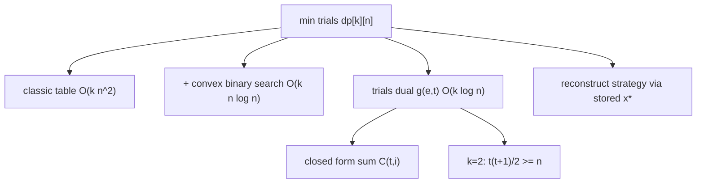

# Egg Dropping Puzzle (DP Minimax) — Middle Level

> **Focus:** The `O(k·n²)` minimax DP and *why* it is quadratic; the trials reformulation that flips the question and runs in `O(k·log n)`; the binomial closed form `Σ C(t, i)`; the `k = 2` jump strategy; and the monotonicity that lets binary search prune the inner floor scan.

---

## Table of Contents

1. [Introduction](#introduction)
2. [Deeper Concepts](#deeper-concepts)
3. [Comparison with Alternatives](#comparison-with-alternatives)
4. [Advanced Patterns](#advanced-patterns)
5. [The Trials Reformulation in Depth](#the-trials-reformulation-in-depth)
6. [The k=2 Jump Strategy](#the-k2-jump-strategy)
7. [Code Examples](#code-examples)
8. [Error Handling](#error-handling)
9. [Performance Analysis](#performance-analysis)
10. [Best Practices](#best-practices)
11. [Reconstructing the Strategy](#reconstructing-the-strategy)
12. [Worked Three-Egg Example](#worked-three-egg-example)
13. [When Each Formulation Wins](#when-each-formulation-wins-quick-guide)
14. [Visual Animation](#visual-animation)
15. [Summary](#summary)

---

## Introduction

At junior level the message was a single recurrence: `dp[e][f] = 1 + min_x max(dp[e-1][x-1], dp[e][f-x])`, a minimax DP that fills an `O(k·n²)` table. At middle level you start asking the questions that decide whether your solution is correct *and* fast enough:

- *Why* is the table `O(k·n²)`, and can the inner `O(n)` search over the first-drop floor be eliminated?
- The DP asks "fewest trials for `n` floors". What happens if you ask the **inverse** — "most floors coverable in `t` trials"? Why is that inverse so much cheaper?
- There is a famous closed form `g(e, t) = Σ_{i=1}^{e} C(t, i)`. Where does the sum of binomial coefficients come from?
- For `k = 2`, why is the answer `√(2n)`-ish, and what is the explicit jump schedule?
- The inner cost `max(dp[e-1][x-1], dp[e][f-x])` is one term *increasing* in `x` and one *decreasing* in `x` — that is a convex shape. How does convexity let binary search find the optimum in `O(log n)` instead of `O(n)`?

These are the questions that separate "I memorized the recurrence" from "I can pick the right formulation for the constraints in front of me."

---

## Deeper Concepts

### The minimax recurrence, restated

Let `dp[e][f]` be the minimum number of trials that *guarantees* identifying the critical floor with `e` eggs and `f` floors. Choosing a first drop at floor `x` (`1 ≤ x ≤ f`) splits the problem:

```
dp[e][f] = 1 + min_{x=1..f}  max( dp[e-1][x-1] ,  dp[e][f-x] )
            base: dp[1][f] = f, dp[e][0] = 0, dp[e][1] = 1
```

- `dp[e-1][x-1]` — the egg broke; one fewer egg, the `x-1` floors below.
- `dp[e][f-x]` — the egg survived; same eggs, the `f-x` floors above.
- `max` — the adversary picks the worse outcome; `min_x` — you pick the best floor; `+1` — the current drop.

Evaluating this directly costs `O(k·n²)`: there are `O(k·n)` states and each does an `O(n)` scan over `x`.

### The key structural fact: the inner cost is convex in x

Fix `e` and `f`. As `x` increases from `1` to `f`:

- `dp[e-1][x-1]` is **non-decreasing** (more floors below ⇒ at least as hard).
- `dp[e][f-x]` is **non-increasing** (fewer floors above ⇒ at most as hard).

Their pointwise `max` is therefore a **valley shape** (unimodal / convex): it decreases while the survive-branch dominates, reaches a minimum where the two branches are balanced, then increases while the break-branch dominates. The optimal `x` is exactly the crossover point. Because the function is unimodal, you can find the minimum with **binary search** on `x` (or a monotone two-pointer as `f` grows), cutting the inner `O(n)` to `O(log n)`. That gives `O(k·n·log n)`. The full convexity proof is in [`professional.md`](./professional.md).

### The reformulation: floors from trials

The quadratic is annoying, and there is a way to dodge it entirely. Instead of `dp[e][f]` (trials needed for floors), define the **dual**:

```
g(e, t) = the maximum number of floors fully resolvable with e eggs and at most t trials.
```

If your first of `t` trials is a drop, two things happen, and you can cover floors *both above and below*:

```
g(e, t) = g(e-1, t-1)   (floors below the drop: egg broke, e-1 eggs, t-1 trials)
        + g(e, t-1)     (floors above the drop: egg survived, e eggs, t-1 trials)
        + 1             (the floor you dropped from)
```

with base cases `g(e, 0) = 0` (no trials ⇒ no floors) and `g(0, t) = 0` (no eggs ⇒ no floors). The answer to the original problem is the **smallest `t` such that `g(k, t) ≥ n`**. Because the answer `t*` is small — at most `n` (one egg) and as little as `⌈log₂(n+1)⌉` (many eggs) — you only iterate `t` up to `t*`, doing `O(k)` work per trial. Total: `O(k·t*)`, which for large `k` is `O(k·log n)`.

This is the single most important idea in the topic. The DP that was quadratic in `n` becomes *logarithmic* in `n`, because `g` grows at least geometrically once you have a couple of eggs.

### Why g grows so fast

With `2` eggs, `g(2, t) = t(t+1)/2` — quadratic in `t`, so `t ≈ √(2n)`. With `e` eggs, `g(e, t)` grows like `t^e / e!`, so `t ≈ (e! · n)^{1/e}`, and once `e ≥ log₂ n` it bottoms out at the binary-search value `t = ⌈log₂(n+1)⌉`. The reachable floors explode with the number of trials, which is why so few trials suffice.

---

## Comparison with Alternatives

### The three exact methods

| Approach | Time | Space | Good when |
|----------|------|-------|-----------|
| Naive recursion (no memo) | exponential | `O(k·n)` stack | never (teaching only) |
| Classic table `dp[e][f]`, inner scan | `O(k·n²)` | `O(k·n)` | small `n` (≤ a few thousand), want the full table |
| Classic table + binary search on `x` | `O(k·n·log n)` | `O(k·n)` | medium `n`, still want per-state answers |
| **Trials reformulation** `g(e, t)` | **`O(k·t*)` ≈ `O(k·log n)`** | `O(k)` rolling | **large `n`, just want the count** |
| Binomial closed form `Σ C(t, i)` | `O(k·t*)` | `O(1)` | same as above, expressed combinatorially |

Concrete numbers for `k = 2`:

| `n` | `O(k·n²)` table ops | trials method ops (`≈ k·√(2n)`) | Winner |
|-----|---------------------|----------------------------------|--------|
| 100 | ~20 000 | ~28 | trials |
| 10⁴ | ~2·10⁸ | ~283 | trials |
| 10⁶ | ~2·10¹² (infeasible) | ~2828 | trials |
| 10⁹ | impossible | ~89 442 | trials |

The lesson: the classic table is fine for textbook-sized `n`, but for large `n` you *must* use the trials reformulation. The closed form is the same cost as the trials loop but lets you reason analytically.

### Egg-drop vs plain binary search

If eggs were infinite (non-destructive, reusable forever), you would just binary-search: `⌈log₂(n+1)⌉` drops. The egg constraint is what makes the problem interesting — you cannot afford to "waste" a high drop early if it might break your only remaining egg. The DP answer interpolates between `log₂ n` (many eggs) and `n` (one egg).

### Why a greedy "always halve" fails

A tempting wrong approach is "always drop in the middle of the unresolved range" (binary search) regardless of eggs. With `2` eggs and `100` floors that drops first at floor `50`. If the egg breaks, you have `1` egg and floors `1..49`, forcing a `49`-drop linear scan — a worst case of `1 + 49 = 50`, far worse than the optimal `14`. The greedy ignores that a break is catastrophic when eggs are scarce, so the optimal first drop must be *low enough* that the post-break linear scan stays within budget. That is exactly the `dp[e-1][x-1]` term forcing balance — and why this is a DP, not a greedy.

---

## Advanced Patterns

### Pattern: The classic table with the convex-search speedup

Replace the inner `O(n)` loop with a binary search exploiting unimodality of `max(dp[e-1][x-1], dp[e][f-x])` in `x`.

### Pattern: Reconstructing the strategy

The DP gives the *count*; to emit the actual dropping plan, record for each `(e, f)` the optimal first-drop floor `x*`, then recurse into `(e-1, x*-1)` on a break and `(e, f-x*)` on a survive.

### Pattern: Binomial closed form

`g(e, t) = Σ_{i=1}^{e} C(t, i)`. To find the answer, increase `t` and evaluate this sum until it reaches `n`. Computing `C(t, i)` incrementally (`C(t, i) = C(t, i-1)·(t-i+1)/i`) keeps it cheap.



---

## The Trials Reformulation in Depth

### Deriving the recurrence carefully

You have `e` eggs and a budget of `t` trials. Make one drop. Whatever floor you drop from, the drop partitions the floors you can still resolve into three parts:

1. **Below the drop** — resolvable only if the egg breaks, giving you `e-1` eggs and `t-1` trials. So you can place at most `g(e-1, t-1)` floors below.
2. **The drop floor itself** — exactly `1` floor, the one you stand the drop on.
3. **Above the drop** — resolvable if the egg survives, giving you `e` eggs and `t-1` trials. So you can place at most `g(e, t-1)` floors above.

Summing: `g(e, t) = g(e-1, t-1) + 1 + g(e, t-1)`. This is *constructive* — it tells you the maximum reach, and the optimal drop floor is `g(e-1, t-1) + 1` from the bottom of the current range.

### Reading off the answer and the strategy

To answer "min trials for `n` floors with `k` eggs", grow `t` from `0` upward, maintaining `g(·, t)` for all egg counts, and stop the first time `g(k, t) ≥ n`. To recover the strategy: at the top level your first drop is `g(k-1, t*-1) + 1`. If it breaks, recurse with `(k-1, t*-1)` on the lower block; if it survives, recurse with `(k, t*-1)` on the upper block.

### Why this is logarithmic, not quadratic

`g(k, t)` is at least `2^t - 1` once `k ≥ t` (it becomes binary search), and for `k = 2` it is `t(t+1)/2`. Either way `t*` is tiny relative to `n`, so the loop runs `t*` times doing `O(k)` work — total `O(k·t*)`. There is no dependence on `n` except through the *value* of `t*`, which is at most `⌈log₂(n+1)⌉` when eggs are plentiful.

---

## The k=2 Jump Strategy

The two-egg case is the most famous instance and has a clean closed form. With `2` eggs and `t` trials:

```
g(2, t) = g(1, t-1) + g(2, t-1) + 1
        = (t-1) + g(2, t-1) + 1            [since g(1, m) = m, one egg = linear scan]
        = g(2, t-1) + t
```

Unrolling from `g(2, 0) = 0`: `g(2, t) = 1 + 2 + 3 + … + t = t(t+1)/2`. So the answer for `n` floors is the **smallest `t` with `t(t+1)/2 ≥ n`**, i.e. `t = ⌈(-1 + √(1 + 8n)) / 2⌉ ≈ √(2n)`.

**The jump schedule.** Drop the first egg from floor `t`, then `t + (t-1)`, then `+(t-2)`, …, shrinking the jump by one each time. The diminishing jumps exactly compensate for the trials already spent: after `j` survives you have `t - j` trials left, so the next safe jump is `t - j` floors. If the first egg breaks after a jump that landed on floor `F`, you linear-scan the `t - j - 1` floors just below `F` with the second egg, and the total stays at `t`.

**For `n = 100`:** `t = 14` (since `13·14/2 = 91 < 100 ≤ 105 = 14·15/2`). First drops at `14, 27, 39, 50, 60, 69, 77, 84, 90, 95, 99, 100` — each gap one smaller than the last — and a worst case of exactly 14 drops anywhere.

---

## Code Examples

### The fast trials reformulation (all three languages)

#### Go

```go
package main

import "fmt"

// eggDropFast returns the minimum trials with k eggs and n floors,
// via the floors-from-trials dual. O(k * t*) time, O(k) space.
func eggDropFast(k, n int) int {
	if n == 0 {
		return 0
	}
	g := make([]int, k+1) // g[e] = floors coverable with e eggs, current t
	t := 0
	for g[k] < n {
		t++
		for e := k; e >= 1; e-- { // high->low so we read previous-trial values
			g[e] = g[e-1] + g[e] + 1
		}
	}
	return t
}

func main() {
	fmt.Println(eggDropFast(2, 100)) // 14
	fmt.Println(eggDropFast(1, 100)) // 100
	fmt.Println(eggDropFast(3, 100)) // 9
	fmt.Println(eggDropFast(10, 1_000_000_000)) // ~30 (binary-search regime)
}
```

#### Java

```java
public class EggDropFast {
    // Minimum trials via the floors-from-trials dual. O(k * t*) time, O(k) space.
    static int eggDropFast(int k, int n) {
        if (n == 0) return 0;
        int[] g = new int[k + 1]; // g[e] = floors coverable with e eggs at current t
        int t = 0;
        while (g[k] < n) {
            t++;
            for (int e = k; e >= 1; e--) { // high->low: read previous-trial values
                g[e] = g[e - 1] + g[e] + 1;
            }
        }
        return t;
    }

    public static void main(String[] args) {
        System.out.println(eggDropFast(2, 100));            // 14
        System.out.println(eggDropFast(1, 100));            // 100
        System.out.println(eggDropFast(3, 100));            // 9
        System.out.println(eggDropFast(10, 1_000_000_000)); // ~30
    }
}
```

#### Python

```python
def egg_drop_fast(k: int, n: int) -> int:
    """Minimum trials via the floors-from-trials dual. O(k * t*) time, O(k) space."""
    if n == 0:
        return 0
    g = [0] * (k + 1)  # g[e] = floors coverable with e eggs at the current t
    t = 0
    while g[k] < n:
        t += 1
        for e in range(k, 0, -1):  # high->low so we read previous-trial values
            g[e] = g[e - 1] + g[e] + 1
    return t


if __name__ == "__main__":
    print(egg_drop_fast(2, 100))             # 14
    print(egg_drop_fast(1, 100))             # 100
    print(egg_drop_fast(3, 100))             # 9
    print(egg_drop_fast(10, 1_000_000_000))  # ~30
```

### The binomial closed form

#### Python

```python
def egg_drop_binomial(k: int, n: int) -> int:
    """Smallest t with sum_{i=1..k} C(t, i) >= n. Incremental binomials, O(k * t*)."""
    if n == 0:
        return 0
    t = 0
    while True:
        t += 1
        total = 0
        c = 1  # C(t, 0)
        for i in range(1, k + 1):
            c = c * (t - i + 1) // i  # C(t, i) from C(t, i-1)
            total += c
            if total >= n:
                return t
```

#### Go

```go
package main

import "fmt"

// eggDropBinomial: smallest t with sum_{i=1..k} C(t,i) >= n.
func eggDropBinomial(k, n int) int {
	if n == 0 {
		return 0
	}
	for t := 1; ; t++ {
		total := 0
		c := 1 // C(t,0)
		for i := 1; i <= k; i++ {
			c = c * (t - i + 1) / i // C(t,i) from C(t,i-1)
			total += c
			if total >= n {
				return t
			}
		}
	}
}

func main() {
	fmt.Println(eggDropBinomial(2, 100)) // 14
	fmt.Println(eggDropBinomial(3, 100)) // 9
}
```

#### Java

```java
public class EggDropBinomial {
    // Smallest t with sum_{i=1..k} C(t,i) >= n.
    static int eggDropBinomial(int k, int n) {
        if (n == 0) return 0;
        for (int t = 1; ; t++) {
            long total = 0, c = 1; // C(t,0)
            for (int i = 1; i <= k; i++) {
                c = c * (t - i + 1) / i; // C(t,i) from C(t,i-1)
                total += c;
                if (total >= n) return t;
            }
        }
    }

    public static void main(String[] args) {
        System.out.println(eggDropBinomial(2, 100)); // 14
        System.out.println(eggDropBinomial(3, 100)); // 9
    }
}
```

### The k=2 closed form

#### Python

```python
import math


def egg_drop_two(n: int) -> int:
    """k=2 closed form: smallest t with t(t+1)/2 >= n."""
    if n == 0:
        return 0
    t = (-1 + math.isqrt(1 + 8 * n)) // 2
    while t * (t + 1) // 2 < n:  # correct any floor/sqrt rounding
        t += 1
    return t


if __name__ == "__main__":
    print(egg_drop_two(100))  # 14
    print(egg_drop_two(10))   # 4
```

---

## Reconstructing the Strategy

The DP and the dual both return a *count*; production callers usually want the actual plan — which floor to drop from first, and what to do after each outcome.

### From the classic table

While filling `dp[e][f]`, record the argmin `choice[e][f] = x*`. To emit the plan, start at `(k, n)`: drop at `choice[k][n]`; on a break recurse into `(e-1, x*-1)`, on a survive into `(e, f-x*)`. This walks the decision tree and lists every drop. The extra memory is `O(k·n)` for `choice`.

### From the dual (cheaper, scales to large n)

At the top level with `t*` trials you do not need the full table. The maximum number of floors the *break* branch can cover is `g(k-1, t*-1)`, so the first drop is `g(k-1, t*-1) + 1` above the bottom of the active range. On a break, recurse with `(k-1, t*-1)` on the lower block; on a survive, recurse with `(k, t*-1)` on the upper block. This emits the plan in `O(t*)` per root-to-leaf path with only `O(k)` working memory.

#### Python

```python
def coverable(e, t, cap):
    if e <= 0 or t <= 0:
        return 0
    g = [0] * (e + 1)
    for _ in range(t):
        for ee in range(e, 0, -1):
            g[ee] = min(g[ee - 1] + g[ee] + 1, cap)
    return g[e]


def first_drop(k, n):
    """The optimal first floor to drop from, with k eggs and n floors."""
    t_star = egg_drop_fast(k, n)        # from the fast dual above
    return min(coverable(k - 1, t_star - 1, n) + 1, n)


if __name__ == "__main__":
    print(first_drop(2, 100))  # 14
    print(first_drop(3, 100))  # the first optimal drop for 3 eggs
```

The full Go and Java spine reconstruction appears in [`interview.md`](./interview.md) (Challenge 4) and [`senior.md`](./senior.md).

---

## Error Handling

| Scenario | What goes wrong | Correct approach |
|----------|-----------------|------------------|
| `g[e]` updated low→high | Reads the *current* trial's `g[e-1]`, double-counting. | Update from high `e` to low `e`. |
| Binomial overflow | `C(t, i)` overflows for large `t, k`. | Cap the running sum at `n` and break early; or use 64-bit / big integers. |
| `sqrt` off-by-one in `k=2` | Floating `sqrt` rounds down, returns `t-1`. | Use integer `isqrt` and a correction `while` loop. |
| Trials loop with `n = 0` | Loop body multiplies / divides incorrectly. | Short-circuit `n == 0 → 0`. |
| Many extra eggs | Loop wastes time over useless eggs. | Cap `k` at `⌈log₂(n+1)⌉`. |
| Classic table for huge `n` | `O(n²)` memory/time blows up. | Switch to the trials reformulation. |

---

## Performance Analysis

| Method | `n = 100`, `k = 2` | `n = 10⁹`, `k = 2` | `n = 10⁹`, `k = 30` |
|--------|--------------------|--------------------|----------------------|
| Classic `O(k·n²)` | ~2·10⁴ ops | infeasible | infeasible |
| `O(k·n·log n)` | ~1.3·10³ ops | infeasible | infeasible |
| Trials `O(k·t*)` | ~28 ops | ~1.8·10⁵ ops (`t* ≈ 44721`) | ~900 ops (`t* ≈ 30`) |
| Binomial `O(k·t*)` | ~28 ops | ~1.8·10⁵ ops | ~900 ops |
| `k=2` closed form | `O(1)` | `O(1)` | n/a |

The trials reformulation dominates for large `n`. Note that for `k = 2`, `t* ≈ √(2n)` so the trials loop still does `√n` iterations — but for larger `k` it collapses toward `log₂ n`, which is why capping `k` and using the dual is the right default.

```python
import time


def benchmark(k, n):
    start = time.perf_counter()
    _ = egg_drop_fast(k, n)
    return time.perf_counter() - start

# Typical: egg_drop_fast(30, 10**9) returns ~30 in microseconds.
```

The single biggest win over the textbook table is the reformulation itself; after that, capping the egg count at `⌈log₂(n+1)⌉` removes wasted work when `k` is large.

---

## When Each Formulation Wins (Quick Guide)

```
n small (<= ~5000), want full table     -> classic dp[e][f]      O(k n^2)
n medium, want per-state answers         -> classic + binary x*   O(k n log n)
n large, just the count                  -> trials dual g(e,t)     O(k log n)
k == 2                                    -> closed form t(t+1)/2   O(1)
k >= ceil(log2(n+1))                      -> binary search          O(log n)
```

The single decision that matters most: **if `n` is large, never build the `dp[e][f]` table** — re-index to trials. The dual is the same algorithm viewed from the other axis, and that axis is small.

## Best Practices

- **Default to the trials reformulation.** Only build the full `dp[e][f]` table if you genuinely need per-state answers or the explicit strategy at every `(e, f)`.
- **Cap eggs at `⌈log₂(n+1)⌉`.** Extra eggs never lower the trial count.
- **Use a rolling 1D `g` array** updated high-egg-to-low-egg; `O(k)` space.
- **Compute binomials incrementally and cap at `n`** to avoid overflow.
- **For `k = 2`, prefer the closed form** `t(t+1)/2 ≥ n` with an integer-sqrt and correction step.
- **Always validate against the brute-force recursion** on small `(k, n)` before trusting any fast method.

---

## Worked Three-Egg Example

To see the dual generalize beyond `k = 2`, compute `dp[3][100]` by hand with the binomial form `g(3, t) = C(t,1) + C(t,2) + C(t,3)`:

```
t = 8 : C(8,1) + C(8,2) + C(8,3) = 8 + 28 + 56 = 92    (< 100, not enough)
t = 9 : C(9,1) + C(9,2) + C(9,3) = 9 + 36 + 84 = 129   (>= 100, enough!)
```

So `dp[3][100] = 9`. Notice the progression: one egg needs `100` trials, two eggs need `14`, three eggs need `9`, and as eggs grow the answer keeps falling toward the binary-search floor `⌈log₂ 101⌉ = 7`. The third egg cut the count from `14` to `9` — a smaller gain than the first-to-second jump (`100 → 14`), illustrating the diminishing returns of additional eggs: the `e`-th egg adds exactly `C(t, e)` floors of reach, which shrinks as `e` approaches `t`.

You can verify the same answer with the dual table `g(e, t)`, built column by column from `g(e, t) = g(e-1, t-1) + g(e, t-1) + 1`:

```
t:      0  1  2  3   4   5   6   7   8   9
g[1]:   0  1  2  3   4   5   6   7   8   9
g[2]:   0  1  3  6   10  15  21  28  36  45
g[3]:   0  1  3  7   14  25  41  63  92  129
```

Reading the `g[3]` row, the first `t` with `g[3][t] ≥ 100` is `t = 9` (`g[3][8] = 92 < 100 ≤ 129 = g[3][9]`). Each `g[3][t]` equals the binomial sum `C(t,1) + C(t,2) + C(t,3)`, which is the reliable ground truth — for example `g[3][8] = 8 + 28 + 56 = 92`, and the recurrence agrees: `g[3][8] = g[2][7] + g[3][7] + 1 = 28 + 63 + 1 = 92`. **Always cross-check a hand-built dual table against the binomial closed form and the brute-force oracle** on small inputs: a transcription slip in the table is the most common bug, and the closed form catches it instantly.

---

## Visual Animation

> See [`animation.html`](./animation.html) for an interactive view.
>
> The middle-level animation highlights:
> - The `g[e][t]` table filling column by column (one trial at a time) via `g[e][t] = g[e-1][t-1] + g[e][t-1] + 1`.
> - The first column `t*` where `g[k][t]` reaches `n`, with that cell flagged as the answer.
> - The optimal first-drop floor `g[k-1][t*-1] + 1` for the chosen eggs and floors.
> - A toggle to compare `2 eggs / 100 floors` (answer 14) against other egg counts.

---

## Summary

The classic minimax DP `dp[e][f] = 1 + min_x max(dp[e-1][x-1], dp[e][f-x])` is correct but `O(k·n²)`, because each of the `O(k·n)` states scans all `O(n)` candidate first-drop floors. Two improvements matter. First, the inner `max(...)` is **convex (unimodal) in `x`** — one branch rises while the other falls — so binary search finds the optimum in `O(log n)`, giving `O(k·n·log n)`. Second, and far more powerful, the **trials reformulation** flips the question: `g(e, t) = g(e-1, t-1) + g(e, t-1) + 1` counts the floors coverable with `e` eggs and `t` trials, and the answer is the smallest `t` with `g(k, t) ≥ n`. Because `g` grows at least geometrically, `t*` is tiny and the cost drops to `O(k·log n)`. The same quantity has the **binomial closed form** `g(e, t) = Σ_{i=1}^{e} C(t, i)`, and for `k = 2` it specializes to the triangular number `t(t+1)/2`, giving the famous `√(2n)` jump strategy (14 drops for 100 floors). Internalize the dual, and large `n` becomes trivial. The one invariant never to forget: the answer is a *worst-case guarantee*, so the two branches combine with `max`, never with a sum or an average — that single choice is what makes it a minimax problem rather than an ordinary count.
