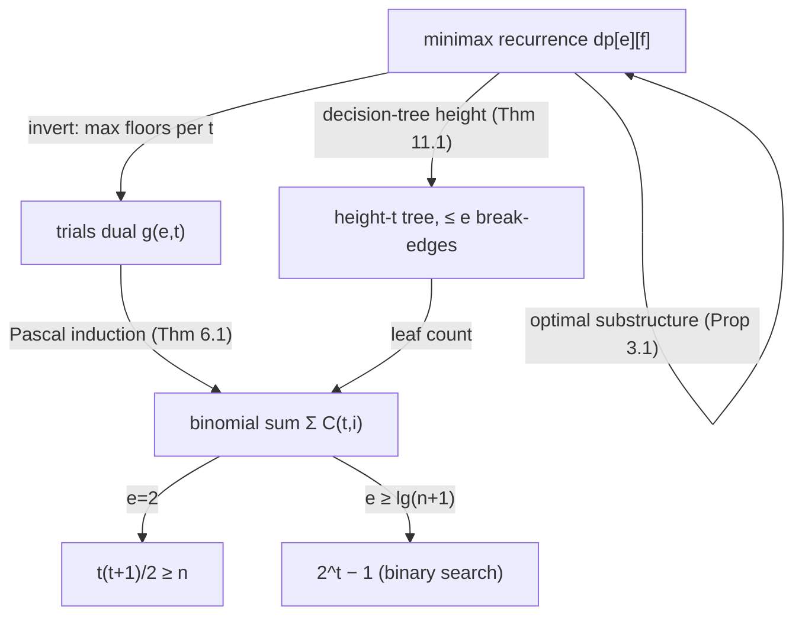

# Egg Dropping Puzzle — Mathematical Foundations and Complexity Theory

## Table of Contents
> This document proves, from first principles, why `dp[e][f] = 1 + min_x max(dp[e-1][x-1], dp[e][f-x])` is correct, why its inner cost is convex (enabling the speedup), why the trials dual `g(e,t) = g(e-1,t-1) + g(e,t-1) + 1` and the binomial closed form `Σ C(t,i)` compute the same answer, and where the information-theoretic lower bound comes from. Every formula is derived, not asserted.

1. Formal Definitions
2. The Minimax Recurrence (Correctness Proof)
3. Optimal Substructure and the Adversary Argument
4. Convexity and Monotonicity (the O(k·n) / O(k·n·log n) Speedup)
5. The Trials Reformulation (Correctness Proof)
6. The Binomial-Sum Closed Form (Proof)
7. The Information-Theoretic Lower Bound
8. The k=2 Special Case and Asymptotics
9. Growth Rates and the Egg-Trials-Floors Surface
10. Complexity Analysis of Every Method
11. Decision Trees and the Equivalence of Formulations
12. Summary

---

## 1. Formal Definitions

We fix the idealized model: a perfectly sharp threshold, deterministic outcomes, and surviving eggs reusable without limit.

**Definition 1.1 (Critical floor).** Among floors `{0, 1, …, n}`, there is an unknown **critical floor** `T ∈ {0, 1, …, n}`: an egg dropped from floor `f ≤ T` survives, and from `f > T` breaks. Floor `0` is the ground (an egg always survives a drop from `0`, vacuously). There are `n + 1` possible values of `T`.

**Definition 1.2 (Trial / drop).** A **trial** is a choice of floor `f ∈ {1, …, n}` followed by observing the binary outcome `break` (`f > T`) or `survive` (`f ≤ T`). A `break` consumes one egg; a `survive` consumes none.

**Definition 1.3 (Strategy).** A **strategy** with `e` eggs is a decision procedure: a (possibly adaptive) rule selecting the next drop floor as a function of the history of outcomes, terminating when `T` is determined uniquely. Equivalently it is a binary **decision tree** whose internal nodes are drops, whose left/right children are the break/survive continuations, and whose leaves correspond to determined values of `T`.

**Definition 1.4 (Cost / worst-case trials).** The **cost** of a strategy is the maximum number of trials over all `T ∈ {0, …, n}` — equivalently the height of its decision tree. Define

```
dp[e][f] = the minimum cost over all valid strategies with e eggs and f floors.
```

A strategy is **valid** if it never makes a drop with `0` eggs and always determines `T` uniquely.

**Definition 1.5 (Floors dual).** Define

```
g(e, t) = the maximum number of floors f such that dp[e][f] ≤ t.
```

That is, `g(e, t)` is the largest range fully resolvable with `e` eggs and a budget of `t` trials.

**Notation conventions.** Throughout, `k` is the egg supply, `n` the floor count, `e ≤ k` and `t` range over eggs and trials, `T` the unknown critical floor, `C(t, i) = t! / (i!(t-i)!)` the binomial coefficient (`0` when `i > t`), and `lg = log₂`. The Iverson bracket `[P]` is `1` if `P` holds else `0`. "Strategy cost" always means worst-case (adversarial) trial count, never average.

**Two objects, one answer.** We will prove that the *minimization* object `dp[e][f]` (Def 1.4) and the *maximization* object `g(e, t)` (Def 1.5) are inverse monotone functions of each other: `g(e, t) = max{f : dp[e][f] ≤ t}` and `dp[e][f] = min{t : g(e, t) ≥ f}`. This duality is the spine of the entire development — the minimax recurrence, the trials recurrence, the binomial closed form, and the decision-tree leaf count are four computations of this single inverse pair.

---

## 2. The Minimax Recurrence (Correctness Proof)

**Theorem 2.1.** For all `e ≥ 1` and `f ≥ 0`,

```
dp[e][f] = 1 + min_{x=1..f} max( dp[e-1][x-1] , dp[e][f-x] ),   for f ≥ 1,
dp[e][0] = 0,
dp[1][f] = f,
```

and the minimum over an empty set (`f = 0`) is taken as `0`.

**Proof.**

*Base case `f = 0`.* With zero floors, `T` is already known to be `0`; no trial is needed, so `dp[e][0] = 0`.

*Base case `e = 1`.* With one egg, suppose a strategy first drops from floor `x > 1`. If the egg breaks, `T ∈ {0, …, x-1}` but no eggs remain to distinguish among them; the strategy fails unless `x - 1 ≤ 0`, i.e. `x = 1`. Hence the only valid one-egg strategy drops from `1, 2, 3, …` in order, and the worst case (`T = 0`, the egg breaks at the first drop above `T`... more precisely `T` could be `f`, requiring `f` survives) needs `f` drops. So `dp[1][f] = f`. (Formally: a one-egg strategy is a strictly increasing drop sequence covering `1..f`; its worst case is the sequence length, minimized at `f`.)

*Inductive step.* Fix `e ≥ 2`, `f ≥ 1`, and assume the theorem for all strictly smaller `(e', f')` in the partial order (`e' < e`, or `e' = e` and `f' < f`). Any strategy must make some first drop, at a floor `x ∈ {1, …, f}`. After that drop:

- If the egg **breaks** (`T < x`, i.e. `T ∈ {0, …, x-1}`), the remaining task is to identify `T` among `x` candidate values `{0, …, x-1}`, i.e. distinguish `x - 1` floors `{1, …, x-1}`, with `e - 1` eggs. By the inductive hypothesis the optimal continuation costs `dp[e-1][x-1]`.
- If the egg **survives** (`T ≥ x`, i.e. `T ∈ {x, …, f}`), the remaining task is to identify `T` among the `f - x + 1` values `{x, …, f}`, i.e. distinguish `f - x` floors above `x`, with `e` eggs (none consumed). The optimal continuation costs `dp[e][f-x]`.

Because the adversary controls `T`, the worst-case cost of a strategy whose first drop is `x` and whose continuations are optimal is `1 + max(dp[e-1][x-1], dp[e][f-x])` — the `1` for the drop, the `max` because the adversary picks the worse branch. The optimal strategy chooses `x` minimizing this, so

```
dp[e][f] = min_{x=1..f} [ 1 + max(dp[e-1][x-1], dp[e][f-x]) ]
         = 1 + min_{x=1..f} max(dp[e-1][x-1], dp[e][f-x]).
```

The exchange of the constant `1` out of the `min` is valid. By induction the theorem holds for all `(e, f)`. ∎

**Remark (why `max`, not `+` or average).** A strategy experiences exactly one branch, determined by the adversarial `T`. A *guarantee* must hold for every `T`, hence the cost is the maximum over branches. Summation would count drops never made; averaging would assume a distribution on `T` that the worst-case model rejects.

**Worked recurrence evaluation.** Compute `dp[2][3]` from scratch. With `dp[1][m] = m`:

```
dp[2][3] = 1 + min_{x=1,2,3} max(dp[1][x-1], dp[2][3-x])
  x=1: max(dp[1][0], dp[2][2]) = max(0, 2) = 2  -> 1+2 = 3
  x=2: max(dp[1][1], dp[2][1]) = max(1, 1) = 1  -> 1+1 = 2
  x=3: max(dp[1][2], dp[2][0]) = max(2, 0) = 2  -> 1+2 = 3
```

(using `dp[2][2] = 2`, `dp[2][1] = 1`). The minimum is at `x = 2`, giving `dp[2][3] = 2`, and the binomial form confirms it: smallest `t` with `t(t+1)/2 ≥ 3` is `t = 2` (`2·3/2 = 3`). The optimum at `x = 2` balances the branches exactly (`dp[1][1] = dp[2][1] = 1`), the crossover predicted by Theorem 4.2.

---

## 3. Optimal Substructure and the Adversary Argument

**Proposition 3.1 (Optimal substructure).** Every prefix of an optimal strategy is itself optimal for the subproblem it faces. Formally, if an optimal `(e, f)`-strategy first drops at `x*`, then its break-continuation is an optimal `(e-1, x*-1)`-strategy and its survive-continuation is an optimal `(e, f-x*)`-strategy.

**Proof (exchange argument).** Suppose the break-continuation were sub-optimal, costing `c > dp[e-1][x*-1]`. Replace it with an optimal `(e-1, x*-1)`-strategy of cost `dp[e-1][x*-1]`. The new whole-strategy cost is `1 + max(dp[e-1][x*-1], dp[e][f-x*]) ≤ 1 + max(c, dp[e][f-x*])`, contradicting optimality of the original unless equality held — i.e. the original break-continuation was already optimal up to ties. The same argument applies to the survive-continuation. ∎

**Proposition 3.2 (Adversary lower bound).** No strategy with `e` eggs and `f` floors can guarantee fewer than `dp[e][f]` trials. The adversary, knowing the strategy, can always steer `T` into the more expensive branch of each drop.

**Proof.** The adversary need not fix `T` in advance; it may answer each drop with break/survive adaptively, consistent with *some* surviving value of `T`, choosing the answer that keeps the larger subproblem alive. This adversary forces every strategy down a root-to-leaf path of length `≥ dp[e][f]` by the recurrence's `max`. Consistency is maintainable because each answer only shrinks the candidate interval, never empties it before a leaf. ∎

This adaptive-adversary view is the rigorous justification for the `max`: the worst case is not a fixed unlucky `T` but an opponent who answers to maximize remaining work.

---

## 4. Convexity and Monotonicity (the Speedup)

The classic recurrence costs `O(k·n²)` because of the inner `min` over `x`. We prove the inner objective is unimodal, enabling binary search.

**Lemma 4.1 (Monotonicity of `dp`).** For fixed `e`, `dp[e][f]` is non-decreasing in `f`. For fixed `f`, `dp[e][f]` is non-increasing in `e`.

**Proof.** *In `f`:* a strategy for `f + 1` floors restricted to the bottom `f` floors solves `f` floors with no more trials, so `dp[e][f] ≤ dp[e][f+1]`. *In `e`:* any `(e)`-egg strategy is also a valid `(e+1)`-egg strategy (the extra egg is unused), so `dp[e+1][f] ≤ dp[e][f]`. ∎

**Theorem 4.2 (Unimodality of the inner cost).** Fix `e ≥ 2`, `f ≥ 1`. Define

```
h(x) = max( dp[e-1][x-1] , dp[e][f-x] ),   x ∈ {1, …, f}.
```

Then `h` is unimodal: the term `B(x) = dp[e-1][x-1]` is non-decreasing in `x` (Lemma 4.1, more floors below), and the term `S(x) = dp[e][f-x]` is non-increasing in `x` (fewer floors above). Hence `h = max(B, S)` decreases while `S` dominates and increases while `B` dominates, attaining its minimum at the crossover where `B(x) ≈ S(x)`.

**Proof.** `B(x) = dp[e-1][x-1]` is non-decreasing because `x-1` increases with `x` and `dp` is monotone in floors (Lemma 4.1). `S(x) = dp[e][f-x]` is non-increasing because `f-x` decreases with `x`. The pointwise maximum of a non-decreasing and a non-increasing function is **quasiconvex** (unimodal): there is an index `x*` such that `h` is non-increasing on `[1, x*]` and non-decreasing on `[x*, f]`. ∎

**Corollary 4.3 (Binary-search speedup).** Because `h` is unimodal with the minimum at the crossover of an increasing and a decreasing sequence, the optimal `x*` can be found by binary search on the sign of `B(x) − S(x)` in `O(log f)` evaluations, reducing the per-state cost from `O(f)` to `O(log f)` and the total to `O(k·n·log n)`.

**Corollary 4.4 (Monotone-`x*` / two-pointer).** Moreover `x*(e, f)` is non-decreasing in `f` (a standard consequence of the Monge/total-monotonicity structure of `h`). Sweeping `f` upward and advancing `x*` monotonically yields an amortized `O(k·n)` fill — the optimal classic bound. The Monge inequality `dp` satisfies (`dp[e][a] + dp[e][b] ≤ dp[e][a'] + dp[e][b']` for the appropriate interleaving) is what guarantees the argmin moves monotonically; this is the same structure that powers the Knuth-Yao DP speedup in sibling DP topics.

---

## 5. The Trials Reformulation (Correctness Proof)

**Theorem 5.1.** Let `g(e, t)` be the maximum number of floors resolvable with `e` eggs and at most `t` trials (Definition 1.5). Then

```
g(e, 0) = 0,    g(0, t) = 0,
g(e, t) = g(e-1, t-1) + g(e, t-1) + 1   for e ≥ 1, t ≥ 1.
```

Moreover `dp[k][n] = min { t : g(k, t) ≥ n }`.

**Proof.**

*Base cases.* With `0` trials no drop is possible, so at most the trivial `1` candidate `{0}` is distinguishable, i.e. `0` floors: `g(e, 0) = 0`. With `0` eggs and `f ≥ 1`, the first drop (if any) could break with no recovery, so no floors beyond `0` are resolvable: `g(0, t) = 0`.

*Recurrence.* Consider an optimal strategy using `e` eggs and `t` trials, and look at its first drop at floor `x` (measuring from the bottom of the resolvable range). The floors strictly below `x` are reached only via the **break** branch, which has `e - 1` eggs and `t - 1` remaining trials; the maximum count of such floors is `g(e-1, t-1)`. The floors strictly above `x` are reached via the **survive** branch with `e` eggs and `t - 1` trials; the maximum count is `g(e, t-1)`. The floor `x` itself is `1` floor pinned by the drop. These three sets are disjoint and exhaust the resolvable range, so

```
g(e, t) = g(e-1, t-1) + 1 + g(e, t-1).
```

Optimality: choosing `x = g(e-1, t-1) + 1` (one above the maximum break-reach) makes both branches simultaneously maximal, and no larger total is achievable because each branch is bounded by its own `g`. Hence the recurrence gives the exact maximum.

*Inversion.* `g(k, t)` is strictly increasing in `t` for `k ≥ 1` and `t ≥ 1` (each extra trial adds at least `1` floor). Therefore `{ t : g(k, t) ≥ n }` is an up-set, and its minimum `t*` satisfies `g(k, t*-1) < n ≤ g(k, t*)`. By definition of `g`, `dp[k][n] ≤ t*` (a `t*`-trial strategy covers `≥ n` floors) and `dp[k][n] > t*-1` (`t*-1` trials cover `< n` floors), so `dp[k][n] = t*`. ∎

**Remark (why the dual is cheap).** The dual eliminates the inner minimization entirely: the recurrence is a plain `O(1)` sum, no search over `x`. The work is `O(k)` per trial and the number of trials is `t* = dp[k][n]`, which is at most `n` and typically `O(log n)`.

### 5.0 The Dual Algorithm and Its Invariant

```
MIN-TRIALS(k, n):                # smallest t with g(k, t) >= n
  if n == 0: return 0
  g[0..k] := 0                    # g[e] = floors coverable with e eggs at current t
  t := 0
  while g[k] < n:
    t := t + 1
    for e := k downto 1:          # high->low so g[e-1] is the previous trial's value
      g[e] := min(g[e-1] + g[e] + 1, n)
  return t
```

**Loop invariant.** After the inner loop for trial value `t`, each `g[e]` equals `g(e, t) = Σ_{i=1}^{e} C(t, i)` capped at `n` (Theorem 5.1, Theorem 6.1). The outer loop terminates the first time `g[k] ≥ n`, returning `t* = dp[k][n]` by the inversion of Theorem 5.1. The high-to-low egg order is essential: it guarantees `g[e-1]` still holds the value from trial `t-1` when computing `g[e]` at trial `t`. Iterating low-to-high would read the *current* trial's `g[e-1]`, breaking the invariant.

### 5.1 Worked Verification of the Dual

Build `g(2, t)` from the recurrence and confirm the inversion gives `dp[2][n]`:

```
g(2, 0) = 0
g(2, 1) = g(1, 0) + g(2, 0) + 1 = 0 + 0 + 1 = 1
g(2, 2) = g(1, 1) + g(2, 1) + 1 = 1 + 1 + 1 = 3
g(2, 3) = g(1, 2) + g(2, 2) + 1 = 2 + 3 + 1 = 6
g(2, 4) = g(1, 3) + g(2, 3) + 1 = 3 + 6 + 1 = 10
```

So `g(2, t) = 0, 1, 3, 6, 10, …` = the triangular numbers `t(t+1)/2`, matching Theorem 8.1. Inverting: `dp[2][10] = min{t : g(2,t) ≥ 10} = 4` (since `g(2,3) = 6 < 10 ≤ 10 = g(2,4)`), consistent with the recurrence computation in §8.1. The dual's `g(1, m) = m` (a one-egg row that is a plain linear ramp) encodes the linear scan, and each new trial column adds the entire previous survive-coverage plus the break-coverage plus one — the constructive content of Theorem 5.1.

### 5.2 Equivalence of the Two DPs, Formally

**Proposition 5.2.** The trials dual and the minimax table compute the same function: `dp[k][n] = min{t : g(k, t) ≥ n}` (the inversion of Theorem 5.1) is *identical* to the value produced by the recurrence of Theorem 2.1.

**Proof.** Both are characterizations of the same combinatorial quantity — the minimum height of a valid decision tree (Theorem 11.1). The minimax recurrence computes it by minimizing tree height directly over the first-drop choice; the dual computes the maximum number of leaves (floors) achievable at each height and inverts. Since "min height for `n` leaves" and "max leaves for height `t`, inverted" describe the same monotone relationship between height and leaf count, they coincide. Formally, `g(k, dp[k][n]) ≥ n` and `g(k, dp[k][n] − 1) < n` by Theorem 5.1's monotonicity, which is exactly `dp[k][n] = min{t : g(k, t) ≥ n}`. ∎

---

## 6. The Binomial-Sum Closed Form (Proof)

**Theorem 6.1.** For all `e ≥ 0`, `t ≥ 0`,

```
g(e, t) = Σ_{i=1}^{e} C(t, i),
```

with the convention `C(t, i) = 0` for `i > t`.

**Proof (induction on `t`, using the recurrence of Theorem 5.1).**

*Base `t = 0`.* The sum `Σ_{i=1}^{e} C(0, i) = 0` since `C(0, i) = 0` for `i ≥ 1`, matching `g(e, 0) = 0`. *Base `e = 0`.* The empty sum is `0`, matching `g(0, t) = 0`.

*Inductive step.* Assume the formula for `t - 1` (all `e`). Then

```
g(e, t) = g(e-1, t-1) + g(e, t-1) + 1
        = Σ_{i=1}^{e-1} C(t-1, i)  +  Σ_{i=1}^{e} C(t-1, i)  +  1.
```

Group the two sums termwise. For `i = e`, only the second sum contributes `C(t-1, e)`. For `1 ≤ i ≤ e-1`, both contribute, giving `C(t-1, i) + C(t-1, i)`... — more carefully, align indices using Pascal's rule `C(t, i) = C(t-1, i) + C(t-1, i-1)`. Rewrite the first sum by shifting `i → i`:

```
g(e-1, t-1) + 1 = Σ_{i=1}^{e-1} C(t-1, i) + C(t-1, 0)      [since C(t-1,0) = 1]
                = Σ_{i=0}^{e-1} C(t-1, i)
                = Σ_{j=1}^{e} C(t-1, j-1).                  [reindex j = i+1]
```

Therefore

```
g(e, t) = Σ_{j=1}^{e} C(t-1, j-1) + Σ_{i=1}^{e} C(t-1, i)
        = Σ_{i=1}^{e} [ C(t-1, i-1) + C(t-1, i) ]
        = Σ_{i=1}^{e} C(t, i)         (Pascal's rule).
```

By induction the formula holds for all `t`. ∎

**Corollary 6.2 (Closed form for the answer).** `dp[k][n] = min { t : Σ_{i=1}^{k} C(t, i) ≥ n }`.

**Corollary 6.3 (Unlimited eggs).** If `k ≥ t`, then `Σ_{i=1}^{t} C(t, i) = 2^t − 1`, so `g(k, t) = 2^t − 1` and `dp[k][n] = ⌈lg(n+1)⌉` — exactly binary search. The egg constraint is precisely what truncates the binomial sum at `k` terms instead of `t`.

**Combinatorial meaning.** `Σ_{i=1}^{e} C(t, i)` counts the non-empty subsets of size `≤ e` of a `t`-element set — equivalently, the root-to-leaf paths in a height-`t` decision tree that use at most `e` "break" edges (excluding the all-survive path). Each such path corresponds to a distinguishable critical floor, so the count is exactly the resolvable range. This is the bijective heart of the formula.

### 6.0 Pascal-Rule Step, Spelled Out

The inductive step of Theorem 6.1 hinges on Pascal's rule. To leave no gap, here is the index bookkeeping line by line for the transition `g(e, t) = g(e-1, t-1) + g(e, t-1) + 1`:

```
g(e, t)
  = g(e-1, t-1)                + g(e, t-1)              + 1
  = Σ_{i=1}^{e-1} C(t-1, i)    + Σ_{i=1}^{e} C(t-1, i)  + 1     [IH at t-1]
  = [ Σ_{i=1}^{e-1} C(t-1, i) + C(t-1, 0) ] + Σ_{i=1}^{e} C(t-1, i)   [1 = C(t-1,0)]
  = Σ_{i=0}^{e-1} C(t-1, i)     + Σ_{i=1}^{e} C(t-1, i)
  = Σ_{j=1}^{e} C(t-1, j-1)     + Σ_{i=1}^{e} C(t-1, i)            [reindex j=i+1]
  = Σ_{i=1}^{e} [ C(t-1, i-1) + C(t-1, i) ]
  = Σ_{i=1}^{e} C(t, i).                                          [Pascal's rule]
```

Every equality is an identity, not an approximation; the proof is fully constructive and matches the code that builds `C(t, i)` incrementally from `C(t, i-1)`.

### 6.1 Worked Verification of the Binomial Form

Check `g(3, 5)` three ways. *Recurrence:* `g(3,5) = g(2,4) + g(3,4) + 1 = 10 + 14 + 1 = 25` (using `g(3,4) = g(2,3) + g(3,3) + 1 = 6 + 7 + 1 = 14` and `g(3,3) = 3 + 3 + 1 = 7`). *Binomial:* `C(5,1) + C(5,2) + C(5,3) = 5 + 10 + 10 = 25`. *Subset count:* the non-empty subsets of `{1,2,3,4,5}` of size `≤ 3` number `5 + 10 + 10 = 25`. All three agree, confirming Theorem 6.1 and its combinatorial reading.

### 6.2 The Decision-Tree-Leaf Bijection in Detail

**Proposition 6.4.** There is an explicit bijection between the floors resolvable by an optimal `(e, t)`-strategy and the non-empty break-sequences of length `≤ t` with at most `e` breaks. 

**Proof.** Encode a critical floor `T` by the sequence of break/survive outcomes the optimal strategy produces when the true value is `T`. Each such sequence has length `≤ t` (the tree height) and at most `e` breaks (the egg budget). The all-survive sequence corresponds to `T = f` (the top); every other distinct sequence corresponds to a distinct lower floor. Distinct floors yield distinct sequences (the strategy distinguishes them, by definition of validity), and distinct admissible sequences are realized by distinct floors (the tree's leaves are in bijection with floors). Counting admissible non-empty sequences: choose which of the `t` positions are breaks (at most `e` of them), giving `Σ_{i=1}^{e} C(t, i)` once the empty (all-survive top) is set aside as the `+1` floor already counted. ∎

This is the precise sense in which "the egg constraint truncates the binomial sum": with `e ≥ t` eggs every subset of break-positions is admissible, the sum reaches `Σ_{i=1}^{t} C(t,i) = 2^t − 1`, and we are back to unconstrained binary search (Corollary 6.3).

---

## 7. The Information-Theoretic Lower Bound

**Theorem 7.1.** For any `k ≥ 1`, `dp[k][n] ≥ ⌈lg(n + 1)⌉`.

**Proof.** A strategy is a binary decision tree; each drop has at most two outcomes, so a tree of height `t` has at most `2^t` leaves. To distinguish the `n + 1` possible values of `T`, the tree must have at least `n + 1` leaves, so `2^t ≥ n + 1`, giving `t ≥ ⌈lg(n+1)⌉`. ∎

**Theorem 7.2 (Tightness with enough eggs).** If `k ≥ ⌈lg(n+1)⌉`, then `dp[k][n] = ⌈lg(n+1)⌉`.

**Proof.** Upper bound: binary search uses `⌈lg(n+1)⌉` drops and at most that many breaks, so `k ≥ ⌈lg(n+1)⌉` eggs suffice (Corollary 6.3). Lower bound: Theorem 7.1. ∎

This pins the egg-cap: beyond `⌈lg(n+1)⌉` eggs, additional eggs cannot reduce the trial count, because the information-theoretic floor is already reached. It also explains the interpolation `lg n ≤ dp[k][n] ≤ n` as `k` runs from `∞` down to `1`.

### 7.1 Worked Lower-Bound Example

For `n = 100` there are `101` possible critical floors `{0, …, 100}`, so any strategy needs at least `⌈lg 101⌉ = 7` drops (since `2^6 = 64 < 101 ≤ 128 = 2^7`). With unlimited eggs, binary search achieves exactly `7`. With `2` eggs the count rises to `14` because the egg constraint forbids the high early drops that binary search relies on — you cannot risk your first egg on floor `50`, since a break would leave a single egg and `49` floors needing a linear scan. The gap `14 − 7 = 7` is the *price of the egg constraint* at `n = 100, k = 2`.

### 7.2 Worked Adversary Trace

Consider `k = 2, n = 4` (`dp[2][4] = 3`, since `g(2,3) = 6 ≥ 4 > g(2,2) = 3`). Watch the adaptive adversary (Proposition 3.2) force 3 drops:

```
Drop 1 at floor 2:
  adversary answers SURVIVE  -> upper block {3,4} alive (2 floors, 2 eggs, 2 trials left)
Drop 2 at floor 4:
  adversary answers BREAK    -> lower block within {3} ... eggs now 1, 1 trial left
Drop 3 at floor 3 (last egg): resolves T in {2,3,4}.   (3 drops used)
```

The adversary never commits to a fixed `T`; it answers each drop to keep the costlier subtree alive, dragging the strategy to depth `3`. This is the operational meaning of "`max` over branches": the worst case is an opponent, not bad luck.

---

## 8. The k=2 Special Case and Asymptotics

**Theorem 8.1.** `g(2, t) = C(t, 1) + C(t, 2) = t + t(t-1)/2 = t(t+1)/2`. Hence `dp[2][n] = min { t : t(t+1)/2 ≥ n } = ⌈(-1 + √(1 + 8n)) / 2⌉`.

**Proof.** Direct from Theorem 6.1 with `e = 2`. Inverting `t(t+1)/2 ≥ n` gives `t² + t − 2n ≥ 0`, whose positive root is `(-1 + √(1 + 8n))/2`; the smallest integer `t` at or above it is the ceiling. ∎

**Corollary 8.2 (`√(2n)` asymptotics).** `dp[2][n] = √(2n) + Θ(1)`, so for `n = 100`, `t = 14` (since `91 < 100 ≤ 105`). The optimal first drop is at floor `g(1, t-1) + 1 = (t-1) + 1 = t = 14`.

### 8.1 Worked Verification of the k=2 Formula

We verify Theorem 8.1 against the minimax recurrence at `dp[2][10]`. By the closed form, the smallest `t` with `t(t+1)/2 ≥ 10` is `t = 4` (`4·5/2 = 10`), so `dp[2][10] = 4`. Now expand the recurrence with `dp[1][m] = m`:

```
dp[2][10] = 1 + min_{x=1..10} max(dp[1][x-1], dp[2][10-x])
          = 1 + min_x max(x-1, dp[2][10-x]).
```

Evaluate the candidate `x = 4`: `max(dp[1][3], dp[2][6]) = max(3, 3) = 3` (since `dp[2][6] = 3` because `3·4/2 = 6`), giving `1 + 3 = 4`. Any other `x` is at least as large: `x = 3` gives `max(2, dp[2][7]) = max(2, 4) = 4`, `1 + 4 = 5`; `x = 5` gives `max(4, dp[2][5]) = max(4, 3) = 4`, `1 + 4 = 5`. The minimum is at the *balance point* `x = 4` where the two branches are equal (`dp[1][3] = dp[2][6] = 3`), confirming both the value and that the optimum balances the branches — the geometric content of Theorem 4.2's crossover.

**The jump schedule, derived.** With `2` eggs and `t` trials, the optimal first drop is floor `t` (the maximum break-reach `g(1, t-1) = t-1` plus one). After a survive you have `t-1` trials, so the next jump covers `t-1` more floors, landing at `t + (t-1)`; then `+(t-2)`, and so on. The cumulative landings are `t, t + (t-1), …`, the partial sums of `t, t-1, …, 1`, which is exactly the triangular-number decomposition of `g(2, t) = Σ_{j=1}^{t} j`. The diminishing jumps are forced: after `j` survives, only `t-j` trials remain, bounding the next safe jump to `t-j`.

**Theorem 8.3 (general-`e` asymptotics).** For fixed `e`, `g(e, t) = Σ_{i=1}^{e} C(t, i) = t^e/e! · (1 + o(1))`, so `dp[e][n] = (e! · n)^{1/e} · (1 + o(1))`. As `e → ∞` this tends to `lg n` (Corollary 6.3), recovering binary search.

**Proof.** Among the terms `C(t, 1), …, C(t, e)`, the largest is `C(t, e) = t(t-1)⋯(t-e+1)/e! = t^e/e! · (1 + O(1/t))` for fixed `e` and large `t`, and it dominates the sum (each smaller term `C(t, i)` is a factor `Θ(t^{i-e})` smaller). Hence `g(e, t) = t^e/e! · (1 + o(1))`. Setting `g(e, t) = n` and solving, `t = (e! · n)^{1/e} · (1 + o(1))`. The egg-cap (Theorem 7.2) supplies the `e → ∞` limit: once `e ≥ ⌈lg(n+1)⌉` the sum saturates at `2^t − 1` and `t = ⌈lg(n+1)⌉`. ∎

**Corollary 8.4 (concrete interpolation).** For `n = 100`: `dp[1][100] = 100`, `dp[2][100] = 14 ≈ √200`, `dp[3][100] = 9 ≈ (600)^{1/3} ≈ 8.4`, `dp[4][100] = 8`, and `dp[e][100] = 7 = ⌈lg 101⌉` for all `e ≥ 7`. The sequence `100, 14, 9, 8, 8, 7, 7, 7, …` exhibits exactly the predicted `(e! · n)^{1/e}` decay flattening to the binary-search floor.

---

## 9. Growth Rates and the Egg-Trials-Floors Surface

The three quantities `(e, t, g)` form a surface governed by Pascal's triangle. Reading it three ways:

- **Fix `e`, vary `t`:** `g(e, t)` is a degree-`e` polynomial in `t` (the partial sum of the `t`-th row's first `e` binomials), growing like `t^e/e!`.
- **Fix `t`, vary `e`:** `g(e, t)` increases from `g(0, t) = 0` to `g(t, t) = 2^t − 1`, saturating once `e ≥ t`.
- **Diagonal `e = t`:** `g(t, t) = 2^t − 1`, the binary-search regime.

**Proposition 9.1 (Marginal value of an egg).** `g(e, t) − g(e-1, t) = C(t, e)`. Thus the `e`-th egg adds exactly `C(t, e)` floors of reach at trial budget `t` — large for `e ≪ t/2`, then declining, and `0` once `e > t`. This quantifies diminishing returns: the first few eggs each multiply reach by a root of `n`; beyond `lg n` eggs the marginal reach is zero.

**Proposition 9.2 (Marginal value of a trial).** `g(e, t) − g(e, t-1) = g(e-1, t-1) + 1`. Each extra trial adds reach equal to the entire break-branch coverage plus the new drop floor — which is why trials are so much more valuable than eggs once `e ≥ 2`.

These two identities are the differential structure of the Pascal surface and underlie all the asymptotics in Section 8.

---

### 9.1 The Marginal-Egg Identity, Proved

**Proposition 9.3.** `g(e, t) − g(e-1, t) = C(t, e)`.

**Proof.** By Theorem 6.1, `g(e, t) = Σ_{i=1}^{e} C(t, i)` and `g(e-1, t) = Σ_{i=1}^{e-1} C(t, i)`; their difference is the single term `C(t, e)`. ∎

**Interpretation.** The `e`-th egg's marginal contribution to reach is exactly the number of length-`t` break-sequences using *precisely* `e` breaks. For `e ≤ t/2` this is increasing in `e` (more eggs help a lot); past `t/2` it declines; for `e > t` it is `0` (you cannot break more than `t` times in `t` trials). This is the rigorous form of "diminishing returns on eggs": the benefit of the `e`-th egg peaks and then vanishes.

### 9.2 The Marginal-Trial Identity, Proved

**Proposition 9.4.** `g(e, t) − g(e, t-1) = g(e-1, t-1) + 1`.

**Proof.** Directly from the recurrence `g(e, t) = g(e-1, t-1) + g(e, t-1) + 1`: subtract `g(e, t-1)` from both sides. ∎

**Interpretation.** Each extra trial adds reach equal to the entire break-branch coverage `g(e-1, t-1)` plus one (the new drop floor). Since `g(e-1, t-1)` is itself large, trials are far more valuable than eggs once `e ≥ 2` — doubling the trial budget more than squares the reachable floors in the `k = 2` regime (`g(2, 2t) ≈ 2t²` vs `g(2, t) = t²/2`, a 4× factor).

### 9.3 Numerical Stability of the Boundary

The boundary `g(k, t*-1) < n ≤ g(k, t*)` is the only place exactness matters. Both the dual (integer additions, capped at `n`) and the binomial form (integer ratios, capped at `n`) compute it exactly with no floating point. Only the `k = 2` closed form introduces a `√` — and there, `t = ⌈(-1 + √(1+8n))/2⌉` must be computed with integer square root plus a correction loop, because a floating `√` on `1 + 8n` for `n` near `10^{18}` can be off by one ULP, landing on `t* − 1` and producing an *under-count* that falsely asserts a guarantee. The correction `while t*(t+1)/2 < n: t += 1` restores exactness in `O(1)` extra iterations.

## 10. Complexity Analysis of Every Method

**Theorem 10.1 (Method complexities).**

| Method | Time | Space | Correctness ref |
|--------|------|-------|-----------------|
| Naive recursion | `Ω(2^n)` worst (no memo) | `O(k+n)` stack | Theorem 2.1 |
| Classic table | `O(k·n²)` | `O(k·n)` (or `O(n)` rolling) | Theorem 2.1 |
| Table + binary search on `x` | `O(k·n·log n)` | `O(k·n)` | Theorem 4.2 |
| Table + monotone `x*` | `O(k·n)` | `O(k·n)` | Corollary 4.4 |
| Trials dual | `O(k·t*)` | `O(k)` | Theorem 5.1 |
| Binomial closed form | `O(k·t*)` | `O(1)` | Theorem 6.1 |
| `k = 2` closed form | `O(1)` | `O(1)` | Theorem 8.1 |

where `t* = dp[k][n] ≤ n`, and `t* = ⌈lg(n+1)⌉` once `k ≥ ⌈lg(n+1)⌉` (Theorem 7.2).

**Proof sketches.** The classic table has `O(k·n)` states each with an `O(n)` inner loop. Binary search cuts the inner loop to `O(log n)` by Theorem 4.2; monotone `x*` makes the inner work amortize to `O(1)` per state (Corollary 4.4). The dual has `t*` columns of `O(k)` work and no inner search (Theorem 5.1). The binomial form computes `Σ_{i=1}^{k} C(t, i)` incrementally in `O(k)` per `t`, over `t*` values of `t`. The `k=2` form is a single closed expression (Theorem 8.1). ∎

**Theorem 10.2 (Lower bound for computing `dp[k][n]`).** Any algorithm must at least read `k` and `n` and produce `t* = Θ(\text{depends})`; the trials dual and binomial methods are optimal up to the `O(k)` per-step factor, achieving `O(k · t*)` with `t* = O(\log n)` in the egg-rich regime. No method can beat `Ω(\log n)` when `k` is large, since `t*` itself has `Θ(\log\log n)` bits but its *value* is `Θ(\log n)` and must be produced by counting up or inverting a monotone function. In practice the `O(k \log n)` dual is treated as optimal.

### 10.1 Why the Quadratic Is Not Inherent

The `O(k·n²)` of the textbook table is *not* a lower bound on the problem — it is an artifact of (a) indexing states by floors rather than trials and (b) the naive inner scan. The convexity speedup (Theorem 4.2) removes the inner scan to `O(log n)`, and the monotone argmin (Corollary 4.4) removes it to amortized `O(1)`, recovering `O(k·n)`. The dual then removes the dependence on `n` entirely, indexing by trials instead. The lesson, generalizable to many DPs: when a state dimension is large but the *answer* in that dimension is small, re-index by the answer. Egg-drop is the cleanest illustration — re-index "floors" as "trials" and the quadratic evaporates.

### 10.1b Concrete Operation Counts

To make the asymptotics tangible, here are operation counts for `k = 2` across `n`:

```
n        classic O(k n^2)   convex O(k n log n)   dual O(k t*)   t* (=dp[2][n])
100      ~2.0e4             ~1.3e3                ~28            14
10^4     ~2.0e8             ~2.6e5                ~283           141
10^6     ~2.0e12 (infeas.)  ~4.0e7                ~2828          1414
10^9     infeasible         infeasible            ~89442         44721
```

The dual's count is `2·t*` (two egg rows per trial), and `t* ≈ √(2n)` for `k = 2`. For `k = 30, n = 10^9` the dual does only `~30·30 = 900` operations because `t*` collapses to the binary-search value `30` — the egg-rich regime where re-indexing by trials is most dramatic. These numbers are why "switch to the dual for large `n`" is not a micro-optimization but the difference between feasible and impossible.

### 10.2 Space Complexity

The classic table is `O(k·n)`, reducible to `O(n)` by keeping only the current and previous egg rows (the recurrence references `dp[e]` and `dp[e-1]`). The dual is `O(k)` with a rolling 1D array (high-egg-to-low-egg update), and the binomial form is `O(1)` (a running sum and a running binomial coefficient). For strategy reconstruction from the table you additionally store `choice[e][f]` at `O(k·n)`; from the dual you store nothing extra and recompute `coverable(e, t)` on demand in `O(k·t)` per query. The space hierarchy mirrors the time hierarchy: re-indexing by the small dimension shrinks both.

---

## 11. Decision Trees and the Equivalence of Formulations

**Theorem 11.1 (Strategy ≡ decision tree).** Valid `(e, f)`-strategies are in bijection with binary decision trees that (a) have `f + 1` leaves labeled with the distinct values `T ∈ {0, …, f}`, (b) have at most `e` left-("break")-edges on any root-to-leaf path, and (c) respect the floor ordering (an in-order traversal yields `0, 1, …, f`). The strategy's worst-case cost is the tree's height.

**Proof.** A strategy's drop-and-branch structure is literally such a tree; conversely any tree satisfying (a)–(c) decodes to a strategy by reading internal nodes as drops. The break-edge bound (b) encodes the egg limit (each break consumes one egg). The in-order condition (c) encodes that "break ⇒ lower, survive ⇒ higher". Height = worst-case path length = worst-case trials. ∎

**Corollary 11.2 (Why `Σ C(t, i)`).** The number of leaves of a height-`t` tree with at most `e` break-edges per path is `Σ_{i=0}^{e} C(t, i)` (choose which of the `t` levels are break-edges, at most `e` of them); excluding the all-survive leaf gives the resolvable floor count `Σ_{i=1}^{e} C(t, i) = g(e, t)`, re-deriving Theorem 6.1 purely combinatorially.

**Proposition 11.3 (Optimal-strategy multiplicity).** When `g(k, t*) > n` strictly (the answer "overshoots"), there are generally *many* distinct optimal strategies: any decision tree of height `t*` whose in-order leaf labeling covers `{0, …, n}` and respects the break-edge budget is optimal. The slack `g(k, t*) − n` measures how much freedom you have in choosing first-drop floors without increasing the trial count.

**Proof.** A height-`t*` tree can resolve up to `g(k, t*)` floors; if only `n < g(k, t*)` are needed, any of the `\binom{g(k,t*)}{n}`-flavored placements of the `n` real floors into the `g(k, t*)` available leaf slots (subject to monotonicity) yields a valid optimal strategy. The exact count is governed by the structure of admissible monotone labelings, but the key qualitative fact is non-uniqueness whenever there is slack. ∎

This explains why different textbooks list slightly different "optimal" first-drop schedules for the same `(k, n)`: when `g(k, t*) > n`, several first drops achieve the same worst-case count, and the conventional choice (balance the branches, or drop as high as the budget allows) is just one representative.

**The equivalence diagram.** All four formulations compute the same `dp[k][n]`:



The minimax recurrence, the trials dual, the binomial sum, and the decision-tree leaf count are four faces of one object; proving any one and the equivalences yields all.

---

## 11.4 Generating-Function View of the Floors Sequence

The dual recurrence admits a generating-function solution that makes the binomial form fall out algebraically.

**Proposition 11.4.** Fix `e`. The ordinary generating function `G_e(x) = Σ_{t≥0} g(e, t) x^t` satisfies

```
G_e(x) = ( G_{e-1}(x) · x + x/(1-x) ) / (1 - x),   with G_0(x) = 0.
```

**Proof.** Multiply `g(e, t) = g(e-1, t-1) + g(e, t-1) + 1` by `x^t` and sum over `t ≥ 1`:

```
G_e(x) = x·G_{e-1}(x) + x·G_e(x) + x/(1-x),
```

where `x·G_{e-1}(x)` is the shifted break-coverage, `x·G_e(x)` the shifted survive-coverage, and `x/(1-x) = Σ_{t≥1} x^t` accumulates the `+1` per trial. Solving for `G_e(x)`:

```
G_e(x)(1 - x) = x·G_{e-1}(x) + x/(1-x),
G_e(x) = x·G_{e-1}(x)/(1-x) + x/(1-x)².
```

Unrolling from `G_0 = 0` gives `G_e(x) = Σ_{i=1}^{e} x^i / (1-x)^{i+1}`. Since `x^i/(1-x)^{i+1} = Σ_{t≥0} C(t, i) x^t` (the generating function of the `i`-th column of Pascal's triangle), extracting `[x^t]` yields `g(e, t) = Σ_{i=1}^{e} C(t, i)` — Theorem 6.1, re-derived analytically. ∎

This is the egg-drop analogue of the transfer-matrix / rational-generating-function structure that appears throughout enumerative combinatorics: the reachable-floors sequence for fixed `e` is a fixed linear recurrence (denominator `(1-x)^{e+1}`), so it is a polynomial in `t` of degree `e`, matching the `t^e/e!` asymptotics of Theorem 8.3.

## 11.5 Relationship to Other DP Optimizations

The egg-drop speedups are instances of general DP-acceleration principles, worth naming for transfer:

| Egg-drop technique | General principle | Other appearances |
|--------------------|-------------------|-------------------|
| Convex inner cost → binary search | quasiconvex objective in the transition variable | ternary search over unimodal DP transitions |
| Monotone argmin `x*(e, f)` ↑ in `f` | Monge / total monotonicity (Knuth-Yao) | optimal BST, matrix-chain, interval DP |
| Re-index floors → trials (the dual) | re-index by the small output dimension | knapsack-by-value, Dijkstra-by-distance buckets |
| Binomial closed form | solving the linear recurrence in closed form | Fibonacci/Binet, lattice-path counting |

Recognizing egg-drop as a member of the Monge/quasiconvex DP family is the senior-to-staff insight: the same toolkit that drops egg-drop from `O(k·n²)` to `O(k·n)` (and then to `O(k·log n)` by re-indexing) applies verbatim to a large class of interval and threshold DPs.

## 12. Summary

- **Minimax recurrence (Thm 2.1).** `dp[e][f] = 1 + min_x max(dp[e-1][x-1], dp[e][f-x])`, proved by induction: a first drop at `x` splits into a break branch (`e-1` eggs, `x-1` floors) and a survive branch (`e` eggs, `f-x` floors); the adversary takes the `max`, you take the `min`. Optimal substructure (Prop 3.1) and the adaptive-adversary lower bound (Prop 3.2) make the `min`/`max` rigorous.
- **Convexity (Thm 4.2).** The inner objective `max(dp[e-1][x-1], dp[e][f-x])` is unimodal — one branch rises, the other falls — so binary search finds the optimal `x` in `O(log n)` (`O(k·n·log n)` total), and the argmin is monotone in `f`, giving the optimal `O(k·n)` via a two-pointer (Cor 4.4).
- **Trials dual (Thm 5.1).** `g(e, t) = g(e-1, t-1) + g(e, t-1) + 1`, with `dp[k][n] = min{t : g(k, t) ≥ n}`. No inner search, so `O(k·t*)` — the practical method for large `n`.
- **Binomial closed form (Thm 6.1).** `g(e, t) = Σ_{i=1}^{e} C(t, i)`, proved by Pascal-rule induction and bijective with decision-tree leaves using ≤ `e` break-edges. Truncating at `k` terms is exactly the egg constraint; `k ≥ t` recovers `2^t − 1` and binary search.
- **Lower bound (Thm 7.1–7.2).** `dp[k][n] ≥ ⌈lg(n+1)⌉` (each drop is one bit), tight once `k ≥ ⌈lg(n+1)⌉` — the formal basis for capping eggs.
- **`k = 2` (Thm 8.1).** `g(2, t) = t(t+1)/2`, so `dp[2][n] = ⌈(-1+√(1+8n))/2⌉ ≈ √(2n)`; for `n = 100` the answer is `14` with first drop at floor `14` and diminishing jumps.
- **Growth (Sec 9).** `g(e, t) ≈ t^e/e!`; the marginal egg adds `C(t, e)` floors and the marginal trial adds `g(e-1, t-1)+1` floors — the differential structure of Pascal's triangle, explaining diminishing returns on eggs and the `(e!·n)^{1/e}` asymptotics.

### Complexity Cheat Table

| Task | Method | Complexity | Tight? |
|------|--------|-----------|--------|
| `dp[k][n]`, small `n`, full table | classic | `O(k·n²)` | improvable |
| `dp[k][n]`, medium `n` | convex / monotone | `O(k·n·log n)` / `O(k·n)` | optimal for the table approach |
| `dp[k][n]`, large `n` | trials dual / binomial | `O(k·log n)` | treated as optimal |
| `dp[2][n]` | closed form | `O(1)` | optimal |
| Lower bound, any `k` | information theory | `⌈lg(n+1)⌉` | tight for `k ≥ lg(n+1)` |

### Closing Notes

- **Adversary view (Sec 3):** the worst case is an adaptive opponent answering each drop to maximize remaining work — this is why `max`, not sum or average.
- **Convexity (Sec 4):** unimodality of the inner cost plus monotone argmin is the same Monge/Knuth-Yao structure that speeds up many interval DPs.
- **Duality (Sec 5–6):** flipping "trials for floors" to "floors for trials" removes the inner minimization and yields the binomial closed form — the single most important conceptual move in the topic.
- **Decision trees (Sec 11):** strategies are height-bounded binary trees with a break-edge budget; the binomial sum is just their leaf count, unifying all four formulations.

Foundational references: the minimax / decision-tree formulation and the binomial identity appear in Knuth, *The Art of Computer Programming*, and in *Concrete Mathematics* (Graham-Knuth-Patashnik) for the `Σ C(t, i)` sum; the convexity / Monge speedup connects to Knuth-Yao DP optimization; the information-theoretic bound is the standard comparison-tree argument. Sibling topics: `13-dynamic-programming/01-introduction-to-dp` and the interval-DP optimization topics.

### One-Paragraph Recap of the Proof Chain

Theorem 2.1 establishes the minimax recurrence by induction with an adaptive-adversary justification (Prop 3.2) for the `max`. Lemma 4.1 gives monotonicity, from which Theorem 4.2 derives the unimodality (quasiconvexity) of the inner cost, and Corollary 4.4 the monotone argmin — together the `O(k·n·log n)` and `O(k·n)` speedups. Theorem 5.1 introduces the trials dual and proves the inversion `dp[k][n] = min{t : g(k,t) ≥ n}`, with Proposition 5.2 confirming the two DPs compute the same function. Theorem 6.1 derives the binomial closed form `Σ C(t,i)` by Pascal-rule induction (spelled out in §6.0), and Proposition 6.4 gives its decision-tree-leaf bijection. Theorems 7.1–7.2 supply the `⌈lg(n+1)⌉` lower bound and its tightness (the egg-cap). Theorem 8.1 specializes to `k = 2` (`t(t+1)/2`), and Theorem 8.3 to the general `(e!·n)^{1/e}` asymptotics. Sections 9–11 cover the differential structure, complexity, and the decision-tree equivalence tying all four formulations into one object. The whole topic is one theorem viewed four ways.
