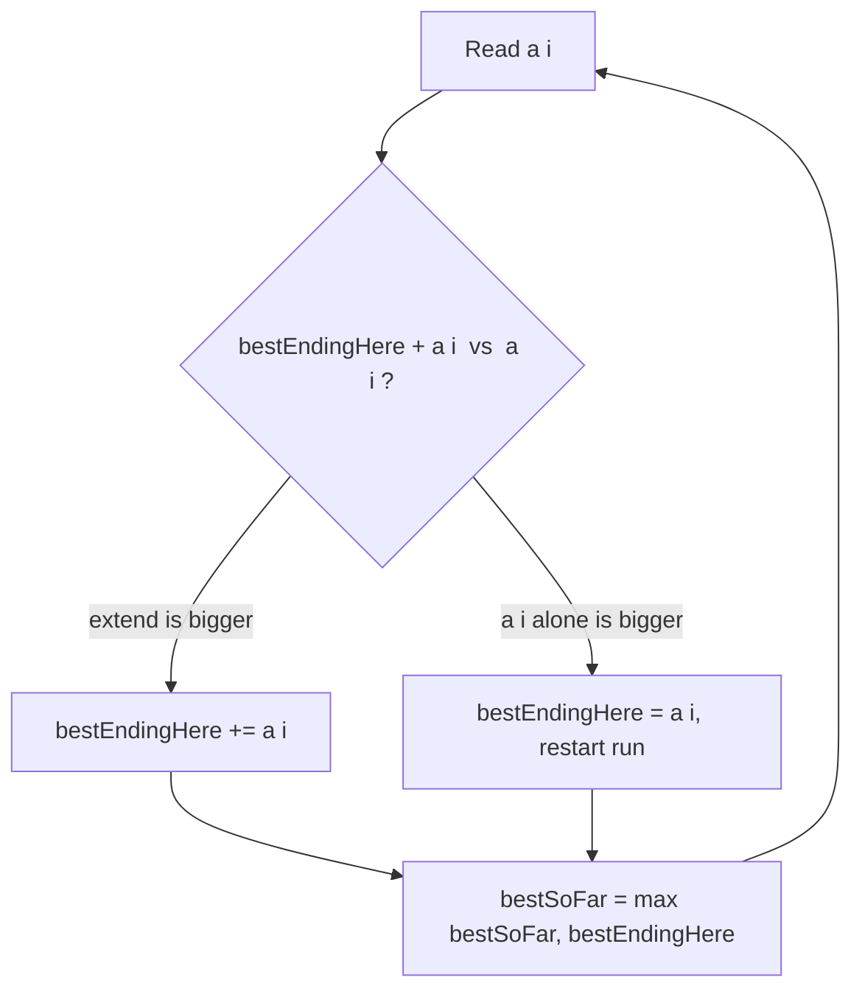

# Kadane's Algorithm / Maximum Subarray — Junior Level

> **One-line summary:** To find the largest sum of any contiguous block of an array in a single `O(n)` pass, keep a running "best sum that ends at the current position" using `bestEndingHere = max(a[i], bestEndingHere + a[i])`, and track the largest such value ever seen in `bestSoFar`. The recurrence — extend the previous run or start fresh at `a[i]` — is the entire trick.

---

## Table of Contents

1. [Introduction](#introduction)
2. [Prerequisites](#prerequisites)
3. [Glossary](#glossary)
4. [Core Concepts](#core-concepts)
5. [Big-O Summary](#big-o-summary)
6. [Real-World Analogies](#real-world-analogies)
7. [Pros & Cons](#pros--cons)
8. [Step-by-Step Walkthrough](#step-by-step-walkthrough)
9. [Code Examples](#code-examples)
10. [Coding Patterns](#coding-patterns)
11. [Error Handling](#error-handling)
12. [Performance Tips](#performance-tips)
13. [Best Practices](#best-practices)
14. [Edge Cases & Pitfalls](#edge-cases--pitfalls)
15. [Common Mistakes](#common-mistakes)
16. [Cheat Sheet](#cheat-sheet)
17. [Visual Animation](#visual-animation)
18. [Summary](#summary)
19. [Further Reading](#further-reading)

---

## Introduction

Suppose someone hands you a list of daily profit-and-loss numbers — some days you gained money, some days you lost it — and asks: *"Over which run of consecutive days did I make the most money?"* You are not allowed to skip days in the middle; the answer must be a single unbroken stretch. That is the **maximum-sum contiguous subarray** problem, one of the most famous warm-up questions in all of computer science.

The brute-force answer is to try every possible start and end and add up everything in between. There are about `n²/2` such ranges, and naively summing each one costs another factor of `n`, giving `O(n³)`. With a little cleverness (prefix sums or carrying a running total) you can knock the inner sum out and get `O(n²)`. But there is a single, almost magical pass that solves the whole thing in `O(n)` time and `O(1)` extra space. It is called **Kadane's algorithm**, and the idea fits in one sentence:

> **At each position, the best subarray ending right here is either just this element alone, or this element glued onto the best subarray that ended one step to the left — whichever is larger.**

In symbols, if `bestEndingHere` is the maximum sum of a subarray that *must end at index `i`*, then:

```
bestEndingHere = max(a[i], bestEndingHere_prev + a[i])
```

We sweep left to right computing this, and along the way we remember the largest `bestEndingHere` we have ever seen in a separate variable, `bestSoFar`. When the sweep ends, `bestSoFar` is the answer. The reason this works is a tiny piece of dynamic programming: every contiguous subarray ends *somewhere*, so if we know the best subarray ending at each position, the overall best is just the maximum over all those positions.

This single idea is the foundation for a surprisingly large family of problems: maximum-product subarray, the circular (wrap-around) version, the 2D maximum-sum submatrix, and "best subarray with at most/at least `k` elements". At junior level we focus on the plain 1D sum version and one detail that trips up almost everyone the first time: **the all-negative array**, where the answer is the single least-negative element, not zero. Get that edge case right and you have understood Kadane's deeply.

---

## Prerequisites

Before reading this file you should be comfortable with:

- **Arrays and indexing** — iterating left to right, reading `a[i]`.
- **A running variable** — keeping a value that you update as you scan (like a running sum or running maximum).
- **The `max` function** — `max(x, y)` returns the larger of two numbers.
- **Big-O notation** — `O(n)`, `O(n²)`, `O(1)` space.
- **Negative numbers** — the whole subtlety of this topic lives in how negatives interact with sums.

Optional but helpful:

- A glance at **prefix sums** (`prefix[i] = a[0] + … + a[i-1]`), because the `O(n²)` baseline and the elegant "prefix minus running minimum" reformulation both use them.
- Basic familiarity with **dynamic programming** as "build the answer from smaller subproblems" — Kadane's is the simplest non-trivial DP there is.

---

## Glossary

| Term | Meaning |
|------|---------|
| **Subarray** | A *contiguous* block `a[l..r]` of the array. No gaps. Distinct from a *subsequence*, which may skip elements. |
| **Subsequence** | Elements picked in order but possibly with gaps. **Not** what this problem asks for. |
| **Subarray sum** | `a[l] + a[l+1] + … + a[r]` — the sum of one contiguous block. |
| **`bestEndingHere`** | The maximum sum of any subarray that *ends exactly at* the current index `i`. The DP state. |
| **`bestSoFar`** | The maximum sum of any subarray seen anywhere so far. The running global answer. |
| **The Kadane recurrence** | `bestEndingHere = max(a[i], bestEndingHere + a[i])`. Extend the run, or restart at `a[i]`. |
| **All-negative case** | Every element is `< 0`; the maximum-sum subarray is the single largest (least negative) element. |
| **Empty subarray** | A subarray of length 0 with sum `0`. Some problem variants allow it; the classic version does **not**. |
| **Prefix sum** | `P[i] = a[0] + … + a[i-1]`, with `P[0] = 0`. A subarray sum is `P[r+1] − P[l]`. |
| **Reconstruction** | Recovering the actual start/end indices of the best subarray, not just its sum. |

---

## Core Concepts

### 1. What We Are Actually Maximizing

We want `max over all l ≤ r of (a[l] + a[l+1] + … + a[r])`. There are `O(n²)` choices of `(l, r)`. The genius of Kadane's is to *not* enumerate them. Instead we ask a smaller question at each index.

### 2. The Key Subproblem: "Best Subarray Ending Here"

Define `f(i)` = the maximum sum of a subarray that **ends at index `i`** (so `a[i]` is its last element). Every subarray ends at exactly one index, so the answer to the whole problem is:

```
answer = max over all i of f(i)
```

This reframing is the heart of the dynamic-programming view. We have turned one hard global question into `n` easy local ones.

### 3. The Recurrence

How do we compute `f(i)` from `f(i-1)`? A subarray ending at `i` either:

- **consists of `a[i]` alone** (we start fresh here), or
- **is the best subarray ending at `i-1`, with `a[i]` appended** (we extend the run).

We pick whichever is bigger:

```
f(i) = max( a[i],  f(i-1) + a[i] )
```

Intuition: if the best run ending just before us (`f(i-1)`) is **positive**, dragging it along helps, so we extend. If it is **negative**, it would only drag our sum down, so we throw it away and start fresh at `a[i]`. That single comparison is Kadane's.

### 4. Two Variables Are Enough

We never need the whole `f` array — only the previous value `f(i-1)`. So we keep one rolling variable `bestEndingHere` (= `f(i)`) and one `bestSoFar` (= the max of all `f` values so far). That is why the algorithm is `O(1)` space.

```
bestEndingHere = max(a[i], bestEndingHere + a[i])
bestSoFar      = max(bestSoFar, bestEndingHere)
```

### 5. Initialization and the All-Negative Trap

The single most common bug: initializing `bestSoFar = 0`. If the array is `[-3, -1, -2]`, every subarray sum is negative, and the true answer is `-1` (the single least-negative element). But if you start `bestSoFar = 0`, you will wrongly report `0` — a subarray that does not exist (or only exists if empty subarrays are allowed). **The fix:** initialize both variables to `a[0]` and start the loop at index `1`. That way the answer is always *some real element or run*, never a phantom zero.

```
bestEndingHere = a[0]
bestSoFar      = a[0]
for i in 1 .. n-1:
    bestEndingHere = max(a[i], bestEndingHere + a[i])
    bestSoFar      = max(bestSoFar, bestEndingHere)
```

### 6. Why It Is Correct (Intuitive Version)

By the recurrence, after processing index `i`, `bestEndingHere` correctly equals the best subarray sum ending at `i`. (If the running sum ever went negative it was discarded — keeping it could never help a future subarray, because a future subarray that includes us would be better off dropping that negative prefix.) Since `bestSoFar` is the maximum over all those per-index bests, and every subarray ends *somewhere*, `bestSoFar` is the global maximum. The full proof lives in [`professional.md`](./professional.md), but the picture is simple: **a negative running prefix is never worth carrying forward.**

---

## Big-O Summary

| Operation | Time | Space | Notes |
|-----------|------|-------|-------|
| Brute force (all `l, r`, re-sum) | **O(n³)** | O(1) | Three nested loops; only for tiny `n`. |
| Brute force with running inner sum / prefix sums | O(n²) | O(n) or O(1) | Drops the innermost sum loop. |
| **Kadane's algorithm (1D)** | **O(n)** | **O(1)** | One pass, two variables. The standard answer. |
| Kadane's with index reconstruction | O(n) | O(1) | Track candidate start, plus best `(l, r)`. See `middle.md`. |
| Divide & conquer | O(n log n) | O(log n) | Elegant but slower than Kadane's; good contrast. |
| Maximum-product subarray | O(n) | O(1) | Track both running min and max (signs flip). See `middle.md`. |
| 2D maximum-sum submatrix | O(R²·C) | O(C) | Fix a row pair, Kadane over column sums. See `middle.md`. |
| Circular maximum subarray | O(n) | O(1) | `max(normal Kadane, total − minSubarray)`. See `middle.md`. |

The headline number is **`O(n)` time, `O(1)` space** for the core 1D problem — you cannot do asymptotically better, since you must at least read every element once.

---

## Real-World Analogies

| Concept | Analogy |
|---------|---------|
| The array | A timeline of daily profit/loss for a small business. |
| Maximum-sum subarray | The single best run of consecutive days — the hottest streak. |
| `bestEndingHere` | "If I had to *end* my streak today, how good is the best streak that finishes now?" |
| The recurrence | A hiker tracking elevation gain: if the path so far has been net downhill, abandon it and treat right here as your new starting point. |
| Restarting at `a[i]` | A gambler who walks away from a losing table and starts a fresh tally rather than chasing losses. |
| The all-negative case | Even in a losing month, there is still a "least bad" single day — that is your answer, not "do nothing." |
| `bestSoFar` | A high-water mark on a riverbank: it only ever goes up, recording the best level ever reached. |

Where the analogy breaks: a hiker can rest in place (a length-0 walk), but the classic max-subarray forbids the empty subarray, which is exactly why the all-negative case forces a real (negative) answer.

---

## Pros & Cons

| Pros | Cons |
|------|------|
| `O(n)` time, `O(1)` space — optimal and tiny. | Only works for **contiguous** subarrays, not subsequences. |
| Single left-to-right pass; trivially streamable / online. | The all-negative initialization is a notorious off-by-one / zero trap. |
| The recurrence generalizes (product, circular, 2D, bounded length). | Reconstructing indices needs a little extra bookkeeping. |
| No extra data structures — just two variables. | The product variant needs *two* running states (min and max) — not obvious. |
| Numerically clean for integers; overflow is the only real hazard. | Does not directly handle "at most/at least `k` elements" without modification. |

**When to use:** any time you need the best contiguous run by sum (or a close variant — product, circular, 2D), especially on large or streaming inputs where `O(n)` and `O(1)` space matter.

**When NOT to use:** when the elements need not be contiguous (that is a different, easier problem — just sum the positives), or when you need the best *subsequence* under some other constraint.

---

## Step-by-Step Walkthrough

Take the classic textbook array:

```
a = [-2, 1, -3, 4, -1, 2, 1, -5, 4]
index 0   1   2  3   4  5  6   7  8
```

Initialize `bestEndingHere = a[0] = -2` and `bestSoFar = -2`. Now sweep from `i = 1`:

```
i=1  a[i]= 1   bestEndingHere = max(1,  -2 + 1) = max(1, -1) =  1   bestSoFar = max(-2, 1) =  1
i=2  a[i]=-3   bestEndingHere = max(-3,  1 + -3)= max(-3,-2) = -2   bestSoFar = max(1, -2) =  1
i=3  a[i]= 4   bestEndingHere = max(4,  -2 + 4) = max(4, 2)  =  4   bestSoFar = max(1, 4)  =  4
i=4  a[i]=-1   bestEndingHere = max(-1,  4 + -1)= max(-1,3)  =  3   bestSoFar = max(4, 3)  =  4
i=5  a[i]= 2   bestEndingHere = max(2,   3 + 2) = max(2, 5)  =  5   bestSoFar = max(4, 5)  =  5
i=6  a[i]= 1   bestEndingHere = max(1,   5 + 1) = max(1, 6)  =  6   bestSoFar = max(5, 6)  =  6
i=7  a[i]=-5   bestEndingHere = max(-5,  6 + -5)= max(-5,1)  =  1   bestSoFar = max(6, 1)  =  6
i=8  a[i]= 4   bestEndingHere = max(4,   1 + 4) = max(4, 5)  =  5   bestSoFar = max(6, 5)  =  6
```

**Answer: `bestSoFar = 6`**, achieved by the subarray `a[3..6] = [4, -1, 2, 1]`, which sums to `4 − 1 + 2 + 1 = 6`. Notice how at `i=2` the running `bestEndingHere` dipped to `-2`, and at `i=3` the recurrence *discarded* that negative prefix (chose `4` over `2`), restarting the run at index 3. That restart is exactly the moment the new, winning subarray begins.

**Now verify the all-negative case.** Take `a = [-3, -1, -2]`:

```
bestEndingHere = bestSoFar = -3
i=1  a[i]=-1   bestEndingHere = max(-1, -3 + -1) = max(-1, -4) = -1   bestSoFar = max(-3, -1) = -1
i=2  a[i]=-2   bestEndingHere = max(-2, -1 + -2) = max(-2, -3) = -2   bestSoFar = max(-1, -2) = -1
```

Answer `-1` — the single least-negative element, exactly right. Had we initialized `bestSoFar = 0`, we would have wrongly returned `0`.

**One more: the all-positive case.** Take `a = [2, 1, 3, 4]`:

```
bestEndingHere = bestSoFar = 2
i=1  a[i]=1   bestEndingHere = max(1, 2 + 1) = 3    bestSoFar = max(2, 3) = 3
i=2  a[i]=3   bestEndingHere = max(3, 3 + 3) = 6    bestSoFar = max(3, 6) = 6
i=3  a[i]=4   bestEndingHere = max(4, 6 + 4) = 10   bestSoFar = max(6, 10) = 10
```

Answer `10` — the whole array. When every element is positive, the recurrence *never* restarts (extending always wins), so the best subarray is the entire array. This is the opposite extreme from the all-negative case, and a good sanity check: an all-positive input must return the total sum.

---

## Code Examples

### Example: 1D Kadane's (sum), correct all-negative handling

#### Go

```go
package main

import "fmt"

// maxSubarraySum returns the largest sum of any non-empty contiguous subarray.
func maxSubarraySum(a []int) int {
	if len(a) == 0 {
		panic("maxSubarraySum: empty input has no non-empty subarray")
	}
	bestEndingHere := a[0]
	bestSoFar := a[0]
	for i := 1; i < len(a); i++ {
		// extend the previous run, or start fresh at a[i]
		if a[i] > bestEndingHere+a[i] {
			bestEndingHere = a[i]
		} else {
			bestEndingHere = bestEndingHere + a[i]
		}
		if bestEndingHere > bestSoFar {
			bestSoFar = bestEndingHere
		}
	}
	return bestSoFar
}

func main() {
	a := []int{-2, 1, -3, 4, -1, 2, 1, -5, 4}
	fmt.Println(maxSubarraySum(a)) // 6

	allNeg := []int{-3, -1, -2}
	fmt.Println(maxSubarraySum(allNeg)) // -1
}
```

#### Java

```java
public class Kadane {
    // Returns the largest sum of any non-empty contiguous subarray.
    static int maxSubarraySum(int[] a) {
        if (a.length == 0) {
            throw new IllegalArgumentException("empty input has no non-empty subarray");
        }
        int bestEndingHere = a[0];
        int bestSoFar = a[0];
        for (int i = 1; i < a.length; i++) {
            // extend the previous run, or start fresh at a[i]
            bestEndingHere = Math.max(a[i], bestEndingHere + a[i]);
            bestSoFar = Math.max(bestSoFar, bestEndingHere);
        }
        return bestSoFar;
    }

    public static void main(String[] args) {
        int[] a = {-2, 1, -3, 4, -1, 2, 1, -5, 4};
        System.out.println(maxSubarraySum(a)); // 6

        int[] allNeg = {-3, -1, -2};
        System.out.println(maxSubarraySum(allNeg)); // -1
    }
}
```

#### Python

```python
def max_subarray_sum(a):
    """Largest sum of any non-empty contiguous subarray."""
    if not a:
        raise ValueError("empty input has no non-empty subarray")
    best_ending_here = a[0]
    best_so_far = a[0]
    for i in range(1, len(a)):
        # extend the previous run, or start fresh at a[i]
        best_ending_here = max(a[i], best_ending_here + a[i])
        best_so_far = max(best_so_far, best_ending_here)
    return best_so_far


if __name__ == "__main__":
    a = [-2, 1, -3, 4, -1, 2, 1, -5, 4]
    print(max_subarray_sum(a))  # 6

    all_neg = [-3, -1, -2]
    print(max_subarray_sum(all_neg))  # -1
```

**What it does:** runs the two-variable Kadane sweep on the textbook array (answer `6`) and on an all-negative array (answer `-1`, the least-negative element).
**Run:** `go run kadane.go` | `javac Kadane.java && java Kadane` | `python kadane.py`

---

## Coding Patterns

### Pattern 1: Brute-Force Oracle (the thing you test against)

**Intent:** Before trusting Kadane's, compute the answer the slow, obvious way and check they agree on small inputs.

```python
def max_subarray_bruteforce(a):
    n = len(a)
    best = a[0]
    for l in range(n):
        s = 0
        for r in range(l, n):
            s += a[r]               # running sum of a[l..r]
            best = max(best, s)
    return best
```

This is `O(n²)`. Too slow for huge arrays, but a perfect correctness oracle: Kadane's must always give the same answer.

### Pattern 2: Carry the State, Not the Array

**Intent:** Kadane's only ever needs the *previous* `bestEndingHere`. This is the "rolling DP" pattern: when a DP row depends only on the row before it, keep two scalars instead of an array. Recognizing this pattern saves space across many DP problems.

### Pattern 3: Prefix-Minus-Running-Minimum (equivalent formulation)

**Intent:** A subarray sum `a[l..r] = P[r+1] − P[l]` where `P` is the prefix-sum array. To maximize it for a fixed `r`, subtract the *smallest prefix seen so far*. This gives the same answer and is a nice alternate lens.

```python
def max_subarray_prefix(a):
    best = a[0]
    prefix = 0
    min_prefix = 0          # smallest prefix P[l] seen so far (P[0] = 0)
    for x in a:
        prefix += x         # prefix is now P[r+1]
        best = max(best, prefix - min_prefix)
        min_prefix = min(min_prefix, prefix)
    return best
```

> Caution: this `min_prefix = 0` start implicitly allows the empty subarray; for strict "non-empty, possibly all-negative" use the two-variable Kadane above. (The relationship is explored in `professional.md`.)



---

## Error Handling

| Error | Cause | Fix |
|-------|-------|-----|
| Returns `0` on an all-negative array | Initialized `bestSoFar = 0`. | Initialize both vars to `a[0]`, loop from `i = 1`. |
| Crash / wrong answer on empty array | No guard for `len(a) == 0`. | Decide the contract: throw, or return a sentinel; document it. |
| Integer overflow on large arrays | Sums exceed 32-bit range. | Use 64-bit (`int64` / `long`); see Performance Tips. |
| Off-by-one in reconstruction | Confused candidate start vs final start. | Use the index-tracking template in `middle.md`. |
| Counts a subsequence, not a subarray | Misread the problem. | Re-confirm "contiguous"; subsequence is a different problem. |
| Wrong on single-element array | Loop assumed `n ≥ 2`. | Initializing to `a[0]` already handles `n == 1` (answer is `a[0]`). |

---

## Performance Tips

- **Use 64-bit accumulators.** If elements are up to `10^4` in magnitude and `n` up to `10^5`, sums can reach `10^9` — close to the 32-bit signed limit (`~2.1×10^9`). Use `int64`/`long` to be safe.
- **Single pass, no allocation.** The two-variable form allocates nothing beyond the input. Avoid building a prefix array unless you specifically need the prefix formulation.
- **Branch-light inner loop.** `bestEndingHere = max(a[i], bestEndingHere + a[i])` is one add, one compare. Keep it that tight; do not recompute sums.
- **Avoid recomputing in brute force.** If you must brute force (debugging), use the running inner sum (Pattern 1), never re-add from `l` each time — that is the difference between `O(n²)` and `O(n³)`.
- **Cache-friendly access.** Kadane's reads the array strictly left to right, which is already optimal for the cache; do not shuffle access order.

---

## Best Practices

- Always **initialize to `a[0]`**, never `0`, unless the problem explicitly allows the empty subarray (sum `0`).
- **State the contract** for empty input in a comment or docstring: throw, or return a documented sentinel.
- **Test the all-negative case first** — it is the single most common failure and a great litmus test.
- Keep `bestEndingHere` and `bestSoFar` as **separate variables**; folding them into one is a classic source of bugs.
- Validate Kadane's against the `O(n²)` brute-force oracle (Pattern 1) on random small arrays before trusting it.
- If you need the **indices**, add the reconstruction bookkeeping deliberately (see `middle.md`) — do not bolt it on hastily.

---

## Edge Cases & Pitfalls

- **All-negative array** — answer is the maximum (least negative) single element. Initialize to `a[0]`, not `0`.
- **Single element** — answer is that element. The `a[0]` initialization handles it for free; the loop simply does not run.
- **Empty array** — there is no non-empty subarray; decide and document (throw vs sentinel). Do not silently return `0`.
- **All-positive array** — the answer is the sum of the *whole* array; the run never restarts.
- **Zeros mixed in** — zeros never force a restart (`x + 0 = x`); they extend the run harmlessly.
- **Empty-subarray-allowed variant** — if the problem permits choosing nothing (sum `0`), then `max(0, kadane(a))` is correct; but that is a *different* contract from the classic problem.
- **Overflow** — large `n` with large magnitudes can overflow 32-bit; use 64-bit accumulators.

---

## Common Mistakes

1. **Initializing `bestSoFar = 0`** — silently wrong on all-negative arrays; returns a phantom `0`.
2. **Resetting `bestEndingHere` to `0` instead of `a[i]`** when restarting — this implicitly allows the empty subarray and breaks the all-negative case.
3. **Updating `bestSoFar` before `bestEndingHere`** — you must compute the new ending-here value first, *then* compare it to the global best.
4. **Looping from `i = 0` after initializing with `a[0]`** — double-counts `a[0]`; start the loop at `i = 1`.
5. **Confusing subarray with subsequence** — Kadane's is for contiguous blocks only.
6. **Forgetting overflow** — using 32-bit ints for sums that exceed `~2.1×10^9`.
7. **Trying to use the same code for max-product** — sums and products behave differently (a negative times a negative is positive); the product variant needs to track *both* a running min and a running max (see `middle.md`).

---

## Cheat Sheet

| Question | Tool | Formula / note |
|----------|------|----------------|
| Max-sum contiguous subarray | Kadane's | `be = max(a[i], be + a[i]); best = max(best, be)` |
| Initialization | both to `a[0]` | loop from `i = 1`; never start at `0` |
| All-negative array | least-negative element | falls out automatically from `a[0]` init |
| Max-product subarray | track min **and** max | a negative flips them; swap on negative `a[i]` (see `middle.md`) |
| Circular max subarray | `max(kadane, total − minSubarray)` | special-case all-negative (see `middle.md`) |
| 2D max-sum submatrix | Kadane over column-prefix sums | `O(R²·C)` (see `middle.md`) |
| Need start/end indices | track candidate start | reset start when restarting (see `middle.md`) |
| `O(n log n)` alternative | divide & conquer | left, right, or crossing the middle (see `middle.md`) |

Core algorithm:

```
kadane(a):
    bestEndingHere = a[0]
    bestSoFar      = a[0]
    for i in 1 .. n-1:
        bestEndingHere = max(a[i], bestEndingHere + a[i])
        bestSoFar      = max(bestSoFar, bestEndingHere)
    return bestSoFar
# O(n) time, O(1) space; answer is a real subarray, never a phantom 0
```

---

## Visual Animation

> See [`animation.html`](./animation.html) for an interactive visualization.
>
> The animation demonstrates:
> - The pointer sweeping left to right across the array, one element at a time
> - The live `bestEndingHere` value and the decision *extend* vs *restart* at each step
> - The `bestSoFar` high-water mark updating only when a new record is set
> - The current candidate window and the best-so-far window highlighted in different colors
> - Step / Run / Reset controls to watch the recurrence make its choice at each index

---

## Summary

Kadane's algorithm finds the maximum-sum contiguous subarray in a single `O(n)` pass using only two variables. The whole method rests on one dynamic-programming insight: the best subarray *ending* at each index is either that element alone or that element appended to the best run ending just before it — `bestEndingHere = max(a[i], bestEndingHere + a[i])`. Because every subarray ends somewhere, the maximum over all those per-index bests (tracked in `bestSoFar`) is the global answer. The one rule never to forget: **initialize to `a[0]`, not `0`**, so the all-negative case correctly returns the least-negative element instead of a phantom `0`. Master this two-line recurrence and you have the foundation for the product, circular, 2D, and bounded-length variants covered in the next files.

---

## Further Reading

- *Programming Pearls* (Jon Bentley) — the column that popularized the maximum-subarray problem and Kadane's solution.
- *Introduction to Algorithms* (CLRS) — the divide-and-conquer maximum-subarray (Chapter 4) as a contrast to the `O(n)` DP.
- Sibling topic `13-dynamic-programming` — Kadane's as the simplest 1D DP with a rolling state.
- Sibling skill `sliding-window-technique` — related contiguous-range scanning ideas.
- LeetCode 53 "Maximum Subarray", 152 "Maximum Product Subarray", 918 "Maximum Sum Circular Subarray" — canonical practice problems.
- cp-algorithms.com — "Maximum sum subarray" and prefix-sum techniques.

---

## Appendix: A Mental Model for the Recurrence

If you remember nothing else, remember this picture. You are walking left to right, carrying a "current streak total." At each new element you ask one question:

> **"Is my streak so far helping or hurting?"**

- If the streak total is **positive**, it is helping — add the new element to it and keep going.
- If the streak total is **negative** (or zero and you would rather start clean), it is hurting — throw it away and start a brand-new streak at the current element.

Meanwhile, a separate notebook records the **best streak total you have ever seen**. You never erase the notebook; it only goes up. When the walk ends, the notebook holds the answer.

That is the entire algorithm. The formula `bestEndingHere = max(a[i], bestEndingHere + a[i])` is just the precise way of saying "extend if the streak helps, restart if it hurts," and `bestSoFar = max(bestSoFar, bestEndingHere)` is the notebook. Everything in `middle.md`, `senior.md`, and `professional.md` builds on this one mental model — the product variant adds a second notebook for the "worst" streak (because a worst streak can flip to best when multiplied by a negative), the circular variant adds the wrap-around trick, and the 2D variant runs this same walk over every horizontal band of a grid. Master the walk, and the rest is variation.

