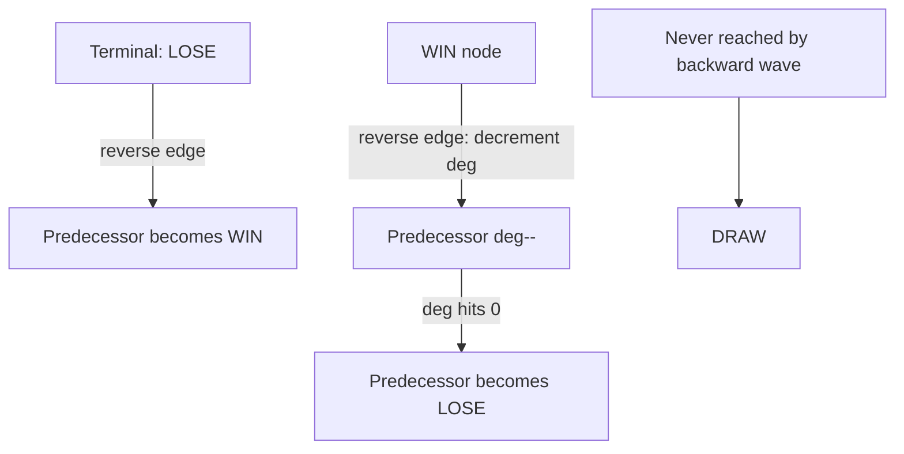

# Games on Graphs (Win / Lose / Draw on a Position Graph) — Junior Level

> **One-line summary:** Model a two-player game as a directed graph of positions; a position is **LOSE** (for the player to move) if *every* move leads to a WIN for the opponent, **WIN** if *some* move leads to a LOSE position for the opponent, and **DRAW** if play can be forced to continue forever (a cycle with no escape to LOSE). On an acyclic game graph a simple recursive memo solves it; on a cyclic graph you need **retrograde analysis** (backward BFS over reverse edges with out-degree counters).

---

## Table of Contents

1. [Introduction](#introduction)
2. [Prerequisites](#prerequisites)
3. [Glossary](#glossary)
4. [Core Concepts](#core-concepts)
5. [Big-O Summary](#big-o-summary)
6. [Real-World Analogies](#real-world-analogies)
7. [Pros & Cons](#pros--cons)
8. [Step-by-Step Walkthrough](#step-by-step-walkthrough)
9. [Code Examples](#code-examples)
10. [Coding Patterns](#coding-patterns)
11. [Error Handling](#error-handling)
12. [Performance Tips](#performance-tips)
13. [Best Practices](#best-practices)
14. [Edge Cases & Pitfalls](#edge-cases--pitfalls)
15. [Common Mistakes](#common-mistakes)
16. [Cheat Sheet](#cheat-sheet)
17. [Visual Animation](#visual-animation)
18. [Summary](#summary)
19. [Further Reading](#further-reading)

---

## Introduction

Two players sit at a board. They alternate moves. Whoever cannot move (or reaches some agreed terminal position) loses — or maybe the rules say the player who *makes* the last move wins. Either way, a natural question screams out: *from this exact position, with me to move, can I force a win no matter how cleverly my opponent plays?*

The beautiful answer is that a huge family of these games — Nim, checkers endgames, pursuit/chase games on a grid, token-removal games, simple board puzzles — can all be turned into the **same** abstract object: a **directed graph of positions**. Each vertex is one game position (the full state: board + whose turn it is). Each directed edge `u → v` means "from `u`, the player to move can legally move to `v`." Solving the game means labeling every vertex with one of three outcomes under *optimal play from both sides*:

> **WIN** — the player to move can force a win.
> **LOSE** — the player to move will lose no matter what (the opponent can force the win).
> **DRAW** — neither side can force a win; with best play the game goes on forever (or by rule ends in a tie).

The labeling rule is short and unforgettable:

- A position with **no moves** is a terminal. By the usual "can't move ⇒ you lose" convention, a terminal is **LOSE** for the player to move.
- A position is **WIN** if it has *at least one* move to a **LOSE** position (you push the opponent into the losing seat).
- A position is **LOSE** if *every* move leads to a **WIN** position (whatever you do, the opponent then wins).
- Anything left over — positions that can dodge forever by staying on a cycle, never forced into a LOSE — is **DRAW**.

If the game graph is **acyclic** (a DAG — positions strictly "shrink", like piles only ever getting smaller), this is delightfully easy: just a recursive function with memoization (topic family `13-dynamic-programming`). But the moment the graph has **cycles** — positions that can repeat, players that can shuffle pieces back and forth — naive recursion breaks. It either loops forever or, worse, silently mislabels DRAW positions. The fix is **retrograde analysis**: start from the terminals and propagate outcomes *backward* along reversed edges, using an out-degree counter per node to detect "all my moves lead to WIN." Whatever the backward pass never reaches is a DRAW.

This file builds the acyclic case first (so the logic is crystal clear), then motivates why cycles demand the retrograde technique, which `middle.md` develops in full.

---

## Prerequisites

Before reading this file you should be comfortable with:

- **Directed graphs** — vertices, directed edges, adjacency lists. See sibling `11-graphs/01-representation`.
- **BFS / queue processing** — retrograde analysis is a backward BFS from terminals.
- **Recursion and memoization** — the acyclic solution is a memoized DFS (this whole section, `13-dynamic-programming`).
- **In-degree / out-degree** — the counter trick uses each node's out-degree (number of moves available).
- **Two-player turn-taking games** — the idea that players alternate and each plays optimally for themselves.
- **Big-O notation** — `O(V + E)` is the target complexity.

Optional but helpful:

- A glance at **Nim and Grundy numbers** (sibling topic `15` on Sprague-Grundy theory). Win/lose labeling is the *win-or-lose* shadow of Grundy theory; Grundy generalizes it to sums of games. We contrast the two below.
- Familiarity with **topological order** for the DAG case.

---

## Glossary

| Term | Meaning |
|------|---------|
| **Position / state** | A full snapshot of the game *including whose turn it is*. One vertex of the game graph. |
| **Move edge `u → v`** | The player to move at `u` can legally produce position `v` (where it is now the opponent's turn). |
| **Terminal position** | A position with no legal moves (out-degree 0). By the standard "stuck ⇒ lose" rule it is **LOSE**. |
| **WIN (N-position)** | The **N**ext player (the one to move) can force a win. Some move leads to a LOSE child. |
| **LOSE (P-position)** | The **P**revious player wins; the player to move loses. *All* moves lead to WIN children. |
| **DRAW** | No forced win for either side; play can continue forever on a cycle. Never reached by the backward pass. |
| **Retrograde analysis** | Solving by propagating outcomes *backward* from terminals over reversed edges, with out-degree counters. |
| **Out-degree counter** | Per node, the number of moves not yet known to lead to a WIN; when it hits 0 the node is LOSE. |
| **Reverse edge** | If `u → v` is a move, the reverse edge `v → u` is used to push `v`'s outcome back to its predecessors. |
| **Optimal play** | Each player always chooses the move best for themselves (win if possible, else draw, else delay the loss). |
| **DAG** | Directed Acyclic Graph — no cycles; the easy case solvable by memoized DFS. |
| **Distance-to-win / mate-in-k** | The minimum number of moves to force the win (or maximum to delay the loss). |

---

## Core Concepts

### 1. A Game Is a Directed Graph of Positions

Pick any two-player, perfect-information, no-chance game. Make a vertex for every reachable position (board configuration **plus** whose turn). Draw an edge `u → v` whenever the mover at `u` has a legal move producing `v`. The mover *alternates*, so an edge always flips whose turn it is — but we encode that flip inside the position itself, so we never have to track "whose turn" separately as we walk the graph. Each vertex's label (WIN / LOSE / DRAW) is from the viewpoint of **the player whose turn it is at that vertex**.

### 2. The Labeling Rules (the heart of everything)

```
terminal (no moves)         => LOSE     (you are stuck; you lose)
some move to a LOSE child   => WIN      (push opponent into the losing seat)
all moves to WIN children   => LOSE     (everything you try, opponent then wins)
otherwise (stuck in cycles) => DRAW     (can avoid losing forever, can't force a win)
```

Read those four lines until they are reflex. They are the entire theory. Everything else is *how to compute them efficiently*, especially when cycles make the "otherwise" case real.

### 3. The Acyclic Case: Simple Memoized Recursion

If the game graph is a DAG (positions strictly progress — piles shrink, tokens are removed and never added), there are **no draws**: every play eventually hits a terminal, so every position is WIN or LOSE. You can compute the label with a memoized DFS that directly implements the rule:

```
solve(u):
    if u already memoized: return memo[u]
    if u has no moves: memo[u] = LOSE; return LOSE
    for each move u -> v:
        if solve(v) == LOSE:        # found a child that loses for the opponent
            memo[u] = WIN; return WIN
    memo[u] = LOSE                  # every child was WIN
    return LOSE
```

This is `O(V + E)`: each vertex resolved once, each edge examined once. Clean and correct — **as long as there are no cycles**.

### 4. Why Cycles Break Naive DFS

Suppose position `A` can move to `B`, and `B` can move back to `A` (a 2-cycle), plus `A` can move to a terminal `T` (which is LOSE). Try `solve(A)`:

- `solve(A)` explores move `A → B`, so it calls `solve(B)`.
- `solve(B)` explores move `B → A`, so it calls `solve(A)` — which is **still being computed**. We are in an infinite recursion (or, if you guard against re-entry, you get a *wrong* answer because `A`'s outcome isn't known yet).

The deeper problem: a DRAW is exactly "I can keep cycling forever and never be forced to lose." A memoized DFS has no clean way to express "the answer is *neither* WIN nor LOSE because we can loop." It computes WIN/LOSE under the false assumption that the game always ends. On cyclic graphs that assumption is wrong, and the result is garbage for the cycle-trapped positions.

### 5. The Fix: Retrograde Analysis (Backward BFS)

Instead of asking "what can I reach from `u`?" (forward), retrograde analysis asks "who can reach a position whose outcome I just learned?" (backward). We:

1. Reverse every edge: build `rev[v] = {u : u → v}`.
2. Give each node `u` a counter `deg[u]` = its number of outgoing moves (out-degree).
3. Initialize: every terminal is **LOSE**; push it on a queue.
4. Pop a solved node `v`. For each predecessor `u` (via reverse edges):
   - If `v` is **LOSE**, then `u` has a move into a LOSE child ⇒ `u` is **WIN**. Label and enqueue it (if not already labeled).
   - If `v` is **WIN**, then one of `u`'s moves is "used up" — decrement `deg[u]`. If `deg[u]` hits 0, *every* move of `u` led to WIN ⇒ `u` is **LOSE**. Label and enqueue it.
5. When the queue empties, any node **still unlabeled** is a **DRAW**.

That last line is the magic: draws are precisely the nodes the backward wave never reached, because they can always sidestep onto a cycle. No infinite loops, `O(V + E)` total, and it correctly produces all three labels.

### 6. WIN / LOSE / DRAW Under Optimal Play

The labels assume both players play optimally:

- A WIN player picks the move that lands the opponent in a LOSE position.
- A LOSE player is doomed but plays on (no choice changes the verdict).
- A DRAW player, given the choice between "lose" and "draw forever," chooses to draw — so they steer toward the cycle and avoid any move that would hand the opponent a win.

This preference order — **win > draw > lose** — is exactly what the retrograde rules encode.

---

## Big-O Summary

| Operation | Time | Space | Notes |
|-----------|------|-------|-------|
| Acyclic game, memoized DFS | **O(V + E)** | O(V + E) | Each vertex once, each edge once. No draws possible. |
| Retrograde analysis (cyclic OK) | **O(V + E)** | O(V + E) | Backward BFS; reverse edges + out-degree counters. |
| Building the reverse graph | O(V + E) | O(V + E) | One pass over all edges. |
| Distance-to-win (BFS layers) | O(V + E) | O(V + E) | Same pass, track move count. |
| Label one position (after solve) | O(1) | — | Just read the stored label. |

The headline number is **`O(V + E)`** — linear in the size of the position graph. The catch is that `V` (the number of positions) can be astronomically large for real games; that scaling problem is the subject of `senior.md`.

---

## Real-World Analogies

| Concept | Analogy |
|---------|---------|
| Position graph | A giant flowchart of every possible board state; arrows are legal moves. |
| Terminal = LOSE | You're cornered with no legal move — like being checkmated or having no pieces to play; you lose. |
| WIN position | You see a move that traps your opponent in a hopeless spot — you take it. |
| LOSE position | Every door you open leads to a room where the opponent wins; you're sunk. |
| DRAW | Two boxers circling forever — neither can land the knockout, so it never ends (or it's called a tie). |
| Retrograde analysis | Solving a maze by starting at the exit(s) and flooding backward to mark which cells can reach an exit. |
| Out-degree counter | Crossing off your options one by one; when all are crossed off as "bad," you know you've lost. |
| Endgame tablebase | A pre-computed cheat sheet listing the verdict for every endgame position (e.g., King+Rook vs King). |

Where the analogy breaks: a maze flood-fill marks "reachable / not"; here we need the subtler **WIN needs one good child, LOSE needs all bad children** asymmetry, which is exactly why the out-degree counter exists.

---

## Pros & Cons

| Pros | Cons |
|------|------|
| Linear `O(V + E)` — optimal for the size of the position graph. | `V` can be enormous; the whole graph may not fit in memory for real games. |
| Correctly handles **cycles and draws**, which naive DFS cannot. | Requires building the **reverse** graph (extra memory and a pass). |
| One uniform algorithm solves Nim-like, pursuit, and endgame puzzles. | Needs the game to be **deterministic, perfect-information, two-player**; chance/hidden info break it. |
| Naturally extends to **distance-to-win** (mate-in-k) with BFS layering. | Positions must be enumerable and encodable as integer indices. |
| No floating point, no overflow — pure discrete labeling. | The acyclic shortcut (memo DFS) silently fails if you wrongly assume no cycles. |

**When to use:** any two-player, alternating, perfect-information, deterministic game with a finite position space you can enumerate — token games, pursuit on a board, endgame analysis, "last to move wins/loses" puzzles.

**When NOT to use:** games with chance (dice), hidden information (cards), more than two players, or position spaces too large to enumerate without abstraction (then you need search + heuristics, not exact labeling).

---

## Step-by-Step Walkthrough

Take this tiny game with 5 positions `{0, 1, 2, 3, 4}` and these moves (edges `u → v`):

```
0 → 1
0 → 2
1 → 3        (3 is a terminal: no outgoing moves)
2 → 1        (back-pointer creating a cycle 1 → ... no; see below)
2 → 4
4 → 2        (cycle: 2 → 4 → 2)
```

Out-degrees: `deg[0]=2, deg[1]=1, deg[2]=2, deg[3]=0, deg[4]=1`. Reverse edges:

```
rev[1] = {0, 2}
rev[2] = {0, 4}
rev[3] = {1}
rev[4] = {2}
```

**Step 1 — find terminals.** Only `3` has out-degree 0. Label `3 = LOSE`. Queue: `[3]`.

**Step 2 — process `3` (LOSE).** Its predecessors are `rev[3] = {1}`. Since `3` is LOSE, every predecessor with a move into `3` is WIN. So `1 = WIN`. Enqueue `1`. Queue: `[1]`.

**Step 3 — process `1` (WIN).** Predecessors `rev[1] = {0, 2}`. Since `1` is WIN, those moves are "bad"; decrement their counters:
- `deg[0]: 2 → 1` (not zero, `0` stays unlabeled).
- `deg[2]: 2 → 1` (not zero, `2` stays unlabeled).
Queue empties of `1`. Queue: `[]`.

**Step 4 — queue empty.** Nodes still unlabeled: `0, 2, 4`. They are all **DRAW**.

**Sanity check by hand:**
- `2 → 4 → 2` is a cycle with no escape to a LOSE position (the only LOSE is `3`, unreachable from `2` except via `1` which is WIN). So from `2`, the mover can avoid losing by cycling forever, but cannot force a win ⇒ **DRAW**. ✓
- `4`'s only move is to `2` (DRAW), so `4` is **DRAW** too. ✓
- `0` can move to `1` (WIN for opponent — bad) or `2` (DRAW). Best is to move to `2` and draw, so `0` is **DRAW**. ✓

Final labels: `0=DRAW, 1=WIN, 2=DRAW, 3=LOSE, 4=DRAW`. Notice a naive DFS starting at `0` and following `0 → 2 → 4 → 2 → 4 → …` would loop forever. Retrograde analysis never does — it only ever moves backward from *solved* nodes, and the draws simply fall out as "never reached."

---

## Code Examples

### Example: Label Every Position WIN / LOSE / DRAW (retrograde analysis)

We represent the game by adjacency lists `moves[u]`. Outputs `0 = LOSE`, `1 = WIN`, `2 = DRAW`.

#### Go

```go
package main

import "fmt"

const (
	LOSE = 0
	WIN  = 1
	DRAW = 2
)

// solveGame labels every vertex by retrograde analysis. Works with cycles.
func solveGame(n int, moves [][]int) []int {
	rev := make([][]int, n) // reverse edges
	deg := make([]int, n)   // out-degree (remaining unresolved-as-loss moves)
	for u := 0; u < n; u++ {
		deg[u] = len(moves[u])
		for _, v := range moves[u] {
			rev[v] = append(rev[v], u)
		}
	}

	label := make([]int, n)
	known := make([]bool, n)
	queue := []int{}

	// terminals (no moves) are LOSE
	for u := 0; u < n; u++ {
		if deg[u] == 0 {
			label[u] = LOSE
			known[u] = true
			queue = append(queue, u)
		}
	}

	for len(queue) > 0 {
		v := queue[0]
		queue = queue[1:]
		for _, u := range rev[v] {
			if known[u] {
				continue
			}
			if label[v] == LOSE {
				// u has a move into a LOSE child => WIN
				label[u] = WIN
				known[u] = true
				queue = append(queue, u)
			} else { // label[v] == WIN
				deg[u]--
				if deg[u] == 0 {
					// all of u's moves led to WIN => LOSE
					label[u] = LOSE
					known[u] = true
					queue = append(queue, u)
				}
			}
		}
	}

	// anything not known is a DRAW
	for u := 0; u < n; u++ {
		if !known[u] {
			label[u] = DRAW
		}
	}
	return label
}

func main() {
	n := 5
	moves := [][]int{
		{1, 2}, // 0
		{3},    // 1
		{1, 4}, // 2
		{},     // 3 terminal
		{2},    // 4
	}
	label := solveGame(n, moves)
	names := []string{"LOSE", "WIN", "DRAW"}
	for u := 0; u < n; u++ {
		fmt.Printf("position %d: %s\n", u, names[label[u]])
	}
	// 0:DRAW 1:WIN 2:DRAW 3:LOSE 4:DRAW
}
```

#### Java

```java
import java.util.*;

public class GamesOnGraphs {
    static final int LOSE = 0, WIN = 1, DRAW = 2;

    static int[] solveGame(int n, List<List<Integer>> moves) {
        List<List<Integer>> rev = new ArrayList<>();
        for (int i = 0; i < n; i++) rev.add(new ArrayList<>());
        int[] deg = new int[n];
        for (int u = 0; u < n; u++) {
            deg[u] = moves.get(u).size();
            for (int v : moves.get(u)) rev.get(v).add(u);
        }

        int[] label = new int[n];
        boolean[] known = new boolean[n];
        ArrayDeque<Integer> queue = new ArrayDeque<>();

        for (int u = 0; u < n; u++) {
            if (deg[u] == 0) {
                label[u] = LOSE;
                known[u] = true;
                queue.add(u);
            }
        }

        while (!queue.isEmpty()) {
            int v = queue.poll();
            for (int u : rev.get(v)) {
                if (known[u]) continue;
                if (label[v] == LOSE) {
                    label[u] = WIN;
                    known[u] = true;
                    queue.add(u);
                } else { // WIN child
                    if (--deg[u] == 0) {
                        label[u] = LOSE;
                        known[u] = true;
                        queue.add(u);
                    }
                }
            }
        }

        for (int u = 0; u < n; u++)
            if (!known[u]) label[u] = DRAW;
        return label;
    }

    public static void main(String[] args) {
        int n = 5;
        List<List<Integer>> moves = Arrays.asList(
            Arrays.asList(1, 2),  // 0
            Arrays.asList(3),     // 1
            Arrays.asList(1, 4),  // 2
            Arrays.asList(),      // 3 terminal
            Arrays.asList(2)      // 4
        );
        int[] label = solveGame(n, moves);
        String[] names = {"LOSE", "WIN", "DRAW"};
        for (int u = 0; u < n; u++)
            System.out.println("position " + u + ": " + names[label[u]]);
    }
}
```

#### Python

```python
from collections import deque

LOSE, WIN, DRAW = 0, 1, 2


def solve_game(n, moves):
    rev = [[] for _ in range(n)]
    deg = [0] * n
    for u in range(n):
        deg[u] = len(moves[u])
        for v in moves[u]:
            rev[v].append(u)

    label = [DRAW] * n        # default DRAW; overwritten when resolved
    known = [False] * n
    queue = deque()

    for u in range(n):
        if deg[u] == 0:       # terminal => LOSE
            label[u] = LOSE
            known[u] = True
            queue.append(u)

    while queue:
        v = queue.popleft()
        for u in rev[v]:
            if known[u]:
                continue
            if label[v] == LOSE:          # move into a LOSE child => WIN
                label[u] = WIN
                known[u] = True
                queue.append(u)
            else:                         # WIN child: one move used up
                deg[u] -= 1
                if deg[u] == 0:           # all moves led to WIN => LOSE
                    label[u] = LOSE
                    known[u] = True
                    queue.append(u)

    # anything still unknown stays DRAW (already set)
    return label


if __name__ == "__main__":
    moves = [
        [1, 2],  # 0
        [3],     # 1
        [1, 4],  # 2
        [],      # 3 terminal
        [2],     # 4
    ]
    names = ["LOSE", "WIN", "DRAW"]
    for u, lab in enumerate(solve_game(5, moves)):
        print(f"position {u}: {names[lab]}")
    # 0:DRAW 1:WIN 2:DRAW 3:LOSE 4:DRAW
```

**What it does:** builds the reverse graph and out-degree counters, seeds terminals as LOSE, propagates backward, and leaves unreached nodes as DRAW.
**Run:** `go run main.go` | `javac GamesOnGraphs.java && java GamesOnGraphs` | `python games.py`

---

## Coding Patterns

### Pattern 1: Acyclic Memoized DFS (the easy case, as a baseline oracle)

**Intent:** When you *know* the graph is a DAG, the recursive memo is the simplest correct solver — and it doubles as a correctness oracle for small acyclic instances of the retrograde code.

```python
from functools import lru_cache

def solve_dag(moves):
    @lru_cache(maxsize=None)
    def win(u):
        # WIN if some child is a losing position for the opponent
        return any(not win(v) for v in moves[u])
    return win  # win(u) True => WIN, False => LOSE (no draws in a DAG)
```

`any(not win(v) ...)` reads exactly as the rule: WIN iff some child is LOSE. With no children, `any(...)` is `False` ⇒ LOSE. Beware: on a *cyclic* graph this recurses forever — it only works on DAGs.

### Pattern 2: Terminal Detection

**Intent:** Terminals are the seeds of the whole backward pass. A terminal is any node with out-degree 0. (If your rules say "no moves ⇒ you *win*", flip the seed label — see Edge Cases.)

### Pattern 3: The Out-Degree Counter

**Intent:** The asymmetry "WIN needs one LOSE child, LOSE needs all WIN children" is captured by counting down each node's moves. A LOSE child instantly makes a predecessor WIN; a WIN child only decrements, and the predecessor becomes LOSE only when the counter reaches 0.



---

## Error Handling

| Error | Cause | Fix |
|-------|-------|-----|
| Infinite recursion / stack overflow | Used memoized DFS on a graph with cycles. | Use retrograde analysis (backward BFS), not forward DFS, when cycles are possible. |
| All cycle nodes wrongly labeled WIN or LOSE | Treated "unresolved" as a definite outcome. | Leave unreached nodes as DRAW; only label via the backward rules. |
| Out-of-bounds vertex index | A move points to a non-existent position. | Validate that every `v` in `moves[u]` is in `[0, n)` before solving. |
| Decrementing already-resolved node | Pushing into a predecessor that's already labeled. | Skip predecessors with `known[u] == true`. |
| Wrong terminal label | Game rule is "no move ⇒ win", but coded as LOSE. | Set the terminal seed label to match the actual rule. |
| Reverse graph missing edges | Built `rev` from a stale/partial edge list. | Build `rev` in the same pass that computes `deg`. |

---

## Performance Tips

- **Build `rev` and `deg` in one pass** over all edges — don't scan the graph twice.
- **Use a plain queue (BFS)**, not a recursive DFS, for retrograde analysis; it avoids stack-depth limits on huge graphs.
- **Index positions as integers** `0..V-1`. Encode the game state into a compact integer (see `senior.md`) so arrays, not hash maps, hold the labels — far faster.
- **Skip known predecessors early** (`if known[u]: continue`) to avoid redundant work.
- **Don't materialize draws** — initialize the label array to DRAW and only overwrite when you resolve a node; the leftover DRAWs cost nothing.
- **Reuse the out-degree array as the live counter** — no separate "remaining moves" structure needed.

---

## Best Practices

- Decide and document the terminal convention up front: does "no legal move" mean LOSE (normal play) or WIN (misère)? Everything hinges on this seed.
- Encode "whose turn it is" *inside* the position so the graph is a plain directed graph; never track turn separately while walking edges.
- Always test the retrograde solver against the memoized-DFS oracle on small **acyclic** instances (where both must agree exactly).
- Construct a small **cyclic** test by hand (like the 5-node example) and verify the DRAW labels match your manual analysis.
- Keep WIN/LOSE/DRAW as named constants, never bare `0/1/2` literals scattered in code.
- Separate "build graph", "solve", and "query" into distinct functions so each is testable.

---

## Edge Cases & Pitfalls

- **Self-loop `u → u`** — a move to yourself. It is a cycle of length 1; it contributes to `deg[u]` and can produce a DRAW if it's the only way to avoid losing.
- **Misère convention** ("the player who *can't* move *wins*") — flip the terminal seed: terminals become WIN, and the rest of the logic is unchanged.
- **Multiple terminals** — seed *all* out-degree-0 nodes as LOSE before starting the BFS.
- **Disconnected positions** — positions unreachable from your start still get labeled; the algorithm processes the whole graph, which is fine (just possibly wasteful).
- **A position that is both on a cycle and can reach a LOSE** — it becomes WIN (the reachable LOSE wins immediately); the cycle only matters when *no* winning move exists.
- **Already-known predecessor** — never re-decrement or re-label a resolved node; that double-counts and corrupts the result.
- **Empty graph / single terminal** — a lone position with no moves is simply LOSE; trivial but worth a unit test.

---

## Common Mistakes

1. **Using forward memoized DFS on a cyclic game** — loops forever or mislabels draws. Cycles ⇒ retrograde analysis.
2. **Forgetting the DRAW bucket** — treating every node as eventually WIN or LOSE; the unreached nodes are draws.
3. **Mixing up the asymmetry** — coding "LOSE if some child is LOSE" (wrong) instead of "WIN if some child is LOSE." WIN needs *one* good child; LOSE needs *all* bad children.
4. **Wrong terminal label** — seeding terminals as WIN under normal play (should be LOSE). One flipped seed inverts the whole answer.
5. **Re-processing resolved nodes** — decrementing or relabeling a node already in `known`, double-counting moves.
6. **Forgetting to reverse edges** — propagating along forward edges instead of reverse edges; the backward wave needs predecessors.
7. **Confusing labels with Grundy numbers** — WIN/LOSE is the 2-outcome shadow; Grundy (topic 15) computes a *number* for combining independent games. They answer different questions.

---

## Cheat Sheet

| Situation | Label |
|-----------|-------|
| No legal moves (terminal, normal play) | **LOSE** |
| Some move leads to a LOSE position | **WIN** |
| All moves lead to WIN positions | **LOSE** |
| Can avoid LOSE forever via a cycle, can't force a win | **DRAW** |
| No legal moves (misère convention) | **WIN** (flip the seed) |

Core algorithm (retrograde analysis):

```
solve(moves):
    build rev[], deg[] (deg[u] = out-degree of u)
    queue = all u with deg[u]==0; label them LOSE
    while queue not empty:
        v = pop
        for u in rev[v]:
            if u known: continue
            if label[v]==LOSE: label[u]=WIN; enqueue u
            else: deg[u]--; if deg[u]==0: label[u]=LOSE; enqueue u
    every unlabeled u => DRAW
# cost: O(V + E)
```

Decision: **acyclic ⇒ memoized DFS** (no draws); **cyclic ⇒ retrograde analysis** (draws possible).

---

## Visual Animation

> See [`animation.html`](./animation.html) for an interactive visualization.
>
> The animation demonstrates:
> - Terminal positions seeded as **LOSE** first.
> - The backward BFS over **reverse edges**, turning predecessors into WIN (on seeing a LOSE child) or decrementing their out-degree counter.
> - A node flipping to **LOSE** the moment its counter reaches 0 (all moves led to WIN).
> - Leftover, never-reached nodes settling into **DRAW**.
> - Step / Run / Reset controls to watch the wave propagate one node at a time.

---

## Summary

A two-player, perfect-information, deterministic game becomes a **directed graph of positions**, and "who wins from here under optimal play" becomes a labeling: **LOSE** at terminals, **WIN** if some move reaches a LOSE child, **LOSE** if every move reaches a WIN child, and **DRAW** for whatever can dodge forever on a cycle. If the graph is acyclic, a memoized DFS solves it in `O(V + E)` with no draws. If the graph has cycles, naive DFS loops or lies; the correct tool is **retrograde analysis** — seed terminals, propagate outcomes backward over reversed edges using per-node out-degree counters, and declare every node the backward wave never reached a **DRAW**. The whole thing runs in `O(V + E)`. Master the four labeling lines and the out-degree-counter trick, and you can solve token games, pursuit games, and endgame puzzles exactly.

---

## Further Reading

- *Winning Ways for Your Mathematical Plays* (Berlekamp, Conway, Guy) — the combinatorial game theory bible.
- cp-algorithms.com — "Games on arbitrary graphs" (retrograde analysis with out-degree counters).
- Sibling topic `15` (Sprague-Grundy / Nim) — how WIN/LOSE generalizes to Grundy numbers for *sums* of games.
- Sibling topic `11-graphs/01-representation` — building adjacency and reverse-adjacency lists.
- *Introduction to Algorithms* (CLRS) — BFS and graph traversal foundations.
- Wikipedia: "Endgame tablebase" — the real-world application to chess and checkers.
