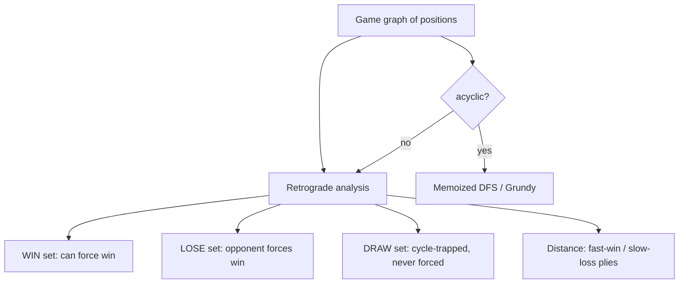

# Games on Graphs (Win / Lose / Draw) — Middle Level

> **Focus:** The retrograde-analysis algorithm in full — reverse edges plus out-degree counters, why it is the correct fixpoint for cyclic game graphs, how to compute **distance-to-win** (fast win, slow loss), and how this contrasts with naive DFS memoization, DAG game DP, and Sprague-Grundy theory.

---

## Table of Contents

1. [Introduction](#introduction)
2. [Deeper Concepts](#deeper-concepts)
3. [The Retrograde Analysis Algorithm](#the-retrograde-analysis-algorithm)
4. [Distance to Win / Lose (Optimal Fast-Win, Slow-Loss)](#distance-to-win--lose-optimal-fast-win-slow-loss)
5. [Comparison with Alternatives](#comparison-with-alternatives)
6. [Advanced Patterns](#advanced-patterns)
7. [Code Examples](#code-examples)
8. [Error Handling](#error-handling)
9. [Performance Analysis](#performance-analysis)
10. [Best Practices](#best-practices)
11. [Visual Animation](#visual-animation)
12. [Summary](#summary)

---

## Introduction

At junior level the message was the four labeling rules and the observation that cycles break naive recursion. At middle level you implement the real algorithm and understand *why* it is correct, plus the engineering questions that decide whether your solver is right and useful:

- Why exactly does propagating backward from terminals with out-degree counters compute the correct WIN/LOSE/DRAW labels, even on graphs full of cycles?
- How do you also recover *how fast* the win can be forced (and how long the loss can be delayed) — the "mate-in-k" / distance information?
- When is the acyclic memoized DP enough, and when must you reach for retrograde analysis?
- How does this relate to Sprague-Grundy theory (topic 15), and why is WIN/LOSE the *coarse* version of the Grundy number?
- What changes for the misère convention, for self-loops, and for graphs where draws dominate?

These distinguish "I can recite the rules" from "I can build a correct, fast, distance-aware game solver."

---

## Deeper Concepts

### The labeling as a least-fixpoint

Define three sets we are trying to fill: `WIN`, `LOSE`, `DRAW`. The labeling is the **least fixpoint** of these monotone rules, starting from the empty sets and adding nodes:

```
u ∈ LOSE   if  out-degree(u) = 0,  OR  every move u→v has v ∈ WIN
u ∈ WIN    if  some move u→v has v ∈ LOSE
u ∈ DRAW   if  u is in neither WIN nor LOSE after the rules stabilize
```

We add nodes to WIN/LOSE only when *forced* by the rules. We never *guess*. A node stays out of WIN and LOSE precisely when it can perpetually avoid being forced into LOSE — i.e., it can stay on a cycle forever — and that is exactly the definition of DRAW. Computing a least fixpoint of monotone rules is a textbook worklist algorithm, and retrograde analysis is that worklist specialized to game graphs. (The formal proof that this least fixpoint equals the game-theoretic optimal-play outcome is in `professional.md`.)

### Why "backward" and why out-degree counters

The forward question "what's the outcome of `u`?" depends on the outcomes of *all of `u`'s children*, which may not be known yet — and may depend cyclically on `u`. The backward question "now that I know `v`'s outcome, what does it force on `v`'s predecessors?" is well-founded because we only ever propagate *settled* facts. The two propagation rules are asymmetric, and the out-degree counter is what encodes the asymmetry:

- **A single LOSE child immediately settles a predecessor as WIN.** One good move is enough to win. So when `v` becomes LOSE, *every* predecessor `u` (that isn't already settled) becomes WIN at once.
- **A WIN child only counts against a predecessor.** It rules out one of `u`'s moves. `u` becomes LOSE only when *all* its moves have been ruled out — i.e., when its counter, initialized to its out-degree, reaches 0.

This is the entire trick. The counter lets us recognize "all children are WIN" incrementally, in `O(deg(u))` total work spread across the predecessors, instead of re-scanning all of `u`'s children every time one resolves.

### Draws are the un-forced nodes

After the worklist drains, the only nodes left unlabeled are those whose out-degree counter never hit 0 (they always had at least one not-yet-WIN move available) and which never had a LOSE child to grab. Such a node can always move to *some* child that is itself unforced — staying inside the unresolved region forever. That region is a set of strongly-connected, escape-free cycles, and every node in it is a DRAW. We never have to detect cycles explicitly; they reveal themselves as "the leftovers."

---

## The Retrograde Analysis Algorithm

The canonical pseudocode, annotated:

```
RETROGRADE(n, moves):
    rev  = reverse adjacency: rev[v] = { u : u→v ∈ moves }
    deg  = out-degree: deg[u] = |moves[u]|
    label[*] = UNKNOWN
    Q = empty queue

    # seed: terminals lose (normal play)
    for u in 0..n-1:
        if deg[u] == 0:
            label[u] = LOSE; Q.push(u)

    while Q not empty:
        v = Q.pop()
        for u in rev[v]:
            if label[u] != UNKNOWN: continue       # already settled
            if label[v] == LOSE:
                label[u] = WIN; Q.push(u)           # one losing child ⇒ WIN
            else: # label[v] == WIN
                deg[u] -= 1                          # rule out this move
                if deg[u] == 0:
                    label[u] = LOSE; Q.push(u)       # all moves bad ⇒ LOSE

    for u in 0..n-1:
        if label[u] == UNKNOWN: label[u] = DRAW      # never forced ⇒ DRAW
    return label
```

Three invariants make this correct:

1. **A node is enqueued at most once** (it is settled exactly when enqueued, and we skip settled predecessors). So the `while` loop runs `O(V)` pops.
2. **Each reverse edge is traversed once** (when its head `v` is popped). So total inner-loop work is `O(E)`.
3. **The counter `deg[u]` decrements once per WIN child** and is only consulted to detect the "all children WIN" condition. It never double-counts because we skip already-settled `u`.

Total: `O(V + E)` time, `O(V + E)` space.

### Worked trace

Run the algorithm on `moves = {0→1, 0→2, 1→3, 2→1, 2→4, 4→2}` (terminal `3`):

```
deg = [2,1,2,0,1]
rev[1]={0,2}, rev[2]={0,4}, rev[3]={1}, rev[4]={2}

seed: deg[3]==0 ⇒ label[3]=LOSE, queue=[3]
pop 3 (LOSE): rev[3]={1} ⇒ 1 has a LOSE child ⇒ label[1]=WIN, queue=[1]
pop 1 (WIN):  rev[1]={0,2} ⇒ deg[0]:2→1, deg[2]:2→1 (neither 0) ⇒ queue=[]
queue empty: 0,2,4 still unknown ⇒ all DRAW
```

Result `[DRAW, WIN, DRAW, LOSE, DRAW]`. The cycle `2 → 4 → 2` is never reached by a LOSE wave (the only LOSE is `3`, blocked behind WIN node `1`), so `2` and `4` draw; `0` draws because its best move is to `2` (a draw) rather than `1` (a win for the opponent). This is the "Cycle + terminal" preset in [`animation.html`](./animation.html).

---

## Distance to Win / Lose (Optimal Fast-Win, Slow-Loss)

Often you want more than the verdict: *how many moves* to force the win, assuming the winner wins **as fast as possible** and the loser delays **as long as possible**. This is the game-theoretic distance (the "mate-in-k" of chess tablebases).

The retrograde BFS already processes nodes in increasing distance order if we record a distance when we settle each node:

```
dist[u] = number of plies to the terminal under optimal play
```

The rule for `dist`:

- Terminal LOSE: `dist = 0`.
- A node settled as **WIN** because child `v` is LOSE: `dist[u] = dist[v] + 1`, and we should pick the child that becomes LOSE *earliest* — BFS naturally gives the smallest, because LOSE children are processed in increasing `dist` and the first one to reach `u` wins the race (fast win).
- A node settled as **LOSE** because its last move resolved to WIN: `dist[u] = 1 + max over children of dist[child]` — the loser delays maximally, so the distance is one more than the *slowest* (largest-distance) winning child. To compute the max correctly, track `dist[u]` as the running maximum of resolved children, and finalize it when the counter hits 0.

This "fast win, slow loss" asymmetry is the standard convention: the side that can win wants to win quickly; the side that must lose wants to postpone defeat. The implementation below records both label and distance in one pass.

### Why BFS order gives fast-win automatically

When `v` becomes LOSE with distance `d`, it is popped from the queue at "layer `d`". Every unsettled predecessor `u` becomes WIN with `dist[u] = d + 1` *at that moment*. If `u` had another LOSE child at a larger distance, that child is processed later, so `u` is already settled by the earlier (faster) one — we skip it. Hence WIN distances are minimized for free. For LOSE nodes we cannot use "first to arrive" because LOSE requires *all* children resolved; we instead carry the max and finalize at counter-zero.

### Worked distance example

On the chain `0 → 1 → 2 → 3` (3 terminal):

```
3 LOSE dist 0     (terminal)
2 WIN  dist 1     (succ 3 is LOSE; 1 + dist(3))
1 LOSE dist 2     (only succ 2 is WIN; counter→0; 1 + max{dist(2)})
0 WIN  dist 3     (succ 1 is LOSE; 1 + dist(1))
```

The labels alternate by parity of the distance to the terminal, and the distance is exactly the number of moves to the mate. The winner at `2` mates in 1; the loser at `1` is doomed but stalls for 2 plies; the winner at `0` mates in 3. The BFS settles them in order `3, 2, 1, 0` — non-decreasing distance — which is why the fast-win min comes for free. Try this in the [`animation.html`](./animation.html) "Forced chain" preset.

---

## Comparison with Alternatives

### Retrograde analysis vs naive DFS memoization

| Approach | Cyclic graphs | Draws | Time | Notes |
|----------|---------------|-------|------|-------|
| Forward memoized DFS | **Breaks** (infinite recursion / wrong) | cannot represent | `O(V+E)` on a DAG | Only valid when the graph is acyclic. |
| Forward DFS with "in-progress" guard | Detects cycles but mislabels | hacky | `O(V+E)` | Tempting but subtly wrong: a cycle node is not automatically a draw. |
| **Retrograde analysis (backward BFS)** | **Correct** | first-class | `O(V+E)` | The right tool whenever cycles are possible. |

The "in-progress guard" deserves a warning: people try to patch DFS by marking a node "in progress" and returning DRAW if they re-enter it. This is **wrong** in general, because a node on a cycle can still be a WIN (if it also has a move to a LOSE position) or even a LOSE. Whether a cycle node draws depends on the *global* fixpoint, not on the local "I saw it again." Only the backward propagation gets this right.

### DAG game DP vs general retrograde

| Property | DAG (acyclic) game DP | General game graph |
|----------|----------------------|--------------------|
| Draws | impossible (game always ends) | possible (cycles) |
| Method | memoized DFS / topological-order DP | retrograde analysis |
| Outcome set | {WIN, LOSE} | {WIN, LOSE, DRAW} |
| Why it works | every play strictly progresses to a terminal | terminals reachable backward; rest draw |
| Example | Nim-like pile games, subtraction games | pursuit games, position-repeating board games |

If you can *prove* the position graph is acyclic (e.g., every move strictly decreases a monotone potential like total tokens), the DAG DP is simpler and equally fast. If you cannot, use retrograde analysis — it is strictly more general and the same `O(V+E)`.

### WIN/LOSE/DRAW vs Sprague-Grundy (topic 15)

| Question | Tool | Output |
|----------|------|--------|
| Who wins this single game? | retrograde / DAG DP | WIN / LOSE / DRAW |
| Who wins a **sum** of independent games? | Sprague-Grundy (topic 15) | Grundy number (mex of children) |

Sprague-Grundy theory assigns each position a *Grundy number* `g(u) = mex{ g(v) : u→v }` (minimum excludant). A position is LOSE iff `g(u) = 0`. The XOR of the Grundy numbers of independent sub-games tells you the outcome of their sum — far more information than a single WIN/LOSE bit. **But Grundy theory requires the game graph to be acyclic** (a *finite, ending* game). On cyclic graphs the mex recursion does not converge, and the right notion is "loopy" combinatorial game theory with draw values. So:

- Acyclic, single game ⇒ either WIN/LOSE DP or Grundy (Grundy also handles sums).
- Acyclic, sum of games ⇒ Grundy is essential (XOR the values).
- Cyclic, single game ⇒ retrograde analysis (Grundy doesn't apply cleanly).

WIN/LOSE is the *2-valued shadow* of the Grundy number: `g(u)=0 ⟺ LOSE`, `g(u)>0 ⟺ WIN`, but the magnitude of `g` (needed for sums) is thrown away.

### A concrete Grundy-vs-outcome contrast

Take the subtraction game "remove 1 or 2 stones, last to move wins". Grundy values cycle `g(0,1,2,3,4,…) = 0,1,2,0,1,2,…`, so a pile is LOSE iff its size is a multiple of 3. The **outcome** solver (retrograde or DAG DP) reports exactly that LOSE pattern. But to solve *three independent piles* `(a, b, c)`, you need the Grundy values: the combined position is LOSE iff `g(a) ⊕ g(b) ⊕ g(c) = 0`. The bare WIN/LOSE bit per pile cannot tell you this — that extra information is precisely what Grundy carries and what makes it the right tool for sums. And it all hinges on acyclicity: the `mex` recursion only terminates because piles strictly shrink.

---

## Advanced Patterns

### Pattern: Misère convention (last to move loses)

Flip the seed: terminals (no move) become **WIN** instead of LOSE. The propagation rules are unchanged. Everything downstream inverts correctly because the only thing that defines the game is the terminal verdict plus the move structure.

### Pattern: Multiple terminal verdicts

Some games have terminals that are explicitly WIN (you reached the goal) and others explicitly LOSE (you got trapped). Seed each terminal with its given verdict, push all of them, and run. The algorithm handles a heterogeneous seed set without modification.

### Pattern: "Whose move" baked into the index

For a game where the same board can appear with either player to move, double the state space: index `(board, turn)`. An edge from `(board, A_to_move)` goes to `(board', B_to_move)`. This keeps the graph a plain directed graph and the labels unambiguous.

### Pattern: Pursuit / cop-and-robber as a game graph

A pursuit game (cop chases robber on a graph) is a game whose position is `(cop_pos, robber_pos, turn)`. The cop wins by landing on the robber (terminal WIN for the cop's relevant labeling); the robber wins/draws by evading forever (DRAW). Retrograde analysis on this product graph tells you exactly which start configurations the cop can force a capture from, and in how many moves. This is Challenge 4 in [`interview.md`](./interview.md).

### Pattern: Self-loops and "pass" moves

A "pass" move is an edge `u → u`. It counts toward `deg[u]` and appears in `rev[u]` like any edge. A position whose only escape from losing is to pass forever is a DRAW (it can never be forced to a LOSE child but can never reach one either). Do **not** special-case `u == v` out of the reverse graph; treat the self-loop as a genuine length-1 cycle and the fixpoint handles it. The common bug is filtering self-loops when building `rev`, which makes a pass-only node wrongly look like a terminal.

### Pattern: Detecting which algorithm to use

Before solving, decide: is the position graph provably acyclic? A monotone potential that strictly decreases every move (total stones, sum of coordinates toward a goal, remaining material) proves acyclicity ⇒ use memoized DFS (no draws). If positions can repeat (pieces shuffle, tokens move back and forth), assume cyclic ⇒ retrograde analysis. When in doubt, run a cycle check (DFS three-coloring or Kahn's topological sort); a graph that fails topological sort has a cycle and needs the backward pass.



---

## Code Examples

### Retrograde analysis with distance-to-win (fast-win / slow-loss)

This extends the junior solver to also return, for each WIN/LOSE node, the optimal number of plies to the terminal.

#### Go

```go
package main

import "fmt"

const (
	LOSE = 0
	WIN  = 1
	DRAW = 2
)

func solveWithDistance(n int, moves [][]int) (label []int, dist []int) {
	rev := make([][]int, n)
	deg := make([]int, n)
	for u := 0; u < n; u++ {
		deg[u] = len(moves[u])
		for _, v := range moves[u] {
			rev[v] = append(rev[v], u)
		}
	}

	label = make([]int, n)
	dist = make([]int, n)
	known := make([]bool, n)
	for i := range label {
		label[i] = DRAW
		dist[i] = -1
	}
	queue := []int{}

	for u := 0; u < n; u++ {
		if deg[u] == 0 {
			label[u], dist[u], known[u] = LOSE, 0, true
			queue = append(queue, u)
		}
	}

	for len(queue) > 0 {
		v := queue[0]
		queue = queue[1:]
		for _, u := range rev[v] {
			if known[u] {
				continue
			}
			if label[v] == LOSE {
				// fast win: first (smallest-dist) LOSE child settles u
				label[u], dist[u], known[u] = WIN, dist[v]+1, true
				queue = append(queue, u)
			} else { // WIN child
				deg[u]--
				if dist[v]+1 > dist[u] {
					dist[u] = dist[v] + 1 // slow loss: track max
				}
				if deg[u] == 0 {
					label[u], known[u] = LOSE, true
					queue = append(queue, u)
				}
			}
		}
	}
	return label, dist
}

func main() {
	moves := [][]int{
		{1, 2}, {3}, {1, 4}, {}, {2},
	}
	label, dist := solveWithDistance(5, moves)
	names := []string{"LOSE", "WIN", "DRAW"}
	for u := 0; u < 5; u++ {
		fmt.Printf("pos %d: %-4s dist=%d\n", u, names[label[u]], dist[u])
	}
}
```

#### Java

```java
import java.util.*;

public class RetrogradeDistance {
    static final int LOSE = 0, WIN = 1, DRAW = 2;

    static int[][] solve(int n, List<List<Integer>> moves) {
        List<List<Integer>> rev = new ArrayList<>();
        for (int i = 0; i < n; i++) rev.add(new ArrayList<>());
        int[] deg = new int[n];
        for (int u = 0; u < n; u++) {
            deg[u] = moves.get(u).size();
            for (int v : moves.get(u)) rev.get(v).add(u);
        }

        int[] label = new int[n], dist = new int[n];
        boolean[] known = new boolean[n];
        Arrays.fill(label, DRAW);
        Arrays.fill(dist, -1);
        ArrayDeque<Integer> q = new ArrayDeque<>();

        for (int u = 0; u < n; u++)
            if (deg[u] == 0) {
                label[u] = LOSE; dist[u] = 0; known[u] = true; q.add(u);
            }

        while (!q.isEmpty()) {
            int v = q.poll();
            for (int u : rev.get(v)) {
                if (known[u]) continue;
                if (label[v] == LOSE) {
                    label[u] = WIN; dist[u] = dist[v] + 1; known[u] = true; q.add(u);
                } else {
                    deg[u]--;
                    dist[u] = Math.max(dist[u], dist[v] + 1);
                    if (deg[u] == 0) { label[u] = LOSE; known[u] = true; q.add(u); }
                }
            }
        }
        return new int[][]{label, dist};
    }

    public static void main(String[] args) {
        List<List<Integer>> moves = Arrays.asList(
            Arrays.asList(1, 2), Arrays.asList(3),
            Arrays.asList(1, 4), Arrays.asList(), Arrays.asList(2));
        int[][] r = solve(5, moves);
        String[] names = {"LOSE", "WIN", "DRAW"};
        for (int u = 0; u < 5; u++)
            System.out.printf("pos %d: %-4s dist=%d%n", u, names[r[0][u]], r[1][u]);
    }
}
```

#### Python

```python
from collections import deque

LOSE, WIN, DRAW = 0, 1, 2


def solve_with_distance(n, moves):
    rev = [[] for _ in range(n)]
    deg = [0] * n
    for u in range(n):
        deg[u] = len(moves[u])
        for v in moves[u]:
            rev[v].append(u)

    label = [DRAW] * n
    dist = [-1] * n
    known = [False] * n
    q = deque()

    for u in range(n):
        if deg[u] == 0:
            label[u], dist[u], known[u] = LOSE, 0, True
            q.append(u)

    while q:
        v = q.popleft()
        for u in rev[v]:
            if known[u]:
                continue
            if label[v] == LOSE:                  # fast win
                label[u], dist[u], known[u] = WIN, dist[v] + 1, True
                q.append(u)
            else:                                 # WIN child
                deg[u] -= 1
                dist[u] = max(dist[u], dist[v] + 1)  # slow loss
                if deg[u] == 0:
                    label[u], known[u] = LOSE, True
                    q.append(u)

    return label, dist


if __name__ == "__main__":
    moves = [[1, 2], [3], [1, 4], [], [2]]
    label, dist = solve_with_distance(5, moves)
    names = ["LOSE", "WIN", "DRAW"]
    for u in range(5):
        print(f"pos {u}: {names[label[u]]:<4} dist={dist[u]}")
```

### Acyclic baseline via topological-order DP (oracle)

For a DAG you can also process in reverse topological order without reverse edges:

```python
def solve_dag_topo(moves):
    n = len(moves)
    from functools import lru_cache
    @lru_cache(maxsize=None)
    def win(u):
        return any(not win(v) for v in moves[u])  # WIN iff some child LOSE
    return [WIN if win(u) else LOSE for u in range(n)]
```

This must agree with `solve_with_distance` (ignoring distance) on every acyclic instance — a perfect property test.

---

## Error Handling

| Scenario | What goes wrong | Correct approach |
|----------|-----------------|------------------|
| Cyclic graph + DFS memo | Infinite recursion or mislabeled draws | Use retrograde backward BFS. |
| Treating cycle nodes as draws blindly | A cycle node with a LOSE move is actually WIN | Let the fixpoint decide; never hardcode "cycle ⇒ draw". |
| Re-decrementing a settled node | Double-counts moves, wrong LOSE timing | Skip `known[u]`. |
| Wrong distance for LOSE | Used first child instead of max | LOSE distance = `1 + max(child distances)`, finalize at counter 0. |
| Wrong distance for WIN | Used max instead of min | WIN distance = `1 + min(LOSE child distance)`; BFS gives this for free. |
| Misère seed not flipped | Whole answer inverted | Seed terminals WIN under misère. |
| Self-loop ignored | Out-degree wrong, draw logic off | Count self-loops in `deg`; they are legitimate cycle edges. |

---

## Performance Analysis

| Graph size (`V`, `E`) | Build rev+deg | Backward BFS | Total |
|-----------------------|---------------|--------------|-------|
| `V=10^3, E=10^4` | ~10^4 ops | ~10^4 ops | instant |
| `V=10^6, E=5·10^6` | ~5·10^6 ops | ~5·10^6 ops | well under a second |
| `V=10^7, E=5·10^7` | ~5·10^7 ops | ~5·10^7 ops | a few seconds; memory is the constraint |

The algorithm is `O(V + E)` — optimal, since you must at least look at every position and move once. The practical limit is **memory**: storing `moves`, `rev`, `deg`, `label`, `dist`, and `known` for `10^7`+ positions. The reverse graph roughly doubles edge storage. Senior-level work (`senior.md`) attacks exactly this: huge state spaces, on-the-fly successor generation, and disk-backed tablebases.

```python
# Quick scaling sanity: O(V+E) means runtime tracks total edges traversed once.
# Doubling E roughly doubles wall-clock. No log factors, no V^2 blowup.
```

The single biggest constant-factor decision is **integer-indexed arrays vs hash maps** for the per-position fields. Encoding positions as dense integers `0..V-1` and using flat arrays is dramatically faster (and more memory-compact) than `dict[state] -> label`.

A second lever is **queue choice**: a plain FIFO (`deque`/`ArrayDeque`/slice) is correct and gives the right fast-win distances for free. Do *not* reach for a priority queue — it adds a `log V` factor and buys nothing, because the BFS already settles vertices in non-decreasing distance. A third lever is avoiding the explicit `rev` array when successors are cheap to regenerate: in huge implicit graphs (see `senior.md`) you recompute predecessors on the fly instead of materializing them, trading CPU for memory.

---

## Best Practices

- **Choose the method by acyclicity:** provable DAG ⇒ memoized DFS / Grundy; possibly cyclic ⇒ retrograde analysis.
- **Build `rev` and `deg` together** in a single edge pass.
- **Initialize labels to DRAW** and only overwrite on resolution — draws then cost nothing extra.
- **Track distance in the same pass** when you need mate-in-k; fast-win is automatic from BFS order, slow-loss needs the running max finalized at counter 0.
- **Skip settled predecessors** to keep each enqueue at most once.
- **Test against the DAG topological oracle** on acyclic instances and against hand-computed labels on small cyclic instances.
- **Keep the terminal convention explicit** (normal vs misère) as a parameter, not a hardcoded constant.
- **Use a FIFO queue, not a priority queue** — the BFS already settles in distance order, so a heap only adds a wasted `log V` factor.
- **Encode `(board, turn)` as a dense integer** and use flat arrays for `label`, `deg`, `dist`, `known` — far faster and smaller than hash maps keyed by state objects.

---

## Visual Animation

> See [`animation.html`](./animation.html) for an interactive view.
>
> The middle-level animation highlights:
> - Terminals seeded as LOSE (distance 0), then the backward wave over reverse edges.
> - A predecessor flipping to WIN the instant a LOSE child is popped (fast-win distance shown).
> - Out-degree counters ticking down on WIN children, and a node turning LOSE exactly when its counter reaches 0.
> - Leftover cycle nodes settling as DRAW after the queue drains.

---

## Summary

Retrograde analysis is the correct, `O(V + E)` way to label a (possibly cyclic) two-player game graph with WIN / LOSE / DRAW. It works **backward** from terminals over reversed edges, using a per-node **out-degree counter** to capture the asymmetry — one LOSE child instantly makes a predecessor WIN, whereas a predecessor becomes LOSE only when *all* its moves have been ruled out (counter hits 0). Whatever the backward wave never reaches is a **DRAW**: those nodes can dodge forever on a cycle. The algorithm is exactly the least-fixpoint computation of the labeling rules, which is why it is correct where naive DFS memoization fails. The same BFS recovers **distance-to-win** under the fast-win / slow-loss convention (min over LOSE children for WIN, `1 + max` over children for LOSE). On provably acyclic graphs, the simpler memoized DFS (or Sprague-Grundy, topic 15, which also handles *sums* of acyclic games) suffices and produces no draws. Pick retrograde analysis the moment cycles are possible.

Two reflexes to internalize: (1) the WIN-needs-one / LOSE-needs-all asymmetry *is* the out-degree counter — one LOSE child flips a node WIN immediately, but a node only turns LOSE when its counter hits zero; (2) you never detect cycles or draws explicitly — initialize every label to DRAW, overwrite only on resolution, and the leftovers are exactly the draws. These two habits make the implementation short and correct.
