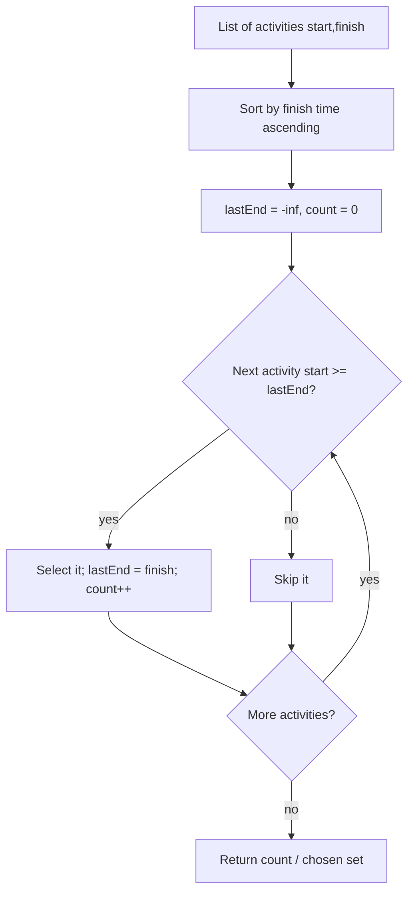

# Activity Selection — Junior Level

> **One-line summary:** The Activity Selection problem asks for the **maximum number of mutually non-overlapping activities** you can do, given each activity's start and finish time. The classic greedy solution: **sort by finish time, then repeatedly pick the next activity whose start is at or after the last chosen finish.** That single rule — *earliest finish first* — is provably optimal and runs in `O(n log n)`.

---

## Table of Contents

1. [Introduction](#introduction)
2. [Prerequisites](#prerequisites)
3. [Glossary](#glossary)
4. [Core Concepts](#core-concepts)
5. [Big-O Summary](#big-o-summary)
6. [Real-World Analogies](#real-world-analogies)
7. [Pros & Cons](#pros--cons)
8. [Step-by-Step Walkthrough](#step-by-step-walkthrough)
9. [Code Examples](#code-examples)
10. [Coding Patterns](#coding-patterns)
11. [Error Handling](#error-handling)
12. [Performance Tips](#performance-tips)
13. [Best Practices](#best-practices)
14. [Edge Cases & Pitfalls](#edge-cases--pitfalls)
15. [Common Mistakes](#common-mistakes)
16. [Cheat Sheet](#cheat-sheet)
17. [Visual Animation](#visual-animation)
18. [Summary](#summary)
19. [Further Reading](#further-reading)

---

## Introduction

Imagine a single lecture hall and a stack of room-booking requests. Each request wants the room for an interval — say `[1, 4)`, `[3, 5)`, `[0, 6)`, `[5, 7)`, and so on. The room can host only **one** activity at a time, so two requests that overlap cannot both be granted. Your job is to **accept as many requests as possible**. Not the longest ones, not the most important ones — simply the *largest count* of activities that fit without colliding.

The obvious first idea is to try every subset of requests, check whether each subset is conflict-free, and keep the biggest valid one. That works for five requests. It collapses immediately afterward: `n` requests have `2^n` subsets, so 40 requests already mean over a trillion subsets to inspect. You cannot enumerate them.

**Activity Selection** solves this with a *greedy* algorithm that is almost embarrassingly short:

1. **Sort the activities by finish time** (ascending).
2. Walk through the sorted list. **Always take the first activity.** After that, take an activity only if its **start time is `≥` the finish time of the activity you last took.**

That is the whole method. The single insight is the choice rule: among all activities still available, **the one that finishes earliest leaves the most room for everything that comes after it.** Finishing early is a gift to your future self. We will *prove* this is optimal in `professional.md` using an "exchange argument," but at the junior level you should build the intuition first and trust the rule by testing it.

This problem is the canonical introduction to greedy algorithms. It teaches the central greedy idea — *a locally optimal choice (earliest finish) leads to a globally optimal solution* — in its purest form. It is also the unweighted base case of a richer family: when activities carry weights/values and you want maximum total value (not maximum count), the greedy rule breaks and you need dynamic programming (Weighted Interval Scheduling), covered as a sibling topic.

---

## Prerequisites

Before reading this file you should be comfortable with:

- **Arrays / lists** — storing a collection of items and iterating over them.
- **Sorting** — what it means to sort by a key, and that a good comparison sort runs in `O(n log n)`. The sibling chapter `sorting-algorithms` covers this.
- **Intervals** — an activity is an interval `[start, finish)`; two intervals *overlap* if one starts before the other finishes.
- **Big-O notation** — `O(n log n)` for the sort, `O(n)` for the single scan.
- **Half-open vs closed intervals** — whether an activity ending exactly when another begins counts as a conflict. We use **half-open** `[s, f)`, so `finish == start` is *not* a conflict (back-to-back bookings are allowed).

Optional but helpful:

- A first taste of **greedy thinking** — making the choice that looks best right now and never reconsidering.
- The idea of a **proof of correctness** (you will meet the exchange argument in `professional.md`).

---

## Glossary

| Term | Meaning |
|------|---------|
| **Activity** | A task with a start time `s` and a finish time `f`, occupying the half-open interval `[s, f)`. |
| **Compatible / non-overlapping** | Two activities `i`, `j` are compatible if `f_i ≤ s_j` or `f_j ≤ s_i` — neither runs while the other does. |
| **Mutually compatible set** | A set of activities that are pairwise compatible — all can run on one resource. |
| **Earliest-finish-time (EFT) rule** | The greedy choice: among remaining compatible activities, pick the one with the smallest finish time. |
| **Greedy algorithm** | An algorithm that builds a solution by repeatedly making the locally optimal choice and never backtracking. |
| **Greedy-choice property** | The property that a globally optimal solution can be reached by greedy local choices. |
| **Optimal substructure** | After making the first greedy choice, the rest of the problem is a smaller instance of the same problem. |
| **Exchange argument** | A proof technique: transform any optimal solution into the greedy one without making it worse, proving greedy is optimal. |
| **Interval scheduling** | The general family of problems about choosing intervals; activity selection is "interval scheduling maximization." |
| **Weighted interval scheduling** | The variant where each activity has a value and you maximize total value — needs DP, not greedy. |
| **Last finish (`lastEnd`)** | A running variable holding the finish time of the most recently selected activity; the gate for the next pick. |

---

## Core Concepts

### 1. The Activity and What "Overlap" Means

Each activity is a pair `(start, finish)` with `start < finish`. We treat the interval as **half-open** `[start, finish)`. Two activities **overlap** (conflict) when their intervals intersect on more than a single touching point. Concretely, activity `A = [s_A, f_A)` and `B = [s_B, f_B)` are **compatible** exactly when

```
f_A ≤ s_B   OR   f_B ≤ s_A
```

If `A` finishes at time 4 and `B` starts at time 4, they are compatible — back-to-back is fine. If `B` started at 3.99 they would overlap. This boundary convention matters; decide it up front and keep it consistent.

### 2. The Greedy Choice: Earliest Finish Time

The heart of the algorithm is a single decision rule:

> **Among all activities that are still compatible with what you have chosen so far, select the one that finishes earliest.**

Why earliest *finish*, not earliest *start* or *shortest duration*? Because the finish time is the only thing that constrains the future. Once you have committed up to finish time `f`, every remaining choice only cares about *when the resource frees up*, which is `f`. The smaller `f` is, the more of the timeline remains open. Picking the earliest finisher keeps the maximum amount of future room available — and crucially, it never costs you anything, because any other compatible activity finishes later or equal, so swapping it in for the earliest finisher can only tighten the future.

### 3. Why Sorting by Finish Time Makes It `O(n)` After the Sort

If the activities are sorted by finish time ascending, then "the earliest-finishing remaining compatible activity" is simply *the next one in the list whose start is `≥ lastEnd`*. You never have to search; one linear scan suffices. So the algorithm is: sort once (`O(n log n)`), then sweep once (`O(n)`).

```
sort activities by finish ascending
lastEnd = -infinity
count = 0
for each activity (s, f) in sorted order:
    if s >= lastEnd:
        select it
        count += 1
        lastEnd = f
return count
```

### 4. Greedy-Choice Property and Optimal Substructure

Two properties make greedy work here:

- **Greedy-choice property** — there exists an optimal solution that includes the earliest-finishing activity. (Proof sketch: take any optimal solution; its first activity finishes no earlier than the earliest finisher; swap it for the earliest finisher — still valid, still the same size. Full proof in `professional.md`.)
- **Optimal substructure** — after choosing the earliest finisher `a₁`, the remaining problem is "select the maximum number of activities that start at or after `f(a₁)`," which is the *same problem* on a smaller set.

Together these guarantee the greedy sweep produces a maximum-size compatible set.

### 5. Counting vs Listing

The basic algorithm naturally produces both: the running `count` is the answer to "how many," and recording each selected activity gives you the actual schedule. Always be clear which the caller wants.

### 6. The Wrong Greedy Rules (and Why They Fail)

It is instructive to see that *other* greedy rules are wrong:

- **Earliest start time** fails: an activity `[0, 100)` starts earliest but blocks everything.
- **Shortest duration** fails: a short activity `[3, 4)` can straddle and block two longer compatible activities `[1, 3)` and `[4, 6)` — wait, those are fine; but `[2.9, 3.1)` blocks `[1, 3)` and `[3, 5)`.
- **Fewest conflicts** fails on carefully constructed inputs.

Only **earliest finish time** is provably optimal. Memorize that.

---

## Big-O Summary

| Step | Time | Space | Notes |
|------|------|-------|-------|
| Sort by finish time | `O(n log n)` | `O(1)`–`O(n)` | Dominant cost. In-place sort is `O(log n)` stack. |
| Single greedy scan | `O(n)` | `O(1)` | One pass, one running `lastEnd`. |
| **Total** | **`O(n log n)`** | **`O(1)` extra (besides the array)** | The sort dominates; the selection is linear. |
| If already sorted by finish | `O(n)` | `O(1)` | Skip the sort entirely. |
| Brute-force subset search (comparison) | `O(2^n · n)` | `O(n)` | Exponential — only for tiny `n` or testing. |

The takeaway: an exponential subset search collapses to a near-linear sort-then-sweep.

---

## Real-World Analogies

| Concept | Analogy |
|---------|---------|
| Maximizing activity count | A single conference room and many meeting requests; the facilities team wants to grant as many meetings as possible. |
| Earliest-finish-time rule | A receptionist who, whenever the room frees up, books the meeting that will *vacate the room soonest*, keeping the calendar maximally open. |
| `lastEnd` gate | The "room is free again at" sign on the door; the next booking must start at or after that time. |
| Sorting by finish | Reordering all requests on a board by *when they end*, top to bottom, so you can scan straight down. |
| Compatible activities | Two meetings that do not clash on the calendar. |
| Why not pick the longest/most important | A greedy clerk only cares about *count*; importance/value is a different problem (weighted scheduling). |
| Half-open intervals | A 9:00–10:00 booking and a 10:00–11:00 booking are fine — checkout time equals check-in time. |

Where the analogy breaks: a real receptionist juggles priorities and VIPs; pure activity selection ignores all of that and optimizes *only the number of accepted activities*. The moment value or priority enters, the simple greedy rule is no longer correct.

---

## Pros & Cons

| Pros | Cons |
|------|------|
| Optimal — provably yields the maximum count. | Optimizes *count only*; ignores activity value/weight/priority. |
| Simple: sort, then one linear scan. | Requires choosing the right key (finish time); other keys are wrong. |
| Fast: `O(n log n)`, `O(1)` extra space. | Half-open vs closed convention must be fixed and consistent. |
| Easy to extend to "list the schedule," not just count. | A single resource; multi-resource (room-coloring) is a different algorithm. |
| Online-friendly variant exists if input arrives sorted by finish. | Equal-finish ties need a deliberate tie-break (any is fine for count). |
| Canonical teaching example of the greedy-choice property. | Not applicable when you must minimize lateness or maximize weighted value. |

**When to use:** maximizing the number of non-overlapping tasks on one resource — meeting-room booking (count), choosing the most jobs a single machine can run, selecting the most non-conflicting TV programs to record on one tuner.

**When NOT to use:** when activities have values and you want max total value (use Weighted Interval Scheduling DP); when you have multiple resources and want to schedule *all* activities with the fewest resources (interval partitioning / min-rooms); when you must minimize maximum lateness (a different greedy by deadline).

---

## Step-by-Step Walkthrough

Take these 6 activities (0-indexed), each as `[start, finish)`:

```
A0 = [1, 4)
A1 = [3, 5)
A2 = [0, 6)
A3 = [5, 7)
A4 = [3, 8)
A5 = [5, 9)
```

**Step 1 — Sort by finish time ascending.**

```
finish:   4    5    6    7    8    9
          A0   A1   A2   A3   A4   A5
start:    1    3    0    5    3    5
```

(They already happen to be in finish order here.)

**Step 2 — Initialize.** `lastEnd = -∞`, `count = 0`, `chosen = []`.

**Step 3 — Sweep.**

| Activity | start | finish | start ≥ lastEnd? | Action | lastEnd after | count |
|----------|-------|--------|------------------|--------|---------------|-------|
| A0 | 1 | 4 | 1 ≥ −∞ ✅ | **select** | 4 | 1 |
| A1 | 3 | 5 | 3 ≥ 4 ❌ | skip | 4 | 1 |
| A2 | 0 | 6 | 0 ≥ 4 ❌ | skip | 4 | 1 |
| A3 | 5 | 7 | 5 ≥ 4 ✅ | **select** | 7 | 2 |
| A4 | 3 | 8 | 3 ≥ 7 ❌ | skip | 7 | 2 |
| A5 | 5 | 9 | 5 ≥ 7 ❌ | skip | 7 | 2 |

**Result: 2 activities — `{A0 = [1,4), A3 = [5,7)}`.**

Let us double-check by reasoning: A0 finishes earliest (4), so it is in some optimal solution. After 4, the earliest finisher that starts `≥ 4` is A3 (start 5, finish 7). After 7, nothing starts `≥ 7`. So the maximum is 2 — confirmed.

**A second example to cement the rule.** Activities `[1,3), [2,5), [4,7), [6,8)` sorted by finish:

| Activity | start | finish | start ≥ lastEnd? | Action | lastEnd | count |
|----------|-------|--------|------------------|--------|---------|-------|
| [1,3) | 1 | 3 | 1 ≥ −∞ ✅ | select | 3 | 1 |
| [2,5) | 2 | 5 | 2 ≥ 3 ❌ | skip | 3 | 1 |
| [4,7) | 4 | 7 | 4 ≥ 3 ✅ | select | 7 | 2 |
| [6,8) | 6 | 8 | 6 ≥ 7 ❌ | skip | 7 | 2 |

Answer: 2, namely `{[1,3), [4,7)}`. Notice that picking `[1,3)` over `[2,5)` (earliest finish) was the key — `[2,5)` would have blocked `[4,7)`.

---

## Code Examples

### Example: Maximum Number of Compatible Activities

We sort by finish time and sweep once, tracking `lastEnd`. All three programs print `2` for the 6-activity example above and also return the selected indices.

#### Go

```go
package main

import (
	"fmt"
	"sort"
)

// Activity is a half-open interval [Start, Finish).
type Activity struct {
	Start, Finish int
}

// selectActivities returns the indices (into the ORIGINAL slice) of a maximum
// set of mutually compatible activities, chosen by earliest finish time.
func selectActivities(acts []Activity) []int {
	n := len(acts)
	// Sort an index list by finish time so we can report original indices.
	order := make([]int, n)
	for i := range order {
		order[i] = i
	}
	sort.Slice(order, func(a, b int) bool {
		return acts[order[a]].Finish < acts[order[b]].Finish
	})

	chosen := []int{}
	lastEnd := -1 << 62 // -infinity
	for _, idx := range order {
		if acts[idx].Start >= lastEnd {
			chosen = append(chosen, idx)
			lastEnd = acts[idx].Finish
		}
	}
	return chosen
}

func main() {
	acts := []Activity{
		{1, 4}, {3, 5}, {0, 6}, {5, 7}, {3, 8}, {5, 9},
	}
	chosen := selectActivities(acts)
	fmt.Println("count =", len(chosen)) // 2
	for _, i := range chosen {
		fmt.Printf("  A%d = [%d,%d)\n", i, acts[i].Start, acts[i].Finish)
	}
}
```

#### Java

```java
import java.util.*;

public class ActivitySelection {
    // Returns indices (into the original array) of a maximum compatible set,
    // chosen by earliest finish time.
    static List<Integer> select(int[][] acts) {
        int n = acts.length;
        Integer[] order = new Integer[n];
        for (int i = 0; i < n; i++) order[i] = i;
        // Sort by finish time (acts[i][1]).
        Arrays.sort(order, (a, b) -> Integer.compare(acts[a][1], acts[b][1]));

        List<Integer> chosen = new ArrayList<>();
        long lastEnd = Long.MIN_VALUE;
        for (int idx : order) {
            if (acts[idx][0] >= lastEnd) {     // start >= lastEnd
                chosen.add(idx);
                lastEnd = acts[idx][1];        // lastEnd = finish
            }
        }
        return chosen;
    }

    public static void main(String[] args) {
        int[][] acts = {{1, 4}, {3, 5}, {0, 6}, {5, 7}, {3, 8}, {5, 9}};
        List<Integer> chosen = select(acts);
        System.out.println("count = " + chosen.size()); // 2
        for (int i : chosen)
            System.out.printf("  A%d = [%d,%d)%n", i, acts[i][0], acts[i][1]);
    }
}
```

#### Python

```python
def select_activities(acts):
    """acts: list of (start, finish). Returns indices (into the original list)
    of a maximum set of mutually compatible activities, by earliest finish."""
    # Sort indices by finish time so we can report original positions.
    order = sorted(range(len(acts)), key=lambda i: acts[i][1])
    chosen = []
    last_end = float("-inf")
    for idx in order:
        s, f = acts[idx]
        if s >= last_end:           # compatible with the last chosen
            chosen.append(idx)
            last_end = f
    return chosen


if __name__ == "__main__":
    acts = [(1, 4), (3, 5), (0, 6), (5, 7), (3, 8), (5, 9)]
    chosen = select_activities(acts)
    print("count =", len(chosen))   # 2
    for i in chosen:
        print(f"  A{i} = [{acts[i][0]},{acts[i][1]})")
```

**What it does:** sorts activities by finish time, then greedily takes each activity whose start is at or after the last selected finish.
**Run:** `go run main.go` | `javac ActivitySelection.java && java ActivitySelection` | `python activity.py`

---

## Coding Patterns

### Pattern 1: Sort by Finish, Sweep with `lastEnd`

**Intent:** The canonical form — one sort key (finish), one running gate (`lastEnd`).

```python
def max_activities(acts):
    acts = sorted(acts, key=lambda a: a[1])   # by finish
    count, last_end = 0, float("-inf")
    for s, f in acts:
        if s >= last_end:
            count += 1
            last_end = f
    return count
```

This is the version to reach for when you only need the **count**.

### Pattern 2: Preserve Original Indices

**Intent:** When the caller needs *which* activities were chosen, sort an index array, not the activities themselves.

```python
order = sorted(range(len(acts)), key=lambda i: acts[i][1])
```

Used in all three reference programs above so the output references `A0, A3, …`.

### Pattern 3: Verify Against Brute Force on Small Inputs

**Intent:** Trust but verify. Enumerate all subsets, keep compatible ones, take the largest — and compare to the greedy answer for `n ≤ ~18`.

```python
from itertools import combinations

def brute(acts):
    best = 0
    n = len(acts)
    for r in range(n, -1, -1):
        for comb in combinations(range(n), r):
            ok = True
            iv = sorted((acts[i] for i in comb))
            for a, b in zip(iv, iv[1:]):
                if a[1] > b[0]:    # overlap (half-open)
                    ok = False
                    break
            if ok:
                return r          # largest size found
    return best
```



---

## Error Handling

| Error | Cause | Fix |
|-------|-------|-----|
| Wrong (too-small) count | Sorted by **start** time instead of finish. | Sort by **finish** time ascending — the only provably optimal key. |
| Off-by-one: rejects back-to-back activities | Used `s > lastEnd` (strict) with half-open intervals. | Use `s >= lastEnd`; `finish == start` is compatible for `[s, f)`. |
| Off-by-one: accepts a 1-tick overlap | Used `s >= lastEnd` but intervals are meant to be **closed** `[s, f]`. | If closed, require `s > lastEnd`. Decide the convention and stay consistent. |
| `lastEnd` never updates | Forgot to set `lastEnd = finish` after selecting. | Update `lastEnd` on every selection. |
| Crash on empty input | No activities. | Return `0` / empty list for `n == 0`. |
| Reports sorted indices, caller expects originals | Sorted the activities array in place and lost identity. | Sort an index array (Pattern 2). |
| Negative or zero-length activity slips in | `start >= finish`. | Validate `start < finish`, or document behavior for degenerate intervals. |

---

## Performance Tips

- **The sort dominates.** Everything after it is one `O(n)` pass, so spend your optimization budget on the sort (or skip it if input is already finish-sorted).
- **Sort an index array only when you need identities.** If you only need the count, sort the activities directly to avoid an indirection.
- **Use a single `lastEnd` scalar.** No need for a set or stack of chosen activities to decide the next pick — only the most recent finish matters.
- **Avoid re-sorting in a loop.** If you call selection repeatedly on the same (growing) data, keep it sorted incrementally rather than sorting from scratch each time.
- **Integer times are fastest.** If times are integers, integer comparison beats floating-point and dodges rounding issues at the `finish == start` boundary.

---

## Best Practices

- Write the brute-force subset checker first and test the greedy against it on every random input with `n ≤ 18`. This instantly catches a wrong sort key or boundary bug.
- Document the interval convention (half-open `[s, f)` vs closed `[s, f]`) at the top of the function; pick `s >= lastEnd` or `s > lastEnd` accordingly.
- Sort by finish, and make the tie-break explicit (any tie-break is correct for the *count*; document it anyway).
- Decide up front whether the caller wants the *count* or the actual *schedule*, and return the right thing.
- Validate inputs: `start < finish`, and handle the empty list as `0`.
- Keep the greedy invariant in a comment: "`lastEnd` holds the finish time of the most recently selected activity; select iff `start >= lastEnd`."

---

## Edge Cases & Pitfalls

- **Empty input** — zero activities → answer `0`. Handle before the loop.
- **Single activity** — always selectable → answer `1`.
- **All identical intervals** — only one can be chosen → answer `1`.
- **Back-to-back activities** (`finish == next start`) — compatible under half-open `[s, f)`; make sure `>=` (not `>`) accepts them.
- **Fully nested intervals** — `[0, 10)` containing `[1, 2), [3, 4), …` — the long one finishes last, so the greedy correctly prefers the many short ones.
- **Ties on finish time** — multiple activities ending at the same time; any tie-break gives the same maximum *count*.
- **Closed vs half-open mismatch** — the single most common bug; a `>` vs `>=` mistake silently changes the answer on touching intervals.
- **Sorting by start (or duration)** — produces a valid but **non-optimal** set; it is the classic wrong-greedy trap.

---

## Common Mistakes

1. **Sorting by start time** — intuitive but wrong; an early-starting, late-finishing activity blocks everything.
2. **Sorting by shortest duration** — also wrong; a short middle activity can block two longer compatible ones.
3. **Using `>` instead of `>=`** (or vice versa) for the compatibility test — flips the answer on touching intervals.
4. **Forgetting to update `lastEnd`** — every selected activity must advance the gate.
5. **Mutating the activities array when the caller needs original indices** — sort an index array instead.
6. **Assuming greedy works for the *weighted* version** — it does not; max *value* needs DP.
7. **Not handling the empty list** — should return `0`, not crash or return garbage.

---

## Cheat Sheet

| Step | Operation |
|------|-----------|
| 1. Sort | Sort activities by **finish time** ascending. |
| 2. Init | `lastEnd = −∞`, `count = 0`. |
| 3. Sweep | For each `(s, f)` in order: if `s >= lastEnd`, select it, `count++`, `lastEnd = f`. |
| 4. Return | `count` (how many) and/or the selected set (which ones). |

Key facts:

```
greedy rule: earliest finish time first   (the only optimal key)
compatible:  f_A ≤ s_B  or  f_B ≤ s_A
select when: start >= lastEnd             (half-open [s, f))
complexity:  O(n log n) sort + O(n) sweep = O(n log n)
space:       O(1) extra
optimal by:  exchange argument (see professional.md)
NOT for:     weighted/value version → use DP (weighted interval scheduling)
```

Tiny verified examples:

```
[1,4),[3,5),[0,6),[5,7),[3,8),[5,9)   → 2   ({[1,4),[5,7)})
[1,3),[2,5),[4,7),[6,8)               → 2   ({[1,3),[4,7)})
all overlapping (e.g. 5 copies of [0,1)) → 1
n disjoint intervals                  → n
```

---

## Visual Animation

> See [`animation.html`](./animation.html) for an interactive visualization of Activity Selection.
>
> The animation demonstrates:
> - A timeline of activities drawn as horizontal bars
> - Sorting the bars by finish time
> - The greedy sweep with a moving `lastEnd` marker
> - Each activity highlighted green (selected) or grey (skipped) as the gate advances
> - A live count of selected activities and a comparison against a brute-force maximum for small inputs

---

## Summary

Activity Selection is the cleanest greedy algorithm there is. Given activities as intervals `[start, finish)` on a single resource, you want the maximum number that do not overlap. The recipe is two lines: **sort by finish time, then take every activity whose start is at or after the last selected finish.** Sorting costs `O(n log n)`, the sweep costs `O(n)`, and extra space is `O(1)`. The single idea that makes it work is *earliest finish time first* — finishing as soon as possible leaves the most room for future activities, and this local choice is provably globally optimal via an exchange argument. The traps are all small: sorting by the wrong key (start or duration), getting the `>` vs `>=` boundary wrong for touching intervals, forgetting to update `lastEnd`, and assuming the same greedy solves the *weighted* version (it does not — that needs DP). Master the four-step recipe — sort, init, sweep, return — and you have mastered the junior-level core of greedy interval scheduling.

---

## Further Reading

- Cormen, Leiserson, Rivest, Stein (*CLRS*), *Introduction to Algorithms*, §16.1 — "An activity-selection problem," the canonical treatment with the exchange-argument proof.
- Kleinberg & Tardos, *Algorithm Design*, §4.1 — interval scheduling and the "stay ahead" greedy proof.
- Sibling topic `weighted-interval-scheduling` — the value-weighted variant solved by dynamic programming.
- Sibling topic `interval-partitioning` — scheduling *all* intervals on the fewest resources (minimum rooms).
- The `greedy-algorithms` skill — the general greedy-choice/optimal-substructure framework that activity selection exemplifies.
- The `sorting-algorithms` chapter — the `O(n log n)` sort that dominates this algorithm's cost.
