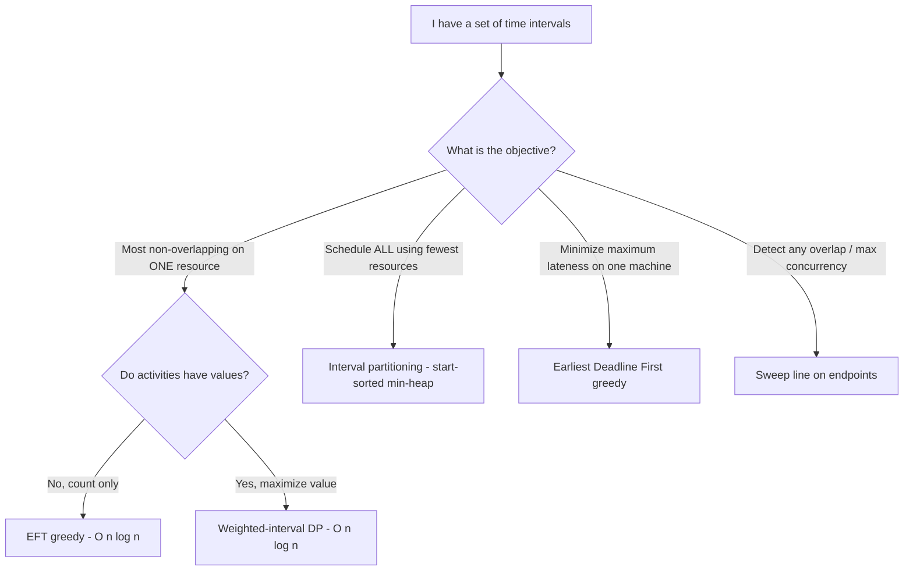

# Activity Selection — Middle Level

> At the middle level Activity Selection stops being "sort and sweep" and becomes a lens on **why** the earliest-finish-time greedy is optimal, **when** it is the right tool versus dynamic programming or interval partitioning, and **how** the same Laplacian-free interval machinery extends to weighted values, multiple resources, deadlines, and online arrival.

## Table of Contents

1. [Recap and Framing](#recap-and-framing)
2. [Why Earliest-Finish-Time Is Optimal (Intuition + Stay-Ahead)](#why-earliest-finish-time-is-optimal-intuition--stay-ahead)
3. [Why the Other Greedy Rules Fail (Counterexamples)](#why-the-other-greedy-rules-fail-counterexamples)
4. [Comparison: Greedy vs Brute Force vs DP](#comparison-greedy-vs-brute-force-vs-dp)
5. [Variant — Weighted Interval Scheduling (Needs DP)](#variant--weighted-interval-scheduling-needs-dp)
6. [Variant — Interval Partitioning (Minimum Resources)](#variant--interval-partitioning-minimum-resources)
7. [Variant — Minimize Maximum Lateness](#variant--minimize-maximum-lateness)
8. [Variant — Online / Streaming Activity Selection](#variant--online--streaming-activity-selection)
9. [The Recursive Formulation and Optimal Substructure](#the-recursive-formulation-and-optimal-substructure)
10. [Reconstructing the Schedule, Not Just the Count](#reconstructing-the-schedule-not-just-the-count)
11. [Where This Shows Up in Real Systems](#where-this-shows-up-in-real-systems)
12. [Code: Count, Schedule, and a DP Baseline](#code-count-schedule-and-a-dp-baseline)
13. [Performance Analysis](#performance-analysis)
14. [Trade-off Decision Guide](#trade-off-decision-guide)
15. [Edge Cases & Pitfalls](#edge-cases--pitfalls)
16. [Best Practices](#best-practices)
17. [Cheat Sheet](#cheat-sheet)
18. [Summary](#summary)
19. [Further Reading](#further-reading)

---

## Recap and Framing

The basic problem: given `n` activities, each a half-open interval `[s_i, f_i)`, select the **maximum number** that are pairwise non-overlapping on a single resource. The junior recipe:

1. Sort by finish time ascending.
2. Sweep: keep a running `lastEnd`; select activity `i` iff `s_i ≥ lastEnd`, then set `lastEnd = f_i`.

`O(n log n)` time, `O(1)` extra space. At this level we answer three deeper questions:

- **Why** is earliest-finish-time the *only* greedy key that is optimal? (A stay-ahead / exchange argument.)
- **When** does greedy stop working, so that DP or a different greedy takes over? (Weights, multiple resources, deadlines.)
- **How** do the close cousins — weighted interval scheduling, interval partitioning, minimum lateness — relate, so you can recognize which one an interview or a real system actually needs.

A crisp mental model: activity selection is **interval scheduling maximization on one machine, unweighted**. Change any one of those qualifiers — add weights, add machines, change the objective — and you change the algorithm.

Three qualifiers, three independent axes:

- **Weighted vs unweighted** — values present? → DP, not greedy.
- **One resource vs many** — schedule all on fewest? → interval partitioning.
- **Maximize count vs minimize lateness vs measure concurrency** — the objective itself.

Activity selection sits at the origin of all three axes (unweighted, one resource, maximize count). Every named variant in this file is one step along one axis.

---

## Why Earliest-Finish-Time Is Optimal (Intuition + Stay-Ahead)

The middle-level argument is the **"greedy stays ahead"** lemma (the full formal exchange argument is in `professional.md`).

Let the greedy pick activities `g₁, g₂, …, g_k` (in selection order, which is finish order). Let any optimal solution be `o₁, o₂, …, o_m` sorted by finish time. Claim: **for every `r`, the `r`-th greedy activity finishes no later than the `r`-th optimal activity**, i.e. `f(g_r) ≤ f(o_r)`.

- **Base `r = 1`.** Greedy picks the globally earliest finisher, so `f(g₁) ≤ f(o₁)`.
- **Inductive step.** Suppose `f(g_{r-1}) ≤ f(o_{r-1})`. Optimal's `o_r` starts at `s(o_r) ≥ f(o_{r-1}) ≥ f(g_{r-1})`, so `o_r` is *compatible* with greedy's first `r−1` picks and was *available* when greedy chose `g_r`. Greedy chose the earliest finisher among available activities, so `f(g_r) ≤ f(o_r)`.

Consequence: greedy never "falls behind." If optimal could fit `m` activities, greedy fits at least `m`, because after `m−1` greedy picks the resource is free no later than after `m−1` optimal picks, leaving room for an `m`-th. Hence `k ≥ m`, and since greedy is a valid solution `k ≤ m`, so `k = m`. **Greedy is optimal.**

The intuition to carry away: *finishing earliest is never a regret*. Any activity you could have picked instead finishes at least as late, so swapping in the earliest finisher only frees up more of the future timeline — it can never cost you a later activity.

### Worked stay-ahead trace

Take activities (already finish-sorted) and an adversarial "optimal" that starts differently:

```
greedy picks:   g1=[1,4)   g2=[5,7)            f(g1)=4,  f(g2)=7
some optimal:   o1=[3,5)   o2=[5,9)            f(o1)=5,  f(o2)=9
```

Check the lemma: `f(g1)=4 ≤ f(o1)=5` ✅ and `f(g2)=7 ≤ f(o2)=9` ✅. Greedy stays at or ahead of optimal at every position, so it can fit at least as many activities. Here both fit 2, but the inequality shows greedy could never have fewer. This is the exact statement the formal exchange argument in `professional.md` upgrades to a full proof.

---

## Why the Other Greedy Rules Fail (Counterexamples)

Showing a single counterexample is enough to kill a greedy rule. Keep these in your pocket:

**Earliest start time — FAILS.**

```
A = [0, 100)   ← starts earliest
B = [1, 2)
C = [3, 4)
```

Earliest-start picks `A` and blocks everything → answer 1. Optimal is `{B, C}` → 2.

**Shortest duration — FAILS.**

```
A = [1, 5)      duration 4
B = [4, 6)      duration 2  ← shortest
C = [6, 10)     duration 4   wait, A and C are compatible already...
```

A sharper one:

```
A = [1, 4)      duration 3
B = [3, 6)      duration 3   ← shortest? tie; make it [3, 5), duration 2 ← shortest
C = [5, 8)      duration 3
```

Shortest-first picks `B = [3, 5)`, which conflicts with both `A` and `C`, giving answer 1. Optimal is `{A, C}` → 2. The short middle activity straddles the boundary and blocks two neighbors.

**Fewest conflicts — FAILS.** There are classic constructions (a central activity overlapping few others but whose selection forces a worse outcome) where minimizing conflict count is suboptimal. The standard counterexample uses three rows of intervals where the activity with the fewest overlaps sits in the middle and, once chosen, knocks out the only optimal pair on either side.

**Latest finish / latest start — FAILS** symmetrically by mirroring the earliest-start counterexample. By symmetry, *latest start time* is actually optimal if you run the sweep backwards in time — it is the time-reversed twin of earliest-finish — but as a forward rule on finish-sorted data it is wrong.

Only **earliest finish time** survives every counterexample, and the stay-ahead proof above is *why*.

### A compact table of which keys work

| Greedy key | Optimal for max-count? | Why / counterexample |
|------------|------------------------|----------------------|
| Earliest **finish** | ✅ Yes | Stay-ahead lemma; leaves the most future room. |
| Earliest start | ❌ No | `[0,100)` starts first, blocks everything. |
| Shortest duration | ❌ No | A short middle interval straddles and blocks two. |
| Fewest conflicts | ❌ No | Adversarial three-row construction. |
| Latest finish (forward) | ❌ No | Mirror of earliest-start failure. |
| Latest start (backward sweep) | ✅ Yes | Time-reversed earliest-finish — same algorithm reflected. |

---

## Comparison: Greedy vs Brute Force vs DP

| Approach | Time | Space | Optimal? | When to use |
|----------|------|-------|----------|-------------|
| Brute-force subsets | `O(2^n · n)` | `O(n)` | Yes | Only `n ≤ ~20`; as a test oracle. |
| **EFT greedy** | `O(n log n)` | `O(1)` | **Yes (unweighted)** | The default for "maximum *count*" on one resource. |
| Weighted-interval DP | `O(n log n)` | `O(n)` | Yes (weighted) | When activities have **values** and you want max total value. |
| Interval-partition greedy | `O(n log n)` | `O(n)` | Yes (min rooms) | When you must schedule **all** activities on the fewest resources. |
| EDF / lateness greedy | `O(n log n)` | `O(1)` | Yes (min max lateness) | When the objective is **deadline lateness**, not count. |

**Strategic rule:** if the objective is *count of non-overlapping intervals on one resource* → EFT greedy. The moment the objective changes (value, rooms, lateness), the algorithm changes even though the input still looks like "a bunch of intervals."

---

## Variant — Weighted Interval Scheduling (Needs DP)

Now each activity has a **value** `v_i` and you want the maximum **total value** of a compatible set — not the maximum count. The EFT greedy is **no longer optimal**: a single high-value long activity can beat many low-value short ones.

```
A = [1, 4)  value 1
B = [3, 5)  value 1
C = [0, 10) value 5     ← greedy by finish takes A then maybe B (value 2); optimal is C (value 5)
```

The correct method is **dynamic programming**:

1. Sort by finish time.
2. For each activity `i`, compute `p(i)` = the largest index `j < i` with `f_j ≤ s_i` (the latest compatible predecessor), found by binary search.
3. `dp[i] = max(dp[i−1], v_i + dp[p(i)])` — either skip `i`, or take `i` plus the best solution that ends before `i` starts.

Time `O(n log n)` (sort + binary searches), space `O(n)`. The unweighted activity selection is the special case `v_i = 1`, where greedy happens to equal the DP — but only because all weights are equal. This is the single most important "when greedy breaks" fact at the middle level.

---

## Variant — Interval Partitioning (Minimum Resources)

Different objective: schedule **every** activity, using the **fewest resources** (e.g. minimum number of rooms so no two overlapping meetings share a room). The answer equals the **maximum overlap (depth)** at any instant — the largest number of activities live at once.

Greedy algorithm:

1. Sort activities by **start** time.
2. Keep a min-heap of resources keyed by their current free-time (the finish of their last assigned activity).
3. For each activity, if the earliest-free resource is free by its start (`heap top ≤ start`), reuse it; otherwise open a new resource. Push the updated free-time.

The heap size at the end is the number of rooms = the maximum depth. Time `O(n log n)`. Notice the *sort key flips to start time* and a *heap* replaces the single `lastEnd` scalar — a clean illustration that "intervals" alone do not determine the algorithm; the objective does.

---

## Variant — Minimize Maximum Lateness

Yet another objective: each job has a processing length and a **deadline**; schedule all jobs on one machine (no overlaps, but you choose the order/start) to minimize the maximum lateness `max(0, completion − deadline)`. The optimal greedy is **Earliest Deadline First (EDF)**: sort by deadline ascending and run jobs in that order with no idle gaps. An exchange argument (swap any out-of-deadline-order adjacent pair without increasing max lateness) proves optimality — the same proof *shape* as activity selection but a different key (deadline) and a different objective. Recognizing the shared exchange-argument skeleton is a middle-level superpower.

---

## Variant — Online / Streaming Activity Selection

If activities arrive in a stream **already ordered by finish time**, you do not need to store them: maintain `lastEnd`, and accept each arriving activity iff `start ≥ lastEnd`. This is a true online algorithm with `O(1)` memory and `O(1)` per activity — and it is still optimal, because the offline greedy also processes in finish order. If arrivals are *not* finish-ordered, you cannot be optimal online in general (an adversary can make any immediate decision regrettable), which is why the offline sort is essential when order is arbitrary.

A subtle point: "finish-ordered arrival" is common in practice when activities are *committed* in real time and a committed activity can never be revoked — each new request's finish is in the future, hence later than everything already settled. In that streaming-commit setting the `O(1)` online greedy is exactly right and is what a reservation system actually runs.

If, instead, requests may be *reconsidered* (you can revoke a tentative acceptance when a better-fitting one arrives), you are no longer in the pure online model and can recover offline-optimality by buffering and re-running the sweep — at the cost of `O(n)` memory. The choice between the `O(1)` commit-once online sweep and the buffered offline sweep is a real systems trade-off, not a textbook detail.

---

## The Recursive Formulation and Optimal Substructure

CLRS presents activity selection first as a recursion, which makes the *optimal substructure* explicit and motivates the greedy. Define `S_{ij}` as the set of activities that start after `f_i` and finish before `s_j` (using two sentinel activities `a_0` with `f_0 = 0` and `a_{n+1}` with `s_{n+1} = ∞`). Let `c[i][j]` be the size of a maximum compatible subset of `S_{ij}`. Then

```
c[i][j] = 0                                          if S_{ij} is empty
c[i][j] = max over k in S_{ij} of (c[i][k] + 1 + c[k][j])   otherwise
```

That is a perfectly correct `O(n³)` DP. The **greedy theorem** (CLRS Theorem 16.1) says you never need the `max` over all `k`: the activity `a_m` in `S_{ij}` with the **earliest finish time** is always in *some* maximum compatible subset. So the recurrence collapses to "take the earliest finisher, then recurse on what remains after it," which is exactly the linear sweep. Seeing the `O(n³)` DP collapse to an `O(n)` sweep (after sorting) is the cleanest demonstration of the greedy-choice property turning dynamic programming into a single scan.

A direct recursive greedy (assuming activities sorted by finish, with sentinel `f_0 = 0`):

```python
def recursive_select(acts, k, n, chosen):
    m = k + 1
    while m < n and acts[m][0] < acts[k][1]:   # skip activities overlapping a_k
        m += 1
    if m < n:
        chosen.append(m)
        recursive_select(acts, m, n, chosen)    # tail recursion = the sweep
    return chosen
```

This tail-recursive form is the same algorithm as the iterative sweep; production code uses the loop to avoid stack depth.

---

## Reconstructing the Schedule, Not Just the Count

Both the greedy and the DP can return the actual chosen activities, not just a number.

- **Greedy:** record each index as you select it (Pattern 2 from `junior.md`). The chosen list *is* the schedule, already in time order.
- **Weighted DP:** keep the `dp` table, then walk backwards: at index `i`, if `v_i + dp[p(i)+1] ≥ dp[i−1]` the activity `i` is in the optimum (take it, jump to `p(i)`); otherwise skip to `i−1`. This `O(n)` backtrack reconstructs the value-maximizing set.

Always clarify with the caller whether they want the *number*, the *set*, or *both*. A scheduling service almost always needs the set (to actually book the rooms); a feasibility check often needs only the count.

---

## Where This Shows Up in Real Systems

- **Meeting-room / calendar systems** — "fit the most meetings into one room" is literal activity selection. Multi-room ("fit all meetings into the fewest rooms") is interval partitioning.
- **CPU / job scheduling on one machine** — maximize the number of non-conflicting fixed-time jobs a single worker can run; weighted variants (job values, SLAs) push you to DP or other schedulers.
- **Bandwidth / channel reservation** — accept the maximum number of non-overlapping reservation requests on a single channel.
- **Ad-slot / broadcast scheduling** — choose the most non-overlapping spots for one slot; with revenue per spot it becomes weighted scheduling.
- **Manufacturing / machine-time allocation** — a single machine that can hold one job at a time; EFT greedy maximizes throughput count.
- **Conference / classroom timetabling** — single-room maximization, or multi-room partitioning for the whole program.

The recurring lesson for a middle engineer: stakeholders often *say* "schedule the meetings" but *mean* one of four distinct problems. Pin down the objective (count vs value vs rooms vs lateness) before writing a line of code.

---

## Code: Count, Schedule, and a DP Baseline

We give the optimal EFT greedy (count + chosen indices) and, for contrast, the weighted-interval DP that the greedy must defer to when activities carry values. All three languages print the unweighted greedy count `2` and the weighted DP optimum `5` for the worked examples.

#### Go

```go
package main

import (
	"fmt"
	"sort"
)

type Activity struct{ Start, Finish, Value int }

// Unweighted EFT greedy: max count of compatible activities.
func maxCount(acts []Activity) int {
	a := append([]Activity(nil), acts...)
	sort.Slice(a, func(i, j int) bool { return a[i].Finish < a[j].Finish })
	count, lastEnd := 0, -1<<62
	for _, x := range a {
		if x.Start >= lastEnd {
			count++
			lastEnd = x.Finish
		}
	}
	return count
}

// Weighted interval scheduling DP: max total value of a compatible set.
func maxValue(acts []Activity) int {
	a := append([]Activity(nil), acts...)
	sort.Slice(a, func(i, j int) bool { return a[i].Finish < a[j].Finish })
	n := len(a)
	// p[i] = latest index j < i with a[j].Finish <= a[i].Start, else -1.
	p := make([]int, n)
	for i := 0; i < n; i++ {
		lo, hi, best := 0, i-1, -1
		for lo <= hi {
			mid := (lo + hi) / 2
			if a[mid].Finish <= a[i].Start {
				best = mid
				lo = mid + 1
			} else {
				hi = mid - 1
			}
		}
		p[i] = best
	}
	dp := make([]int, n+1) // dp[i] uses first i activities (1-indexed)
	for i := 1; i <= n; i++ {
		take := a[i-1].Value
		if p[i-1] >= 0 {
			take += dp[p[i-1]+1]
		}
		skip := dp[i-1]
		if take > skip {
			dp[i] = take
		} else {
			dp[i] = skip
		}
	}
	return dp[n]
}

func main() {
	greedy := []Activity{{1, 4, 1}, {3, 5, 1}, {0, 6, 1}, {5, 7, 1}, {3, 8, 1}, {5, 9, 1}}
	fmt.Println("max count =", maxCount(greedy)) // 2

	weighted := []Activity{{1, 4, 1}, {3, 5, 1}, {0, 10, 5}}
	fmt.Println("max value =", maxValue(weighted)) // 5
}
```

#### Java

```java
import java.util.*;

public class Variants {
    static int maxCount(int[][] acts) {
        int[][] a = Arrays.stream(acts).map(int[]::clone).toArray(int[][]::new);
        Arrays.sort(a, (x, y) -> Integer.compare(x[1], y[1])); // by finish
        int count = 0; long lastEnd = Long.MIN_VALUE;
        for (int[] x : a)
            if (x[0] >= lastEnd) { count++; lastEnd = x[1]; }
        return count;
    }

    // acts[i] = {start, finish, value}
    static int maxValue(int[][] acts) {
        int[][] a = Arrays.stream(acts).map(int[]::clone).toArray(int[][]::new);
        Arrays.sort(a, (x, y) -> Integer.compare(x[1], y[1]));
        int n = a.length;
        int[] p = new int[n];
        for (int i = 0; i < n; i++) {
            int lo = 0, hi = i - 1, best = -1;
            while (lo <= hi) {
                int mid = (lo + hi) >>> 1;
                if (a[mid][1] <= a[i][0]) { best = mid; lo = mid + 1; }
                else hi = mid - 1;
            }
            p[i] = best;
        }
        int[] dp = new int[n + 1];
        for (int i = 1; i <= n; i++) {
            int take = a[i - 1][2] + (p[i - 1] >= 0 ? dp[p[i - 1] + 1] : 0);
            dp[i] = Math.max(dp[i - 1], take);
        }
        return dp[n];
    }

    public static void main(String[] args) {
        int[][] greedy = {{1,4,1},{3,5,1},{0,6,1},{5,7,1},{3,8,1},{5,9,1}};
        System.out.println("max count = " + maxCount(greedy)); // 2
        int[][] weighted = {{1,4,1},{3,5,1},{0,10,5}};
        System.out.println("max value = " + maxValue(weighted)); // 5
    }
}
```

#### Python

```python
from bisect import bisect_right

def max_count(acts):
    a = sorted(acts, key=lambda x: x[1])         # by finish
    count, last_end = 0, float("-inf")
    for s, f, *_ in a:
        if s >= last_end:
            count += 1
            last_end = f
    return count

def max_value(acts):
    """acts: list of (start, finish, value). Weighted interval scheduling DP."""
    a = sorted(acts, key=lambda x: x[1])
    n = len(a)
    finishes = [x[1] for x in a]
    p = []
    for i in range(n):
        # latest j with finish[j] <= start[i]
        j = bisect_right(finishes, a[i][0], 0, i) - 1
        p.append(j)
    dp = [0] * (n + 1)
    for i in range(1, n + 1):
        take = a[i - 1][2] + (dp[p[i - 1] + 1] if p[i - 1] >= 0 else 0)
        dp[i] = max(dp[i - 1], take)
    return dp[n]


if __name__ == "__main__":
    greedy = [(1, 4, 1), (3, 5, 1), (0, 6, 1), (5, 7, 1), (3, 8, 1), (5, 9, 1)]
    print("max count =", max_count(greedy))   # 2
    weighted = [(1, 4, 1), (3, 5, 1), (0, 10, 5)]
    print("max value =", max_value(weighted)) # 5
```

**What it does:** the optimal `O(n log n)` EFT greedy for the unweighted count, and the `O(n log n)` DP that supersedes it when activities carry values.
**Run:** `go run main.go` | `javac Variants.java && java Variants` | `python variants.py`

---

## Performance Analysis

- **Greedy.** Sort `O(n log n)`; sweep `O(n)`; extra space `O(1)` (besides the array). The sort is the only superlinear step; if the input is already finish-sorted (e.g. an online finish-ordered stream), the whole thing is `O(n)` / `O(1)`.
- **Weighted DP.** Sort `O(n log n)`; computing each `p(i)` by binary search `O(log n)` → `O(n log n)`; the DP table fill is `O(n)`; space `O(n)` for `dp` and `p`. Same asymptotic class as greedy but strictly more work and memory — pay it only when weights matter.
- **Interval partitioning.** Sort by start `O(n log n)`; each activity does one heap push/pop `O(log n)` → `O(n log n)`; heap space `O(n)` in the worst case (all overlapping).
- **Brute force.** `O(2^n · n)` — exponential; reserve for `n ≤ ~20` and as a correctness oracle.

The middle-level performance insight: **all the practical variants share the `O(n log n)` ceiling**, dominated by a sort; what differs is the *sort key* and the *auxiliary structure* (scalar `lastEnd`, a `dp` array, or a min-heap).

### Counting-sort shortcut for bounded integer times

If finish times are integers in a small range `[0, T)`, you can replace the comparison sort with a counting/bucket sort in `O(n + T)`, making the whole greedy `O(n + T)` instead of `O(n log n)`. This matters when `T` is comparable to `n` (e.g. minute-resolution times across a single day, `T = 1440`). For arbitrary or large-range times, stick with the comparison sort.

---

## Trade-off Decision Guide



The decision guide encodes the entire middle-level judgment: *count on one resource* is the only branch where the plain EFT greedy applies. Every other branch — values, multiple resources, lateness, concurrency — is a different (still `O(n log n)`) algorithm wearing the same "intervals" costume.

### Cost/benefit of choosing greedy over DP

| Factor | EFT greedy | Weighted DP |
|--------|-----------|-------------|
| Handles values | No | Yes |
| Extra memory | `O(1)` | `O(n)` |
| Code complexity | Trivial | Moderate (binary-search predecessor) |
| Correct objective | max count | max value |
| Reconstruct schedule | Append-as-you-go | Backtrack over `dp` |

If and only if all weights are equal does the DP's answer coincide with the greedy's; that equivalence is exactly the unweighted special case.

---

## Edge Cases & Pitfalls

- **Equal finish times** — any tie-break yields the same maximum count; for the *weighted* DP, ties are handled correctly by the `bisect_right`/`p(i)` predecessor logic.
- **Touching intervals** (`finish == next start`) — compatible under half-open; the boundary test must be `>=` (greedy) / `<=` (predecessor in DP).
- **Mixing conventions** — using half-open for greedy but closed in the DP predecessor search silently changes both answers; pick one convention everywhere.
- **Assuming greedy solves the weighted version** — the cardinal middle-level mistake; it does not.
- **Forgetting the predecessor is by finish ≤ start, not finish < start** — off-by-one on touching intervals in the DP.
- **Online without finish-ordering** — no online algorithm is optimal on arbitrarily ordered arrivals.

---

## Best Practices

- Name the objective explicitly before coding: *count* (greedy), *value* (DP), *min rooms* (partition heap), *min lateness* (EDF). The objective dictates the algorithm.
- Keep one interval convention (half-open recommended) across greedy *and* DP.
- For the DP, compute predecessors with binary search on the finish array — never a linear scan, or you lose the `O(n log n)`.
- Test every variant against a brute-force oracle on random small inputs; the wrong sort key is otherwise invisible.
- Return both the optimum value/count *and* a reconstructable solution when callers may need the actual schedule.

---

## Cheat Sheet

| Objective | Sort key | Structure | Optimal method | Complexity |
|-----------|----------|-----------|----------------|------------|
| Max count, 1 resource | finish ↑ | scalar `lastEnd` | **EFT greedy** | `O(n log n)` |
| Max value, 1 resource | finish ↑ | `dp[]` + binary search | weighted-interval DP | `O(n log n)` |
| Schedule all, min resources | start ↑ | min-heap of free-times | partition greedy | `O(n log n)` |
| Min max lateness, 1 machine | deadline ↑ | order, no idle | EDF greedy | `O(n log n)` |

```
EFT greedy optimal because: greedy stays ahead — f(g_r) ≤ f(o_r) for all r
wrong keys: earliest start, shortest duration, fewest conflicts — all break
weighted ⇒ DP:  dp[i] = max(dp[i-1], v_i + dp[p(i)]),  p(i) = latest j with f_j ≤ s_i
```

---

## Summary

At the middle level, Activity Selection is the unweighted, single-resource, maximize-count member of the interval-scheduling family, and its earliest-finish-time greedy is optimal by a "greedy stays ahead" argument: at every step greedy's chosen finish time is no later than any optimal solution's, so it never falls behind and matches the optimum count. Every *other* natural greedy key — earliest start, shortest duration, fewest conflicts — dies to a small counterexample. The crucial judgment is recognizing when the problem leaves activity-selection territory: add **values** and you need the weighted-interval DP (`dp[i] = max(dp[i−1], v_i + dp[p(i)])`); demand that **all** activities be scheduled on the fewest resources and you switch to the start-sorted min-heap interval-partition greedy; change the objective to **lateness** and you switch to Earliest-Deadline-First. All of these share an `O(n log n)` sort-dominated cost and an exchange-argument flavor of proof; what changes is the sort key and the auxiliary structure. Knowing *which* of these a given problem is — and proving the chosen greedy with a stay-ahead/exchange argument — is the middle-level mastery.

---

## Further Reading

- CLRS §16.1–16.2 — activity selection plus the elements of the greedy strategy (greedy-choice property, optimal substructure).
- Kleinberg & Tardos §4.1–4.2 — interval scheduling, interval partitioning, and "minimize lateness," all with exchange-argument proofs.
- Sibling topic `weighted-interval-scheduling` — the DP that supersedes greedy when values matter.
- Sibling topic `interval-partitioning` — minimum-rooms via the start-sorted min-heap.
- The `greedy-algorithms` skill — greedy-choice property, optimal substructure, and exchange-argument templates.
- The `dynamic-programming` skill — the framework behind the weighted variant.
- The `sliding-window-technique` and sweep-line ideas — for "maximum concurrency / detect overlap" objectives that share interval input but differ in goal.

---

## Appendix: One-Glance Variant Map

To leave the middle level with the right reflex, memorize this mapping from *what the stakeholder said* to *the actual algorithm*:

| Stakeholder phrasing | Real problem | Algorithm |
|----------------------|-------------|-----------|
| "Fit as many meetings as possible in this room" | max count, one resource | EFT greedy |
| "Pick the most valuable set of bookings for this slot" | max value, one resource | weighted-interval DP |
| "Use as few rooms as possible for all meetings" | min resources, schedule all | start-sorted min-heap partition |
| "No job should be too late" | min max lateness, one machine | Earliest Deadline First |
| "How many meetings overlap at the busiest moment?" | max concurrency | endpoint sweep line |

Every row consumes the same `(start, finish)` intervals; only the objective — and therefore the algorithm — changes. Identifying the row correctly is more than half the battle, and it is precisely the skill that separates a middle engineer from someone who reflexively reaches for the first greedy they remember.
